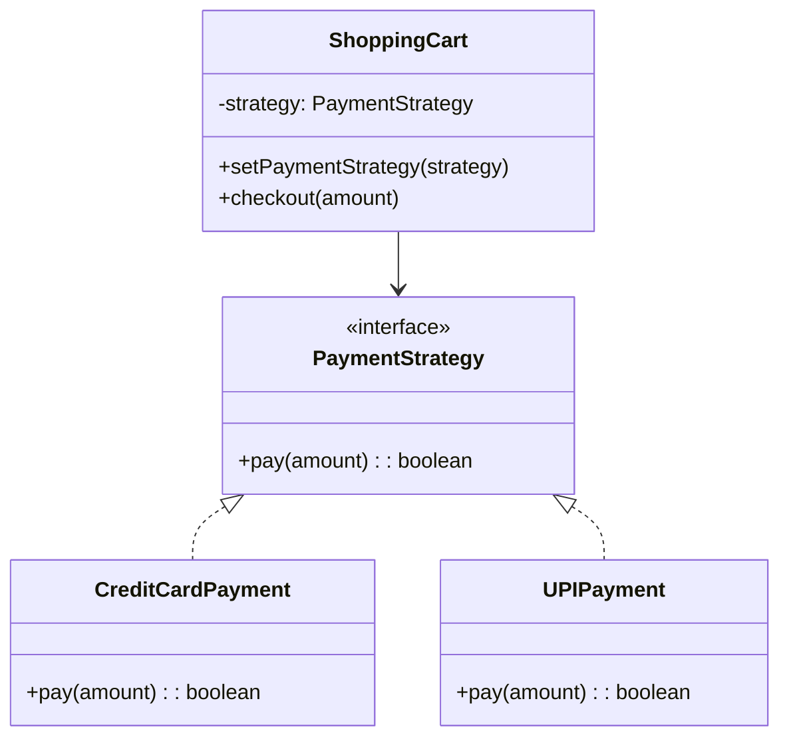
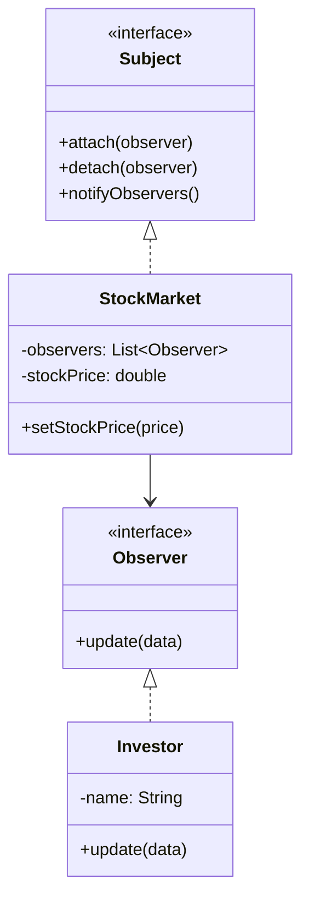
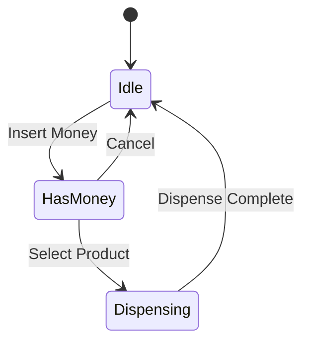
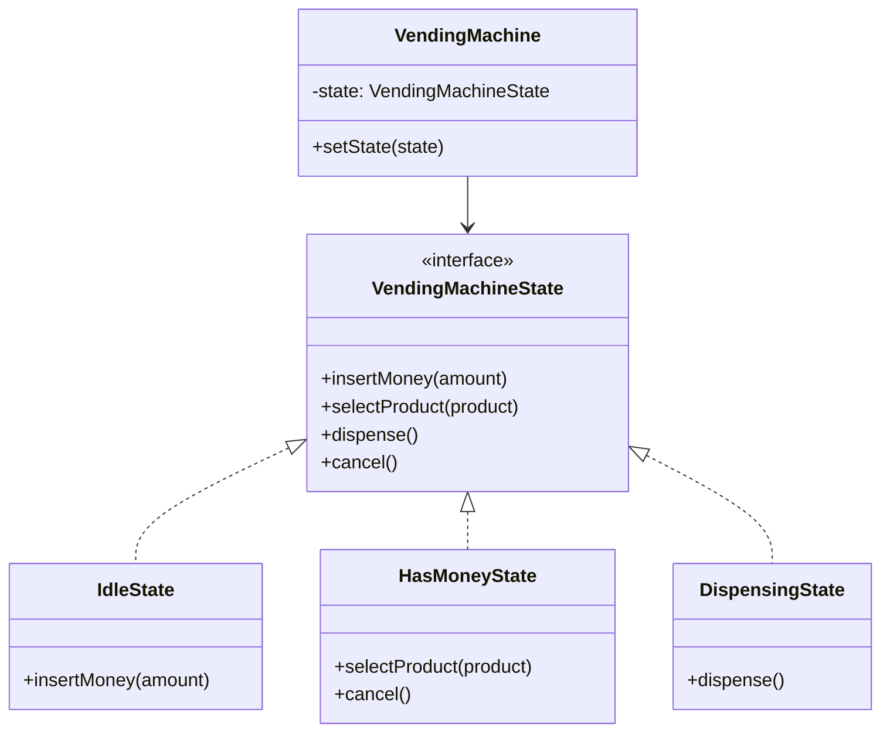

[🏠 Home](../../../README.md) | [⬅️ Structural Patterns](./02-structural-patterns.md) | [➡️ Common Designs](../04-common-designs/01-parking-lot.md)

# 🎭 Behavioral Design Patterns

> Patterns that deal with object interaction and responsibility distribution

---

## 1. Strategy Pattern

### Intent
Define a family of algorithms, encapsulate each one, and make them interchangeable. Strategy lets the algorithm vary independently from clients that use it.

### When to Use
- Multiple algorithms for a task (sorting, payment, pricing)
- Need to switch algorithms at runtime
- Avoid conditional statements for algorithm selection

### Class Diagram



### Implementation

```java
// Strategy interface
public interface PaymentStrategy {
    boolean pay(double amount);
    String getName();
}

// Concrete strategies
public class CreditCardPayment implements PaymentStrategy {
    private final String cardNumber;
    private final String cvv;

    public CreditCardPayment(String cardNumber, String cvv) {
        this.cardNumber = cardNumber;
        this.cvv = cvv;
    }

    @Override
    public boolean pay(double amount) {
        System.out.printf("Paid ₹%.2f using Credit Card ending %s%n", 
                          amount, cardNumber.substring(cardNumber.length() - 4));
        return true;
    }

    @Override
    public String getName() { return "Credit Card"; }
}

public class UPIPayment implements PaymentStrategy {
    private final String upiId;

    public UPIPayment(String upiId) {
        this.upiId = upiId;
    }

    @Override
    public boolean pay(double amount) {
        System.out.printf("Paid ₹%.2f using UPI: %s%n", amount, upiId);
        return true;
    }

    @Override
    public String getName() { return "UPI"; }
}

public class WalletPayment implements PaymentStrategy {
    private final String walletId;
    private double balance;

    public WalletPayment(String walletId, double balance) {
        this.walletId = walletId;
        this.balance = balance;
    }

    @Override
    public boolean pay(double amount) {
        if (balance >= amount) {
            balance -= amount;
            System.out.printf("Paid ₹%.2f using Wallet. Balance: ₹%.2f%n", amount, balance);
            return true;
        }
        System.out.println("Insufficient wallet balance!");
        return false;
    }

    @Override
    public String getName() { return "Wallet"; }
}

// Context
public class ShoppingCart {
    private List<Item> items = new ArrayList<>();
    private PaymentStrategy paymentStrategy;

    public void addItem(Item item) {
        items.add(item);
    }

    public void setPaymentStrategy(PaymentStrategy strategy) {
        this.paymentStrategy = strategy;
    }

    public double calculateTotal() {
        return items.stream().mapToDouble(Item::getPrice).sum();
    }

    public boolean checkout() {
        if (paymentStrategy == null) {
            throw new IllegalStateException("Payment strategy not set");
        }
        double total = calculateTotal();
        return paymentStrategy.pay(total);
    }
}

// Usage
ShoppingCart cart = new ShoppingCart();
cart.addItem(new Item("Laptop", 50000));
cart.addItem(new Item("Mouse", 500));

// Pay with Credit Card
cart.setPaymentStrategy(new CreditCardPayment("1234567890123456", "123"));
cart.checkout();

// Pay with UPI
cart.setPaymentStrategy(new UPIPayment("user@upi"));
cart.checkout();
```

---

## 2. Observer Pattern

### Intent
Define a one-to-many dependency between objects so that when one object changes state, all its dependents are notified and updated automatically.

### When to Use
- Event handling systems
- Notification systems
- Data binding in UI frameworks
- Pub-sub messaging

### Class Diagram



### Implementation

```java
// Observer interface
public interface Observer {
    void update(String stockSymbol, double price);
}

// Subject interface
public interface Subject {
    void attach(Observer observer);
    void detach(Observer observer);
    void notifyObservers();
}

// Concrete Subject
public class StockMarket implements Subject {
    private final Map<String, Double> stocks = new HashMap<>();
    private final List<Observer> observers = new ArrayList<>();
    private String lastUpdatedStock;

    @Override
    public void attach(Observer observer) {
        observers.add(observer);
    }

    @Override
    public void detach(Observer observer) {
        observers.remove(observer);
    }

    @Override
    public void notifyObservers() {
        double price = stocks.get(lastUpdatedStock);
        for (Observer observer : observers) {
            observer.update(lastUpdatedStock, price);
        }
    }

    public void setStockPrice(String symbol, double price) {
        this.stocks.put(symbol, price);
        this.lastUpdatedStock = symbol;
        notifyObservers();
    }
}

// Concrete Observers
public class InvestorApp implements Observer {
    private final String investorName;

    public InvestorApp(String name) {
        this.investorName = name;
    }

    @Override
    public void update(String stockSymbol, double price) {
        System.out.printf("[%s] Alert: %s is now ₹%.2f%n", 
                          investorName, stockSymbol, price);
    }
}

public class TradingBot implements Observer {
    private final String botName;
    private final double buyThreshold;

    public TradingBot(String name, double buyThreshold) {
        this.botName = name;
        this.buyThreshold = buyThreshold;
    }

    @Override
    public void update(String stockSymbol, double price) {
        if (price < buyThreshold) {
            System.out.printf("[%s] AUTO-BUY: %s at ₹%.2f (below threshold ₹%.2f)%n",
                              botName, stockSymbol, price, buyThreshold);
        }
    }
}

// Usage
StockMarket market = new StockMarket();

Observer investor1 = new InvestorApp("Rahul");
Observer investor2 = new InvestorApp("Priya");
Observer bot = new TradingBot("AutoTrader", 1500);

market.attach(investor1);
market.attach(investor2);
market.attach(bot);

market.setStockPrice("INFY", 1450);
// [Rahul] Alert: INFY is now ₹1450.00
// [Priya] Alert: INFY is now ₹1450.00
// [AutoTrader] AUTO-BUY: INFY at ₹1450.00 (below threshold ₹1500.00)

market.setStockPrice("TCS", 3500);
// [Rahul] Alert: TCS is now ₹3500.00
// [Priya] Alert: TCS is now ₹3500.00
```

---

## 3. State Pattern

### Intent
Allow an object to alter its behavior when its internal state changes. The object will appear to change its class.

### When to Use
- Object behavior depends on state
- Vending machine, ATM, order status
- Replacing complex state conditionals

### Class Diagram





### Implementation

```java
// State interface
public interface VendingMachineState {
    void insertMoney(double amount);
    void selectProduct(String product);
    void dispense();
    void cancel();
}

// Context
public class VendingMachine {
    private VendingMachineState state;
    private double balance;
    private String selectedProduct;
    private final Map<String, Double> products;

    public VendingMachine() {
        this.products = Map.of("Coke", 20.0, "Pepsi", 20.0, "Water", 10.0);
        this.state = new IdleState(this);
    }

    public void setState(VendingMachineState state) { this.state = state; }
    public double getBalance() { return balance; }
    public void addBalance(double amount) { this.balance += amount; }
    public void resetBalance() { this.balance = 0; }
    public void setSelectedProduct(String product) { this.selectedProduct = product; }
    public String getSelectedProduct() { return selectedProduct; }
    public Map<String, Double> getProducts() { return products; }

    public void insertMoney(double amount) { state.insertMoney(amount); }
    public void selectProduct(String product) { state.selectProduct(product); }
    public void dispense() { state.dispense(); }
    public void cancel() { state.cancel(); }
}

// Concrete States
public class IdleState implements VendingMachineState {
    private final VendingMachine machine;

    public IdleState(VendingMachine machine) {
        this.machine = machine;
    }

    @Override
    public void insertMoney(double amount) {
        machine.addBalance(amount);
        System.out.println("Inserted ₹" + amount + ". Balance: ₹" + machine.getBalance());
        machine.setState(new HasMoneyState(machine));
    }

    @Override
    public void selectProduct(String product) {
        System.out.println("Please insert money first");
    }

    @Override
    public void dispense() {
        System.out.println("Please insert money and select a product");
    }

    @Override
    public void cancel() {
        System.out.println("Nothing to cancel");
    }
}

public class HasMoneyState implements VendingMachineState {
    private final VendingMachine machine;

    public HasMoneyState(VendingMachine machine) {
        this.machine = machine;
    }

    @Override
    public void insertMoney(double amount) {
        machine.addBalance(amount);
        System.out.println("Added ₹" + amount + ". Balance: ₹" + machine.getBalance());
    }

    @Override
    public void selectProduct(String product) {
        Double price = machine.getProducts().get(product);
        if (price == null) {
            System.out.println("Product not available");
            return;
        }
        if (machine.getBalance() < price) {
            System.out.println("Insufficient balance. Need ₹" + (price - machine.getBalance()) + " more");
            return;
        }
        machine.setSelectedProduct(product);
        machine.setState(new DispensingState(machine));
        machine.dispense();
    }

    @Override
    public void dispense() {
        System.out.println("Please select a product first");
    }

    @Override
    public void cancel() {
        System.out.println("Returning ₹" + machine.getBalance());
        machine.resetBalance();
        machine.setState(new IdleState(machine));
    }
}

public class DispensingState implements VendingMachineState {
    private final VendingMachine machine;

    public DispensingState(VendingMachine machine) {
        this.machine = machine;
    }

    @Override
    public void insertMoney(double amount) {
        System.out.println("Please wait, dispensing...");
    }

    @Override
    public void selectProduct(String product) {
        System.out.println("Please wait, dispensing...");
    }

    @Override
    public void dispense() {
        String product = machine.getSelectedProduct();
        double price = machine.getProducts().get(product);
        System.out.println("Dispensing " + product);
        double change = machine.getBalance() - price;
        if (change > 0) {
            System.out.println("Returning change: ₹" + change);
        }
        machine.resetBalance();
        machine.setSelectedProduct(null);
        machine.setState(new IdleState(machine));
    }

    @Override
    public void cancel() {
        System.out.println("Cannot cancel while dispensing");
    }
}

// Usage
VendingMachine vm = new VendingMachine();
vm.insertMoney(50);        // Inserted ₹50. Balance: ₹50
vm.selectProduct("Coke");  // Dispensing Coke, Returning change: ₹30
vm.selectProduct("Water"); // Please insert money first
```

---

## 4. Command Pattern

### Intent
Encapsulate a request as an object, thereby allowing parameterization of clients with different requests, queuing of requests, and support for undoable operations.

### When to Use
- Undo/Redo functionality
- Queuing operations
- Logging operations
- Macro commands

### Implementation

```java
// Command interface
public interface Command {
    void execute();
    void undo();
}

// Receiver
public class TextEditor {
    private StringBuilder text = new StringBuilder();

    public void insertText(String str, int position) {
        text.insert(position, str);
    }

    public void deleteText(int start, int length) {
        text.delete(start, start + length);
    }

    public String getText() {
        return text.toString();
    }
}

// Concrete Commands
public class InsertCommand implements Command {
    private final TextEditor editor;
    private final String text;
    private final int position;

    public InsertCommand(TextEditor editor, String text, int position) {
        this.editor = editor;
        this.text = text;
        this.position = position;
    }

    @Override
    public void execute() {
        editor.insertText(text, position);
    }

    @Override
    public void undo() {
        editor.deleteText(position, text.length());
    }
}

public class DeleteCommand implements Command {
    private final TextEditor editor;
    private final int position;
    private final int length;
    private String deletedText;

    public DeleteCommand(TextEditor editor, int position, int length) {
        this.editor = editor;
        this.position = position;
        this.length = length;
    }

    @Override
    public void execute() {
        deletedText = editor.getText().substring(position, position + length);
        editor.deleteText(position, length);
    }

    @Override
    public void undo() {
        editor.insertText(deletedText, position);
    }
}

// Invoker
public class EditorInvoker {
    private final Stack<Command> undoStack = new Stack<>();
    private final Stack<Command> redoStack = new Stack<>();

    public void execute(Command command) {
        command.execute();
        undoStack.push(command);
        redoStack.clear();
    }

    public void undo() {
        if (!undoStack.isEmpty()) {
            Command command = undoStack.pop();
            command.undo();
            redoStack.push(command);
        }
    }

    public void redo() {
        if (!redoStack.isEmpty()) {
            Command command = redoStack.pop();
            command.execute();
            undoStack.push(command);
        }
    }
}

// Usage
TextEditor editor = new TextEditor();
EditorInvoker invoker = new EditorInvoker();

invoker.execute(new InsertCommand(editor, "Hello", 0));
System.out.println(editor.getText()); // Hello

invoker.execute(new InsertCommand(editor, " World", 5));
System.out.println(editor.getText()); // Hello World

invoker.undo();
System.out.println(editor.getText()); // Hello

invoker.redo();
System.out.println(editor.getText()); // Hello World
```

---

## 5. Template Method Pattern

### Intent
Define the skeleton of an algorithm in an operation, deferring some steps to subclasses.

### Implementation

```java
public abstract class OrderProcessor {
    // Template method
    public final void processOrder(Order order) {
        validateOrder(order);
        calculateTotal(order);
        applyDiscount(order);      // Hook - can be overridden
        processPayment(order);
        sendConfirmation(order);
    }

    private void validateOrder(Order order) {
        System.out.println("Validating order...");
    }

    private void calculateTotal(Order order) {
        System.out.println("Calculating total: ₹" + order.getTotal());
    }

    // Hook method - optional override
    protected void applyDiscount(Order order) {
        // Default: no discount
    }

    protected abstract void processPayment(Order order);

    private void sendConfirmation(Order order) {
        System.out.println("Order confirmed! Sending email...");
    }
}

public class OnlineOrderProcessor extends OrderProcessor {
    @Override
    protected void applyDiscount(Order order) {
        System.out.println("Applying 10% online discount");
        order.setTotal(order.getTotal() * 0.9);
    }

    @Override
    protected void processPayment(Order order) {
        System.out.println("Processing online payment via UPI/Card");
    }
}

public class CODOrderProcessor extends OrderProcessor {
    @Override
    protected void processPayment(Order order) {
        System.out.println("Payment will be collected on delivery");
    }
}
```

---

## 📊 Pattern Comparison

| Pattern | Purpose | Key Characteristic |
|---------|---------|-------------------|
| Strategy | Interchangeable algorithms | Composition, runtime swap |
| Observer | Event notification | One-to-many relationship |
| State | State-dependent behavior | Object appears to change class |
| Command | Encapsulate requests | Undo/redo support |
| Template | Algorithm skeleton | Inheritance, hooks |

---

## 📝 Interview Questions

### Q1: Strategy vs State Pattern?

**Answer**:
- **Strategy**: Client chooses which algorithm to use
- **State**: State transitions happen internally based on context

### Q2: When to use Observer vs Pub-Sub?

**Answer**:
- **Observer**: Direct coupling between subject and observers
- **Pub-Sub**: Decoupled via message broker/event bus (better for distributed systems)

### Q3: Real-world Command pattern examples?

**Answer**:
- Text editor undo/redo
- Database transactions
- Task scheduling systems
- Remote controls

---

*Next: [Parking Lot Design →](../04-common-designs/01-parking-lot.md)*
