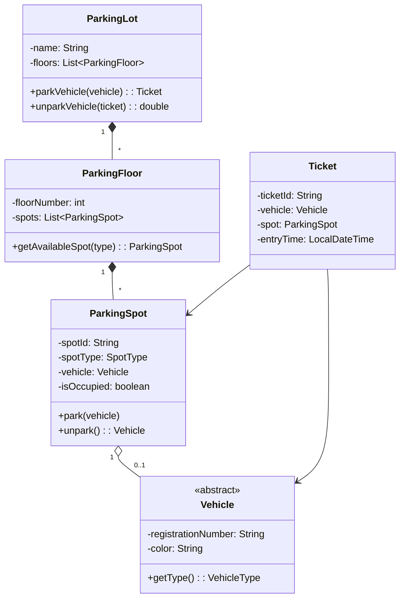

[🏠 Home](../../../README.md) | [⬅️ Behavioral Patterns](../03-design-patterns/03-behavioral-patterns.md) | [➡️ Elevator System](./02-elevator-system.md)

# 🅿️ Parking Lot System Design

> The most frequently asked LLD interview problem

---

## 📋 Requirements

### Functional Requirements
1. Multiple floors with parking spots
2. Different vehicle types: Motorcycle, Car, Truck
3. Different spot sizes: Small, Medium, Large
4. Entry/Exit points with ticket generation
5. Hourly rate-based fee calculation
6. Display available spots per floor

### Non-Functional Requirements
- Thread-safe for concurrent entry/exit
- Scalable to multiple parking lots

---

## 🎯 Entities Identification



---

## 💻 Implementation

### Enums

```java
public enum VehicleType {
    MOTORCYCLE,
    CAR,
    TRUCK
}

public enum SpotType {
    SMALL,      // For motorcycles
    MEDIUM,     // For cars
    LARGE       // For trucks
}
```

### Vehicle Classes

```java
public abstract class Vehicle {
    private final String registrationNumber;
    private final String color;

    public Vehicle(String registrationNumber, String color) {
        this.registrationNumber = registrationNumber;
        this.color = color;
    }

    public abstract VehicleType getType();
    public String getRegistrationNumber() { return registrationNumber; }
    public String getColor() { return color; }
}

public class Motorcycle extends Vehicle {
    public Motorcycle(String regNo, String color) {
        super(regNo, color);
    }

    @Override
    public VehicleType getType() { return VehicleType.MOTORCYCLE; }
}

public class Car extends Vehicle {
    public Car(String regNo, String color) {
        super(regNo, color);
    }

    @Override
    public VehicleType getType() { return VehicleType.CAR; }
}

public class Truck extends Vehicle {
    public Truck(String regNo, String color) {
        super(regNo, color);
    }

    @Override
    public VehicleType getType() { return VehicleType.TRUCK; }
}
```

### Parking Spot

```java
public class ParkingSpot {
    private final String spotId;
    private final SpotType spotType;
    private Vehicle vehicle;
    private boolean isOccupied;

    public ParkingSpot(String spotId, SpotType spotType) {
        this.spotId = spotId;
        this.spotType = spotType;
        this.isOccupied = false;
    }

    public synchronized boolean park(Vehicle vehicle) {
        if (isOccupied) {
            return false;
        }
        if (!canFitVehicle(vehicle)) {
            return false;
        }
        this.vehicle = vehicle;
        this.isOccupied = true;
        return true;
    }

    public synchronized Vehicle unpark() {
        if (!isOccupied) {
            return null;
        }
        Vehicle parkedVehicle = this.vehicle;
        this.vehicle = null;
        this.isOccupied = false;
        return parkedVehicle;
    }

    private boolean canFitVehicle(Vehicle vehicle) {
        return switch (vehicle.getType()) {
            case MOTORCYCLE -> spotType == SpotType.SMALL || 
                               spotType == SpotType.MEDIUM || 
                               spotType == SpotType.LARGE;
            case CAR -> spotType == SpotType.MEDIUM || spotType == SpotType.LARGE;
            case TRUCK -> spotType == SpotType.LARGE;
        };
    }

    // Getters
    public String getSpotId() { return spotId; }
    public SpotType getSpotType() { return spotType; }
    public boolean isOccupied() { return isOccupied; }
    public Vehicle getVehicle() { return vehicle; }
}
```

### Parking Floor

```java
public class ParkingFloor {
    private final int floorNumber;
    private final List<ParkingSpot> spots;
    private final Map<SpotType, Integer> availableSpots;

    public ParkingFloor(int floorNumber, int smallSpots, int mediumSpots, int largeSpots) {
        this.floorNumber = floorNumber;
        this.spots = new ArrayList<>();
        this.availableSpots = new ConcurrentHashMap<>();

        // Initialize spots
        for (int i = 0; i < smallSpots; i++) {
            spots.add(new ParkingSpot(floorNumber + "-S" + i, SpotType.SMALL));
        }
        for (int i = 0; i < mediumSpots; i++) {
            spots.add(new ParkingSpot(floorNumber + "-M" + i, SpotType.MEDIUM));
        }
        for (int i = 0; i < largeSpots; i++) {
            spots.add(new ParkingSpot(floorNumber + "-L" + i, SpotType.LARGE));
        }

        availableSpots.put(SpotType.SMALL, smallSpots);
        availableSpots.put(SpotType.MEDIUM, mediumSpots);
        availableSpots.put(SpotType.LARGE, largeSpots);
    }

    public ParkingSpot getAvailableSpot(VehicleType vehicleType) {
        SpotType requiredType = getRequiredSpotType(vehicleType);
        
        for (ParkingSpot spot : spots) {
            if (!spot.isOccupied() && spotFitsVehicle(spot.getSpotType(), vehicleType)) {
                return spot;
            }
        }
        return null;
    }

    private SpotType getRequiredSpotType(VehicleType vehicleType) {
        return switch (vehicleType) {
            case MOTORCYCLE -> SpotType.SMALL;
            case CAR -> SpotType.MEDIUM;
            case TRUCK -> SpotType.LARGE;
        };
    }

    private boolean spotFitsVehicle(SpotType spotType, VehicleType vehicleType) {
        return switch (vehicleType) {
            case MOTORCYCLE -> true;
            case CAR -> spotType != SpotType.SMALL;
            case TRUCK -> spotType == SpotType.LARGE;
        };
    }

    public void updateAvailability(SpotType type, boolean parked) {
        availableSpots.merge(type, parked ? -1 : 1, Integer::sum);
    }

    public int getFloorNumber() { return floorNumber; }
    public Map<SpotType, Integer> getAvailability() { return availableSpots; }
}
```

### Ticket

```java
public class Ticket {
    private final String ticketId;
    private final Vehicle vehicle;
    private final ParkingSpot spot;
    private final LocalDateTime entryTime;

    public Ticket(Vehicle vehicle, ParkingSpot spot) {
        this.ticketId = UUID.randomUUID().toString().substring(0, 8);
        this.vehicle = vehicle;
        this.spot = spot;
        this.entryTime = LocalDateTime.now();
    }

    // Getters
    public String getTicketId() { return ticketId; }
    public Vehicle getVehicle() { return vehicle; }
    public ParkingSpot getSpot() { return spot; }
    public LocalDateTime getEntryTime() { return entryTime; }
}
```

### Fee Calculator (Strategy Pattern)

```java
public interface FeeCalculator {
    double calculateFee(Ticket ticket, LocalDateTime exitTime);
}

public class HourlyFeeCalculator implements FeeCalculator {
    private final Map<VehicleType, Double> hourlyRates;

    public HourlyFeeCalculator() {
        hourlyRates = Map.of(
            VehicleType.MOTORCYCLE, 10.0,
            VehicleType.CAR, 20.0,
            VehicleType.TRUCK, 30.0
        );
    }

    @Override
    public double calculateFee(Ticket ticket, LocalDateTime exitTime) {
        long hours = ChronoUnit.HOURS.between(ticket.getEntryTime(), exitTime);
        hours = Math.max(1, hours); // Minimum 1 hour
        
        double rate = hourlyRates.get(ticket.getVehicle().getType());
        return hours * rate;
    }
}
```

### Parking Lot (Main Class)

```java
public class ParkingLot {
    private static ParkingLot instance;
    
    private final String name;
    private final List<ParkingFloor> floors;
    private final Map<String, Ticket> activeTickets;
    private final FeeCalculator feeCalculator;

    private ParkingLot(String name) {
        this.name = name;
        this.floors = new ArrayList<>();
        this.activeTickets = new ConcurrentHashMap<>();
        this.feeCalculator = new HourlyFeeCalculator();
    }

    // Singleton
    public static synchronized ParkingLot getInstance(String name) {
        if (instance == null) {
            instance = new ParkingLot(name);
        }
        return instance;
    }

    public void addFloor(ParkingFloor floor) {
        floors.add(floor);
    }

    public Ticket parkVehicle(Vehicle vehicle) {
        for (ParkingFloor floor : floors) {
            ParkingSpot spot = floor.getAvailableSpot(vehicle.getType());
            if (spot != null && spot.park(vehicle)) {
                floor.updateAvailability(spot.getSpotType(), true);
                Ticket ticket = new Ticket(vehicle, spot);
                activeTickets.put(ticket.getTicketId(), ticket);
                System.out.printf("Vehicle %s parked at %s%n", 
                    vehicle.getRegistrationNumber(), spot.getSpotId());
                return ticket;
            }
        }
        System.out.println("No available spot for " + vehicle.getType());
        return null;
    }

    public double unparkVehicle(String ticketId) {
        Ticket ticket = activeTickets.remove(ticketId);
        if (ticket == null) {
            throw new IllegalArgumentException("Invalid ticket");
        }

        ParkingSpot spot = ticket.getSpot();
        spot.unpark();
        
        // Update floor availability
        for (ParkingFloor floor : floors) {
            if (spot.getSpotId().startsWith(floor.getFloorNumber() + "-")) {
                floor.updateAvailability(spot.getSpotType(), false);
                break;
            }
        }

        double fee = feeCalculator.calculateFee(ticket, LocalDateTime.now());
        System.out.printf("Vehicle %s exited. Fee: ₹%.2f%n", 
            ticket.getVehicle().getRegistrationNumber(), fee);
        return fee;
    }

    public void displayAvailability() {
        System.out.println("\n=== " + name + " Availability ===");
        for (ParkingFloor floor : floors) {
            System.out.println("Floor " + floor.getFloorNumber() + ": " + 
                               floor.getAvailability());
        }
    }
}
```

---

## 🧪 Usage Example

```java
public class Main {
    public static void main(String[] args) {
        // Setup
        ParkingLot lot = ParkingLot.getInstance("City Mall Parking");
        lot.addFloor(new ParkingFloor(1, 10, 20, 5));  // Floor 1
        lot.addFloor(new ParkingFloor(2, 10, 20, 5));  // Floor 2

        lot.displayAvailability();

        // Park vehicles
        Vehicle car1 = new Car("MH12AB1234", "Red");
        Vehicle bike1 = new Motorcycle("MH12CD5678", "Black");
        Vehicle truck1 = new Truck("MH12EF9012", "White");

        Ticket t1 = lot.parkVehicle(car1);
        Ticket t2 = lot.parkVehicle(bike1);
        Ticket t3 = lot.parkVehicle(truck1);

        lot.displayAvailability();

        // Unpark
        if (t1 != null) {
            lot.unparkVehicle(t1.getTicketId());
        }

        lot.displayAvailability();
    }
}
```

---

## 🎨 Design Patterns Used

| Pattern | Where Used |
|---------|------------|
| **Singleton** | ParkingLot class |
| **Factory** | Could add VehicleFactory |
| **Strategy** | FeeCalculator for different pricing |

---

## 📝 Interview Discussion Points

1. **How to handle concurrent parking?**
   - Use `synchronized` on park/unpark methods
   - Use `ConcurrentHashMap` for thread-safe collections

2. **How to add valet parking?**
   - Add `ParkingType` enum (SELF, VALET)
   - Create separate entry/exit points

3. **How to add electric vehicle charging?**
   - Add `isElectric` flag to Vehicle
   - Create `ChargingSpot` extending `ParkingSpot`

4. **How to add reservation system?**
   - Add `ReservationService`
   - Pre-block spots for reserved time slots

---

*Next: [Elevator System →](./02-elevator-system.md)*
