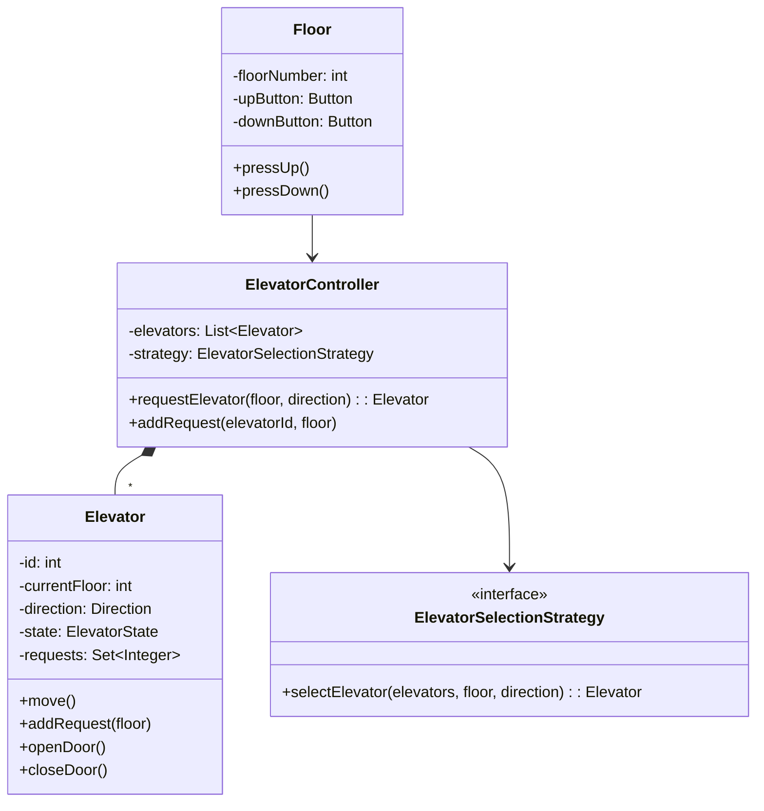

[🏠 Home](../../../README.md) | [⬅️ Parking Lot](./01-parking-lot.md) | [➡️ Movie Ticket Booking](./03-movie-ticket-booking.md)

# 🛗 Elevator System Design

> Design a multi-elevator system for a building

---

## 📋 Requirements

### Functional Requirements
1. Multiple elevators serving multiple floors
2. External buttons (Up/Down) on each floor
3. Internal buttons (floor selection) inside elevator
4. Display current floor and direction
5. Efficient elevator scheduling algorithm

### Non-Functional Requirements
- Handle concurrent requests
- Minimize wait time
- Energy efficient (prefer nearest elevator)

---

## 🎯 Class Diagram



---

## 💻 Implementation

### Enums

```java
public enum Direction {
    UP, DOWN, IDLE
}

public enum ElevatorState {
    MOVING,
    STOPPED,
    DOOR_OPEN,
    MAINTENANCE
}

public enum DoorState {
    OPEN, CLOSED
}
```

### Request Class

```java
public class ElevatorRequest {
    private final int floor;
    private final Direction direction;
    private final LocalDateTime timestamp;

    public ElevatorRequest(int floor, Direction direction) {
        this.floor = floor;
        this.direction = direction;
        this.timestamp = LocalDateTime.now();
    }

    public int getFloor() { return floor; }
    public Direction getDirection() { return direction; }
    public LocalDateTime getTimestamp() { return timestamp; }
}
```

### Elevator Class

```java
public class Elevator {
    private final int id;
    private final int minFloor;
    private final int maxFloor;
    
    private int currentFloor;
    private Direction direction;
    private ElevatorState state;
    private DoorState doorState;
    
    private final TreeSet<Integer> upRequests;
    private final TreeSet<Integer> downRequests;

    public Elevator(int id, int minFloor, int maxFloor) {
        this.id = id;
        this.minFloor = minFloor;
        this.maxFloor = maxFloor;
        this.currentFloor = minFloor;
        this.direction = Direction.IDLE;
        this.state = ElevatorState.STOPPED;
        this.doorState = DoorState.CLOSED;
        this.upRequests = new TreeSet<>();
        this.downRequests = new TreeSet<>();
    }

    public synchronized void addRequest(int floor) {
        if (floor < minFloor || floor > maxFloor) {
            throw new IllegalArgumentException("Invalid floor: " + floor);
        }
        
        if (floor > currentFloor) {
            upRequests.add(floor);
        } else if (floor < currentFloor) {
            downRequests.add(floor);
        } else {
            openDoor();
        }
        
        if (direction == Direction.IDLE) {
            determineDirection();
        }
    }

    private void determineDirection() {
        if (!upRequests.isEmpty() && !downRequests.isEmpty()) {
            // Choose direction with closest request
            int closestUp = upRequests.first();
            int closestDown = downRequests.last();
            direction = (closestUp - currentFloor <= currentFloor - closestDown) 
                        ? Direction.UP : Direction.DOWN;
        } else if (!upRequests.isEmpty()) {
            direction = Direction.UP;
        } else if (!downRequests.isEmpty()) {
            direction = Direction.DOWN;
        } else {
            direction = Direction.IDLE;
        }
    }

    public void move() {
        if (direction == Direction.IDLE || doorState == DoorState.OPEN) {
            return;
        }

        state = ElevatorState.MOVING;
        
        if (direction == Direction.UP) {
            currentFloor++;
            System.out.printf("Elevator %d: Moving UP to floor %d%n", id, currentFloor);
            
            if (upRequests.contains(currentFloor)) {
                stop();
                upRequests.remove(currentFloor);
            }
            
            if (upRequests.isEmpty()) {
                direction = downRequests.isEmpty() ? Direction.IDLE : Direction.DOWN;
            }
        } else {
            currentFloor--;
            System.out.printf("Elevator %d: Moving DOWN to floor %d%n", id, currentFloor);
            
            if (downRequests.contains(currentFloor)) {
                stop();
                downRequests.remove(currentFloor);
            }
            
            if (downRequests.isEmpty()) {
                direction = upRequests.isEmpty() ? Direction.IDLE : Direction.UP;
            }
        }
    }

    private void stop() {
        state = ElevatorState.STOPPED;
        openDoor();
        System.out.printf("Elevator %d: STOPPED at floor %d%n", id, currentFloor);
    }

    public void openDoor() {
        doorState = DoorState.OPEN;
        System.out.printf("Elevator %d: Door OPEN at floor %d%n", id, currentFloor);
        
        // Simulate door open time
        try { Thread.sleep(1000); } catch (InterruptedException e) {}
        
        closeDoor();
    }

    public void closeDoor() {
        doorState = DoorState.CLOSED;
        System.out.printf("Elevator %d: Door CLOSED%n", id);
    }

    // Getters
    public int getId() { return id; }
    public int getCurrentFloor() { return currentFloor; }
    public Direction getDirection() { return direction; }
    public ElevatorState getState() { return state; }
    public boolean isIdle() { return direction == Direction.IDLE; }
    
    public int getPendingRequests() {
        return upRequests.size() + downRequests.size();
    }
}
```

### Elevator Selection Strategy (Strategy Pattern)

```java
public interface ElevatorSelectionStrategy {
    Elevator selectElevator(List<Elevator> elevators, int floor, Direction direction);
}

// Nearest elevator strategy
public class NearestElevatorStrategy implements ElevatorSelectionStrategy {
    @Override
    public Elevator selectElevator(List<Elevator> elevators, int floor, Direction direction) {
        Elevator nearest = null;
        int minDistance = Integer.MAX_VALUE;

        for (Elevator elevator : elevators) {
            if (elevator.getState() == ElevatorState.MAINTENANCE) {
                continue;
            }

            int distance = Math.abs(elevator.getCurrentFloor() - floor);
            
            // Prefer idle elevator or one moving towards this floor
            if (elevator.isIdle()) {
                distance -= 1; // Slight preference
            } else if (isMovingTowards(elevator, floor, direction)) {
                distance -= 2; // Stronger preference
            } else {
                distance += elevator.getPendingRequests(); // Penalize busy elevators
            }

            if (distance < minDistance) {
                minDistance = distance;
                nearest = elevator;
            }
        }
        return nearest;
    }

    private boolean isMovingTowards(Elevator elevator, int floor, Direction direction) {
        if (elevator.getDirection() != direction) {
            return false;
        }
        if (direction == Direction.UP) {
            return elevator.getCurrentFloor() < floor;
        } else {
            return elevator.getCurrentFloor() > floor;
        }
    }
}

// Round Robin Strategy
public class RoundRobinStrategy implements ElevatorSelectionStrategy {
    private int currentIndex = 0;

    @Override
    public Elevator selectElevator(List<Elevator> elevators, int floor, Direction direction) {
        int startIndex = currentIndex;
        do {
            Elevator elevator = elevators.get(currentIndex);
            currentIndex = (currentIndex + 1) % elevators.size();
            
            if (elevator.getState() != ElevatorState.MAINTENANCE) {
                return elevator;
            }
        } while (currentIndex != startIndex);
        
        return null; // All elevators in maintenance
    }
}
```

### Elevator Controller

```java
public class ElevatorController {
    private final List<Elevator> elevators;
    private final ElevatorSelectionStrategy strategy;
    private final ExecutorService scheduler;

    public ElevatorController(int numElevators, int minFloor, int maxFloor) {
        this.elevators = new ArrayList<>();
        for (int i = 0; i < numElevators; i++) {
            elevators.add(new Elevator(i + 1, minFloor, maxFloor));
        }
        this.strategy = new NearestElevatorStrategy();
        this.scheduler = Executors.newScheduledThreadPool(numElevators);
        startElevatorMovement();
    }

    private void startElevatorMovement() {
        for (Elevator elevator : elevators) {
            scheduler.submit(() -> {
                while (true) {
                    try {
                        Thread.sleep(2000); // Move every 2 seconds
                        elevator.move();
                    } catch (InterruptedException e) {
                        break;
                    }
                }
            });
        }
    }

    public void requestElevator(int floor, Direction direction) {
        Elevator elevator = strategy.selectElevator(elevators, floor, direction);
        if (elevator != null) {
            elevator.addRequest(floor);
            System.out.printf("Request: Floor %d %s -> Assigned to Elevator %d%n", 
                              floor, direction, elevator.getId());
        } else {
            System.out.println("No elevator available!");
        }
    }

    public void selectFloor(int elevatorId, int floor) {
        Elevator elevator = elevators.get(elevatorId - 1);
        elevator.addRequest(floor);
        System.out.printf("Elevator %d: Floor %d selected%n", elevatorId, floor);
    }

    public void displayStatus() {
        System.out.println("\n=== Elevator Status ===");
        for (Elevator elevator : elevators) {
            System.out.printf("Elevator %d: Floor %d, Direction: %s, State: %s%n",
                elevator.getId(), elevator.getCurrentFloor(),
                elevator.getDirection(), elevator.getState());
        }
    }

    public void shutdown() {
        scheduler.shutdownNow();
    }
}
```

### Floor Class

```java
public class Floor {
    private final int floorNumber;
    private final ElevatorController controller;

    public Floor(int floorNumber, ElevatorController controller) {
        this.floorNumber = floorNumber;
        this.controller = controller;
    }

    public void pressUpButton() {
        System.out.printf("Floor %d: UP button pressed%n", floorNumber);
        controller.requestElevator(floorNumber, Direction.UP);
    }

    public void pressDownButton() {
        System.out.printf("Floor %d: DOWN button pressed%n", floorNumber);
        controller.requestElevator(floorNumber, Direction.DOWN);
    }
}
```

---

## 🧪 Usage Example

```java
public class Main {
    public static void main(String[] args) throws InterruptedException {
        // Building with 3 elevators, floors 0-10
        ElevatorController controller = new ElevatorController(3, 0, 10);

        // External requests (from floors)
        controller.requestElevator(5, Direction.UP);
        controller.requestElevator(3, Direction.DOWN);
        controller.requestElevator(8, Direction.DOWN);

        Thread.sleep(1000);

        // Internal request (inside elevator)
        controller.selectFloor(1, 7);
        controller.selectFloor(2, 1);

        controller.displayStatus();

        Thread.sleep(10000);
        controller.displayStatus();

        controller.shutdown();
    }
}
```

---

## 🎨 Design Patterns Used

| Pattern | Where Used |
|---------|------------|
| **Strategy** | ElevatorSelectionStrategy |
| **State** | Could use for elevator states |
| **Observer** | Floor buttons notify controller |
| **Singleton** | Could use for ElevatorController |

---

## 📊 Scheduling Algorithms

| Algorithm | Description | Pros | Cons |
|-----------|-------------|------|-----|
| **FCFS** | First Come First Serve | Simple | Inefficient |
| **SSTF** | Shortest Seek Time First | Fast response | Starvation |
| **SCAN** | Move in one direction, then reverse | Fair | Delay at ends |
| **LOOK** | SCAN but reverses at last request | Efficient | Complex |

---

## 📝 Interview Discussion Points

1. **How to handle peak hours?**
   - Implement zone-based allocation
   - Use predictive algorithms based on time

2. **How to add priority for certain floors (e.g., lobby)?**
   - Create priority queue for requests
   - Add weight to lobby floor requests

3. **How to handle fire emergency?**
   - Add emergency mode
   - All elevators go to ground floor
   - Disable for regular use

---

*Next: [Movie Ticket Booking →](./03-movie-ticket-booking.md)*
