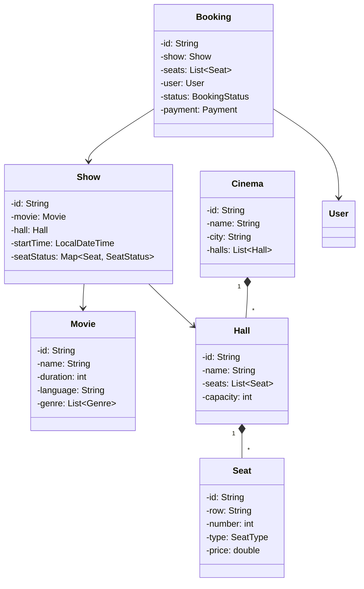

[🏠 Home](../../../README.md) | [⬅️ Elevator System](./02-elevator-system.md) | [➡️ Vending Machine](./04-vending-machine.md)

# 🎬 Movie Ticket Booking System (BookMyShow)

> Design an online movie ticket booking platform

---

## 📋 Requirements

### Functional Requirements
1. Browse movies by city, cinema, and time
2. View seat layout and availability
3. Select seats and book tickets
4. Handle concurrent seat selection (locking)
5. Payment processing
6. Send booking confirmation

### Non-Functional Requirements
- Handle seat locking for concurrent users
- Timeout for locked seats (e.g., 10 minutes)
- Scalable for multiple cities

---

## 🎯 Class Diagram



---

## 💻 Implementation

### Enums

```java
public enum SeatType {
    REGULAR(150),
    PREMIUM(250),
    RECLINER(400);

    private final double basePrice;

    SeatType(double basePrice) {
        this.basePrice = basePrice;
    }

    public double getBasePrice() { return basePrice; }
}

public enum SeatStatus {
    AVAILABLE,
    LOCKED,      // Temporarily locked during booking
    BOOKED
}

public enum BookingStatus {
    PENDING,
    CONFIRMED,
    CANCELLED,
    EXPIRED
}

public enum PaymentStatus {
    PENDING,
    SUCCESS,
    FAILED,
    REFUNDED
}
```

### Core Classes

```java
public class Movie {
    private final String id;
    private final String name;
    private final int durationMinutes;
    private final String language;
    private final List<String> genres;
    private final String rating;

    public Movie(String name, int duration, String language, List<String> genres) {
        this.id = UUID.randomUUID().toString();
        this.name = name;
        this.durationMinutes = duration;
        this.language = language;
        this.genres = genres;
        this.rating = "U/A";
    }
    
    // Getters...
}

public class Seat {
    private final String id;
    private final String row;
    private final int number;
    private final SeatType type;

    public Seat(String row, int number, SeatType type) {
        this.id = row + number;
        this.row = row;
        this.number = number;
        this.type = type;
    }

    public double getPrice() {
        return type.getBasePrice();
    }
    
    // Getters...
}

public class Hall {
    private final String id;
    private final String name;
    private final List<Seat> seats;

    public Hall(String name, int regularRows, int premiumRows, int seatsPerRow) {
        this.id = UUID.randomUUID().toString();
        this.name = name;
        this.seats = new ArrayList<>();
        
        // Create regular seats
        char row = 'A';
        for (int r = 0; r < regularRows; r++, row++) {
            for (int s = 1; s <= seatsPerRow; s++) {
                seats.add(new Seat(String.valueOf(row), s, SeatType.REGULAR));
            }
        }
        
        // Create premium seats
        for (int r = 0; r < premiumRows; r++, row++) {
            for (int s = 1; s <= seatsPerRow; s++) {
                seats.add(new Seat(String.valueOf(row), s, SeatType.PREMIUM));
            }
        }
    }
    
    // Getters...
}

public class Cinema {
    private final String id;
    private final String name;
    private final String city;
    private final String address;
    private final List<Hall> halls;

    public Cinema(String name, String city, String address) {
        this.id = UUID.randomUUID().toString();
        this.name = name;
        this.city = city;
        this.address = address;
        this.halls = new ArrayList<>();
    }

    public void addHall(Hall hall) {
        halls.add(hall);
    }
    
    // Getters...
}
```

### Show Class with Seat Locking

```java
public class Show {
    private final String id;
    private final Movie movie;
    private final Hall hall;
    private final LocalDateTime startTime;
    private final Map<String, SeatStatus> seatStatus;
    private final Map<String, LocalDateTime> seatLockTime;
    private static final int LOCK_TIMEOUT_MINUTES = 10;

    public Show(Movie movie, Hall hall, LocalDateTime startTime) {
        this.id = UUID.randomUUID().toString();
        this.movie = movie;
        this.hall = hall;
        this.startTime = startTime;
        this.seatStatus = new ConcurrentHashMap<>();
        this.seatLockTime = new ConcurrentHashMap<>();

        // Initialize all seats as available
        for (Seat seat : hall.getSeats()) {
            seatStatus.put(seat.getId(), SeatStatus.AVAILABLE);
        }
    }

    public synchronized List<Seat> getAvailableSeats() {
        releaseExpiredLocks();
        return hall.getSeats().stream()
                .filter(seat -> seatStatus.get(seat.getId()) == SeatStatus.AVAILABLE)
                .collect(Collectors.toList());
    }

    public synchronized boolean lockSeats(List<Seat> seats, String bookingId) {
        releaseExpiredLocks();
        
        // Check if all seats are available
        for (Seat seat : seats) {
            if (seatStatus.get(seat.getId()) != SeatStatus.AVAILABLE) {
                return false;
            }
        }

        // Lock all seats
        LocalDateTime now = LocalDateTime.now();
        for (Seat seat : seats) {
            seatStatus.put(seat.getId(), SeatStatus.LOCKED);
            seatLockTime.put(seat.getId(), now);
        }
        return true;
    }

    public synchronized void confirmSeats(List<Seat> seats) {
        for (Seat seat : seats) {
            seatStatus.put(seat.getId(), SeatStatus.BOOKED);
            seatLockTime.remove(seat.getId());
        }
    }

    public synchronized void releaseSeats(List<Seat> seats) {
        for (Seat seat : seats) {
            seatStatus.put(seat.getId(), SeatStatus.AVAILABLE);
            seatLockTime.remove(seat.getId());
        }
    }

    private void releaseExpiredLocks() {
        LocalDateTime cutoff = LocalDateTime.now().minusMinutes(LOCK_TIMEOUT_MINUTES);
        
        for (Map.Entry<String, LocalDateTime> entry : seatLockTime.entrySet()) {
            if (entry.getValue().isBefore(cutoff)) {
                seatStatus.put(entry.getKey(), SeatStatus.AVAILABLE);
                seatLockTime.remove(entry.getKey());
            }
        }
    }

    public void displaySeats() {
        System.out.println("\n=== Seat Layout ===");
        String currentRow = "";
        for (Seat seat : hall.getSeats()) {
            if (!seat.getRow().equals(currentRow)) {
                System.out.println();
                currentRow = seat.getRow();
                System.out.print(currentRow + ": ");
            }
            String status = switch (seatStatus.get(seat.getId())) {
                case AVAILABLE -> "[_]";
                case LOCKED -> "[L]";
                case BOOKED -> "[X]";
            };
            System.out.print(status + " ");
        }
        System.out.println("\n\n[_]=Available [L]=Locked [X]=Booked");
    }
    
    // Getters...
}
```

### Booking Class

```java
public class Booking {
    private final String id;
    private final Show show;
    private final List<Seat> seats;
    private final User user;
    private BookingStatus status;
    private Payment payment;
    private final LocalDateTime createdAt;

    public Booking(Show show, List<Seat> seats, User user) {
        this.id = "BK" + UUID.randomUUID().toString().substring(0, 8).toUpperCase();
        this.show = show;
        this.seats = new ArrayList<>(seats);
        this.user = user;
        this.status = BookingStatus.PENDING;
        this.createdAt = LocalDateTime.now();
    }

    public double getTotalAmount() {
        return seats.stream().mapToDouble(Seat::getPrice).sum();
    }

    public void confirm(Payment payment) {
        this.payment = payment;
        this.status = BookingStatus.CONFIRMED;
        show.confirmSeats(seats);
    }

    public void cancel() {
        this.status = BookingStatus.CANCELLED;
        show.releaseSeats(seats);
        if (payment != null && payment.getStatus() == PaymentStatus.SUCCESS) {
            payment.refund();
        }
    }

    public void printTicket() {
        System.out.println("\n========== TICKET ==========");
        System.out.println("Booking ID: " + id);
        System.out.println("Movie: " + show.getMovie().getName());
        System.out.println("Cinema: " + show.getHall().getName());
        System.out.println("Show Time: " + show.getStartTime());
        System.out.println("Seats: " + seats.stream()
                .map(Seat::getId)
                .collect(Collectors.joining(", ")));
        System.out.println("Total: ₹" + getTotalAmount());
        System.out.println("Status: " + status);
        System.out.println("============================\n");
    }
    
    // Getters...
}
```

### Payment Class

```java
public class Payment {
    private final String id;
    private final double amount;
    private final String paymentMethod;
    private PaymentStatus status;
    private final LocalDateTime timestamp;

    public Payment(double amount, String method) {
        this.id = "PAY" + UUID.randomUUID().toString().substring(0, 8);
        this.amount = amount;
        this.paymentMethod = method;
        this.status = PaymentStatus.PENDING;
        this.timestamp = LocalDateTime.now();
    }

    public boolean process() {
        // Simulate payment processing
        System.out.println("Processing payment of ₹" + amount + " via " + paymentMethod);
        try {
            Thread.sleep(1000);
        } catch (InterruptedException e) {}
        
        this.status = PaymentStatus.SUCCESS;
        System.out.println("Payment successful!");
        return true;
    }

    public void refund() {
        System.out.println("Refunding ₹" + amount);
        this.status = PaymentStatus.REFUNDED;
    }

    public PaymentStatus getStatus() { return status; }
}
```

### Booking Service

```java
public class BookingService {
    private static BookingService instance;
    private final Map<String, Booking> bookings = new ConcurrentHashMap<>();
    private final Map<String, List<Show>> cityShows = new ConcurrentHashMap<>();

    private BookingService() {}

    public static synchronized BookingService getInstance() {
        if (instance == null) {
            instance = new BookingService();
        }
        return instance;
    }

    public void addShow(String city, Show show) {
        cityShows.computeIfAbsent(city, k -> new ArrayList<>()).add(show);
    }

    public List<Show> getShows(String city, Movie movie) {
        return cityShows.getOrDefault(city, Collections.emptyList()).stream()
                .filter(s -> s.getMovie().equals(movie))
                .collect(Collectors.toList());
    }

    public Booking createBooking(Show show, List<Seat> seats, User user) {
        // Try to lock seats
        if (!show.lockSeats(seats, null)) {
            throw new IllegalStateException("Some seats are no longer available");
        }

        Booking booking = new Booking(show, seats, user);
        bookings.put(booking.getId(), booking);
        return booking;
    }

    public boolean confirmBooking(String bookingId, Payment payment) {
        Booking booking = bookings.get(bookingId);
        if (booking == null || booking.getStatus() != BookingStatus.PENDING) {
            return false;
        }

        if (payment.process()) {
            booking.confirm(payment);
            return true;
        }
        return false;
    }

    public void cancelBooking(String bookingId) {
        Booking booking = bookings.get(bookingId);
        if (booking != null) {
            booking.cancel();
        }
    }
}
```

---

## 🧪 Usage Example

```java
public class Main {
    public static void main(String[] args) {
        BookingService service = BookingService.getInstance();

        // Setup
        Movie movie = new Movie("Pushpa 2", 180, "Telugu", List.of("Action", "Drama"));
        Hall hall = new Hall("Audi 1", 5, 2, 10);  // 5 regular, 2 premium rows
        Cinema cinema = new Cinema("PVR Forum", "Bangalore", "Koramangala");
        cinema.addHall(hall);

        Show show = new Show(movie, hall, LocalDateTime.now().plusHours(3));
        service.addShow("Bangalore", show);

        // Display seats
        show.displaySeats();

        // Book tickets
        User user = new User("Rahul", "rahul@email.com");
        List<Seat> selectedSeats = show.getAvailableSeats().subList(0, 3);

        Booking booking = service.createBooking(show, selectedSeats, user);
        System.out.println("Booking created: " + booking.getId());
        System.out.println("Total: ₹" + booking.getTotalAmount());

        show.displaySeats();  // Shows locked seats

        // Confirm with payment
        Payment payment = new Payment(booking.getTotalAmount(), "UPI");
        service.confirmBooking(booking.getId(), payment);

        booking.printTicket();
        show.displaySeats();  // Shows booked seats
    }
}
```

---

## 🎨 Design Patterns Used

| Pattern | Where Used |
|---------|------------|
| **Singleton** | BookingService |
| **Factory** | Could add PaymentFactory |
| **Observer** | Seat availability notifications |
| **Strategy** | Pricing strategies |

---

## 📝 Interview Discussion Points

1. **How to handle concurrent seat booking?**
   - Use optimistic locking with version
   - Implement seat locking with timeout

2. **How to implement promo codes?**
   - Add `DiscountStrategy` interface
   - Apply before payment

3. **How to handle partial payment failures?**
   - Use transaction rollback
   - Release locked seats on failure

---

*Next: [Vending Machine →](./04-vending-machine.md)*
