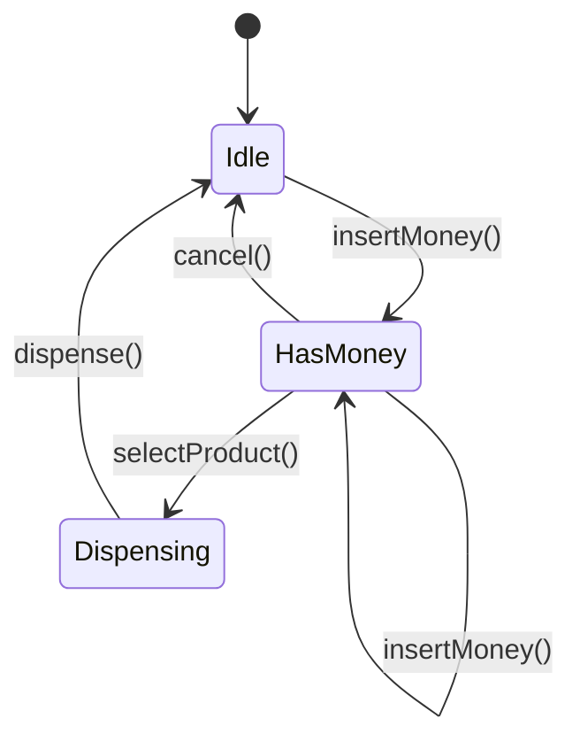

[🏠 Home](../../../README.md) | [⬅️ Movie Ticket Booking](./03-movie-ticket-booking.md) | [➡️ Chess Game](./05-chess-game.md)

# 🥤 Vending Machine Design

> Classic State Pattern implementation

---

## 📋 Requirements

### Functional Requirements
1. Display available products with prices
2. Accept coins/notes
3. Select product by code
4. Dispense product and return change
5. Allow cancellation and refund
6. Admin: refill products, collect cash

---

## 🎯 State Diagram



---

## 💻 Implementation

### Enums and Product

```java
public enum Coin {
    ONE(1), TWO(2), FIVE(5), TEN(10);
    private final int value;
    Coin(int value) { this.value = value; }
    public int getValue() { return value; }
}

public enum Note {
    TEN(10), TWENTY(20), FIFTY(50), HUNDRED(100);
    private final int value;
    Note(int value) { this.value = value; }
    public int getValue() { return value; }
}

public class Product {
    private final String code;
    private final String name;
    private final double price;
    private int quantity;

    public Product(String code, String name, double price, int quantity) {
        this.code = code;
        this.name = name;
        this.price = price;
        this.quantity = quantity;
    }

    public boolean isAvailable() { return quantity > 0; }
    public void reduceQuantity() { quantity--; }
    public void refill(int qty) { this.quantity += qty; }
    
    // Getters
    public String getCode() { return code; }
    public String getName() { return name; }
    public double getPrice() { return price; }
    public int getQuantity() { return quantity; }
}
```

### State Interface

```java
public interface VendingMachineState {
    void insertMoney(VendingMachine machine, double amount);
    void selectProduct(VendingMachine machine, String productCode);
    void dispense(VendingMachine machine);
    void cancel(VendingMachine machine);
}
```

### Concrete States

```java
public class IdleState implements VendingMachineState {
    @Override
    public void insertMoney(VendingMachine machine, double amount) {
        machine.addBalance(amount);
        System.out.printf("Inserted: ₹%.2f | Balance: ₹%.2f%n", 
                          amount, machine.getBalance());
        machine.setState(new HasMoneyState());
    }

    @Override
    public void selectProduct(VendingMachine machine, String code) {
        System.out.println("Please insert money first");
    }

    @Override
    public void dispense(VendingMachine machine) {
        System.out.println("Please insert money and select product");
    }

    @Override
    public void cancel(VendingMachine machine) {
        System.out.println("Nothing to cancel");
    }
}

public class HasMoneyState implements VendingMachineState {
    @Override
    public void insertMoney(VendingMachine machine, double amount) {
        machine.addBalance(amount);
        System.out.printf("Added: ₹%.2f | Balance: ₹%.2f%n", 
                          amount, machine.getBalance());
    }

    @Override
    public void selectProduct(VendingMachine machine, String code) {
        Product product = machine.getProduct(code);
        
        if (product == null) {
            System.out.println("Invalid product code: " + code);
            return;
        }
        
        if (!product.isAvailable()) {
            System.out.println("Product " + product.getName() + " is out of stock");
            return;
        }
        
        if (machine.getBalance() < product.getPrice()) {
            System.out.printf("Insufficient balance. Need ₹%.2f more%n",
                              product.getPrice() - machine.getBalance());
            return;
        }

        machine.setSelectedProduct(product);
        machine.setState(new DispensingState());
        machine.dispense();
    }

    @Override
    public void dispense(VendingMachine machine) {
        System.out.println("Please select a product first");
    }

    @Override
    public void cancel(VendingMachine machine) {
        double refund = machine.getBalance();
        machine.resetBalance();
        System.out.printf("Cancelled. Refunding: ₹%.2f%n", refund);
        machine.setState(new IdleState());
    }
}

public class DispensingState implements VendingMachineState {
    @Override
    public void insertMoney(VendingMachine machine, double amount) {
        System.out.println("Please wait, dispensing in progress...");
    }

    @Override
    public void selectProduct(VendingMachine machine, String code) {
        System.out.println("Please wait, dispensing in progress...");
    }

    @Override
    public void dispense(VendingMachine machine) {
        Product product = machine.getSelectedProduct();
        
        System.out.println("\n🎉 Dispensing: " + product.getName());
        product.reduceQuantity();
        
        double change = machine.getBalance() - product.getPrice();
        if (change > 0) {
            System.out.printf("💰 Change: ₹%.2f%n", change);
        }
        
        machine.addToTotalSales(product.getPrice());
        machine.resetBalance();
        machine.setSelectedProduct(null);
        machine.setState(new IdleState());
        
        System.out.println("Thank you for your purchase!\n");
    }

    @Override
    public void cancel(VendingMachine machine) {
        System.out.println("Cannot cancel while dispensing");
    }
}
```

### Vending Machine

```java
public class VendingMachine {
    private VendingMachineState state;
    private final Map<String, Product> inventory;
    private double balance;
    private Product selectedProduct;
    private double totalSales;

    public VendingMachine() {
        this.state = new IdleState();
        this.inventory = new LinkedHashMap<>();
        this.balance = 0;
        this.totalSales = 0;
    }

    // State-delegated methods
    public void insertMoney(double amount) {
        state.insertMoney(this, amount);
    }

    public void insertCoin(Coin coin) {
        insertMoney(coin.getValue());
    }

    public void insertNote(Note note) {
        insertMoney(note.getValue());
    }

    public void selectProduct(String code) {
        state.selectProduct(this, code);
    }

    public void dispense() {
        state.dispense(this);
    }

    public void cancel() {
        state.cancel(this);
    }

    // Inventory management
    public void addProduct(Product product) {
        inventory.put(product.getCode(), product);
    }

    public Product getProduct(String code) {
        return inventory.get(code);
    }

    public void displayProducts() {
        System.out.println("\n╔═══════════════════════════════════╗");
        System.out.println("║      VENDING MACHINE MENU         ║");
        System.out.println("╠═══════════════════════════════════╣");
        System.out.printf("║ %-6s %-15s %6s %3s ║%n", "CODE", "PRODUCT", "PRICE", "QTY");
        System.out.println("╠═══════════════════════════════════╣");
        
        for (Product p : inventory.values()) {
            String status = p.isAvailable() ? String.valueOf(p.getQuantity()) : "OUT";
            System.out.printf("║ %-6s %-15s ₹%5.0f %3s ║%n", 
                              p.getCode(), p.getName(), p.getPrice(), status);
        }
        
        System.out.println("╚═══════════════════════════════════╝");
    }

    // Balance management
    public double getBalance() { return balance; }
    public void addBalance(double amount) { this.balance += amount; }
    public void resetBalance() { this.balance = 0; }

    // State management
    public void setState(VendingMachineState state) { this.state = state; }
    public VendingMachineState getState() { return state; }

    // Product selection
    public Product getSelectedProduct() { return selectedProduct; }
    public void setSelectedProduct(Product product) { this.selectedProduct = product; }

    // Admin functions
    public void addToTotalSales(double amount) { this.totalSales += amount; }
    
    public void refillProduct(String code, int quantity) {
        Product product = inventory.get(code);
        if (product != null) {
            product.refill(quantity);
            System.out.printf("Refilled %s with %d items%n", product.getName(), quantity);
        }
    }

    public double collectCash() {
        double collected = totalSales;
        totalSales = 0;
        System.out.printf("Cash collected: ₹%.2f%n", collected);
        return collected;
    }
}
```

---

## 🧪 Usage Example

```java
public class Main {
    public static void main(String[] args) {
        VendingMachine vm = new VendingMachine();

        // Stock products
        vm.addProduct(new Product("A1", "Coca Cola", 20, 5));
        vm.addProduct(new Product("A2", "Pepsi", 20, 3));
        vm.addProduct(new Product("B1", "Lays Chips", 30, 4));
        vm.addProduct(new Product("B2", "Kurkure", 25, 6));
        vm.addProduct(new Product("C1", "Snickers", 40, 2));
        vm.addProduct(new Product("C2", "KitKat", 35, 0)); // Out of stock

        vm.displayProducts();

        // Scenario 1: Successful purchase
        System.out.println("\n--- Purchase Scenario ---");
        vm.insertNote(Note.FIFTY);
        vm.selectProduct("A1");

        // Scenario 2: Insufficient balance
        System.out.println("\n--- Insufficient Balance ---");
        vm.insertCoin(Coin.TEN);
        vm.selectProduct("C1");  // Costs 40
        vm.insertNote(Note.FIFTY);
        vm.selectProduct("C1");  // Now has enough

        // Scenario 3: Out of stock
        System.out.println("\n--- Out of Stock ---");
        vm.insertNote(Note.FIFTY);
        vm.selectProduct("C2");  // Out of stock
        vm.cancel();

        // Scenario 4: Cancel transaction
        System.out.println("\n--- Cancel ---");
        vm.insertNote(Note.HUNDRED);
        vm.cancel();

        vm.displayProducts();
    }
}
```

---

## 🎨 Design Patterns Used

| Pattern | Where Used |
|---------|------------|
| **State** | VendingMachineState |
| **Singleton** | Could use for shared machine |

---

*Next: [Chess Game →](./05-chess-game.md)*
