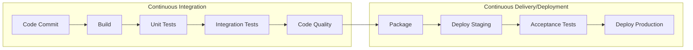
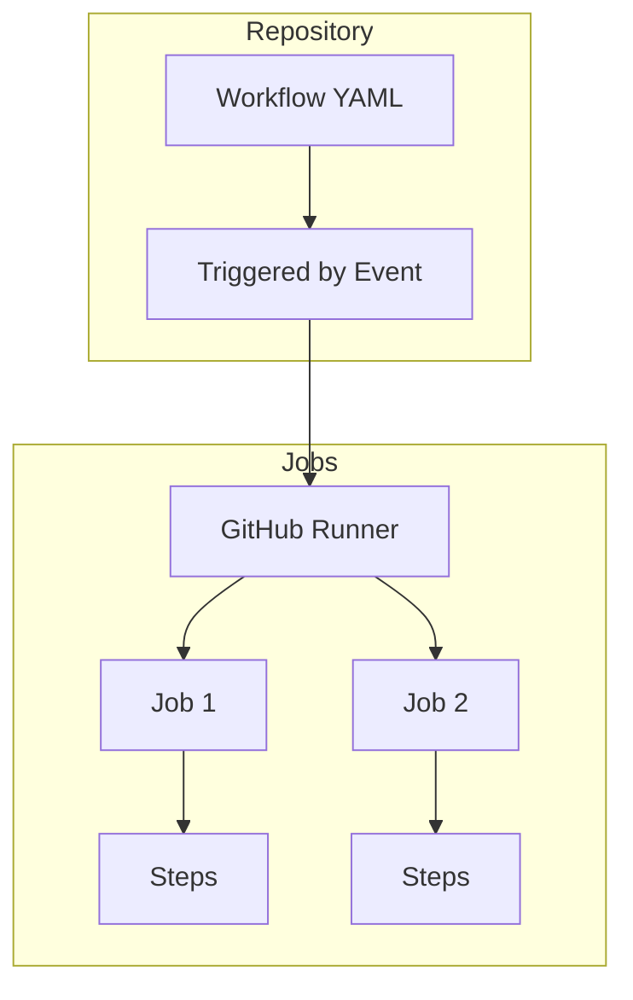
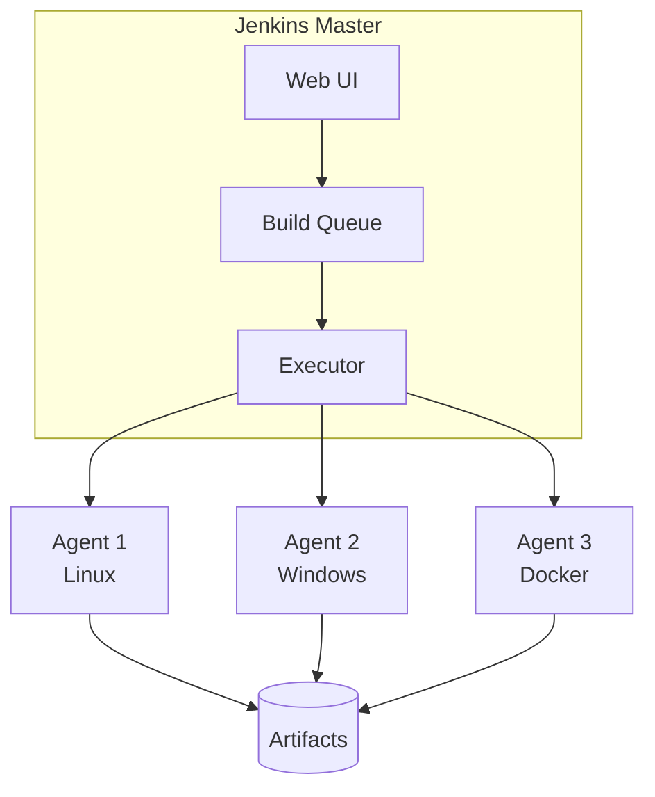
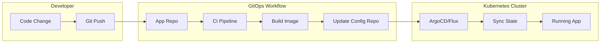
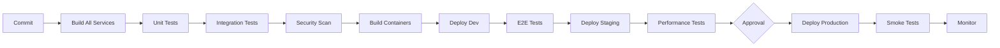

# CI/CD Deep Dive: GitHub Actions & Jenkins

> Master Continuous Integration & Continuous Deployment

---

## Table of Contents

1. [CI/CD Fundamentals](#1-cicd-fundamentals)
2. [GitHub Actions](#2-github-actions)
3. [Jenkins](#3-jenkins)
4. [GitOps](#4-gitops)
5. [Pipeline Patterns](#5-pipeline-patterns)
6. [Best Practices](#6-best-practices)
7. [Interview Questions](#7-interview-questions)

---

## 1. CI/CD Fundamentals

### What is CI/CD?



### Key Concepts

| Concept | Description |
|---------|-------------|
| **Continuous Integration** | Automatically build and test code on every commit |
| **Continuous Delivery** | Automate deployment to staging; manual approval for prod |
| **Continuous Deployment** | Fully automated pipeline including production |
| **Pipeline** | Sequence of stages that code passes through |
| **Artifact** | Build output (JAR, Docker image, executable) |

### CI/CD Benefits

1. **Faster Feedback** - Know within minutes if code breaks
2. **Reduced Risk** - Small, frequent deployments
3. **Higher Quality** - Automated testing catches bugs early
4. **Consistency** - Same process every time
5. **Auditability** - Complete history of deployments

---

## 2. GitHub Actions

### Core Concepts



| Component | Description |
|-----------|-------------|
| **Workflow** | Automated process defined in YAML |
| **Event** | Trigger (push, PR, schedule, manual) |
| **Job** | Set of steps running on same runner |
| **Step** | Individual task (run command, use action) |
| **Action** | Reusable unit of code |
| **Runner** | Server that executes workflows |

### Workflow Syntax

```yaml
# .github/workflows/ci.yml
name: CI Pipeline

# Trigger events
on:
  push:
    branches: [main, develop]
  pull_request:
    branches: [main]
  workflow_dispatch:  # Manual trigger
  schedule:
    - cron: '0 0 * * *'  # Daily at midnight

# Environment variables
env:
  PYTHON_VERSION: '3.11'
  NODE_VERSION: '20'

jobs:
  # Job 1: Build and Test
  build:
    runs-on: ubuntu-latest
    
    # Job-level outputs
    outputs:
      version: ${{ steps.version.outputs.version }}
    
    steps:
      - name: Checkout code
        uses: actions/checkout@v4
      
      - name: Setup Python
        uses: actions/setup-python@v5
        with:
          python-version: ${{ env.PYTHON_VERSION }}
          cache: 'pip'
      
      - name: Install dependencies
        run: |
          python -m pip install --upgrade pip
          pip install -r requirements.txt
      
      - name: Run tests
        run: pytest tests/ -v --cov=src
      
      - name: Get version
        id: version
        run: echo "version=$(cat VERSION)" >> $GITHUB_OUTPUT
  
  # Job 2: Docker build (depends on build)
  docker:
    needs: build
    runs-on: ubuntu-latest
    if: github.ref == 'refs/heads/main'
    
    steps:
      - uses: actions/checkout@v4
      
      - name: Login to Docker Hub
        uses: docker/login-action@v3
        with:
          username: ${{ secrets.DOCKER_USERNAME }}
          password: ${{ secrets.DOCKER_PASSWORD }}
      
      - name: Build and push
        uses: docker/build-push-action@v5
        with:
          push: true
          tags: |
            myapp:latest
            myapp:${{ needs.build.outputs.version }}
```

### Matrix Strategy

Run tests across multiple versions:

```yaml
jobs:
  test:
    runs-on: ubuntu-latest
    strategy:
      matrix:
        python-version: ['3.9', '3.10', '3.11', '3.12']
        os: [ubuntu-latest, windows-latest, macos-latest]
      fail-fast: false  # Continue other jobs if one fails
    
    steps:
      - uses: actions/checkout@v4
      - uses: actions/setup-python@v5
        with:
          python-version: ${{ matrix.python-version }}
      - run: pytest tests/
```

### Reusable Workflows

Create a reusable workflow:

```yaml
# .github/workflows/reusable-deploy.yml
name: Reusable Deploy

on:
  workflow_call:
    inputs:
      environment:
        required: true
        type: string
    secrets:
      AWS_ACCESS_KEY_ID:
        required: true
      AWS_SECRET_ACCESS_KEY:
        required: true

jobs:
  deploy:
    runs-on: ubuntu-latest
    environment: ${{ inputs.environment }}
    
    steps:
      - uses: actions/checkout@v4
      
      - name: Configure AWS
        uses: aws-actions/configure-aws-credentials@v4
        with:
          aws-access-key-id: ${{ secrets.AWS_ACCESS_KEY_ID }}
          aws-secret-access-key: ${{ secrets.AWS_SECRET_ACCESS_KEY }}
          aws-region: us-east-1
      
      - name: Deploy
        run: ./scripts/deploy.sh ${{ inputs.environment }}
```

Call the reusable workflow:

```yaml
# .github/workflows/deploy-staging.yml
name: Deploy Staging

on:
  push:
    branches: [develop]

jobs:
  deploy:
    uses: ./.github/workflows/reusable-deploy.yml
    with:
      environment: staging
    secrets:
      AWS_ACCESS_KEY_ID: ${{ secrets.AWS_ACCESS_KEY_ID }}
      AWS_SECRET_ACCESS_KEY: ${{ secrets.AWS_SECRET_ACCESS_KEY }}
```

### GitHub Actions for Different Languages

#### Python Project

```yaml
name: Python CI

on: [push, pull_request]

jobs:
  test:
    runs-on: ubuntu-latest
    steps:
      - uses: actions/checkout@v4
      
      - name: Setup Python
        uses: actions/setup-python@v5
        with:
          python-version: '3.11'
          cache: 'pip'
      
      - name: Install dependencies
        run: |
          pip install -r requirements.txt
          pip install pytest pytest-cov black flake8
      
      - name: Lint
        run: |
          black --check .
          flake8 .
      
      - name: Test
        run: pytest --cov=src --cov-report=xml
      
      - name: Upload coverage
        uses: codecov/codecov-action@v4
        with:
          file: ./coverage.xml
```

#### Java/Gradle Project

```yaml
name: Java CI

on: [push, pull_request]

jobs:
  build:
    runs-on: ubuntu-latest
    
    steps:
      - uses: actions/checkout@v4
      
      - name: Setup JDK
        uses: actions/setup-java@v4
        with:
          java-version: '21'
          distribution: 'temurin'
          cache: 'gradle'
      
      - name: Grant execute permission
        run: chmod +x gradlew
      
      - name: Build
        run: ./gradlew build
      
      - name: Test
        run: ./gradlew test
      
      - name: Publish Test Report
        uses: mikepenz/action-junit-report@v4
        if: always()
        with:
          report_paths: '**/build/test-results/test/TEST-*.xml'
```

#### Node.js Project

```yaml
name: Node.js CI

on: [push, pull_request]

jobs:
  build:
    runs-on: ubuntu-latest
    
    steps:
      - uses: actions/checkout@v4
      
      - name: Setup Node.js
        uses: actions/setup-node@v4
        with:
          node-version: '20'
          cache: 'npm'
      
      - name: Install dependencies
        run: npm ci
      
      - name: Lint
        run: npm run lint
      
      - name: Test
        run: npm test
      
      - name: Build
        run: npm run build
```

### Environment Protection

```yaml
jobs:
  deploy-prod:
    runs-on: ubuntu-latest
    environment:
      name: production
      url: https://myapp.com
    
    steps:
      - name: Deploy
        run: ./deploy.sh
```

Configure in GitHub: Settings → Environments → production
- Required reviewers
- Wait timer
- Branch protection

---

## 3. Jenkins

### Architecture



### Installation

```bash
# Docker (quickest)
docker run -d -p 8080:8080 -p 50000:50000 \
  -v jenkins_home:/var/jenkins_home \
  --name jenkins \
  jenkins/jenkins:lts

# Get initial admin password
docker exec jenkins cat /var/jenkins_home/secrets/initialAdminPassword
```

### Jenkinsfile (Declarative Pipeline)

```groovy
// Jenkinsfile
pipeline {
    agent any
    
    environment {
        DOCKER_REGISTRY = 'docker.io'
        APP_NAME = 'myapp'
    }
    
    options {
        timeout(time: 30, unit: 'MINUTES')
        disableConcurrentBuilds()
        buildDiscarder(logRotator(numToKeepStr: '10'))
    }
    
    stages {
        stage('Checkout') {
            steps {
                checkout scm
            }
        }
        
        stage('Build') {
            steps {
                sh 'mvn clean package -DskipTests'
            }
        }
        
        stage('Test') {
            parallel {
                stage('Unit Tests') {
                    steps {
                        sh 'mvn test'
                    }
                    post {
                        always {
                            junit '**/target/surefire-reports/*.xml'
                        }
                    }
                }
                stage('Integration Tests') {
                    steps {
                        sh 'mvn verify -DskipUnitTests'
                    }
                }
            }
        }
        
        stage('Code Quality') {
            steps {
                withSonarQubeEnv('SonarQube') {
                    sh 'mvn sonar:sonar'
                }
            }
        }
        
        stage('Build Docker Image') {
            when {
                branch 'main'
            }
            steps {
                script {
                    docker.build("${DOCKER_REGISTRY}/${APP_NAME}:${BUILD_NUMBER}")
                }
            }
        }
        
        stage('Deploy Staging') {
            when {
                branch 'main'
            }
            steps {
                script {
                    docker.withRegistry('https://registry.hub.docker.com', 'docker-creds') {
                        docker.image("${DOCKER_REGISTRY}/${APP_NAME}:${BUILD_NUMBER}").push()
                    }
                }
                sh './deploy.sh staging'
            }
        }
        
        stage('Deploy Production') {
            when {
                branch 'main'
            }
            input {
                message "Deploy to production?"
                ok "Yes, deploy!"
            }
            steps {
                sh './deploy.sh production'
            }
        }
    }
    
    post {
        always {
            cleanWs()
        }
        success {
            slackSend(color: 'good', message: "Build Successful: ${env.JOB_NAME} #${env.BUILD_NUMBER}")
        }
        failure {
            slackSend(color: 'danger', message: "Build Failed: ${env.JOB_NAME} #${env.BUILD_NUMBER}")
        }
    }
}
```

### Scripted Pipeline

```groovy
// For more complex logic
node('linux') {
    try {
        stage('Checkout') {
            checkout scm
        }
        
        stage('Build') {
            def mvnHome = tool 'Maven-3.9'
            sh "${mvnHome}/bin/mvn clean package"
        }
        
        stage('Test') {
            sh 'mvn test'
        }
        
        if (env.BRANCH_NAME == 'main') {
            stage('Deploy') {
                withCredentials([usernamePassword(
                    credentialsId: 'aws-creds',
                    usernameVariable: 'AWS_ACCESS_KEY_ID',
                    passwordVariable: 'AWS_SECRET_ACCESS_KEY'
                )]) {
                    sh './deploy.sh'
                }
            }
        }
        
    } catch (e) {
        currentBuild.result = 'FAILURE'
        throw e
    } finally {
        cleanWs()
    }
}
```

### Shared Libraries

```groovy
// vars/buildPipeline.groovy (in shared library repo)
def call(Map config) {
    pipeline {
        agent any
        
        stages {
            stage('Build') {
                steps {
                    sh config.buildCommand ?: 'mvn clean package'
                }
            }
            stage('Test') {
                steps {
                    sh config.testCommand ?: 'mvn test'
                }
            }
            stage('Deploy') {
                when {
                    branch 'main'
                }
                steps {
                    sh config.deployCommand ?: './deploy.sh'
                }
            }
        }
    }
}
```

Use in Jenkinsfile:

```groovy
@Library('my-shared-library') _

buildPipeline(
    buildCommand: 'gradle build',
    testCommand: 'gradle test',
    deployCommand: './scripts/deploy.sh'
)
```

### Jenkins Agents

```groovy
// Agent with specific labels
pipeline {
    agent {
        label 'linux && docker'
    }
    // ...
}

// Docker agent
pipeline {
    agent {
        docker {
            image 'maven:3.9-eclipse-temurin-21'
            args '-v $HOME/.m2:/root/.m2'
        }
    }
    // ...
}

// Kubernetes agent
pipeline {
    agent {
        kubernetes {
            yaml '''
                apiVersion: v1
                kind: Pod
                spec:
                  containers:
                  - name: maven
                    image: maven:3.9-eclipse-temurin-21
                    command: ['sleep', 'infinity']
            '''
        }
    }
    stages {
        stage('Build') {
            steps {
                container('maven') {
                    sh 'mvn clean package'
                }
            }
        }
    }
}
```

---

## 4. GitOps

### What is GitOps?

GitOps is a paradigm where **Git is the single source of truth** for infrastructure and application deployment. Changes to the desired state are made via Git commits, and automated systems reconcile the actual state with the desired state.



### GitOps Principles

| Principle | Description |
|-----------|-------------|
| **Declarative** | Desired state described declaratively (YAML, HCL) |
| **Versioned** | All changes tracked in Git history |
| **Automated** | Changes applied automatically by operators |
| **Auditable** | Git provides complete audit trail |
| **Reconciled** | Operators continuously ensure actual = desired |

### ArgoCD

ArgoCD is a GitOps continuous delivery tool for Kubernetes.

#### Installation

```bash
# Install ArgoCD
kubectl create namespace argocd
kubectl apply -n argocd -f https://raw.githubusercontent.com/argoproj/argo-cd/stable/manifests/install.yaml

# Get initial admin password
kubectl -n argocd get secret argocd-initial-admin-secret -o jsonpath="{.data.password}" | base64 -d

# Port forward UI
kubectl port-forward svc/argocd-server -n argocd 8080:443
```

#### Application CRD

```yaml
# argocd-application.yaml
apiVersion: argoproj.io/v1alpha1
kind: Application
metadata:
  name: myapp
  namespace: argocd
spec:
  project: default
  
  source:
    repoURL: https://github.com/myorg/gitops-manifests.git
    targetRevision: HEAD
    path: apps/myapp/overlays/production
  
  destination:
    server: https://kubernetes.default.svc
    namespace: production
  
  syncPolicy:
    automated:
      prune: true        # Delete resources not in Git
      selfHeal: true     # Revert manual changes
    syncOptions:
      - CreateNamespace=true
    retry:
      limit: 5
      backoff:
        duration: 5s
        factor: 2
        maxDuration: 3m
```

#### ApplicationSet (Multi-Cluster/Environment)

```yaml
# applicationset.yaml
apiVersion: argoproj.io/v1alpha1
kind: ApplicationSet
metadata:
  name: myapp-envs
  namespace: argocd
spec:
  generators:
    - list:
        elements:
          - cluster: dev
            url: https://dev.k8s.example.com
          - cluster: staging
            url: https://staging.k8s.example.com
          - cluster: prod
            url: https://prod.k8s.example.com
  
  template:
    metadata:
      name: 'myapp-{{cluster}}'
    spec:
      project: default
      source:
        repoURL: https://github.com/myorg/gitops-manifests.git
        path: 'apps/myapp/overlays/{{cluster}}'
        targetRevision: HEAD
      destination:
        server: '{{url}}'
        namespace: myapp
```

### Flux CD

Flux is another popular GitOps toolkit for Kubernetes.

#### Installation

```bash
# Install Flux CLI
curl -s https://fluxcd.io/install.sh | sudo bash

# Bootstrap Flux in cluster
flux bootstrap github \
  --owner=myorg \
  --repository=gitops-manifests \
  --branch=main \
  --path=clusters/production \
  --personal
```

#### Flux Components

```yaml
# GitRepository - where to fetch manifests
apiVersion: source.toolkit.fluxcd.io/v1
kind: GitRepository
metadata:
  name: myapp
  namespace: flux-system
spec:
  interval: 1m
  url: https://github.com/myorg/gitops-manifests
  ref:
    branch: main
---
# Kustomization - what to deploy
apiVersion: kustomize.toolkit.fluxcd.io/v1
kind: Kustomization
metadata:
  name: myapp
  namespace: flux-system
spec:
  interval: 5m
  path: ./apps/myapp
  prune: true
  sourceRef:
    kind: GitRepository
    name: myapp
  healthChecks:
    - apiVersion: apps/v1
      kind: Deployment
      name: myapp
      namespace: production
---
# HelmRelease - for Helm charts
apiVersion: helm.toolkit.fluxcd.io/v2beta1
kind: HelmRelease
metadata:
  name: nginx
  namespace: default
spec:
  interval: 5m
  chart:
    spec:
      chart: nginx
      version: "15.x"
      sourceRef:
        kind: HelmRepository
        name: bitnami
        namespace: flux-system
  values:
    replicaCount: 3
```

### GitOps Repository Structure

```
gitops-manifests/
├── apps/
│   ├── myapp/
│   │   ├── base/
│   │   │   ├── deployment.yaml
│   │   │   ├── service.yaml
│   │   │   └── kustomization.yaml
│   │   └── overlays/
│   │       ├── dev/
│   │       │   ├── kustomization.yaml
│   │       │   └── patches/
│   │       ├── staging/
│   │       └── production/
│   └── another-app/
├── infrastructure/
│   ├── controllers/
│   │   ├── ingress-nginx/
│   │   └── cert-manager/
│   └── configs/
│       ├── cluster-issuer.yaml
│       └── storage-class.yaml
└── clusters/
    ├── dev/
    │   └── kustomization.yaml
    ├── staging/
    └── production/
```

### CI/CD + GitOps Workflow

```yaml
# GitHub Actions CI pipeline (app repo)
name: CI + GitOps

on:
  push:
    branches: [main]

jobs:
  build:
    runs-on: ubuntu-latest
    outputs:
      image-tag: ${{ steps.meta.outputs.tags }}
    
    steps:
      - uses: actions/checkout@v4
      
      - name: Build and test
        run: |
          npm ci
          npm test
          npm run build
      
      - name: Docker meta
        id: meta
        uses: docker/metadata-action@v5
        with:
          images: ghcr.io/myorg/myapp
          tags: |
            type=sha,prefix=
      
      - name: Build and push
        uses: docker/build-push-action@v5
        with:
          push: true
          tags: ${{ steps.meta.outputs.tags }}
  
  update-gitops:
    needs: build
    runs-on: ubuntu-latest
    
    steps:
      - name: Checkout GitOps repo
        uses: actions/checkout@v4
        with:
          repository: myorg/gitops-manifests
          token: ${{ secrets.GITOPS_PAT }}
          path: gitops
      
      - name: Update image tag
        working-directory: gitops
        run: |
          cd apps/myapp/overlays/staging
          kustomize edit set image ghcr.io/myorg/myapp=${{ needs.build.outputs.image-tag }}
      
      - name: Commit and push
        working-directory: gitops
        run: |
          git config user.name "github-actions[bot]"
          git config user.email "github-actions[bot]@users.noreply.github.com"
          git add .
          git diff --staged --quiet || git commit -m "chore: update myapp to ${{ needs.build.outputs.image-tag }}"
          git push
```

### ArgoCD vs Flux

| Feature | ArgoCD | Flux |
|---------|--------|------|
| **UI** | Built-in web UI | Third-party (Weave GitOps) |
| **CLI** | Full CLI | Full CLI |
| **Multi-cluster** | ApplicationSet | Kustomization |
| **Helm** | Native support | HelmRelease CRD |
| **Notifications** | Built-in | Separate controller |
| **RBAC** | Built-in | K8s RBAC |
| **Best for** | Enterprise, UI-focused | GitOps-native, lightweight |

---

## 5. Pipeline Patterns

### Blue-Green Deployment

```yaml
# GitHub Actions blue-green
name: Blue-Green Deploy

on:
  push:
    branches: [main]

jobs:
  deploy:
    runs-on: ubuntu-latest
    steps:
      - name: Deploy to inactive environment
        id: deploy
        run: |
          CURRENT=$(aws elbv2 describe-target-groups --query 'TargetGroups[?contains(Tags[?Key==`active`].Value, `true`)].TargetGroupName' --output text)
          if [ "$CURRENT" == "blue" ]; then
            TARGET="green"
          else
            TARGET="blue"
          fi
          echo "target=$TARGET" >> $GITHUB_OUTPUT
          ./deploy.sh $TARGET
      
      - name: Run smoke tests
        run: ./smoke-tests.sh ${{ steps.deploy.outputs.target }}
      
      - name: Switch traffic
        run: |
          aws elbv2 modify-listener --listener-arn $LISTENER_ARN \
            --default-actions Type=forward,TargetGroupArn=${{ steps.deploy.outputs.target }}-tg
```

### Canary Deployment

```groovy
// Jenkins canary
pipeline {
    stages {
        stage('Deploy Canary') {
            steps {
                sh 'kubectl apply -f k8s/canary.yaml'
                sh 'kubectl scale deployment myapp-canary --replicas=1'
            }
        }
        
        stage('Validate Canary') {
            steps {
                script {
                    def errorRate = sh(
                        script: 'curl -s prometheus/api/v1/query?query=error_rate{deployment="canary"}',
                        returnStdout: true
                    ).trim()
                    
                    if (errorRate.toFloat() > 0.01) {
                        error("Canary failed: error rate ${errorRate}")
                    }
                }
            }
        }
        
        stage('Promote') {
            steps {
                sh 'kubectl scale deployment myapp --replicas=10'
                sh 'kubectl delete deployment myapp-canary'
            }
        }
    }
}
```

### GitOps with ArgoCD

```yaml
# GitHub Actions + ArgoCD
name: GitOps Deploy

on:
  push:
    branches: [main]

jobs:
  build:
    runs-on: ubuntu-latest
    outputs:
      image-tag: ${{ steps.build.outputs.tag }}
    steps:
      - uses: actions/checkout@v4
      
      - name: Build and push Docker image
        id: build
        run: |
          TAG=${{ github.sha }}
          docker build -t myapp:$TAG .
          docker push myapp:$TAG
          echo "tag=$TAG" >> $GITHUB_OUTPUT
  
  update-manifests:
    needs: build
    runs-on: ubuntu-latest
    steps:
      - name: Checkout GitOps repo
        uses: actions/checkout@v4
        with:
          repository: myorg/gitops-manifests
          token: ${{ secrets.GITOPS_TOKEN }}
      
      - name: Update image tag
        run: |
          cd apps/myapp/overlays/production
          kustomize edit set image myapp:${{ needs.build.outputs.image-tag }}
      
      - name: Commit and push
        run: |
          git config user.name "github-actions"
          git config user.email "actions@github.com"
          git add .
          git commit -m "Update myapp to ${{ needs.build.outputs.image-tag }}"
          git push
```

---

## 6. Best Practices

### Pipeline Design

```yaml
# ✅ Good: Modular, cached, parallelized
jobs:
  lint:
    runs-on: ubuntu-latest
    steps:
      - uses: actions/checkout@v4
      - uses: actions/setup-python@v5
        with:
          python-version: '3.11'
          cache: 'pip'  # Cache dependencies
      - run: pip install flake8 black
      - run: black --check . && flake8

  test:
    runs-on: ubuntu-latest
    needs: lint  # Run after lint
    strategy:
      matrix:
        python: ['3.10', '3.11', '3.12']  # Parallel testing
    steps:
      - uses: actions/checkout@v4
      - uses: actions/setup-python@v5
        with:
          python-version: ${{ matrix.python }}
          cache: 'pip'
      - run: pip install -r requirements.txt
      - run: pytest

  deploy:
    needs: test
    if: github.ref == 'refs/heads/main'  # Conditional
    # ...
```

### Security Best Practices

```yaml
# 1. Use secrets, never hardcode
env:
  API_KEY: ${{ secrets.API_KEY }}

# 2. Limit permissions
permissions:
  contents: read
  packages: write

# 3. Pin action versions
- uses: actions/checkout@v4.1.1  # Specific version

# 4. Use OIDC for cloud auth (no static credentials)
- uses: aws-actions/configure-aws-credentials@v4
  with:
    role-to-assume: arn:aws:iam::123456789:role/github-actions
    aws-region: us-east-1

# 5. Scan for vulnerabilities
- name: Security scan
  uses: snyk/actions/python@master
  with:
    args: --severity-threshold=high
```

### Performance Optimization

```yaml
# Cache dependencies
- uses: actions/cache@v4
  with:
    path: |
      ~/.cache/pip
      ~/.npm
      ~/.m2
    key: ${{ runner.os }}-deps-${{ hashFiles('**/requirements.txt', '**/package-lock.json', '**/pom.xml') }}

# Use artifacts between jobs
- uses: actions/upload-artifact@v4
  with:
    name: build-output
    path: dist/

- uses: actions/download-artifact@v4
  with:
    name: build-output
    path: dist/

# Skip unnecessary runs
on:
  push:
    paths-ignore:
      - '**.md'
      - 'docs/**'
```

---

## 7. Interview Questions

### Q1: What is the difference between Continuous Delivery and Continuous Deployment?

**Answer:**
| Aspect | Continuous Delivery | Continuous Deployment |
|--------|--------------------|-----------------------|
| **Production Deploy** | Manual approval required | Fully automated |
| **Human Gate** | Yes, before prod | No |
| **Risk** | Lower (human review) | Higher (automated) |
| **Speed** | Slower | Faster |
| **Use Case** | Regulated industries | Fast-moving startups |

---

### Q2: How would you design a multi-stage pipeline for a microservices application?

**Answer:**



Key considerations:
1. **Parallel builds** for independent services
2. **Shared library** for common pipeline code
3. **Environment-specific configs** via Kubernetes ConfigMaps
4. **Feature flags** to decouple deploy from release
5. **Rollback strategy** if smoke tests fail

---

### Q3: How do you handle secrets in CI/CD pipelines?

**Answer:**

1. **Never commit secrets** to repository
2. **Use platform secret management:**
   - GitHub: Repository/Organization Secrets
   - Jenkins: Credentials plugin
3. **OIDC for cloud providers** (no static keys)
4. **External secret managers:**
   - AWS Secrets Manager
   - HashiCorp Vault
   - Azure Key Vault
5. **Rotate secrets regularly**
6. **Audit secret access**

```yaml
# GitHub Actions with OIDC
permissions:
  id-token: write
  contents: read

jobs:
  deploy:
    steps:
      - uses: aws-actions/configure-aws-credentials@v4
        with:
          role-to-assume: arn:aws:iam::123456789:role/github-actions
          aws-region: us-east-1
      # No AWS_ACCESS_KEY needed!
```

---

### Q4: Explain blue-green vs canary deployments

**Answer:**

| Aspect | Blue-Green | Canary |
|--------|-----------|--------|
| **Traffic Split** | 100% switch | Gradual (1% → 10% → 50% → 100%) |
| **Rollback** | Instant (switch back) | Fast (route away) |
| **Resource Cost** | 2x infrastructure | 1x + small canary |
| **Validation** | Post-switch testing | Incremental monitoring |
| **Use Case** | Fast rollback needed | Large user base, gradual validation |

---

### Q5: How do you speed up slow CI/CD pipelines?

**Answer:**

1. **Caching:**
   ```yaml
   - uses: actions/cache@v4
     with:
       path: ~/.cache/pip
       key: ${{ hashFiles('requirements.txt') }}
   ```

2. **Parallelization:**
   ```yaml
   strategy:
     matrix:
       test-group: [unit, integration, e2e]
   ```

3. **Incremental builds:** Only rebuild changed components

4. **Smaller Docker images:** Multi-stage builds, alpine base

5. **Skip unnecessary work:**
   ```yaml
   paths-ignore:
     - '**.md'
     - 'docs/**'
   ```

6. **Self-hosted runners:** Faster than shared infrastructure

---

### Q6: GitHub Actions vs Jenkins - when to use which?

**Answer:**

| Factor | GitHub Actions | Jenkins |
|--------|---------------|---------|
| **Best for** | GitHub-native projects | Enterprise, complex pipelines |
| **Setup** | Zero setup | Self-hosted server |
| **Cost** | Free tier + usage billing | Server + maintenance |
| **Plugins** | Actions marketplace | 1800+ plugins |
| **Customization** | YAML only | Groovy scripting |
| **Security** | GitHub-managed secrets | Self-managed |
| **Scaling** | Automatic | Manual agent setup |

**Use GitHub Actions when:**
- Code is on GitHub
- Standard build/test/deploy workflows
- Want minimal infrastructure

**Use Jenkins when:**
- Complex enterprise pipelines
- Hybrid/on-prem infrastructure
- Need deep customization
- Already have Jenkins expertise

---

## Navigation

Previous: [AWS GenAI & MLOps](./genai/aws-genai-mlops.md) | Next: [Docker Guide](./docker-guide.md)

---

*Master CI/CD to ship code faster and more reliably!*
