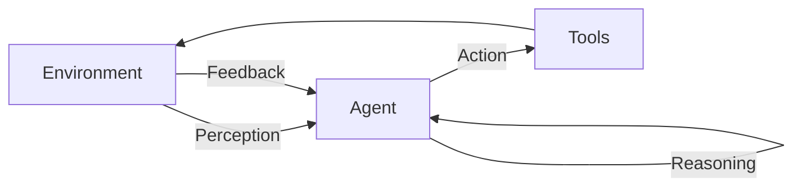
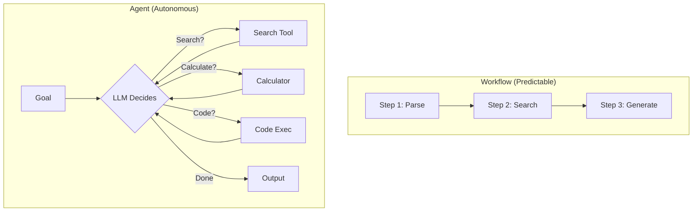
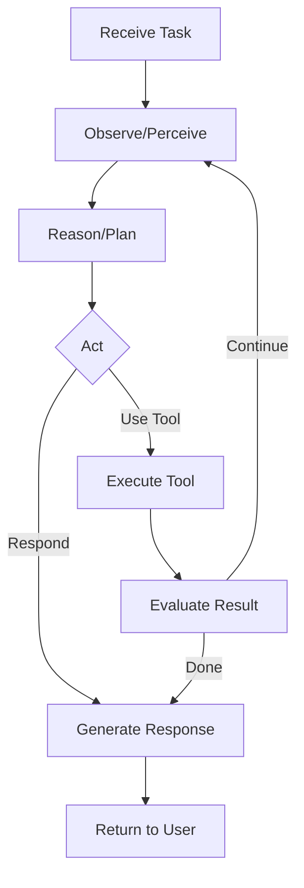
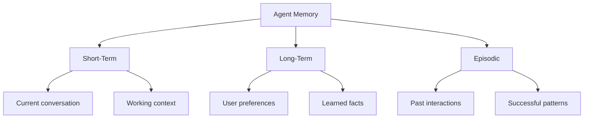
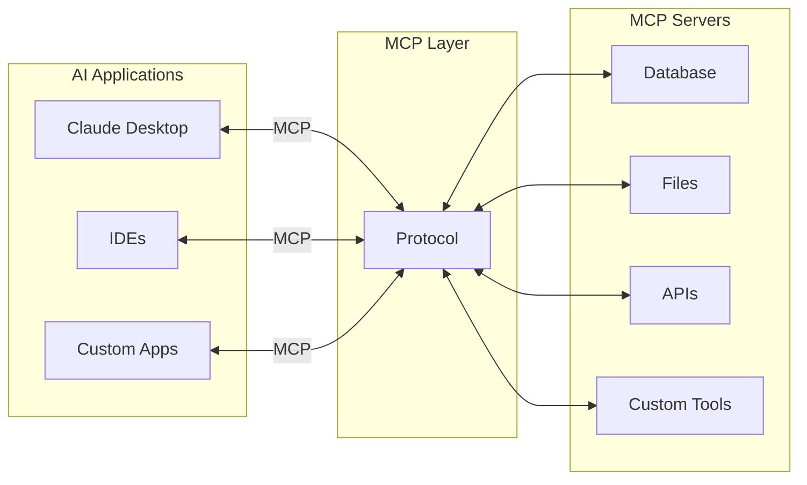
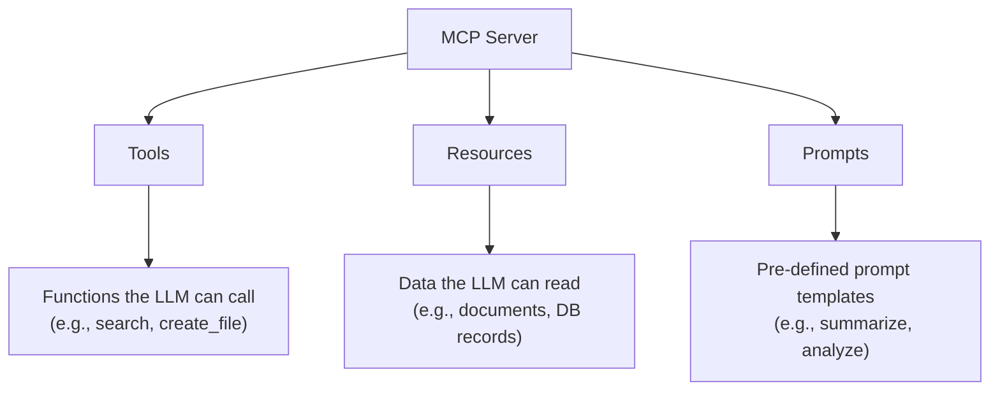
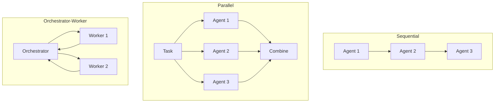
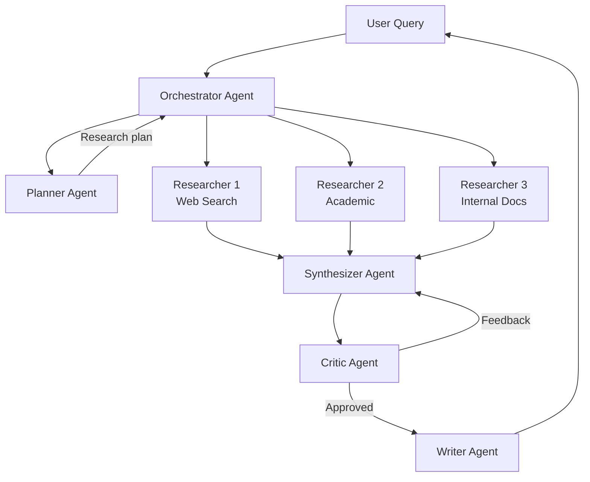

# Agentic AI & MCP Deep Dive

> Building Autonomous AI Systems with Tool Use

---

## 📋 Table of Contents

1. [What is Agentic AI?](#-what-is-agentic-ai)
2. [Agent Architecture](#-agent-architecture)
3. [Tool Use & Function Calling](#-tool-use--function-calling)
4. [Planning & Reasoning](#-planning--reasoning)
5. [Memory Systems](#-memory-systems)
6. [Model Context Protocol (MCP)](#-model-context-protocol-mcp)
7. [Multi-Agent Systems](#-multi-agent-systems)
8. [Agent Frameworks](#-agent-frameworks)
9. [Interview Questions](#-interview-questions)

---

## 🤖 What is Agentic AI?

### Definition

An AI Agent is an autonomous system that:
1. **Perceives** its environment (receives inputs)
2. **Reasons** about goals and current state
3. **Acts** by using tools or producing outputs
4. **Learns** from feedback/outcomes



### Workflows vs Agents (Anthropic's Definition)

| Type | Description | Decision Making |
|------|-------------|-----------------|
| **Workflow** | Predefined code paths with LLM calls | Static, hardcoded |
| **Agent** | LLM dynamically decides actions | Autonomous, flexible |



### When to Use Agents

| Use Agents When | Use Workflows When |
|----------------|-------------------|
| Tasks require dynamic decisions | Steps are predictable |
| Complex, multi-step reasoning | Speed is critical |
| Exploration is needed | Reliability is paramount |
| User requests are open-ended | Compliance/audit required |

---

## 🏗️ Agent Architecture

### The Agent Loop



### Core Components

```python
class Agent:
    def __init__(self, llm, tools: list, memory=None):
        self.llm = llm
        self.tools = {t.name: t for t in tools}
        self.memory = memory or []
    
    def run(self, task: str, max_iterations: int = 10):
        self.memory.append({"role": "user", "content": task})
        
        for i in range(max_iterations):
            # 1. Think: LLM decides next action
            response = self.llm.invoke(
                messages=self.memory,
                tools=self.tools
            )
            
            # 2. Check if done
            if response.finish_reason == "stop":
                return response.content
            
            # 3. Act: Execute tool
            tool_call = response.tool_calls[0]
            tool_result = self.tools[tool_call.name].run(
                **tool_call.arguments
            )
            
            # 4. Update memory
            self.memory.append({"role": "assistant", "content": response})
            self.memory.append({
                "role": "tool",
                "tool_call_id": tool_call.id,
                "content": str(tool_result)
            })
        
        return "Max iterations reached"
```

---

## 🔧 Tool Use & Function Calling

### What is Function Calling?

Function calling allows LLMs to output structured tool invocations:

```mermaid
sequenceDiagram
    participant U as User
    participant LLM as LLM
    participant T as Tool

    U->>LLM: "What's the weather in Tokyo?"
    LLM->>LLM: Recognize tool needed
    LLM->>T: {"name": "get_weather", "args": {"city": "Tokyo"}}
    T->>T: Execute API call
    T->>LLM: {"temp": 22, "condition": "sunny"}
    LLM->>U: "It's 22°C and sunny in Tokyo"
```



### Defining Tools

```python
# OpenAI format
tools = [
    {
        "type": "function",
        "function": {
            "name": "search_web",
            "description": "Search the web for current information",
            "parameters": {
                "type": "object",
                "properties": {
                    "query": {
                        "type": "string",
                        "description": "The search query"
                    },
                    "max_results": {
                        "type": "integer",
                        "description": "Maximum results to return",
                        "default": 5
                    }
                },
                "required": ["query"]
            }
        }
    }
]

# Using the tool
response = client.chat.completions.create(
    model="gpt-4o",
    messages=[{"role": "user", "content": "Find recent AI news"}],
    tools=tools,
    tool_choice="auto"  # or "required" or specific tool
)

# Handle tool call
if response.choices[0].message.tool_calls:
    tool_call = response.choices[0].message.tool_calls[0]
    result = execute_tool(tool_call.function.name, tool_call.function.arguments)
```

### Tool Design Best Practices

| Practice | Description |
|----------|-------------|
| **Clear names** | `search_documents` not `sd` |
| **Good descriptions** | Help LLM understand when to use |
| **Constrained params** | Enums, limits, defaults |
| **Error handling** | Return useful error messages |
| **Idempotent** | Safe to retry |

```python
# Well-designed tool
{
    "name": "create_calendar_event",
    "description": "Create a new calendar event. Use this when the user wants to schedule a meeting or reminder.",
    "parameters": {
        "type": "object",
        "properties": {
            "title": {
                "type": "string",
                "description": "Event title",
                "maxLength": 100
            },
            "start_time": {
                "type": "string",
                "format": "date-time",
                "description": "Start time in ISO 8601 format"
            },
            "duration_minutes": {
                "type": "integer",
                "description": "Duration in minutes",
                "minimum": 15,
                "maximum": 480,
                "default": 60
            },
            "attendees": {
                "type": "array",
                "items": {"type": "string", "format": "email"},
                "description": "Email addresses of attendees"
            }
        },
        "required": ["title", "start_time"]
    }
}
```

---

## 🧠 Planning & Reasoning

### Prompting Strategies

| Strategy | Description | When to Use |
|----------|-------------|-------------|
| **Zero-shot** | Direct task execution | Simple tasks |
| **Chain-of-Thought** | Step-by-step reasoning | Complex reasoning |
| **ReAct** | Reason + Act loop | Tool-using agents |
| **Tree-of-Thought** | Explore multiple paths | Hard problems |
| **Self-Consistency** | Multiple attempts, vote | Accuracy critical |

### Chain-of-Thought (CoT)

```python
cot_prompt = """
Solve this step by step:

Question: A train travels 120 miles in 2 hours. 
If it continues at the same speed, how far will it travel in 5 hours?

Let me think step by step:
1. First, I'll calculate the speed...
"""
```

### ReAct Pattern

ReAct interleaves Reasoning and Acting:

```
Question: What is the capital of the country where the Eiffel Tower is located?

Thought: I need to find where the Eiffel Tower is located.
Action: search("Eiffel Tower location")
Observation: The Eiffel Tower is in Paris, France.

Thought: Now I know it's in France. I need the capital of France.
Action: search("capital of France")
Observation: The capital of France is Paris.

Thought: I have the answer now.
Answer: Paris
```

```python
react_prompt = """
You are an agent that solves problems by reasoning and using tools.

Available tools:
- search(query): Search for information
- calculate(expression): Perform calculations

Always follow this format:
Thought: <your reasoning>
Action: <tool_name>(<arguments>)
Observation: <tool output>
... (repeat until solved)
Thought: I have the final answer
Answer: <your answer>

Question: {question}
"""
```

### Tree-of-Thoughts

Explore multiple reasoning paths and evaluate:

```mermaid
flowchart TB
    P[Problem] --> T1[Thought 1]
    P --> T2[Thought 2]
    P --> T3[Thought 3]
    
    T1 --> T1A[Expand 1a]
    T1 --> T1B[Expand 1b]
    T2 --> T2A[Expand 2a]
    
    T1A --> |Evaluate| WIN[Best Path ✓]
    T1B --> |Prune| X1[Dead End ✗]
    T2A --> |Prune| X2[Dead End ✗]
    T3 --> |Prune| X3[Dead End ✗]
```



---

## 💾 Memory Systems

### Types of Memory



| Type | Duration | Storage | Use Case |
|------|----------|---------|----------|
| **Short-term** | Conversation | Context window | Current task |
| **Long-term** | Persistent | Vector DB | User profile |
| **Episodic** | Persistent | Database | Past experiences |

### Implementing Memory

```python
class AgentMemory:
    def __init__(self, vector_store, context_limit=4000):
        self.short_term = []  # Current conversation
        self.vector_store = vector_store  # Long-term
        self.context_limit = context_limit
    
    def add(self, message: dict):
        """Add to short-term memory"""
        self.short_term.append(message)
        
        # Summarize if too long
        if self._count_tokens() > self.context_limit:
            self._summarize_and_store()
    
    def get_context(self, query: str) -> list:
        """Build context from short + long term memory"""
        # Recent conversation
        context = self.short_term[-10:]
        
        # Retrieve relevant long-term memories
        relevant = self.vector_store.similarity_search(query, k=5)
        
        # Insert as system context
        if relevant:
            context.insert(0, {
                "role": "system",
                "content": f"Relevant past context: {relevant}"
            })
        
        return context
    
    def _summarize_and_store(self):
        """Compress old messages and store in long-term"""
        old_messages = self.short_term[:-5]
        summary = self.llm.summarize(old_messages)
        self.vector_store.add(summary)
        self.short_term = self.short_term[-5:]
```

---

## 🔌 Model Context Protocol (MCP)

### What is MCP?

MCP is Anthropic's open standard for connecting AI systems to external tools and data:



### MCP Architecture

| Component | Description |
|-----------|-------------|
| **MCP Host** | Application running the AI (e.g., Claude Desktop) |
| **MCP Client** | Maintains connection to servers |
| **MCP Server** | Exposes tools, resources, prompts |
| **Transport** | Communication layer (stdio, HTTP) |

### MCP Primitives



### Building an MCP Server (Python)

```python
from mcp.server import Server
from mcp.types import Tool, TextContent
import mcp.server.stdio

# Create server
server = Server("my-tools-server")

# Define a tool
@server.tool()
async def search_database(query: str) -> str:
    """Search the internal database for relevant documents."""
    # Your database search logic
    results = await db.search(query)
    return f"Found {len(results)} results: {results}"

@server.tool()
async def create_ticket(
    title: str,
    description: str,
    priority: str = "medium"
) -> str:
    """Create a support ticket in the system."""
    ticket_id = await ticketing_system.create({
        "title": title,
        "description": description,
        "priority": priority
    })
    return f"Created ticket #{ticket_id}"

# Define a resource
@server.list_resources()
async def list_resources():
    return [
        Resource(
            uri="docs://internal/guidelines",
            name="Company Guidelines",
            description="Internal company policies and guidelines"
        )
    ]

@server.read_resource()
async def read_resource(uri: str):
    if uri == "docs://internal/guidelines":
        content = await load_guidelines()
        return TextContent(text=content)

# Run the server
if __name__ == "__main__":
    mcp.server.stdio.run(server)
```

### MCP Configuration (Claude Desktop)

```json
// claude_desktop_config.json
{
  "mcpServers": {
    "database": {
      "command": "python",
      "args": ["/path/to/db_server.py"],
      "env": {
        "DATABASE_URL": "postgresql://..."
      }
    },
    "github": {
      "command": "npx",
      "args": ["-y", "@modelcontextprotocol/server-github"],
      "env": {
        "GITHUB_TOKEN": "..."
      }
    },
    "filesystem": {
      "command": "npx",
      "args": ["-y", "@modelcontextprotocol/server-filesystem", "/allowed/path"]
    }
  }
}
```

### Why MCP Matters

| Benefit | Description |
|---------|-------------|
| **Standardization** | One protocol for all integrations |
| **Security** | Controlled access to resources |
| **Scalability** | Add servers without changing client |
| **Ecosystem** | Growing library of pre-built servers |
| **Cross-platform** | Works with Claude, OpenAI, others |

---

## 🤝 Multi-Agent Systems

### Patterns



### Orchestrator-Worker Pattern

```python
class OrchestratorAgent:
    def __init__(self, workers: dict[str, Agent]):
        self.workers = workers
        self.llm = get_orchestrator_llm()
    
    def run(self, task: str):
        # Plan subtasks
        plan = self.llm.invoke(f"""
        Break down this task into subtasks for specialists:
        Task: {task}
        
        Available workers: {list(self.workers.keys())}
        
        Return JSON: [{{"worker": "...", "subtask": "..."}}]
        """)
        
        # Execute subtasks
        results = {}
        for item in plan:
            worker = self.workers[item["worker"]]
            results[item["subtask"]] = worker.run(item["subtask"])
        
        # Synthesize
        final = self.llm.invoke(f"""
        Synthesize these results into a final answer:
        {results}
        """)
        return final

# Example: Research system
orchestrator = OrchestratorAgent({
    "researcher": ResearchAgent(),
    "writer": WriterAgent(),
    "reviewer": ReviewerAgent()
})

result = orchestrator.run("Write a report on quantum computing")
```

### Agent Communication

```python
class Message:
    sender: str
    recipient: str  # or "broadcast"
    content: str
    type: str  # "request", "response", "info"

class AgentNetwork:
    def __init__(self):
        self.agents = {}
        self.message_queue = []
    
    def register(self, agent: Agent):
        self.agents[agent.name] = agent
    
    def send(self, message: Message):
        if message.recipient == "broadcast":
            for agent in self.agents.values():
                agent.receive(message)
        else:
            self.agents[message.recipient].receive(message)
```

---

## 🛠️ Agent Frameworks

### Framework Comparison

| Framework | Strengths | Use Case |
|-----------|-----------|----------|
| **LangChain** | Comprehensive, large ecosystem | General agents |
| **LlamaIndex** | Data/RAG focused | RAG agents |
| **CrewAI** | Multi-agent, role-based | Team simulations |
| **AutoGen** | Microsoft, coding focus | Code generation |
| **Semantic Kernel** | .NET/Python, enterprise | Enterprise |

### LangChain Agent Example

```python
from langchain.agents import create_react_agent, AgentExecutor
from langchain.tools import Tool
from langchain_openai import ChatOpenAI

# Define tools
tools = [
    Tool(
        name="Search",
        func=search_function,
        description="Search the web for information"
    ),
    Tool(
        name="Calculator",
        func=calculator_function,
        description="Perform mathematical calculations"
    )
]

# Create agent
llm = ChatOpenAI(model="gpt-4o")
agent = create_react_agent(llm, tools, prompt)
executor = AgentExecutor(agent=agent, tools=tools, verbose=True)

# Run
result = executor.invoke({"input": "What is 15% of the US population?"})
```

### CrewAI Example

```python
from crewai import Agent, Task, Crew

# Define agents with roles
researcher = Agent(
    role="Research Analyst",
    goal="Find accurate information on given topics",
    backstory="Expert researcher with attention to detail",
    tools=[search_tool, scrape_tool]
)

writer = Agent(
    role="Content Writer",
    goal="Create compelling content from research",
    backstory="Experienced writer who crafts engaging narratives"
)

# Define tasks
research_task = Task(
    description="Research the latest trends in AI agents",
    agent=researcher
)

write_task = Task(
    description="Write a blog post based on the research",
    agent=writer,
    context=[research_task]  # Depends on research
)

# Create crew and execute
crew = Crew(agents=[researcher, writer], tasks=[research_task, write_task])
result = crew.kickoff()
```

---

## 🎯 Interview Questions

### Fundamentals

**Q1: What distinguishes an AI agent from a simple LLM API call?**

**Answer:** An agent has:
1. **Autonomy**: Makes decisions about actions
2. **Tool use**: Can interact with external systems
3. **Memory**: Maintains state across interactions
4. **Goal-directed**: Works toward objectives
5. **Feedback loop**: Observes results, adjusts behavior

Simple LLM call: Input → Output
Agent: Goal → [Think → Act → Observe]* → Result

---

**Q2: Explain the ReAct pattern.**

**Answer:** ReAct (Reason + Act) interleaves reasoning with action:

1. **Thought**: Reason about current state and next step
2. **Action**: Execute a tool
3. **Observation**: Process the result
4. Repeat until goal achieved

Benefits: Interpretable reasoning trace, error correction, grounded responses.

---

**Q3: What is MCP and why is it important?**

**Answer:** Model Context Protocol is Anthropic's open standard for AI-tool integration:

- **Standardizes** tool/data connectivity (like USB-C for AI)
- **Separates** concerns (apps vs integrations)
- **Enables ecosystem** of reusable servers
- **Security**: Controlled access model

Architecture: Host (AI app) ↔ Client ↔ Server (tools/data)

---

### Advanced

**Q4: Compare short-term, long-term, and episodic memory in agents.**

**Answer:**

| Type | Storage | Duration | Content |
|------|---------|----------|---------|
| Short-term | Context window | Session | Current conversation |
| Long-term | Vector DB | Permanent | User prefs, facts |
| Episodic | Database | Permanent | Past interactions, outcomes |

Long-term enables personalization; episodic enables learning from experience.

---

**Q5: How do you handle agent reliability/errors?**

**Answer:**
1. **Retry logic**: Exponential backoff for tool failures
2. **Fallbacks**: Alternative tools/approaches
3. **Guardrails**: Output validation
4. **Human-in-loop**: Escalation for uncertain cases
5. **Logging**: Full trace for debugging
6. **Timeouts**: Prevent infinite loops
7. **State checkpointing**: Resume from failures

---

**Q6: Design a multi-agent research system.**

**Answer:**



Key considerations:
- Parallel research for speed
- Critic for quality control
- Clear handoff protocols
- Shared memory/context

---

**Q7: What are guardrails in agents and how do you implement them?**

**Answer:** Guardrails ensure agent safety/reliability:

1. **Input validation**: Filter harmful/out-of-scope requests
2. **Output validation**: Check tool calls before execution
3. **Content filtering**: Block PII, inappropriate content
4. **Rate limiting**: Prevent runaway tool calls
5. **Scope limiting**: Restrict tool access

```python
class GuardedAgent:
    def execute_tool(self, tool_call):
        # Validate tool is allowed
        if tool_call.name not in self.allowed_tools:
            return "Tool not permitted"
        
        # Validate arguments
        if not self.validate_args(tool_call):
            return "Invalid arguments"
        
        # Check rate limits
        if self.rate_limiter.exceeded(tool_call.name):
            return "Rate limit exceeded"
        
        return self.tools[tool_call.name].run(**tool_call.args)
```

---

## 📚 Further Reading

- [Anthropic Building Effective Agents](https://www.anthropic.com/research/building-effective-agents)
- [MCP Documentation](https://modelcontextprotocol.io/)
- [LangChain Agents Guide](https://python.langchain.com/docs/modules/agents/)
- [ReAct Paper](https://arxiv.org/abs/2210.03629)
- [AutoGPT Repository](https://github.com/Significant-Gravitas/AutoGPT)

---

*Previous: [RAG Deep Dive](./rag-deep-dive.md) | Next: [Production MLOps](./production-mlops.md)*
