# GenAI Fundamentals Deep Dive

> From Neural Networks to Large Language Models - A Comprehensive Guide

---

## 📋 Table of Contents

1. [Neural Network Foundations](#-neural-network-foundations)
2. [Deep Learning Essentials](#-deep-learning-essentials)
3. [The Transformer Revolution](#-the-transformer-revolution)
4. [Attention Mechanism Deep Dive](#-attention-mechanism-deep-dive)
5. [Large Language Models](#-large-language-models)
6. [LLM Inference Parameters](#-llm-inference-parameters)
7. [Tokenization](#-tokenization)
8. [Interview Questions](#-interview-questions)

---

## 🧠 Neural Network Foundations

### What is a Neural Network?

A neural network is a computational model inspired by the human brain, consisting of interconnected nodes (neurons) organized in layers that learn patterns from data.

```mermaid
flowchart LR
    subgraph Input["Input Layer"]
        I1[x₁]
        I2[x₂]
        I3[x₃]
    end
    
    subgraph Hidden["Hidden Layer"]
        H1[h₁]
        H2[h₂]
        H3[h₃]
        H4[h₄]
    end
    
    subgraph Output["Output Layer"]
        O1[y₁]
        O2[y₂]
    end
    
    I1 --> H1 & H2 & H3 & H4
    I2 --> H1 & H2 & H3 & H4
    I3 --> H1 & H2 & H3 & H4
    H1 --> O1 & O2
    H2 --> O1 & O2
    H3 --> O1 & O2
    H4 --> O1 & O2
```

### The Perceptron (Single Neuron)

A single neuron computes a weighted sum of inputs and applies an activation function:

```
output = activation(Σ(wᵢ × xᵢ) + bias)
```

```python
import numpy as np

class Perceptron:
    def __init__(self, n_inputs):
        self.weights = np.random.randn(n_inputs)
        self.bias = np.random.randn()
    
    def forward(self, x):
        # Weighted sum + bias
        z = np.dot(self.weights, x) + self.bias
        # Activation function (sigmoid)
        return 1 / (1 + np.exp(-z))
```

### Activation Functions

Activation functions introduce non-linearity, enabling networks to learn complex patterns:

| Function | Formula | Use Case |
|----------|---------|----------|
| **Sigmoid** | σ(x) = 1/(1+e⁻ˣ) | Binary classification, output layer |
| **ReLU** | max(0, x) | Hidden layers (most common) |
| **Tanh** | (eˣ-e⁻ˣ)/(eˣ+e⁻ˣ) | Hidden layers, range [-1, 1] |
| **Softmax** | eˣⁱ/Σeˣʲ | Multi-class classification output |
| **GELU** | x × Φ(x) | Transformers, LLMs |

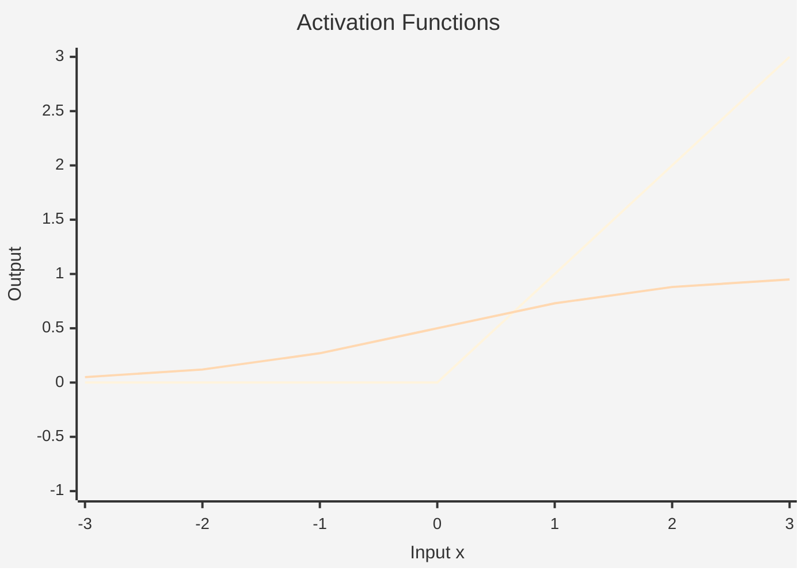

### Backpropagation

Backpropagation is how neural networks learn - by computing gradients of the loss with respect to each weight:

```mermaid
flowchart LR
    subgraph Forward["Forward Pass"]
        direction LR
        FI[Input] --> FH[Hidden] --> FO[Output] --> FL[Loss]
    end
    
    subgraph Backward["Backward Pass"]
        direction RL
        BL[∂Loss] --> BO[∂Output] --> BH[∂Hidden] --> BI[∂Weights]
    end
    
    Forward --> Backward
```

**Key Concepts:**
1. **Loss Function**: Measures prediction error (MSE, Cross-Entropy)
2. **Chain Rule**: Propagates gradients through layers
3. **Gradient Descent**: Updates weights to minimize loss

```python
# Simplified gradient descent update
learning_rate = 0.01
for param in model.parameters():
    param = param - learning_rate * param.gradient
```

---

## 🔥 Deep Learning Essentials

### Types of Neural Networks

| Architecture | Best For | Key Feature |
|--------------|----------|-------------|
| **MLP** (Feedforward) | Tabular data, simple tasks | Fully connected layers |
| **CNN** (Convolutional) | Images, spatial data | Local feature extraction |
| **RNN** (Recurrent) | Sequences (legacy) | Memory of past inputs |
| **Transformer** | Text, any sequence | Attention mechanism |

### Convolutional Neural Networks (CNNs)

CNNs extract hierarchical features from images using convolution operations:

```mermaid
flowchart LR
    I[Input Image<br/>224×224×3] --> C1[Conv + ReLU<br/>Feature Maps] --> P1[MaxPool<br/>Downsample]
    P1 --> C2[Conv + ReLU] --> P2[MaxPool]
    P2 --> F[Flatten] --> FC[Fully Connected] --> O[Output<br/>Classes]
```

### Recurrent Neural Networks (RNNs)

RNNs process sequences by maintaining hidden state, but suffer from vanishing gradients:

```mermaid
flowchart LR
    X1[x₁] --> H1[h₁]
    X2[x₂] --> H2[h₂]
    X3[x₃] --> H3[h₃]
    H1 -->|State| H2
    H2 -->|State| H3
    H3 --> Y[Output]
```

**Limitations of RNNs:**
- Sequential processing (slow)
- Vanishing/exploding gradients
- Difficulty with long-range dependencies

> This is why Transformers replaced RNNs for most NLP tasks!

### Optimization Algorithms

| Optimizer | Description | When to Use |
|-----------|-------------|-------------|
| **SGD** | Basic stochastic gradient descent | Simple cases |
| **Adam** | Adaptive learning rates per parameter | Default choice |
| **AdamW** | Adam with weight decay | LLM training |
| **Lion** | Memory-efficient, faster | Large models |

```python
import torch.optim as optim

# Adam optimizer (most common)
optimizer = optim.Adam(model.parameters(), lr=1e-4)

# AdamW for transformers (includes weight decay)
optimizer = optim.AdamW(model.parameters(), lr=1e-5, weight_decay=0.01)
```

---

## 🚀 The Transformer Revolution

### Why Transformers?

The 2017 paper "Attention Is All You Need" introduced the Transformer, solving RNN limitations:

| Problem with RNNs | Transformer Solution |
|-------------------|---------------------|
| Sequential processing | Parallel processing |
| Vanishing gradients | Direct attention connections |
| Limited context window | Self-attention over all positions |
| Hard to parallelize | Fully parallelizable |

### Transformer Architecture Overview

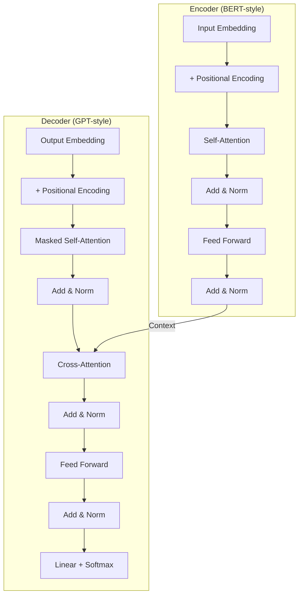

### Encoder vs Decoder Models

| Type | Examples | Use Case | How It Works |
|------|----------|----------|--------------|
| **Encoder-only** | BERT, RoBERTa | Understanding, classification | Bidirectional attention |
| **Decoder-only** | GPT, Llama, Claude | Generation | Causal (left-to-right) attention |
| **Encoder-Decoder** | T5, BART | Translation, summarization | Full sequence-to-sequence |

---

## 🎯 Attention Mechanism Deep Dive

### The Core Idea

Attention allows the model to focus on relevant parts of the input when processing each position. Instead of compressing everything into a fixed vector, attention creates direct connections between all positions.

### Query, Key, Value (QKV)

Think of attention like a search engine:
- **Query (Q)**: "What am I looking for?"
- **Key (K)**: "What do I contain?"
- **Value (V)**: "What information should I provide?"

```mermaid
flowchart LR
    subgraph Input["Input Embeddings"]
        X[X]
    end
    
    subgraph Projections["Linear Projections"]
        Q[Query = X × Wq]
        K[Key = X × Wk]
        V[Value = X × Wv]
    end
    
    subgraph Attention["Attention Calculation"]
        SC[Scores = Q × Kᵀ / √d]
        SM[Softmax]
        OUT[Output = Softmax × V]
    end
    
    X --> Q & K & V
    Q & K --> SC --> SM --> OUT
    V --> OUT
```

### Scaled Dot-Product Attention

The attention formula:

```
Attention(Q, K, V) = softmax(Q × Kᵀ / √dₖ) × V
```

Where:
- `Q × Kᵀ`: Dot product similarity between query and all keys
- `√dₖ`: Scaling factor (dimension of keys) to prevent large values
- `softmax`: Converts to probability distribution
- `× V`: Weighted sum of values

```python
import torch
import torch.nn.functional as F
import math

def scaled_dot_product_attention(query, key, value, mask=None):
    """
    Args:
        query: (batch, seq_len, d_k)
        key: (batch, seq_len, d_k)
        value: (batch, seq_len, d_v)
        mask: Optional attention mask
    Returns:
        output: (batch, seq_len, d_v)
        attention_weights: (batch, seq_len, seq_len)
    """
    d_k = query.size(-1)
    
    # Compute attention scores
    scores = torch.matmul(query, key.transpose(-2, -1)) / math.sqrt(d_k)
    
    # Apply mask (for causal/padding)
    if mask is not None:
        scores = scores.masked_fill(mask == 0, float('-inf'))
    
    # Softmax to get attention weights
    attention_weights = F.softmax(scores, dim=-1)
    
    # Weighted sum of values
    output = torch.matmul(attention_weights, value)
    
    return output, attention_weights
```

### Multi-Head Attention

Instead of one attention operation, we run multiple "heads" in parallel, each learning different relationships:

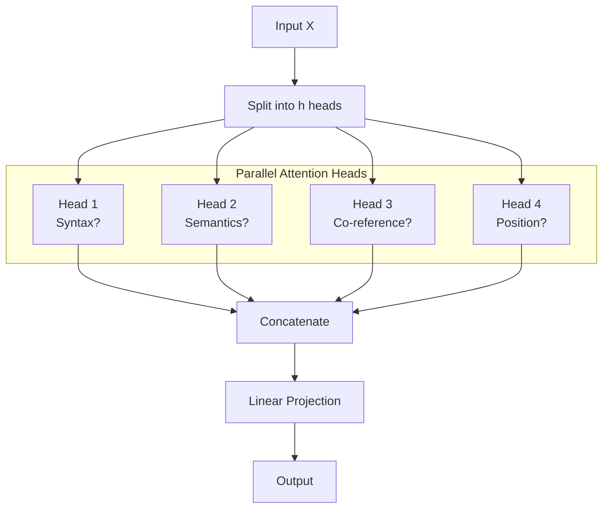

```python
class MultiHeadAttention(torch.nn.Module):
    def __init__(self, d_model, num_heads):
        super().__init__()
        self.num_heads = num_heads
        self.d_k = d_model // num_heads
        
        self.W_q = torch.nn.Linear(d_model, d_model)
        self.W_k = torch.nn.Linear(d_model, d_model)
        self.W_v = torch.nn.Linear(d_model, d_model)
        self.W_o = torch.nn.Linear(d_model, d_model)
    
    def forward(self, query, key, value, mask=None):
        batch_size = query.size(0)
        
        # Linear projections and reshape for multi-head
        Q = self.W_q(query).view(batch_size, -1, self.num_heads, self.d_k).transpose(1, 2)
        K = self.W_k(key).view(batch_size, -1, self.num_heads, self.d_k).transpose(1, 2)
        V = self.W_v(value).view(batch_size, -1, self.num_heads, self.d_k).transpose(1, 2)
        
        # Attention for each head
        attn_output, _ = scaled_dot_product_attention(Q, K, V, mask)
        
        # Concatenate heads and project
        attn_output = attn_output.transpose(1, 2).contiguous().view(batch_size, -1, self.num_heads * self.d_k)
        return self.W_o(attn_output)
```

### Self-Attention vs Cross-Attention

| Type | Query Source | Key/Value Source | Use Case |
|------|--------------|------------------|----------|
| **Self-Attention** | Same sequence | Same sequence | Encoder, Decoder self-attention |
| **Cross-Attention** | Decoder | Encoder output | Connecting encoder-decoder |
| **Causal Self-Attention** | Same sequence | Past positions only | Autoregressive generation |

### Positional Encoding

Transformers process all tokens in parallel, losing position information. Positional encoding adds position signals:

**Sinusoidal (Original):**
```
PE(pos, 2i) = sin(pos / 10000^(2i/d))
PE(pos, 2i+1) = cos(pos / 10000^(2i/d))
```

**Modern Alternatives:**

| Method | Description | Used By |
|--------|-------------|---------|
| **Learned** | Trainable position embeddings | BERT, GPT-2 |
| **RoPE** | Rotary Position Embedding | Llama, Qwen |
| **ALiBi** | Attention with Linear Biases | BLOOM, MPT |

```python
class RotaryPositionEmbedding:
    """RoPE - Rotary Position Embedding (used in Llama)"""
    def __init__(self, dim, max_seq_len=2048):
        inv_freq = 1.0 / (10000 ** (torch.arange(0, dim, 2).float() / dim))
        t = torch.arange(max_seq_len)
        freqs = torch.einsum('i,j->ij', t, inv_freq)
        self.cos_cached = freqs.cos()
        self.sin_cached = freqs.sin()
    
    def apply(self, x, seq_len):
        # Rotate query/key vectors based on position
        cos = self.cos_cached[:seq_len]
        sin = self.sin_cached[:seq_len]
        return (x * cos) + (self._rotate_half(x) * sin)
```

---

## 🤖 Large Language Models

### What is an LLM?

A Large Language Model is a transformer-based neural network trained on massive text corpora to predict the next token. Through this simple objective, LLMs learn language understanding, reasoning, and world knowledge.

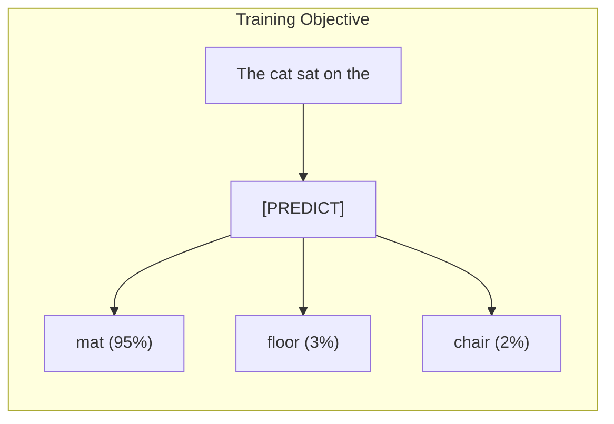

### LLM Architecture Comparison

| Model | Organization | Parameters | Architecture | Context |
|-------|--------------|------------|--------------|---------|
| **GPT-4** | OpenAI | ~1.8T (rumored) | Decoder-only, MoE | 128K |
| **Claude 3** | Anthropic | Unknown | Decoder-only | 200K |
| **Gemini** | Google | Various | Decoder-only, MoE | 1M+ |
| **Llama 3** | Meta | 8B-405B | Decoder-only | 128K |
| **Mistral** | Mistral AI | 7B-8x22B | Decoder-only, MoE | 32K |

### The LLM Stack

```mermaid
flowchart TB
    subgraph Input["Input Processing"]
        T[Text] --> TOK[Tokenizer]
        TOK --> EMB[Token Embeddings]
        EMB --> POS[+ Position Encoding]
    end
    
    subgraph Layers["Transformer Layers (×N)"]
        POS --> L1[Layer 1]
        L1 --> L2[Layer 2]
        L2 --> LN[Layer N]
    end
    
    subgraph Layer["Each Layer Contains"]
        direction TB
        ATT[Multi-Head Self-Attention]
        FFN[Feed-Forward Network]
        RMS[RMSNorm]
    end
    
    subgraph Output["Output"]
        LN --> NORM[Final Norm]
        NORM --> LM[LM Head]
        LM --> LOGITS[Logits over Vocab]
        LOGITS --> SAMPLE[Sampling]
        SAMPLE --> TOKEN[Next Token]
    end
```

### Scaling Laws

LLM performance scales predictably with compute, data, and parameters:

| Factor | Effect | Example |
|--------|--------|---------|
| **Parameters** | More = better reasoning | 7B → 70B significant jump |
| **Training Data** | Quality > quantity | Common Crawl → curated data |
| **Compute** | FLOPs = 6 × N × D | Training budget |

**Chinchilla Scaling Law:**
```
Optimal: Parameters ≈ Tokens / 20
For 1T tokens → ~50B parameters optimal
```

### Key Innovations in Modern LLMs

| Innovation | Description | Benefit |
|------------|-------------|---------|
| **RMSNorm** | Simpler normalization than LayerNorm | Faster training |
| **SwiGLU** | Gated activation function | Better performance |
| **RoPE** | Rotary position embeddings | Better length generalization |
| **GQA** | Grouped-Query Attention | Faster inference |
| **Flash Attention** | IO-aware attention | Memory efficient |
| **MoE** | Mixture of Experts | More params, same compute |

---

## ⚙️ LLM Inference Parameters

### How Text Generation Works

LLMs generate text autoregressively - one token at a time:

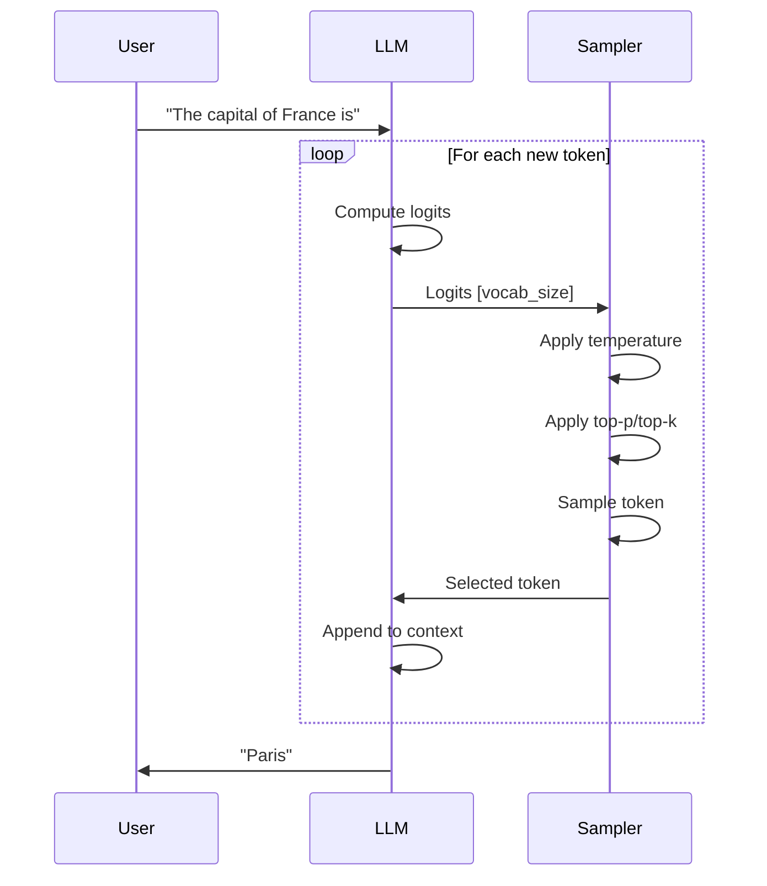

### Temperature

Temperature controls randomness by scaling logits before softmax:

```python
def apply_temperature(logits, temperature):
    """
    temperature = 0: Deterministic (argmax)
    temperature = 1: Original distribution
    temperature > 1: More random/creative
    temperature < 1: More focused/deterministic
    """
    return logits / temperature
```

| Temperature | Behavior | Use Case |
|-------------|----------|----------|
| 0 | Always pick highest probability | Factual answers, code |
| 0.3-0.5 | Focused but some variety | Balanced responses |
| 0.7-0.8 | Creative but coherent | Creative writing |
| 1.0+ | Very random | Brainstorming |

### Top-p (Nucleus Sampling)

Top-p samples from the smallest set of tokens whose cumulative probability exceeds `p`:

```python
def top_p_sampling(logits, p=0.9):
    """
    Only consider tokens that make up top p% probability mass
    """
    sorted_logits, sorted_indices = torch.sort(logits, descending=True)
    cumulative_probs = torch.cumsum(F.softmax(sorted_logits, dim=-1), dim=-1)
    
    # Find cutoff index
    cutoff_idx = (cumulative_probs > p).nonzero()[0]
    
    # Zero out tokens beyond cutoff
    logits[sorted_indices[cutoff_idx:]] = float('-inf')
    
    return logits
```

**Example with p=0.9:**
```
Tokens:     [Paris, Lyon, London, Berlin, Tokyo, ...]
Probs:      [0.60,  0.20, 0.10,   0.05,   0.03, ...]
Cumulative: [0.60,  0.80, 0.90,   0.95,   0.98, ...]
                              ↑
                         Cutoff at 0.9
→ Only sample from [Paris, Lyon, London]
```

### Top-k Sampling

Top-k is simpler - only consider the k most likely tokens:

```python
def top_k_sampling(logits, k=50):
    """Keep only top k tokens"""
    top_k_logits, _ = torch.topk(logits, k)
    min_val = top_k_logits[-1]
    logits[logits < min_val] = float('-inf')
    return logits
```

### Comparison: Temperature vs Top-p vs Top-k

| Parameter | Controls | Typical Values |
|-----------|----------|----------------|
| **Temperature** | Sharpness of distribution | 0.0 - 2.0 |
| **Top-p** | Dynamic vocabulary cutoff | 0.9 - 0.95 |
| **Top-k** | Fixed vocabulary size | 40 - 100 |

> **Best Practice:** Use `temperature=0.7` with `top_p=0.95` for balanced output

### Other Important Parameters

| Parameter | Description | Typical Value |
|-----------|-------------|---------------|
| **max_tokens** | Maximum output length | 256-4096 |
| **frequency_penalty** | Penalize repeated tokens | 0.0-2.0 |
| **presence_penalty** | Penalize tokens that appeared | 0.0-2.0 |
| **stop_sequences** | Tokens that end generation | ["\n", "###"] |
| **seed** | For reproducibility | Any integer |

---

## 📝 Tokenization

### What is Tokenization?

Tokenization converts text into numerical IDs that the model can process:

```
"Hello, world!" → [15496, 11, 995, 0] → Embeddings → Model
```

### Tokenization Algorithms

| Algorithm | Description | Used By |
|-----------|-------------|---------|
| **BPE** | Byte Pair Encoding | GPT, Llama |
| **WordPiece** | Similar to BPE, different training | BERT |
| **SentencePiece** | Language-agnostic BPE | T5, Llama |
| **Tiktoken** | Fast BPE implementation | OpenAI models |

### How BPE Works

1. Start with character-level vocabulary
2. Count all adjacent pairs
3. Merge most frequent pair into new token
4. Repeat until vocabulary size reached

```python
# Example BPE progression
"lower" → ["l", "o", "w", "e", "r"]
         → ["lo", "w", "e", "r"]      # Merge "l"+"o"
         → ["low", "e", "r"]          # Merge "lo"+"w"
         → ["low", "er"]              # Merge "e"+"r"
         → ["lower"]                  # Merge "low"+"er"
```

### Tokenization Considerations

| Issue | Problem | Solution |
|-------|---------|----------|
| **Unknown words** | OOV tokens | Subword tokenization |
| **Token efficiency** | Cost/token | Right model for task |
| **Multilingual** | Poor for non-English | Multilingual tokenizers |
| **Code** | Symbols tokenized poorly | Code-specific tokenizers |

```python
from transformers import AutoTokenizer

# Load tokenizer
tokenizer = AutoTokenizer.from_pretrained("meta-llama/Llama-3.2-1B")

# Tokenize
text = "Hello, how are you?"
tokens = tokenizer.encode(text)
print(tokens)  # [9906, 11, 1268, 527, 499, 30]

# Decode
decoded = tokenizer.decode(tokens)
print(decoded)  # "Hello, how are you?"

# Token count matters for cost!
print(f"Token count: {len(tokens)}")
```

---

## 🎯 Interview Questions

### Fundamentals

**Q1: What is the vanishing gradient problem and how do Transformers solve it?**

**Answer:** The vanishing gradient problem occurs in deep networks when gradients become very small during backpropagation, preventing early layers from learning. RNNs suffer severely due to sequential gradient flow.

Transformers solve this through:
1. **Residual connections**: `output = layer(x) + x` - gradients flow directly
2. **Layer normalization**: Stabilizes activations
3. **Self-attention**: Direct connections between any positions (no sequential bottleneck)

---

**Q2: Explain the difference between self-attention and cross-attention.**

**Answer:**
- **Self-attention**: Q, K, V all come from the same sequence. Each position attends to all positions in its own sequence. Used in encoder and decoder self-attention layers.
- **Cross-attention**: Q comes from decoder, K and V from encoder output. Allows decoder to attend to encoder representations. Used in encoder-decoder models (T5, translation).

---

**Q3: Why do we scale by √dₖ in attention?**

**Answer:** Without scaling, dot products grow with dimension dₖ, pushing softmax into regions with small gradients. If Q and K have variance 1, their dot product has variance dₖ. Dividing by √dₖ keeps variance at 1, maintaining stable softmax gradients.

---

### LLM Specific

**Q4: What is the difference between GPT and BERT architectures?**

**Answer:**

| Aspect | BERT | GPT |
|--------|------|-----|
| Type | Encoder-only | Decoder-only |
| Attention | Bidirectional | Causal (left-to-right) |
| Pre-training | MLM + NSP | Next token prediction |
| Use case | Understanding, classification | Generation |
| Mask | No causal mask | Causal mask |

---

**Q5: Explain temperature in LLM sampling.**

**Answer:** Temperature (T) scales logits before softmax:
- **T=0**: Argmax (deterministic)
- **T<1**: Sharpens distribution → more confident/focused
- **T=1**: Original distribution
- **T>1**: Flattens distribution → more random/creative

Formula: `softmax(logits/T)`

---

**Q6: What is the KV Cache and why is it important?**

**Answer:** The KV (Key-Value) Cache stores computed key and value tensors for previous tokens during autoregressive generation. Without it, we'd recompute attention for all previous tokens at each step (O(n²) per token). With KV cache, we only compute for the new token and reuse cached values (O(n) per token).

This is critical for inference speed in long sequences.

---

**Q7: Explain Mixture of Experts (MoE) architecture.**

**Answer:** MoE replaces the standard FFN layer with multiple "expert" FFN networks plus a router:

1. **Router**: Learns which experts to activate for each token
2. **Top-k selection**: Only k experts (usually 2) are activated
3. **Sparse activation**: Total parameters increase, but compute stays constant

Benefits: More parameters for the same compute budget (e.g., GPT-4 rumored MoE with 8 experts).

---

**Q8: What is Flash Attention?**

**Answer:** Flash Attention is an IO-aware attention algorithm that:
1. Tiles attention computation to fit in SRAM (fast memory)
2. Avoids materializing the full N×N attention matrix in HBM (slow memory)
3. Fuses operations (softmax + matmul)

Results: 2-4x faster, linear memory scaling, same mathematical output.

---

## 📚 Further Reading

- [Attention Is All You Need (Original Paper)](https://arxiv.org/abs/1706.03762)
- [The Illustrated Transformer](https://jalammar.github.io/illustrated-transformer/)
- [LLM Visualization](https://bbycroft.net/llm)
- [Hugging Face Transformers Course](https://huggingface.co/learn/nlp-course)
- [Andrej Karpathy's Neural Networks: Zero to Hero](https://karpathy.ai/zero-to-hero.html)

---

*Next: [Fine-Tuning Guide](./fine-tuning-guide.md)*
