# RAG (Retrieval-Augmented Generation) Deep Dive

> Building Knowledge-Enhanced AI Systems

---

## 📋 Table of Contents

1. [What is RAG?](#-what-is-rag)
2. [RAG Architecture](#-rag-architecture)
3. [Embeddings Deep Dive](#-embeddings-deep-dive)
4. [Vector Databases](#-vector-databases)
5. [Chunking Strategies](#-chunking-strategies)
6. [Advanced RAG Techniques](#-advanced-rag-techniques)
7. [Evaluation](#-evaluation)
8. [Production Considerations](#-production-considerations)
9. [Interview Questions](#-interview-questions)

---

## 🎯 What is RAG?

### The Problem

LLMs have limitations:
- **Knowledge cutoff**: Training data has a date limit
- **Hallucination**: May generate false information confidently
- **Generic responses**: No access to your private/domain data
- **Context limits**: Can't fit entire knowledge bases in prompt

### The Solution: RAG

RAG combines retrieval systems with generative models:


### RAG vs Fine-Tuning

| Aspect | RAG | Fine-Tuning |
|--------|-----|-------------|
| **Data updates** | Instant (update DB) | Requires retraining |
| **Private data** | Kept separate | Baked into model |
| **Hallucination** | Reduced (grounded) | Still possible |
| **Compute cost** | Inference only | Training + inference |
| **Best for** | Factual Q&A, docs | Style, behavior change |

---

## 🏗️ RAG Architecture

### Basic RAG Pipeline

```mermaid
flowchart TB
    subgraph Indexing["📥 Indexing (Offline)"]
        D[Documents] --> C[Chunker]
        C --> E[Embedding Model]
        E --> V[(Vector Store)]
    end
    
    subgraph Query["🔍 Query (Online)"]
        Q[Query] --> QE[Embed Query]
        QE --> S[Similarity Search]
        S --> V
        V --> |Top-K| RET[Retrieved Chunks]
        RET --> P[Prompt Builder]
        Q --> P
        P --> LLM[LLM]
        LLM --> A[Answer]
    end
```



### Components Breakdown

| Component | Purpose | Examples |
|-----------|---------|----------|
| **Document Loader** | Ingest various formats | PDF, Web, API, DB |
| **Text Splitter** | Chunk documents | Recursive, Semantic |
| **Embedding Model** | Convert text to vectors | OpenAI, Cohere, BGE |
| **Vector Store** | Store & search vectors | Pinecone, Chroma, pgvector |
| **Retriever** | Fetch relevant docs | Similarity, Hybrid |
| **LLM** | Generate answer | GPT-4, Claude, Llama |

---

## 🧬 Embeddings Deep Dive

### What are Embeddings?

Embeddings are dense vector representations that capture semantic meaning:

```python
from sentence_transformers import SentenceTransformer

model = SentenceTransformer('all-MiniLM-L6-v2')

# Similar meaning → similar vectors
texts = [
    "The cat sits on the mat",
    "A feline rests on the rug",
    "Stock prices rose sharply"
]

embeddings = model.encode(texts)
# embeddings[0] is close to embeddings[1]
# embeddings[2] is far from both
```

### Embedding Models Comparison

| Model | Dimensions | Performance | Speed | Cost |
|-------|------------|-------------|-------|------|
| **OpenAI text-embedding-3-small** | 1536 | Excellent | Fast | $0.02/1M tokens |
| **OpenAI text-embedding-3-large** | 3072 | Best | Medium | $0.13/1M tokens |
| **Cohere embed-v3** | 1024 | Excellent | Fast | $0.10/1M tokens |
| **BGE-large** | 1024 | Great | Medium | Free (local) |
| **all-MiniLM-L6-v2** | 384 | Good | Very Fast | Free (local) |
| **Nomic-embed** | 768 | Great | Fast | Free (local) |

### Choosing an Embedding Model


### Embedding Best Practices

```python
from openai import OpenAI

client = OpenAI()

def get_embedding(text, model="text-embedding-3-small"):
    """Get embedding with proper text preparation"""
    # Clean and normalize
    text = text.replace("\n", " ").strip()
    
    # Truncate if too long (model-specific limit)
    max_tokens = 8191
    # ... truncation logic
    
    response = client.embeddings.create(
        input=text,
        model=model
    )
    return response.data[0].embedding

# For queries vs documents, some models use prefixes
query_embedding = get_embedding("query: What is machine learning?")
doc_embedding = get_embedding("passage: Machine learning is a subset of AI...")
```

---

## 🗄️ Vector Databases

### What is a Vector Database?

Vector databases are optimized for storing and searching high-dimensional vectors:


### Vector DB Comparison

| Database | Type | Scaling | Filtering | Best For |
|----------|------|---------|-----------|----------|
| **Pinecone** | Managed | Excellent | Native | Production, scale |
| **Weaviate** | Self-host/Cloud | Good | GraphQL | Hybrid search |
| **Chroma** | Embedded | Limited | Basic | Local dev, small |
| **Qdrant** | Self-host/Cloud | Good | Advanced | Self-hosted prod |
| **pgvector** | PostgreSQL ext | Good | SQL | Existing Postgres |
| **Milvus** | Self-host | Excellent | Advanced | Large scale |

### Vector Search Algorithms

**HNSW (Hierarchical Navigable Small World):**
- Graph-based approach
- Very fast queries
- Higher memory usage
- Best for most use cases

**IVF (Inverted File Index):**
- Cluster-based
- Lower memory
- Good for very large datasets

```python
# Chroma example
import chromadb

client = chromadb.Client()
collection = client.create_collection(
    name="documents",
    metadata={"hnsw:space": "cosine"}  # Distance metric
)

# Add documents
collection.add(
    documents=["Document 1 text", "Document 2 text"],
    embeddings=[[0.1, 0.2, ...], [0.3, 0.4, ...]],
    metadatas=[{"source": "file1"}, {"source": "file2"}],
    ids=["doc1", "doc2"]
)

# Query
results = collection.query(
    query_embeddings=[[0.15, 0.25, ...]],
    n_results=5,
    where={"source": "file1"}  # Metadata filtering
)
```

### Pinecone Example

```python
from pinecone import Pinecone

pc = Pinecone(api_key="your-api-key")

# Create index
pc.create_index(
    name="my-index",
    dimension=1536,
    metric="cosine",
    spec=ServerlessSpec(cloud="aws", region="us-east-1")
)

index = pc.Index("my-index")

# Upsert vectors
index.upsert(
    vectors=[
        {
            "id": "doc1",
            "values": [0.1, 0.2, ...],  # 1536 dimensions
            "metadata": {"text": "...", "source": "..."}
        }
    ],
    namespace="documents"
)

# Query
results = index.query(
    vector=[0.15, 0.25, ...],
    top_k=5,
    include_metadata=True,
    namespace="documents",
    filter={"source": {"$eq": "important"}}
)
```

---

## ✂️ Chunking Strategies

### Why Chunking Matters

Documents must be split into chunks because:
1. Embedding models have token limits
2. Smaller chunks are more precise for retrieval
3. LLM context windows are limited

### Chunking Methods


| Method | Description | Use Case |
|--------|-------------|----------|
| **Fixed Size** | Split every N tokens/chars | Simple, consistent |
| **Recursive** | Split by hierarchy (\n\n → \n → " ") | General purpose |
| **Semantic** | Split at meaning boundaries | Higher quality |
| **Document-based** | By sections, paragraphs | Structured docs |
| **Agentic** | LLM decides splits | Complex documents |

### Recursive Text Splitter (Recommended)

```python
from langchain.text_splitter import RecursiveCharacterTextSplitter

splitter = RecursiveCharacterTextSplitter(
    chunk_size=500,       # Target chunk size
    chunk_overlap=50,     # Overlap between chunks
    separators=["\n\n", "\n", ". ", " ", ""],
    length_function=len,
)

chunks = splitter.split_text(document_text)
```

### Semantic Chunking

```python
from langchain_experimental.text_splitter import SemanticChunker
from langchain_openai import OpenAIEmbeddings

embeddings = OpenAIEmbeddings()

splitter = SemanticChunker(
    embeddings=embeddings,
    breakpoint_threshold_type="percentile",
    breakpoint_threshold_amount=95
)

# Splits when embedding similarity drops significantly
chunks = splitter.split_text(document_text)
```

### Chunk Size Trade-offs

| Smaller Chunks (100-300) | Larger Chunks (500-1000) |
|--------------------------|--------------------------|
| ✅ More precise retrieval | ✅ More context per chunk |
| ✅ Less noise | ✅ Fewer chunks to search |
| ❌ May lose context | ❌ May include irrelevant info |
| ❌ More chunks to store | ❌ Less precise matching |

**Recommendation:** Start with 500 tokens, 50 overlap. Tune based on eval.

---

## 🚀 Advanced RAG Techniques

### The RAG Evolution

```mermaid
flowchart LR
    NAIVE[Naive RAG] --> ADV[Advanced RAG] --> MOD[Modular RAG]
    
    NAIVE --> N1["• Simple retrieval
    • Basic prompt"]
    
    ADV --> A1["• Query rewriting
    • Reranking
    • Hybrid search"]
    
    MOD --> M1["• Agentic routing
    • Multi-step
    • Self-correction"]
```



### 1. Query Transformation

Improve retrieval by rewriting queries:

```python
def expand_query(query: str, llm) -> list[str]:
    """Generate multiple query variations"""
    prompt = f"""Generate 3 different versions of this question 
    for better search results:
    
    Original: {query}
    
    Variations:"""
    
    response = llm.invoke(prompt)
    return parse_variations(response)

# Search with all variations, combine results
```

### 2. Hybrid Search (BM25 + Vector)

Combine keyword and semantic search:


```python
from rank_bm25 import BM25Okapi

# BM25 for keyword matching
tokenized_docs = [doc.split() for doc in documents]
bm25 = BM25Okapi(tokenized_docs)
bm25_scores = bm25.get_scores(query.split())

# Vector search for semantic
vector_results = vector_store.similarity_search(query, k=20)

# Combine with Reciprocal Rank Fusion
def rrf(bm25_ranks, vector_ranks, k=60):
    combined_scores = {}
    for doc_id, rank in bm25_ranks.items():
        combined_scores[doc_id] = combined_scores.get(doc_id, 0) + 1/(k + rank)
    for doc_id, rank in vector_ranks.items():
        combined_scores[doc_id] = combined_scores.get(doc_id, 0) + 1/(k + rank)
    return sorted(combined_scores.items(), key=lambda x: -x[1])
```

### 3. Reranking

Use a cross-encoder to re-score retrieved documents:

```python
from sentence_transformers import CrossEncoder

reranker = CrossEncoder('cross-encoder/ms-marco-MiniLM-L-6-v2')

# Get initial candidates (over-retrieve)
candidates = vector_store.similarity_search(query, k=20)

# Rerank with cross-encoder
pairs = [(query, doc.page_content) for doc in candidates]
scores = reranker.predict(pairs)

# Sort by reranker scores
reranked = sorted(zip(candidates, scores), key=lambda x: -x[1])
top_docs = [doc for doc, score in reranked[:5]]
```

### 4. Contextual Retrieval (Anthropic)

Add context to chunks before embedding:

```python
def add_context(chunk: str, full_document: str, llm) -> str:
    """Prepend contextual summary to chunk"""
    prompt = f"""Document: {full_document[:2000]}...
    
    Chunk: {chunk}
    
    Provide brief context (1-2 sentences) explaining what this 
    chunk is about and where it fits in the document:"""
    
    context = llm.invoke(prompt)
    return f"{context}\n\n{chunk}"

# Embed the contextualized chunk
contextualized_chunk = add_context(chunk, full_doc, llm)
embedding = embed(contextualized_chunk)
```

### 5. Agentic RAG

Use an agent to dynamically retrieve and reason:


```python
from langchain.agents import create_react_agent

tools = [
    Tool(
        name="search_docs",
        func=vector_store.similarity_search,
        description="Search documents for relevant information"
    ),
    Tool(
        name="search_web",
        func=web_search,
        description="Search web for current information"
    )
]

agent = create_react_agent(llm, tools, prompt)

# Agent decides when to search, what to search for
result = agent.invoke({"input": query})
```

### 6. Self-RAG

Let the LLM decide when to retrieve and validate:

```python
def self_rag(query: str, llm, retriever):
    # Step 1: Decide if retrieval needed
    need_retrieval = llm.invoke(
        f"Does this query need external information? {query}"
    )
    
    if "yes" in need_retrieval.lower():
        # Step 2: Retrieve
        docs = retriever.get_relevant_documents(query)
        
        # Step 3: Generate with docs
        response = llm.invoke(f"Context: {docs}\n\nQuery: {query}")
        
        # Step 4: Validate response against docs
        is_supported = llm.invoke(
            f"Is this response supported by the context? {response}"
        )
        
        if "no" in is_supported.lower():
            # Retry or flag as uncertain
            pass
    
    return response
```

---

## 📊 Evaluation

### RAG Evaluation Metrics

```mermaid
flowchart TB
    EVAL[RAG Evaluation]
    EVAL --> RET[Retrieval Quality]
    EVAL --> GEN[Generation Quality]
    
    RET --> R1[Precision@K]
    RET --> R2[Recall@K]
    RET --> R3[MRR]
    RET --> R4[NDCG]
    
    GEN --> G1[Faithfulness]
    GEN --> G2[Answer Relevance]
    GEN --> G3[Context Precision]
```

| Metric | Measures | How |
|--------|----------|-----|
| **Precision@K** | Relevant docs in top-K | Labeled relevance |
| **Recall@K** | Coverage of all relevant | Labeled relevance |
| **MRR** | Rank of first relevant | Position scoring |
| **Faithfulness** | Grounded in context | LLM judge |
| **Answer Relevance** | Answers the question | LLM judge |
| **Context Precision** | Context is relevant | LLM judge |

### RAGAS Framework

```python
from ragas import evaluate
from ragas.metrics import (
    faithfulness,
    answer_relevancy,
    context_precision,
    context_recall
)

# Prepare evaluation dataset
eval_data = {
    "question": ["What is RAG?", ...],
    "answer": ["RAG is...", ...],
    "contexts": [["Context 1", "Context 2"], ...],
    "ground_truth": ["RAG stands for...", ...]
}

# Evaluate
results = evaluate(
    dataset=eval_data,
    metrics=[
        faithfulness,
        answer_relevancy,
        context_precision,
        context_recall
    ]
)
print(results)
```

---

## 🏭 Production Considerations

### Scaling RAG


### Production Checklist

| Category | Consideration |
|----------|---------------|
| **Performance** | Cache embeddings, cache frequent queries |
| **Reliability** | Fallback models, circuit breakers |
| **Cost** | Smaller models first, batch embeddings |
| **Monitoring** | Log retrievals, track latency, eval quality |
| **Security** | Filter PII, access control per document |
| **Updates** | Incremental indexing, version control |

### Caching Strategy

```python
import hashlib
import redis

redis_client = redis.Redis()

def cached_embedding(text: str, model: str) -> list:
    # Create cache key
    cache_key = hashlib.md5(f"{model}:{text}".encode()).hexdigest()
    
    # Check cache
    cached = redis_client.get(cache_key)
    if cached:
        return json.loads(cached)
    
    # Generate and cache
    embedding = generate_embedding(text, model)
    redis_client.setex(cache_key, 86400, json.dumps(embedding))  # 24h TTL
    
    return embedding
```

---

## 🎯 Interview Questions

### Fundamentals

**Q1: Explain the RAG pipeline and why each component is necessary.**

**Answer:** RAG has two phases:

**Indexing (Offline):**
1. **Document Loading**: Ingest various formats
2. **Chunking**: Split into retrievable units (embedding models have limits)
3. **Embedding**: Convert to vectors (enable semantic search)
4. **Storage**: Vector DB (efficient similarity search)

**Query (Online):**
1. **Query Embedding**: Same model as docs
2. **Retrieval**: Find similar chunks
3. **Context Building**: Format for LLM
4. **Generation**: LLM answers grounded in context

---

**Q2: What is the trade-off in chunk size selection?**

**Answer:**
- **Too small**: Loses context, may fragment important info
- **Too large**: Less precise retrieval, irrelevant content

Balance: Start ~500 tokens with ~50 overlap. Evaluate on your data. Consider semantic chunking for important documents.

---

**Q3: Compare embedding-based search vs BM25.**

**Answer:**

| Aspect | Embedding/Vector | BM25/Keyword |
|--------|------------------|--------------|
| Matches | Semantic meaning | Exact keywords |
| Handles | Synonyms, paraphrases | Specific terms, names |
| Fails on | Rare terms, acronyms | Conceptual queries |

Best approach: **Hybrid** - combine both with RRF.

---

### Advanced

**Q4: What is reranking and when should you use it?**

**Answer:** Reranking uses a cross-encoder to re-score retrieved documents.

**Why:** Bi-encoders (used for initial retrieval) encode query and doc separately. Cross-encoders see both together, enabling better relevance scoring.

**When:** Always for production. Over-retrieve (k=20-50), then rerank to top 5-10.

**Trade-off:** Slower than bi-encoder but more accurate.

---

**Q5: How do you handle document updates in a RAG system?**

**Answer:**
1. **Full reindex**: Simple but expensive
2. **Incremental updates**: Delete old chunks + add new
3. **Version tracking**: Keep document versions, update metadata
4. **Hybrid**: Batch updates during off-peak hours

```python
# Incremental update
def update_document(doc_id: str, new_content: str):
    # Delete old chunks
    vector_store.delete(filter={"doc_id": doc_id})
    
    # Index new content
    chunks = chunk(new_content)
    embeddings = embed(chunks)
    vector_store.add(embeddings, metadata={"doc_id": doc_id})
```

---

**Q6: What is Agentic RAG and when would you use it?**

**Answer:** Agentic RAG uses an agent to dynamically plan retrieval:
- Decompose complex queries into sub-queries
- Decide which sources to search
- Iterate until enough information gathered
- Validate and synthesize

**Use when:**
- Complex multi-hop questions
- Multiple data sources
- Dynamic retrieval needs
- Quality > latency

---

**Q7: How do you evaluate RAG quality?**

**Answer:**
1. **Retrieval metrics**: Precision@K, Recall@K, MRR
2. **Generation metrics**: 
   - Faithfulness (grounded in context)
   - Relevance (answers question)
   - Correctness (factually accurate)
3. **Tools**: RAGAS, LangSmith, custom LLM-as-judge
4. **Human eval**: Essential for production, sample-based

---

## 📚 Further Reading

- [Anthropic Contextual Retrieval](https://www.anthropic.com/news/contextual-retrieval)
- [LangChain RAG Tutorial](https://python.langchain.com/docs/tutorials/rag/)
- [RAGAS Documentation](https://docs.ragas.io/)
- [Pinecone Learning Center](https://www.pinecone.io/learn/)
- [Vector Database Comparison](https://superlinked.com/vector-db-comparison/)

---

*Previous: [Fine-Tuning Guide](./fine-tuning-guide.md) | Next: [Agentic AI Guide](./agentic-ai-guide.md)*
