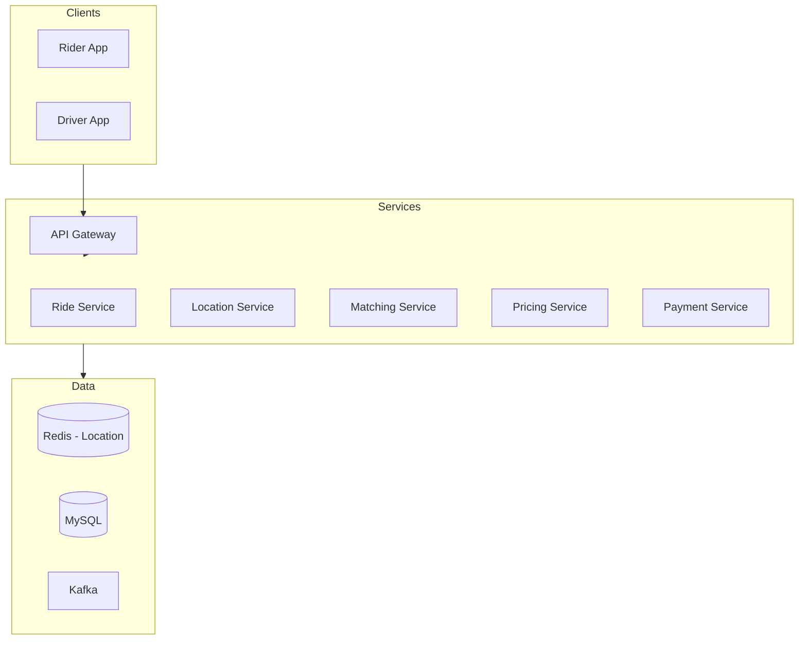
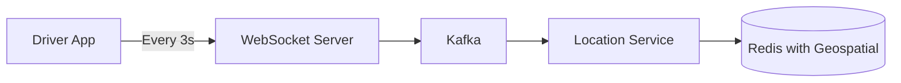
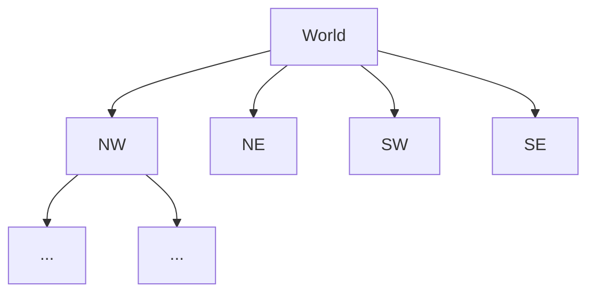
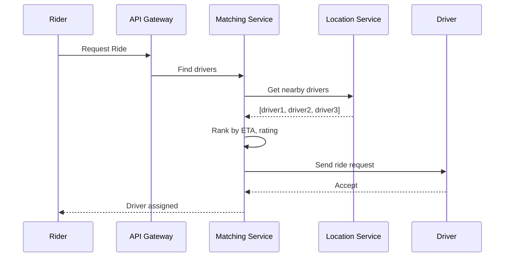
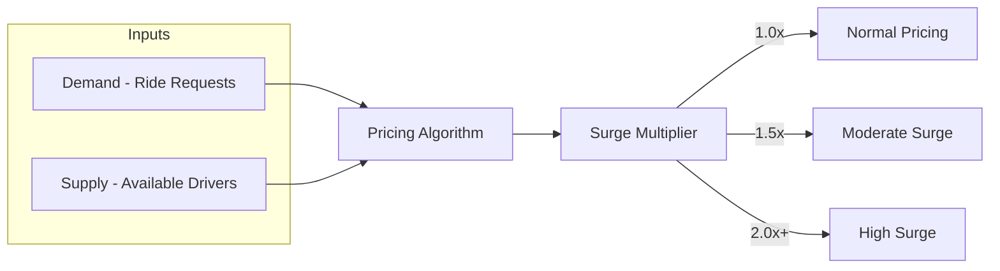
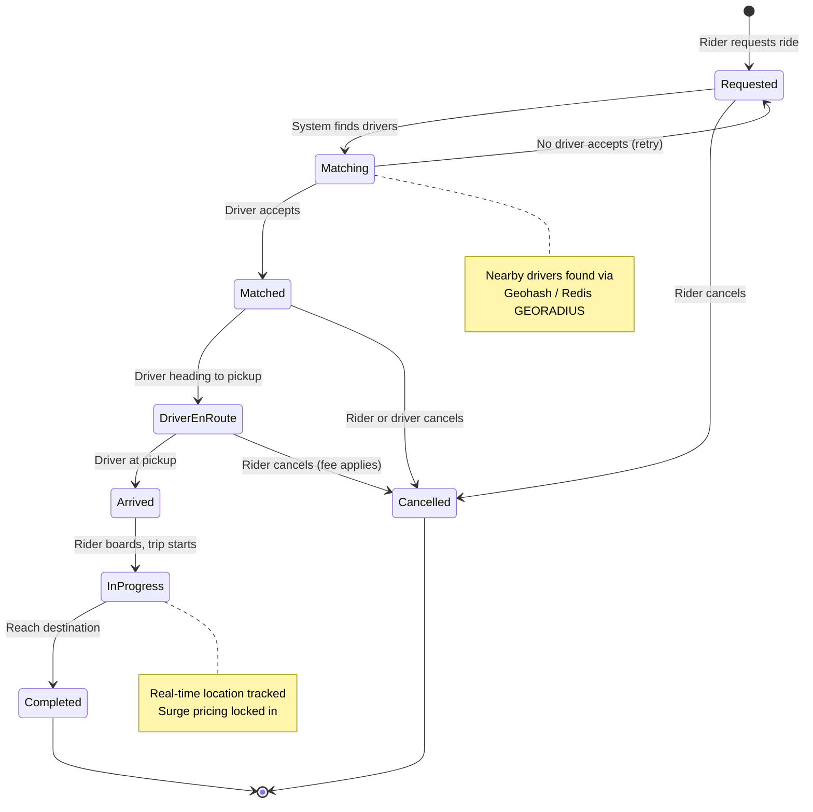

[🏠 Home](../README.md) | [⬅️ 02 Twitter](./02-twitter.md) | [➡️ 04 WhatsApp](./04-whatsapp.md)

# 🚗 Uber System Design

> Design a ride-sharing platform for millions of drivers and riders

---

## ✅ Functional Requirements

| Feature | Description |
|---------|-------------|
| **Request Ride** | User requests pickup |
| **Match Driver** | Find nearby available drivers |
| **Real-time Tracking** | Live location updates |
| **Pricing** | Dynamic surge pricing |
| **Payments** | Handle transactions |

---

## 📊 Scale Estimation

- **Daily Rides**: 20 million
- **Active Drivers**: 5 million
- **Location Updates**: Every 3 seconds per driver

---

## 🏗️ High-Level Architecture



---

## 📍 Location Tracking

### Driver Location Updates



### Geospatial Indexing

**Option 1: Geohash (Used by Uber)**
```
Geohash divides world into grid cells
Example: "9q8yyk" → San Francisco area

Nearby drivers = Same prefix geohash
```

**Option 2: QuadTree**


### Redis Geospatial Commands
```redis
# Add driver location
GEOADD drivers:online 77.5946 12.9716 driver:123

# Find nearby drivers (5km radius)
GEORADIUS drivers:online 77.5946 12.9716 5 km
```

---

## 🔄 Ride Matching Flow



### Matching Algorithm Factors

| Factor | Weight |
|--------|--------|
| **Distance** | ETA to pickup |
| **Driver Rating** | Quality score |
| **Acceptance Rate** | Reliability |
| **Car Type** | Match requested type |

---

## 💰 Dynamic Pricing (Surge)



---

## 🔄 Ride Lifecycle State Machine



---

## 💾 Database Schema

```sql
-- Rides
CREATE TABLE rides (
    ride_id UUID PRIMARY KEY,
    rider_id UUID,
    driver_id UUID,
    status ENUM('requested', 'matched', 'started', 'completed', 'cancelled'),
    pickup_location POINT,
    dropoff_location POINT,
    price_cents INT,
    surge_multiplier DECIMAL(3,2),
    created_at TIMESTAMP
);

-- Driver Locations (Redis primarily)
-- MySQL for historical data
CREATE TABLE driver_locations (
    driver_id UUID,
    location POINT,
    timestamp TIMESTAMP,
    INDEX (driver_id, timestamp)
);
```

---

## ⚡ Key Technologies

| Component | Technology |
|-----------|------------|
| **Real-time Communication** | WebSocket, MQTT |
| **Geospatial Index** | Redis, H3 (Uber's system) |
| **Event Streaming** | Kafka |
| **Maps & ETA** | Google Maps API |

---

## 📚 Key Takeaways

- Geospatial indexing is crucial for location-based matching
- WebSocket for real-time bidirectional communication
- Event-driven architecture for ride state changes
- Horizontal scaling with city-based sharding

---

*Uber processes 20M+ rides daily with this architecture.*
