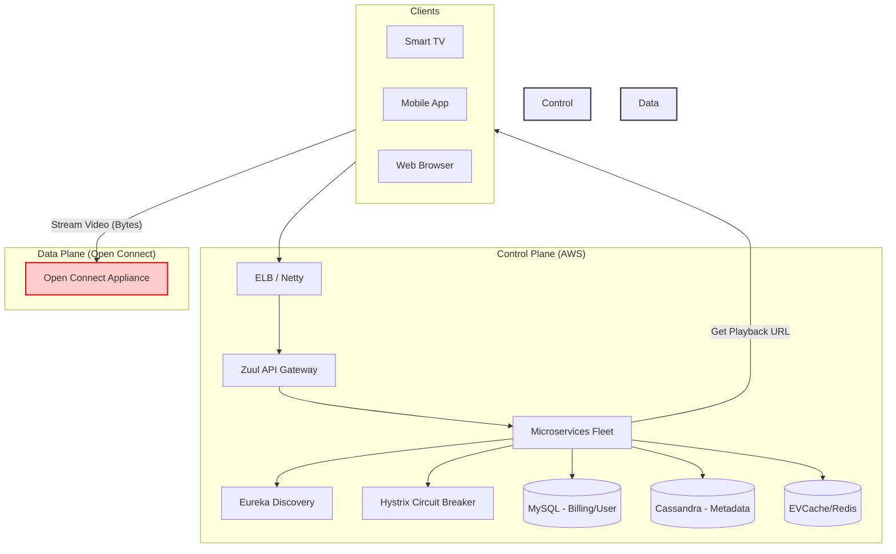
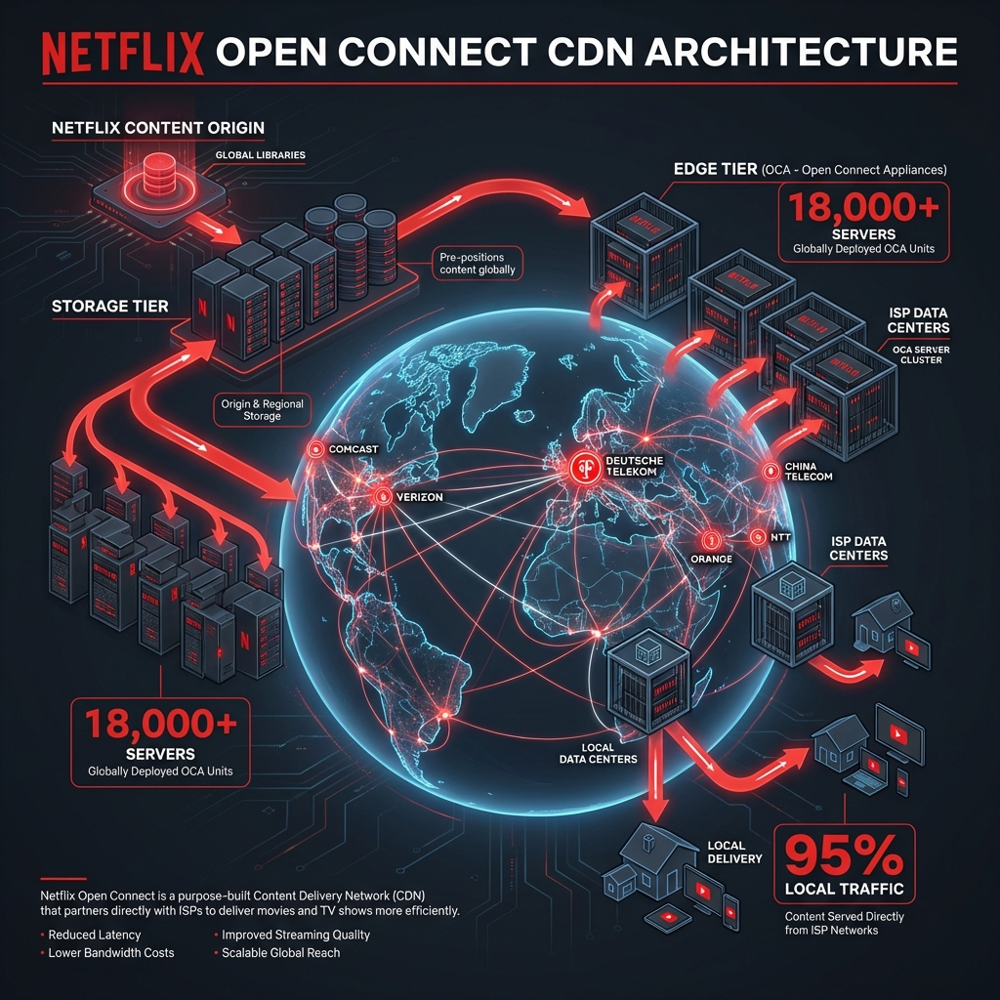
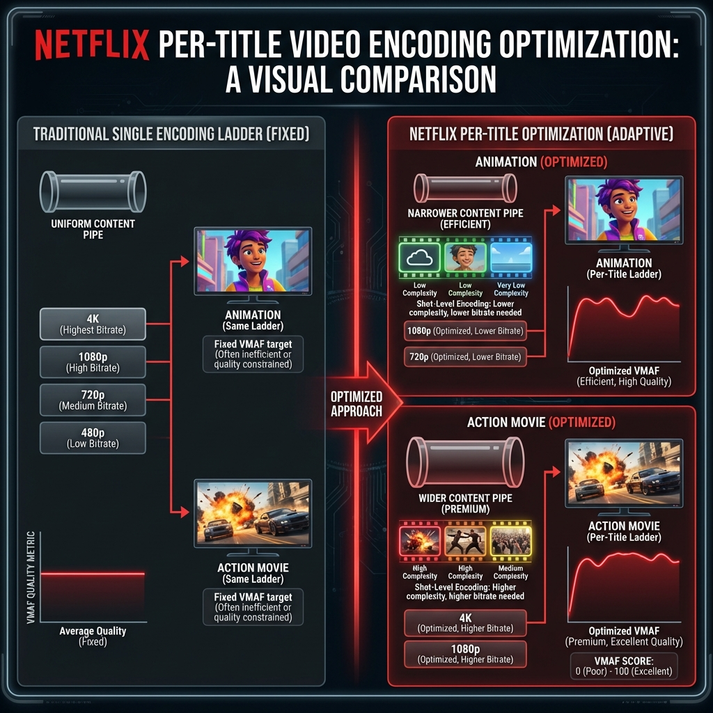

[🏠 Home](../../README.md) | [⬅️ 01 Netflix Interview](./01-system-design-interview.md) | [➡️ 06 URL Shortener](../06-url-shortener.md)

# 🎬 Netflix System Design - Complete Architecture Guide

> How Netflix streams to 260+ million subscribers across 190+ countries

---

## 📊 Netflix by Numbers

| Metric | Value |
|--------|-------|
| Subscribers | 260+ million |
| Countries | 190+ |
| Daily viewing hours | 500 million+ hours |
| Global internet bandwidth | ~15% of worldwide |
| Microservices | 1,000+ |
| Open Connect servers | 18,000+ worldwide |

---

## 🏗️ High-Level Architecture

```text
┌─────────────────────────────────────────────────────────────────────────────┐
│                        NETFLIX ARCHITECTURE OVERVIEW                         │
└─────────────────────────────────────────────────────────────────────────────┘
```




### Core Philosophy: Separation of Concerns
Netflix splits its architecture into two distinct networks to solve two very different problems:
1.  **The Control Plane (AWS)**: Handles logic. Small data packets, high variability. Needs flexible compute (EC2) and database diversity.
2.  **The Data Plane (Open Connect)**: Handles mass volume. Huge data packets (video), predictable patterns. Needs raw high-throughput storage and network.

*Reasoning*: You don't need a cloud computer to send a video file; you just need a really fast hard drive attached to the internet. Using AWS for video delivery would be prohibitively expensive and slower due to network hops.

```text
                              CLIENTS
    ┌──────────┐  ┌──────────┐  ┌──────────┐  ┌──────────┐
    │   TV     │  │  Mobile  │  │   Web    │  │  Gaming  │
    │   App    │  │   App    │  │ Browser  │  │ Console  │
    └────┬─────┘  └────┬─────┘  └────┬─────┘  └────┬─────┘
         │             │             │             │
         └─────────────┴──────┬──────┴─────────────┘
                              │
                              ▼
┌─────────────────────────────────────────────────────────────────────────────┐
│                           CONTROL PLANE (AWS)                                │
│                                                                             │
│    ┌──────────────┐    ┌──────────────┐    ┌──────────────┐                │
│    │    Zuul      │    │   Eureka     │    │   Hystrix    │                │
│    │ API Gateway  │    │  Discovery   │    │ Circuit Break│                │
│    └──────┬───────┘    └──────────────┘    └──────────────┘                │
│           │                                                                 │
│    ┌──────▼─────────────────────────────────────────────────────────────┐  │
│    │                     MICROSERVICES (1000+)                          │  │
│    │                                                                    │  │
│    │  ┌─────────┐ ┌─────────┐ ┌─────────┐ ┌─────────┐ ┌─────────┐     │  │
│    │  │ User    │ │Recommend│ │ Search  │ │ Billing │ │Playback │     │  │
│    │  │ Profile │ │ Engine  │ │ Service │ │ Service │ │ Service │     │  │
│    │  └─────────┘ └─────────┘ └─────────┘ └─────────┘ └─────────┘     │  │
│    └────────────────────────────────────────────────────────────────────┘  │
│                                                                             │
│    ┌──────────────┐    ┌──────────────┐    ┌──────────────┐                │
│    │  Cassandra   │    │    MySQL     │    │    Redis     │                │
│    │   (NoSQL)    │    │   (RDBMS)    │    │   (Cache)    │                │
│    └──────────────┘    └──────────────┘    └──────────────┘                │
└─────────────────────────────────────────────────────────────────────────────┘
                              │
                              │ Video Streaming (Data Plane)
                              ▼
┌─────────────────────────────────────────────────────────────────────────────┐
│                         OPEN CONNECT (Netflix CDN)                           │
│                                                                             │
│    ┌──────────────────────────────────────────────────────────────────┐    │
│    │                    18,000+ OCA Servers Worldwide                  │    │
│    │                                                                   │    │
│    │   ┌─────────────┐  ┌─────────────┐  ┌─────────────┐              │    │
│    │   │ ISP Network │  │ ISP Network │  │ ISP Network │              │    │
│    │   │  (Jio/AT&T) │  │ (Comcast)   │  │ (Vodafone)  │              │    │
│    │   └─────────────┘  └─────────────┘  └─────────────┘              │    │
│    └──────────────────────────────────────────────────────────────────┘    │
└─────────────────────────────────────────────────────────────────────────────┘
```

**Key Insight: Netflix separates Control Plane (AWS) from Data Plane (Open Connect)**
- **Control Plane**: User login, browsing, search, recommendations
- **Data Plane**: Actual video streaming (100% through Open Connect)

---

## 1️⃣ Open Connect CDN - The Streaming Engine

### What is Open Connect?

Netflix's **custom-built CDN** that delivers 100% of video traffic. Instead of using third-party CDNs (Akamai, CloudFlare), Netflix placed its own servers inside ISP networks.

### Architecture

```text
┌─────────────────────────────────────────────────────────────────────────────┐
│                      OPEN CONNECT ARCHITECTURE                               │
├─────────────────────────────────────────────────────────────────────────────┤
```



```text
│                                                                             │
│  TIER 1: Storage Appliances (IXPs - Internet Exchange Points)              │
│  ┌────────────────────────────────────────────────────────────────────┐    │
│  │  Store Netflix's ENTIRE catalog (~15,000+ titles)                  │    │
│  │  Located at major peering points                                   │    │
│  │  ┌───────────┐  ┌───────────┐  ┌───────────┐  ┌───────────┐       │    │
│  │  │  IXP US   │  │ IXP Europe│  │ IXP Asia  │  │IXP LatAm  │       │    │
│  └──┴───────────┴──┴───────────┴──┴───────────┴──┴───────────┴───────┘    │
│          │               │              │              │                   │
│          ▼               ▼              ▼              ▼                   │
│  TIER 2: Edge Appliances (Inside ISP Networks)                             │
│  ┌────────────────────────────────────────────────────────────────────┐    │
│  │  Cache regionally POPULAR content                                  │    │
│  │  Placed directly in ISP data centers                               │    │
│  │                                                                    │    │
│  │  ┌─────────┐  ┌─────────┐  ┌─────────┐  ┌─────────┐              │    │
│  │  │ Jio OCA │  │AT&T OCA │  │Comcast  │  │Vodafone │              │    │
│  │  │         │  │         │  │  OCA    │  │  OCA    │              │    │
│  │  └────┬────┘  └────┬────┘  └────┬────┘  └────┬────┘              │    │
│  └───────┼────────────┼────────────┼────────────┼────────────────────┘    │
│          ▼            ▼            ▼            ▼                         │
│      [Users]      [Users]      [Users]      [Users]                       │
│                                                                             │
│  RESULT: 95% of traffic served from ISP's own network!                     │
└─────────────────────────────────────────────────────────────────────────────┘
```

### OCA (Open Connect Appliance) Specifications

```
┌────────────────────────────────────────────────────────────────────────┐
│                     OCA SERVER SPECS                                    │
├────────────────────────────────────────────────────────────────────────┤
│                                                                        │
│  Hardware:                                                             │
│  • Custom-built servers by Netflix                                     │
│  • 200+ TB storage capacity                                            │
│  • 100 Gbps+ network throughput                                        │
│                                                                        │
│  Software:                                                             │
│  • FreeBSD (stripped-down OS)                                          │
│  • Nginx (highly tuned for video)                                      │
│  • Custom caching algorithms                                           │
│                                                                        │
│  Deployment:                                                           │
│  • Netflix provides OCAs FREE to ISPs                                  │
│  • ISP provides: Power, rack space, network                            │
│  • Win-Win: ISP saves bandwidth, Netflix gets faster delivery          │
│                                                                        │
└────────────────────────────────────────────────────────────────────────┘

### 🧠 Architectural Decision: Build vs Buy?
**Why build Open Connect instead of using Akamai/Cloudfront?**
*   **Cost**: At Netflix's scale (15% of global internet traffic), paying per-GB to a valid CDN would destroy margins. Building hardware is a fixed one-time cost.
*   **Performance**: OCAs are placed *inside* ISP networks (e.g., inside an AT&T data center). This removes multiple "hops" across the internet backbone.
    *   *Result*: Your neighbor watching Stranger Things might literally be streaming from a box down the street.
*   **Fault Tolerance**: If one OCA fails, the client seamlessly switches to another or falls back to a central tier.
```

---

## 2️⃣ Microservices Architecture

### Why Microservices?


```
MONOLITH (2008)                    MICROSERVICES (2012+)
┌────────────────────┐             ┌──────┐ ┌──────┐ ┌──────┐
│                    │             │User  │ │Search│ │Billing│
│  Single Java App   │  ────────▶  │Svc   │ │Svc   │ │Svc   │
│                    │             └──────┘ └──────┘ └──────┘
│  - One codebase    │             ┌──────┐ ┌──────┐ ┌──────┐
│  - One database    │             │Reco  │ │Play  │ │Rating│
│  - One failure =   │             │Svc   │ │Svc   │ │Svc   │
│    entire site down│             └──────┘ └──────┘ └──────┘
└────────────────────┘
      ❌ PROBLEM                        ✅ SOLUTION

Benefits:
• Each service can scale independently
• Different teams own different services
• One failure doesn't bring down everything
• Can use different tech stacks per service
```

### 🧠 Architectural Reasoning: Stateless Services
Netflix designs almost all services to be **Stateless**.
*   **Concept**: A service instance doesn't remember who you are from the last request.
*   **Why?**: If a server crashes, any other server can take over instantly. You don't lose your "session".
*   **How**: State is stored in external data stores (Memcached, Redis, Cassandra), not on the server itself.

### Key Services

| Service | Purpose | Database |
|---------|---------|----------|
| **User Profile** | Account info, preferences | MySQL |
| **Recommendation** | Personalized suggestions | Cassandra |
| **Playback** | Video streaming logic | Redis (cache) |
| **Billing** | Subscriptions, payments | MySQL |
| **Search** | Title search, indexing | Elasticsearch |
| **Viewing History** | What you watched | Cassandra |

---

## 3️⃣ Netflix OSS (Open Source Stack)

Netflix built and open-sourced many tools for microservices:

### Service Discovery with Eureka

```
┌─────────────────────────────────────────────────────────────────────────────┐
│                        EUREKA SERVICE DISCOVERY                              │
├─────────────────────────────────────────────────────────────────────────────┤
│                                                                             │
│                       ┌───────────────────────┐                             │
│                       │    EUREKA SERVER      │                             │
│                       │   (Service Registry)  │                             │
│                       │                       │                             │
│                       │ ┌─────────────────┐   │                             │
│                       │ │ user-svc: 3 inst│   │                             │
│                       │ │ search-svc: 2   │   │                             │
│                       │ │ billing-svc: 1  │   │                             │
│                       │ └─────────────────┘   │                             │
│                       └───────────┬───────────┘                             │
│                                   │                                         │
│         ┌────────────────────────┼─────────────────────────┐               │
│         │                        │                         │               │
│         ▼                        ▼                         ▼               │
│   ┌───────────┐           ┌───────────┐            ┌───────────┐          │
│   │ User Svc  │           │ Search Svc│            │Billing Svc│          │
│   │ Instance 1│           │ Instance 1│            │ Instance 1│          │
│   └───────────┘           └───────────┘            └───────────┘          │
│         │                        │                         │               │
│         │ 1. Register on startup                           │               │
│         │ 2. Send heartbeat every 30s                      │               │
│         │ 3. Fetch registry to find other services         │               │
│                                                                             │
└─────────────────────────────────────────────────────────────────────────────┘
```

### API Gateway with Zuul

```
┌─────────────────────────────────────────────────────────────────────────────┐
│                          ZUUL API GATEWAY                                    │
├─────────────────────────────────────────────────────────────────────────────┤
│                                                                             │
│  External Clients                                                           │
│       │                                                                     │
│       ▼                                                                     │
│  ┌─────────────────────────────────────────────────────────────────────┐   │
│  │                         ZUUL GATEWAY                                │   │
│  │                                                                     │   │
│  │  ┌──────────────────────────────────────────────────────────────┐  │   │
│  │  │                     PRE-FILTERS                              │  │   │
│  │  │  • Authentication (Is user logged in?)                       │  │   │
│  │  │  • Rate Limiting (Too many requests?)                        │  │   │
│  │  │  • Request Logging                                           │  │   │
│  │  └──────────────────────────────────────────────────────────────┘  │   │
│  │                           │                                        │   │
│  │                           ▼                                        │   │
│  │  ┌──────────────────────────────────────────────────────────────┐  │   │
│  │  │                    ROUTING                                   │  │   │
│  │  │  /api/users/*   ─────────▶  User Service                    │  │   │
│  │  │  /api/search/*  ─────────▶  Search Service                  │  │   │
│  │  │  /api/billing/* ─────────▶  Billing Service                 │  │   │
│  │  └──────────────────────────────────────────────────────────────┘  │   │
│  │                           │                                        │   │
│  │                           ▼                                        │   │
│  │  ┌──────────────────────────────────────────────────────────────┐  │   │
│  │  │                    POST-FILTERS                              │  │   │
│  │  │  • Response compression                                      │  │   │
│  │  │  • Add security headers                                      │  │   │
│  │  │  • Metrics collection                                        │  │   │
│  │  └──────────────────────────────────────────────────────────────┘  │   │
│  └─────────────────────────────────────────────────────────────────────┘   │
│                                                                             │
└─────────────────────────────────────────────────────────────────────────────┘
```

### Circuit Breaker with Hystrix

```
┌─────────────────────────────────────────────────────────────────────────────┐
│                      HYSTRIX CIRCUIT BREAKER                                 │
├─────────────────────────────────────────────────────────────────────────────┤
│                                                                             │
│  PROBLEM: Service B is down. Service A keeps calling → Cascade failure      │
│                                                                             │
│  WITHOUT HYSTRIX:                                                           │
│  ┌─────────┐        ┌─────────┐        ┌─────────┐                         │
│  │Service A│───────▶│Service B│───────▶│Service C│                         │
│  │ (down)  │◀───────│ (down)  │◀───────│ (down)  │                         │
│  └─────────┘        └─────────┘        └─────────┘                         │
│       ❌ All services fail!                                                 │
│                                                                             │
│  WITH HYSTRIX:                                                              │
│  ┌─────────┐        ┌─────────┐        ┌─────────┐                         │
│  │Service A│──[CB]─▶│Service B│───────▶│Service C│                         │
│  │  (OK)   │        │ (down)  │        │  (OK)   │                         │
│  └─────────┘        └─────────┘        └─────────┘                         │
│       │                                                                     │
│       │ Circuit OPEN!                                                       │
│       ▼                                                                     │
│  Return fallback (cached data, default response)                            │
│                                                                             │
│  STATES:                                                                    │
│  ┌──────────┐    Failures > threshold    ┌──────────┐                      │
│  │  CLOSED  │──────────────────────────▶│   OPEN   │                      │
│  │(Normal)  │                            │(Blocked) │                      │
│  └──────────┘                            └────┬─────┘                      │
│       ▲                                       │                            │
│       │                                       │ After timeout              │
│       │ Success                               ▼                            │
│       │                                 ┌───────────┐                      │
│       └─────────────────────────────────│HALF-OPEN  │                      │
│                                         │(Test call)│                      │
│                                         └───────────┘                      │
└─────────────────────────────────────────────────────────────────────────────┘
```

---

## 4️⃣ Video Encoding & Optimization

### Traditional vs Netflix Encoding



### Per-Title Encoding Explained

**The Problem with "One Size Fits All"**
In traditional broadcasting, a 1080p stream might always be set to 5 Mbps. This is wasteful for simple content (like *BoJack Horseman*, which is animation with flat colors) and insufficient for complex content (like *Extraction*, which has fast motion, smoke, and explosions).

**The Netflix Solution: Optimization per Title**
Netflix analyzes the *complexity* of every single video file before encoding it.
*   **Animation**: Can look perfect at 1080p with just 1.5 Mbps.
*   **Action**: Might need 8 Mbps for 1080p to avoid blocky artifacts.

**The Result**:
*   **Users** get higher quality video for less data.
*   **Netflix** saves massive amounts of bandwidth (which is their biggest infrastructure cost).

**VMAF (Video Multimethod Assessment Fusion)**
Netflix invented their own quality metric, **VMAF**, which uses machine learning to predict *how a human perceives video quality*, rather than just measuring technical signal-to-noise ratios. They optimize to maximize the VMAF score for every single bit of data sent.

```
TRADITIONAL: One-Size-Fits-All
┌────────────────────────────────────────────────────────────────────────────┐
│ SAME encoding ladder for ALL content                                       │
│                                                                            │
│ 1080p @ 5Mbps ────┬────────────────────────────────────────┐              │
│ 720p @ 3Mbps  ────┤   Every movie gets same bitrate        │              │
│ 480p @ 1.5Mbps ───┘                                        │              │
│                                                                            │
│ Problem: Animation needs less bits, Action needs more!                     │
└────────────────────────────────────────────────────────────────────────────┘

NETFLIX: Per-Title Optimization
┌────────────────────────────────────────────────────────────────────────────┐
│ CUSTOM encoding ladder for EACH title                                      │
│                                                                            │
│ "BoJack Horseman" (Animation)    │  "Extraction" (Action)                 │
│ ┌─────────────────────────────┐  │  ┌─────────────────────────────┐       │
│ │ 1080p @ 2Mbps (looks great) │  │  │ 1080p @ 8Mbps (needs more)  │       │
│ │ 720p @ 1Mbps                │  │  │ 720p @ 4Mbps                │       │
│ │ 480p @ 500Kbps              │  │  │ 480p @ 2Mbps                │       │
│ └─────────────────────────────┘  │  └─────────────────────────────┘       │
│                                  │                                         │
│ Result: 20%+ bandwidth savings with BETTER quality!                        │
└────────────────────────────────────────────────────────────────────────────┘
```

### Dynamic Optimizer (Shot-Level Encoding)

```
┌─────────────────────────────────────────────────────────────────────────────┐
│                      SHOT-LEVEL OPTIMIZATION                                 │
├─────────────────────────────────────────────────────────────────────────────┤
│                                                                             │
│  Movie = Multiple Shots (scenes)                                            │
│                                                                             │
│  ┌─────────────────────────────────────────────────────────────────────┐   │
│  │                     "Stranger Things" Episode                       │   │
│  ├─────────┬─────────┬─────────┬─────────┬─────────┬─────────────────┤   │
│  │ Shot 1  │ Shot 2  │ Shot 3  │ Shot 4  │ Shot 5  │ ...             │   │
│  │ Dialog  │ Running │ Dark    │ CGI     │ Dialog  │                 │   │
│  │ Scene   │ Scene   │ Scene   │ Monster │ Scene   │                 │   │
│  │         │         │         │         │         │                 │   │
│  │ LOW     │ HIGH    │ MEDIUM  │ VERY    │ LOW     │                 │   │
│  │ Bits    │ Bits    │ Bits    │ HIGH    │ Bits    │                 │   │
│  └─────────┴─────────┴─────────┴─────────┴─────────┴─────────────────┘   │
│                                                                             │
│  Process:                                                                   │
│  1. Split video into shots                                                  │
│  2. Analyze each shot's complexity                                          │
│  3. Allocate more bits to complex shots, fewer to simple ones              │
│  4. Merge optimized shots back                                              │
│                                                                             │
│  VMAF (Video Multimethod Assessment Fusion)                                 │
│  Netflix's quality metric that matches human perception                     │
└─────────────────────────────────────────────────────────────────────────────┘
```

---

## 5️⃣ Chaos Engineering (Simian Army)

Netflix intentionally breaks things to build resilience!

### The Simian Army


> "The best way to avoid failure is to fail constantly."

```
┌─────────────────────────────────────────────────────────────────────────────┐
│                         NETFLIX SIMIAN ARMY                                  │
├─────────────────────────────────────────────────────────────────────────────┤
│                                                                             │
│  🐒 CHAOS MONKEY                                                            │
│     • Randomly kills EC2 instances in production                            │
│     • Runs during business hours (so engineers are awake!)                  │
│     • Forces: Design for failure                                            │
│                                                                             │
│  🦍 CHAOS GORILLA                                                           │
│     • Kills an entire AWS Availability Zone                                 │
│     • Tests: Multi-AZ redundancy                                            │
│                                                                             │
│  🦧 CHAOS KONG                                                              │
│     • Kills an entire AWS Region                                            │
│     • Tests: Multi-region failover                                          │
│                                                                             │
│  🐢 LATENCY MONKEY                                                          │
│     • Injects artificial delays between services                            │
│     • Tests: Timeout handling, fallbacks                                    │
│                                                                             │
│  🧹 JANITOR MONKEY                                                          │
│     • Cleans up unused resources                                            │
│     • Saves: Cloud costs                                                    │
│                                                                             │
│  🔒 SECURITY MONKEY                                                         │
│     • Scans for security vulnerabilities                                    │
│     • Finds: Misconfigured firewalls, open ports                            │
│                                                                             │
│  📋 CONFORMITY MONKEY                                                       │
│     • Checks if instances follow best practices                             │
│     • Shuts down non-compliant servers                                      │
│                                                                             │
└─────────────────────────────────────────────────────────────────────────────┘
```

### Why Chaos Engineering?

```
TRADITIONAL APPROACH:
"Hope nothing breaks in production"

                    😰
         ┌─────────────────────┐
         │ Incidents happen    │
         │ at 3 AM on weekends!│
         └─────────────────────┘


NETFLIX APPROACH:
"Break things intentionally during work hours"

                    😎
         ┌─────────────────────┐
         │ We already know     │
         │ what will break     │
         │ and how to fix it!  │
         └─────────────────────┘

Philosophy: "The best way to avoid failure is to fail constantly"
```

---

## 6️⃣ Recommendation Engine

### How Netflix Knows What You Want

```
┌─────────────────────────────────────────────────────────────────────────────┐
│                     RECOMMENDATION PIPELINE                                  │
├─────────────────────────────────────────────────────────────────────────────┤
│                                                                             │
│  DATA COLLECTION                                                            │
│  ┌─────────────────────────────────────────────────────────────────────┐   │
│  │ • What you watch                • Time of day you watch             │   │
│  │ • What you pause/skip           • Device you use                    │   │
│  │ • What you search               • How long you watch                │   │
│  │ • What you rate                 • What you add to My List           │   │
│  └─────────────────────────────────────────────────────────────────────┘   │
│                              │                                              │
│                              ▼                                              │
│  PROCESSING (Apache Spark)                                                  │
│  ┌─────────────────────────────────────────────────────────────────────┐   │
│  │                   Machine Learning Models                           │   │
│  │                                                                     │   │
│  │  ┌─────────────┐  ┌─────────────┐  ┌─────────────┐                 │   │
│  │  │Collaborative│  │ Content     │  │Deep Learning│                 │   │
│  │  │ Filtering   │  │ Based       │  │ Models      │                 │   │
│  │  │"Users like  │  │"Similar to  │  │"Based on    │                 │   │
│  │  │ you liked"  │  │ what you    │  │ your viewing│                 │   │
│  │  │             │  │ watched"    │  │ patterns"   │                 │   │
│  │  └─────────────┘  └─────────────┘  └─────────────┘                 │   │
│  └─────────────────────────────────────────────────────────────────────┘   │
│                              │                                              │
│                              ▼                                              │
│  OUTPUT                                                                     │
│  ┌─────────────────────────────────────────────────────────────────────┐   │
│  │ YOUR HOMEPAGE                                                       │   │
│  │ ┌───────────────────────────────────────────────────────────────┐   │   │
│  │ │ Because you watched "Breaking Bad":  [El Camino] [Ozark]     │   │   │
│  │ │ Trending Now:                        [Squid Game] [...]      │   │   │
│  │ │ Top Picks for You:                   [Personalized row...]   │   │   │
│  │ └───────────────────────────────────────────────────────────────┘   │   │
│  └─────────────────────────────────────────────────────────────────────┘   │
│                                                                             │
│  FUN FACT: 80% of what people watch comes from recommendations!            │
└─────────────────────────────────────────────────────────────────────────────┘
```

---

## 7️⃣ Complete Playback Flow

### What Happens When You Press Play?

```
┌─────────────────────────────────────────────────────────────────────────────┐
│                    NETFLIX PLAYBACK FLOW                                     │
├─────────────────────────────────────────────────────────────────────────────┤
│                                                                             │
│  STEP 1: You press PLAY on "Stranger Things"                                │
│  ──────────────────────────────────────────────────────────────────────────│
│                                                                             │
│  ┌──────────┐      HTTPS        ┌───────────────────┐                      │
│  │  Your    │───────────────────▶│ Netflix AWS       │                      │
│  │  Device  │                    │ (Playback Service)│                      │
│  └──────────┘                    └─────────┬─────────┘                      │
│                                            │                                │
│                                            ▼                                │
│  STEP 2: AWS returns optimal OCA server URL                                 │
│  ──────────────────────────────────────────────────────────────────────────│
│                                                                             │
│  Backend decides:                                                           │
│  • Your location (IP geolocation)                                           │
│  • Your internet speed (past performance)                                   │
│  • Which OCA is closest and has the content                                 │
│                                                                             │
│  Response: "Stream from oca-mumbai.nflxvideo.net"                           │
│                                                                             │
│  STEP 3: Direct streaming from OCA                                          │
│  ──────────────────────────────────────────────────────────────────────────│
│                                                                             │
│  ┌──────────┐                    ┌───────────────────┐                      │
│  │  Your    │────── VIDEO ──────▶│ OCA Server        │                      │
│  │  Device  │◀───── STREAM ──────│ (Inside your ISP) │                      │
│  └──────────┘                    └───────────────────┘                      │
│                                                                             │
│  STEP 4: Adaptive streaming adjusts quality                                 │
│  ──────────────────────────────────────────────────────────────────────────│
│                                                                             │
│  ┌─────────────────────────────────────────────────────────────────┐       │
│  │ Time ─────▶                                                     │       │
│  │                                                                 │       │
│  │ Quality: [1080p]──────[720p]───────[1080p]──────[4K]           │       │
│  │                   ▲          ▲           ▲                      │       │
│  │                   │          │           │                      │       │
│  │            Bandwidth    Bandwidth    Bandwidth                  │       │
│  │              dropped      normal      improved                  │       │
│  └─────────────────────────────────────────────────────────────────┘       │
│                                                                             │
└─────────────────────────────────────────────────────────────────────────────┘
```

---

## 8️⃣ Data Storage Strategy

```
┌─────────────────────────────────────────────────────────────────────────────┐
│                     DATABASE SELECTION AT NETFLIX                            │
├─────────────────────────────────────────────────────────────────────────────┤
│                                                                             │
│  ┌─────────────────────────────────────────────────────────────────────┐   │
│  │ MYSQL (Relational)                                                  │   │
│  ├─────────────────────────────────────────────────────────────────────┤   │
│  │ Used for: Billing, User accounts, Subscriptions                     │   │
│  │ Why: ACID compliance needed (money transactions)                    │   │
│  │ Setup: Master-Master replication across AWS regions                 │   │
│  └─────────────────────────────────────────────────────────────────────┘   │
│                                                                             │
│  ┌─────────────────────────────────────────────────────────────────────┐   │
│  │ CASSANDRA (NoSQL - Wide Column)                                     │   │
│  ├─────────────────────────────────────────────────────────────────────┤   │
│  │ Used for: Viewing history, Recommendations, User activity           │   │
│  │ Why: Massive scale writes, high availability                        │   │
│  │ Scale: Largest Cassandra cluster in the world!                      │   │
│  └─────────────────────────────────────────────────────────────────────┘   │
│                                                                             │
│  ┌─────────────────────────────────────────────────────────────────────┐   │
│  │ REDIS / EVCache (Cache)                                             │   │
│  ├─────────────────────────────────────────────────────────────────────┤   │
│  │ Used for: Session data, Homepage data, Frequently accessed data     │   │
│  │ Why: Sub-millisecond latency                                        │   │
│  │ Scale: Millions of operations per second                            │   │
│  └─────────────────────────────────────────────────────────────────────┘   │
│                                                                             │
│  ┌─────────────────────────────────────────────────────────────────────┐   │
│  │ ELASTICSEARCH                                                       │   │
│  ├─────────────────────────────────────────────────────────────────────┤   │
│  │ Used for: Title search, Logging, Analytics                          │   │
│  │ Why: Full-text search, fuzzy matching                               │   │
│  └─────────────────────────────────────────────────────────────────────┘   │
│                                                                             │
└─────────────────────────────────────────────────────────────────────────────┘
```

### 🧠 Architectural Reasoning: Polyglot Persistence
**Why use so many different databases?**
Netflix follows the principle of **Polyglot Persistence**: using the best tool for the specific job, rather than forcing everything into one "do-it-all" database.

*   **MySQL (CP - Consistency/Partition Tolerance)**:
    *   *Requirement*: When you pay for a subscription, it MUST be recorded accurately. You cannot have "eventual consistency" with money.
    *   *Trade-off*: Harder to scale write throughput massively, but guarantees data correctness.
*   **Cassandra (AP - Availability/Partition Tolerance)**:
    *   *Requirement*: If you pause a movie, that timestamp needs to be saved *fast*. If millions of users pause at once, the DB must accept all writes without failing.
    *   *Trade-off*: It's okay if the "continue watching" bar is a few seconds out of sync for a moment (Eventual Consistency), as long as the service *never* goes down.

---

## ❓ Interview Questions & Answers

### Q1: How does Netflix handle 260 million concurrent users?

```
ANSWER:
1. HORIZONTAL SCALING
   • 1000+ microservices, each scales independently
   • Stateless services (any instance can handle any request)
   • Auto-scaling based on demand

2. CACHING EVERYWHERE
   • EVCache (distributed cache) for hot data
   • CDN caching for static assets
   • OCA caching for video content

3. ASYNCHRONOUS PROCESSING
   • Non-blocking I/O
   • Event-driven architecture
   • Kafka for message queues

4. GEOGRAPHIC DISTRIBUTION
   • Multi-region AWS deployment
   • Open Connect servers in 1000+ ISP networks
   • Content pre-positioned close to users
```

### Q2: Why did Netflix build Open Connect instead of using Akamai/CloudFlare?

```
ANSWER:
┌─────────────────────────────────────────────────────────┐
│ THIRD-PARTY CDN           │ OPEN CONNECT               │
├─────────────────────────────────────────────────────────┤
│ Generic for all content   │ Optimized for video        │
│ Pay per GB                │ One-time hardware cost     │
│ Limited control           │ Full control of stack      │
│ Shared with competitors   │ Dedicated to Netflix       │
│ Edge servers at ISP POPs  │ Servers INSIDE ISP network │
└─────────────────────────────────────────────────────────┘

BENEFITS:
• 95% of traffic stays within ISP network
• $0 per GB after hardware investment
• Can optimize FreeBSD + Nginx specifically for video
• End-to-end visibility and control
```

### Q3: How does Netflix ensure high availability?

```
ANSWER:
1. MULTI-REGION DEPLOYMENT
   • Active-active in 3 AWS regions
   • Any region can serve any user
   • Automatic failover

2. CHAOS ENGINEERING
   • Regularly kill servers, zones, regions
   • Find weaknesses before users do
   • All systems designed for failure

3. CIRCUIT BREAKERS (Hystrix)
   • Prevent cascade failures
   • Graceful degradation
   • Fallback responses

4. REDUNDANCY
   • No single points of failure
   • Multiple replicas of every service
   • Data replicated across regions
```

### Q4: Explain Netflix's recommendation system

```
ANSWER:
DATA SOURCES:
• Watch history (what, when, how long)
• Browsing behavior (what you hover on, scroll past)
• Ratings and My List
• Device and time patterns

ALGORITHMS:
1. Collaborative Filtering
   "Users similar to you also liked..."
   
2. Content-Based Filtering
   "Because you watched Breaking Bad" → Similar genres

3. Deep Learning
   Analyze artwork, thumbnails, descriptions
   Personalize even the movie thumbnail!

SCALE:
• Runs on Apache Spark
• Processes petabytes of data
• Recommendations update multiple times daily
• 80% of watched content comes from recommendations
```

### Q5: What happens if an AWS region goes down?

```
ANSWER:
NETFLIX MULTI-REGION ARCHITECTURE:

┌──────────────────────────────────────────────────────────────┐
│                                                              │
│  US-EAST-1          US-WEST-2          EU-WEST-1            │
│  ┌────────┐        ┌────────┐        ┌────────┐             │
│  │ Active │◀══════▶│ Active │◀══════▶│ Active │             │
│  │        │        │        │        │        │             │
│  └────────┘        └────────┘        └────────┘             │
│      │                  │                 │                  │
│      │    All regions serve traffic       │                  │
│      │    All regions can failover        │                  │
│                                                              │
│  IF US-EAST-1 FAILS:                                         │
│  1. DNS automatically routes to US-WEST-2 and EU-WEST-1     │
│  2. User requests continue (slight latency increase)         │
│  3. Open Connect still works (independent of AWS)            │
│  4. Video streaming uninterrupted                            │
│                                                              │
│  TESTED REGULARLY with Chaos Kong (region killer)            │
└──────────────────────────────────────────────────────────────┘
```

---

## 📚 Key Takeaways

| Component | Netflix Solution |
|-----------|------------------|
| **CDN** | Own CDN (Open Connect) inside ISP networks |
| **Architecture** | 1000+ microservices on AWS |
| **Discovery** | Eureka (service registry) |
| **Gateway** | Zuul (routing, auth, rate limiting) |
| **Resilience** | Hystrix + Chaos Engineering |
| **Video** | Per-title + shot-level encoding |
| **Recommendations** | ML on Apache Spark |
| **Databases** | Cassandra (scale) + MySQL (transactions) |

---

## 🔗 References & Further Reading

The content of this guide is based on official engineering blogs and independent system design research.

1.  **Netflix Tech Blog**: [Netflix Technology Blog](https://netflixtechblog.com/)
    *   *The definitive source for all things Netflix Engineering.*
2.  **Open Connect**: [Netflix Open Connect Briefing](https://openconnect.netflix.com/en/)
    *   *Official documentation on how the CDN works.*
3.  **Chaos Engineering**: [The Netflix Simian Army](https://netflixtechblog.com/the-netflix-simian-army-16e57fbab116)
    *   *Original post explaining Chaos Monkey.*
4.  **Optimization**: [Per-Title Encode Optimization](https://netflixtechblog.com/per-title-encode-optimization-7e99442b62a2)
    *   *Deep dive into VMAF and encoding ladders.*
5.  **Microservices**: [Mastering Chaos - A Netflix Guide to Microservices](https://www.youtube.com/watch?v=CZ3wIuvmHeM)
    *   *Talk by Josh Evans on the evolution of their architecture.*
6.  **High Availability**: [Active-Active for Multi-Region Resiliency](https://netflixtechblog.com/active-active-for-multi-region-resiliency-c47719f6685b)
    *   *How Netflix survives an entire AWS region failure.*

---

*Netflix's architecture is a masterclass in building scalable, resilient systems. Study it to understand how to design for 260M+ users!*
