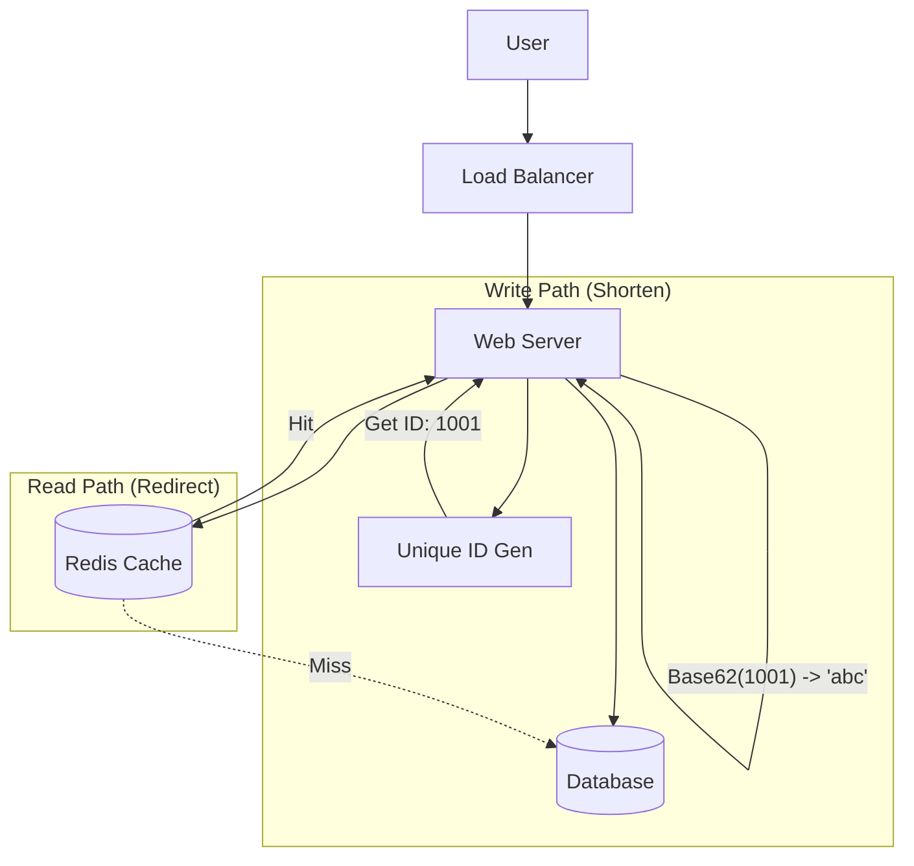
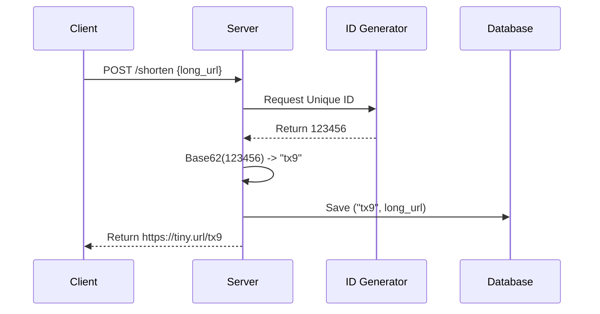

[🏠 Home](../README.md) | [⬅️ 05 Netflix Deep Dive](./05-netflix/02-architecture-deep-dive.md) | [➡️ 07 Rate Limiter](./07-rate-limiter.md)

# 🔗 System Design: URL Shortener (TinyURL)

> Design a scalable service to shorten long URLs (like bit.ly or tinyurl.com).

---

## 📊 Quick Reference Card

| Aspect | Decision |
|--------|----------|
| **Algorithm** | Base62 Encoding of Unique ID |
| **ID Generator** | Distributed ID Generator (Snowflake / DB Ticket) |
| **Database** | NoSQL (DynamoDB/Cassandra) or RDBMS (MySQL) |
| **Read/Write Ratio** | 100:1 (Read Heavy) |
| **Cache** | Redis (Memcached) for hot redirections |
| **Redirect Type** | 301 (Permanent) vs 302 (Temporary) |
| **Cleanup** | Lazy Expiration + Periodic Cleanup |

---

## 📋 Table of Contents
1. [Functional Requirements](#-functional-requirements)
2. [Non-Functional Requirements](#-non-functional-requirements)
3. [API Design](#-api-design)
4. [Database Design](#-database-design)
5. [Core Algorithm: Shortening](#-core-algorithm-shortening)
6. [High-Level Design](#-high-level-design)
7. [Deep Dives](#-deep-dives)

---

## ✅ Functional Requirements

| Feature | Description | Priority |
|---------|-------------|----------|
| **Shorten URL** | Input long URL → Output unique short alias | P0 |
| **Redirection** | Access short alias → Redirect to long URL | P0 |
| **Custom Alias** | User picks valid custom alias (optional) | P1 |
| **Expiry** | User sets expiration time for the link | P1 |
| **Analytics** | Track click counts and location | P2 |

---

## 📊 Non-Functional Requirements

### 📈 Scale Estimation

**Traffic Estimates:**
*   **Writes (New URLs)**: 100 Million URLs / month
    *   Seconds in month: $\approx 2.6 \times 10^6$
    *   QPS (Writes): $100M / 2.6M \approx 40$ writes/sec (Low)
*   **Reads (Redirections)**: Read:Write ratio is 100:1
    *   QPS (Reads): $40 \times 100 = 4,000$ redirects/sec

**Storage Estimates (5 Years):**
*   **Total Objects**: $100M \times 12 \text{ months} \times 5 \text{ years} = 6 \text{ Billion URLs}$
*   **Size per Object**: 500 bytes (Long URL) + 100 bytes (Metadata) $\approx 600$ bytes
*   **Total Capacity**: $6B \times 600 \text{ bytes} \approx 3.6 \text{ TB}$

**Bandwidth:**
*   **Ingress**: $40 \times 600 \text{ bytes} \approx 24 \text{ KB/s}$ (Negligible)
*   **Egress**: $4000 \times 600 \text{ bytes} \approx 2.4 \text{ MB/s}$ (Very manageable)

---

## 🔌 API Design

### REST Endpoints

1.  **Shorten URL**
    ```http
    POST /api/v1/data/shorten
    Request:
    {
      "long_url": "https://www.google.com/maps/very-long-path...",
      "expiry_date": "2026-12-31T00:00:00Z" (optional)
    }
    
    Response: 200 OK
    {
      "short_url": "https://tiny.url/Xy7An"
    }
    ```

2.  **Redirect**
    ```http
    GET /Xy7An
    
    Response: 301 Moved Permanently
    Location: https://www.google.com/maps/very-long-path...
    ```

---

## 💾 Database Design

### Schema

Since the data is simple (Key-Value pair) and relationships are minimal, a **NoSQL** store (DynamoDB, Cassandra) is preferred for horizontal scalability, though **MySQL** can easily handle 3.6TB with sharding.

**Table: `URL_Mapping`**

| Column | Type | Notes |
|:---|:---|:---|
| `short_key` | VARCHAR(7) | **Primary Key**. The Base62 string. |
| `long_url` | VARCHAR | The destination URL. |
| `created_at` | TIMESTAMP | For analytics/cleanup. |
| `expiry_at` | TIMESTAMP | When to purge. |
| `user_id` | UUID | (Optional) Owner of link. |

---

## 🧮 Core Algorithm: Shortening

### Option 1: Hashing (MD5/SHA)
*   **Method**: Hash the long URL (MD5) $\rightarrow$ Take first 7 characters.
*   **Problem**: Collisions. Different long URLs might produce same first 7 chars.
*   **Fix**: Check DB. If exists, append "salt" and retry. Expensive.

### Option 2: Base62 Encoding (Preferred)
*   **Method**: Convert a unique integer ID to Base62 (A-Z, a-z, 0-9).
*   **Base62**: $26 + 26 + 10 = 62$ characters.
*   **Math**: With 7 characters, $62^7 \approx 3.5 \text{ Trillion}$ combinations. Enough for 1000 years.

**Example Flow:**
1.  **Unique ID Generator**: Generate ID `123456789`.
2.  **Base62 Conversion**:
    *   $123456789 \rightarrow $ `8M0kX`
3.  **Save**: Store `{ key: "8M0kX", value: "https://..." }`

---

## 🏛️ High-Level Design



### Sequence Diagram: Create Short Link



---

## 🔍 Deep Dives

### 1. 301 vs 302 Redirect
*   **301 (Permanent Move)**:
    *   **Browser Behavior**: Caches the redirection. Next time user visits `tiny.url/abc`, browser goes *directly* to long URL without hitting your server.
    *   **Pros**: Reduces server load.
    *   **Cons**: You lose analytics (you don't know they visited).
*   **302 (Temporary Move)**:
    *   **Browser Behavior**: Always hits your server for the new location.
    *   **Pros**: Accurate analytics.
    *   **Cons**: Higher server load.
    *   **Verdict**: Use **302** if analytics are business-critical. Use **301** if scale/cost is primary concern.

### 2. ID Generator Strategy
We need a unique integer for Base62.
*   **Auto-Increment DB**: Simple, but hard to scale. Single point of failure.
*   **Snowflake (Twitter)**: Distributed, time-sorted, 64-bit integers.
*   **ZooKeeper / Key Distribution**: Dedicated service that hands out ranges (e.g., Server A gets 1M-2M, Server B gets 2M-3M).

### 3. Cleanup Strategies
How to handle expired links?
1.  **Lazy Delete**: When a user tries to access an expired link, deleting it then and return 404.
2.  **Scheduled Job**: Cron job runs at night, scans DB for `expiry_at < now`, and deletes.
    *   *Note*: Merging both strategies is best practice.

---

## 🧠 Interview Questions

1.  **Q**: What if two users shorten the same long URL?
    *   **A**: We can either return the *same* short URL (deduplication) to save space, or generate a *new* one (if we want to track analytics separately for each user).
2.  **Q**: How to prevent users from guessing short URLs?
    *   **A**: Base62 on sequential IDs makes guessing easy (`abc` -> `abd`). To fix, assume the ID generator creates random-looking or non-sequential IDs (Snowflake), or append a random tail.
3.  **Q**: The DB is being overwhelmed by reads. How to fix?
    *   **A**: Add a Redis cache with LRU policy. 99% of redirect traffic follows the "Pareto Principle" (20% of links generate 80% traffic).

---
