[🏠 Home](../../README.md) | [⬅️ 10 Notification System](../10-notification-system.md) | [➡️ 02 Architecture Deep Dive](./02-architecture-deep-dive.md)

# 🛒 Amazon E-Commerce System Design
## System Design Interview Guide

> Design a global e-commerce platform handling **310M+ active customers**, **12M+ sellers**, and **66,000+ transactions per minute** during peak events.

---

## 📊 Quick Reference Card

| Aspect | Decision |
|--------|----------|
| **Architecture** | Microservices (Decentralized SOA) |
| **Product Catalog** | DynamoDB (Single-Table Design) |
| **Search** | A9 Algorithm + OpenSearch |
| **Orders/Payments** | Aurora PostgreSQL (ACID) |
| **Cart** | ElastiCache (Redis) + DynamoDB |
| **Messaging** | SQS + SNS + EventBridge |
| **Recommendations** | Item-to-Item Collaborative Filtering |
| **CDN** | CloudFront |
| **CAP Priority** | AP for Browsing, CP for Checkout |

---

## 🧠 Technology Decision Matrix

### Why DynamoDB for Product Catalog?

| Alternative | Why NOT? | DynamoDB Advantage |
|-------------|----------|-------------------|
| **MySQL/PostgreSQL** | Requires manual sharding at scale; schema changes are painful for 350M products | Automatic partitioning; flexible schema for varying product attributes |
| **MongoDB** | Operational complexity; less battle-tested at Amazon scale | Fully managed; proven at Prime Day (89T requests) |
| **Cassandra** | Requires expertise to tune; eventual consistency harder to reason about | Simpler API; tunable consistency per-request |
| **Redis** | Not durable by default; memory-bound | Persistent; unlimited storage at any scale |

### Why Aurora PostgreSQL for Orders?

| Alternative | Why NOT? | Aurora Advantage |
|-------------|----------|-----------------|
| **DynamoDB** | Complex transactions across order items; no ACID joins | ACID transactions; complex queries for reporting |
| **MySQL RDS** | Lower performance ceiling; slower failover | 5x throughput of MySQL; 30-second failover |
| **CockroachDB** | Newer; less AWS integration | Native AWS integration; Global Database for reads |

### Why Redis (ElastiCache) for Cart?

| Alternative | Why NOT? | Redis Advantage |
|-------------|----------|-----------------|
| **DynamoDB** | Higher latency (~5ms) for hot path operations | Sub-millisecond reads; atomic INCR/DECR |
| **Memcached** | No persistence; no complex data structures | Persistence; Sorted Sets for price-sorted items |
| **Session Storage in DB** | Too slow for every click | In-memory; TTL for abandoned cart cleanup |

### Why EventBridge over Direct HTTP Calls?

| Pattern | Pros | Cons | Amazon's Choice |
|---------|------|------|-----------------|
| **Synchronous HTTP** | Simple; immediate response | Tight coupling; cascading failures | ❌ For checkout workflow |
| **EventBridge (Async)** | Decoupled; retry built-in; audit trail | Eventual consistency; harder debugging | ✅ For order processing |
| **Step Functions** | Visual workflow; easy rollback | Single orchestrator = SPOF | ❌ For critical path |

---

## 📋 Table of Contents
1. [Functional Requirements](#-functional-requirements)
2. [Non-Functional Requirements](#-non-functional-requirements)
3. [Core Entities](#-core-entities)
4. [API Design](#-api-design)
5. [High-Level Design](#-high-level-design-hld)
6. [Deep Dive: Checkout Flow](#-deep-dive-checkout-flow-saga-pattern)
7. [Deep Dive: DynamoDB](#-deep-dive-dynamodb-internals)
8. [Interview Tips](#-interview-tips-for-amazon)


---

## ✅ Functional Requirements

| Feature | Description | Priority |
|---------|-------------|----------|
| **Product Search** | Fast search by keyword, category, filters | P0 |
| **Product Details** | View product info, images, reviews | P0 |
| **Add to Cart** | Persist items across sessions | P0 |
| **Checkout** | Validate inventory, process payment, create order | P0 |
| **Order Tracking** | Track shipment status in real-time | P0 |
| **Recommendations** | "Frequently bought together", personalized | P1 |
| **Reviews & Ratings** | Submit and view product reviews | P1 |

### User Journey Flow

```mermaid
flowchart LR
    A["👤 Customer"] --> B["🔍 Search/Browse"]
    B --> C["📦 Product Page"]
    C --> D["🛒 Add to Cart"]
    D --> E["💳 Checkout"]
    E --> F["✅ Order Confirmed"]
    F --> G["📡 Track Shipment"]
    
    style E fill:#FF9900,color:#000
```



---

## 📊 Non-Functional Requirements

### 📈 Scale Estimation

```mermaid
flowchart LR
    subgraph Scale["📊 Amazon Scale"]
        U["👥 310M Active Customers"]
        S["🏪 12M+ Sellers"]
        P["📦 350M+ Products"]
        T["⚡ 66K TPS (Peak)"]
    end
```



| Metric | Value | Calculation |
|--------|-------|-------------|
| **Active Customers** | 310 Million | Given (Prime + Regular) |
| **Peak Transactions** | 66,000/min | Prime Day: 1.1K TPS sustained |
| **Products Listed** | 350 Million | All categories combined |
| **Storage (Product Data)** | ~500 TB | 350M × ~1.5MB avg (images, metadata) |
| **Daily Orders** | 1.6 Million | ~60M/month |

### ⚖️ CAP Theorem Application

```mermaid
flowchart TB
    subgraph CAP["CAP Choices for Amazon"]
        direction LR
        BROWSE["🔍 Search/Browse\n🟢 AP - Available"]
        CART["🛒 Cart\n🟢 AP - Eventually Consistent"]
        CHECKOUT["💳 Checkout\n🔵 CP - Strongly Consistent"]
        INVENTORY["📦 Inventory\n🔵 CP - Consistent"]
    end
```



| Module | Priority | Reason |
|--------|----------|--------|
| **Browsing/Search** | 🟢 AP | Stale search results are acceptable. User experience > perfect data. |
| **Shopping Cart** | 🟢 AP | Cart can sync eventually. Never block user from adding items. |
| **Checkout/Payment** | 🔵 CP | Zero tolerance for double-charging or overselling. |
| **Inventory** | 🔵 CP | Must prevent selling items that don't exist. |

---

## 🗃️ Core Entities


---

## 🔌 API Design

### Search API

```http
# Product Search
GET /api/v1/products/search?q=laptop&category=electronics&page=1&sort=relevance
Authorization: Bearer <token>

Response: 200 OK
{
    "results": [
        {
            "product_id": "B09V3KXJPB",
            "title": "MacBook Pro 14-inch",
            "price": 1999.00,
            "rating": 4.8,
            "prime_eligible": true,
            "image_url": "https://cdn.amazon.com/..."
        }
    ],
    "total_results": 12543,
    "page": 1,
    "next_page_token": "eyJsYXN0X2lkIjo..."
}
```

### Checkout API

```http
# Place Order
POST /api/v1/orders
Content-Type: application/json
Idempotency-Key: 550e8400-e29b-41d4-a716-446655440000

{
    "customer_id": "c-12345",
    "cart_id": "cart-789",
    "shipping_address_id": "addr-456",
    "payment_method_id": "pm-321"
}

Response: 201 Created
{
    "order_id": "112-3456789-1234567",
    "status": "PENDING",
    "estimated_delivery": "2026-02-12T18:00:00Z",
    "total": 2149.99
}
```

---

## 🏛️ High-Level Design (HLD)

Amazon's architecture is built on **decentralized microservices**, where each service is owned by an autonomous "two-pizza team" (small enough to be fed by two pizzas, ~6-10 people).


---

## 🛍️ Deep Dive: Checkout Flow (Saga Pattern)

The checkout process is the **hardest part** of e-commerce. It touches multiple services: Cart, Inventory, Payment, Order, and Notification. Amazon uses the **Saga Pattern** for distributed transactions.

### The Problem: Distributed Transaction

What if:
1. User clicks "Buy Now"
2. Inventory is reserved ✅
3. Payment fails ❌
4. **Now what?** We need to rollback the inventory reservation!

### Solution: Choreography-Based Saga

Each service listens to events and performs its action. If a step fails, compensating transactions are triggered.


### Key Implementation Details

| Aspect | Solution |
|--------|----------|
| **Idempotency** | Client sends `Idempotency-Key` header. Order Service checks if this key was already processed. Prevents duplicate payments. |
| **Inventory Lock** | Use optimistic locking with version numbers OR Redis `DECR` with TTL for short-term reservation. |
| **Dead Letter Queue** | Failed events go to SQS DLQ for manual retry/investigation. |
| **Timeouts** | If no `PaymentCompleted` event within 5 minutes, auto-release inventory. |

---

## 💾 Deep Dive: DynamoDB Internals

Amazon invented DynamoDB to solve the challenges of their e-commerce workload. Key insights from the famous **"Dynamo" paper** (2007):

### Why DynamoDB?

| Challenge | DynamoDB Solution |
|-----------|-------------------|
| **Massive Scale** | Horizontal partitioning across nodes |
| **High Availability** | Multi-AZ replication (3 replicas minimum) |
| **Low Latency** | Single-digit millisecond reads/writes |
| **Schema Flexibility** | NoSQL key-value model |

### Partition Key Strategy

DynamoDB shards data based on the **partition key**. A good partition key ensures even distribution.


### Single-Table Design (Amazon Pattern)

Instead of multiple tables (Products, Orders, Reviews), Amazon uses **one table** with a clever key structure:

| PK | SK | Attributes |
|----|----|-----------| 
| `PRODUCT#B09V3K` | `METADATA` | title, price, category |
| `PRODUCT#B09V3K` | `REVIEW#001` | stars: 5, text: "Great!" |
| `PRODUCT#B09V3K` | `REVIEW#002` | stars: 4, text: "Good" |
| `ORDER#112-345` | `METADATA` | customer_id, total, status |
| `ORDER#112-345` | `ITEM#1` | product_id, qty, price |

**Benefits:**
- Single query fetches product + all reviews
- Reduced round trips = lower latency
- Better cost (fewer table operations)

### Consistency Models


| Read Type | Latency | Use Case |
|-----------|---------|----------|
| **Eventually Consistent** | Fastest | Product browsing, search results |
| **Strongly Consistent** | 2x latency | Inventory checks at checkout |

---

## 🔍 Deep Dive: A9 Search Algorithm

Amazon's search isn't about finding the most "relevant" result—it's about finding the product most likely to be **purchased**.

### A9 Ranking Factors

```mermaid
flowchart TB
    subgraph Input["Search Query: 'gaming laptop'"]
        Q["Query"]
    end
    
    subgraph Factors["Ranking Factors"]
        REL["📝 Relevance\n(Title, Description, Keywords)"]
        SALES["💰 Sales Velocity\n(Units sold/time)"]
        CTR["👆 Click-Through Rate"]
        CONV["🛒 Conversion Rate"]
        PRICE["💲 Price Competitiveness"]
        STOCK["📦 Availability"]
    end
    
    subgraph Output["Ranked Results"]
        R1["#1: Best Seller Gaming Laptop"]
        R2["#2: Budget Gaming Laptop"]
        R3["#3: Premium Gaming Laptop"]
    end
    
    Q --> Factors --> Output
```



### The Flywheel Effect

Better listings → More sales → Higher ranking → More visibility → Even more sales!

---

## 🤖 Deep Dive: Recommendation Engine

Amazon pioneered **Item-to-Item Collaborative Filtering** (published paper, 2003).

### How It Works

```mermaid
flowchart LR
    subgraph Traditional["User-Based CF (Old, Slow)"]
        U1["User A bought: 📱"]
        U2["User B bought: 📱, 💻"]
        U3["Recommend 💻 to User A"]
    end
    
    subgraph Amazon["Item-Based CF (Amazon Innovation)"]
        I1["📱 is bought with 💻 (80%)"]
        I2["📱 is bought with 🎧 (60%)"]
        I3["User views 📱 → Recommend 💻, 🎧"]
    end
```



**Why Item-Based?**
- Pre-computable: Build item-item similarity matrix offline
- Scales to millions of products
- Real-time updates as user browses

---

## 🏗️ Two-Pizza Team Architecture

Amazon's organizational structure directly influences its technical architecture:

```mermaid
flowchart TB
    subgraph Org["Organizational Structure"]
        T1["🍕🍕 Cart Team\n(~8 people)"]
        T2["🍕🍕 Checkout Team"]
        T3["🍕🍕 Search Team"]
        T4["🍕🍕 Inventory Team"]
    end
    
    subgraph Tech["Technical Ownership"]
        S1["Cart Service\n+ Cart DB"]
        S2["Order Service\n+ Order DB"]
        S3["Search Service\n+ OpenSearch"]
        S4["Inventory Service\n+ Inventory DB"]
    end
    
    T1 --> S1
    T2 --> S2
    T3 --> S3
    T4 --> S4
```



**Key Principle:** "You build it, you run it" —Werner Vogels

Each team owns the full lifecycle: design, develop, deploy, operate, and on-call.

---

## 💡 Interview Tips for Amazon

1. **Lead with Scale Numbers**: Start with "310M customers, 66K TPS on Prime Day" to show you understand the magnitude.

2. **Mention DynamoDB by Name**: If someone asks about database, ALWAYS mention DynamoDB for catalog/cart and Aurora for orders. Explain WHY (CAP tradeoffs).

3. **Idempotency for Payments**: Always mention idempotency keys for checkout. This is a MUST for financial transactions.

4. **Saga Pattern**: When discussing checkout, explain the Saga pattern with compensating transactions. Draw the sequence diagram.

5. **Two-Pizza Teams**: If asked about organizational structure or how Amazon builds at scale, mention Werner Vogels and the two-pizza team philosophy.

6. **Prime Day as Stress Test**: Reference Prime Day as an example of how Amazon handles 10-100x traffic spikes. Mention auto-scaling, circuit breakers, and feature toggles.

7. **A9 is Sales-Focused**: Unlike Google which optimizes for relevance, A9 optimizes for **purchases**. This is a subtle but important distinction.

---

*See also: [Architecture Deep Dive](./02-architecture-deep-dive.md)*
