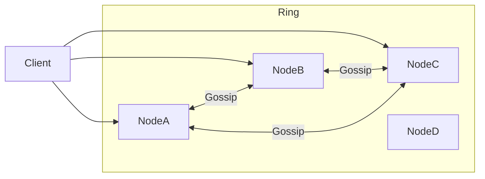
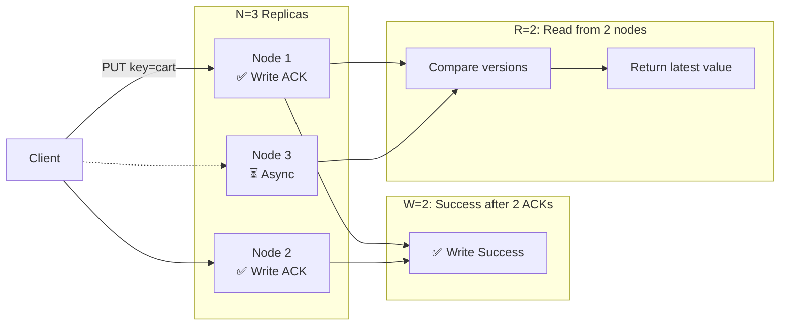

[🏠 Home](../README.md) | [⬅️ 13 Google Docs](./13-google-docs.md) | [➡️ 15 Distributed Cache](./15-distributed-cache.md)

# 🗝️ System Design: Key-Value Store (DynamoDB / Cassandra)

> Design a distributed key-value store that is highly available and scalable.

---

## 📊 Quick Reference Card

| Aspect | Decision |
|--------|----------|
| **Partitioning** | Consistent Hashing (with Virtual Nodes) |
| **Replication** | Master-less (Peer-to-Peer) or Leader-Follower |
| **Consistency** | Eventual Consistency (Tunable Quorums) |
| **Availability** | High (AP System) |
| **Communication** | Gossip Protocol |
| **Conflict Resolution**| Vector Clocks or Last-Write-Wins (LWW) |

---

## 📋 Table of Contents
1. [Functional Requirements](#-functional-requirements)
2. [The CAP Theorem Choice](#-the-cap-theorem-choice)
3. [Core Components](#-core-components)
4. [Data Partitioning (Consistent Hashing)](#-data-partitioning-consistent-hashing)
5. [Consistency & Replication](#-consistency--replication)

---

## ✅ Functional Requirements

| Feature | Description | Priority |
|---------|-------------|----------|
| **Put(key, value)** | Store data | P0 |
| **Get(key)** | Retrieve data | P0 |
| **Scalability** | Scale to PB of data, 100k+ QPS | P0 |
| **High Availability** | Continue working even if nodes fail | P0 |

---

## ⚖️ The CAP Theorem Choice

We cannot have Consistency, Availability, and Partition Tolerance all perfectly.
*   **Choice**: **AP** (Availability + Partition Tolerance).
*   **Reason**: Amazon (shopping cart) cannot afford downtime. It's better to show an old cart item than a 500 Error. Consistency will be "Eventual".

---

## 🏛️ High-Level Architecture

Master-less Architecture (Dynamo-style). Every node is equal.

---

## 🥧 Data Partitioning (Consistent Hashing)

**Problem**: If we do `Hash(key) % N`, adding a node changes `N`, reshuffling ALL keys.
**Solution**: Consistent Hashing.

### Visualizing the Ring
1.  Map partition keys (0 to $2^{64}-1$) to a **Circle**.
2.  Map Nodes (A, B, C) to points on the circle.
3.  Store key at the **first node clockwise**.

### Virtual Nodes (optimization)
*   **Problem**: What if Node A is huge and Node B is small? (Data skew).
*   **Fix**: Node A gets 100 positions on the ring (`A_1, A_2...`). Node B gets 50.
*   **Result**: Even distribution of data.

---

## 🔄 Consistency & Replication

### Tunable Consistency (N, R, W)
*   **N**: Number of replicas (e.g., 3).
*   **W**: Write Quorum (How many must confirm write before success).
*   **R**: Read Quorum (How many must respond to read).

**Formula**: If $W + R > N$, you have Strong Consistency.
*   **Fast Write/Slow Read**: $W=1, R=3$.
*   **Fast Read/Slow Write**: $W=3, R=1$.
*   **Balanced**: $N=3, W=2, R=2$ (Quorum).

### Handling Conflicts
If $W=1$, Node A might have "Cart: {Apple}" and Node B "Cart: {Banana}".
1.  **Last Write Wins (LWW)**: Trust the timestamp. Easier, but can lose data.
2.  **Vector Clocks**: Keep history `[A:1, B:2]`. Return BOTH versions to the client and let the client merge them (Amazon's original Dynamo approach).

### Visualizing Quorum (W + R > N)

> **Rule**: If `W + R > N` (e.g., 2+2 > 3), at least 1 node overlaps between read & write set → **Strong Consistency**

---

## 🕵️ Failure Detection (Gossip Protocol)
Since there is no Master to monitor nodes:
*   Nodes randomly say "I am alive" to 2 neighbors every second.
*   If Node A hasn't heard about Node D in 10 seconds, it marks D as "Suspect".
*   Information propagates exponentially (epidemic).

---

## 🔍 Deep Dives

### 1. Merkle Trees (Anti-Entropy)
How do nodes check if they are in sync without sending 1TB of data?
*   **Structure**: Hash tree.
    *   Leaf = Hash of individual key.
    *   Parent = Hash of children.
*   **Process**: Compare Root Hash. If different, compare children. Only send differences.
*   **Benefit**: Massive bandwidth saving.

### 2. Hinted Handoff
*   If Node A is down, where does its data go?
*   Node B (neighbor) accepts the write temporarily with a "hint" ("This belongs to A").
*   When A comes back, B hands it back.
*   **Result**: Writes never fail.

---

## 🧠 Interview Questions

1.  **Q**: Why use Consistent Hashing?
    *   **A**: To minimize data movement when scaling. Only $K/n$ keys move when adding a node.
2.  **Q**: How to handle a "Hot Key" (Celebrity)?
    *   **A**: Consistent hashing maps Key $\rightarrow$ 1 Node. If Justin Bieber tweets, that node melts.
    *   **Fix**: Add random suffix to key (`Bieber_1`, `Bieber_2`) to spread it across N replicas. Client reads from all and aggregates.
3.  **Q**: Explain "Sloppy Quorum".
    *   **A**: If the intended N nodes are down, write to *any* N healthy nodes (even if they aren't the owners) to maintain availability.

---
