[🏠 Home](../README.md) | [⬅️ 16 Cloud Storage](./16-cloud-storage.md) | [➡️ 18 Multiplayer Game State](./18-multiplayer-game-state.md)

# 🏆 System Design: Gaming Leaderboard

> Design a real-time leaderboard for a game with millions of players.

---

## 📊 Quick Reference Card

| Aspect | Decision |
|--------|----------|
| **Data Structure** | Redis Sorted Set (ZSET) |
| **Algorithm** | Skip List (underlying Redis) |
| **Protocol** | WebSockets (for live rank updates) |
| **Database** | SQL (Persistent backup) + Redis (Live) |
| **Partitioning** | Shard by Score Range (Tiered) or User ID |

---

## 📋 Table of Contents
1. [Functional Requirements](#-functional-requirements)
2. [Why SQL Fails](#-why-sql-fails)
3. [The Redis Solution (ZSET)](#-the-redis-solution-zset)
4. [High-Level Architecture](#-high-level-architecture)
5. [Scaling for 100M Players](#-scaling-for-100m-players)

---

## ✅ Functional Requirements

| Feature | Description | Priority |
|---------|-------------|----------|
| **Update Score** | Player finishes game, score updates immediately | P0 |
| **Get Rank** | "What is my rank?" (e.g., #543) | P0 |
| **Top K** | "Who are the top 10?" | P0 |
| **Scale** | 10M DAU, Real-time updates | P0 |

---

## 🐢 Why SQL Fails

Standard SQL query:
```sql
SELECT RANK() OVER (ORDER BY score DESC) FROM Leaderboard WHERE user_id = 123;
```
*   **Performance**: $O(N \log N)$ or requires scanning the index to count how many players have a higher score. Slow for 10M rows.
*   **Updates**: Constantly re-indexing on every update is expensive.

---

## ⚡ The Redis Solution (ZSET)

**Sorted Sets** are the gold standard for leaderboards.
*   **Structure**: Hash Map (User -> Score) + Skip List (Sorted Scores).
*   **Time Complexity**: $O(\log N)$ for both Update and GetRank.

### Commands
1.  **Update Score**: `ZADD leaderboard 1500 "user_123"`
2.  **Get Rank**: `ZREVRANK leaderboard "user_123"` (Returns index, e.g., 5)
3.  **Get Top 10**: `ZREVRANGE leaderboard 0 9`

### ZSET Internal Structure

```mermaid
flowchart LR
    subgraph "HashMap (O(1) lookup)"
        H1["user_123 → 1500"]
        H2["user_456 → 2300"]
        H3["user_789 → 900"]
    end

    subgraph "Skip List (O(log N) rank)"
        L3["Level 3: 900 ──────────────────→ 2300"]
        L2["Level 2: 900 ────→ 1500 ────→ 2300"]
        L1["Level 1: 900 → 1500 → 2300"]
    end

    H1 -.-> L1
    H2 -.-> L1
    H3 -.-> L1
```



### Score Update Flow


---

## 🏛️ High-Level Architecture


---

## 🚀 Scaling for 100M Players

Redis (single instance) holds ~10M keys in RAM nicely. For 100M, we need to shard.

### Strategy 1: Sharding by User ID? (No)
*   If we put User A on Shard 1 and User B on Shard 2... we can't calculate Ranks! We don't know who is globally first.

### Strategy 2: Sharding by Score Range (Tiered)
*   Break leaderboard into buckets:
    *   **Shard A**: Scores 0 - 1000
    *   **Shard B**: Scores 1001 - 5000
    *   **Shard C**: Scores 5000+ (Elite)
*   **Get Rank**:
    *   If user score is 6000 (Shard C), their Rank = (Local Rank in C).
    *   If user score is 500 (Shard A), their Rank = (Local Rank in A) + (Count of B) + (Count of C).
*   **Performance**: Fetching "Count" of total items in higher shards is fast (`ZCARD`).

---

## 🧠 Interview Questions

1.  **Q**: Handling tied scores?
    *   **A**: Use timestamps. `Score = ActualScore + (1 - Timestamp/1e12)`. Newer scores get slightly lower decimal value, so older scores rank higher.
2.  **Q**: Monthy vs All-Time Leaderboards?
    *   **A**: Use different ZSET keys: `lb:all-time`, `lb:dec-2025`. Update all relevant keys on game finish.
3.  **Q**: What if Redis crashes?
    *   **A**: We lose the live ranking. Rebuild it from MySQL (Source of Truth) by replaying scores. (Takes time, maintenance mode).

---
