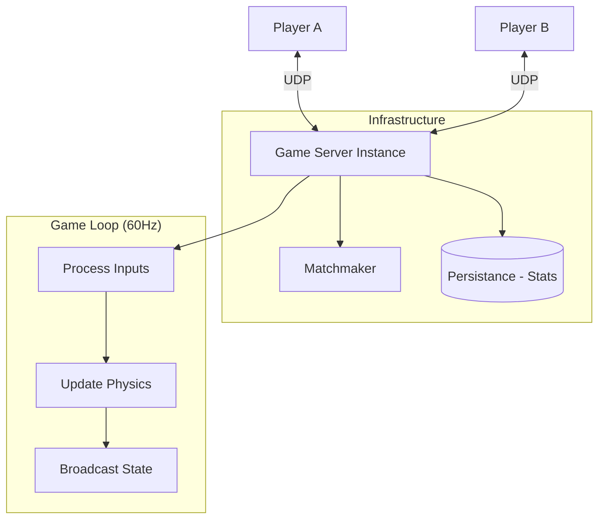

[🏠 Home](../README.md) | [⬅️ 17 Gaming Leaderboard](./17-gaming-leaderboard.md) | [➡️ 19 Stock Exchange](./19-stock-exchange.md)

# 🎮 System Design: Multiplayer Game State

> Design the backend for a fast-paced multiplayer game (e.g., Shooter or MOBA).

---

## 📊 Quick Reference Card

| Aspect | Decision |
|--------|----------|
| **Protocol** | UDP (User Datagram Protocol) |
| **Architecture** | Authoritative Server (Client is dumb terminal) |
| **Sync Model** | State Synchronization (Snapshot / Delta) |
| **Latency Handling** | Client-Side Prediction + Reconciliation |
| **Fairness** | Lag Compensation (Rewind Time) |

---

## 📋 Table of Contents
1. [Why not TCP?](#-why-not-tcp)
2. [Synchronization Models](#-synchronization-models)
3. [The Three Techniques for Lag](#-the-three-techniques-for-lag)
4. [Deep Dives](#-deep-dives)

---

## 🐢 Why not TCP?

*   **TCP**: Reliable, Ordered. If Packet 1 is lost, TCP pauses everything until Packet 1 is retransmitted.
    *   *Result*: "Rubber-banding" and freezing. Bad for real-time.
*   **UDP**: Fire and Forget. If Packet 1 is lost, who cares? Packet 2 is already here with newer data.
    *   *Result*: Smooth movement. We implement custom reliability only for critical events (like "Game Over").

---

## 🔄 Synchronization Models

### 1. Lockstep (RTS Games - Age of Empires)
*   Wait for **result** from every player before advancing frame.
*   *Pros*: Perfect sync. Low bandwidth (send commands, not positions).
*   *Cons*: Latency is limited by the slowest player.

### 2. State Synchronization (FPS/MOBA - CS:GO, Dota)
*   Server runs physics. Sends "Snapshot" of world positions 20-60 times/sec.
*   Client just renders what server says.
*   *Pros*: Resilient to laggy players. Cheating is harder.
*   *Cons*: High bandwidth.

---

## 🧠 The Three Techniques for Lag

### 1. Client-Side Prediction
*   **Problem**: Player presses "Forward". Round-trip to server is 100ms. Player feels 100ms delay.
*   **Fix**: Client moves character *immediately* locally. Server confirms later.

### 2. Server Reconciliation
*   **Problem**: Client predicted position $X=10$. Server says "No, you hit a wall, $X=5$".
*   **Fix**: Client accepts Server Truth, snaps back to $X=5$, and re-simulates inputs from that point.

### 3. Entity Interpolation
*   **Problem**: Server sends updates at 20Hz (every 50ms). Screen refreshes at 60Hz. Movement looks choppy.
*   **Fix**: Client renders other players typically **in the past** (buffer 100ms) and smoothly interpolates between known snapshots.

### 4. Lag Compensation (Rewind Time)
*   **Problem**: You aim at Enemy head. You click fire. But latency means Enemy had actually moved away on Server.
*   **Fix**:
    1.  Server receives "Shoot" command at time $T$.
    2.  Server knows your Ping was 100ms.
    3.  Server **rewinds** world state to $T - 100ms$.
    4.  Checks if hit was valid *at that moment*.

---

## 🏛️ High-Level Architecture

---

## 🧠 Interview Questions

1.  **Q**: How to prevent Speed Hacks?
    *   **A**: Authoritative Server. Use simple logic: "Distance moved > Max Speed * Time Delta". If true, ignore input and rubber-band player back.
2.  **Q**: How to matchmake effectively?
    *   **A**: Trade-off between **Wait Time** and **Skill Balance**. Expand search range (ELO rank) over time.

---
