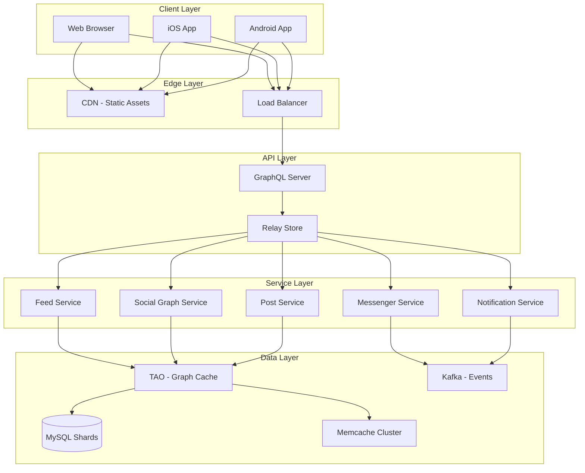
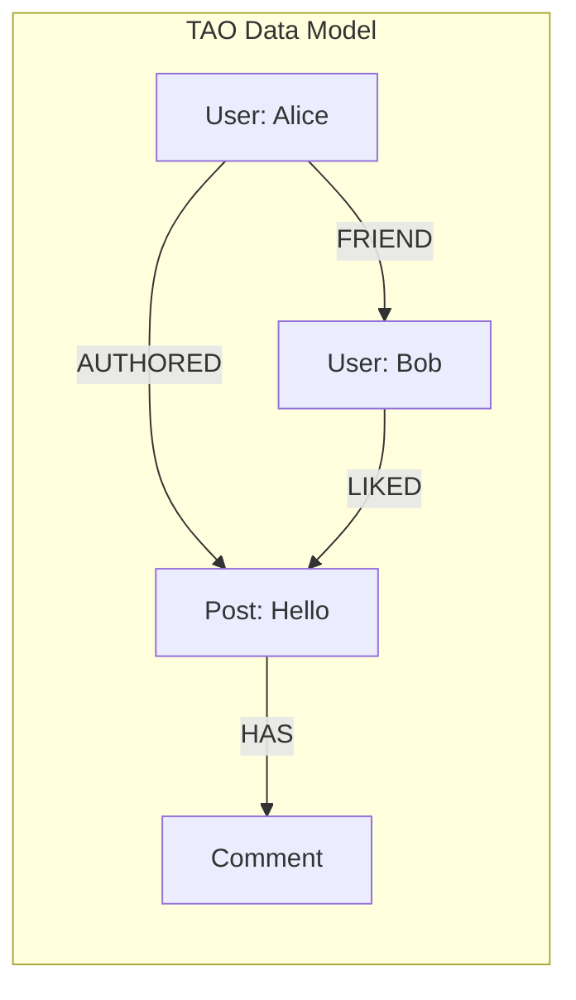
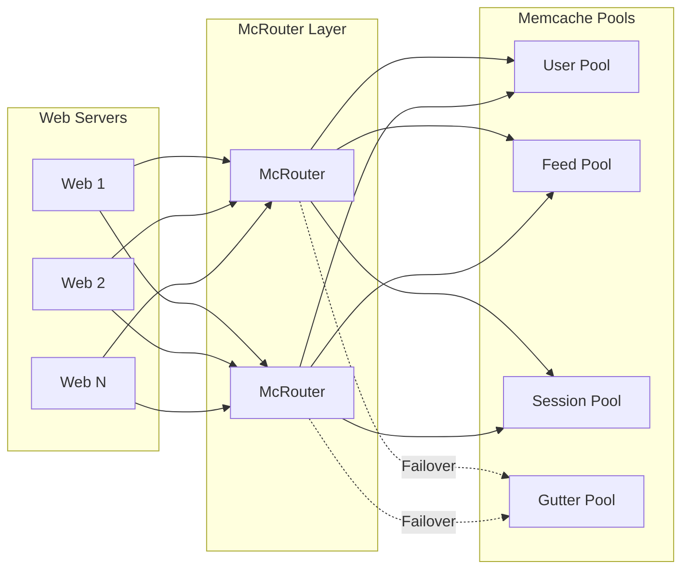

[🏠 Home](../../README.md) | [⬅️ 19 Stock Exchange](../19-stock-exchange.md) | [➡️ 21 Instagram](../21-instagram/01-system-design-interview.md)

# 📘 System Design: Facebook (Social Network)

> Design a social networking platform serving 3+ billion users with News Feed, Messenger, and real-time interactions.

---

## 📊 Quick Reference Card

| Aspect | Decision | Why |
|--------|----------|-----|
| **Social Graph** | TAO (MySQL backend) | Custom graph abstraction optimized for friend lookups |
| **Caching** | Memcache + McRouter | Billions of requests/sec, 99%+ hit rate |
| **API** | GraphQL + Relay | Declarative, efficient mobile data fetching |
| **Feed Ranking** | ML Pipeline | Personalized engagement prediction |
| **Language** | Hack (PHP dialect) | Gradual typing, fast iteration |
| **Build** | Buck2 | Incremental, hermetic builds at scale |

---

## 🎯 Technology Decision Matrix

| Component | Choice | Why This | Why Not Alternatives |
|-----------|--------|----------|----------------------|
| **Graph Storage** | TAO + MySQL | Graph semantics over proven relational DB; locality for associations | Native Graph DBs (Neo4j) lack sharding at FB scale |
| **Cache** | Memcache | Simple key-value, battle-tested, flexible | Redis too feature-rich for pure caching needs |
| **Cache Router** | McRouter | Connection pooling, failover, request routing | Direct memcache connections don't scale |
| **API Layer** | GraphQL | Clients declare exact data needs; no over-fetching | REST requires multiple round trips for complex UIs |
| **Feed** | ML Ranking | Personalization increases engagement | Chronological doesn't scale for power users |
| **Messaging** | Custom (Iris) | Real-time, ordering guarantees at scale | Kafka has higher latency for chat |

---

## 📋 Table of Contents

1. [Functional Requirements](#-functional-requirements)
2. [Scale Estimation](#-scale-estimation)
3. [High-Level Architecture](#-high-level-architecture)
4. [Component Deep Dives](#-component-deep-dives)
5. [Data Modeling](#-data-modeling)
6. [Interview Questions](#-interview-questions)

---

## ✅ Functional Requirements

| Feature | Description | Priority |
|---------|-------------|----------|
| **News Feed** | Personalized stream of posts from friends/pages | P0 |
| **Friend Graph** | Add/Remove friends, suggest connections | P0 |
| **Posts** | Text, photos, videos, reactions, comments | P0 |
| **Messenger** | Real-time 1:1 and group chat | P0 |
| **Notifications** | Real-time alerts for activity | P1 |
| **Search** | Find people, posts, pages, groups | P1 |
| **Stories** | Ephemeral 24h content | P1 |

---

## 📐 Scale Estimation

```
┌─────────────────────────────────────────────────────────┐
│                  FACEBOOK SCALE (2024)                  │
├─────────────────────────────────────────────────────────┤
│  Monthly Active Users:     3.0 Billion                  │
│  Daily Active Users:       2.0 Billion                  │
│  Posts per Day:            ~500 Million                 │
│  Photos Uploaded/Day:      ~350 Million                 │
│  Peak Requests/Sec:        10+ Million                  │
│  Data Centers:             20+ globally                 │
├─────────────────────────────────────────────────────────┤
│  STORAGE ESTIMATES                                      │
│  ─────────────────                                      │
│  Posts (10 years):         500M × 365 × 10 × 1KB = 2PB  │
│  Photos (10 years):        350M × 365 × 10 × 1MB = 1EB  │
│  Social Graph Edges:       500+ Billion                 │
│  Memcache Items:           Trillions                    │
└─────────────────────────────────────────────────────────┘
```

---

## 🏛️ High-Level Architecture



---

## 🔍 Component Deep Dives

### 1. TAO: The Associations and Objects

TAO is Facebook's distributed data store for the social graph, processing **billions of reads** and **millions of writes per second**.

**Data Model:**
- **Objects**: Nodes (Users, Posts, Photos) with key-value properties
- **Associations**: Directed edges (Friend, Like, Comment) with timestamps



**Why TAO over Graph Databases?**
| Aspect | TAO | Native Graph DB |
|--------|-----|-----------------|
| **Sharding** | ✅ Built-in MySQL sharding | ❌ Limited horizontal scaling |
| **Cache Integration** | ✅ Graph-aware caching | ❌ Generic caching |
| **Consistency** | ✅ Async replication, eventual | Varies |
| **Battle-tested** | ✅ 10+ years at FB scale | ❌ Not proven at this scale |

---

### 2. Memcache & McRouter

**Memcache Architecture:**
- **Cluster Pools**: Separate pools for different data types (user, feed, session)
- **Gutter Pool**: Failover pool when primary servers fail
- **Hit Rate**: 99%+ (critical for performance)

**McRouter Features:**
- Connection pooling (thousands of clients → hundreds of connections)
- Request routing based on key patterns
- Automatic failover and health checks
- Large value splitting/reassembly



---

### 3. News Feed Ranking

**EdgeRank (Legacy) → ML Pipeline (Modern)**

| Era | Algorithm | Signals |
|-----|-----------|---------|
| 2006-2011 | EdgeRank | Affinity, Weight, Decay |
| 2011-Present | ML Models | 1000+ features, deep learning |

**Modern Ranking Pipeline:**
1. **Candidate Generation**: Fetch posts from friends/pages (1000s)
2. **Lightweight Filtering**: Remove obvious non-relevant (100s)
3. **Heavy Ranking**: ML model predicts engagement probability
4. **Re-ranking**: Diversity, freshness, integrity checks
5. **Serve**: Top ~50 posts for initial load

**Key Features:**
- **User Features**: Demographics, past behavior, time patterns
- **Creator Features**: Post history, engagement rates
- **Content Features**: Type (photo/video), text sentiment, virality
- **Context Features**: Time of day, device, network speed

---

### 4. GraphQL & Relay

**Why GraphQL?**
- Mobile apps need exactly the data they display
- REST over/under-fetching wastes bandwidth
- Schema provides type safety and tooling

**Relay Modern Optimizations:**
- **Precompiled Queries**: Queries stored server-side, client sends ID
- **Fragment Colocation**: Data requirements next to React components
- **Incremental Data Delivery**: Stream large responses

```graphql
# Example: News Feed Query
query NewsFeedQuery($first: Int!) {
  viewer {
    feed(first: $first) {
      edges {
        node {
          id
          author { name, profilePicture }
          content
          reactions { count }
          comments(first: 3) { edges { node { text } } }
        }
      }
    }
  }
}
```

---

## 📝 Data Modeling

### Social Graph (TAO)

```
Objects:
  User(id, name, email, created_at)
  Post(id, content, created_at)
  Photo(id, url, width, height)
  Comment(id, text, created_at)

Associations:
  FRIEND(user_id, friend_id, created_at)
  AUTHORED(user_id, post_id, created_at)
  LIKED(user_id, post_id, created_at)
  COMMENTED(user_id, comment_id, created_at)
  HAS_COMMENT(post_id, comment_id, created_at)
```

### MySQL Sharding Strategy

| Data Type | Sharding Key | Rationale |
|-----------|--------------|-----------|
| User Data | `user_id` | User's data accessed together |
| Posts | `author_id` | Colocate with author's writes |
| Comments | `post_id` | Comments fetched with parent post |
| Messages | `thread_id` | Conversation locality |

---

## 🧠 Interview Questions

### 1. How would you design the News Feed?

**Answer Structure:**
```
1. Pull vs Push Model
   - Pull: User requests feed on demand
   - Push (Fan-out): Pre-compute feeds on post creation
   → Hybrid: Push to active users, pull for inactive

2. Storage
   - Feed Cache: Redis sorted set (user_id → [post_ids])
   - TTL: 7 days for cached feeds

3. Ranking
   - Fetch candidates from cache
   - Apply ML ranking model
   - Return top N posts
```

### 2. How does TAO handle billions of reads?

**Answer:**
- **Caching Layer**: Graph-aware cache between clients and MySQL
- **Read-Through**: Cache miss triggers DB read + cache update
- **Async Replication**: Writes to leader, async to followers
- **Locality**: Objects + Associations co-located on same shard

### 3. How to scale Memcache to trillions of items?

**Answer:**
1. **Horizontal Sharding**: Consistent hashing across servers
2. **McRouter**: Proxy layer for connection management
3. **Gutter Pools**: Failover clusters for availability
4. **Lease Tokens**: Prevent thundering herd on cache refill

---

## 📚 Further Reading

- [Architecture Deep Dive](./02-architecture-deep-dive.md)
- [TAO Paper (USENIX ATC 2013)](https://www.usenix.org/conference/atc13/technical-sessions/presentation/bronson)
- [Scaling Memcache at Facebook (NSDI 2013)](https://www.usenix.org/conference/nsdi13/technical-sessions/presentation/nishtala)
- [GraphQL Documentation](https://graphql.org/)

---
