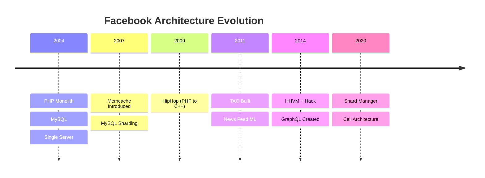
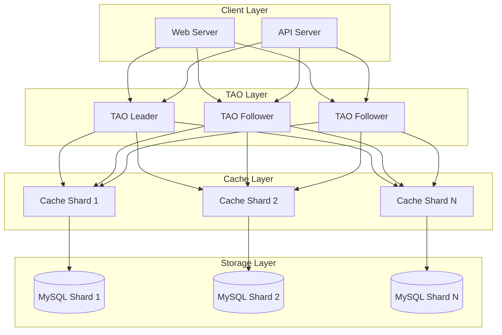
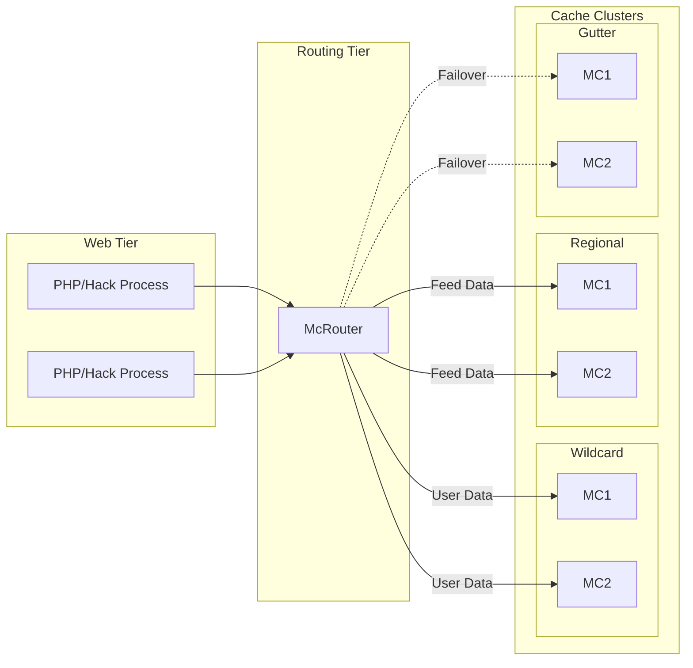
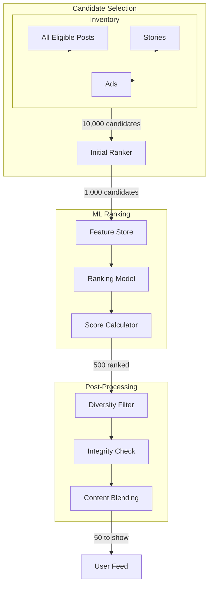
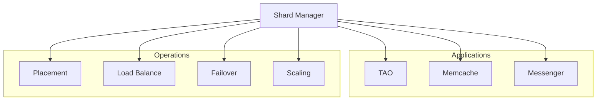
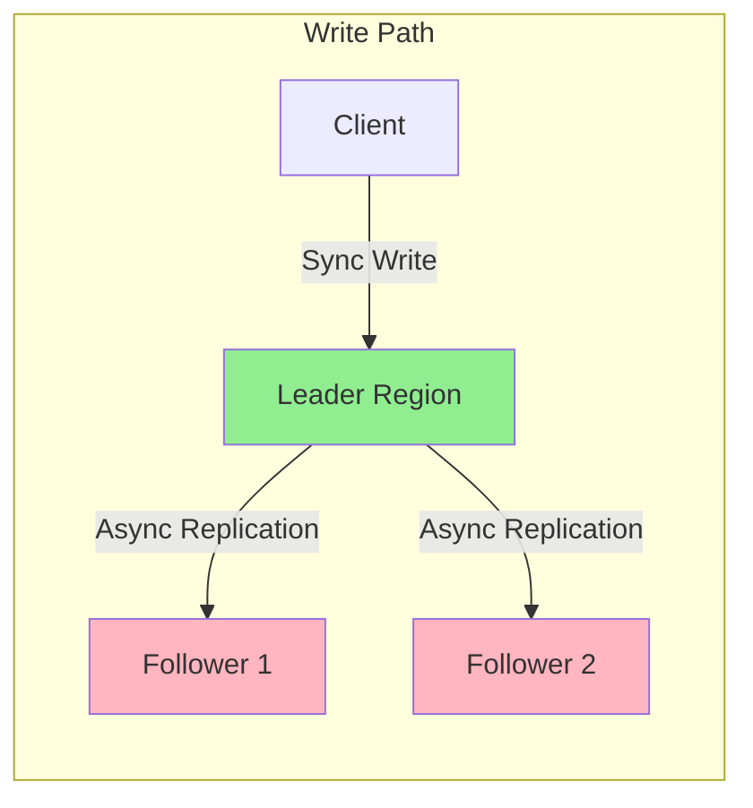

[🏠 Home](../../README.md) | [⬅️ Interview Guide](./01-system-design-interview.md)

# 🏗️ Facebook Architecture Deep Dive

> From PHP Monolith to the world's largest social network infrastructure.

---

## 📋 Table of Contents

1. [The Transformation](#-the-transformation-2004-2024)
2. [TAO Deep Dive](#-tao-deep-dive)
3. [Memcache at Scale](#-memcache-at-scale)
4. [News Feed Engineering](#-news-feed-engineering)
5. [Internal Tools & Languages](#-internal-tools--languages)
6. [Reliability Patterns](#-reliability-patterns)
7. [Design Considerations](#-design-considerations)

---

## 🔄 The Transformation (2004-2024)

### Timeline



### Key Architectural Decisions

| Year | Decision | Problem Solved |
|------|----------|----------------|
| 2007 | Add Memcache | MySQL couldn't handle read load |
| 2009 | HipHop Compiler | PHP too slow for scale |
| 2011 | Build TAO | Memcache inefficient for graph queries |
| 2012 | Create GraphQL | REST APIs too rigid for mobile |
| 2014 | Launch Hack | Type safety without losing PHP velocity |

---

## 🔗 TAO Deep Dive

### Architecture Layers



### Data Model Details

**Objects Table (per shard):**
```sql
CREATE TABLE objects (
    id         BIGINT PRIMARY KEY,
    type       INT,
    data       BLOB,      -- Key-value properties
    version    INT,
    created_at TIMESTAMP,
    updated_at TIMESTAMP
);
```

**Associations Table (per shard):**
```sql
CREATE TABLE associations (
    id1        BIGINT,     -- Source object
    atype      INT,        -- Association type (FRIEND, LIKE, etc.)
    id2        BIGINT,     -- Target object
    time       INT,        -- Timestamp for ordering
    data       BLOB,       -- Edge properties
    PRIMARY KEY (id1, atype, id2)
);
-- Index for reverse lookups
CREATE INDEX assoc_reverse ON associations (id2, atype, id1);
```

### Why MySQL Not Native Graph DB?

| Factor | MySQL + TAO | Neo4j/Native Graph |
|--------|-------------|-------------------|
| **Sharding** | ✅ Proven at PB scale | ❌ Limited horizontal scaling |
| **Operations** | ✅ FB has MySQL expertise | ❌ New ops burden |
| **Transactions** | ✅ ACID for writes | ✅ ACID |
| **Tooling** | ✅ Existing ecosystem | ❌ New tooling needed |
| **Caching** | ✅ Custom graph-aware cache | ❌ Generic caching |

---

## 💾 Memcache at Scale

### Scale Numbers (2023)

| Metric | Value |
|--------|-------|
| Servers | 10,000+ |
| Requests/sec | 5+ Billion |
| Items Cached | Trillions |
| Hit Rate | 99%+ |
| Clusters | 100+ |

### McRouter Architecture



### Cache Invalidation Strategy

**Write Path:**
1. Write to MySQL leader
2. Invalidate cache key (delete, not update)
3. MySQL replication triggers cache invalidation in other regions

**Thundering Herd Prevention:**
```
LEASE TOKEN MECHANISM:
1. Client A: GET key → MISS, receives lease_token_123
2. Client B: GET key → MISS, but lease exists → WAIT
3. Client A: SET key with lease_token_123 → SUCCESS
4. Client B: GET key → HIT (from A's write)
```

---

## 📰 News Feed Engineering

### Ranking Pipeline Architecture



### Feature Categories

| Category | Examples | Weight |
|----------|----------|--------|
| **User-Post Affinity** | Past likes on this author, time spent | High |
| **Content Signals** | Post type, virality score, age | Medium |
| **Social Signals** | Friends who engaged, comments count | High |
| **Integrity** | Misinformation score, clickbait | Negative |
| **Freshness** | Post age, last interaction time | Medium |

### Edge Cases

| Scenario | Solution |
|----------|----------|
| New User (Cold Start) | Global popularity + demographic similarity |
| Power User (1000+ friends) | Aggressive filtering, sample posts |
| Viral Post | Rate limit impressions, integrity review |
| Stale Feed | Time decay, "Seen" marker |

---

## 🛠️ Internal Tools & Languages

### Hack Language

**Key Features:**
- **Gradual Typing**: Mix dynamic and static typing
- **Async/Await**: Built-in async primitives
- **Generics**: Full generic support
- **Fast Type Checker**: Sub-200ms incremental checking

```hack
// Hack example with types
async function fetchUser(int $user_id): Awaitable<User> {
  $row = await Database::fetchRow("users", $user_id);
  return new User($row);
}
```

### Developer Tools

| Tool | Purpose |
|------|---------|
| **Buck2** | Fast, hermetic builds (Rust rewrite of Buck) |
| **Sapling** | Modern VCS client for Mercurial |
| **Infer** | Static analysis for Java/C++ |
| **Pyre** | Type checker for Python |
| **Jest** | JavaScript testing framework |

### Monorepo Strategy

- **Size**: 100+ million files
- **Commits/Day**: 1000+ engineers committing
- **Build System**: Buck2 with remote caching
- **VCS**: Mercurial with Sapling client

---

## 🛡️ Reliability Patterns

### Shard Manager

**Purpose**: Generic platform for managing sharded applications



**Capabilities:**
- Manages millions of shards across 100K+ servers
- Automatic rebalancing during traffic spikes
- Rolling deployments without downtime
- Dynamic replication factor adjustment

### Chaos Engineering

| Practice | Implementation |
|----------|----------------|
| **Storm** | Simulate data center failures |
| **Network Partitions** | Test cross-region resilience |
| **Dependency Failures** | Kill services to test fallbacks |
| **Load Testing** | 2x production load regularly |

---

## ⚖️ Design Considerations

### Database Selection Framework

| Use Case | Database | Why | Why Not Alternatives |
|----------|----------|-----|----------------------|
| Social Graph | MySQL + TAO | Proven sharding, graph cache | Graph DBs don't shard well |
| Feed Cache | Redis | Sorted sets, fast reads | Memcache lacks data structures |
| Messages | Custom (Iris) | Ordering, real-time | Kafka latency too high |
| Analytics | Hive/Presto | SQL on Hadoop, ad-hoc queries | MySQL can't handle PB |
| ML Features | Feature Store | Low-latency serving | Databases too slow for inference |

### Consistency Model



**Consistency Guarantees:**
| Operation | Consistency | Rationale |
|-----------|-------------|-----------|
| Read Own Write | Strong | User expects to see their post |
| Friend Feed | Eventual | Few seconds delay acceptable |
| Messenger | Strong | Real-time messages critical |
| Like Count | Eventual | Approximate is fine |

### CAP Theorem Choices

| Service | Priority | Rationale |
|---------|----------|-----------|
| Auth | CP | Security can't be compromised |
| Feed | AP | Availability > perfect consistency |
| Messenger | AP (with ordering) | Must be available, ordering critical |
| Payments | CP | Financial accuracy required |

---

## 📚 References

- [TAO: Facebook's Distributed Data Store for the Social Graph (USENIX 2013)](https://www.usenix.org/conference/atc13/technical-sessions/presentation/bronson)
- [Scaling Memcache at Facebook (NSDI 2013)](https://www.usenix.org/conference/nsdi13/technical-sessions/presentation/nishtala)
- [Shard Manager (Meta Engineering Blog)](https://engineering.fb.com/2020/08/24/production-engineering/scaling-services-with-shard-manager/)
- [Hack Language](https://hacklang.org/)

---
