# BookMyShow System Design - Complete Architecture Guide

> A comprehensive deep-dive into Online Ticket Booking Platform architecture (BookMyShow/Ticketmaster/Fandango), covering seat selection, concurrency handling, payment processing, event management, and scalability patterns.

---

## Table of Contents

1. [Overview](#overview)
2. [Core Features & Requirements](#core-features--requirements)
3. [High-Level Architecture](#high-level-architecture)
4. [Core System Components](#core-system-components)
5. [Seat Booking & Locking Mechanism](#seat-booking--locking-mechanism)
6. [Concurrency Handling](#concurrency-handling)
7. [Search & Discovery](#search--discovery)
8. [Payment System](#payment-system)
9. [Notification System](#notification-system)
10. [Event & Venue Management](#event--venue-management)
11. [Data Infrastructure](#data-infrastructure)
12. [Caching Strategy](#caching-strategy)
13. [Technology Stack](#technology-stack)
14. [Key Design Patterns](#key-design-patterns)
15. [Interview Talking Points](#interview-talking-points)
16. [References](#references)

---

## Overview

BookMyShow is India's largest online entertainment ticketing platform, handling millions of bookings for movies, events, sports, and live performances.

### Scale Numbers (Approximate)

| Metric | Value |
|--------|-------|
| Monthly Active Users | 50M+ |
| Cities Covered | 650+ |
| Partner Venues | 8000+ |
| Daily Transactions | 1M+ |
| Peak TPS (Transactions/Second) | 10,000+ |
| Average Response Time | < 100ms |

### Key Challenges

| Challenge | Description |
|-----------|-------------|
| **Seat Concurrency** | Multiple users trying to book same seat simultaneously |
| **Flash Sales** | Handle 100x traffic spikes for popular events |
| **Inventory Accuracy** | Real-time seat availability across all channels |
| **Low Latency** | Sub-second response for seat selection |
| **Distributed Locking** | Prevent double booking across regions |
| **High Availability** | 99.99% uptime during peak booking windows |

---

## Core Features & Requirements

### Functional Requirements

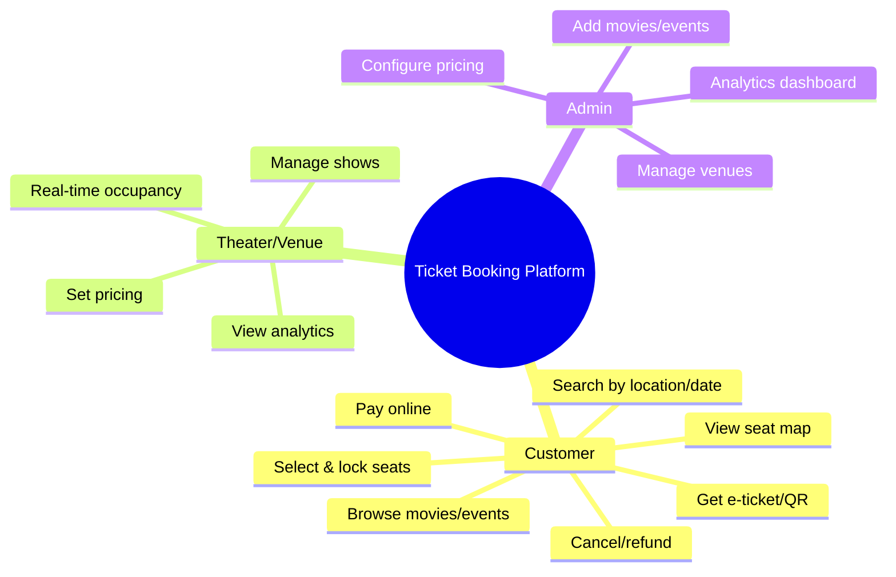

### Non-Functional Requirements

| Requirement | Target |
|------------|--------|
| **Availability** | 99.99% uptime |
| **Latency** | < 100ms for API responses |
| **Consistency** | Strong consistency for seat booking |
| **Scalability** | Handle 100x traffic spikes |
| **Durability** | Zero booking data loss |
| **Concurrency** | Handle 10K+ concurrent seat selections |

---

## High-Level Architecture

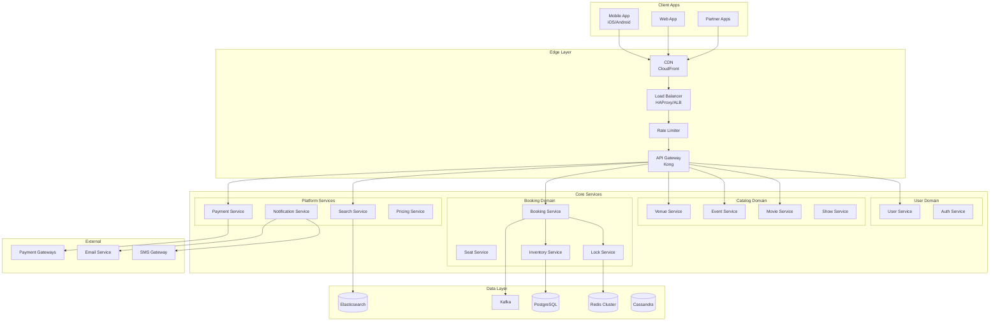

---

## Core System Components

### Service Breakdown

| Service | Responsibility | Database |
|---------|---------------|----------|
| **User Service** | User profiles, preferences, booking history | PostgreSQL |
| **Movie Service** | Movie metadata, cast, crew, ratings | PostgreSQL + Redis |
| **Event Service** | Concerts, sports, live events | PostgreSQL |
| **Venue Service** | Theater/venue details, seat layouts | PostgreSQL + Redis |
| **Show Service** | Show timings, pricing tiers | PostgreSQL |
| **Seat Service** | Seat availability, real-time status | Redis + PostgreSQL |
| **Lock Service** | Temporary seat locking (distributed lock) | Redis |
| **Booking Service** | Booking lifecycle, confirmation | PostgreSQL + Kafka |
| **Inventory Service** | Seat inventory management | PostgreSQL |
| **Search Service** | Movie/event search by filters | Elasticsearch |
| **Payment Service** | Payment processing, refunds | PostgreSQL |
| **Notification Service** | Tickets, reminders, cancellations | Kafka + SNS |
| **Pricing Service** | Dynamic pricing, offers | Redis |

---

## Seat Booking & Locking Mechanism

### The Core Problem

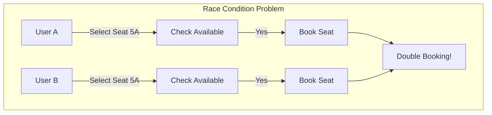

### Solution: Two-Phase Locking

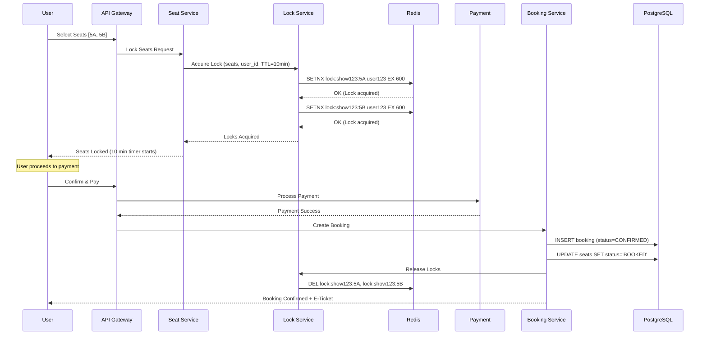

### Seat States

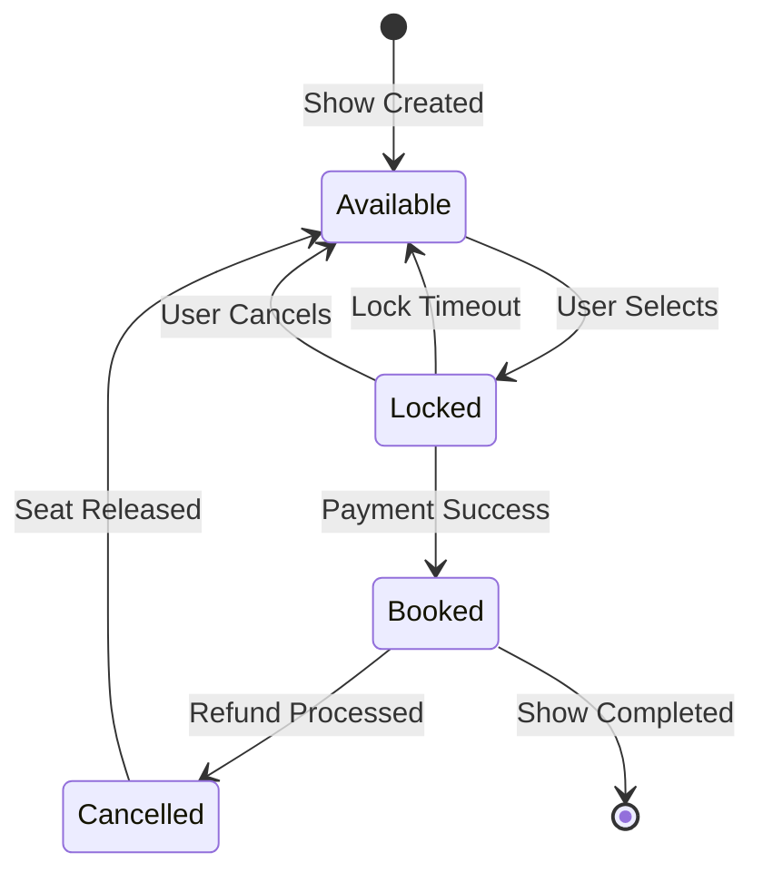

### Lock Implementation

```python
# Redis-based Distributed Lock
class SeatLockService:
    LOCK_TTL = 600  # 10 minutes
    
    async def acquire_locks(self, show_id: str, seat_ids: list, user_id: str) -> bool:
        """
        Atomically acquire locks for multiple seats.
        Uses Redis transaction (MULTI/EXEC) for atomicity.
        """
        pipe = redis.pipeline()
        
        try:
            # Watch all seat keys for changes
            lock_keys = [f"lock:{show_id}:{seat}" for seat in seat_ids]
            pipe.watch(*lock_keys)
            
            # Check if any seat is already locked
            for key in lock_keys:
                if redis.exists(key):
                    pipe.unwatch()
                    return False  # Seat already locked
            
            # Acquire all locks atomically
            pipe.multi()
            for key in lock_keys:
                pipe.setex(key, self.LOCK_TTL, user_id)
            
            pipe.execute()
            return True
            
        except redis.exceptions.WatchError:
            # Another transaction modified the keys
            return False
    
    async def release_locks(self, show_id: str, seat_ids: list, user_id: str):
        """
        Release locks only if owned by the user.
        Uses Lua script for atomic check-and-delete.
        """
        lua_script = """
        local key = KEYS[1]
        local user_id = ARGV[1]
        if redis.call('GET', key) == user_id then
            return redis.call('DEL', key)
        end
        return 0
        """
        
        for seat in seat_ids:
            key = f"lock:{show_id}:{seat}"
            redis.eval(lua_script, 1, key, user_id)
    
    async def extend_lock(self, show_id: str, seat_ids: list, user_id: str) -> bool:
        """
        Extend lock TTL if user is still on payment page.
        """
        lua_script = """
        local key = KEYS[1]
        local user_id = ARGV[1]
        local ttl = ARGV[2]
        if redis.call('GET', key) == user_id then
            return redis.call('EXPIRE', key, ttl)
        end
        return 0
        """
        
        for seat in seat_ids:
            key = f"lock:{show_id}:{seat}"
            result = redis.eval(lua_script, 1, key, user_id, self.LOCK_TTL)
            if result == 0:
                return False
        return True
```

### Seat Data Model

```sql
-- Venues Table
CREATE TABLE venues (
    id UUID PRIMARY KEY,
    name VARCHAR(200),
    city VARCHAR(100),
    address TEXT,
    total_seats INTEGER,
    seat_layout JSONB,  -- Row/column configuration
    created_at TIMESTAMP DEFAULT NOW()
);

-- Screens/Halls Table
CREATE TABLE screens (
    id UUID PRIMARY KEY,
    venue_id UUID REFERENCES venues(id),
    name VARCHAR(100),  -- Screen 1, Audi 1
    seat_layout JSONB,  -- Detailed seat map with categories
    total_seats INTEGER
);

-- Shows Table
CREATE TABLE shows (
    id UUID PRIMARY KEY,
    movie_id UUID,
    venue_id UUID REFERENCES venues(id),
    screen_id UUID REFERENCES screens(id),
    show_time TIMESTAMP,
    end_time TIMESTAMP,
    language VARCHAR(50),
    format VARCHAR(50),  -- 2D, 3D, IMAX
    status VARCHAR(20),  -- SCHEDULED, ONGOING, COMPLETED, CANCELLED
    created_at TIMESTAMP DEFAULT NOW()
);

-- Show Seats Table (denormalized for performance)
CREATE TABLE show_seats (
    id UUID PRIMARY KEY,
    show_id UUID REFERENCES shows(id),
    seat_number VARCHAR(10),  -- A1, B5, etc.
    category VARCHAR(50),     -- GOLD, SILVER, PLATINUM
    price DECIMAL(10,2),
    status VARCHAR(20) DEFAULT 'AVAILABLE',  -- AVAILABLE, LOCKED, BOOKED
    locked_by UUID,
    locked_until TIMESTAMP,
    booked_by UUID,
    booking_id UUID,
    
    CONSTRAINT unique_show_seat UNIQUE (show_id, seat_number)
);

-- Index for fast availability queries
CREATE INDEX idx_show_seats_status ON show_seats(show_id, status);
CREATE INDEX idx_show_seats_locked ON show_seats(locked_until) WHERE status = 'LOCKED';

-- Bookings Table
CREATE TABLE bookings (
    id UUID PRIMARY KEY,
    user_id UUID NOT NULL,
    show_id UUID REFERENCES shows(id),
    seats TEXT[],  -- Array of seat numbers
    total_amount DECIMAL(10,2),
    convenience_fee DECIMAL(10,2),
    taxes DECIMAL(10,2),
    final_amount DECIMAL(10,2),
    payment_id UUID,
    status VARCHAR(20),  -- PENDING, CONFIRMED, CANCELLED, REFUNDED
    booking_time TIMESTAMP DEFAULT NOW(),
    qr_code TEXT,
    
    created_at TIMESTAMP DEFAULT NOW(),
    updated_at TIMESTAMP DEFAULT NOW()
);
```

---

## Concurrency Handling

### Optimistic Locking (Database Level)

```sql
-- Add version column for optimistic locking
ALTER TABLE show_seats ADD COLUMN version INTEGER DEFAULT 0;

-- Update with version check
UPDATE show_seats 
SET status = 'BOOKED', 
    booked_by = :user_id,
    booking_id = :booking_id,
    version = version + 1
WHERE show_id = :show_id 
  AND seat_number = :seat_number
  AND status = 'LOCKED'
  AND locked_by = :user_id
  AND version = :expected_version;

-- Check rows affected - if 0, concurrent modification occurred
```

### Pessimistic Locking (Critical Sections)

```sql
-- Lock seats for update (PostgreSQL)
BEGIN;

SELECT * FROM show_seats 
WHERE show_id = :show_id 
  AND seat_number IN (:seat_list)
  AND status = 'AVAILABLE'
FOR UPDATE NOWAIT;  -- Fail immediately if locked

-- If successful, proceed with booking
UPDATE show_seats 
SET status = 'BOOKED', booked_by = :user_id
WHERE show_id = :show_id 
  AND seat_number IN (:seat_list);

COMMIT;
```

### Redis + Database Hybrid Approach

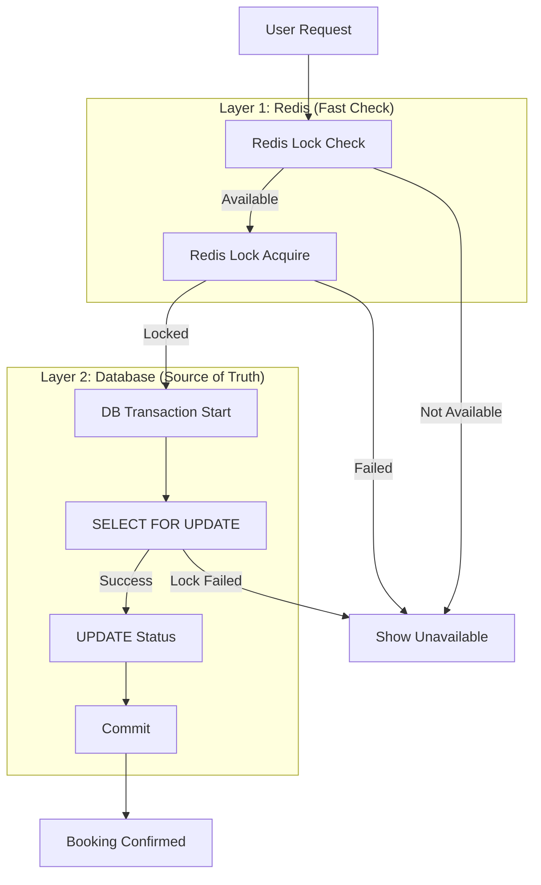

### Handling Flash Sales

```python
# Queue-based approach for high-demand events
class FlashSaleBookingService:
    
    async def handle_booking_request(self, request: BookingRequest):
        # 1. Add to waiting queue
        queue_position = await redis.rpush(
            f"queue:{request.show_id}",
            json.dumps(request.dict())
        )
        
        # 2. Return queue position to user
        return {
            "status": "QUEUED",
            "position": queue_position,
            "estimated_wait": queue_position * 2  # seconds
        }
    
    async def process_queue(self, show_id: str):
        """Background worker processes queue sequentially"""
        while True:
            # Pop from queue
            request_data = await redis.lpop(f"queue:{show_id}")
            if not request_data:
                break
            
            request = BookingRequest.parse_raw(request_data)
            
            # Try to book
            result = await self.attempt_booking(request)
            
            # Notify user via WebSocket
            await notify_user(request.user_id, result)
```

---

## Search & Discovery

### Search Architecture

```mermaid
graph TD
    subgraph "Search Request"
        Q[Search: "Avengers in Bangalore"]
    end
    
    subgraph "Query Processing"
        QP[Query Parser]
        GEO[Location Filter]
        ES[Elasticsearch]
        RANK[Ranking]
    end
    
    subgraph "Indexes"
        MI[(Movie Index)]
        EI[(Event Index)]
        VI[(Venue Index)]
    end
    
    Q --> QP
    QP --> GEO
    GEO --> ES
    ES --> MI & EI & VI
    ES --> RANK
    RANK --> |Results| Q
```

### Elasticsearch Index

```json
{
  "settings": {
    "number_of_shards": 3,
    "number_of_replicas": 2,
    "analysis": {
      "analyzer": {
        "autocomplete": {
          "type": "custom",
          "tokenizer": "standard",
          "filter": ["lowercase", "autocomplete_filter"]
        }
      },
      "filter": {
        "autocomplete_filter": {
          "type": "edge_ngram",
          "min_gram": 2,
          "max_gram": 20
        }
      }
    }
  },
  "mappings": {
    "properties": {
      "id": { "type": "keyword" },
      "title": {
        "type": "text",
        "analyzer": "autocomplete",
        "fields": {
          "keyword": { "type": "keyword" }
        }
      },
      "genres": { "type": "keyword" },
      "language": { "type": "keyword" },
      "format": { "type": "keyword" },
      "release_date": { "type": "date" },
      "rating": { "type": "float" },
      "duration_mins": { "type": "integer" },
      "cities": { "type": "keyword" },
      "cast": { "type": "text" },
      "director": { "type": "text" },
      "is_now_showing": { "type": "boolean" },
      "is_coming_soon": { "type": "boolean" }
    }
  }
}
```

### Search Filters

| Filter | Type | Example |
|--------|------|---------|
| **City** | Keyword | Bangalore, Mumbai |
| **Date** | Date Range | Today, Weekend |
| **Language** | Keyword | Hindi, English, Telugu |
| **Format** | Keyword | 2D, 3D, IMAX |
| **Genre** | Keyword | Action, Comedy |
| **Time Slot** | Range | Morning, Evening |
| **Price Range** | Range | ₹100-300 |

---

## Payment System

### Payment Flow

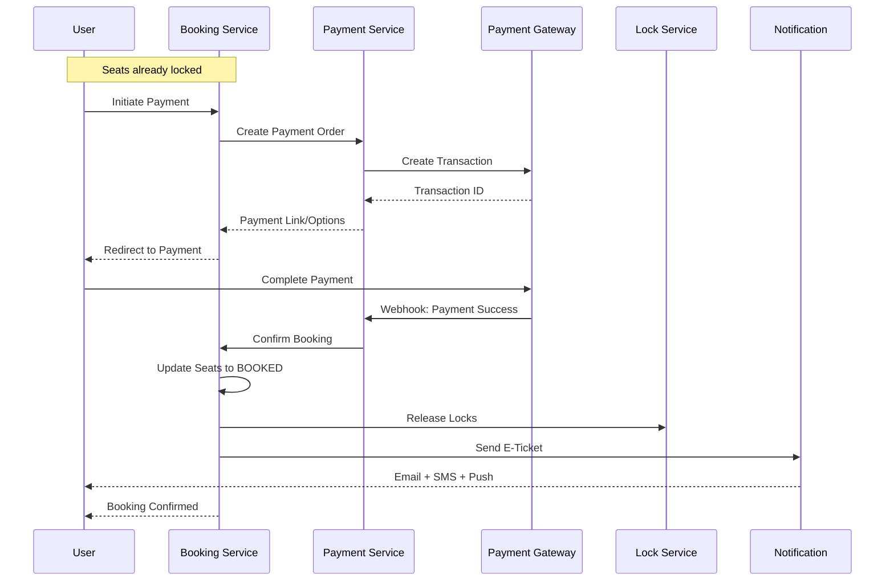

### Handling Payment Failures

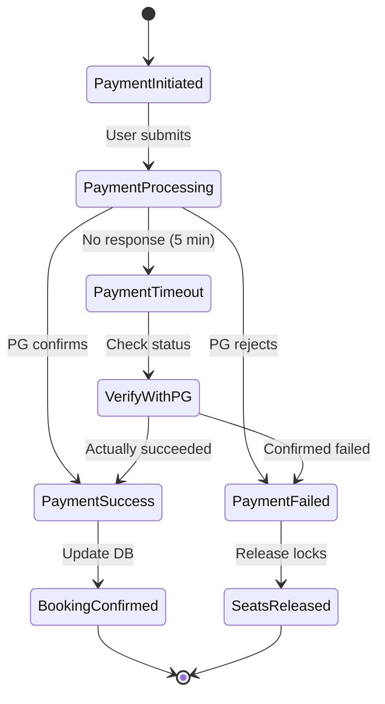

### Idempotency for Payments

```python
class PaymentService:
    
    async def process_payment(self, booking_id: str, idempotency_key: str):
        """
        Ensure exactly-once payment processing using idempotency key.
        """
        # Check if already processed
        existing = await redis.get(f"payment:idempotency:{idempotency_key}")
        if existing:
            return json.loads(existing)
        
        # Process payment
        result = await self._execute_payment(booking_id)
        
        # Store result with TTL
        await redis.setex(
            f"payment:idempotency:{idempotency_key}",
            86400,  # 24 hours
            json.dumps(result)
        )
        
        return result
```

### Refund Handling

```python
async def process_refund(booking_id: str, reason: str):
    """
    Handle refund based on cancellation policy.
    """
    booking = await get_booking(booking_id)
    show = await get_show(booking.show_id)
    
    # Calculate refund amount based on policy
    hours_before_show = (show.show_time - datetime.now()).total_seconds() / 3600
    
    if hours_before_show > 24:
        refund_percentage = 100
    elif hours_before_show > 4:
        refund_percentage = 75
    elif hours_before_show > 2:
        refund_percentage = 50
    else:
        refund_percentage = 0  # No refund
    
    refund_amount = booking.final_amount * (refund_percentage / 100)
    
    # Process refund
    if refund_amount > 0:
        await payment_gateway.refund(booking.payment_id, refund_amount)
        
        # Update booking status
        booking.status = 'REFUNDED'
        booking.refund_amount = refund_amount
        await save_booking(booking)
        
        # Release seats
        await release_seats(booking.show_id, booking.seats)
    
    return {
        "refund_percentage": refund_percentage,
        "refund_amount": refund_amount
    }
```

---

## Notification System

### Notification Types

| Event | Channel | Content |
|-------|---------|---------|
| Booking Confirmed | SMS + Email + Push | E-Ticket, QR Code, Venue Details |
| Payment Failed | Push + SMS | Retry Payment Link |
| Show Reminder | Push | 2 hours before show |
| Show Cancelled | SMS + Email | Refund details |
| Offers | Push | Personalized offers |

### E-Ticket Generation

```python
import qrcode
import io
import base64

class TicketService:
    
    async def generate_ticket(self, booking: Booking) -> dict:
        # Generate QR code with booking details
        qr_data = {
            "booking_id": str(booking.id),
            "show_id": str(booking.show_id),
            "seats": booking.seats,
            "timestamp": booking.booking_time.isoformat(),
            "checksum": self._generate_checksum(booking)
        }
        
        qr = qrcode.QRCode(version=1, box_size=10, border=5)
        qr.add_data(json.dumps(qr_data))
        qr.make(fit=True)
        
        img = qr.make_image(fill_color="black", back_color="white")
        
        # Convert to base64
        buffer = io.BytesIO()
        img.save(buffer, format='PNG')
        qr_base64 = base64.b64encode(buffer.getvalue()).decode()
        
        # Store QR in booking
        booking.qr_code = qr_base64
        await save_booking(booking)
        
        return {
            "booking_id": booking.id,
            "qr_code": qr_base64,
            "venue": await get_venue_details(booking.show_id),
            "show_time": booking.show.show_time,
            "seats": booking.seats
        }
```

---

## Event & Venue Management

### Venue Seat Layout

```json
{
  "venue_id": "v123",
  "screen_id": "s1",
  "layout": {
    "rows": 15,
    "columns": 20,
    "categories": [
      {
        "name": "PLATINUM",
        "rows": ["A", "B", "C"],
        "price_multiplier": 1.5,
        "color": "#FFD700"
      },
      {
        "name": "GOLD", 
        "rows": ["D", "E", "F", "G", "H"],
        "price_multiplier": 1.2,
        "color": "#FFA500"
      },
      {
        "name": "SILVER",
        "rows": ["I", "J", "K", "L", "M", "N", "O"],
        "price_multiplier": 1.0,
        "color": "#C0C0C0"
      }
    ],
    "blocked_seats": ["A1", "A20", "O1", "O20"],  // Corners
    "aisle_after_columns": [5, 15],
    "wheelchair_accessible": ["O1", "O2", "O19", "O20"]
  }
}
```

### Show Management

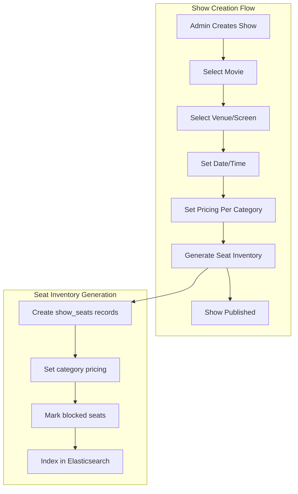

---

## Data Infrastructure

### Database Selection

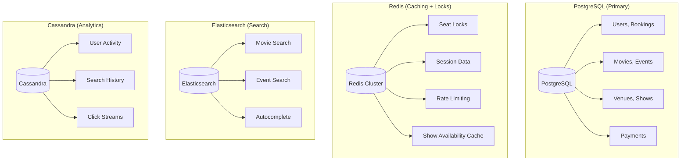

### Data Partitioning Strategy

| Data Type | Partitioning | Key |
|-----------|-------------|-----|
| Bookings | Range (by date) | booking_date |
| Show Seats | Hash | show_id |
| User Data | Hash | user_id |
| Analytics | Time-series | timestamp |

---

## Caching Strategy

### Multi-Layer Cache

| Data | Cache | TTL | Invalidation |
|------|-------|-----|--------------|
| Movie details | Redis + CDN | 1 hour | On update |
| Show listings | Redis | 5 min | On booking |
| Seat availability | Redis | 30 sec | On lock/book |
| Venue layout | Redis | 24 hours | On update |
| User session | Redis | 24 hours | On logout |
| Search results | Elasticsearch | 1 min | Time-based |

### Cache-Aside Pattern for Seats

```python
async def get_available_seats(show_id: str) -> list:
    cache_key = f"seats:available:{show_id}"
    
    # Try cache
    cached = await redis.get(cache_key)
    if cached:
        return json.loads(cached)
    
    # Cache miss - query DB
    seats = await db.query("""
        SELECT seat_number, category, price 
        FROM show_seats 
        WHERE show_id = :show_id AND status = 'AVAILABLE'
    """, show_id=show_id)
    
    # Cache with short TTL (30 seconds)
    await redis.setex(cache_key, 30, json.dumps([s.dict() for s in seats]))
    
    return seats

# Invalidate on booking
async def on_seat_booked(show_id: str):
    await redis.delete(f"seats:available:{show_id}")
```

---

## Technology Stack

### Backend

| Component | Technology |
|-----------|------------|
| **Language** | Java (Spring Boot), Node.js, Go |
| **API** | REST, GraphQL |
| **Message Queue** | Apache Kafka, RabbitMQ |
| **Caching** | Redis Cluster |
| **Database** | PostgreSQL, MongoDB |
| **Search** | Elasticsearch |

### Frontend

| Platform | Technology |
|----------|------------|
| **Web** | React, Next.js |
| **iOS** | Swift |
| **Android** | Kotlin |
| **Design System** | Custom component library |

### Infrastructure

| Component | Technology |
|-----------|------------|
| **Cloud** | AWS |
| **CDN** | CloudFront |
| **Container** | Docker, Kubernetes |
| **CI/CD** | Jenkins, GitLab CI |
| **Monitoring** | Prometheus, Grafana, ELK |
| **Load Balancer** | HAProxy, AWS ALB |

---

## Key Design Patterns

### 1. Distributed Locking (Redlock)

```python
import redis
from datetime import datetime, timedelta

class DistributedLock:
    """
    Redlock implementation for seat locking across multiple Redis nodes.
    """
    def __init__(self, redis_nodes: list):
        self.redis_nodes = redis_nodes
        self.quorum = len(redis_nodes) // 2 + 1
    
    def acquire(self, resource: str, ttl: int) -> bool:
        lock_value = f"{uuid.uuid4()}"
        acquired = 0
        
        start_time = datetime.now()
        
        for node in self.redis_nodes:
            try:
                if node.set(resource, lock_value, nx=True, ex=ttl):
                    acquired += 1
            except redis.RedisError:
                pass
        
        elapsed = (datetime.now() - start_time).total_seconds() * 1000
        validity = ttl * 1000 - elapsed
        
        if acquired >= self.quorum and validity > 0:
            return lock_value
        
        # Release all locks if quorum not achieved
        self.release(resource, lock_value)
        return None
```

### 2. Circuit Breaker for Payment Gateway

```python
from circuitbreaker import circuit

@circuit(failure_threshold=5, recovery_timeout=30, expected_exception=PaymentGatewayError)
async def process_payment_with_gateway(payment_request):
    return await payment_gateway.process(payment_request)

# Fallback to backup gateway
async def process_payment(payment_request):
    try:
        return await process_payment_with_gateway(payment_request)
    except CircuitBreakerError:
        # Primary gateway down, use backup
        return await backup_gateway.process(payment_request)
```

### 3. Event Sourcing for Bookings

```python
# All booking changes stored as events
booking_events = [
    {"type": "BOOKING_INITIATED", "seats": ["A1", "A2"], "timestamp": "..."},
    {"type": "SEATS_LOCKED", "lock_id": "...", "timestamp": "..."},
    {"type": "PAYMENT_INITIATED", "amount": 500, "timestamp": "..."},
    {"type": "PAYMENT_COMPLETED", "payment_id": "...", "timestamp": "..."},
    {"type": "BOOKING_CONFIRMED", "booking_id": "...", "timestamp": "..."},
]

# Reconstruct booking state from events
def get_booking_state(events):
    state = {"status": "UNKNOWN", "seats": [], "payment": None}
    for event in events:
        if event["type"] == "SEATS_LOCKED":
            state["status"] = "LOCKED"
        elif event["type"] == "BOOKING_CONFIRMED":
            state["status"] = "CONFIRMED"
        # ... handle other events
    return state
```

### 4. Saga Pattern for Booking

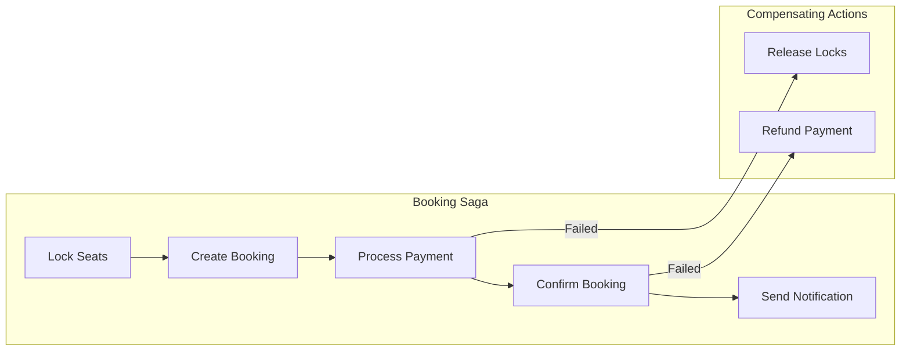

---

## Interview Talking Points

### Q: How do you prevent double booking of seats?

1. **Two-Phase Locking**: Redis lock → Database update
2. **Optimistic Locking**: Version column in database
3. **Atomic Operations**: Redis SETNX, PostgreSQL SELECT FOR UPDATE
4. **Lock TTL**: Auto-release after timeout (10 minutes)
5. **Idempotency Keys**: Prevent duplicate submissions

### Q: How do you handle high traffic for popular movie releases?

1. **Rate Limiting**: Token bucket per user
2. **Queue System**: Fair ordering for high-demand shows
3. **Auto-scaling**: Kubernetes HPA based on traffic
4. **CDN Caching**: Static content served from edge
5. **Database Read Replicas**: Separate read/write traffic
6. **Graceful Degradation**: Disable non-essential features

### Q: How do you ensure seat availability is accurate?

1. **Redis as Source of Truth**: For active locks (fastest reads)
2. **Database as Backup**: PostgreSQL for confirmed bookings
3. **Cache Invalidation**: On every seat status change
4. **Periodic Sync**: Background job to reconcile Redis ↔ DB
5. **Lock Cleanup**: Cron job to release expired locks

### Q: How do you handle payment failures?

1. **Retry Mechanism**: Exponential backoff for transient failures
2. **Webhook Verification**: Confirm with payment gateway
3. **Idempotency**: Prevent duplicate charges
4. **Lock Extension**: Extend seat lock during payment retry
5. **Graceful Timeout**: Release seats after max wait time
6. **User Notification**: Real-time status via WebSocket

### Q: Design the seat selection UI data flow

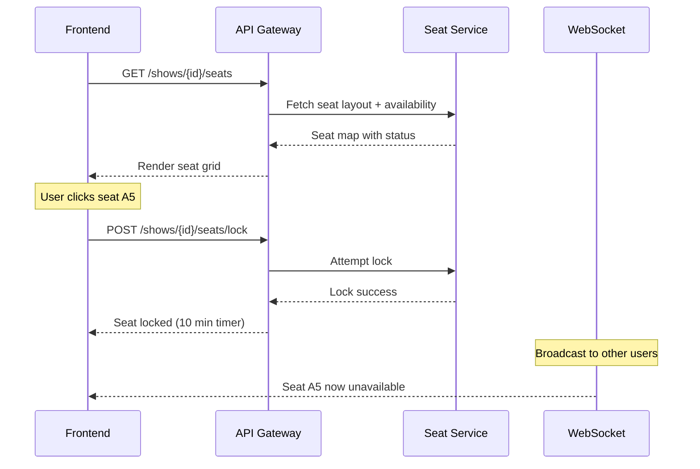

---

## Comparison: BookMyShow vs Ticketmaster

| Aspect | BookMyShow | Ticketmaster |
|--------|-----------|--------------|
| **Primary Market** | India | Global (US focus) |
| **Categories** | Movies + Events | Events focus |
| **Scale** | 50M MAU | 500M tickets/year |
| **Unique Feature** | Convenience fee model | Dynamic pricing |
| **Technology** | AWS-based | Hybrid cloud |
| **Payment** | UPI, Cards, Wallets | Cards, PayPal |

---

## System Design Diagram (Complete)

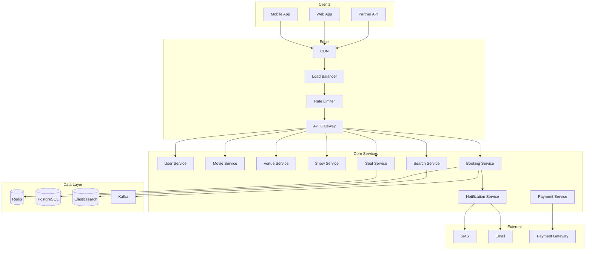

---

## Quick Revision Checklist

- [ ] **Scale**: 50M+ MAU, 10K+ TPS during peak
- [ ] **Core Problem**: Seat concurrency (double booking prevention)
- [ ] **Locking**: Redis distributed lock with TTL (10 min)
- [ ] **Two-Phase**: Lock seats → Payment → Confirm booking
- [ ] **Seat States**: Available → Locked → Booked/Released
- [ ] **Databases**: PostgreSQL (transactions), Redis (locks/cache), Elasticsearch (search)
- [ ] **Patterns**: Distributed Locking, Saga, Circuit Breaker, Event Sourcing
- [ ] **Flash Sales**: Queue-based fair ordering
- [ ] **Payment**: Idempotency keys, webhook verification, retry mechanism
- [ ] **Notifications**: SMS + Email + Push for booking confirmation

---

## References

### Engineering Resources
- [BookMyShow Engineering Blog](https://tech.bookmyshow.com/)
- [Ticketmaster Tech Blog](https://tech.ticketmaster.com/)
- [Redis Distributed Locks (Redlock)](https://redis.io/topics/distlock)

### System Design Books
- [Designing Data-Intensive Applications](https://dataintensive.net/)
- [System Design Interview - Alex Xu](https://www.amazon.com/System-Design-Interview-insiders-guide/dp/B08CMF2CQF)

### Related Patterns
- [Distributed Locks with Redis](https://redis.io/topics/distlock)
- [Saga Pattern](https://docs.microsoft.com/en-us/azure/architecture/reference-architectures/saga/saga)
- [Circuit Breaker Pattern](https://docs.microsoft.com/en-us/azure/architecture/patterns/circuit-breaker)
