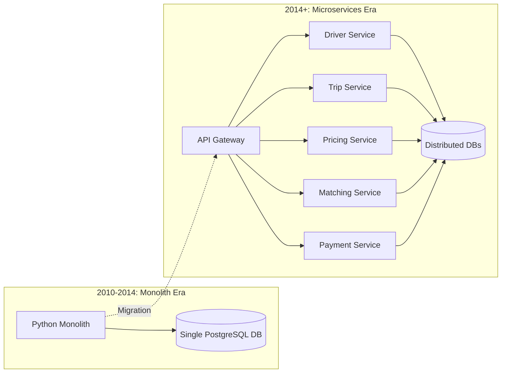
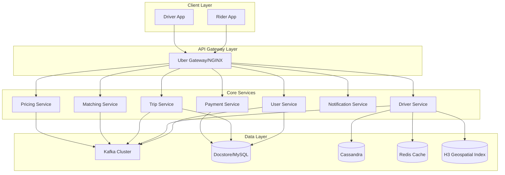
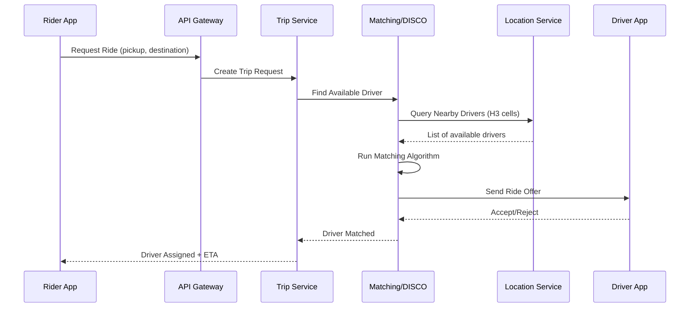
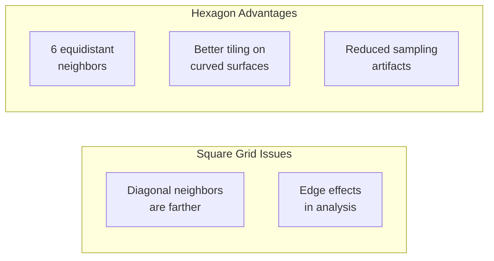
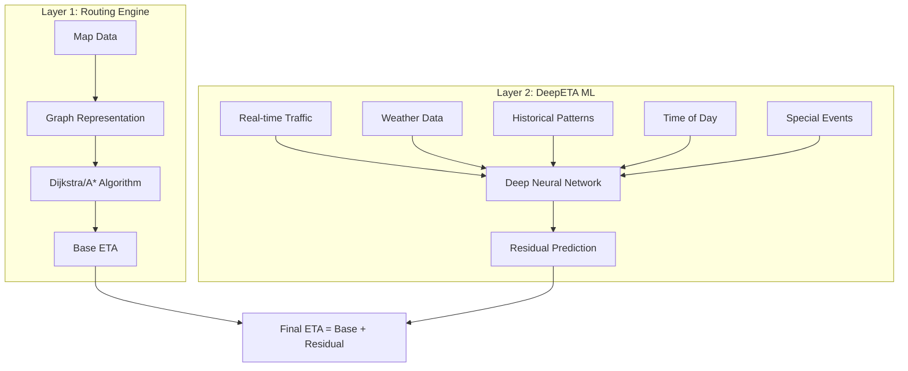
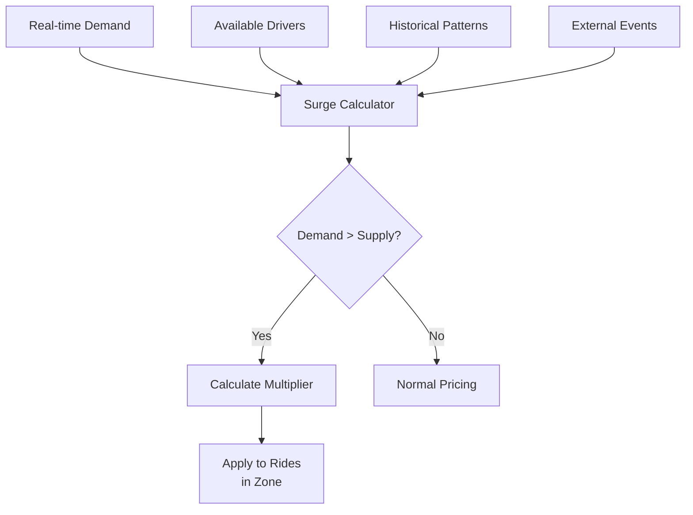
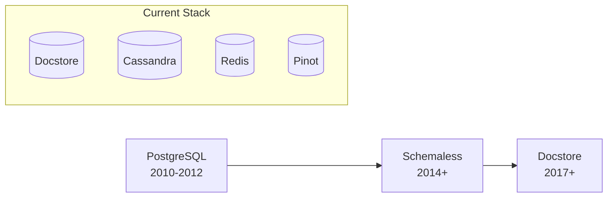
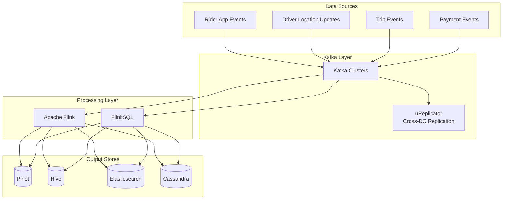
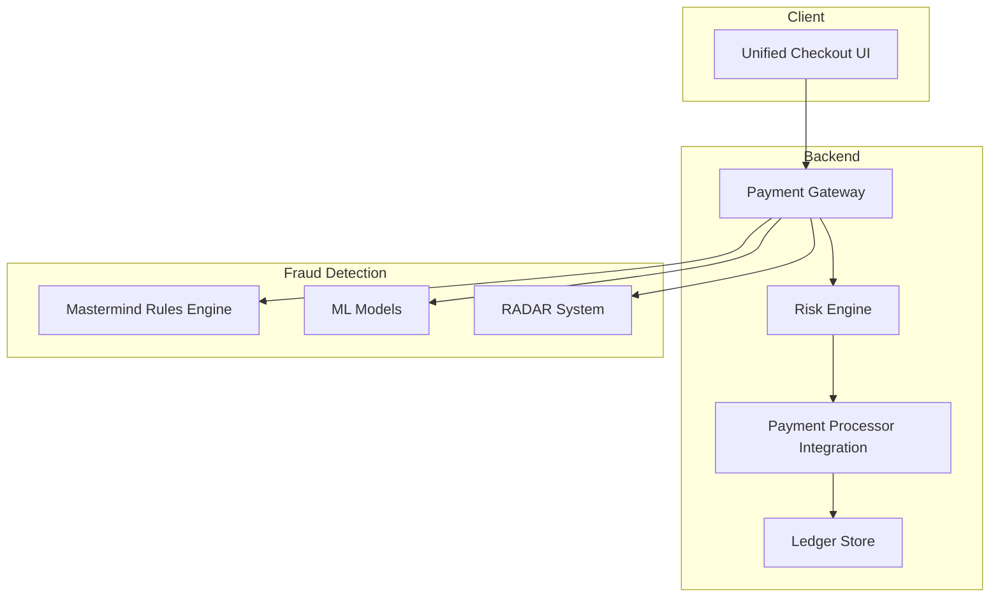
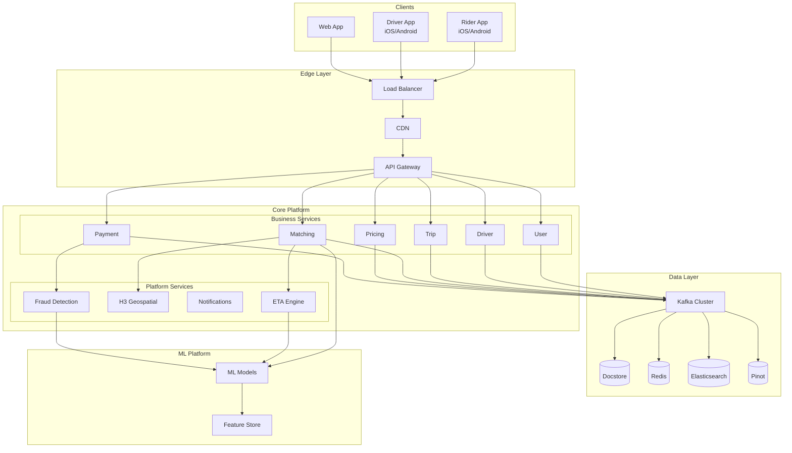

# Uber System Design - Complete Architecture Guide

> A comprehensive deep-dive into Uber's system architecture, covering core services, dispatch system, real-time matching, geospatial indexing, data infrastructure, and scalability patterns.

---

## Table of Contents

1. [Overview](#overview)
2. [Architecture Evolution](#architecture-evolution)
3. [Core System Components](#core-system-components)
4. [Dispatch System (DISCO)](#dispatch-system-disco)
5. [Geospatial Indexing - H3](#geospatial-indexing---h3)
6. [ETA Estimation Engine](#eta-estimation-engine)
7. [Surge Pricing System](#surge-pricing-system)
8. [Data Infrastructure](#data-infrastructure)
9. [Event Streaming with Kafka](#event-streaming-with-kafka)
10. [Payments & Fraud Detection](#payments--fraud-detection)
11. [Technology Stack](#technology-stack)
12. [High-Level Architecture Diagram](#high-level-architecture-diagram)
13. [Key Design Patterns](#key-design-patterns)
14. [References](#references)

---

## Overview

Uber operates in **10,000+ cities** across **70+ countries**, processing **~138 million messages per second** and handling millions of concurrent rides. The system must achieve:

| Requirement | Target |
|------------|--------|
| Latency | Milliseconds for GPS updates, matching, notifications |
| Availability | 99.99%+ uptime with active-active multi-region deployment |
| Scale | Millions of concurrent users worldwide |
| Accuracy | Precise ETA, real-time location tracking, accurate pricing |

---

## Architecture Evolution



### Monolith Phase (2010-2014)
- **Backend**: Python (Flask/Django style)
- **Database**: Single PostgreSQL instance
- **Challenges**: 
  - Scaling issues with growing user base
  - Deployment bottlenecks (single codebase)
  - Team conflicts and merge issues
  - Single point of failure

### Microservices Phase (2014+)
- **Architecture**: Domain-Oriented Microservices (DOMA)
- **Languages**: Go, Java (performance-critical), Python, Node.js
- **Benefits**:
  - Independent scaling per service
  - Faster deployment cycles
  - Team autonomy
  - Fault isolation

---

## Core System Components



### Service Breakdown

| Service | Responsibility |
|---------|---------------|
| **User Service** | User profiles, authentication, preferences |
| **Driver Service** | Driver state, availability, location updates |
| **Trip Service** | Trip lifecycle management (request → complete) |
| **Matching Service (DISCO)** | Rider-driver matching algorithms |
| **Pricing Service** | Fare calculation, surge pricing |
| **Notification Service** | Push notifications, real-time alerts |
| **Payment Service** | Payments, refunds, fraud detection |
| **ETA Service** | Time estimation using DeepETA |

---

## Dispatch System (DISCO)

DISCO (Dispatch Optimization) is Uber's core matching system that connects riders with drivers.

### Matching Workflow



### Matching Algorithm Evolution

| Approach | Description | Issue |
|----------|-------------|-------|
| **Greedy (v1)** | Match closest available driver | Suboptimal for network efficiency |
| **Batched Matching (v2)** | Collect requests in time windows, optimize globally | Reduces wait times across entire network |
| **Bipartite Matching** | Treat riders/drivers as graph nodes, find optimal assignment | Minimizes total wait time |

### Factors Considered in Matching

1. **Driver proximity** (ETA to pickup)
2. **Driver acceptance rate** (historical)
3. **Vehicle type match** (UberX, Black, Pool)
4. **Previous ratings** (won't match if either gave 1-star)
5. **Trip distance** optimization
6. **Driver heading direction**

---

## Geospatial Indexing - H3

H3 is Uber's open-source hexagonal hierarchical geospatial indexing library.

### Why Hexagons?



### H3 Resolution Levels

| Resolution | Average Cell Area | Use Case |
|------------|------------------|----------|
| 0 | ~4.3 million km² | Continental analysis |
| 4 | ~1,770 km² | City-level |
| 7 | ~5.16 km² | Neighborhood-level surge |
| 9 | ~105,000 m² | Block-level matching |
| 11 | ~2,150 m² | Street-level precision |
| 15 | ~0.895 m² | High precision tracking |

### H3 in Uber's Systems

```python
# Example: Finding nearby drivers
import h3

def find_nearby_drivers(rider_lat, rider_lng, radius_km):
    # Convert rider location to H3 index (resolution 9)
    rider_hex = h3.geo_to_h3(rider_lat, rider_lng, resolution=9)
    
    # Get neighboring hexagons
    search_hexes = h3.k_ring(rider_hex, k=2)  # k=2 for ~1km radius
    
    # Query drivers in these hexagons
    drivers = driver_location_db.query(hex_ids=search_hexes)
    return drivers
```

**Benefits for Uber:**
- Fast nearest-driver queries (O(1) with hash lookup)
- Efficient surge zone calculations
- Uniform area cells for demand prediction

---

## ETA Estimation Engine

Uber's ETA system combines a routing engine with machine learning (DeepETA).

### Two-Layer Architecture



### ETA Types Throughout Trip

| ETA Type | When Calculated |
|----------|----------------|
| **Eyeball ETA** | Initial estimate shown to rider |
| **Dispatch ETA** | Refined when matching algorithm runs |
| **Pickup ETA** | After driver accepts, en route to pickup |
| **On-trip ETA** | Continuously updated during ride |

### DeepETA Model Features

- **Encoder-Decoder Architecture** with self-attention
- **Inputs**: Route segments, real-time traffic, weather, time features
- **Output**: Time adjustment (residual) to routing engine estimate
- **Training**: Continuously retrained on actual trip data

---

## Surge Pricing System

Dynamic pricing that balances supply (drivers) and demand (riders).

### How Surge Works



### Surge Factors

| Factor | Impact |
|--------|--------|
| **Time of day** | Rush hours = higher demand |
| **Location** | Airports, stadiums, downtown |
| **Weather** | Rain increases demand |
| **Events** | Concerts, sports games |
| **Real-time supply** | Driver availability |
| **Historical data** | Predicted demand patterns |

### Implementation Details

- **Geographic Zones**: City divided into H3 hexagons
- **Update Frequency**: Every ~5 minutes
- **Multiplier Display**: Shown upfront before booking
- **Smoothing**: Gradual increases/decreases to avoid price shocks

---

## Data Infrastructure

### Database Evolution



### Schemaless Design

Uber's custom NoSQL storage built on MySQL:

| Component | Description |
|-----------|-------------|
| **Cell** | Immutable JSON blob (basic unit) |
| **Row Key** | UUID identifying the entity |
| **Column Name** | String categorizing the data |
| **Reference Key** | Integer for versioning |

```
Cell = {row_key, column_name, ref_key} → JSON blob
```

### Current Data Stack

| Store | Use Case | Technology |
|-------|----------|------------|
| **Docstore** | Transactional data (trips, users) | MySQL-based |
| **Cassandra** | High-write locations, completed trips | NoSQL |
| **Redis** | Session cache, real-time driver locations | In-memory |
| **Pinot** | Real-time analytics, OLAP | Column store |
| **HDFS/Hive** | Historical analytics, data warehouse | Hadoop |
| **Elasticsearch** | Search, logging | Full-text search |

---

## Event Streaming with Kafka

Uber operates one of the world's largest Kafka deployments.

### Scale (2024 Numbers)

| Metric | Value |
|--------|-------|
| Messages/second | ~138 million |
| Data throughput | ~89 GB/s |
| Topic count | Thousands |
| Consumer services | 300+ microservices |

### Kappa+ Architecture



### Key Streaming Use Cases

1. **Real-time matching**: Location updates → Driver availability
2. **Surge pricing**: Demand signals → Price adjustments
3. **Fraud detection**: Transaction events → ML models
4. **Analytics**: All events → Real-time dashboards
5. **Notifications**: Trip updates → Push to apps

### Custom Kafka Tools

- **uReplicator**: Cross-datacenter Kafka replication
- **Consumer Proxy**: Handles async message delivery to 300+ services
- **Tiered Storage**: Offloads old data to cloud storage

---

## Payments & Fraud Detection

### Payment Architecture



### Fraud Detection Systems

| System | Function |
|--------|----------|
| **RADAR Detect** | AI-powered anomaly detection monitoring countries, cities, payment methods |
| **RADAR Protect** | Pattern mining to generate fraud prevention rules |
| **Mastermind** | Rules engine that evaluates fraud likelihood in real-time |

### Fraud Types Detected

- Credit card fraud
- GPS spoofing (fake rides)
- Promotion abuse
- Driver-rider collusion
- Account takeover

### Security Measures

1. **Penny drop verification**: Confirm cardholder with small auth amounts
2. **Early warning signals**: TC40 data for early chargeback detection
3. **Immutable ledger**: Append-only financial records
4. **End-to-end encryption**
5. **Multi-factor authentication**
6. **GDPR/CCPA compliance**

---

## Technology Stack

### Backend Languages

| Language | Use Case |
|----------|----------|
| **Go** | High-performance services (dispatch, geolocation) |
| **Java** | Business logic services, data processing |
| **Python** | ML models, data science |
| **Node.js** | API services, real-time features |

### Frontend Technologies

| Platform | Technology |
|----------|------------|
| **Web** | Fusion.js (React framework) |
| **iOS** | Swift with RIBs architecture |
| **Android** | Java/Kotlin with RIBs architecture |
| **Visualization** | vis.gl for maps |

### Infrastructure

| Component | Technology |
|-----------|------------|
| **Service Mesh** | Uber Gateway (NGINX-based) |
| **RPC** | gRPC, Apache Thrift |
| **API Gateway** | RTAPI, Edge Gateway |
| **CI/CD** | Netflix Spinnaker |
| **Observability** | M3 (metrics), Jaeger (tracing), uMonitor |
| **Load Balancing** | Custom LB with adaptive algorithms |

---

## High-Level Architecture Diagram



---

## Key Design Patterns

### 1. Event-Driven Architecture
Every action generates events → Kafka → Consumers
- Decoupled services
- Replay capability
- Real-time processing

### 2. Domain-Oriented Microservices (DOMA)
- Services grouped by business domains
- Clear ownership boundaries
- Reduced complexity and sprawl

### 3. Active-Active Multi-Region
- No single point of failure
- Automatic failover between data centers
- Request rerouting on failures

### 4. Circuit Breaker Pattern
```
Normal → Failure threshold reached → Open circuit → Health check → Half-open → Success → Closed
```

### 5. Bulkhead Pattern
- Isolate critical resources
- Prevent cascade failures
- Independent scaling per component

### 6. Idempotent Operations
- Safe retries on network failures
- Exactly-once semantics where needed
- Unique request IDs

---

## Interview Talking Points

### Why did Uber migrate from monolith to microservices?

1. **Scalability**: Single DB couldn't handle millions of concurrent users
2. **Deployment velocity**: One codebase meant slow, risky releases
3. **Team autonomy**: 100+ engineers couldn't work on same repo efficiently
4. **Fault isolation**: One bug could bring down entire platform

### How does Uber achieve low latency at scale?

1. **In-memory caching**: Redis for hot data (driver locations)
2. **Geospatial indexing**: H3 for O(1) nearest-driver lookups
3. **Pre-computation**: Routes and ETAs cached where possible
4. **Edge deployment**: Services close to users globally
5. **Optimized protocols**: gRPC + Protobuf vs JSON

### How does Uber ensure reliability?

1. **Multi-region active-active**: No single DC dependency
2. **Circuit breakers**: Prevent cascade failures
3. **Timeouts + retries**: Handle transient failures
4. **Graceful degradation**: Core functions work when non-critical fails
5. **Chaos engineering**: Regular failure testing

### How does Uber handle surge pricing fairly?

1. **Transparent upfront**: Show multiplier before booking
2. **Zone-based**: Only affects high-demand areas
3. **Time-limited**: Resolves as supply/demand balance
4. **Predictions**: Uses ML to anticipate (not just react)
5. **Caps**: Maximum multiplier limits in some regions

---

## References

### Official Uber Engineering Blog
- [Uber Engineering](https://www.uber.com/blog/engineering/)
- [Schemaless: Uber's Scalable Datastore](https://www.uber.com/blog/schemaless-part-one/)
- [H3: Uber's Hexagonal Hierarchical Geospatial Indexing System](https://www.uber.com/blog/h3/)
- [DeepETA: How Uber Predicts Arrival Times](https://www.uber.com/blog/deepeta-how-uber-predicts-arrival-times/)
- [DISCO: Uber's Match-Making Algorithm](https://www.uber.com/blog/uber-big-data-platform/)
- [Mastermind: Fraud Detection at Uber](https://www.uber.com/blog/mastermind/)

### Open Source Projects
- [H3 GitHub](https://github.com/uber/h3) - Hexagonal geospatial indexing
- [Jaeger](https://github.com/jaegertracing/jaeger) - Distributed tracing
- [M3](https://github.com/m3db/m3) - Metrics platform

### Architecture Resources
- [Uber's Domain-Oriented Microservices](https://www.uber.com/blog/microservice-architecture/)
- [Building Reliable Reprocessing with Kappa+](https://www.uber.com/blog/kappa-architecture-data-stream-processing/)
- [Real-Time Data Infrastructure at Uber](https://www.uber.com/blog/real-time-data-infrastructure/)
