[🏠 Home](../README.md) | [⬅️ Scalability Patterns](./03-scalability-patterns.md) | [➡️ PostgreSQL Guide](./04-postgresql-guide.md)

# DBMS Fundamentals: Normalization, ACID & Transactions

A comprehensive guide to database management system fundamentals including normalization theory, ACID properties, transaction isolation, concurrency control, and relational algebra—with mathematical foundations and practical examples.

---

## Table of Contents

1. [Relational Model Basics](#1-relational-model-basics)
2. [Normalization](#2-normalization)
3. [ACID Properties](#3-acid-properties)
4. [Transaction Isolation](#4-transaction-isolation)
5. [Concurrency Control](#5-concurrency-control)
6. [Relational Algebra](#6-relational-algebra)
7. [ER Modeling](#7-er-modeling)
8. [Query Optimization Basics](#8-query-optimization-basics)

---

## 1. Relational Model Basics

### Key Terminology

| Term | Definition | Example |
|------|------------|---------|
| **Relation** | A table with rows and columns | `employees` table |
| **Tuple** | A row in a relation | One employee record |
| **Attribute** | A column in a relation | `employee_name` |
| **Domain** | Set of allowed values for an attribute | `age ∈ {1, 2, ..., 150}` |
| **Schema** | Structure definition | `Employee(id, name, dept_id)` |
| **Instance** | Actual data at a point in time | Current rows in table |

### Keys


**Example:**

```
Employee(employee_id, ssn, email, name, department_id)

Super Keys: 
  {employee_id}, {ssn}, {email}, 
  {employee_id, name}, {ssn, email}, ...

Candidate Keys: 
  {employee_id}, {ssn}, {email}  (all minimal)

Primary Key: 
  {employee_id}  (chosen)

Alternate Keys: 
  {ssn}, {email}

Foreign Key: 
  department_id → Department(department_id)
```

### Functional Dependencies

A functional dependency **X → Y** means:
> If two tuples have the same values for X, they must have the same values for Y.

```
Employee(emp_id, name, dept_id, dept_name, manager_id)

Functional Dependencies:
  emp_id → name, dept_id, manager_id   (employee determines their attributes)
  dept_id → dept_name                   (department determines its name)
  dept_id → manager_id                  (each department has one manager)
```

**Armstrong's Axioms** (rules for deriving FDs):

| Rule | Description | Example |
|------|-------------|---------|
| **Reflexivity** | If Y ⊆ X, then X → Y | {A, B} → A |
| **Augmentation** | If X → Y, then XZ → YZ | A → B implies AC → BC |
| **Transitivity** | If X → Y and Y → Z, then X → Z | A → B, B → C implies A → C |

---

## 2. Normalization

Normalization is the process of organizing data to reduce redundancy and improve data integrity.

### Normal Forms Hierarchy


> [!TIP]
> **Practical Target:** Most applications should aim for **3NF or BCNF**. 4NF and 5NF are rarely needed.

---

### First Normal Form (1NF)

**Rule:** All attributes must contain only atomic (indivisible) values. No repeating groups or arrays.

**Before (Not in 1NF):**

| order_id | customer | items |
|----------|----------|-------|
| 1 | John | Laptop, Mouse, Keyboard |
| 2 | Jane | Monitor |

**After (1NF):**

| order_id | customer | item |
|----------|----------|------|
| 1 | John | Laptop |
| 1 | John | Mouse |
| 1 | John | Keyboard |
| 2 | Jane | Monitor |

---

### Second Normal Form (2NF)

**Rule:** Must be in 1NF + No partial dependencies (non-key attributes must depend on the *entire* primary key).

**Problem Example:**

```
OrderItem(order_id, product_id, product_name, quantity, unit_price)
Primary Key: (order_id, product_id)

Dependencies:
  (order_id, product_id) → quantity ✓ Full dependency
  product_id → product_name, unit_price ✗ Partial dependency!
```

**Decomposition to 2NF:**

```sql
-- Table 1: OrderItem (removes partial dependency)
CREATE TABLE order_items (
    order_id INT,
    product_id INT,
    quantity INT,
    PRIMARY KEY (order_id, product_id)
);

-- Table 2: Product (extracted partial dependency)
CREATE TABLE products (
    product_id INT PRIMARY KEY,
    product_name VARCHAR(100),
    unit_price DECIMAL(10,2)
);
```

---

### Third Normal Form (3NF)

**Rule:** Must be in 2NF + No transitive dependencies (non-key attribute depending on another non-key attribute).

**Problem Example:**

```
Employee(emp_id, name, dept_id, dept_name, dept_location)
Primary Key: emp_id

Dependencies:
  emp_id → dept_id ✓
  dept_id → dept_name, dept_location ← Transitive!
  Therefore: emp_id → dept_id → dept_name (transitive)
```

**Decomposition to 3NF:**

```sql
-- Table 1: Employee
CREATE TABLE employees (
    emp_id INT PRIMARY KEY,
    name VARCHAR(100),
    dept_id INT REFERENCES departments(dept_id)
);

-- Table 2: Department (removes transitive dependency)
CREATE TABLE departments (
    dept_id INT PRIMARY KEY,
    dept_name VARCHAR(100),
    dept_location VARCHAR(100)
);
```

**3NF Formal Definition:**

> A relation R is in 3NF if for every functional dependency X → A:
> 1. X is a superkey, OR
> 2. A is part of some candidate key (prime attribute)

---

### Boyce-Codd Normal Form (BCNF)

**Rule:** Must be in 3NF + Every determinant (left side of FD) must be a candidate key.

**BCNF is stricter than 3NF.** The difference appears when a prime attribute depends on a non-key.

**Problem Example:**

```
CourseTeacher(student_id, course, teacher)

Candidate Keys: (student_id, course)
Functional Dependencies:
  (student_id, course) → teacher ✓
  teacher → course ✗ Teacher teaches only one course, but teacher is not a key!
```

**Decomposition to BCNF:**

```sql
-- Table 1: TeacherCourse
CREATE TABLE teacher_courses (
    teacher VARCHAR(100) PRIMARY KEY,
    course VARCHAR(100)
);

-- Table 2: StudentTeacher
CREATE TABLE student_teachers (
    student_id INT,
    teacher VARCHAR(100),
    PRIMARY KEY (student_id, teacher),
    FOREIGN KEY (teacher) REFERENCES teacher_courses(teacher)
);
```

> [!WARNING]
> **BCNF Decomposition May Lose Dependencies!**
> In the example above, we can no longer enforce `(student_id, course) → teacher` directly.
> Choose 3NF if preserving all FDs is critical.

---

### Fourth Normal Form (4NF)

**Rule:** Must be in BCNF + No multi-valued dependencies (MVDs) except those implied by candidate keys.

**Multi-Valued Dependency (MVD):** X →→ Y means for each X value, there's a set of Y values independent of other attributes.

**Problem Example:**

```
EmployeeSkillsHobbies(emp_id, skill, hobby)

Employee E1 has skills {Java, Python} and hobbies {Chess, Music}

emp_id | skill  | hobby
-------|--------|-------
E1     | Java   | Chess
E1     | Java   | Music
E1     | Python | Chess
E1     | Python | Music   ← Cartesian product! Redundancy!

MVDs: emp_id →→ skill, emp_id →→ hobby
```

**Decomposition to 4NF:**

```sql
CREATE TABLE employee_skills (
    emp_id VARCHAR(10),
    skill VARCHAR(50),
    PRIMARY KEY (emp_id, skill)
);

CREATE TABLE employee_hobbies (
    emp_id VARCHAR(10),
    hobby VARCHAR(50),
    PRIMARY KEY (emp_id, hobby)
);
```

---

### Fifth Normal Form (5NF)

**Rule:** Must be in 4NF + No join dependencies (cannot be losslessly decomposed further).

This is rare in practice. A table is in 5NF if every join dependency is implied by candidate keys.

---

### Normalization Summary

| Form | Eliminates | Key Test |
|------|------------|----------|
| **1NF** | Repeating groups, non-atomic values | All values atomic? |
| **2NF** | Partial dependencies | Non-key depends on full PK? |
| **3NF** | Transitive dependencies | Non-key depends only on keys? |
| **BCNF** | Non-key determinants | Every determinant is a candidate key? |
| **4NF** | Multi-valued dependencies | No independent MVDs? |
| **5NF** | Join dependencies | Cannot decompose without loss? |

### When to Denormalize

```
┌─────────────────────────────────────────────────────────────┐
│                  Denormalization Decision                    │
├─────────────────────────────────────────────────────────────┤
│                                                              │
│  Normalize when:                                             │
│  ✓ Data integrity is critical                               │
│  ✓ Write-heavy workload                                     │
│  ✓ Storage cost matters                                      │
│  ✓ OLTP applications                                        │
│                                                              │
│  Denormalize when:                                           │
│  ✓ Read performance is critical                              │
│  ✓ Complex joins hurt performance                            │
│  ✓ Data changes infrequently                                 │
│  ✓ OLAP / Data warehouse use cases                          │
│  ✓ Pre-computed aggregations needed                          │
│                                                              │
└─────────────────────────────────────────────────────────────┘
```

---

## 3. ACID Properties

ACID guarantees reliable transaction processing.


### Atomicity

A transaction is an indivisible unit. Either all operations succeed, or none do.

```sql
BEGIN TRANSACTION;
    UPDATE accounts SET balance = balance - 100 WHERE id = 1;
    UPDATE accounts SET balance = balance + 100 WHERE id = 2;
COMMIT;
-- If any statement fails, both are rolled back
```

**Implementation:** Write-Ahead Logging (WAL)
```
1. Log "BEGIN TRANSACTION"
2. Log "UPDATE accounts SET balance=900 WHERE id=1" (UNDO info)
3. Log "UPDATE accounts SET balance=1100 WHERE id=2" (UNDO info)
4. Log "COMMIT"
5. Apply changes to data files

If crash before step 4: Use UNDO log to rollback
If crash after step 4: Use REDO log to complete
```

### Consistency

Transactions move the database from one valid state to another, maintaining all constraints.

```sql
-- Constraint: balance >= 0
ALTER TABLE accounts ADD CONSTRAINT chk_balance CHECK (balance >= 0);

BEGIN TRANSACTION;
    UPDATE accounts SET balance = balance - 500 WHERE id = 1;
    -- If this makes balance negative, transaction is rejected
COMMIT;
```

### Isolation

Concurrent transactions execute as if they were serial (one after another).

```
Without Isolation:
  T1: Read balance = 100
  T2: Read balance = 100
  T1: balance = 100 - 50 = 50, Write
  T2: balance = 100 - 30 = 70, Write  ← Lost update! Should be 20

With Isolation:
  T1: Read balance = 100, Write 50
  T2: Read balance = 50, Write 20  ← Correct!
```

### Durability

Once committed, data survives system failure.

```
Implementation:
1. Force log to disk before COMMIT returns (WAL)
2. Replicate to multiple disks/nodes
3. Use battery-backed write cache (BBWC)
4. fsync() on critical writes
```

---

## 4. Transaction Isolation

### Isolation Levels & Anomalies

```mermaid
graph TD
    subgraph "Anomalies Prevented by Isolation Levels"
        RU["Read Uncommitted<br/>❌ Dirty Read<br/>❌ Non-Repeatable<br/>❌ Phantom"]
        RC["Read Committed<br/>✓ Dirty Read<br/>❌ Non-Repeatable<br/>❌ Phantom"]
        RR["Repeatable Read<br/>✓ Dirty Read<br/>✓ Non-Repeatable<br/>❌ Phantom (varies)"]
        SR["Serializable<br/>✓ Dirty Read<br/>✓ Non-Repeatable<br/>✓ Phantom"]
    end
    
    RU --> RC --> RR --> SR
```



### Anomaly Examples

#### Dirty Read

Reading uncommitted data that might be rolled back.


#### Non-Repeatable Read

Reading same row twice gives different values.


#### Phantom Read

Re-executing a query returns new rows.


### Isolation Level Comparison

| Level | Dirty Read | Non-Repeatable | Phantom | Use Case |
|-------|------------|----------------|---------|----------|
| **Read Uncommitted** | Possible | Possible | Possible | Approximate counts |
| **Read Committed** | Not Possible | Possible | Possible | Default for most DBs |
| **Repeatable Read** | Not Possible | Not Possible | Possible* | Reports needing consistency |
| **Serializable** | Not Possible | Not Possible | Not Possible | Financial transactions |

*MySQL's InnoDB prevents phantoms at Repeatable Read using gap locks.

### Implementation: MVCC

Most modern databases use **Multi-Version Concurrency Control**:

```
┌─────────────────────────────────────────────────────────────┐
│                    MVCC Mechanism                            │
├─────────────────────────────────────────────────────────────┤
│                                                              │
│  Row Versions:                                               │
│  ┌─────────────────────────────────────────────────────┐   │
│  │ Row: balance                                         │   │
│  │ Version 1: value=100, created_by=TXN_5, deleted_by=8│   │
│  │ Version 2: value=150, created_by=TXN_8, deleted_by=- │   │
│  └─────────────────────────────────────────────────────┘   │
│                                                              │
│  Transaction TXN_7 (started before TXN_8):                  │
│    - Sees Version 1 (100) because TXN_8 not visible        │
│                                                              │
│  Transaction TXN_10:                                        │
│    - Sees Version 2 (150) because TXN_8 committed          │
│                                                              │
│  No locks required for reads! Writers don't block readers!  │
│                                                              │
└─────────────────────────────────────────────────────────────┘
```

---

## 5. Concurrency Control

### Lock-Based Protocol

```mermaid
graph TD
    subgraph "Lock Types"
        S["Shared Lock (S)<br/>For reading<br/>Multiple allowed"]
        X["Exclusive Lock (X)<br/>For writing<br/>Only one allowed"]
    end
    
    subgraph "Lock Compatibility"
        Matrix["S + S = ✓<br/>S + X = ✗<br/>X + X = ✗"]
    end
```



### Two-Phase Locking (2PL)

**Rule:** A transaction must acquire all locks before releasing any.

```
┌─────────────────────────────────────────────────────────────┐
│                  Two-Phase Locking (2PL)                     │
├─────────────────────────────────────────────────────────────┤
│                                                              │
│  Phase 1: GROWING                    Phase 2: SHRINKING     │
│  ┌────────────────────┐              ┌────────────────────┐ │
│  │ Acquire locks      │              │ Release locks      │ │
│  │ Lock(A)           │              │ Unlock(A)          │ │
│  │ Lock(B)           │              │ Unlock(B)          │ │
│  │ Lock(C)           │              │ Unlock(C)          │ │
│  └────────────────────┘              └────────────────────┘ │
│                    ▲                  │                      │
│                    │  LOCK POINT      │                      │
│                    └──────────────────┘                      │
│                                                              │
│  No new locks after any unlock → Guarantees serializability │
│                                                              │
└─────────────────────────────────────────────────────────────┘
```

**Strict 2PL:** Hold all locks until COMMIT/ROLLBACK (prevents cascading aborts).

### Deadlock


**Deadlock Detection:** Wait-For Graph

```sql
-- Find deadlocks in PostgreSQL
SELECT blocked_locks.pid AS blocked_pid,
       blocking_locks.pid AS blocking_pid,
       blocked_activity.query AS blocked_query
FROM pg_locks blocked_locks
JOIN pg_locks blocking_locks 
    ON blocked_locks.locktype = blocking_locks.locktype
    AND blocked_locks.relation = blocking_locks.relation
WHERE NOT blocked_locks.granted;
```

**Deadlock Resolution:**
1. **Timeout:** Abort transaction after waiting too long
2. **Victim Selection:** Kill transaction with least work done
3. **Prevention:** Acquire locks in consistent order

### Optimistic Concurrency Control

```python
# Optimistic locking with version number
def update_account(account_id, new_balance, expected_version):
    result = db.execute("""
        UPDATE accounts 
        SET balance = :new_balance, version = version + 1
        WHERE id = :id AND version = :expected_version
    """, {
        'id': account_id,
        'new_balance': new_balance,
        'expected_version': expected_version
    })
    
    if result.rowcount == 0:
        raise OptimisticLockException("Concurrent modification detected")
```

---

## 6. Relational Algebra

The mathematical foundation of SQL queries.

### Basic Operations

| Operation | Symbol | SQL Equivalent | Description |
|-----------|--------|----------------|-------------|
| **Selection** | σ | WHERE | Filter rows |
| **Projection** | π | SELECT columns | Choose columns |
| **Union** | ∪ | UNION | Combine rows |
| **Difference** | - | EXCEPT | Rows in A not in B |
| **Cartesian Product** | × | CROSS JOIN | All combinations |
| **Rename** | ρ | AS | Rename relation/attributes |

### Selection (σ)

Filter rows based on a condition.

```
σ(age > 30)(Employees)

SQL: SELECT * FROM Employees WHERE age > 30
```

### Projection (π)

Select specific columns.

```
π(name, salary)(Employees)

SQL: SELECT name, salary FROM Employees
```

### Join Operations

```mermaid
graph TD
    subgraph "Join Types"
        CJ["Cartesian Product (×)<br/>All combinations"]
        NJ["Natural Join (⋈)<br/>Match on common columns"]
        TJ["Theta Join (⋈θ)<br/>Join with condition"]
        LO["Left Outer Join (⟕)<br/>All from left + matches"]
        RO["Right Outer Join (⟖)<br/>All from right + matches"]
        FO["Full Outer Join (⟗)<br/>All from both + matches"]
    end
```



**Natural Join (⋈):**

```
Employees ⋈ Departments

Matches rows where common columns (dept_id) are equal.
SQL: SELECT * FROM Employees NATURAL JOIN Departments
```

**Theta Join (⋈θ):**

```
Employees ⋈(E.dept_id = D.id) Departments

SQL: SELECT * FROM Employees E 
     JOIN Departments D ON E.dept_id = D.id
```

### Query Translation Example

```
Find names of employees in the "Sales" department earning > 50000

Relational Algebra:
π(name)(σ(dept_name = "Sales" ∧ salary > 50000)(Employees ⋈ Departments))

SQL:
SELECT e.name
FROM Employees e
JOIN Departments d ON e.dept_id = d.id
WHERE d.dept_name = 'Sales' AND e.salary > 50000
```

### Query Tree

```
            π(name)
               │
           σ(salary > 50000)
               │
           σ(dept_name = "Sales")
               │
              ⋈
             / \
      Employees Departments
```

**Optimization:** Push selections down (filter early), project early to reduce data.

---

## 7. ER Modeling

Entity-Relationship diagrams model database structure.

### Basic Components


### Relationship Cardinalities

| Notation | Meaning | Example |
|----------|---------|---------|
| `||--||` | One-to-One | Person ↔ Passport |
| `||--o{` | One-to-Many | Customer → Orders |
| `}o--o{` | Many-to-Many | Students ↔ Courses |

### Mapping ER to Relations

**1. Strong Entity → Table**
```sql
CREATE TABLE Customer (
    customer_id INT PRIMARY KEY,
    name VARCHAR(100),
    email VARCHAR(255)
);
```

**2. Weak Entity → Table with FK**
```sql
-- Weak entity: OrderItem depends on Order
CREATE TABLE OrderItem (
    order_id INT,
    line_number INT,
    product_id INT,
    PRIMARY KEY (order_id, line_number),
    FOREIGN KEY (order_id) REFERENCES Order(order_id)
);
```

**3. One-to-Many → FK on "Many" side**
```sql
CREATE TABLE Order (
    order_id INT PRIMARY KEY,
    customer_id INT REFERENCES Customer(customer_id)
);
```

**4. Many-to-Many → Junction Table**
```sql
CREATE TABLE StudentCourse (
    student_id INT REFERENCES Student(student_id),
    course_id INT REFERENCES Course(course_id),
    enrollment_date DATE,
    PRIMARY KEY (student_id, course_id)
);
```

---

## 8. Query Optimization Basics

### Cost-Based Optimization

```
Query Cost = I/O Cost + CPU Cost

I/O Cost ≈ Number of disk pages accessed
CPU Cost ≈ Number of tuples processed

Example:
  Table: 10,000 pages, 1,000,000 rows
  
  Full Scan:
    I/O = 10,000 page reads
    
  Index Scan (1% selectivity):
    Index I/O = log₂(1,000,000) ≈ 20 pages
    Data I/O = 10,000 pages (random access)
    
  With clustering (data sorted by index):
    Data I/O = 100 pages (sequential)
```

### Join Algorithms

| Algorithm | Best When | Complexity |
|-----------|-----------|------------|
| **Nested Loop** | Small outer table, indexed inner | O(N × M) worst |
| **Hash Join** | Equality joins, no index | O(N + M) |
| **Sort-Merge** | Both sorted, equality | O(N log N + M log M) |
| **Index Nested Loop** | Inner has index | O(N × log M) |

### Query Optimization Example

```sql
-- Original query
SELECT * FROM orders o
JOIN customers c ON o.customer_id = c.id
WHERE c.country = 'USA' AND o.amount > 100;

-- Optimizer rewrites to push predicates:
SELECT * FROM 
  (SELECT * FROM customers WHERE country = 'USA') c
JOIN 
  (SELECT * FROM orders WHERE amount > 100) o
ON o.customer_id = c.id;
```

---

## Quick Reference

### Normalization Checklist

```
□ 1NF: Only atomic values, no repeating groups
□ 2NF: No partial dependencies (for composite keys)
□ 3NF: No transitive dependencies
□ BCNF: Every determinant is a candidate key
```

### Transaction Isolation Quick Guide

| Need | Use |
|------|-----|
| Approximate analytics | Read Uncommitted |
| Most web applications | Read Committed |
| Read-only reports | Repeatable Read |
| Financial transactions | Serializable |

### Key Formulas

| Concept | Formula |
|---------|---------|
| **Full Scan Cost** | Pages in table |
| **Index Scan Cost** | Height + Selectivity × Pages |
| **Join Output Size** | \|R\| × \|S\| × Selectivity |
| **B-Tree Height** | ⌈log_f(N)⌉ |

---

## Further Reading

- [Database System Concepts](https://www.db-book.com/) - Silberschatz, Korth, Sudarshan
- [Designing Data-Intensive Applications](https://dataintensive.net/) - Martin Kleppmann
- [Use The Index, Luke](https://use-the-index-luke.com/) - Markus Winand
- [CMU Database Course](https://15445.courses.cs.cmu.edu/)

---

[🏠 Home](../README.md) | [⬅️ Scalability Patterns](./03-scalability-patterns.md) | [➡️ PostgreSQL Guide](./04-postgresql-guide.md)
