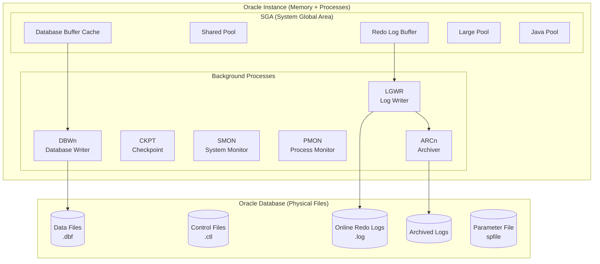
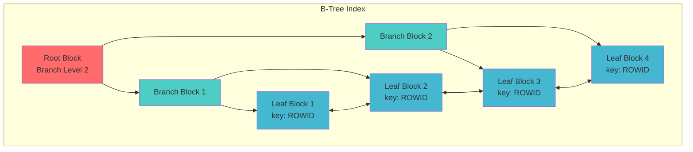
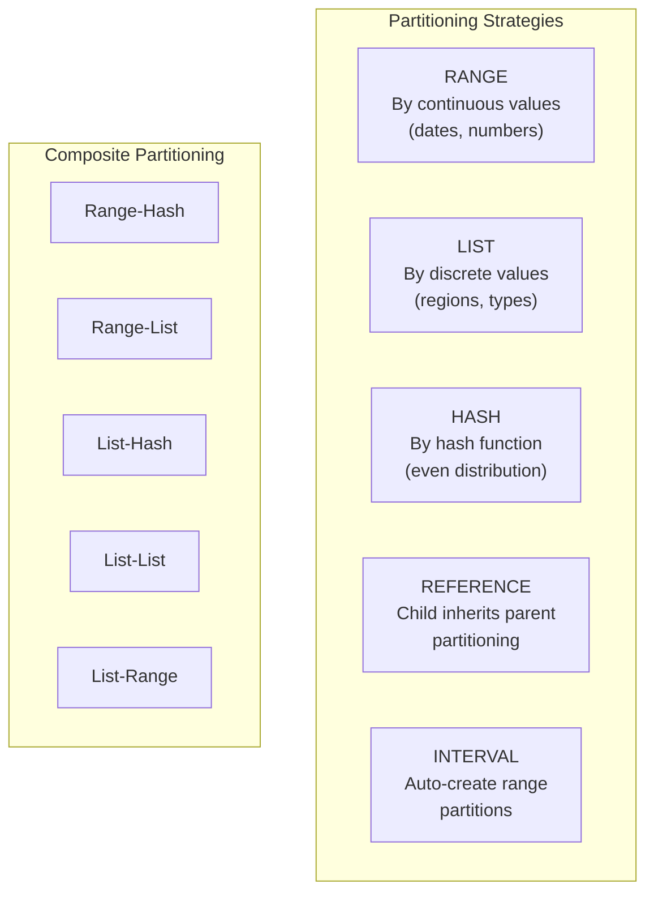
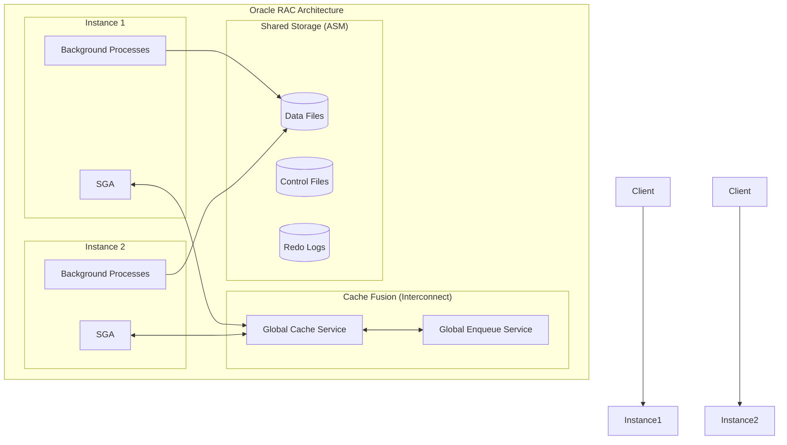
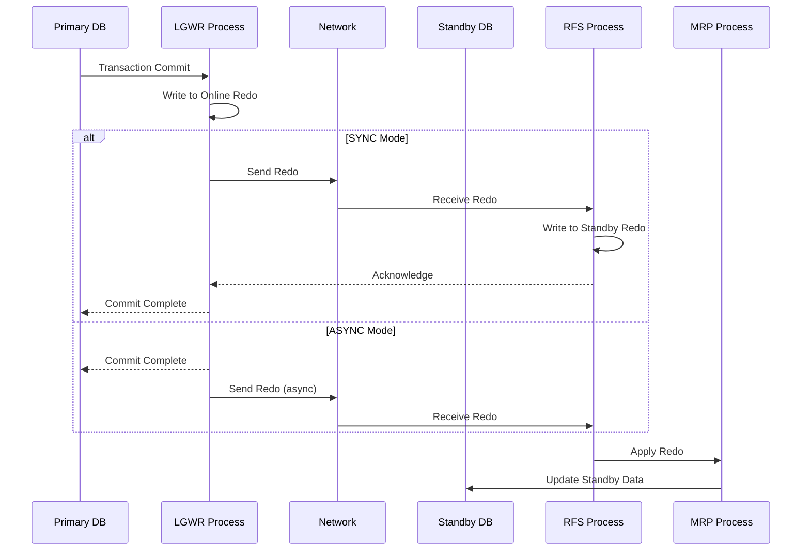

[🏠 Home](../README.md) | [⬅️ MongoDB Guide](./06-mongodb-deep-dive.md) | [➡️ Event-Driven Architecture](./08-event-driven-architecture.md)

# Oracle Database Deep Dive: Indexing, Partitioning & High Availability

A comprehensive guide to Oracle Database internals, indexing strategies, partitioning schemes, RAC architecture, and performance optimization—complete with mathematical foundations and enterprise-grade examples.

---

## Table of Contents

1. [Architecture Overview](#1-architecture-overview)
2. [Memory & Process Architecture](#2-memory--process-architecture)
3. [Indexing Deep Dive](#3-indexing-deep-dive)
4. [Partitioning](#4-partitioning)
5. [High Availability](#5-high-availability)
6. [Performance Optimization](#6-performance-optimization)
7. [Practical Examples](#7-practical-examples)

---

## 1. Architecture Overview

Oracle uses a **multi-process** architecture with shared memory for high performance and scalability.

### Instance vs Database



### Multi-Tenant Architecture (12c+)

```
┌─────────────────────────────────────────────────────────────┐
│                  Container Database (CDB)                    │
├─────────────────────────────────────────────────────────────┤
│                                                              │
│  ┌──────────────────────────────────────────────────────┐  │
│  │                      CDB$ROOT                         │  │
│  │        System metadata, common users                  │  │
│  └──────────────────────────────────────────────────────┘  │
│                                                              │
│  ┌──────────────────────────────────────────────────────┐  │
│  │                      PDB$SEED                         │  │
│  │            Template for new PDBs                      │  │
│  └──────────────────────────────────────────────────────┘  │
│                                                              │
│  ┌────────────────┐  ┌────────────────┐  ┌──────────────┐ │
│  │     PDB1       │  │     PDB2       │  │    PDB3      │ │
│  │  (Production)  │  │    (Dev)       │  │   (Test)     │ │
│  │                │  │                │  │              │ │
│  │  Schemas:      │  │  Schemas:      │  │  Schemas:    │ │
│  │  - HR          │  │  - HR_DEV      │  │  - HR_TEST   │ │
│  │  - SALES       │  │  - SALES_DEV   │  │  - SALES_TST │ │
│  └────────────────┘  └────────────────┘  └──────────────┘ │
│                                                              │
└─────────────────────────────────────────────────────────────┘
```

---

## 2. Memory & Process Architecture

### SGA Components

```
┌─────────────────────────────────────────────────────────────┐
│                 System Global Area (SGA)                     │
├─────────────────────────────────────────────────────────────┤
│                                                              │
│  ┌──────────────────────────────────────────────────────┐  │
│  │              Database Buffer Cache                    │  │
│  │  - Stores data blocks read from disk                 │  │
│  │  - LRU algorithm for block replacement               │  │
│  │  - Size: 20-80% of SGA                               │  │
│  │  ┌─────────┐ ┌─────────┐ ┌─────────┐ ┌─────────┐   │  │
│  │  │ Keep    │ │ Recycle │ │ Default │ │ 2K/16K  │   │  │
│  │  │ Pool    │ │ Pool    │ │ Pool    │ │ Pools   │   │  │
│  │  └─────────┘ └─────────┘ └─────────┘ └─────────┘   │  │
│  └──────────────────────────────────────────────────────┘  │
│                                                              │
│  ┌──────────────────────────────────────────────────────┐  │
│  │                  Shared Pool                          │  │
│  │  ┌─────────────────┐  ┌─────────────────┐           │  │
│  │  │ Library Cache   │  │ Data Dictionary │           │  │
│  │  │ (Parsed SQL)    │  │ Cache           │           │  │
│  │  └─────────────────┘  └─────────────────┘           │  │
│  │  ┌─────────────────┐  ┌─────────────────┐           │  │
│  │  │ Result Cache    │  │ Reserved Pool   │           │  │
│  │  └─────────────────┘  └─────────────────┘           │  │
│  └──────────────────────────────────────────────────────┘  │
│                                                              │
│  ┌────────────────┐  ┌──────────────┐  ┌───────────────┐  │
│  │ Redo Log Buffer│  │ Large Pool   │  │ Java Pool     │  │
│  │ (Redo entries) │  │ (RMAN, etc.) │  │ (Java in DB)  │  │
│  └────────────────┘  └──────────────┘  └───────────────┘  │
│                                                              │
└─────────────────────────────────────────────────────────────┘
```

### Memory Formulas

**Buffer Cache Hit Ratio:**
```sql
SELECT 
    1 - (physical_reads / (consistent_gets + db_block_gets)) AS hit_ratio
FROM v$buffer_pool_statistics;

-- Target: > 95% for OLTP, > 80% for DSS
```

**Library Cache Hit Ratio:**
```sql
SELECT 
    1 - (reloads / pins) AS hit_ratio
FROM v$librarycache
WHERE namespace = 'SQL AREA';

-- Target: > 99%
```

### Background Processes

| Process | Description | Key Actions |
|---------|-------------|-------------|
| **DBWn** | Database Writer | Writes dirty buffers to data files |
| **LGWR** | Log Writer | Writes redo log buffer to redo logs |
| **CKPT** | Checkpoint | Updates data file headers, triggers DBWn |
| **SMON** | System Monitor | Instance recovery, coalescing free space |
| **PMON** | Process Monitor | Cleans up failed user processes |
| **ARCn** | Archiver | Copies redo logs to archive destination |
| **MMON** | Manageability Monitor | AWR snapshots, alerts |
| **MMAN** | Memory Manager | Automatic memory management |

---

## 3. Indexing Deep Dive

### 3.1 B-Tree Index (Default)

Oracle's default index structure, optimal for high-cardinality columns.

**B-Tree Structure in Oracle:**



**Index Height Calculation:**

```
Block Size = 8KB (typical)
Index Entry = Key + ROWID + overhead ≈ 15 bytes (for NUMBER(10))
Entries per Block ≈ 8000 / 15 ≈ 530

Height h = ⌈log₅₃₀(N)⌉ + 1

For N = 100,000,000 rows:
h = ⌈log₅₃₀(100,000,000)⌉ + 1
h = ⌈8/2.7⌉ + 1 = 4 levels
```

**Index Size Estimation:**

```sql
-- Estimate index size before creation
SELECT 
    ROUND(
        (num_rows * (avg_col_len + 10)) / 
        (block_size * 0.7) 
    ) * block_size / 1024 / 1024 AS estimated_size_mb
FROM (
    SELECT 
        t.num_rows,
        c.avg_col_len,
        (SELECT value FROM v$parameter WHERE name = 'db_block_size') AS block_size
    FROM user_tables t
    JOIN user_tab_columns c ON t.table_name = c.table_name
    WHERE t.table_name = 'ORDERS' AND c.column_name = 'CUSTOMER_ID'
);
```

### 3.2 Bitmap Index

Optimal for low-cardinality columns in data warehouses.

```
┌─────────────────────────────────────────────────────────────┐
│                    Bitmap Index Structure                    │
├─────────────────────────────────────────────────────────────┤
│                                                              │
│  Column: STATUS (values: 'NEW', 'PROCESSING', 'COMPLETE')   │
│                                                              │
│  Key Value    Bitmap (each bit = one row)                   │
│  ─────────    ────────────────────────────                  │
│  'NEW'        1 0 0 1 0 0 0 1 0 0 1 0 ...                  │
│  'PROCESSING' 0 1 0 0 1 0 0 0 1 0 0 0 ...                  │
│  'COMPLETE'   0 0 1 0 0 1 1 0 0 1 0 1 ...                  │
│                                                              │
│  Bitmap Operations:                                          │
│  - STATUS = 'NEW' AND region = 'EAST'                       │
│    = NEW_bitmap AND EAST_bitmap (very fast!)                │
│                                                              │
└─────────────────────────────────────────────────────────────┘
```

**Bitmap vs B-Tree:**

| Aspect | B-Tree | Bitmap |
|--------|--------|--------|
| **Cardinality** | High (unique values) | Low (< 1% distinct) |
| **DML Overhead** | Low | High (locks entire bitmap segment) |
| **Storage** | Higher | Much smaller |
| **AND/OR Operations** | Multiple index scans | Single bitmap operation |
| **Use Case** | OLTP | OLAP/Data Warehouse |

```sql
-- Create bitmap index
CREATE BITMAP INDEX idx_status_bm ON orders(status);
CREATE BITMAP INDEX idx_region_bm ON orders(region);

-- Query benefits from bitmap AND/OR operations
SELECT COUNT(*) FROM orders
WHERE status = 'NEW' AND region = 'EAST';
```

> [!WARNING]
> **Never use bitmap indexes in OLTP!**
> DML on any row locks the entire bitmap segment, causing massive contention.

### 3.3 Function-Based Index

```sql
-- Index on expression
CREATE INDEX idx_upper_email ON users(UPPER(email));

-- Query uses the index
SELECT * FROM users WHERE UPPER(email) = 'JOHN@EXAMPLE.COM';

-- Virtual column + index (preferred in 11g+)
ALTER TABLE users ADD (email_upper AS (UPPER(email)));
CREATE INDEX idx_email_upper ON users(email_upper);
```

### 3.4 Composite Index

```sql
CREATE INDEX idx_cust_date ON orders(customer_id, order_date);
```

**Index Skip Scan:**

Oracle can sometimes use an index even when the leading column is not in the query:

```sql
-- Traditional: Won't use idx_cust_date
SELECT * FROM orders WHERE order_date = DATE '2024-01-15';

-- With Index Skip Scan (if customer_id has low cardinality):
-- Oracle scans each distinct customer_id value
-- Useful when leading column has few distinct values
```

### 3.5 Index-Organized Table (IOT)

Table data stored in index structure (like clustered index in SQL Server).

```sql
CREATE TABLE sessions (
    session_id VARCHAR2(100) PRIMARY KEY,
    user_id NUMBER,
    data CLOB,
    created_at TIMESTAMP
)
ORGANIZATION INDEX
OVERFLOW TABLESPACE users_data;

-- Benefits:
-- 1. No separate table storage
-- 2. Range scans on primary key are very fast
-- 3. Reduced storage (no ROWID needed)
```

### 3.6 Invisible Index

Test index without affecting production queries:

```sql
-- Create invisible index
CREATE INDEX idx_test ON orders(customer_id) INVISIBLE;

-- Only specific session uses it
ALTER SESSION SET optimizer_use_invisible_indexes = TRUE;

-- Analyze impact, then make visible
ALTER INDEX idx_test VISIBLE;
```

### Index Selection Guide

```
High Cardinality + OLTP?
  └─ YES → B-Tree Index
  
Low Cardinality + Data Warehouse?
  └─ YES → Bitmap Index
  
Queries use functions on column?
  └─ YES → Function-Based Index
  
Multi-column queries?
  └─ YES → Composite Index (consider column order)
  
Range scans on primary key?
  └─ YES → Consider Index-Organized Table
  
Large table, hierarchical queries?
  └─ YES → Bitmap Join Index
```

---

## 4. Partitioning

Oracle offers the most comprehensive partitioning options of any database.

### Partitioning Types



### 4.1 Range Partitioning

```sql
CREATE TABLE orders (
    order_id    NUMBER PRIMARY KEY,
    customer_id NUMBER NOT NULL,
    order_date  DATE NOT NULL,
    amount      NUMBER(12,2)
)
PARTITION BY RANGE (order_date) (
    PARTITION p_2023_q1 VALUES LESS THAN (DATE '2023-04-01'),
    PARTITION p_2023_q2 VALUES LESS THAN (DATE '2023-07-01'),
    PARTITION p_2023_q3 VALUES LESS THAN (DATE '2023-10-01'),
    PARTITION p_2023_q4 VALUES LESS THAN (DATE '2024-01-01'),
    PARTITION p_2024_q1 VALUES LESS THAN (DATE '2024-04-01'),
    PARTITION p_max VALUES LESS THAN (MAXVALUE)
);
```

### 4.2 Interval Partitioning

Auto-creates partitions as needed:

```sql
CREATE TABLE logs (
    log_id      NUMBER GENERATED ALWAYS AS IDENTITY,
    log_date    TIMESTAMP NOT NULL,
    message     VARCHAR2(4000)
)
PARTITION BY RANGE (log_date)
INTERVAL (NUMTODSINTERVAL(1, 'DAY'))
(
    PARTITION p_initial VALUES LESS THAN (TIMESTAMP '2024-01-01 00:00:00')
);

-- New partitions created automatically when data inserted
INSERT INTO logs (log_date, message) VALUES (SYSDATE + 100, 'Future log');
-- Creates new partition automatically!
```

### 4.3 List Partitioning

```sql
CREATE TABLE customers (
    customer_id NUMBER PRIMARY KEY,
    name        VARCHAR2(100),
    region      VARCHAR2(20)
)
PARTITION BY LIST (region) (
    PARTITION p_north VALUES ('Delhi', 'Punjab', 'Haryana'),
    PARTITION p_south VALUES ('Karnataka', 'TamilNadu', 'Kerala'),
    PARTITION p_east VALUES ('WestBengal', 'Odisha', 'Bihar'),
    PARTITION p_west VALUES ('Maharashtra', 'Gujarat', 'Rajasthan'),
    PARTITION p_default VALUES (DEFAULT)
);
```

### 4.4 Hash Partitioning

```sql
CREATE TABLE transactions (
    txn_id      NUMBER PRIMARY KEY,
    account_id  NUMBER NOT NULL,
    amount      NUMBER(12,2),
    txn_date    DATE
)
PARTITION BY HASH (account_id)
PARTITIONS 16;

-- Oracle uses: ORA_HASH(account_id, partition_count - 1)
```

### 4.5 Composite Partitioning

```sql
-- Range-List: Time-based ranges, region-based sublists
CREATE TABLE sales (
    sale_id     NUMBER,
    sale_date   DATE,
    region      VARCHAR2(20),
    amount      NUMBER
)
PARTITION BY RANGE (sale_date)
SUBPARTITION BY LIST (region)
SUBPARTITION TEMPLATE (
    SUBPARTITION sp_north VALUES ('North'),
    SUBPARTITION sp_south VALUES ('South'),
    SUBPARTITION sp_east VALUES ('East'),
    SUBPARTITION sp_west VALUES ('West')
)
(
    PARTITION p_2024_q1 VALUES LESS THAN (DATE '2024-04-01'),
    PARTITION p_2024_q2 VALUES LESS THAN (DATE '2024-07-01'),
    PARTITION p_2024_q3 VALUES LESS THAN (DATE '2024-10-01'),
    PARTITION p_2024_q4 VALUES LESS THAN (DATE '2025-01-01')
);
-- Creates 4 partitions × 4 subpartitions = 16 subpartitions
```

### 4.6 Reference Partitioning

Child table inherits parent's partitioning scheme:

```sql
-- Parent table
CREATE TABLE orders (
    order_id    NUMBER PRIMARY KEY,
    order_date  DATE NOT NULL
)
PARTITION BY RANGE (order_date) (
    PARTITION p_2024_q1 VALUES LESS THAN (DATE '2024-04-01'),
    PARTITION p_2024_q2 VALUES LESS THAN (DATE '2024-07-01')
);

-- Child table (reference partitioned)
CREATE TABLE order_items (
    item_id     NUMBER PRIMARY KEY,
    order_id    NUMBER NOT NULL,
    product_id  NUMBER,
    quantity    NUMBER,
    CONSTRAINT fk_order FOREIGN KEY (order_id) REFERENCES orders(order_id)
)
PARTITION BY REFERENCE (fk_order);

-- order_items automatically partitioned same as orders!
```

### Partition Pruning

```sql
-- Verify partition pruning in execution plan
EXPLAIN PLAN FOR
SELECT * FROM orders WHERE order_date BETWEEN DATE '2024-01-01' AND DATE '2024-03-31';

SELECT * FROM TABLE(DBMS_XPLAN.DISPLAY);

-- Look for: "Pstart" and "Pstop" showing specific partitions
-- E.g., "Pstart=3 Pstop=3" means only partition 3 accessed
```

### Partition Maintenance

```sql
-- Add new partition
ALTER TABLE orders ADD PARTITION p_2025_q1 
    VALUES LESS THAN (DATE '2025-04-01');

-- Split partition
ALTER TABLE orders SPLIT PARTITION p_max AT (DATE '2025-07-01')
    INTO (PARTITION p_2025_q2, PARTITION p_max);

-- Merge partitions
ALTER TABLE orders MERGE PARTITIONS p_2023_q1, p_2023_q2
    INTO PARTITION p_2023_h1;

-- Drop partition (fast deletion)
ALTER TABLE orders DROP PARTITION p_2022_q1;

-- Truncate partition (keep structure)
ALTER TABLE orders TRUNCATE PARTITION p_2022_q2;

-- Exchange partition (swap with non-partitioned table)
ALTER TABLE orders EXCHANGE PARTITION p_2024_q1 
    WITH TABLE orders_2024_q1_stage;
```

---

## 5. High Availability

### 5.1 Oracle RAC (Real Application Clusters)

Multiple instances accessing the same database for scalability and HA.



**Cache Fusion:**

```
┌─────────────────────────────────────────────────────────────┐
│                     Cache Fusion                             │
├─────────────────────────────────────────────────────────────┤
│                                                              │
│  Instance 1 needs Block X                                   │
│                                                              │
│  1. Check local cache → Not found                           │
│  2. Request from GCS (Global Cache Service)                 │
│  3. GCS checks: Block X is in Instance 2's cache            │
│  4. Instance 2 sends Block X via interconnect               │
│  5. Instance 1 receives block → Much faster than disk!      │
│                                                              │
│  Time: ~0.5ms (interconnect) vs ~5ms (disk read)            │
│                                                              │
└─────────────────────────────────────────────────────────────┘
```

### 5.2 Data Guard

Standby database for disaster recovery and read scaling.



**Protection Modes:**

| Mode | Data Loss | Performance | Use Case |
|------|-----------|-------------|----------|
| **Maximum Protection** | Zero | Lower (sync) | Financial systems |
| **Maximum Availability** | Zero (degrade to async if standby fails) | Medium | Enterprise critical |
| **Maximum Performance** | Possible (async) | Highest | Most applications |

```sql
-- Create physical standby (simplified)
-- 1. Primary configuration
ALTER DATABASE FORCE LOGGING;
ALTER SYSTEM SET log_archive_dest_2 = 'SERVICE=standby ASYNC VALID_FOR=(ONLINE_LOGFILES,PRIMARY_ROLE) DB_UNIQUE_NAME=standby';

-- 2. Backup and restore to standby

-- 3. Start managed recovery on standby
ALTER DATABASE RECOVER MANAGED STANDBY DATABASE DISCONNECT;

-- 4. Open standby for read (Active Data Guard)
ALTER DATABASE OPEN READ ONLY;
ALTER DATABASE RECOVER MANAGED STANDBY DATABASE DISCONNECT;
```

### 5.3 GoldenGate

Heterogeneous replication for zero-downtime migrations and real-time data integration.

```
┌─────────────────────────────────────────────────────────────┐
│                   GoldenGate Architecture                    │
├─────────────────────────────────────────────────────────────┤
│                                                              │
│  ┌──────────┐    ┌──────────┐    ┌──────────┐              │
│  │ Source   │    │  Trail   │    │ Target   │              │
│  │ Database │    │  Files   │    │ Database │              │
│  └────┬─────┘    └────┬─────┘    └────┬─────┘              │
│       │               │               │                     │
│       ▼               │               ▼                     │
│  ┌──────────┐         │         ┌──────────┐               │
│  │ Extract  │─────────┼────────►│ Replicat │               │
│  │ (Capture)│         │         │ (Apply)  │               │
│  └──────────┘         │         └──────────┘               │
│                       │                                     │
│  Trail Files: Binary log of changes                         │
│  Supports: Oracle → Oracle, Oracle → MySQL, etc.           │
│                                                              │
└─────────────────────────────────────────────────────────────┘
```

---

## 6. Performance Optimization

### 6.1 Execution Plan Analysis

```sql
-- Generate execution plan
EXPLAIN PLAN FOR
SELECT o.order_id, c.name
FROM orders o
JOIN customers c ON o.customer_id = c.customer_id
WHERE o.order_date > DATE '2024-01-01';

-- View plan
SELECT * FROM TABLE(DBMS_XPLAN.DISPLAY(FORMAT => 'ALL'));
```

**Key Plan Operations:**

| Operation | Description | Efficiency |
|-----------|-------------|------------|
| `TABLE ACCESS FULL` | Full table scan | ❌ Usually bad |
| `INDEX RANGE SCAN` | Scan range of index | ✅ Good |
| `INDEX UNIQUE SCAN` | Single row by unique index | ✅ Best |
| `INDEX FAST FULL SCAN` | Read entire index (no table) | ✅ Good for count |
| `NESTED LOOPS` | Row-by-row join | ✅ Small datasets |
| `HASH JOIN` | Build hash table, probe | ✅ Large datasets |
| `SORT MERGE JOIN` | Sort both, merge | Okay if already sorted |
| `PARTITION RANGE` | Partition pruning | ✅ Shows Pstart/Pstop |

### 6.2 AWR (Automatic Workload Repository)

```sql
-- Generate AWR report (HTML)
@$ORACLE_HOME/rdbms/admin/awrrpt.sql

-- Key sections to analyze:
-- 1. Top 5 Timed Events (wait events)
-- 2. SQL ordered by Elapsed Time
-- 3. SQL ordered by Buffer Gets
-- 4. Instance Efficiency Percentages
```

**Critical AWR Metrics:**

| Metric | Target | Action if Bad |
|--------|--------|---------------|
| Buffer Cache Hit % | > 95% | Increase db_cache_size |
| Library Cache Hit % | > 99% | Increase shared_pool_size or bind variables |
| Soft Parse % | > 99% | Use bind variables, session caching |
| DB Time per SQL | Low variance | Tune high-consuming SQLs |

### 6.3 SQL Tuning

```sql
-- Enable SQL Tuning Advisor
DECLARE
    l_task_id VARCHAR2(100);
BEGIN
    l_task_id := DBMS_SQLTUNE.CREATE_TUNING_TASK(
        sql_id => 'abc123xyz',
        scope => 'COMPREHENSIVE',
        time_limit => 300
    );
    DBMS_SQLTUNE.EXECUTE_TUNING_TASK(l_task_id);
END;
/

-- View recommendations
SELECT DBMS_SQLTUNE.REPORT_TUNING_TASK('task_id') FROM DUAL;

-- Accept SQL Profile recommendation
EXECUTE DBMS_SQLTUNE.ACCEPT_SQL_PROFILE(task_name => 'task_id', replace => TRUE);
```

### 6.4 Optimizer Hints

```sql
-- Force specific execution plan
SELECT /*+ INDEX(o idx_order_date) */ *
FROM orders o
WHERE order_date > SYSDATE - 30;

-- Parallel execution
SELECT /*+ PARALLEL(o, 4) */ COUNT(*)
FROM orders o;

-- Join order
SELECT /*+ LEADING(c o) USE_HASH(o) */ *
FROM customers c, orders o
WHERE c.customer_id = o.customer_id;

-- Partition hint
SELECT /*+ PARTITION(orders p_2024_q1) */ *
FROM orders;
```

> [!CAUTION]
> Use hints sparingly! They can cause problems when data distribution changes.
> Prefer SQL Profiles or SQL Plan Baselines for production.

### 6.5 Resource Management

```sql
-- Create resource consumer group
BEGIN
    DBMS_RESOURCE_MANAGER.CREATE_CONSUMER_GROUP(
        consumer_group => 'BATCH_JOBS',
        comment => 'For nightly batch processing'
    );
END;
/

-- Create resource plan with CPU limits
BEGIN
    DBMS_RESOURCE_MANAGER.CREATE_PLAN(
        plan => 'DAYTIME_PLAN',
        comment => 'Prioritize OLTP'
    );
    
    DBMS_RESOURCE_MANAGER.CREATE_PLAN_DIRECTIVE(
        plan => 'DAYTIME_PLAN',
        group_or_subplan => 'OLTP_USERS',
        mgmt_p1 => 80  -- 80% CPU priority
    );
    
    DBMS_RESOURCE_MANAGER.CREATE_PLAN_DIRECTIVE(
        plan => 'DAYTIME_PLAN',
        group_or_subplan => 'BATCH_JOBS',
        mgmt_p1 => 20  -- 20% CPU priority
    );
END;
/
```

---

## 7. Practical Examples

### 7.1 Financial Trading System

```sql
-- Partitioned by date with local indexes
CREATE TABLE trades (
    trade_id      NUMBER GENERATED BY DEFAULT AS IDENTITY,
    symbol        VARCHAR2(20) NOT NULL,
    trade_time    TIMESTAMP(6) NOT NULL,
    price         NUMBER(18,6),
    quantity      NUMBER,
    trade_type    CHAR(1), -- 'B'uy, 'S'ell
    CONSTRAINT pk_trades PRIMARY KEY (trade_id, trade_time)
)
PARTITION BY RANGE (trade_time)
INTERVAL (NUMTODSINTERVAL(1, 'DAY'))
(
    PARTITION p_initial VALUES LESS THAN (TIMESTAMP '2024-01-01 00:00:00')
)
ENABLE ROW MOVEMENT;

-- Local indexes (one per partition)
CREATE INDEX idx_trades_symbol_time ON trades(symbol, trade_time) LOCAL;
CREATE BITMAP INDEX idx_trades_type ON trades(trade_type) LOCAL;

-- Covering index for common query
CREATE INDEX idx_trades_cover ON trades(symbol, trade_time, price, quantity) LOCAL;

-- Query with partition pruning
SELECT symbol, SUM(quantity * price) AS volume
FROM trades
WHERE trade_time >= SYSTIMESTAMP - INTERVAL '1' HOUR
  AND symbol = 'AAPL'
GROUP BY symbol;
```

### 7.2 Multi-Tenant SaaS

```sql
-- List partitioned by tenant with reference partitioning
CREATE TABLE tenants (
    tenant_id    NUMBER PRIMARY KEY,
    tenant_name  VARCHAR2(100),
    plan_type    VARCHAR2(20)
)
PARTITION BY LIST (tenant_id) (
    PARTITION p_tenant_1 VALUES (1),
    PARTITION p_tenant_2 VALUES (2),
    PARTITION p_tenant_3 VALUES (3),
    PARTITION p_default VALUES (DEFAULT)
);

CREATE TABLE tenant_data (
    data_id     NUMBER GENERATED ALWAYS AS IDENTITY,
    tenant_id   NUMBER NOT NULL,
    data_blob   BLOB,
    created_at  TIMESTAMP DEFAULT SYSTIMESTAMP,
    CONSTRAINT fk_tenant FOREIGN KEY (tenant_id) REFERENCES tenants(tenant_id)
)
PARTITION BY REFERENCE (fk_tenant);

-- Each tenant's data is isolated in its own partition
-- Easy to move tenant to dedicated database later

-- Virtual Private Database (VPD) for row-level security
CREATE OR REPLACE FUNCTION tenant_security_policy(
    p_schema VARCHAR2, p_object VARCHAR2
) RETURN VARCHAR2 IS
BEGIN
    RETURN 'tenant_id = SYS_CONTEXT(''TENANT_CTX'', ''TENANT_ID'')';
END;
/

BEGIN
    DBMS_RLS.ADD_POLICY(
        object_schema => 'APP',
        object_name => 'TENANT_DATA',
        policy_name => 'TENANT_ISOLATION',
        function_schema => 'APP',
        policy_function => 'TENANT_SECURITY_POLICY'
    );
END;
/
```

### 7.3 Data Warehouse Star Schema

```sql
-- Fact table with composite partitioning
CREATE TABLE sales_fact (
    sale_id       NUMBER,
    date_key      NUMBER NOT NULL,
    product_key   NUMBER NOT NULL,
    store_key     NUMBER NOT NULL,
    quantity      NUMBER,
    amount        NUMBER(12,2)
)
PARTITION BY RANGE (date_key)
SUBPARTITION BY HASH (store_key) SUBPARTITIONS 8
(
    PARTITION p_2024_m01 VALUES LESS THAN (20240201),
    PARTITION p_2024_m02 VALUES LESS THAN (20240301),
    -- ... monthly partitions
    PARTITION p_max VALUES LESS THAN (MAXVALUE)
);

-- Bitmap indexes for low-cardinality dimension keys
CREATE BITMAP INDEX idx_sf_product ON sales_fact(product_key) LOCAL;
CREATE BITMAP INDEX idx_sf_store ON sales_fact(store_key) LOCAL;

-- Bitmap join index (pre-compute dimension attributes)
CREATE BITMAP INDEX idx_sf_category ON sales_fact(p.category)
FROM sales_fact sf, products p
WHERE sf.product_key = p.product_key
LOCAL;

-- Dimension tables with star transformation
CREATE TABLE products (
    product_key NUMBER PRIMARY KEY,
    category    VARCHAR2(50),
    brand       VARCHAR2(50),
    name        VARCHAR2(200)
);

-- Enable star transformation
ALTER SESSION SET star_transformation_enabled = TRUE;

-- Query benefits from bitmap star transformation
SELECT 
    p.category,
    s.region,
    SUM(f.amount) AS total_sales
FROM sales_fact f
JOIN products p ON f.product_key = p.product_key
JOIN stores s ON f.store_key = s.store_key
WHERE p.category = 'Electronics'
  AND s.region = 'North'
  AND f.date_key BETWEEN 20240101 AND 20240331
GROUP BY p.category, s.region;
```

---

## Quick Reference

### Key Initialization Parameters

```ini
# Memory
sga_target = 16G                    # Automatic SGA management
pga_aggregate_target = 4G           # PGA for sorts, hashes

# For manual tuning:
db_cache_size = 8G                  # Buffer cache
shared_pool_size = 2G               # SQL and PL/SQL cache

# Redo
log_buffer = 64M                    # Redo log buffer

# Optimizer
optimizer_mode = ALL_ROWS           # Cost-based, throughput
optimizer_index_cost_adj = 30       # Favor indexes (OLTP)

# Parallelism
parallel_degree_policy = AUTO       # Automatic parallelism
parallel_min_time_threshold = 10    # Queries > 10s go parallel
```

### Essential Views

| View | Purpose |
|------|---------|
| `V$SESSION` | Active sessions |
| `V$SQL` | SQL in library cache |
| `V$SQL_PLAN` | Execution plans |
| `V$SYSTEM_EVENT` | Wait events |
| `DBA_INDEXES` | Index metadata |
| `DBA_TAB_PARTITIONS` | Partition info |
| `DBA_HIST_SQLSTAT` | Historical SQL stats (AWR) |

### Performance Formulas

| Metric | Formula |
|--------|---------|
| **Buffer Hit %** | `1 - (physical_reads / (db_block_gets + consistent_gets))` |
| **Library Hit %** | `1 - (reloads / pins)` |
| **Soft Parse %** | `1 - (hard_parses / parse_count)` |
| **Index Height** | `⌈log_entries_per_block(rows)⌉ + 1` |

---

## Further Reading

- [Oracle Database Documentation](https://docs.oracle.com/en/database/)
- [Oracle Performance Tuning Guide](https://docs.oracle.com/en/database/oracle/oracle-database/19/tgdba/)
- [Expert Oracle Database Architecture](https://www.apress.com/gp/book/9781430262985)
- [Oracle RAC Handbook](https://www.oracle.com/technetwork/database/options/clustering/)

---

[🏠 Home](../README.md) | [⬅️ MongoDB Guide](./06-mongodb-deep-dive.md) | [➡️ Event-Driven Architecture](./08-event-driven-architecture.md)
