[🏠 Home](../README.md) | [⬅️ Oracle Guide](./07-oracle-deep-dive.md)

# Event-Driven Architecture Deep Dive

A comprehensive guide to event-driven architecture, event sourcing, CQRS, saga patterns, and message brokers—complete with diagrams, implementation patterns, and practical examples.

---

## Table of Contents

1. [Fundamentals](#1-fundamentals)
2. [Event Sourcing](#2-event-sourcing)
3. [CQRS (Command Query Responsibility Segregation)](#3-cqrs)
4. [Saga Patterns](#4-saga-patterns)
5. [Message Brokers](#5-message-brokers)
6. [Implementation Patterns](#6-implementation-patterns)
7. [Practical Examples](#7-practical-examples)

---

## 1. Fundamentals

### What is Event-Driven Architecture?

Event-Driven Architecture (EDA) is a software design pattern where the flow of the program is determined by events—significant changes in state.


### Core Concepts

| Concept | Description | Example |
|---------|-------------|---------|
| **Event** | Immutable fact about something that happened | `OrderPlaced`, `PaymentReceived` |
| **Event Producer** | Service that emits events | Order Service |
| **Event Consumer** | Service that reacts to events | Notification Service |
| **Event Channel** | Medium for event transport | Kafka topic, RabbitMQ queue |
| **Event Store** | Persistent log of all events | Event database |

### Event Types


### Event Anatomy

```json
{
  "eventId": "550e8400-e29b-41d4-a716-446655440000",
  "eventType": "OrderPlaced",
  "aggregateId": "order-12345",
  "aggregateType": "Order",
  "version": 1,
  "timestamp": "2024-06-20T14:30:00Z",
  "correlationId": "request-abc-123",
  "causationId": "command-xyz-789",
  "metadata": {
    "userId": "user-001",
    "source": "web-app",
    "traceId": "trace-123"
  },
  "payload": {
    "orderId": "order-12345",
    "customerId": "cust-001",
    "items": [
      {"productId": "prod-001", "quantity": 2, "price": 29.99}
    ],
    "totalAmount": 59.98
  }
}
```

---

## 2. Event Sourcing

### Traditional vs Event Sourcing


### Core Principle

> **Current State = f(Initial State, All Events)**

The application state is derived by replaying all events from the beginning.

```python
def rebuild_order_state(events: List[Event]) -> Order:
    """Rebuild order state by replaying all events"""
    order = Order()  # Initial state
    
    for event in events:
        match event.type:
            case "OrderCreated":
                order.id = event.data.order_id
                order.customer_id = event.data.customer_id
                order.status = "created"
                order.items = []
                
            case "ItemAdded":
                order.items.append(Item(
                    product_id=event.data.product_id,
                    quantity=event.data.quantity,
                    price=event.data.price
                ))
                
            case "ItemRemoved":
                order.items = [i for i in order.items 
                              if i.product_id != event.data.product_id]
                
            case "OrderPaid":
                order.status = "paid"
                order.payment_id = event.data.payment_id
                
            case "OrderShipped":
                order.status = "shipped"
                order.tracking_number = event.data.tracking_number
    
    return order
```

### Event Store Design

```
┌─────────────────────────────────────────────────────────────┐
│                      Event Store Schema                      │
├─────────────────────────────────────────────────────────────┤
│                                                              │
│  ┌─────────────────────────────────────────────────────┐   │
│  │                    events table                      │   │
│  ├─────────────────────────────────────────────────────┤   │
│  │ event_id       UUID PRIMARY KEY                     │   │
│  │ aggregate_id   VARCHAR(255) NOT NULL                │   │
│  │ aggregate_type VARCHAR(100) NOT NULL                │   │
│  │ event_type     VARCHAR(100) NOT NULL                │   │
│  │ version        BIGINT NOT NULL                      │   │
│  │ payload        JSONB NOT NULL                       │   │
│  │ metadata       JSONB                                │   │
│  │ created_at     TIMESTAMP NOT NULL                   │   │
│  │                                                     │   │
│  │ UNIQUE (aggregate_id, version)  -- Optimistic lock │   │
│  └─────────────────────────────────────────────────────┘   │
│                                                              │
│  Indexes:                                                    │
│  - (aggregate_id, version) for stream replay                │
│  - (event_type, created_at) for projections                 │
│  - (created_at) for global ordering                         │
│                                                              │
└─────────────────────────────────────────────────────────────┘
```

### Optimistic Concurrency


### Snapshots

For aggregates with many events, snapshots optimize loading:

```
Event Count: 10,000
Without Snapshots: Replay all 10,000 events (~500ms)
With Snapshots:    Load snapshot + replay 50 events (~5ms)

Snapshot Strategy:
- Every N events (e.g., every 100)
- Time-based (daily snapshot)
- On-demand (when loading exceeds threshold)
```

```sql
-- Snapshot table
CREATE TABLE snapshots (
    aggregate_id UUID PRIMARY KEY,
    aggregate_type VARCHAR(100),
    version BIGINT NOT NULL,
    state JSONB NOT NULL,
    created_at TIMESTAMP DEFAULT NOW()
);

-- Load aggregate with snapshot
SELECT * FROM snapshots WHERE aggregate_id = $1;
SELECT * FROM events 
WHERE aggregate_id = $1 
  AND version > (SELECT version FROM snapshots WHERE aggregate_id = $1)
ORDER BY version;
```

### Benefits & Challenges

| Benefits | Challenges |
|----------|------------|
| ✅ Complete audit trail | ❌ Schema evolution complexity |
| ✅ Time-travel debugging | ❌ Storage growth |
| ✅ Rebuild projections anytime | ❌ Eventual consistency |
| ✅ Domain event-driven design | ❌ Learning curve |
| ✅ Easy to add new features | ❌ Migration complexity |

---

## 3. CQRS

### Command Query Responsibility Segregation

CQRS separates the write model (commands) from the read model (queries).


### Write Side (Commands)

```python
# Command
@dataclass
class PlaceOrderCommand:
    customer_id: str
    items: List[OrderItem]
    shipping_address: Address

# Command Handler
class PlaceOrderHandler:
    def __init__(self, event_store: EventStore):
        self.event_store = event_store
    
    def handle(self, cmd: PlaceOrderCommand) -> str:
        # Business logic and validation
        order = Order.create(
            customer_id=cmd.customer_id,
            items=cmd.items,
            shipping_address=cmd.shipping_address
        )
        
        # Persist events
        self.event_store.save(order.uncommitted_events)
        
        return order.id
```

### Read Side (Projections)

```python
# Projection for order summary view
class OrderSummaryProjection:
    def __init__(self, read_db: Database):
        self.read_db = read_db
    
    def handle(self, event: Event):
        match event.type:
            case "OrderPlaced":
                self.read_db.execute("""
                    INSERT INTO order_summaries 
                    (order_id, customer_id, status, total, created_at)
                    VALUES (?, ?, 'pending', ?, ?)
                """, event.order_id, event.customer_id, 
                    event.total, event.timestamp)
            
            case "OrderShipped":
                self.read_db.execute("""
                    UPDATE order_summaries 
                    SET status = 'shipped', 
                        tracking_number = ?,
                        shipped_at = ?
                    WHERE order_id = ?
                """, event.tracking_number, event.timestamp, 
                    event.order_id)
```

### Projection Types


### Eventual Consistency

```
┌─────────────────────────────────────────────────────────────┐
│                  Eventual Consistency Timeline               │
├─────────────────────────────────────────────────────────────┤
│                                                              │
│  T0: Command received                                        │
│      └─→ Write to event store (synchronous)                 │
│                                                              │
│  T1: Event published (~1ms)                                 │
│      └─→ Event on message bus                               │
│                                                              │
│  T2: Projection updated (~10-100ms typical)                 │
│      └─→ Read model now consistent                          │
│                                                              │
│  During T1-T2: Read model is STALE                          │
│                                                              │
│  Strategies:                                                 │
│  1. Accept staleness (most reads)                           │
│  2. Read-your-writes (return event data with command ack)   │
│  3. Polling/WebSocket for updates                           │
│  4. Synchronous projection (critical paths only)            │
│                                                              │
└─────────────────────────────────────────────────────────────┘
```

### CQRS Without Event Sourcing

You can use CQRS without Event Sourcing:


---

## 4. Saga Patterns

### What is a Saga?

A Saga is a sequence of local transactions where each step publishes events that trigger the next step. If any step fails, compensating transactions are executed to rollback.


### Choreography vs Orchestration

#### Choreography (Decentralized)


**Pros:** Simple, loosely coupled, no single point of failure
**Cons:** Hard to track flow, circular dependencies risk

#### Orchestration (Centralized)


**Pros:** Clear flow visibility, easier to maintain
**Cons:** Single point of coordination, tighter coupling to orchestrator

### Saga State Machine


### Implementing Orchestrated Saga

```python
from enum import Enum
from dataclasses import dataclass
from typing import Optional

class SagaState(Enum):
    STARTED = "started"
    INVENTORY_RESERVED = "inventory_reserved"
    PAYMENT_PROCESSED = "payment_processed"
    SHIPPED = "shipped"
    COMPLETED = "completed"
    COMPENSATING = "compensating"
    FAILED = "failed"

@dataclass
class OrderSaga:
    saga_id: str
    order_id: str
    state: SagaState
    compensation_stack: list

class OrderSagaOrchestrator:
    def __init__(self, services: dict):
        self.order_service = services['order']
        self.inventory_service = services['inventory']
        self.payment_service = services['payment']
        self.shipping_service = services['shipping']
        self.saga_store = services['saga_store']
    
    async def execute(self, command: CreateOrderCommand) -> str:
        # Initialize saga
        saga = OrderSaga(
            saga_id=str(uuid4()),
            order_id=None,
            state=SagaState.STARTED,
            compensation_stack=[]
        )
        
        try:
            # Step 1: Create Order
            order = await self.order_service.create(command)
            saga.order_id = order.id
            saga.compensation_stack.append(('order', 'cancel', order.id))
            
            # Step 2: Reserve Inventory
            await self.inventory_service.reserve(order.items)
            saga.state = SagaState.INVENTORY_RESERVED
            saga.compensation_stack.append(('inventory', 'release', order.items))
            
            # Step 3: Process Payment
            payment = await self.payment_service.process(order)
            saga.state = SagaState.PAYMENT_PROCESSED
            saga.compensation_stack.append(('payment', 'refund', payment.id))
            
            # Step 4: Ship
            await self.shipping_service.ship(order)
            saga.state = SagaState.COMPLETED
            
            return saga.saga_id
            
        except Exception as e:
            # Compensation
            saga.state = SagaState.COMPENSATING
            await self._compensate(saga)
            saga.state = SagaState.FAILED
            raise SagaFailedException(saga.saga_id, str(e))
    
    async def _compensate(self, saga: OrderSaga):
        """Execute compensating transactions in reverse order"""
        while saga.compensation_stack:
            service_name, action, data = saga.compensation_stack.pop()
            service = getattr(self, f"{service_name}_service")
            await getattr(service, action)(data)
```

### Saga Patterns Comparison

| Pattern | Coupling | Complexity | Visibility | Best For |
|---------|----------|------------|------------|----------|
| **Choreography** | Low | Lower | Poor | Simple flows, 2-3 steps |
| **Orchestration** | Medium | Higher | Excellent | Complex flows, many steps |
| **Hybrid** | Medium | Medium | Good | Mix of simple/complex |

---

## 5. Message Brokers

### Broker Comparison


### Feature Comparison

| Feature | RabbitMQ | Kafka | Pulsar | SQS |
|---------|----------|-------|--------|-----|
| **Model** | Queue/Exchange | Log/Partition | Topic/Segment | Queue |
| **Ordering** | Per-queue | Per-partition | Per-partition | FIFO option |
| **Retention** | Until consumed | Configurable | Tiered storage | 14 days max |
| **Replay** | No | Yes | Yes | No |
| **Throughput** | ~50K/s | ~1M/s | ~1M/s | ~3K/s |
| **Latency** | Sub-ms | ~5ms | ~5ms | ~20ms |
| **Best For** | Routing, RPC | Streaming, Log | Unified messaging | Serverless |

### Apache Kafka Deep Dive


**Kafka Partitioning:**

```
Message Key → Partition
partition = hash(key) % num_partitions

Benefits:
- Messages with same key always go to same partition
- Ordering guaranteed within partition
- Parallel processing across partitions

Example:
  order_id="order-123" → hash % 3 = 1 → Partition 1
  order_id="order-124" → hash % 3 = 0 → Partition 0
  order_id="order-123" → hash % 3 = 1 → Partition 1 (same!)
```

**Consumer Groups:**

```
┌─────────────────────────────────────────────────────────────┐
│                    Consumer Group Scaling                    │
├─────────────────────────────────────────────────────────────┤
│                                                              │
│  Topic: orders (6 partitions)                               │
│                                                              │
│  Consumer Group A (3 consumers):                             │
│  ┌───────┐ ┌───────┐ ┌───────┐                             │
│  │ C1    │ │ C2    │ │ C3    │                             │
│  │ P0,P1 │ │ P2,P3 │ │ P4,P5 │                             │
│  └───────┘ └───────┘ └───────┘                             │
│                                                              │
│  Consumer Group B (6 consumers):                             │
│  ┌──┐ ┌──┐ ┌──┐ ┌──┐ ┌──┐ ┌──┐                            │
│  │C1│ │C2│ │C3│ │C4│ │C5│ │C6│                            │
│  │P0│ │P1│ │P2│ │P3│ │P4│ │P5│                            │
│  └──┘ └──┘ └──┘ └──┘ └──┘ └──┘                            │
│                                                              │
│  Adding C7 to Group B → C7 will be idle (no partitions)     │
│  Max parallelism = number of partitions                      │
│                                                              │
└─────────────────────────────────────────────────────────────┘
```

### RabbitMQ Deep Dive


**Exchange Types:**

| Type | Routing Logic | Use Case |
|------|---------------|----------|
| **Direct** | Exact key match | Command routing |
| **Topic** | Pattern matching (* /#) | Event filtering |
| **Fanout** | All queues | Broadcasting |
| **Headers** | Header attributes | Complex routing |

---

## 6. Implementation Patterns

### 6.1 Outbox Pattern

Ensures reliable event publishing with database transactions.


```sql
-- Outbox table
CREATE TABLE outbox (
    id UUID PRIMARY KEY DEFAULT gen_random_uuid(),
    aggregate_type VARCHAR(100) NOT NULL,
    aggregate_id VARCHAR(100) NOT NULL,
    event_type VARCHAR(100) NOT NULL,
    payload JSONB NOT NULL,
    created_at TIMESTAMP DEFAULT NOW(),
    published_at TIMESTAMP NULL
);

CREATE INDEX idx_outbox_unpublished ON outbox(created_at) 
WHERE published_at IS NULL;
```

### 6.2 Inbox Pattern

Ensures exactly-once processing of incoming events.


```sql
-- Inbox table for idempotency
CREATE TABLE inbox (
    event_id UUID PRIMARY KEY,
    event_type VARCHAR(100) NOT NULL,
    processed_at TIMESTAMP DEFAULT NOW(),
    handler VARCHAR(100) NOT NULL
);
```

### 6.3 Dead Letter Queue (DLQ)


**Retry Strategy:**

```
Attempt 1: Immediate
Attempt 2: 1 second delay
Attempt 3: 5 seconds delay
Attempt 4: 30 seconds delay
Attempt 5: 2 minutes delay
Attempt 6: Move to DLQ

Total time before DLQ: ~3 minutes
```

### 6.4 Event Versioning

```json
// Version 1
{
  "type": "OrderPlaced",
  "version": 1,
  "payload": {
    "orderId": "123",
    "amount": 99.99
  }
}

// Version 2 (added field)
{
  "type": "OrderPlaced", 
  "version": 2,
  "payload": {
    "orderId": "123",
    "amount": 99.99,
    "currency": "USD"  // New field
  }
}
```

**Schema Evolution Strategies:**

| Strategy | Forward Compatible | Backward Compatible | Notes |
|----------|-------------------|---------------------|-------|
| Add optional field | ✅ | ✅ | Safest approach |
| Remove field | ✅ | ❌ | Old consumers may break |
| Rename field | ❌ | ❌ | Avoid, use alias |
| Change type | ❌ | ❌ | Create new event type |

---

## 7. Practical Examples

### 7.1 E-Commerce Order Flow

```mermaid
graph TD
    subgraph "Order Saga - Happy Path"
        A[Customer places order]
        A --> B[Order Service: OrderCreated]
        B --> C[Inventory Service: StockReserved]
        C --> D[Payment Service: PaymentAuthorized]
        D --> E[Fulfillment Service: ShipmentCreated]
        E --> F[Notification Service: EmailSent]
        F --> G[Order Complete ✓]
    end
    
    subgraph "Compensation Flow"
        PaymentFails[Payment Failed]
        PaymentFails --> RelInv[Release Reserved Stock]
        RelInv --> CancelOrder[Cancel Order]
        CancelOrder --> NotifyFail[Notify Customer]
    end
```



**Order Aggregate (Event Sourced):**

```python
class Order:
    def __init__(self):
        self.id = None
        self.status = None
        self.items = []
        self.total = 0
        self._uncommitted_events = []
    
    # Commands
    def place(self, customer_id: str, items: List[OrderItem]):
        if self.status is not None:
            raise InvalidOperationError("Order already exists")
        
        self._apply(OrderPlaced(
            order_id=str(uuid4()),
            customer_id=customer_id,
            items=[item.__dict__ for item in items],
            total=sum(i.price * i.quantity for i in items),
            timestamp=datetime.utcnow()
        ))
    
    def confirm_payment(self, payment_id: str):
        if self.status != "pending":
            raise InvalidOperationError("Cannot confirm payment")
        
        self._apply(PaymentConfirmed(
            order_id=self.id,
            payment_id=payment_id,
            timestamp=datetime.utcnow()
        ))
    
    def ship(self, tracking_number: str):
        if self.status != "paid":
            raise InvalidOperationError("Order must be paid before shipping")
        
        self._apply(OrderShipped(
            order_id=self.id,
            tracking_number=tracking_number,
            timestamp=datetime.utcnow()
        ))
    
    # Event Handlers
    def _apply(self, event):
        self._uncommitted_events.append(event)
        self._when(event)
    
    def _when(self, event):
        match event:
            case OrderPlaced():
                self.id = event.order_id
                self.status = "pending"
                self.items = event.items
                self.total = event.total
            case PaymentConfirmed():
                self.status = "paid"
            case OrderShipped():
                self.status = "shipped"
```

### 7.2 Stock Trading System


**Event Types:**

```json
// Market data event (high volume)
{
  "type": "PriceUpdate",
  "symbol": "AAPL",
  "price": 178.55,
  "volume": 1000000,
  "timestamp": "2024-06-20T14:30:00.123Z"
}

// Trade event
{
  "type": "TradeExecuted",
  "tradeId": "trade-12345",
  "orderId": "order-67890",
  "symbol": "AAPL",
  "side": "BUY",
  "quantity": 100,
  "price": 178.55,
  "counterpartyId": "firm-abc",
  "executedAt": "2024-06-20T14:30:00.456Z"
}
```

### 7.3 IoT Sensor Platform


**Windowed Aggregation:**

```sql
-- Kafka Streams / Flink SQL
SELECT 
    sensor_id,
    window_start,
    window_end,
    AVG(temperature) as avg_temp,
    MAX(temperature) as max_temp,
    COUNT(*) as reading_count
FROM sensor_readings
GROUP BY 
    sensor_id,
    TUMBLE(event_time, INTERVAL '1' MINUTE);
```

---

## Quick Reference

### Pattern Selection Guide

```
Need guaranteed delivery?
  └─ YES → Outbox Pattern + DLQ
  
Need exactly-once processing?
  └─ YES → Inbox Pattern (idempotency)
  
Need to rebuild state from history?
  └─ YES → Event Sourcing
  
Read/Write models very different?
  └─ YES → CQRS
  
Distributed transaction across services?
  └─ YES → Saga Pattern
  
Simple 2-3 step flow?
  └─ YES → Choreography
  
Complex multi-step flow with compensation?
  └─ YES → Orchestration
```

### Broker Selection Guide

```
Need event replay and time-travel?
  └─ YES → Kafka / Pulsar
  
Need complex routing patterns?
  └─ YES → RabbitMQ
  
Serverless / fully managed?
  └─ YES → SQS / EventBridge / Pub/Sub
  
Ultra-low latency (<1ms)?
  └─ YES → RabbitMQ
  
Very high throughput (1M+ msg/s)?
  └─ YES → Kafka / Pulsar
```

### Key Formulas

| Metric | Formula |
|--------|---------|
| **Event Store Size** | `events × avg_event_size × retention_period` |
| **Kafka Partitions** | `max(throughput/partition_throughput, consumers)` |
| **Consumer Lag** | `latest_offset - current_offset` |
| **Saga Timeout** | `sum(step_timeouts) + compensation_time_buffer` |

---

## Further Reading

- [Designing Data-Intensive Applications](https://dataintensive.net/) - Martin Kleppmann
- [Enterprise Integration Patterns](https://www.enterpriseintegrationpatterns.com/)
- [Event Sourcing Pattern](https://docs.microsoft.com/en-us/azure/architecture/patterns/event-sourcing)
- [CQRS Journey](https://docs.microsoft.com/en-us/previous-versions/msp-n-p/jj554200(v=pandp.10))
- [Kafka: The Definitive Guide](https://www.confluent.io/resources/kafka-the-definitive-guide/)

---

[🏠 Home](../README.md) | [⬅️ Oracle Guide](./07-oracle-deep-dive.md)
