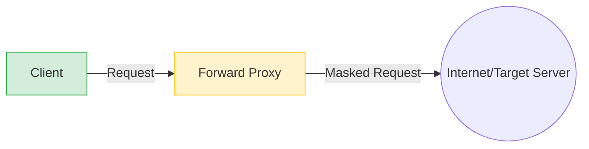
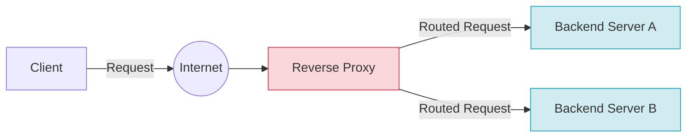
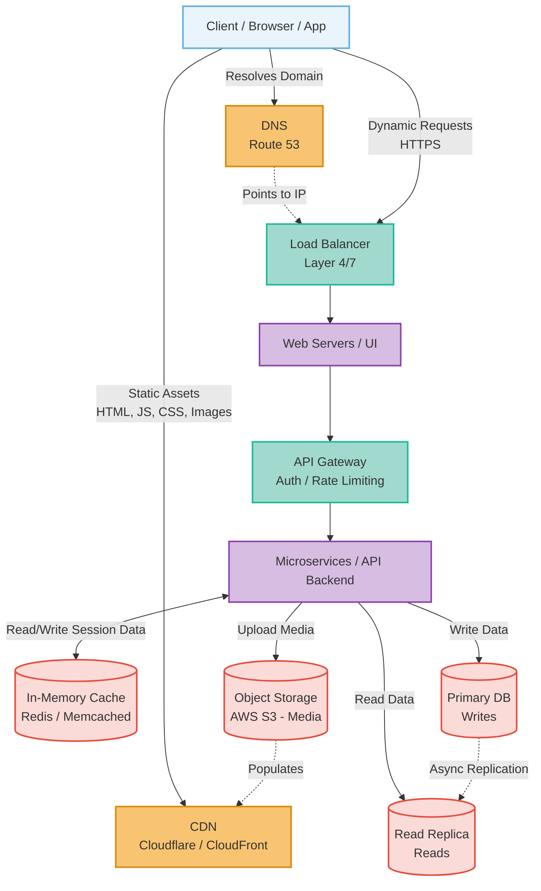

# System Design Revision & Cheatsheet

This document serves as a comprehensive revision guide for System Design interviews, covering core components, a structured step-by-step approach, and a quick-reference cheatsheet.

---

## 1. System Design Approach (The 6-Step Framework)

A structured approach is vital in a system design interview. Use the following framework (often remembered as **REQUIREMENTS -> ESTIMATION -> API -> DB -> HLD -> DEEP DIVE**).

### Step 1: Requirements Gathering (3-5 minutes)
- **Functional Requirements:** What should the system do? (e.g., users can post tweets, follow others, view timeline).
- **Non-Functional Requirements:** What are the system qualities? (e.g., High availability, low latency, consistency vs. availability, scale expectations).

### Step 2: Capacity Estimation (3-5 minutes)
> **Goal:** Understand the scale of the system to make informed architectural decisions (e.g., do we need sharding, caching, or CDNs?)

**Example Scenario: Designing a simplified Twitter/X**
Assume 300 million Monthly Active Users (MAU), 50% use it daily (150M DAU).
Average user posts 2 tweets/day and views 100 tweets/day.

- **Traffic Estimations (QPS - Queries Per Second):**
  - *Write (Post a tweet):* 150M * 2 = 300M tweets/day.
    - Average QPS = 300M / 86,400 (seconds in a day) ≈ **3,500 Write QPS**
    - Peak QPS = 3,500 * 3 = **~10,000 Write QPS**
  - *Read (View timelines):* 150M * 100 = 15 Billion views/day.
    - Average QPS = 15B / 86,400 ≈ **175,000 Read QPS**
    - Peak QPS = 175,000 * 3 = **~500,000 Read QPS**
  > **Observation:** The system is heavy on reads. A read-heavy system usually requires caching and read replicas.

- **Storage Estimations:**
  - *How much data will we store over 5 years?*
  - Payload Size constraint: Assume an average tweet is 140 chars ≈ 140 bytes + 60 bytes metadata = 200 bytes.
  - Assume 10% of tweets contain a photo (1MB) and 1% a video (10MB).
  - *Average tweet size:* 200 bytes + (0.10 * 1MB) + (0.01 * 10MB) ≈ **200 KB per tweet**.
  - *Daily storage:* 300M tweets/day * 200 KB = **60 TB/day**.
  - *5-Year storage:* 60 TB/day * 365 days * 5 years ≈ **110 Petabytes (PB)**.
  > **Observation:** We need distributed Blob Storage like AWS S3 for media, and sharded databases for the text and metadata.

- **Bandwidth Estimations:**
  - *Ingress (Data flowing IN - Writes):* 3,500 writes/sec * 200 KB ≈ **700 MB/sec**.
  - *Egress (Data flowing OUT - Reads):* 175,000 reads/sec * 200 KB ≈ **35 GB/sec**.
  > **Observation:** Massive egress bandwidth means we absolutely need to use a Content Delivery Network (CDN) to serve static media closer to users.

### Step 3: API Design (3-5 minutes)
- Define the core endpoints the system will expose.
- Example: `POST /v1/tweet (user_id, content, media_ids)`

### Step 4: Database Schema Design (3-5 minutes)
- Identify the data entities and their relationships.
- Choose between SQL (ACID, structured) vs NoSQL (flexible, horizontal scale).
- Define tables, primary keys, and partitioning keys.

### Step 5: High-Level Design (HLD) (10-15 minutes)
- Draw the core architecture putting it all together.
- Setup: Client -> Load Balancer -> Web Servers -> App Servers -> Database.
- Identify where to add Caches, Message Queues, and CDNs.

### Step 6: Deep Dive & Bottlenecks (10 minutes)
> **Goal:** Anticipate how the system will fail under extreme load and propose concrete solutions to those specific bottlenecks.

**Example Scenario: Deep Dive into the Twitter/X Clone**
Once the high-level design is drawn, the interviewer will ask, *"What happens when Justin Bieber tweets? How do we handle that spike?"*

- **Identifying Single Points of Failure (SPOF):**
  - **Issue:** We only have one Load Balancer. If it goes down, the entire site is unreachable.
  - **Solution:** Implement active-passive or active-active Load Balancers with a heartbeat mechanism (e.g., Keepalived) tied to multiple public IPs via DNS Round Robin.

- **Discussing Database Scaling (Sharding & Replication):**
  - **Issue:** Our single primary DB handling writes for 3,500 QPS will eventually choke, especially during peak load.
  - **Solution (Replication):** Create multiple Read-Replicas. The primary handles writes and asynchronously replicates data to replicas, which handle our massive 175,000 Read QPS.
  - **Solution (Sharding/Partitioning):** Shard the database by `user_id`. Each shard handles a subset of users. *Trade-off:* What if a famous user is on Shard A? That shard becomes a hotspot. We might need a hybrid sharding key (e.g., `user_id + tweet_id`) or handle celebrities via a dedicated fast-path cache.

- **Discussing Trade-offs (Consistency vs Availability):**
  - **Scenario:** The primary database crashes. Do you promote a replica immediately, knowing it might be missing a few milliseconds of data (eventual consistency), or do you halt all writes until a new primary is safely elected (strong consistency)?
  - **Choice:** For Twitter, Availability is king. We choose an **AP (Available & Partition Tolerant)** approach. It is perfectly fine if User A sees a tweet 2 seconds before User B, as long as the system remains up and responsive.

- **System Safeguards (Rate Limiting, Analytics, Monitoring):**
  - **Rate Limiting:** Protect the API Gateway from DDoS attacks or spammy bots (e.g., limit to 100 tweets/hour per user using a Token Bucket algorithm via Redis).
  - **Monitoring:** Plumb application metrics (e.g., API response times, database CPU usage) into Prometheus and visualize via Grafana. Set up PagerDuty alerts if p99 latency goes above 500ms.
  - **Analytics:** Plumb raw logs and events into an event streaming platform (e.g., Kafka). Consumers can load this into a Data Warehouse (e.g., Snowflake) for business intelligence (e.g., "What are the trending topics today?").

---

## 2. Core System Design Components

### Load Balancers (LB)
- Distributes incoming traffic across multiple servers.
- **Layer 4 LB:** Routes based on IP and Port (e.g., TCP/UDP). Extremely fast.
- **Layer 7 LB:** Routes based on Application data (e.g., HTTP headers, URL paths). Good for intelligent routing.
- **Algorithms:** Round Robin, Least Connections, Consistent Hashing (useful for sticky sessions & caching).

### Proxies (Forward vs Reverse)
A proxy acts as an intermediary server between a client and another server.

#### Forward Proxy (Protects the Client)
- Sits in front of the *client*. When you (the client) try to reach the internet, your request goes to the proxy first. 
- *Use Case:* Bypassing geographical restrictions (VPNs), filtering malicious content in a corporate network, or masking the client's IP address. The internet never knows who the original client is.


#### Reverse Proxy (Protects the Server)
- Sits in front of the *server*. When a client on the internet tries to reach your server, their request hits the reverse proxy first.
- *Use Case:* Load balancing, SSL termination (decrypting HTTPS traffic before it hits the internal network), caching static content, and hiding internal backend architecture. The client never knows which specific backend server they are actually talking to.
- *Example:* Nginx, HAProxy.


### High-Level Architecture Diagram
*A standard, highly scalable architecture putting all core components together.*



### API Gateway
- Sits between the client and backend microservices.
- Handles Authentication, Rate Limiting, Request routing, SSL termination.

### Caching
- Stores highly accessed data in-memory to reduce DB load and latency.
- **Technologies:** Redis, Memcached.
- **Eviction Policies:** LRU (Least Recently Used), LFU, FIFO.
- **Strategies:**
  - *Cache-Aside:* App checks cache, if miss, checks DB and populates cache.
  - *Write-Through:* App writes to cache, cache writes to DB. Safe but slower writes.
  - *Write-Behind (Write-Back):* App writes to cache, cache async writes to DB. Fast but risks data loss.

### Content Delivery Network (CDN)
- Geographically distributed servers that cache static assets (Images, Videos, HTML/JS/CSS) closer to the user.
- **Pull vs Push CDN:** Pull CDNs fetch from origin server on cache miss. Push CDNs are pre-loaded by developers.

### Databases
- **Relational Object (SQL):** MySQL, PostgreSQL. Good for strong schema, ACID guarantees, complex joins. (Vertical scaling mostly, complex horizontal via sharding).
- **NoSQL:**

  - *Key-Value:* Redis, DynamoDB (Fast, simple lookups).
    - **How it stores data:** Like a massive Python dictionary or Java HashMap.
    - **Visual:** `{"user:123:session": "abcd-efgh-ijkl", "product:99:stock": 45}`

  - *Document:* MongoDB, Couchbase (Flexible schema, JSON like).
    - **How it stores data:** Stores semi-structured data as JSON-like documents. Great when the shape of the data changes often.
    - **Visual:**

      ```json
      {
        "user_id": 123,
        "name": "Alice",
        "hobbies": ["reading", "hiking"],
        "address": {"city": "Seattle", "zip": "98101"}
      }
      ```

  - *Wide-Column:* Cassandra, HBase (High write throughput, time-series data).
    - **How it stores data:** Like a 2D Key-Value store. Instead of a strict table, a Row Key points to a varying number of columns.
    - **Visual:**

      ```text
      Row Key: "sensor_42"
        Col: "10:00:01" -> Value: "72.4F"
        Col: "10:00:02" -> Value: "72.6F"
        Col: "10:00:03" -> Value: "73.1F"
      ```

  - *Graph:* Neo4j (Highly interconnected data, e.g., social networks).
    - **How it stores data:** Stores Nodes (entities) and Edges (relationships between them).
    - **Visual:** `(Alice) -[:FOLLOWS]-> (Bob) -[:LIKES]-> (Tweet_XYZ)`

- **Columnar (OLAP - Online Analytical Processing):** Snowflake, Amazon Redshift, Google BigQuery.
  - *Goal:* Fast analytics and aggregations over massive datasets.
  - *How it stores data:* Instead of storing data row-by-row (like traditional SQL databases), it stores data column-by-column on disk.
  - *Why is it faster for analytics?* If you want to find the "average age of all users", a row-based DB must load entire user profiles into memory to read the 'age' field. A columnar DB only loads the tightly-packed, highly-compressed 'age' column from disk, saving massive amounts of I/O.
  - **Visual Contrast:**
    - *Row-based DB:* `[ID:1, Alice, Age:30] [ID:2, Bob, Age:40]` (Reading ages requires hopping through names)
    - *Column-based DB:* `[Ages: 30, 40] [Names: Alice, Bob]` (Reading ages is a fast, sequential sweep)

### Why is NoSQL "Faster" than SQL?
Traditional SQL databases are fully compliant with **ACID properties**, meaning every transaction guarantees data integrity (Atomicity, Consistency, Isolation, Durability). Ensuring absolute consistency requires complex locking mechanisms during writes.

NoSQL databases achieve speed by relaxing these constraints:
1. **No Joins:** Data is often denormalized (nested). Instead of joining 3 tables to fetch a user profile, a Document DB fetches one JSON blob in a single rapid disk read.
2. **Eventual Consistency:** Many NoSQL DBs (like Cassandra) don't lock the entire cluster to ensure every node agrees on a write immediately. They accept the write fast and sync up the cluster in the background.
3. **In-Memory Operations:** Key-Value stores like Redis keep all data in RAM, bypassing the disk entirely, dropping response times from milliseconds to microseconds.

### Message Queues & Event Streaming
- Uncouples heavy processing from main request paths (Asynchronous Processing).
- **RabbitMQ / SQS:** Producer -> Queue -> Consumer. Once consumed, message is typically deleted. Good for task queues (e.g., sending emails).
- **Apache Kafka / Kinesis:** Event streaming log. Messages persist for a period. Multiple consumers can read the same stream. Excellent for analytics and high-throughput events.

---

## 3. System Design Cheatsheet

### CAP Theorem
You can only pick two out of three in a distributed system under a network partition:
- **Consistency:** Every read receives the most recent write.
- **Availability:** Every request receives a non-error response.
- **Partition Tolerance:** System continues to operate despite network drops.
*(In reality, network partitions (P) happen, so you must choose between CP and AP).*

### Quick Math Extrapolations
*During an interview, you don't have a calculator. Use these shortcuts to calculate QPS (Queries Per Second).*

- **Seconds in a Day:** ~100,000 (Exact calculation: 24 hours * 60 minutes * 60 seconds = `86,400 seconds`). We use 100,000 to make mental math extremely fast.
- **1 Million requests / day:**
  - *Math:* 1,000,000 / 86,400 seconds.
  - *Shortcut:* 1,000,000 / 100,000 = `10 req/sec`.
  - *Precision Check:* (1,000,000 / 86,400 ≈ `11.5 req/sec`). So, **~12 req/sec** is a safe, quick answer.
- **100 Million requests / day:**
  - *Shortcut:* 100,000,000 / 100,000 = `1,000 req/sec`. (Extremely common scale to memorize).
- **1 Billion requests / month:**
  - *Math:* First, find requests per day. 1 Billion / 30 days ≈ `33 Million requests / day`.
  - *Shortcut:* 33,000,000 / 100,000 (seconds in a day) = `330 req/sec`.
  - *Precision Check:* 33,333,333 / 86,400 ≈ `385 req/sec`. So, **~400 req/sec** is the industry standard heuristic.

### Latency Numbers Every Programmer Should Know
- L1 cache reference: `0.5 ns`
- Mutex lock/unlock: `100 ns`
- Main memory reference: `100 ns`
- Read 1 MB sequentially from memory: `250,000 ns (~0.25 ms)`
- Read 1 MB sequentially from network: `10,000,000 ns (~10 ms)`
- Read 1 MB sequentially from disk: `30,000,000 ns (~30 ms)`
- Send packet CA -> Netherlands -> CA: `150,000,000 ns (~150 ms)`

### Typical Tech Stack Choices
- **Search:** Elasticsearch, Solr.
- **Blob/Object Storage:** Amazon S3, Azure Blob (Images, Videos, Files).
- **Chat/WebSockets:** Redis Pub/Sub, Node.js + Socket.io, Erlang.
- **Time-Series / Metrics:** Prometheus, InfluxDB.

### Availability Nines
- **99% (Two 9s):** 3.65 days downtime/year
- **99.9% (Three 9s):** 8.77 hours downtime/year
- **99.99% (Four 9s):** 52.6 minutes downtime/year
- **99.999% (Five 9s):** 5.26 minutes downtime/year
