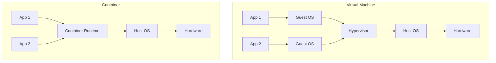
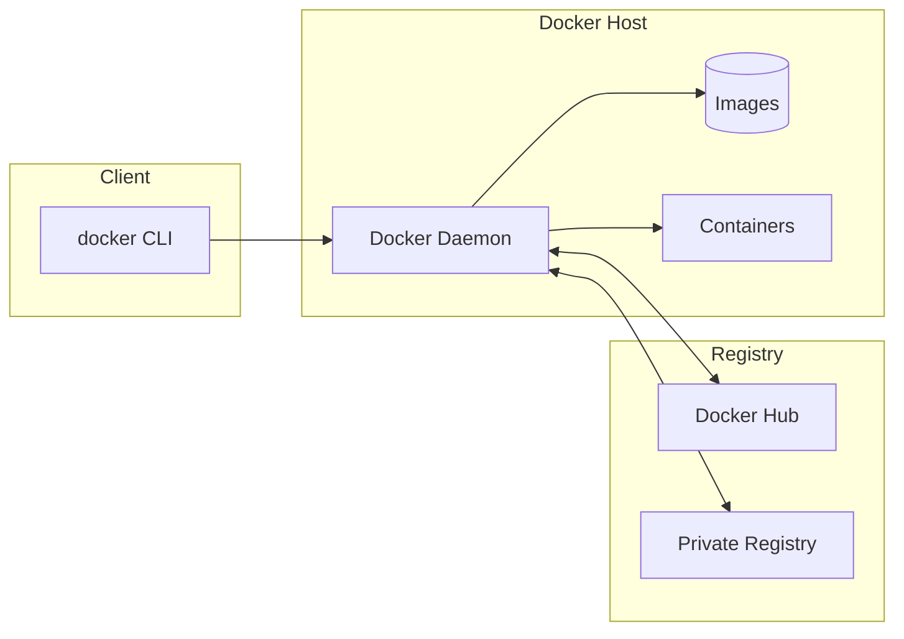
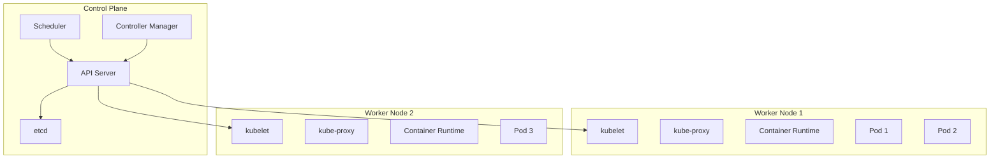
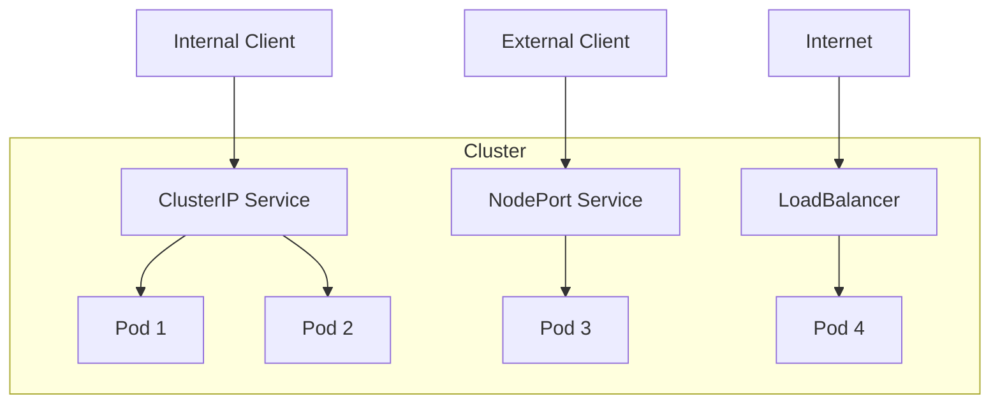
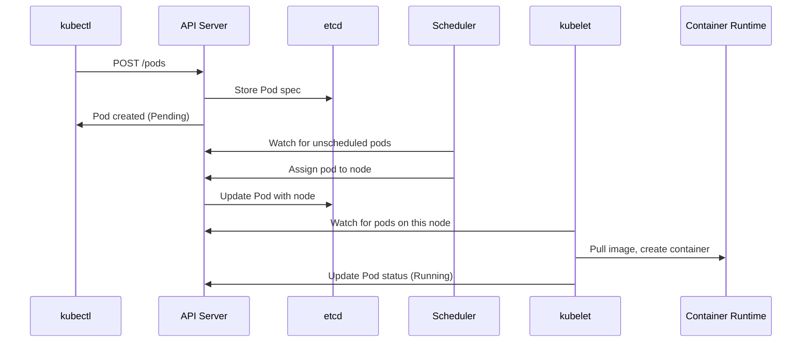

# Docker & Kubernetes Deep Dive

> Master Containerization and Orchestration

---

## Table of Contents

1. [Docker Fundamentals](#1-docker-fundamentals)
2. [Dockerfile Best Practices](#2-dockerfile-best-practices)
3. [Docker Compose](#3-docker-compose)
4. [Kubernetes Architecture](#4-kubernetes-architecture)
5. [Kubernetes Workloads](#5-kubernetes-workloads)
6. [Networking & Services](#6-networking--services)
7. [Configuration & Storage](#7-configuration--storage)
8. [Helm & Kustomize](#8-helm--kustomize)
9. [Interview Questions](#9-interview-questions)

---

## 1. Docker Fundamentals

### Container vs VM



| Aspect | Container | Virtual Machine |
|--------|-----------|-----------------|
| **Size** | MB | GB |
| **Startup** | Seconds | Minutes |
| **Isolation** | Process-level | Hardware-level |
| **OS** | Shares host kernel | Full guest OS |
| **Portability** | Highly portable | Less portable |

### Core Docker Commands

```bash
# Images
docker build -t myapp:v1 .           # Build image
docker images                         # List images
docker pull nginx:alpine             # Pull from registry
docker push myrepo/myapp:v1          # Push to registry
docker tag myapp:v1 myapp:latest     # Tag image

# Containers
docker run -d -p 8080:80 nginx       # Run detached with port mapping
docker run -it ubuntu bash           # Interactive terminal
docker ps                            # List running containers
docker ps -a                         # List all containers
docker logs <container_id>           # View logs
docker exec -it <container_id> bash  # Execute command in container
docker stop <container_id>           # Stop container
docker rm <container_id>             # Remove container

# Cleanup
docker system prune                  # Remove unused data
docker image prune -a               # Remove all unused images
```

### Docker Architecture



---

## 2. Dockerfile Best Practices

### Basic Dockerfile

```dockerfile
# Use specific version
FROM python:3.11-slim

# Set working directory
WORKDIR /app

# Copy requirements first (cache layer)
COPY requirements.txt .

# Install dependencies
RUN pip install --no-cache-dir -r requirements.txt

# Copy application code
COPY . .

# Create non-root user
RUN useradd -m appuser && chown -R appuser:appuser /app
USER appuser

# Expose port
EXPOSE 8000

# Health check
HEALTHCHECK --interval=30s --timeout=10s --start-period=5s \
    CMD curl -f http://localhost:8000/health || exit 1

# Run application
CMD ["uvicorn", "main:app", "--host", "0.0.0.0", "--port", "8000"]
```

### Multi-Stage Build

```dockerfile
# ========== Build Stage ==========
FROM node:20-alpine AS builder

WORKDIR /app

# Install dependencies
COPY package*.json ./
RUN npm ci --only=production

# Build application
COPY . .
RUN npm run build

# ========== Production Stage ==========
FROM node:20-alpine AS production

WORKDIR /app

# Copy only production artifacts
COPY --from=builder /app/dist ./dist
COPY --from=builder /app/node_modules ./node_modules
COPY --from=builder /app/package.json ./

# Non-root user
RUN addgroup -g 1001 -S nodejs && \
    adduser -S nextjs -u 1001
USER nextjs

EXPOSE 3000
CMD ["node", "dist/server.js"]
```

### Java Multi-Stage Build

```dockerfile
# Build stage
FROM maven:3.9-eclipse-temurin-21 AS builder
WORKDIR /app
COPY pom.xml .
RUN mvn dependency:go-offline
COPY src ./src
RUN mvn package -DskipTests

# Runtime stage
FROM eclipse-temurin:21-jre-alpine
WORKDIR /app
COPY --from=builder /app/target/*.jar app.jar

# JVM optimization for containers
ENV JAVA_OPTS="-XX:+UseContainerSupport -XX:MaxRAMPercentage=75.0"

EXPOSE 8080
ENTRYPOINT ["sh", "-c", "java $JAVA_OPTS -jar app.jar"]
```

### Best Practices Summary

```dockerfile
# ✅ DO
FROM python:3.11-slim                    # Use slim/alpine images
COPY requirements.txt .                  # Copy deps first for caching
RUN pip install --no-cache-dir          # No cache to reduce size
USER appuser                            # Run as non-root
HEALTHCHECK CMD curl localhost/health   # Add health checks

# ❌ DON'T
FROM python:latest                       # Avoid 'latest' tag
COPY . .                                 # Don't copy everything first
RUN apt-get update && apt-get install   # Split commands (cache issue)
USER root                               # Don't run as root
# Missing HEALTHCHECK
```

---

## 3. Docker Compose

### Basic Compose File

```yaml
# docker-compose.yml
version: '3.8'

services:
  app:
    build:
      context: .
      dockerfile: Dockerfile
    ports:
      - "8000:8000"
    environment:
      - DATABASE_URL=postgresql://user:pass@db:5432/myapp
      - REDIS_URL=redis://redis:6379
    depends_on:
      db:
        condition: service_healthy
      redis:
        condition: service_started
    volumes:
      - ./app:/app
    networks:
      - backend
    restart: unless-stopped
    healthcheck:
      test: ["CMD", "curl", "-f", "http://localhost:8000/health"]
      interval: 30s
      timeout: 10s
      retries: 3

  db:
    image: postgres:16-alpine
    environment:
      POSTGRES_USER: user
      POSTGRES_PASSWORD: pass
      POSTGRES_DB: myapp
    volumes:
      - postgres_data:/var/lib/postgresql/data
    networks:
      - backend
    healthcheck:
      test: ["CMD-SHELL", "pg_isready -U user -d myapp"]
      interval: 10s
      timeout: 5s
      retries: 5

  redis:
    image: redis:7-alpine
    ports:
      - "6379:6379"
    volumes:
      - redis_data:/data
    networks:
      - backend

volumes:
  postgres_data:
  redis_data:

networks:
  backend:
    driver: bridge
```

### Compose Commands

```bash
docker compose up -d                    # Start in background
docker compose up --build              # Rebuild images
docker compose down                    # Stop and remove
docker compose down -v                 # Also remove volumes
docker compose logs -f app             # Follow logs
docker compose exec app bash           # Execute in container
docker compose ps                      # List services
docker compose pull                    # Pull latest images
```

---

## 4. Kubernetes Architecture

### Cluster Components



| Component | Role |
|-----------|------|
| **API Server** | Frontend for control plane, handles REST requests |
| **etcd** | Distributed key-value store for cluster state |
| **Scheduler** | Assigns pods to nodes based on resources |
| **Controller Manager** | Runs controllers (Deployment, ReplicaSet, etc.) |
| **kubelet** | Agent on each node, manages pods |
| **kube-proxy** | Network proxy for service abstraction |

### kubectl Essentials

```bash
# Cluster info
kubectl cluster-info
kubectl get nodes
kubectl get namespaces

# Pods
kubectl get pods -n <namespace>
kubectl get pods -o wide                      # More details
kubectl describe pod <pod-name>
kubectl logs <pod-name> -f                   # Follow logs
kubectl logs <pod-name> -c <container>       # Specific container
kubectl exec -it <pod-name> -- bash          # Shell into pod

# Deployments
kubectl get deployments
kubectl rollout status deployment/<name>
kubectl rollout history deployment/<name>
kubectl rollout undo deployment/<name>
kubectl scale deployment/<name> --replicas=5

# Services
kubectl get svc
kubectl expose deployment <name> --port=80 --target-port=8080

# Apply/Delete
kubectl apply -f manifest.yaml
kubectl delete -f manifest.yaml
kubectl delete pod <pod-name>

# Debug
kubectl get events --sort-by='.lastTimestamp'
kubectl top pods                             # Resource usage
kubectl top nodes
```

---

## 5. Kubernetes Workloads

### Pod

```yaml
# pod.yaml - Rarely used directly
apiVersion: v1
kind: Pod
metadata:
  name: myapp
  labels:
    app: myapp
spec:
  containers:
    - name: app
      image: myapp:v1
      ports:
        - containerPort: 8080
      resources:
        requests:
          memory: "128Mi"
          cpu: "100m"
        limits:
          memory: "256Mi"
          cpu: "500m"
      livenessProbe:
        httpGet:
          path: /health
          port: 8080
        initialDelaySeconds: 10
        periodSeconds: 5
      readinessProbe:
        httpGet:
          path: /ready
          port: 8080
        initialDelaySeconds: 5
        periodSeconds: 3
```

### Deployment

```yaml
# deployment.yaml
apiVersion: apps/v1
kind: Deployment
metadata:
  name: myapp
  labels:
    app: myapp
spec:
  replicas: 3
  selector:
    matchLabels:
      app: myapp
  strategy:
    type: RollingUpdate
    rollingUpdate:
      maxSurge: 1
      maxUnavailable: 0
  template:
    metadata:
      labels:
        app: myapp
    spec:
      containers:
        - name: app
          image: myapp:v1
          ports:
            - containerPort: 8080
          env:
            - name: DATABASE_URL
              valueFrom:
                secretKeyRef:
                  name: app-secrets
                  key: database-url
          resources:
            requests:
              memory: "256Mi"
              cpu: "250m"
            limits:
              memory: "512Mi"
              cpu: "1000m"
          livenessProbe:
            httpGet:
              path: /health
              port: 8080
            initialDelaySeconds: 30
            periodSeconds: 10
          readinessProbe:
            httpGet:
              path: /ready
              port: 8080
            initialDelaySeconds: 5
            periodSeconds: 5
```

### StatefulSet (for stateful apps)

```yaml
# statefulset.yaml
apiVersion: apps/v1
kind: StatefulSet
metadata:
  name: postgres
spec:
  serviceName: postgres
  replicas: 3
  selector:
    matchLabels:
      app: postgres
  template:
    metadata:
      labels:
        app: postgres
    spec:
      containers:
        - name: postgres
          image: postgres:16
          ports:
            - containerPort: 5432
          volumeMounts:
            - name: data
              mountPath: /var/lib/postgresql/data
  volumeClaimTemplates:
    - metadata:
        name: data
      spec:
        accessModes: ["ReadWriteOnce"]
        storageClassName: standard
        resources:
          requests:
            storage: 10Gi
```

### DaemonSet (one pod per node)

```yaml
# daemonset.yaml
apiVersion: apps/v1
kind: DaemonSet
metadata:
  name: fluentd
spec:
  selector:
    matchLabels:
      app: fluentd
  template:
    metadata:
      labels:
        app: fluentd
    spec:
      containers:
        - name: fluentd
          image: fluentd:latest
          volumeMounts:
            - name: varlog
              mountPath: /var/log
      volumes:
        - name: varlog
          hostPath:
            path: /var/log
```

### Job & CronJob

```yaml
# job.yaml
apiVersion: batch/v1
kind: Job
metadata:
  name: backup
spec:
  ttlSecondsAfterFinished: 3600
  template:
    spec:
      containers:
        - name: backup
          image: backup-tool:v1
          command: ["./backup.sh"]
      restartPolicy: Never
  backoffLimit: 3
---
# cronjob.yaml
apiVersion: batch/v1
kind: CronJob
metadata:
  name: daily-backup
spec:
  schedule: "0 2 * * *"  # 2 AM daily
  jobTemplate:
    spec:
      template:
        spec:
          containers:
            - name: backup
              image: backup-tool:v1
          restartPolicy: OnFailure
```

---

## 6. Networking & Services

### Service Types



### ClusterIP (default)

```yaml
# Internal access only
apiVersion: v1
kind: Service
metadata:
  name: myapp
spec:
  type: ClusterIP
  selector:
    app: myapp
  ports:
    - port: 80
      targetPort: 8080
```

### NodePort

```yaml
# External access via node IP
apiVersion: v1
kind: Service
metadata:
  name: myapp-nodeport
spec:
  type: NodePort
  selector:
    app: myapp
  ports:
    - port: 80
      targetPort: 8080
      nodePort: 30080  # 30000-32767
```

### LoadBalancer

```yaml
# Cloud load balancer
apiVersion: v1
kind: Service
metadata:
  name: myapp-lb
  annotations:
    service.beta.kubernetes.io/aws-load-balancer-type: nlb
spec:
  type: LoadBalancer
  selector:
    app: myapp
  ports:
    - port: 80
      targetPort: 8080
```

### Ingress

```yaml
# ingress.yaml
apiVersion: networking.k8s.io/v1
kind: Ingress
metadata:
  name: myapp-ingress
  annotations:
    nginx.ingress.kubernetes.io/rewrite-target: /
    cert-manager.io/cluster-issuer: letsencrypt-prod
spec:
  ingressClassName: nginx
  tls:
    - hosts:
        - myapp.example.com
      secretName: myapp-tls
  rules:
    - host: myapp.example.com
      http:
        paths:
          - path: /api
            pathType: Prefix
            backend:
              service:
                name: api-service
                port:
                  number: 80
          - path: /
            pathType: Prefix
            backend:
              service:
                name: frontend-service
                port:
                  number: 80
```

---

## 7. Configuration & Storage

### ConfigMap

```yaml
apiVersion: v1
kind: ConfigMap
metadata:
  name: app-config
data:
  APP_ENV: production
  LOG_LEVEL: info
  config.json: |
    {
      "feature_flags": {
        "new_ui": true
      }
    }
---
# Usage in Pod
spec:
  containers:
    - name: app
      envFrom:
        - configMapRef:
            name: app-config
      volumeMounts:
        - name: config
          mountPath: /app/config
  volumes:
    - name: config
      configMap:
        name: app-config
        items:
          - key: config.json
            path: config.json
```

### Secret

```yaml
apiVersion: v1
kind: Secret
metadata:
  name: app-secrets
type: Opaque
data:
  # base64 encoded
  database-url: cG9zdGdyZXM6Ly91c2VyOnBhc3NAZGIvYXBw
  api-key: c2VjcmV0LWFwaS1rZXk=
---
# Usage in Pod
spec:
  containers:
    - name: app
      env:
        - name: DATABASE_URL
          valueFrom:
            secretKeyRef:
              name: app-secrets
              key: database-url
```

### PersistentVolume & PersistentVolumeClaim

```yaml
# PVC (usually you only create this)
apiVersion: v1
kind: PersistentVolumeClaim
metadata:
  name: data-pvc
spec:
  accessModes:
    - ReadWriteOnce
  storageClassName: gp3
  resources:
    requests:
      storage: 20Gi
---
# Usage in Pod
spec:
  containers:
    - name: app
      volumeMounts:
        - name: data
          mountPath: /data
  volumes:
    - name: data
      persistentVolumeClaim:
        claimName: data-pvc
```

---

## 8. Helm & Kustomize

### Helm

```bash
# Add repository
helm repo add bitnami https://charts.bitnami.com/bitnami
helm repo update

# Search charts
helm search repo nginx

# Install
helm install my-nginx bitnami/nginx
helm install my-nginx bitnami/nginx -f values.yaml
helm install my-nginx bitnami/nginx --set replicaCount=3

# Upgrade
helm upgrade my-nginx bitnami/nginx --set replicaCount=5

# Rollback
helm rollback my-nginx 1

# Uninstall
helm uninstall my-nginx

# List releases
helm list
```

### Helm Chart Structure

```
mychart/
├── Chart.yaml          # Chart metadata
├── values.yaml         # Default values
├── templates/
│   ├── deployment.yaml
│   ├── service.yaml
│   ├── ingress.yaml
│   ├── configmap.yaml
│   ├── _helpers.tpl    # Template helpers
│   └── NOTES.txt       # Post-install notes
└── charts/             # Dependencies
```

### Kustomize

```yaml
# base/kustomization.yaml
apiVersion: kustomize.config.k8s.io/v1beta1
kind: Kustomization

resources:
  - deployment.yaml
  - service.yaml

commonLabels:
  app: myapp
---
# overlays/production/kustomization.yaml
apiVersion: kustomize.config.k8s.io/v1beta1
kind: Kustomization

resources:
  - ../../base

namespace: production

replicas:
  - name: myapp
    count: 5

images:
  - name: myapp
    newTag: v2.0.0

patches:
  - path: resources-patch.yaml
```

```bash
# Apply with kustomize
kubectl apply -k overlays/production/
kustomize build overlays/production/ | kubectl apply -f -
```

---

## 9. Interview Questions

### Q1: What happens when you run `kubectl run nginx --image=nginx`?

**Answer:**



1. kubectl sends POST to API Server
2. API Server validates and stores in etcd
3. Scheduler detects unscheduled pod
4. Scheduler selects node, updates API
5. kubelet on node detects new pod
6. kubelet instructs container runtime
7. Status updated to Running

---

### Q2: Deployment vs StatefulSet - when to use which?

| Aspect | Deployment | StatefulSet |
|--------|------------|-------------|
| **Identity** | Pods are interchangeable | Stable, unique pod IDs |
| **Storage** | Shared or ephemeral | Persistent per-pod |
| **Ordering** | Parallel creation/deletion | Sequential |
| **Network** | Random pod names | Predictable DNS names |
| **Use Case** | Stateless apps (API, web) | Databases, Kafka, Zookeeper |

---

### Q3: How does a Kubernetes service discover pods?

**Answer:**

1. **Labels & Selectors**: Service uses selector to match pod labels
2. **Endpoints**: kube-proxy creates Endpoints object with pod IPs
3. **kube-proxy**: Updates iptables/IPVS rules on each node
4. **DNS**: CoreDNS creates DNS record for service

```yaml
# Service selects pods with app=myapp label
Service (selector: app=myapp)
    ↓
Endpoints (10.1.1.5, 10.1.2.3, 10.1.3.7)
    ↓
kube-proxy (iptables DNAT rules)
    ↓
Load balanced to pod
```

---

### Q4: What is the difference between liveness and readiness probes?

| Probe | Purpose | Failure Action |
|-------|---------|----------------|
| **Liveness** | Is the container alive? | Restart container |
| **Readiness** | Can it accept traffic? | Remove from service endpoints |
| **Startup** | Has app started? | Don't check other probes yet |

```yaml
livenessProbe:    # Restart if fails
  httpGet:
    path: /health
    port: 8080
  initialDelaySeconds: 30
  periodSeconds: 10

readinessProbe:   # Remove from LB if fails
  httpGet:
    path: /ready
    port: 8080
  initialDelaySeconds: 5
  periodSeconds: 5
```

---

### Q5: Explain Kubernetes networking model

**Answer:**

1. **Pod-to-Pod**: Every pod gets unique IP, can reach all pods without NAT
2. **Pod-to-Service**: Services provide stable virtual IP (ClusterIP)
3. **External-to-Service**: NodePort, LoadBalancer, or Ingress

Key principles:
- All pods can communicate without NAT
- All nodes can communicate with all pods
- Pod's IP is same inside and outside the pod

CNI plugins (Calico, Cilium, Flannel) implement this networking model.

---

### Q6: How do you debug a pod that won't start?

```bash
# 1. Check pod status
kubectl get pod <name> -o wide
kubectl describe pod <name>

# 2. Check events
kubectl get events --sort-by='.lastTimestamp' | grep <pod>

# 3. Check logs
kubectl logs <pod> --previous  # Previous container logs
kubectl logs <pod> -c <container>  # Specific container

# 4. Common issues:
# - ImagePullBackOff: Wrong image name or missing credentials
# - CrashLoopBackOff: Container crashing, check logs
# - Pending: No node with enough resources
# - ContainerCreating: PVC not bound, ConfigMap missing
```

---

## Navigation

Previous: [CI/CD Deep Dive](./cicd-deep-dive.md) | Next: [System Design Overview](../../../companies/australia/anz/01-company-overview.md)

---

*Master containers and orchestration to deploy anywhere!*
