# Machine Learning Fundamentals

A comprehensive guide to understanding Machine Learning from first principles, with math, Python code, diagrams, and real-world applications.

---

## 🗺️ Learning Roadmap

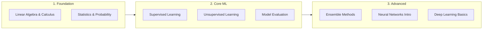

---

## 1️⃣ Mathematical Foundations

### Linear Algebra Essentials

#### Vectors
A **vector** is an ordered list of numbers. In ML, a data point is represented as a vector.

$$\vec{x} = \begin{bmatrix} x_1 \\ x_2 \\ \vdots \\ x_n \end{bmatrix}$$

**Python:**
```python
import numpy as np

# A feature vector (e.g., [age, income, credit_score])
x = np.array([25, 50000, 720])
print(x.shape)  # (3,)
```

#### Dot Product
Measures similarity between two vectors.

$$\vec{a} \cdot \vec{b} = \sum_{i=1}^{n} a_i b_i = |a||b|\cos\theta$$

```python
a = np.array([1, 2, 3])
b = np.array([4, 5, 6])
dot_product = np.dot(a, b)  # 1*4 + 2*5 + 3*6 = 32
```

#### Matrices
A **matrix** is a 2D array. In ML, datasets are matrices where rows are samples and columns are features.

$$X = \begin{bmatrix} x_{11} & x_{12} \\ x_{21} & x_{22} \\ x_{31} & x_{32} \end{bmatrix}$$

```python
# Dataset: 3 samples, 2 features
X = np.array([
    [1, 2],
    [3, 4],
    [5, 6]
])
print(X.shape)  # (3, 2)
```

---

### Calculus for ML

#### Derivatives (Gradient)
The **derivative** tells us the rate of change. In ML, we use it to minimize the **loss function**.

$$\frac{d}{dx} f(x) = \lim_{h \to 0} \frac{f(x+h) - f(x)}{h}$$

**Gradient Descent** uses derivatives to find the minimum of a function:

$$\theta_{new} = \theta_{old} - \alpha \cdot \nabla J(\theta)$$

Where:
- $\alpha$ = learning rate
- $\nabla J(\theta)$ = gradient of loss function

```mermaid
graph LR
    A[Start: Random θ] --> B{Calculate Loss J}
    B --> C[Compute Gradient ∇J]
    C --> D[Update θ = θ - α∇J]
    D --> E{Converged?}
    E -->|No| B
    E -->|Yes| F[Optimal θ]
```

---

### Statistics & Probability

#### Key Concepts

| Concept | Formula | Use in ML |
| :--- | :--- | :--- |
| **Mean** | $\mu = \frac{1}{n}\sum x_i$ | Central tendency |
| **Variance** | $\sigma^2 = \frac{1}{n}\sum (x_i - \mu)^2$ | Spread of data |
| **Standard Deviation** | $\sigma = \sqrt{\sigma^2}$ | Feature scaling |
| **Covariance** | $Cov(X,Y) = E[(X-\mu_X)(Y-\mu_Y)]$ | Feature relationships |

```python
data = np.array([10, 20, 30, 40, 50])

mean = np.mean(data)        # 30.0
variance = np.var(data)     # 200.0
std_dev = np.std(data)      # 14.14
```

#### Probability Distributions

**Normal (Gaussian) Distribution**: Most common in ML.

$$P(x) = \frac{1}{\sigma\sqrt{2\pi}} e^{-\frac{(x-\mu)^2}{2\sigma^2}}$$

```python
import matplotlib.pyplot as plt
from scipy.stats import norm

x = np.linspace(-4, 4, 100)
plt.plot(x, norm.pdf(x, 0, 1), label='μ=0, σ=1')
plt.title('Normal Distribution')
plt.show()
```

---

## 2️⃣ Supervised Learning

The model learns from **labeled data** (input-output pairs).

```mermaid
flowchart LR
    INPUT[Input X] --> MODEL[Model f]
    MODEL --> OUTPUT[Prediction ŷ]
    ACTUAL[Actual y] --> LOSS[Loss Function]
    OUTPUT --> LOSS
    LOSS --> LEARN[Update Weights]
    LEARN --> MODEL
```

### 2.1 Linear Regression

**Goal**: Predict a continuous value.

$$\hat{y} = w_0 + w_1 x_1 + w_2 x_2 + \ldots + w_n x_n = \mathbf{w}^T \mathbf{x}$$

**Loss Function (MSE)**:

$$J(w) = \frac{1}{2m} \sum_{i=1}^{m} (\hat{y}^{(i)} - y^{(i)})^2$$

**Python Implementation:**

```python
from sklearn.linear_model import LinearRegression
from sklearn.model_selection import train_test_split
import numpy as np

# Sample data: House size -> Price
X = np.array([[1000], [1500], [2000], [2500], [3000]])
y = np.array([200000, 300000, 400000, 500000, 600000])

# Train
model = LinearRegression()
model.fit(X, y)

# Predict
print(model.predict([[1800]]))  # ~$360,000
print(f"Coefficient (w1): {model.coef_[0]}")
print(f"Intercept (w0): {model.intercept_}")
```

**Use Cases**: House price prediction, Sales forecasting.

---

### 2.2 Logistic Regression (Classification)

**Goal**: Predict a probability (binary classification).

$$P(y=1|x) = \sigma(w^T x) = \frac{1}{1 + e^{-w^T x}}$$

**Sigmoid Function:**

```mermaid
graph LR
    subgraph Sigmoid["Sigmoid σ(z)"]
        direction TB
        A["z = -∞ → σ = 0"]
        B["z = 0 → σ = 0.5"]
        C["z = +∞ → σ = 1"]
    end
```

**Loss Function (Binary Cross-Entropy):**

$$J(w) = -\frac{1}{m} \sum [y \log(\hat{y}) + (1-y) \log(1-\hat{y})]$$

```python
from sklearn.linear_model import LogisticRegression
from sklearn.datasets import load_iris

# Load Iris (just 2 classes for simplicity)
iris = load_iris()
X = iris.data[iris.target != 2]
y = iris.target[iris.target != 2]

model = LogisticRegression()
model.fit(X, y)

# Predict probability
print(model.predict_proba([[5.0, 3.5, 1.5, 0.2]]))  # [[0.98, 0.02]]
```

**Use Cases**: Spam detection, Disease diagnosis (Yes/No).

---

### 2.3 Decision Trees

A tree-based model that splits data based on feature thresholds.

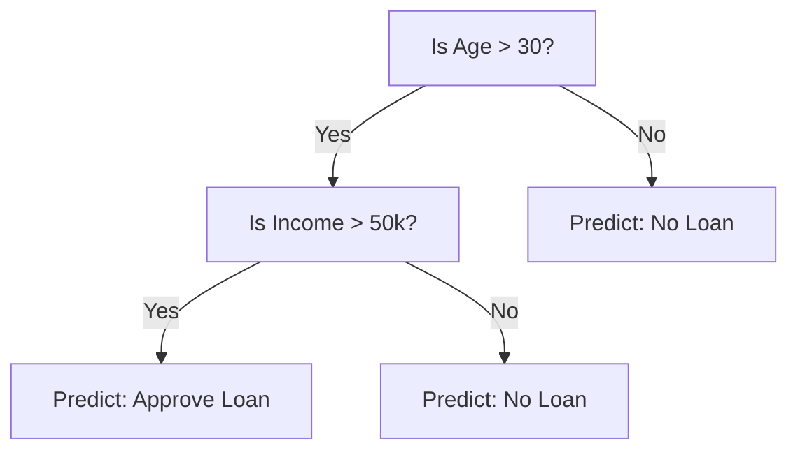

**Splitting Criteria:**
- **Gini Impurity**: $G = 1 - \sum p_i^2$
- **Entropy (Information Gain)**: $H = -\sum p_i \log_2(p_i)$

```python
from sklearn.tree import DecisionTreeClassifier, plot_tree
import matplotlib.pyplot as plt

X = [[25, 40000], [45, 80000], [35, 60000], [50, 120000]]
y = [0, 1, 0, 1]  # 0 = No Loan, 1 = Loan

clf = DecisionTreeClassifier(max_depth=2)
clf.fit(X, y)

plt.figure(figsize=(12, 8))
plot_tree(clf, feature_names=['Age', 'Income'], class_names=['No', 'Yes'], filled=True)
plt.show()
```

**Use Cases**: Credit scoring, Customer segmentation.

---

### 2.4 Support Vector Machines (SVM)

Finds the **hyperplane** that best separates classes with maximum margin.

$$\text{Maximize Margin} = \frac{2}{||w||}$$

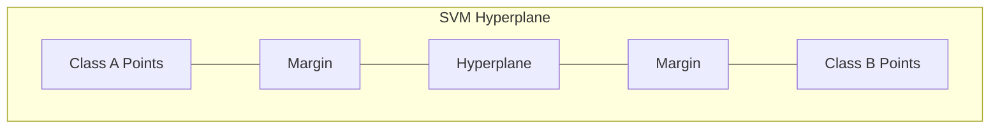

**Kernel Trick**: Maps data to higher dimensions for non-linear separation.
- Linear: $K(x, y) = x \cdot y$
- RBF: $K(x, y) = e^{-\gamma ||x-y||^2}$

```python
from sklearn.svm import SVC

model = SVC(kernel='rbf', C=1.0)
model.fit(X_train, y_train)
predictions = model.predict(X_test)
```

**Use Cases**: Image classification, Handwriting recognition.

---

## 3️⃣ Unsupervised Learning

The model learns from **unlabeled data** to find patterns.

### 3.1 K-Means Clustering

Partitions data into **K clusters** by minimizing intra-cluster variance.

**Algorithm:**
1. Initialize K centroids randomly.
2. Assign each point to the nearest centroid.
3. Recalculate centroids as mean of assigned points.
4. Repeat until convergence.

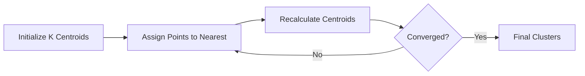

```python
from sklearn.cluster import KMeans
import matplotlib.pyplot as plt

# Sample 2D data
X = np.array([[1, 2], [1.5, 1.8], [5, 8], [8, 8], [1, 0.6], [9, 11]])

kmeans = KMeans(n_clusters=2, random_state=0)
kmeans.fit(X)

plt.scatter(X[:, 0], X[:, 1], c=kmeans.labels_, cmap='viridis')
plt.scatter(kmeans.cluster_centers_[:, 0], kmeans.cluster_centers_[:, 1], s=200, c='red', marker='X')
plt.title('K-Means Clustering')
plt.show()
```

**Use Cases**: Customer segmentation, Image compression.

---

### 3.2 Principal Component Analysis (PCA)

Reduces dimensionality by finding **principal components** (directions of maximum variance).

$$Z = X W$$

Where $W$ contains eigenvectors of the covariance matrix.

```python
from sklearn.decomposition import PCA
from sklearn.datasets import load_iris

iris = load_iris()
X = iris.data

pca = PCA(n_components=2)
X_reduced = pca.fit_transform(X)

print(f"Original shape: {X.shape}")      # (150, 4)
print(f"Reduced shape: {X_reduced.shape}") # (150, 2)
print(f"Explained variance: {pca.explained_variance_ratio_}")
```

**Use Cases**: Visualization, Noise reduction, Feature extraction.

---

## 4️⃣ Model Evaluation

### Metrics for Classification

| Metric | Formula | Use |
| :--- | :--- | :--- |
| **Accuracy** | $\frac{TP + TN}{Total}$ | Balanced classes |
| **Precision** | $\frac{TP}{TP + FP}$ | When FP is costly (spam) |
| **Recall** | $\frac{TP}{TP + FN}$ | When FN is costly (cancer) |
| **F1-Score** | $2 \cdot \frac{Precision \cdot Recall}{Precision + Recall}$ | Imbalanced classes |

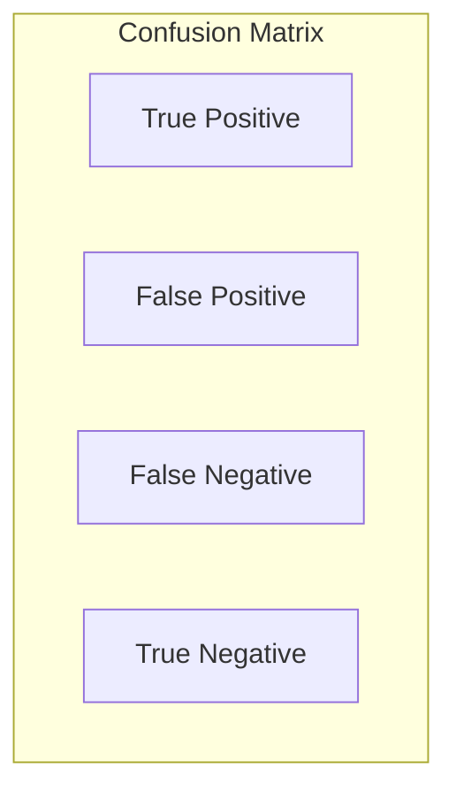

```python
from sklearn.metrics import classification_report, confusion_matrix

y_true = [1, 0, 1, 1, 0, 1, 0, 0, 1, 0]
y_pred = [1, 0, 1, 0, 0, 1, 1, 0, 1, 0]

print(confusion_matrix(y_true, y_pred))
print(classification_report(y_true, y_pred))
```

### Bias-Variance Tradeoff

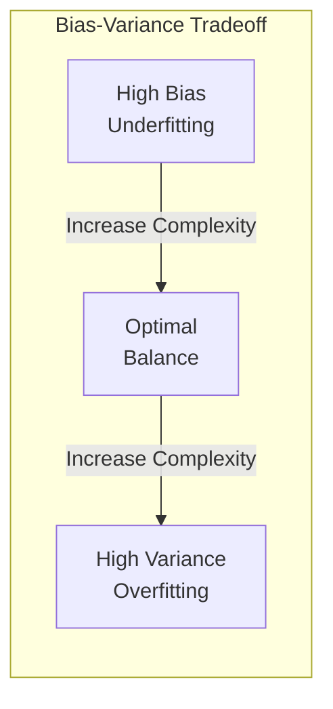

| Issue | Symptom | Solution |
| :--- | :--- | :--- |
| **Underfitting** | High train error, High test error | More features, Complex model |
| **Overfitting** | Low train error, High test error | Regularization, More data |

### Cross-Validation

```python
from sklearn.model_selection import cross_val_score

scores = cross_val_score(model, X, y, cv=5)  # 5-fold CV
print(f"Mean accuracy: {scores.mean():.2f} (+/- {scores.std():.2f})")
```

---

## 5️⃣ Ensemble Methods

Combine multiple models to improve performance.

### Random Forest

An ensemble of Decision Trees using **bagging** (Bootstrap Aggregating).

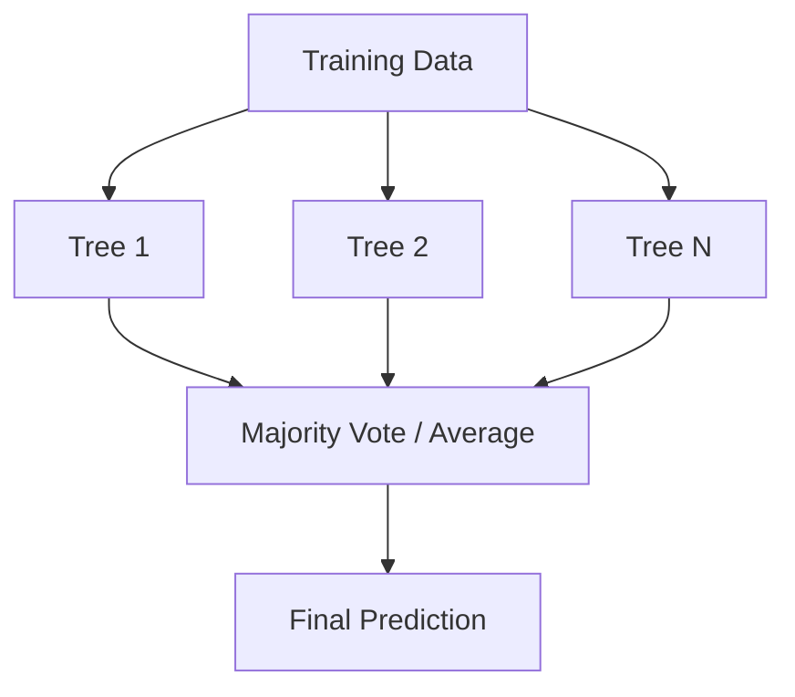

```python
from sklearn.ensemble import RandomForestClassifier

rf = RandomForestClassifier(n_estimators=100, max_depth=5, random_state=42)
rf.fit(X_train, y_train)
print(f"Feature Importances: {rf.feature_importances_}")
```

### Gradient Boosting (XGBoost)

Sequentially builds trees that correct errors of previous ones.

$$F_m(x) = F_{m-1}(x) + \gamma_m h_m(x)$$

```python
from xgboost import XGBClassifier

xgb = XGBClassifier(n_estimators=100, learning_rate=0.1, max_depth=3)
xgb.fit(X_train, y_train)
predictions = xgb.predict(X_test)
```

**Use Cases**: Kaggle competitions, Fraud detection, Recommendation systems.

---

## 6️⃣ Neural Networks Basics

### Perceptron (Single Neuron)

$$y = \sigma(w_1 x_1 + w_2 x_2 + b)$$

```mermaid
graph LR
    X1[x1] --> |w1| SUM((Σ))
    X2[x2] --> |w2| SUM
    BIAS[b] --> SUM
    SUM --> ACT[Activation σ]
    ACT --> Y[y]
```

### Multi-Layer Perceptron (MLP)

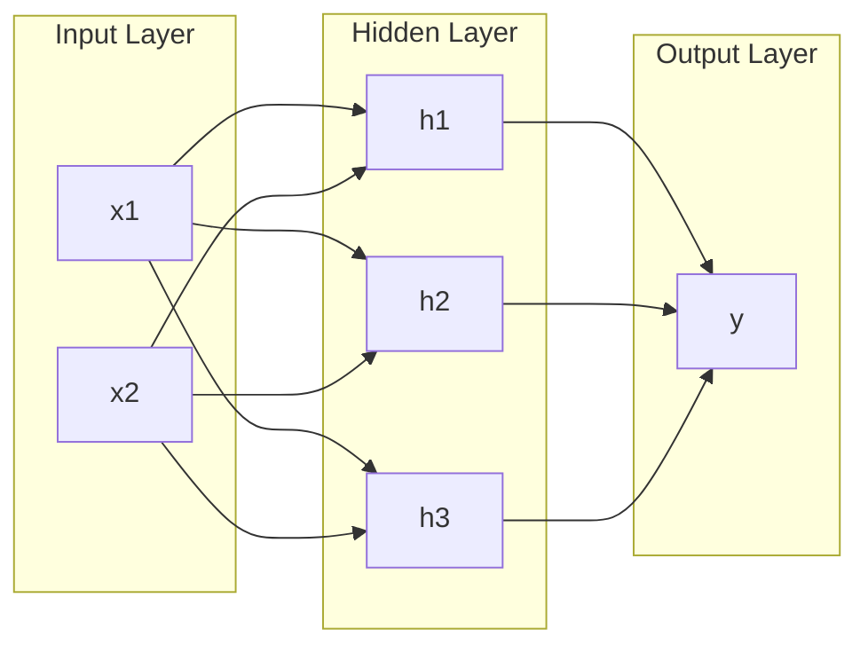

**Activation Functions:**

| Function | Formula | Use |
| :--- | :--- | :--- |
| **Sigmoid** | $\frac{1}{1+e^{-x}}$ | Binary output |
| **ReLU** | $\max(0, x)$ | Hidden layers (default) |
| **Softmax** | $\frac{e^{x_i}}{\sum e^{x_j}}$ | Multi-class output |

```python
from sklearn.neural_network import MLPClassifier

mlp = MLPClassifier(hidden_layer_sizes=(100, 50), activation='relu', max_iter=500)
mlp.fit(X_train, y_train)
print(f"Accuracy: {mlp.score(X_test, y_test)}")
```

---

## 7️⃣ Practical ML Pipeline

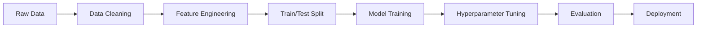

```python
from sklearn.pipeline import Pipeline
from sklearn.preprocessing import StandardScaler
from sklearn.ensemble import RandomForestClassifier

pipeline = Pipeline([
    ('scaler', StandardScaler()),
    ('classifier', RandomForestClassifier(n_estimators=100))
])

pipeline.fit(X_train, y_train)
print(f"Test Accuracy: {pipeline.score(X_test, y_test)}")
```

---

## 8️⃣ Feature Engineering

The art of creating meaningful features from raw data to improve model performance.

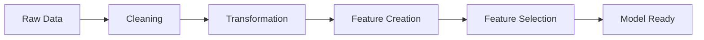

### Data Cleaning

```python
import pandas as pd
import numpy as np

df = pd.DataFrame({
    'age': [25, np.nan, 35, 45, np.nan],
    'salary': [50000, 60000, np.nan, 80000, 90000],
    'city': ['NYC', 'LA', 'NYC', None, 'LA']
})

# Handle missing values
df['age'].fillna(df['age'].median(), inplace=True)           # Median for numeric
df['salary'].fillna(df['salary'].mean(), inplace=True)       # Mean for numeric
df['city'].fillna(df['city'].mode()[0], inplace=True)        # Mode for categorical

# Remove duplicates
df.drop_duplicates(inplace=True)

# Handle outliers (IQR method)
Q1, Q3 = df['salary'].quantile([0.25, 0.75])
IQR = Q3 - Q1
df = df[(df['salary'] >= Q1 - 1.5*IQR) & (df['salary'] <= Q3 + 1.5*IQR)]
```

### Feature Scaling

| Method | Formula | When to Use |
| :--- | :--- | :--- |
| **StandardScaler** | $z = \frac{x - \mu}{\sigma}$ | Gradient-based (NN, SVM, LR) |
| **MinMaxScaler** | $z = \frac{x - x_{min}}{x_{max} - x_{min}}$ | Bounded range [0,1] |
| **RobustScaler** | $z = \frac{x - median}{IQR}$ | Data with outliers |

```python
from sklearn.preprocessing import StandardScaler, MinMaxScaler, RobustScaler

scaler = StandardScaler()
X_scaled = scaler.fit_transform(X)
```

### Encoding Categorical Variables

```python
from sklearn.preprocessing import LabelEncoder, OneHotEncoder
import pandas as pd

# Label Encoding (ordinal categories)
le = LabelEncoder()
df['size_encoded'] = le.fit_transform(df['size'])  # S=0, M=1, L=2

# One-Hot Encoding (nominal categories)
df_encoded = pd.get_dummies(df, columns=['city'], drop_first=True)

# Target Encoding (for high cardinality)
target_means = df.groupby('category')['target'].mean()
df['category_encoded'] = df['category'].map(target_means)
```

### Feature Creation

```python
# Polynomial Features
from sklearn.preprocessing import PolynomialFeatures

poly = PolynomialFeatures(degree=2, include_bias=False)
X_poly = poly.fit_transform(X)  # Creates x1, x2, x1^2, x2^2, x1*x2

# Date Features
df['date'] = pd.to_datetime(df['date'])
df['year'] = df['date'].dt.year
df['month'] = df['date'].dt.month
df['day_of_week'] = df['date'].dt.dayofweek
df['is_weekend'] = df['day_of_week'].isin([5, 6]).astype(int)

# Text Features (Bag of Words)
from sklearn.feature_extraction.text import TfidfVectorizer

tfidf = TfidfVectorizer(max_features=1000)
X_text = tfidf.fit_transform(df['text'])

# Binning
df['age_group'] = pd.cut(df['age'], bins=[0, 18, 35, 50, 100], labels=['child', 'young', 'middle', 'senior'])
```

### Feature Selection

```python
from sklearn.feature_selection import SelectKBest, f_classif, RFE
from sklearn.ensemble import RandomForestClassifier

# 1. Filter Method (Statistical)
selector = SelectKBest(f_classif, k=10)
X_selected = selector.fit_transform(X, y)

# 2. Wrapper Method (RFE - Recursive Feature Elimination)
rfe = RFE(RandomForestClassifier(), n_features_to_select=10)
X_rfe = rfe.fit_transform(X, y)

# 3. Embedded Method (Feature Importance from model)
rf = RandomForestClassifier().fit(X, y)
importances = pd.Series(rf.feature_importances_, index=feature_names).sort_values(ascending=False)
top_features = importances.head(10).index.tolist()
```

---

## 9️⃣ Regularization

Prevents **overfitting** by penalizing large weights.

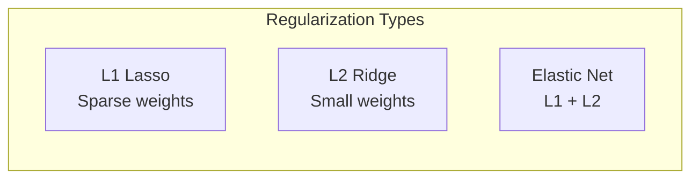

### L1 Regularization (Lasso)

Adds absolute value of weights to loss. **Creates sparse models** (some weights become 0).

$$J(w) = MSE + \lambda \sum |w_i|$$

```python
from sklearn.linear_model import Lasso

lasso = Lasso(alpha=0.1)  # alpha = λ
lasso.fit(X_train, y_train)
print(f"Non-zero coefficients: {np.sum(lasso.coef_ != 0)}")
```

### L2 Regularization (Ridge)

Adds squared weights to loss. **Shrinks weights but keeps all**.

$$J(w) = MSE + \lambda \sum w_i^2$$

```python
from sklearn.linear_model import Ridge

ridge = Ridge(alpha=1.0)
ridge.fit(X_train, y_train)
```

### Elastic Net

Combines L1 and L2.

$$J(w) = MSE + \lambda_1 \sum |w_i| + \lambda_2 \sum w_i^2$$

```python
from sklearn.linear_model import ElasticNet

elastic = ElasticNet(alpha=0.1, l1_ratio=0.5)  # l1_ratio: balance between L1/L2
elastic.fit(X_train, y_train)
```

### Regularization in Neural Networks

```python
from tensorflow.keras.layers import Dense, Dropout
from tensorflow.keras.regularizers import l2

# L2 Regularization
model.add(Dense(64, activation='relu', kernel_regularizer=l2(0.01)))

# Dropout (randomly drops neurons during training)
model.add(Dropout(0.5))  # 50% dropout rate
```

| Technique | Effect | When to Use |
| :--- | :--- | :--- |
| **L1 (Lasso)** | Feature selection | Many irrelevant features |
| **L2 (Ridge)** | Shrinks all weights | Multicollinearity |
| **Dropout** | Prevents co-adaptation | Neural networks |
| **Early Stopping** | Stops before overfitting | Any iterative model |

---

## 🔟 Time Series Analysis

Data indexed by time, where order matters.

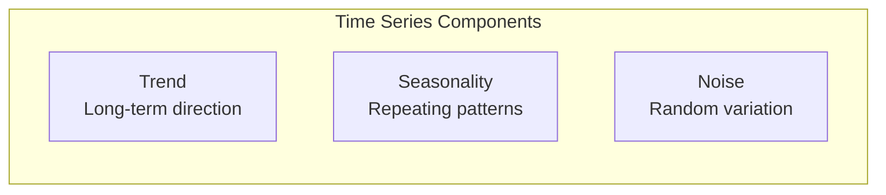

### Key Concepts

| Concept | Description |
| :--- | :--- |
| **Stationarity** | Mean and variance don't change over time |
| **Autocorrelation** | Correlation with past values |
| **Lag Features** | Using past values as features |
| **Rolling Statistics** | Moving averages, moving std |

### Stationarity Check

```python
from statsmodels.tsa.stattools import adfuller

result = adfuller(series)
print(f"ADF Statistic: {result[0]}")
print(f"p-value: {result[1]}")
if result[1] < 0.05:
    print("Series is stationary")
else:
    print("Series is non-stationary - apply differencing")
```

### Feature Engineering for Time Series

```python
# Lag Features
df['lag_1'] = df['value'].shift(1)
df['lag_7'] = df['value'].shift(7)

# Rolling Window Features
df['rolling_mean_7'] = df['value'].rolling(window=7).mean()
df['rolling_std_7'] = df['value'].rolling(window=7).std()

# Expanding Window
df['expanding_mean'] = df['value'].expanding().mean()

# Difference (for stationarity)
df['diff_1'] = df['value'].diff(1)
```

### ARIMA Model

**AutoRegressive Integrated Moving Average**

$$ARIMA(p, d, q)$$

- **p**: AR (autoregressive) terms
- **d**: Differencing order
- **q**: MA (moving average) terms

```python
from statsmodels.tsa.arima.model import ARIMA

# Fit ARIMA
model = ARIMA(train_series, order=(2, 1, 2))
fitted = model.fit()

# Forecast
forecast = fitted.forecast(steps=30)
```

### Prophet (Facebook)

```python
from prophet import Prophet

df_prophet = df.rename(columns={'date': 'ds', 'value': 'y'})

model = Prophet(yearly_seasonality=True, weekly_seasonality=True)
model.fit(df_prophet)

future = model.make_future_dataframe(periods=30)
forecast = model.predict(future)
```

### LSTM for Time Series

```python
from tensorflow.keras.models import Sequential
from tensorflow.keras.layers import LSTM, Dense

# Reshape for LSTM: (samples, timesteps, features)
X_train = X_train.reshape((X_train.shape[0], X_train.shape[1], 1))

model = Sequential([
    LSTM(50, activation='relu', input_shape=(n_steps, 1)),
    Dense(1)
])
model.compile(optimizer='adam', loss='mse')
model.fit(X_train, y_train, epochs=100, batch_size=32)
```

---

## 1️⃣1️⃣ Hyperparameter Tuning

Finding the best model configuration.

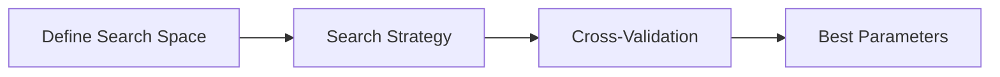

### Grid Search

Exhaustively tries all combinations.

```python
from sklearn.model_selection import GridSearchCV

param_grid = {
    'n_estimators': [50, 100, 200],
    'max_depth': [3, 5, 10, None],
    'min_samples_split': [2, 5, 10]
}

grid_search = GridSearchCV(
    RandomForestClassifier(),
    param_grid,
    cv=5,
    scoring='accuracy',
    n_jobs=-1
)
grid_search.fit(X_train, y_train)

print(f"Best params: {grid_search.best_params_}")
print(f"Best score: {grid_search.best_score_}")
```

### Random Search

Samples random combinations (more efficient).

```python
from sklearn.model_selection import RandomizedSearchCV
from scipy.stats import randint, uniform

param_dist = {
    'n_estimators': randint(50, 500),
    'max_depth': randint(3, 20),
    'min_samples_split': randint(2, 20),
    'learning_rate': uniform(0.01, 0.3)
}

random_search = RandomizedSearchCV(
    XGBClassifier(),
    param_dist,
    n_iter=100,
    cv=5,
    scoring='f1',
    n_jobs=-1
)
random_search.fit(X_train, y_train)
```

### Bayesian Optimization (Optuna)

Uses probabilistic model to find optimal params faster.

```python
import optuna

def objective(trial):
    params = {
        'n_estimators': trial.suggest_int('n_estimators', 50, 500),
        'max_depth': trial.suggest_int('max_depth', 3, 20),
        'learning_rate': trial.suggest_float('learning_rate', 0.01, 0.3)
    }
    
    model = XGBClassifier(**params)
    score = cross_val_score(model, X, y, cv=5, scoring='f1').mean()
    return score

study = optuna.create_study(direction='maximize')
study.optimize(objective, n_trials=100)

print(f"Best params: {study.best_params}")
```

| Method | Pros | Cons |
| :--- | :--- | :--- |
| **Grid Search** | Exhaustive | Slow for large spaces |
| **Random Search** | Faster, good for many params | May miss optimal |
| **Bayesian (Optuna)** | Efficient, learns from trials | More complex |

---

## 1️⃣2️⃣ Handling Imbalanced Data

When one class dominates (e.g., 95% negative, 5% positive).

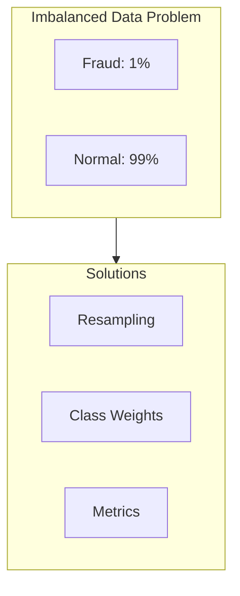

### Resampling Techniques

```python
from imblearn.over_sampling import SMOTE, RandomOverSampler
from imblearn.under_sampling import RandomUnderSampler

# Oversampling (increase minority)
smote = SMOTE(random_state=42)
X_resampled, y_resampled = smote.fit_resample(X, y)

# Undersampling (decrease majority)
rus = RandomUnderSampler(random_state=42)
X_resampled, y_resampled = rus.fit_resample(X, y)

# Combination
from imblearn.combine import SMOTETomek
smt = SMOTETomek(random_state=42)
X_resampled, y_resampled = smt.fit_resample(X, y)
```

### Class Weights

```python
from sklearn.ensemble import RandomForestClassifier

# Auto-compute weights inversely proportional to class frequency
rf = RandomForestClassifier(class_weight='balanced')
rf.fit(X_train, y_train)

# Manual weights
rf = RandomForestClassifier(class_weight={0: 1, 1: 10})  # 10x weight to minority
```

### Threshold Tuning

```python
from sklearn.metrics import precision_recall_curve

# Get predicted probabilities
y_proba = model.predict_proba(X_test)[:, 1]

# Find optimal threshold
precisions, recalls, thresholds = precision_recall_curve(y_test, y_proba)

# Choose threshold based on business needs
# e.g., Maximize F1
f1_scores = 2 * (precisions * recalls) / (precisions + recalls + 1e-10)
optimal_threshold = thresholds[np.argmax(f1_scores)]

y_pred = (y_proba >= optimal_threshold).astype(int)
```

### Use Appropriate Metrics

**Never use Accuracy for imbalanced data!**

| Metric | Formula | Use Case |
| :--- | :--- | :--- |
| **Precision** | $\frac{TP}{TP+FP}$ | Cost of false positives high |
| **Recall** | $\frac{TP}{TP+FN}$ | Cost of false negatives high (Fraud) |
| **F1-Score** | Harmonic mean | Balance precision/recall |
| **AUC-ROC** | Area under ROC | Overall ranking ability |
| **AUC-PR** | Area under PR curve | Better for imbalanced |

```python
from sklearn.metrics import roc_auc_score, average_precision_score

print(f"ROC-AUC: {roc_auc_score(y_test, y_proba)}")
print(f"PR-AUC: {average_precision_score(y_test, y_proba)}")
```

---

## 📚 Quick Reference

| Algorithm | Type | Best For |
| :--- | :--- | :--- |
| **Linear Regression** | Supervised | Continuous prediction |
| **Logistic Regression** | Supervised | Binary classification |
| **Decision Tree** | Supervised | Interpretable rules |
| **Random Forest** | Ensemble | Tabular data |
| **XGBoost** | Ensemble | Competitions, High accuracy |
| **SVM** | Supervised | Small datasets, High dim |
| **K-Means** | Unsupervised | Clustering |
| **PCA** | Unsupervised | Dimensionality reduction |
| **Neural Network** | Supervised | Complex patterns |
| **ARIMA** | Time Series | Stationary data |
| **LSTM** | Time Series | Sequential patterns |

---

## 🧪 Interview Questions with Answers

### 1. What's the difference between L1 and L2 regularization?

**L1 (Lasso)** adds the absolute value of weights to the loss: $\lambda \sum |w_i|$
- Creates **sparse models** (some weights become exactly 0)
- Acts as **feature selection** - removes irrelevant features
- Use when you suspect many features are irrelevant

**L2 (Ridge)** adds the squared weights: $\lambda \sum w_i^2$
- **Shrinks all weights** toward zero but keeps them non-zero
- Better when all features contribute somewhat
- More stable when features are correlated

**Key Insight**: L1 produces corners in the constraint region (diamond shape), making it more likely to hit axis intersections (zero weights). L2's circular constraint rarely touches axes exactly.

---

### 2. How do you handle missing values?

**Strategy depends on the situation:**

| Method | When to Use |
| :--- | :--- |
| **Drop rows** | < 5% missing, random missingness |
| **Mean/Median imputation** | Numerical, random missingness |
| **Mode imputation** | Categorical features |
| **Indicator variable** | Missingness itself is informative |
| **KNN imputation** | Values depend on similar samples |
| **Model-based (MICE)** | Complex patterns |

**Best Practice**: Always create a binary flag `feature_is_missing` before imputing - the fact that data is missing often carries information!

```python
df['age_missing'] = df['age'].isna().astype(int)
df['age'] = df['age'].fillna(df['age'].median())
```

---

### 3. Explain the bias-variance tradeoff.

**Bias** = Error from oversimplified assumptions (underfitting)
- Model is too simple to capture patterns
- High training error AND high test error

**Variance** = Error from sensitivity to training data fluctuations (overfitting)
- Model memorizes training data, fails on new data
- Low training error BUT high test error

**Total Error** = Bias² + Variance + Irreducible Noise

```
High Bias (Underfit)     Optimal          High Variance (Overfit)
     |                      |                      |
Simple Model ──────────────────────────────> Complex Model
```

**How to fix**:
- High Bias → More features, more complex model, less regularization
- High Variance → More data, regularization, dropout, simpler model

---

### 4. When would you use Random Forest vs XGBoost?

| Aspect | Random Forest | XGBoost |
| :--- | :--- | :--- |
| **Speed** | Parallelizable, faster training | Sequential, slower |
| **Accuracy** | Good baseline | Often higher accuracy |
| **Overfitting** | Less prone (bagging) | Can overfit, needs tuning |
| **Hyperparameters** | Few to tune | Many to tune |
| **Missing values** | Needs imputation | Handles natively |
| **Interpretability** | Feature importance | SHAP values |

**Use Random Forest when**:
- You need a quick, robust baseline
- Limited time for hyperparameter tuning
- Overfitting is a concern

**Use XGBoost when**:
- Maximum accuracy is critical
- You have time for tuning
- Kaggle competitions!

---

### 5. How do you handle imbalanced datasets?

**Techniques (from simplest to most complex):**

1. **Class Weights**: Penalize misclassifying minority class more
```python
model = RandomForestClassifier(class_weight='balanced')
```

2. **Oversampling (SMOTE)**: Create synthetic minority samples
```python
from imblearn.over_sampling import SMOTE
X_resampled, y_resampled = SMOTE().fit_resample(X, y)
```

3. **Undersampling**: Reduce majority class (loses information)

4. **Threshold Tuning**: Adjust decision threshold based on precision-recall curve

5. **Use Proper Metrics**: Never use accuracy!
   - Use **Precision, Recall, F1, AUC-PR** instead

**Rule of Thumb**: Start with class weights, try SMOTE if needed, always use proper metrics.

---

### 6. What's the difference between bagging and boosting?

**Bagging (Bootstrap Aggregating)** - Random Forest
- Train models **in parallel** on random subsets of data
- Each model is **independent**
- Final prediction = **average/vote**
- Reduces **variance** (overfitting)

**Boosting** - XGBoost, AdaBoost
- Train models **sequentially**
- Each model **corrects errors** of previous ones
- Final prediction = **weighted sum**
- Reduces **bias** (underfitting)

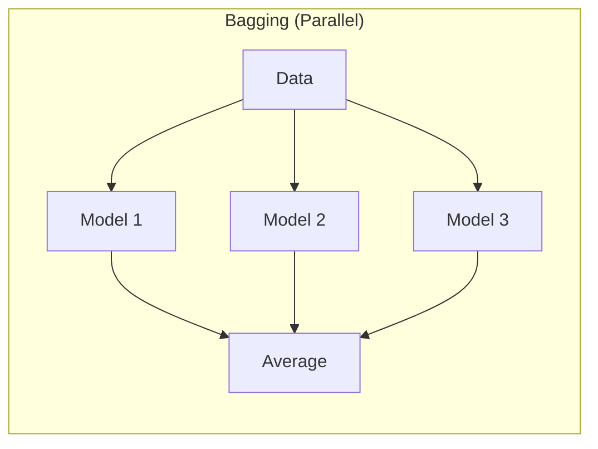

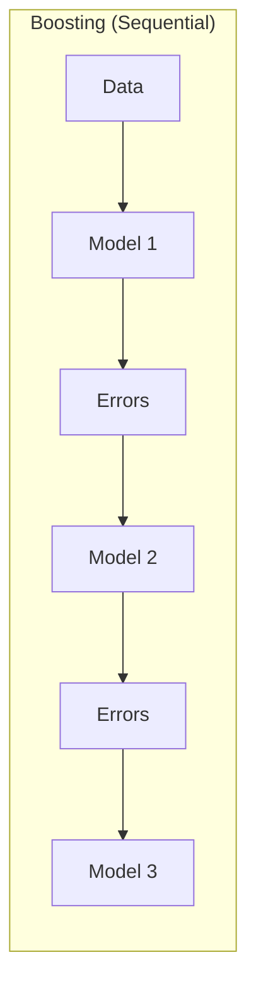

---

### 7. How do you detect overfitting?

**Signs of overfitting**:
- Training accuracy >> Validation accuracy
- Validation loss starts increasing while training loss decreases
- Model performs well on training data but poorly on new data

**Detection methods**:

1. **Train/Validation Learning Curves**
```python
# Plot both curves - divergence indicates overfitting
plt.plot(train_losses, label='Train')
plt.plot(val_losses, label='Validation')
```

2. **Cross-Validation**: Large variance across folds suggests overfitting

3. **Holdout Test Set**: Final check on unseen data

**How to fix**:
- Add regularization (L1/L2, Dropout)
- Get more training data
- Simplify model architecture
- Early stopping
- Data augmentation

---

### 8. Explain cross-validation.

**Cross-validation** estimates model performance on unseen data by splitting training data into multiple folds.

**K-Fold CV** (most common, K=5 or 10):
1. Split data into K equal folds
2. For each fold i:
   - Train on K-1 folds
   - Validate on fold i
3. Average scores across all folds

**Benefits**:
- Uses all data for both training and validation
- More reliable estimate than single train/test split
- Detects overfitting through variance across folds

```python
from sklearn.model_selection import cross_val_score

scores = cross_val_score(model, X, y, cv=5, scoring='accuracy')
print(f"Mean: {scores.mean():.3f} (+/- {scores.std():.3f})")
```

**Variants**:
- **Stratified K-Fold**: Maintains class distribution (use for classification)
- **Leave-One-Out**: K = n samples (expensive but unbiased)
- **Time Series Split**: Respects temporal order

---

### 9. What's feature scaling and when is it needed?

**Feature scaling** normalizes feature ranges to prevent large-value features from dominating.

**When it's NEEDED**:
- **Distance-based**: KNN, K-Means, SVM
- **Gradient-based**: Neural Networks, Logistic Regression
- **Regularization**: L1/L2 penalize based on magnitude

**When it's NOT needed**:
- Tree-based models (Random Forest, XGBoost) - they split on thresholds, not magnitudes

**Common methods**:

| Method | Formula | Result |
| :--- | :--- | :--- |
| **StandardScaler** | $(x - \mu) / \sigma$ | Mean=0, Std=1 |
| **MinMaxScaler** | $(x - min) / (max - min)$ | Range [0, 1] |
| **RobustScaler** | $(x - median) / IQR$ | Robust to outliers |

```python
from sklearn.preprocessing import StandardScaler

scaler = StandardScaler()
X_train_scaled = scaler.fit_transform(X_train)
X_test_scaled = scaler.transform(X_test)  # Use same scaler!
```

---

### 10. How do you select features?

**Three main approaches**:

**1. Filter Methods** (Fast, independent of model)
- Correlation with target
- Chi-squared test
- Mutual information
```python
from sklearn.feature_selection import SelectKBest, f_classif
selector = SelectKBest(f_classif, k=10)
X_selected = selector.fit_transform(X, y)
```

**2. Wrapper Methods** (Slower, model-specific)
- Recursive Feature Elimination (RFE)
- Forward/Backward selection
```python
from sklearn.feature_selection import RFE
rfe = RFE(estimator=RandomForestClassifier(), n_features_to_select=10)
X_selected = rfe.fit_transform(X, y)
```

**3. Embedded Methods** (Built into model training)
- L1 regularization (Lasso) - zeros out features
- Tree-based feature importance
```python
rf = RandomForestClassifier().fit(X, y)
importances = pd.Series(rf.feature_importances_, index=feature_names)
top_features = importances.nlargest(10).index.tolist()
```

**Best Practice**: Start with correlation analysis, use tree-based importance, then refine with RFE if needed.

---

*From Data to Intelligence! 🧠*

