[🏠 Home](../../../../README.md) | [⬅️ Spring Ecosystem](./ecosystem-deep-dive.md) | [➡️ Kafka Deep Dive](../messaging/kafka-deep-dive.md)

# 🤖 Spring AI Deep Dive (2026 Edition)

> From Simple Chat to Production Multi-Agent Systems

---

## 📋 Table of Contents

1. [Introduction & Architecture](#-introduction--architecture)
2. [Core Concepts](#-core-concepts)
3. [Providers & Models](#-providers--models)
4. [Advanced Prompting](#-advanced-prompting)
5. [RAG Deep Dive](#-rag-deep-dive)
6. [Function Calling & Tool Use](#-function-calling--tool-use)
7. [Multi-Agent Systems](#-multi-agent-systems)
8. [Observability & Evaluation](#-observability--evaluation)
9. [Production Patterns](#-production-patterns)
10. [Interview Questions](#-interview-questions)

---

## 🌐 Introduction & Architecture

Spring AI provides a unified API for integrating AI capabilities into Spring applications, abstracting away provider-specific implementations.

### High-Level Architecture


### Version & Compatibility Matrix (2026)

| Component | Version | Java | Spring Boot |
|-----------|---------|------|-------------|
| Spring AI | 1.0.0+ | 21+ | 3.4+ |
| OpenAI Starter | 1.0.0+ | 21+ | 3.4+ |
| Vertex AI Starter | 1.0.0+ | 21+ | 3.4+ |
| PGVector Store | 1.0.0+ | 21+ | 3.4+ |

---

## 🎯 Core Concepts

### ChatClient - The Central API

```java
@Service
public class ChatService {

    private final ChatClient chatClient;

    public ChatService(ChatClient.Builder builder) {
        this.chatClient = builder
            .defaultSystem("You are a helpful assistant for an e-commerce platform.")
            .defaultFunctions("searchProducts", "checkInventory", "processOrder")
            .defaultAdvisors(
                new MessageChatMemoryAdvisor(new InMemoryChatMemory()),
                new QuestionAnswerAdvisor(vectorStore))
            .build();
    }

    // Simple text response
    public String askQuestion(String question) {
        return chatClient.prompt()
            .user(question)
            .call()
            .content();
    }

    // Structured output with type safety
    public ProductRecommendation getRecommendation(String userQuery) {
        return chatClient.prompt()
            .user("Recommend a product for: " + userQuery)
            .call()
            .entity(ProductRecommendation.class);
    }

    // Streaming response (Server-Sent Events)
    public Flux<String> streamAnswer(String question) {
        return chatClient.prompt()
            .user(question)
            .stream()
            .content();
    }

    // With conversation memory
    public String chat(String sessionId, String message) {
        return chatClient.prompt()
            .advisors(advisor -> advisor
                .param(CHAT_MEMORY_CONVERSATION_ID_KEY, sessionId))
            .user(message)
            .call()
            .content();
    }
}
```

### Response Types

| Method | Return Type | Use Case |
|--------|-------------|----------|
| `.content()` | `String` | Plain text response |
| `.entity(Class)` | Typed object | JSON → Java object |
| `.entity(ParameterizedTypeReference)` | Generic types | `List<Product>`, `Map<>` |
| `.chatResponse()` | `ChatResponse` | Full response with metadata |
| `.stream().content()` | `Flux<String>` | Streaming text |

### Structured Output Examples

```java
// Simple record
public record ProductReview(
    String sentiment,     // POSITIVE, NEGATIVE, NEUTRAL
    double confidence,    // 0.0 to 1.0
    List<String> topics,  // key topics mentioned
    String summary        // brief summary
) {}

// Nested structure
public record OrderAnalysis(
    OrderStatus status,
    List<Issue> issues,
    RecommendedAction action
) {
    public record Issue(String type, String description, Priority priority) {}
    public record RecommendedAction(String action, String reason) {}
}

// Usage
OrderAnalysis analysis = chatClient.prompt()
    .system("Analyze customer orders and identify issues")
    .user("Order #12345: Customer complained about delayed delivery, wrong item color")
    .call()
    .entity(OrderAnalysis.class);
```

---

## 🔌 Providers & Models

### Provider Configuration

```yaml
# application.yml
spring:
  ai:
    # OpenAI Configuration
    openai:
      api-key: ${OPENAI_API_KEY}
      chat:
        options:
          model: gpt-4o
          temperature: 0.7
          max-tokens: 4096
      embedding:
        options:
          model: text-embedding-3-large

    # Google Gemini Configuration
    vertex-ai:
      gemini:
        project-id: ${GCP_PROJECT_ID}
        location: us-central1
        chat:
          options:
            model: gemini-1.5-pro
            temperature: 0.5

    # Anthropic Claude
    anthropic:
      api-key: ${ANTHROPIC_API_KEY}
      chat:
        options:
          model: claude-3-5-sonnet-20241022

    # Local Ollama
    ollama:
      base-url: http://localhost:11434
      chat:
        options:
          model: llama3.2
```

### Multi-Provider Setup

```java
@Configuration
public class MultiProviderConfig {

    @Bean
    @Primary
    public ChatClient primaryChatClient(OpenAiChatModel openAiModel) {
        return ChatClient.builder(openAiModel)
            .defaultSystem("You are a helpful assistant.")
            .build();
    }

    @Bean
    @Qualifier("gemini")
    public ChatClient geminiChatClient(VertexAiGeminiChatModel geminiModel) {
        return ChatClient.builder(geminiModel)
            .defaultSystem("You are a creative assistant.")
            .build();
    }

    @Bean
    @Qualifier("claude")
    public ChatClient claudeChatClient(AnthropicChatModel claudeModel) {
        return ChatClient.builder(claudeModel)
            .defaultSystem("You are an analytical assistant.")
            .build();
    }

    @Bean
    @Qualifier("local")
    public ChatClient localChatClient(OllamaChatModel ollamaModel) {
        return ChatClient.builder(ollamaModel)
            .defaultSystem("You are a code assistant.")
            .build();
    }
}

// Usage with provider selection
@Service
public class SmartChatService {

    private final Map<String, ChatClient> clients;

    public String chat(String provider, String message) {
        return clients.get(provider)
            .prompt()
            .user(message)
            .call()
            .content();
    }

    // Fallback chain
    public String chatWithFallback(String message) {
        try {
            return clients.get("openai").prompt().user(message).call().content();
        } catch (Exception e) {
            return clients.get("local").prompt().user(message).call().content();
        }
    }
}
```

### Model Comparison

| Provider | Model | Strengths | Cost |
|----------|-------|-----------|------|
| OpenAI | GPT-4o | General purpose, vision, code | $$$ |
| OpenAI | GPT-4o-mini | Fast, cost-effective | $ |
| Google | Gemini 1.5 Pro | Long context (1M), multimodal | $$ |
| Anthropic | Claude 3.5 Sonnet | Reasoning, code, safety | $$ |
| Ollama | Llama 3.2 | Privacy, offline, free | Free |
| AWS Bedrock | Various | Enterprise, compliance | Varies |

---

## 📝 Advanced Prompting

### Prompt Templates

```java
@Service
public class PromptTemplateService {

    @Value("classpath:/prompts/customer-support.st")
    private Resource supportPrompt;

    @Value("classpath:/prompts/code-review.st")
    private Resource codeReviewPrompt;

    private final ChatClient chatClient;

    // StringTemplate-based (.st files)
    public String handleSupportQuery(SupportTicket ticket) {
        return chatClient.prompt()
            .user(u -> u
                .text(supportPrompt)
                .param("customerName", ticket.customerName())
                .param("issue", ticket.description())
                .param("orderHistory", ticket.orderHistory())
                .param("priority", ticket.priority()))
            .call()
            .content();
    }

    // Programmatic prompt building
    public String reviewCode(String code, String language) {
        String systemPrompt = """
            You are a senior software engineer conducting a code review.
            Focus on:
            1. Code quality and readability
            2. Potential bugs and edge cases
            3. Performance considerations
            4. Security vulnerabilities
            5. Best practices for {language}

            Provide specific, actionable feedback with code examples.
            """.replace("{language}", language);

        return chatClient.prompt()
            .system(systemPrompt)
            .user("Review this code:\n```%s\n%s\n```".formatted(language, code))
            .call()
            .content();
    }
}
```

**Template File (customer-support.st):**
```
You are a customer support specialist for an e-commerce platform.

Customer: {customerName}
Issue: {issue}
Priority: {priority}

Order History:
{orderHistory}

Instructions:
1. Address the customer by name
2. Acknowledge their issue empathetically
3. Provide a solution or next steps
4. If escalation is needed, explain why

Response should be professional, helpful, and concise.
```

### System Prompts Best Practices

```java
@Configuration
public class PromptConfiguration {

    // Use clear role definition
    public static final String ANALYST_SYSTEM = """
        You are a data analyst assistant. Your responsibilities:
        
        ## Core Behaviors
        - Provide data-driven insights
        - Use precise metrics and percentages
        - Cite specific data points when making claims
        - Acknowledge uncertainty when data is insufficient
        
        ## Output Format
        - Use bullet points for clarity
        - Include a summary section at the end
        - Format numbers with appropriate precision
        
        ## Constraints
        - Never make up data
        - Always ask for clarification if query is ambiguous
        - Reference the provided context only
        """;

    // Chain-of-thought prompting
    public static final String REASONING_SYSTEM = """
        You are a problem-solving assistant. For each question:
        
        1. **Understand**: Restate the problem in your own words
        2. **Plan**: Outline your approach step by step
        3. **Execute**: Work through each step
        4. **Verify**: Check your answer
        5. **Conclude**: Provide the final answer clearly
        
        Show your reasoning at each step.
        """;

    // Few-shot example in system prompt
    public static final String CLASSIFICATION_SYSTEM = """
        Classify customer feedback into categories.
        
        Example 1:
        Input: "The package arrived damaged and the product was broken"
        Output: {"category": "SHIPPING_ISSUE", "subcategory": "DAMAGED", "sentiment": "NEGATIVE"}
        
        Example 2:
        Input: "Love this product! Will definitely buy again"
        Output: {"category": "PRODUCT_FEEDBACK", "subcategory": "POSITIVE_REVIEW", "sentiment": "POSITIVE"}
        
        Example 3:
        Input: "How do I track my order?"
        Output: {"category": "INQUIRY", "subcategory": "ORDER_STATUS", "sentiment": "NEUTRAL"}
        
        Classify the following feedback:
        """;
}
```

---

## 📚 RAG Deep Dive

### RAG Architecture

```mermaid
flowchart TB
    subgraph Ingestion["📥 Document Ingestion Pipeline"]
        DOC[Documents] --> LOAD[Document Loader]
        LOAD --> SPLIT[Text Splitter]
        SPLIT --> ENRICH[Metadata Enrichment]
        ENRICH --> EMBED[Embedding Model]
        EMBED --> STORE[(Vector Store)]
    end

    subgraph Query["🔍 Query Pipeline"]
        Q[User Query] --> QEMBED[Query Embedding]
        QEMBED --> SEARCH[Vector Search]
        SEARCH --> STORE
        STORE --> RERANK[Re-Ranker]
        RERANK --> CONTEXT[Context Builder]
    end

    subgraph Generation["💡 Generation Pipeline"]
        CONTEXT --> PROMPT[Prompt Assembly]
        Q --> PROMPT
        PROMPT --> LLM[LLM]
        LLM --> ANSWER[Answer]
        ANSWER --> CITE[Citation Extractor]
    end
```



### Complete RAG Implementation

```java
@Configuration
public class RAGConfiguration {

    @Bean
    public VectorStore vectorStore(EmbeddingModel embeddingModel, JdbcTemplate jdbcTemplate) {
        return PgVectorStore.builder(jdbcTemplate, embeddingModel)
            .dimensions(1536)  // Match embedding model dimensions
            .distanceType(PgVectorStore.PgDistanceType.COSINE_DISTANCE)
            .indexType(PgVectorStore.PgIndexType.HNSW)
            .initializeSchema(true)
            .build();
    }

    @Bean
    public TokenTextSplitter textSplitter() {
        return new TokenTextSplitter(
            800,    // chunk size (tokens)
            200,    // overlap
            5,      // min chunk size
            10000,  // max chunks
            true    // keep separator
        );
    }

    @Bean
    public DocumentReader pdfReader() {
        return new PagePdfDocumentReader();
    }
}

@Service
public class DocumentIngestionService {

    private final VectorStore vectorStore;
    private final TokenTextSplitter textSplitter;
    private final EmbeddingModel embeddingModel;

    @Transactional
    public IngestionResult ingestDocument(Resource resource, DocumentMetadata metadata) {
        // 1. Load document
        List<Document> documents = loadDocument(resource, metadata);

        // 2. Split into chunks
        List<Document> chunks = textSplitter.apply(documents);

        // 3. Enrich with metadata
        enrichMetadata(chunks, metadata);

        // 4. Store embeddings
        vectorStore.add(chunks);

        return new IngestionResult(
            metadata.documentId(),
            chunks.size(),
            Instant.now()
        );
    }

    private List<Document> loadDocument(Resource resource, DocumentMetadata metadata) {
        String filename = resource.getFilename().toLowerCase();

        if (filename.endsWith(".pdf")) {
            return new PagePdfDocumentReader(resource).get();
        } else if (filename.endsWith(".docx")) {
            return new TikaDocumentReader(resource).get();
        } else if (filename.endsWith(".md") || filename.endsWith(".txt")) {
            return new TextReader(resource).get();
        }

        throw new UnsupportedDocumentException("Unsupported format: " + filename);
    }

    private void enrichMetadata(List<Document> chunks, DocumentMetadata metadata) {
        for (int i = 0; i < chunks.size(); i++) {
            Document chunk = chunks.get(i);
            chunk.getMetadata().put("documentId", metadata.documentId());
            chunk.getMetadata().put("source", metadata.source());
            chunk.getMetadata().put("category", metadata.category());
            chunk.getMetadata().put("chunkIndex", i);
            chunk.getMetadata().put("totalChunks", chunks.size());
            chunk.getMetadata().put("ingestedAt", Instant.now().toString());
        }
    }
}
```

### Advanced RAG Service

```java
@Service
public class AdvancedRAGService {

    private final ChatClient chatClient;
    private final VectorStore vectorStore;
    private final EmbeddingModel embeddingModel;

    public RAGResponse answer(String question, RAGOptions options) {
        // 1. Retrieve relevant documents
        SearchRequest searchRequest = SearchRequest.builder()
            .query(question)
            .topK(options.topK())
            .similarityThreshold(options.threshold())
            .filterExpression(buildFilter(options))
            .build();

        List<Document> documents = vectorStore.similaritySearch(searchRequest);

        // 2. Re-rank if enabled
        if (options.rerank()) {
            documents = rerank(question, documents, options.rerankTopK());
        }

        // 3. Build context with citations
        String context = buildContextWithCitations(documents);

        // 4. Generate answer
        String systemPrompt = """
            Answer the question based on the provided context.
            If the context doesn't contain enough information, say so.
            Always cite your sources using [Source N] format.
            
            Context:
            %s
            """.formatted(context);

        String answer = chatClient.prompt()
            .system(systemPrompt)
            .user(question)
            .call()
            .content();

        // 5. Extract and validate citations
        List<Citation> citations = extractCitations(answer, documents);

        return new RAGResponse(answer, citations, documents);
    }

    private String buildContextWithCitations(List<Document> documents) {
        StringBuilder context = new StringBuilder();
        for (int i = 0; i < documents.size(); i++) {
            Document doc = documents.get(i);
            context.append("[Source %d]: %s\n".formatted(i + 1, doc.getContent()));
            context.append("(From: %s)\n\n".formatted(doc.getMetadata().get("source")));
        }
        return context.toString();
    }

    private Filter.Expression buildFilter(RAGOptions options) {
        List<Filter.Expression> filters = new ArrayList<>();

        if (options.category() != null) {
            filters.add(new Filter.Expression(
                Filter.ExpressionType.EQ,
                new Filter.Key("category"),
                new Filter.Value(options.category())));
        }

        if (options.documentIds() != null && !options.documentIds().isEmpty()) {
            filters.add(new Filter.Expression(
                Filter.ExpressionType.IN,
                new Filter.Key("documentId"),
                new Filter.Value(options.documentIds())));
        }

        return filters.isEmpty() ? null :
            new Filter.Expression(Filter.ExpressionType.AND, filters.toArray(Filter.Expression[]::new));
    }
}
```

### Hybrid Search (Vector + Keyword)

```java
@Service
public class HybridSearchService {

    private final VectorStore vectorStore;
    private final ElasticsearchClient esClient;

    public List<Document> hybridSearch(String query, int topK) {
        // 1. Vector search
        List<Document> vectorResults = vectorStore.similaritySearch(
            SearchRequest.builder()
                .query(query)
                .topK(topK * 2)  // Get more for fusion
                .build()
        );

        // 2. Keyword search (BM25)
        List<Document> keywordResults = keywordSearch(query, topK * 2);

        // 3. Reciprocal Rank Fusion (RRF)
        return reciprocalRankFusion(vectorResults, keywordResults, topK);
    }

    private List<Document> reciprocalRankFusion(
            List<Document> list1,
            List<Document> list2,
            int k) {

        Map<String, Double> scores = new HashMap<>();
        int rrfK = 60;  // RRF constant

        // Score from list 1
        for (int i = 0; i < list1.size(); i++) {
            String id = list1.get(i).getId();
            scores.merge(id, 1.0 / (rrfK + i + 1), Double::sum);
        }

        // Score from list 2
        for (int i = 0; i < list2.size(); i++) {
            String id = list2.get(i).getId();
            scores.merge(id, 1.0 / (rrfK + i + 1), Double::sum);
        }

        // Sort by combined score and return top K
        Map<String, Document> allDocs = Stream.concat(list1.stream(), list2.stream())
            .collect(Collectors.toMap(Document::getId, d -> d, (a, b) -> a));

        return scores.entrySet().stream()
            .sorted(Map.Entry.<String, Double>comparingByValue().reversed())
            .limit(k)
            .map(e -> allDocs.get(e.getKey()))
            .toList();
    }
}
```

---

## 🔧 Function Calling & Tool Use

### Defining Functions

```java
@Configuration
public class AIFunctionConfig {

    @Bean
    @Description("Search for products in the catalog by name, category, or price range")
    public Function<ProductSearchRequest, List<Product>> searchProducts(
            ProductRepository productRepo) {
        return request -> productRepo.search(
            request.query(),
            request.category(),
            request.minPrice(),
            request.maxPrice(),
            request.limit()
        );
    }

    @Bean
    @Description("Get current inventory status for a product SKU")
    public Function<InventoryRequest, InventoryResponse> checkInventory(
            InventoryService inventoryService) {
        return request -> inventoryService.getInventory(request.sku());
    }

    @Bean
    @Description("Place an order for a customer")
    public Function<OrderRequest, OrderResponse> placeOrder(
            OrderService orderService) {
        return request -> orderService.createOrder(
            request.customerId(),
            request.items(),
            request.shippingAddress()
        );
    }

    @Bean
    @Description("Get current weather for a location")
    public Function<WeatherRequest, WeatherResponse> getWeather(
            WeatherClient weatherClient) {
        return request -> weatherClient.getCurrentWeather(
            request.location(),
            request.units()
        );
    }

    @Bean
    @Description("Execute a SQL query against the analytics database (read-only)")
    public Function<SQLQueryRequest, SQLQueryResponse> executeQuery(
            AnalyticsRepository analyticsRepo) {
        return request -> {
            // Validate query is read-only
            if (!isReadOnlyQuery(request.query())) {
                throw new SecurityException("Only SELECT queries are allowed");
            }
            List<Map<String, Object>> results = analyticsRepo.executeQuery(request.query());
            return new SQLQueryResponse(results, results.size());
        };
    }
}

// Request/Response records
public record ProductSearchRequest(
    @JsonProperty(required = true) String query,
    String category,
    BigDecimal minPrice,
    BigDecimal maxPrice,
    @JsonPropertyDescription("Maximum number of results (default 10)") Integer limit
) {}

public record InventoryRequest(
    @JsonProperty(required = true) String sku
) {}

public record InventoryResponse(
    String sku,
    int quantity,
    String warehouse,
    boolean inStock
) {}
```

### ChatClient with Functions

```java
@Service
public class ShoppingAssistant {

    private final ChatClient chatClient;

    public ShoppingAssistant(ChatClient.Builder builder) {
        this.chatClient = builder
            .defaultSystem("""
                You are a helpful shopping assistant for an e-commerce store.
                You can help customers:
                - Search for products
                - Check inventory availability
                - Place orders
                - Answer questions about products
                
                Use the available functions to get real-time information.
                Always confirm with the customer before placing orders.
                """)
            .defaultFunctions("searchProducts", "checkInventory", "placeOrder")
            .build();
    }

    public String assist(String sessionId, String userMessage) {
        return chatClient.prompt()
            .advisors(advisor -> advisor
                .param(CHAT_MEMORY_CONVERSATION_ID_KEY, sessionId))
            .user(userMessage)
            .call()
            .content();
    }
}
```

### Dynamic Function Registration

```java
@Service
public class DynamicFunctionService {

    private final ChatClient.Builder chatClientBuilder;

    public String executeWithCustomFunctions(String prompt, List<FunctionDefinition> functions) {
        ChatClient client = chatClientBuilder
            .defaultFunctions(functions.stream()
                .map(this::toFunctionCallback)
                .toArray(FunctionCallback[]::new))
            .build();

        return client.prompt()
            .user(prompt)
            .call()
            .content();
    }

    private FunctionCallback toFunctionCallback(FunctionDefinition def) {
        return FunctionCallback.builder()
            .name(def.name())
            .description(def.description())
            .inputType(def.inputType())
            .function(def.implementation())
            .build();
    }
}
```

---

## 🤖 Multi-Agent Systems

### Agent Architecture

```mermaid
flowchart TB
    subgraph Orchestrator["🎭 Orchestrator Agent"]
        PLAN[Planner]
        ROUTE[Router]
        SYNTH[Synthesizer]
    end

    subgraph Specialists["🔧 Specialist Agents"]
        SEARCH[Search Agent]
        ANALYST[Analyst Agent]
        WRITER[Writer Agent]
        CODER[Coder Agent]
    end

    subgraph Tools["🔨 Tools"]
        T1[Web Search]
        T2[Database]
        T3[File System]
        T4[Code Executor]
    end

    USER[User Query] --> Orchestrator
    PLAN --> ROUTE
    ROUTE --> Specialists
    SEARCH --> T1
    ANALYST --> T2
    WRITER --> T3
    CODER --> T4
    Specialists --> SYNTH
    SYNTH --> RESPONSE[Final Response]
```



### Multi-Agent Implementation

```java
@Service
public class MultiAgentOrchestrator {

    private final Map<AgentRole, Agent> agents;
    private final ChatClient plannerClient;

    public MultiAgentOrchestrator(
            ChatClient.Builder builder,
            SearchAgent searchAgent,
            AnalystAgent analystAgent,
            WriterAgent writerAgent,
            CoderAgent coderAgent) {

        this.agents = Map.of(
            AgentRole.SEARCH, searchAgent,
            AgentRole.ANALYST, analystAgent,
            AgentRole.WRITER, writerAgent,
            AgentRole.CODER, coderAgent
        );

        this.plannerClient = builder
            .defaultSystem(PLANNER_SYSTEM_PROMPT)
            .build();
    }

    public AgentResponse process(String userQuery) {
        // 1. Plan the execution
        ExecutionPlan plan = createPlan(userQuery);

        // 2. Execute each step
        Map<String, Object> context = new HashMap<>();
        List<AgentStepResult> results = new ArrayList<>();

        for (PlanStep step : plan.steps()) {
            Agent agent = agents.get(step.agentRole());
            AgentStepResult result = agent.execute(step.task(), context);
            results.add(result);
            context.put(step.outputKey(), result.output());
        }

        // 3. Synthesize final response
        String finalResponse = synthesize(userQuery, results);

        return new AgentResponse(finalResponse, results, plan);
    }

    private ExecutionPlan createPlan(String query) {
        return plannerClient.prompt()
            .user("Create execution plan for: " + query)
            .call()
            .entity(ExecutionPlan.class);
    }

    private String synthesize(String query, List<AgentStepResult> results) {
        String context = results.stream()
            .map(r -> "## %s\n%s".formatted(r.stepName(), r.output()))
            .collect(Collectors.joining("\n\n"));

        return plannerClient.prompt()
            .system("Synthesize the agent outputs into a coherent response")
            .user("Query: %s\n\nAgent outputs:\n%s".formatted(query, context))
            .call()
            .content();
    }

    private static final String PLANNER_SYSTEM_PROMPT = """
        You are a planning agent that breaks down complex tasks into steps.
        
        Available agents:
        - SEARCH: Search the web or internal knowledge base
        - ANALYST: Analyze data and generate insights
        - WRITER: Write content, summaries, reports
        - CODER: Generate, review, or execute code
        
        Output a JSON execution plan with steps, each containing:
        - agentRole: which agent to use
        - task: specific task description
        - dependencies: list of previous step outputs needed
        - outputKey: key to store result for later steps
        """;
}

// Agent interface
public interface Agent {
    AgentStepResult execute(String task, Map<String, Object> context);
    AgentRole getRole();
}

// Example specialist agent
@Component
public class AnalystAgent implements Agent {

    private final ChatClient chatClient;
    private final AnalyticsRepository analyticsRepo;

    @Override
    public AgentStepResult execute(String task, Map<String, Object> context) {
        // Build context-aware prompt
        String prompt = buildPrompt(task, context);

        // Execute analysis
        String analysis = chatClient.prompt()
            .system("""
                You are a data analyst. Analyze data and provide insights.
                Available data sources: sales, customers, inventory, orders.
                Use SQL queries via the executeQuery function when needed.
                """)
            .functions("executeQuery")
            .user(prompt)
            .call()
            .content();

        return new AgentStepResult("Analysis", analysis, Map.of());
    }

    @Override
    public AgentRole getRole() {
        return AgentRole.ANALYST;
    }
}
```

### ReAct Pattern (Reason + Act)

```java
@Service
public class ReActAgent {

    private final ChatClient chatClient;
    private final Map<String, Function<String, String>> tools;
    private static final int MAX_ITERATIONS = 10;

    public String solve(String question) {
        StringBuilder scratchpad = new StringBuilder();
        
        for (int i = 0; i < MAX_ITERATIONS; i++) {
            // Think and decide action
            ReActStep step = chatClient.prompt()
                .system(REACT_SYSTEM_PROMPT)
                .user("""
                    Question: %s
                    
                    Scratchpad:
                    %s
                    
                    What is your next thought and action?
                    """.formatted(question, scratchpad))
                .call()
                .entity(ReActStep.class);

            scratchpad.append("Thought: ").append(step.thought()).append("\n");

            if (step.action().equals("finish")) {
                return step.actionInput();
            }

            // Execute action
            String observation = executeAction(step.action(), step.actionInput());
            scratchpad.append("Action: ").append(step.action())
                       .append("[").append(step.actionInput()).append("]\n");
            scratchpad.append("Observation: ").append(observation).append("\n");
        }

        return "Max iterations reached. Last scratchpad:\n" + scratchpad;
    }

    private String executeAction(String action, String input) {
        Function<String, String> tool = tools.get(action);
        if (tool == null) {
            return "Unknown action: " + action;
        }
        try {
            return tool.apply(input);
        } catch (Exception e) {
            return "Error: " + e.getMessage();
        }
    }

    private static final String REACT_SYSTEM_PROMPT = """
        You are a reasoning agent that solves problems step by step.
        
        Available actions:
        - search[query]: Search for information
        - calculate[expression]: Perform calculations
        - lookup[term]: Look up a specific term
        - finish[answer]: Return final answer
        
        Format your response as JSON:
        {
            "thought": "your reasoning",
            "action": "action_name",
            "actionInput": "input for the action"
        }
        
        Think step by step. After each observation, reflect and decide next action.
        """;
}

public record ReActStep(String thought, String action, String actionInput) {}
```

---

## 📊 Observability & Evaluation

### Observability Setup

```yaml
# application.yml
spring:
  ai:
    chat:
      observations:
        include-prompt: true
        include-completion: true

management:
  tracing:
    sampling:
      probability: 1.0
  observations:
    key-values:
      application: spring-ai-app
  metrics:
    tags:
      application: ${spring.application.name}
```

```java
@Configuration
public class AIObservabilityConfig {

    @Bean
    public ObservationHandler<ChatClientObservationContext> chatObservationHandler() {
        return new ObservationHandler<>() {
            @Override
            public void onStart(ChatClientObservationContext context) {
                // Log prompt details
                log.info("Chat started: model={}, tokens={}",
                    context.getRequest().getModel(),
                    estimateTokens(context.getRequest().getPrompt()));
            }

            @Override
            public void onStop(ChatClientObservationContext context) {
                // Log completion details
                log.info("Chat completed: duration={}ms, outputTokens={}, finishReason={}",
                    context.getDuration().toMillis(),
                    context.getResponse().getMetadata().getUsage().getOutputTokens(),
                    context.getResponse().getMetadata().getFinishReason());
            }

            @Override
            public void onError(ChatClientObservationContext context) {
                log.error("Chat failed: error={}", context.getError().getMessage());
            }

            @Override
            public boolean supportsContext(Observation.Context context) {
                return context instanceof ChatClientObservationContext;
            }
        };
    }
}
```

### Evaluation Framework

```java
@Service
public class RAGEvaluationService {

    private final ChatClient evaluatorClient;

    public EvaluationResult evaluate(String question, String answer, List<Document> context) {
        // 1. Faithfulness: Is answer grounded in context?
        double faithfulness = evaluateFaithfulness(answer, context);

        // 2. Relevance: Does answer address the question?
        double relevance = evaluateRelevance(question, answer);

        // 3. Context Precision: How relevant is the retrieved context?
        double contextPrecision = evaluateContextPrecision(question, context);

        // 4. Answer Completeness
        double completeness = evaluateCompleteness(question, answer);

        return new EvaluationResult(
            faithfulness,
            relevance,
            contextPrecision,
            completeness,
            (faithfulness + relevance + contextPrecision + completeness) / 4
        );
    }

    private double evaluateFaithfulness(String answer, List<Document> context) {
        String contextText = context.stream()
            .map(Document::getContent)
            .collect(Collectors.joining("\n"));

        FaithfulnessScore score = evaluatorClient.prompt()
            .system("""
                Evaluate if the answer is faithful to the provided context.
                Check each claim in the answer against the context.
                A faithful answer only makes claims supported by the context.
                """)
            .user("""
                Context:
                %s
                
                Answer:
                %s
                
                Score from 0.0 to 1.0 where 1.0 is perfectly faithful.
                """.formatted(contextText, answer))
            .call()
            .entity(FaithfulnessScore.class);

        return score.score();
    }

    // Similar methods for other metrics...
}

// Batch evaluation
@Service
public class BatchEvaluator {

    private final RAGService ragService;
    private final RAGEvaluationService evaluator;

    public BatchEvaluationReport runBenchmark(List<TestCase> testCases) {
        List<TestResult> results = new ArrayList<>();

        for (TestCase tc : testCases) {
            RAGResponse response = ragService.answer(tc.question(), RAGOptions.defaults());
            EvaluationResult eval = evaluator.evaluate(
                tc.question(),
                response.answer(),
                response.documents()
            );

            results.add(new TestResult(tc, response, eval));
        }

        return new BatchEvaluationReport(
            results,
            calculateAverages(results),
            identifyWeakCases(results)
        );
    }
}
```

---

## 🏭 Production Patterns

### Rate Limiting & Retries

```java
@Configuration
public class ResilientAIConfig {

    @Bean
    public ChatClient resilientChatClient(
            ChatClient.Builder builder,
            MeterRegistry meterRegistry) {

        return builder
            .defaultAdvisors(
                new RetryAdvisor(retryPolicy()),
                new RateLimitAdvisor(rateLimiter()),
                new MetricsAdvisor(meterRegistry))
            .build();
    }

    private RetryPolicy retryPolicy() {
        return RetryPolicy.builder()
            .maxRetries(3)
            .retryOn(RateLimitException.class, TimeoutException.class)
            .exponentialBackoff(Duration.ofMillis(500), 2.0)
            .maxDelay(Duration.ofSeconds(10))
            .build();
    }

    private RateLimiter rateLimiter() {
        return RateLimiter.create(10.0);  // 10 requests per second
    }
}

// Custom retry advisor
public class RetryAdvisor implements RequestResponseAdvisor {

    private final RetryPolicy policy;

    @Override
    public AdvisedRequest adviseRequest(AdvisedRequest request, Map<String, Object> context) {
        return request;  // No modification needed for retry
    }

    @Override
    public ChatResponse adviseResponse(ChatResponse response, Map<String, Object> context) {
        return response;
    }

    @Override
    public ChatResponse aroundCall(AdvisedRequest request, CallAroundAdvisorChain chain) {
        return Failsafe.with(policy.toRetryPolicy())
            .get(() -> chain.nextAroundCall(request));
    }
}
```

### Caching Strategy

```java
@Service
public class CachedChatService {

    private final ChatClient chatClient;
    private final CacheManager cacheManager;

    // Cache embeddings (expensive)
    @Cacheable(value = "embeddings", key = "#text.hashCode()")
    public float[] getEmbedding(String text) {
        return embeddingModel.embed(text);
    }

    // Cache deterministic responses
    @Cacheable(value = "responses", key = "#request.hashCode()",
               condition = "#request.temperature() == 0")
    public String getCachedResponse(DeterministicRequest request) {
        return chatClient.prompt()
            .system(request.systemPrompt())
            .user(request.userMessage())
            .options(ChatOptions.builder().temperature(0.0).build())
            .call()
            .content();
    }

    // Semantic cache with similarity threshold
    public String semanticCachedResponse(String query) {
        // Check if similar query exists in cache
        List<Document> cached = cacheVectorStore.similaritySearch(
            SearchRequest.builder()
                .query(query)
                .topK(1)
                .similarityThreshold(0.95)  // Very high similarity
                .build()
        );

        if (!cached.isEmpty()) {
            return cached.get(0).getMetadata().get("response").toString();
        }

        // Generate new response
        String response = chatClient.prompt().user(query).call().content();

        // Cache for future
        Document cacheEntry = Document.builder()
            .content(query)
            .metadata(Map.of("response", response, "createdAt", Instant.now()))
            .build();
        cacheVectorStore.add(List.of(cacheEntry));

        return response;
    }
}
```

### Multi-Tenancy

```java
@Service
public class MultiTenantChatService {

    private final Map<String, ChatClient> tenantClients;

    public MultiTenantChatService(
            OpenAiChatModel openAi,
            VertexAiGeminiChatModel gemini,
            TenantConfiguration tenantConfig) {

        this.tenantClients = new HashMap<>();

        tenantConfig.getTenants().forEach((tenantId, config) -> {
            ChatModel model = resolveModel(config.getProvider(), openAi, gemini);
            ChatClient client = ChatClient.builder(model)
                .defaultSystem(config.getSystemPrompt())
                .defaultAdvisors(
                    new TenantContextAdvisor(tenantId),
                    new UsageLimitAdvisor(config.getTokenLimit()))
                .build();
            tenantClients.put(tenantId, client);
        });
    }

    public String chat(String tenantId, String message) {
        ChatClient client = tenantClients.get(tenantId);
        if (client == null) {
            throw new TenantNotFoundException(tenantId);
        }
        return client.prompt().user(message).call().content();
    }
}
```

---

## 🎯 Interview Questions

### Core Concepts

| Question | Key Points |
|----------|------------|
| What is Spring AI? | Unified API for AI; abstracts providers; embeddings, chat, functions |
| Explain ChatClient | Central API; fluent builder; prompt/call/entity/stream |
| What is structured output? | JSON → Java objects; type-safe; `.entity(Class)` method |
| Advisors vs Functions? | Advisors: cross-cutting (logging, memory); Functions: domain tools |

### RAG

| Question | Key Points |
|----------|------------|
| What is RAG? | Retrieval-Augmented Generation; context from vector DB |
| Chunking strategies? | Fixed size, semantic, sentence; overlap important |
| Hybrid search? | Vector + keyword (BM25); RRF for fusion |
| How to evaluate RAG? | Faithfulness, relevance, precision, recall |

### Production

| Question | Key Points |
|----------|------------|
| Rate limiting? | Token bucket; per tenant; graceful degradation |
| Caching strategies? | Embedding cache; semantic cache; deterministic responses |
| Observability? | Metrics (tokens, latency); traces; prompt logging |
| Multi-agent patterns? | Orchestrator; specialists; ReAct; plan-and-execute |

---

## 📚 Quick Reference

### Annotations

| Annotation | Purpose |
|------------|---------|
| `@Description` | Function description for LLM |
| `@JsonProperty` | Required function parameters |
| `@JsonPropertyDescription` | Parameter descriptions |

### Key Dependencies

```xml
<!-- Core -->
<dependency>
    <groupId>org.springframework.ai</groupId>
    <artifactId>spring-ai-openai-spring-boot-starter</artifactId>
</dependency>

<!-- Vector Store -->
<dependency>
    <groupId>org.springframework.ai</groupId>
    <artifactId>spring-ai-pgvector-store-spring-boot-starter</artifactId>
</dependency>

<!-- BOM -->
<dependencyManagement>
    <dependencies>
        <dependency>
            <groupId>org.springframework.ai</groupId>
            <artifactId>spring-ai-bom</artifactId>
            <version>1.0.0</version>
            <type>pom</type>
            <scope>import</scope>
        </dependency>
    </dependencies>
</dependencyManagement>
```

---

*Master Spring AI to build intelligent, production-ready AI applications!*
