[🏠 Home](../../../../README.md) | [⬅️ Spring Boot Guide](../../../../java-spring/spring/spring-boot-guide.md) | [➡️ Docker & K8s](../devops/docker-k8s-deep-dive.md)

# 🌿 Spring Ecosystem Deep Dive (2026 Edition)

> From Microservices to AI: The Complete Spring Cloud, Config, Security & AI Guide

---

## 📋 Table of Contents

1. [Spring Ecosystem Overview](#-spring-ecosystem-overview)
2. [Spring Cloud](#-spring-cloud)
3. [Spring Cloud Config](#-spring-cloud-config)
4. [Spring Cloud Gateway](#-spring-cloud-gateway)
5. [Spring Security (OAuth2, JWT)](#-spring-security)
6. [Spring AI](#-spring-ai)
7. [Spring Data](#-spring-data)
8. [Spring Batch](#-spring-batch)
9. [Spring Integration](#-spring-integration)
10. [Real-World Architectures](#-real-world-architectures)
11. [Interview Questions](#-interview-questions)

---

## 🌐 Spring Ecosystem Overview

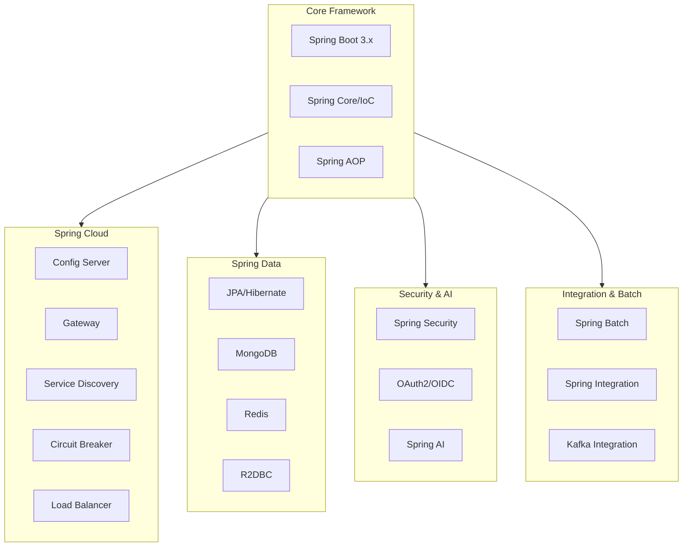

### Version Compatibility Matrix (2026)

| Component | Version | Java | Spring Boot |
|-----------|---------|------|-------------|
| Spring Cloud | 2024.0.x (Kilburn) | 21+ | 3.4+ |
| Spring AI | 1.0.0+ | 21+ | 3.4+ |
| Spring Security | 6.4+ | 21+ | 3.4+ |
| Spring Data | 2024.0+ | 21+ | 3.4+ |

---

## ☁️ Spring Cloud

Spring Cloud provides tools for building distributed systems: configuration management, service discovery, circuit breakers, routing, and more.

### Architecture Overview

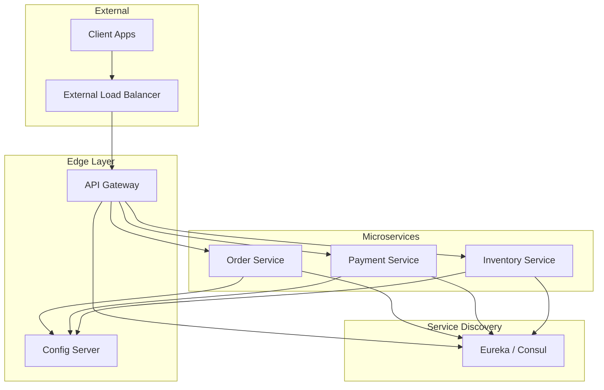

### Key Spring Cloud Modules

| Module | Purpose | When to Use |
|--------|---------|-------------|
| **Config** | Externalized configuration | All microservices environments |
| **Gateway** | API routing, filtering | Edge/entry point |
| **Netflix Eureka** | Service discovery | Self-managed discovery |
| **Consul** | Service discovery + KV | Need health checks, KV store |
| **LoadBalancer** | Client-side load balancing | Service-to-service calls |
| **Circuit Breaker** | Resilience patterns | Handling failures gracefully |
| **Sleuth/Micrometer** | Distributed tracing | Observability |
| **Stream** | Event-driven messaging | Kafka/RabbitMQ integration |
| **OpenFeign** | Declarative REST clients | Inter-service communication |

---

## ⚙️ Spring Cloud Config

Centralized, version-controlled configuration for distributed systems.

### Architecture

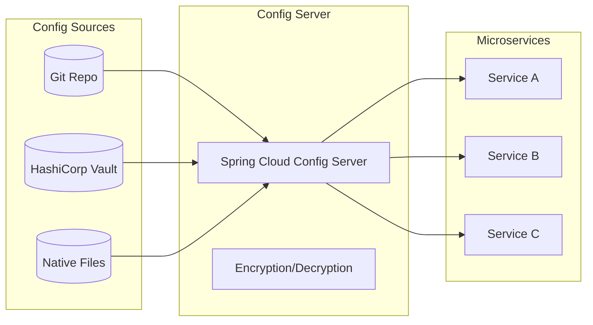

### Config Server Setup

**1. Add Dependencies (Server):**
```xml
<dependency>
    <groupId>org.springframework.cloud</groupId>
    <artifactId>spring-cloud-config-server</artifactId>
</dependency>
```

**2. Enable Config Server:**
```java
@SpringBootApplication
@EnableConfigServer
public class ConfigServerApplication {
    public static void main(String[] args) {
        SpringApplication.run(ConfigServerApplication.class, args);
    }
}
```

**3. Configure (application.yml):**
```yaml
server:
  port: 8888

spring:
  cloud:
    config:
      server:
        git:
          uri: https://github.com/company/config-repo
          default-label: main
          search-paths: '{application}'
          clone-on-start: true
        # Encryption support
        encrypt:
          enabled: true
```

### Config Client Setup

**1. Add Dependencies (Client):**
```xml
<dependency>
    <groupId>org.springframework.cloud</groupId>
    <artifactId>spring-cloud-starter-config</artifactId>
</dependency>
```

**2. Bootstrap Configuration:**
```yaml
# application.yml
spring:
  application:
    name: order-service
  config:
    import: "optional:configserver:http://config-server:8888"
  cloud:
    config:
      fail-fast: true
      retry:
        max-attempts: 5
```

### Dynamic Configuration Refresh

**Option 1: Manual Refresh (Per Instance)**
```java
@RestController
@RefreshScope  // Beans in this scope are recreated on refresh
public class FeatureController {

    @Value("${feature.new-checkout:false}")
    private boolean newCheckoutEnabled;

    // POST /actuator/refresh to reload
}
```

**Option 2: Spring Cloud Bus (Broadcast)**
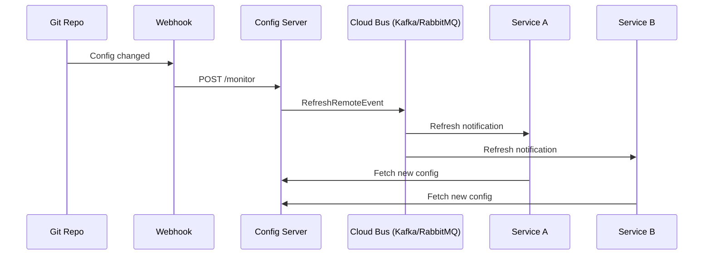

### Config Encryption

**Encrypt sensitive values:**
```bash
# Encrypt a secret
curl -X POST http://config-server:8888/encrypt -d "my-secret-password"
# Returns: AQB2x...encrypted...

# Store in config file
spring:
  datasource:
    password: '{cipher}AQB2x...encrypted...'
```

### Best Practices

| Practice | Rationale |
|----------|-----------|
| Use Git backend | Version control, audit trail |
| Encrypt secrets | Security compliance |
| Enable fail-fast | Fail at startup if config unavailable |
| Use profiles | Separate dev/staging/prod configs |
| Implement retry | Handle transient failures |

---

## 🚪 Spring Cloud Gateway

The modern, reactive API Gateway built on Spring WebFlux.

### Architecture

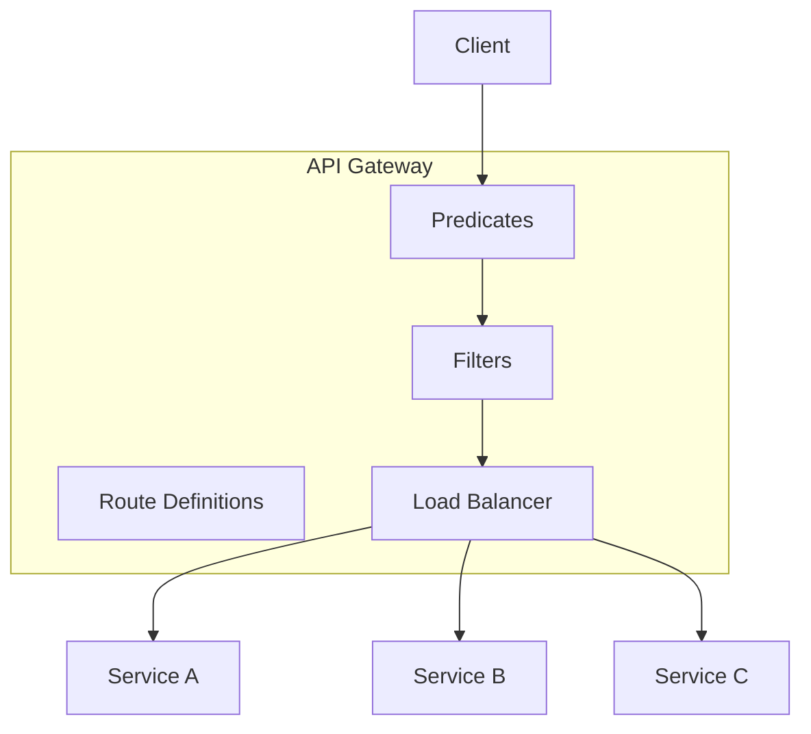

### Key Concepts

| Concept | Description | Example |
|---------|-------------|---------|
| **Route** | Maps request to downstream service | `/api/orders/**` → order-service |
| **Predicate** | Condition to match a route | Path, Host, Method, Header |
| **Filter** | Modify request/response | Add headers, rate limit, auth |

### Configuration Examples

**YAML-based Routes:**
```yaml
spring:
  cloud:
    gateway:
      routes:
        # Route 1: Order Service
        - id: order-service
          uri: lb://order-service  # lb:// uses LoadBalancer
          predicates:
            - Path=/api/orders/**
            - Method=GET,POST
          filters:
            - StripPrefix=1
            - AddRequestHeader=X-Request-Source, gateway

        # Route 2: Auth Service with Circuit Breaker
        - id: auth-service
          uri: lb://auth-service
          predicates:
            - Path=/api/auth/**
          filters:
            - name: CircuitBreaker
              args:
                name: authCB
                fallbackUri: forward:/fallback/auth

        # Route 3: Rate Limiting
        - id: public-api
          uri: lb://public-service
          predicates:
            - Path=/public/**
          filters:
            - name: RequestRateLimiter
              args:
                redis-rate-limiter.replenishRate: 10
                redis-rate-limiter.burstCapacity: 20
                redis-rate-limiter.requestedTokens: 1
```

**Java DSL Configuration:**
```java
@Configuration
public class GatewayConfig {

    @Bean
    public RouteLocator customRoutes(RouteLocatorBuilder builder) {
        return builder.routes()
            .route("order-route", r -> r
                .path("/api/orders/**")
                .filters(f -> f
                    .stripPrefix(1)
                    .addRequestHeader("X-Gateway", "true")
                    .retry(config -> config
                        .setRetries(3)
                        .setMethods(HttpMethod.GET)))
                .uri("lb://order-service"))
            .build();
    }
}
```

### Custom Filters

**Global Filter (applies to all routes):**
```java
@Component
@Slf4j
public class RequestLoggingFilter implements GlobalFilter, Ordered {

    @Override
    public Mono<Void> filter(ServerWebExchange exchange, GatewayFilterChain chain) {
        String requestId = UUID.randomUUID().toString();
        long startTime = System.currentTimeMillis();

        exchange.getAttributes().put("requestId", requestId);

        return chain.filter(exchange).then(Mono.fromRunnable(() -> {
            long duration = System.currentTimeMillis() - startTime;
            log.info("Request {} completed in {}ms", requestId, duration);
        }));
    }

    @Override
    public int getOrder() {
        return -1; // Execute first
    }
}
```

**Custom GatewayFilter Factory:**
```java
@Component
public class AuthenticateGatewayFilterFactory
        extends AbstractGatewayFilterFactory<AuthenticateGatewayFilterFactory.Config> {

    private final JwtTokenProvider tokenProvider;

    public AuthenticateGatewayFilterFactory(JwtTokenProvider tokenProvider) {
        super(Config.class);
        this.tokenProvider = tokenProvider;
    }

    @Override
    public GatewayFilter apply(Config config) {
        return (exchange, chain) -> {
            String token = exchange.getRequest().getHeaders()
                    .getFirst(HttpHeaders.AUTHORIZATION);

            if (token == null || !tokenProvider.validate(token)) {
                exchange.getResponse().setStatusCode(HttpStatus.UNAUTHORIZED);
                return exchange.getResponse().setComplete();
            }

            // Add user info to downstream request
            String userId = tokenProvider.getUserId(token);
            ServerHttpRequest mutatedRequest = exchange.getRequest().mutate()
                    .header("X-User-Id", userId)
                    .build();

            return chain.filter(exchange.mutate().request(mutatedRequest).build());
        };
    }

    @Data
    public static class Config {
        private boolean required = true;
    }
}
```

### Gateway vs Zuul Comparison

| Feature | Spring Cloud Gateway | Netflix Zuul 1.x |
|---------|---------------------|------------------|
| Programming Model | Reactive (WebFlux) | Servlet/Blocking |
| Performance | Higher throughput | Lower throughput |
| Filters | Pre/Post/Global | Pre/Route/Post/Error |
| Load Balancer | Spring Cloud LoadBalancer | Ribbon |
| WebSockets | ✅ Supported | ❌ Limited |
| Status | Active development | Maintenance mode |

---

## 🔐 Spring Security

Comprehensive security framework for authentication, authorization, and protection.

### OAuth 2.0 / OIDC Flow

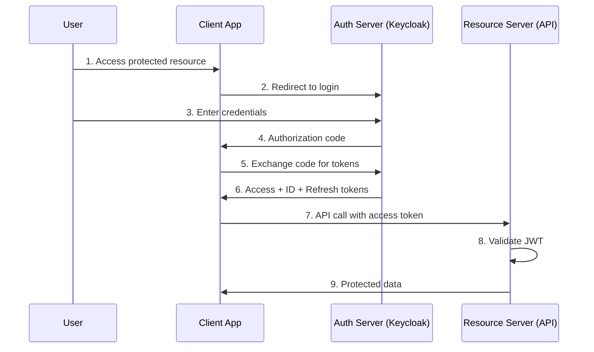

### OAuth 2.0 Resource Server (JWT)

**Configuration:**
```yaml
spring:
  security:
    oauth2:
      resourceserver:
        jwt:
          issuer-uri: https://auth.company.com/realms/myapp
          # OR specific JWKS endpoint
          jwk-set-uri: https://auth.company.com/realms/myapp/protocol/openid-connect/certs
```

**Security Configuration:**
```java
@Configuration
@EnableWebSecurity
@EnableMethodSecurity  // Enables @PreAuthorize, @PostAuthorize
public class SecurityConfig {

    @Bean
    public SecurityFilterChain filterChain(HttpSecurity http) throws Exception {
        return http
            .csrf(csrf -> csrf.disable())  // Disable for stateless APIs
            .sessionManagement(session ->
                session.sessionCreationPolicy(SessionCreationPolicy.STATELESS))
            .authorizeHttpRequests(auth -> auth
                .requestMatchers("/public/**", "/actuator/health").permitAll()
                .requestMatchers("/admin/**").hasRole("ADMIN")
                .requestMatchers("/api/**").authenticated()
                .anyRequest().authenticated())
            .oauth2ResourceServer(oauth2 -> oauth2
                .jwt(jwt -> jwt.jwtAuthenticationConverter(jwtConverter())))
            .build();
    }

    @Bean
    public JwtAuthenticationConverter jwtConverter() {
        JwtGrantedAuthoritiesConverter converter = new JwtGrantedAuthoritiesConverter();
        converter.setAuthoritiesClaimName("roles");  // Custom claim name
        converter.setAuthorityPrefix("ROLE_");

        JwtAuthenticationConverter jwtConverter = new JwtAuthenticationConverter();
        jwtConverter.setJwtGrantedAuthoritiesConverter(converter);
        return jwtConverter;
    }
}
```

### Method-Level Security

```java
@Service
public class OrderService {

    @PreAuthorize("hasRole('ADMIN') or #order.userId == authentication.name")
    public void updateOrder(Order order) {
        // Only admin or order owner can update
    }

    @PostAuthorize("returnObject.userId == authentication.name")
    public Order getOrder(Long orderId) {
        // User can only see their own orders
        return orderRepository.findById(orderId).orElseThrow();
    }

    @PreAuthorize("@orderSecurity.canAccess(#orderId, authentication)")
    public void deleteOrder(Long orderId) {
        // Custom security check via bean
    }
}

@Component("orderSecurity")
public class OrderSecurityService {
    public boolean canAccess(Long orderId, Authentication auth) {
        // Custom logic
        return true;
    }
}
```

### JWT Token Validation Deep Dive

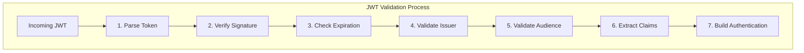

### OAuth 2.0 Client (Calling Protected APIs)

```java
@Configuration
public class OAuth2ClientConfig {

    @Bean
    public OAuth2AuthorizedClientManager authorizedClientManager(
            ClientRegistrationRepository clientRegistrationRepository,
            OAuth2AuthorizedClientRepository authorizedClientRepository) {

        OAuth2AuthorizedClientProvider authorizedClientProvider =
            OAuth2AuthorizedClientProviderBuilder.builder()
                .clientCredentials()  // For service-to-service
                .refreshToken()       // For refresh flows
                .build();

        DefaultOAuth2AuthorizedClientManager clientManager =
            new DefaultOAuth2AuthorizedClientManager(
                clientRegistrationRepository, authorizedClientRepository);
        clientManager.setAuthorizedClientProvider(authorizedClientProvider);

        return clientManager;
    }

    @Bean
    public RestClient restClient(OAuth2AuthorizedClientManager clientManager) {
        OAuth2ClientHttpRequestInterceptor interceptor =
            new OAuth2ClientHttpRequestInterceptor(clientManager);

        return RestClient.builder()
            .requestInterceptor(interceptor)
            .build();
    }
}
```

---

## 🤖 Spring AI

Spring's framework for building AI-powered applications with LLMs, embeddings, and vector stores.

### Architecture Overview

```mermaid
flowchart LR
    subgraph Application["Spring AI Application"]
        PROMPT[Prompt Templates]
        CHAT[ChatClient]
        EMB[EmbeddingClient]
        FUNC[Function Calling]
    end

    subgraph Providers["AI Providers"]
        OPENAI[OpenAI]
        GEMINI[Google Gemini]
        ANTHROPIC[Anthropic]
        OLLAMA[Ollama (Local)]
        BEDROCK[AWS Bedrock]
    end

    subgraph Storage["Vector Stores"]
        PGVECTOR[PGVector]
        PINECONE[Pinecone]
        MILVUS[Milvus]
        CHROMA[Chroma]
    end

    Application --> Providers
    Application --> Storage
```

### Core Concepts

| Concept | Description |
|---------|-------------|
| **ChatClient** | Interact with LLMs for conversations |
| **EmbeddingClient** | Convert text to vector embeddings |
| **VectorStore** | Store and query embeddings |
| **Prompt** | Template for LLM instructions |
| **Function Calling** | Let LLMs invoke application functions |
| **RAG** | Retrieval-Augmented Generation pattern |

### Basic Setup

**Dependencies:**
```xml
<!-- OpenAI Provider -->
<dependency>
    <groupId>org.springframework.ai</groupId>
    <artifactId>spring-ai-openai-spring-boot-starter</artifactId>
</dependency>

<!-- Google Gemini Provider -->
<dependency>
    <groupId>org.springframework.ai</groupId>
    <artifactId>spring-ai-vertex-ai-gemini-spring-boot-starter</artifactId>
</dependency>

<!-- Vector Store (PGVector) -->
<dependency>
    <groupId>org.springframework.ai</groupId>
    <artifactId>spring-ai-pgvector-store-spring-boot-starter</artifactId>
</dependency>
```

**Configuration:**
```yaml
spring:
  ai:
    openai:
      api-key: ${OPENAI_API_KEY}
      chat:
        model: gpt-4o
        temperature: 0.7
    embedding:
      model: text-embedding-3-small
```

### ChatClient Usage

**Simple Chat:**
```java
@Service
public class ChatService {

    private final ChatClient chatClient;

    public ChatService(ChatClient.Builder builder) {
        this.chatClient = builder.build();
    }

    // Simple prompt
    public String askQuestion(String question) {
        return chatClient.prompt()
            .user(question)
            .call()
            .content();
    }

    // With system prompt and structured output
    public ProductReview analyzeReview(String reviewText) {
        return chatClient.prompt()
            .system("You are a sentiment analysis expert. Analyze product reviews.")
            .user(reviewText)
            .call()
            .entity(ProductReview.class);  // Automatic JSON parsing
    }

    // Streaming response
    public Flux<String> streamResponse(String prompt) {
        return chatClient.prompt()
            .user(prompt)
            .stream()
            .content();
    }
}

public record ProductReview(
    String sentiment,      // POSITIVE, NEGATIVE, NEUTRAL
    double confidenceScore,
    List<String> keyPoints
) {}
```

### Prompt Templates

```java
@Service
public class EmailService {

    private final ChatClient chatClient;

    @Value("classpath:/prompts/email-template.st")
    private Resource emailPrompt;

    public String generateEmail(String customerName, String issue, String resolution) {
        return chatClient.prompt()
            .user(u -> u
                .text(emailPrompt)
                .param("customerName", customerName)
                .param("issue", issue)
                .param("resolution", resolution))
            .call()
            .content();
    }
}
```

**Template File (email-template.st):**
```
Write a professional customer service email.

Customer Name: {customerName}
Issue: {issue}
Resolution: {resolution}

The email should be empathetic, professional, and include:
1. Acknowledgment of the issue
2. Clear explanation of the resolution
3. Next steps for the customer
```

### Function Calling (Tool Use)

```java
@Configuration
public class AIFunctionConfig {

    @Bean
    @Description("Get current weather for a location")
    public Function<WeatherRequest, WeatherResponse> getWeather() {
        return request -> {
            // Call actual weather API
            return new WeatherResponse(request.location(), 22.5, "Sunny");
        };
    }

    @Bean
    @Description("Search for products in the catalog")
    public Function<ProductSearchRequest, List<Product>> searchProducts(
            ProductService productService) {
        return request -> productService.search(request.query(), request.category());
    }
}

@Service
public class AssistantService {

    private final ChatClient chatClient;

    public AssistantService(ChatClient.Builder builder) {
        this.chatClient = builder
            .defaultFunctions("getWeather", "searchProducts")  // Register functions
            .build();
    }

    public String assist(String userQuery) {
        return chatClient.prompt()
            .user(userQuery)
            .call()
            .content();
        // AI will automatically call functions when needed!
    }
}
```

### RAG (Retrieval-Augmented Generation)

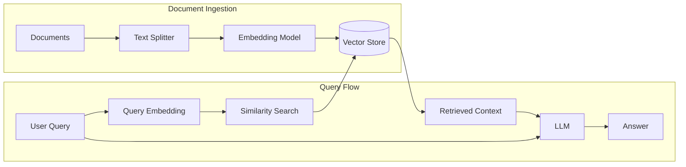

**Implementation:**
```java
@Service
public class DocumentService {

    private final VectorStore vectorStore;
    private final EmbeddingModel embeddingModel;

    // Ingest documents
    public void ingestDocument(Resource pdfResource) {
        // 1. Parse PDF
        var reader = new PagePdfDocumentReader(pdfResource);
        List<Document> documents = reader.get();

        // 2. Split into chunks
        var splitter = new TokenTextSplitter();
        List<Document> chunks = splitter.apply(documents);

        // 3. Store embeddings
        vectorStore.add(chunks);
    }
}

@Service
public class RAGService {

    private final ChatClient chatClient;
    private final VectorStore vectorStore;

    public RAGService(ChatClient.Builder builder, VectorStore vectorStore) {
        this.vectorStore = vectorStore;
        this.chatClient = builder
            .defaultAdvisors(new QuestionAnswerAdvisor(vectorStore))
            .build();
    }

    public String askWithContext(String question) {
        // QuestionAnswerAdvisor automatically:
        // 1. Searches vectorStore for relevant documents
        // 2. Adds them to the prompt context
        // 3. Sends augmented prompt to LLM
        return chatClient.prompt()
            .user(question)
            .call()
            .content();
    }
}
```

### Multi-Modal (Vision)

```java
@Service
public class VisionService {

    private final ChatClient chatClient;

    public String analyzeImage(Resource imageResource) throws IOException {
        return chatClient.prompt()
            .user(u -> u
                .text("Describe what you see in this image")
                .media(MimeTypeUtils.IMAGE_PNG, imageResource))
            .call()
            .content();
    }

    public ProductInfo extractProductInfo(byte[] productImage) {
        return chatClient.prompt()
            .system("Extract product information from the image")
            .user(u -> u
                .media(MimeTypeUtils.IMAGE_JPEG, productImage))
            .call()
            .entity(ProductInfo.class);
    }
}
```

---

## 💾 Spring Data

Unified data access across SQL, NoSQL, and cache stores.

### Spring Data JPA

```java
// Entity
@Entity
@Table(name = "orders")
public class Order {

    @Id
    @GeneratedValue(strategy = GenerationType.IDENTITY)
    private Long id;

    @ManyToOne(fetch = FetchType.LAZY)
    @JoinColumn(name = "customer_id")
    private Customer customer;

    @OneToMany(mappedBy = "order", cascade = CascadeType.ALL, orphanRemoval = true)
    private List<OrderItem> items = new ArrayList<>();

    @Enumerated(EnumType.STRING)
    private OrderStatus status;

    @CreationTimestamp
    private Instant createdAt;
}

// Repository
public interface OrderRepository extends JpaRepository<Order, Long> {

    // Derived query methods
    List<Order> findByCustomerIdAndStatus(Long customerId, OrderStatus status);

    // Custom JPQL
    @Query("SELECT o FROM Order o JOIN FETCH o.items WHERE o.id = :id")
    Optional<Order> findByIdWithItems(@Param("id") Long id);

    // Native SQL
    @Query(value = "SELECT * FROM orders WHERE created_at > :since", nativeQuery = true)
    List<Order> findRecentOrders(@Param("since") Instant since);

    // Projections
    @Query("SELECT o.id as id, o.status as status FROM Order o WHERE o.customer.id = :customerId")
    List<OrderSummary> findOrderSummaries(@Param("customerId") Long customerId);

    // Modifying queries
    @Modifying
    @Query("UPDATE Order o SET o.status = :status WHERE o.id = :id")
    int updateStatus(@Param("id") Long id, @Param("status") OrderStatus status);
}

// Projection interface
public interface OrderSummary {
    Long getId();
    OrderStatus getStatus();
}
```

### Spring Data MongoDB

```java
@Document(collection = "products")
public class Product {

    @Id
    private String id;

    @Indexed
    private String sku;

    @TextIndexed
    private String name;

    private BigDecimal price;

    @DBRef
    private Category category;

    private Map<String, String> attributes;
}

public interface ProductRepository extends MongoRepository<Product, String> {

    // Text search
    @Query("{ $text: { $search: ?0 } }")
    List<Product> searchByText(String searchTerm);

    // Complex queries
    @Query("{ 'price': { $gte: ?0, $lte: ?1 }, 'category.name': ?2 }")
    List<Product> findByPriceRangeAndCategory(
            BigDecimal minPrice, BigDecimal maxPrice, String categoryName);

    // Aggregation
    @Aggregation(pipeline = {
        "{ $match: { 'category.id': ?0 } }",
        "{ $group: { _id: null, avgPrice: { $avg: '$price' } } }"
    })
    AggregationResults<PriceStats> calculateAveragePrice(String categoryId);
}
```

### Spring Data Redis

```java
@Configuration
@EnableRedisRepositories
public class RedisConfig {

    @Bean
    public RedisTemplate<String, Object> redisTemplate(RedisConnectionFactory factory) {
        RedisTemplate<String, Object> template = new RedisTemplate<>();
        template.setConnectionFactory(factory);
        template.setKeySerializer(new StringRedisSerializer());
        template.setValueSerializer(new GenericJackson2JsonRedisSerializer());
        return template;
    }
}

// Cache usage
@Service
public class ProductCacheService {

    private final RedisTemplate<String, Object> redisTemplate;
    private final ProductRepository productRepository;

    @Cacheable(value = "products", key = "#id")
    public Product getProduct(String id) {
        return productRepository.findById(id).orElseThrow();
    }

    @CacheEvict(value = "products", key = "#product.id")
    public Product updateProduct(Product product) {
        return productRepository.save(product);
    }

    // Manual cache operations
    public void setWithExpiration(String key, Object value, Duration duration) {
        redisTemplate.opsForValue().set(key, value, duration);
    }
}

// Redis Repository
@RedisHash(value = "sessions", timeToLive = 3600)
public class UserSession {

    @Id
    private String sessionId;

    @Indexed
    private String userId;

    private Map<String, Object> data;
}

public interface SessionRepository extends CrudRepository<UserSession, String> {
    List<UserSession> findByUserId(String userId);
}
```

---

## 📦 Spring Batch

Framework for batch processing: large-scale data jobs with restart, skip, and retry capabilities.

### Architecture

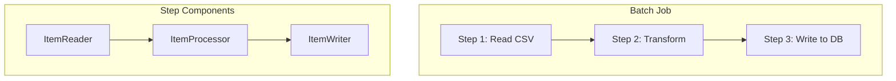

### Job Configuration

```java
@Configuration
public class ImportJobConfig {

    @Bean
    public Job importJob(JobRepository jobRepository,
                         Step validateStep,
                         Step importStep,
                         Step notifyStep) {
        return new JobBuilder("importJob", jobRepository)
            .incrementer(new RunIdIncrementer())
            .start(validateStep)
                .on("VALID").to(importStep)
                    .on("*").to(notifyStep)
                .from(validateStep)
                    .on("INVALID").fail()
            .end()
            .build();
    }

    @Bean
    public Step importStep(JobRepository jobRepository,
                           PlatformTransactionManager transactionManager,
                           ItemReader<CustomerCsv> reader,
                           ItemProcessor<CustomerCsv, Customer> processor,
                           ItemWriter<Customer> writer) {
        return new StepBuilder("importStep", jobRepository)
            .<CustomerCsv, Customer>chunk(100, transactionManager)  // Process 100 at a time
            .reader(reader)
            .processor(processor)
            .writer(writer)
            .faultTolerant()
                .skipLimit(10)
                .skip(DataIntegrityViolationException.class)
                .retryLimit(3)
                .retry(DeadlockLoserDataAccessException.class)
            .listener(new StepExecutionListener() {
                @Override
                public void afterStep(StepExecution stepExecution) {
                    log.info("Processed {} records", stepExecution.getWriteCount());
                }
            })
            .build();
    }
}
```

### Reader, Processor, Writer

```java
// Flat File Reader
@Bean
public FlatFileItemReader<CustomerCsv> reader() {
    return new FlatFileItemReaderBuilder<CustomerCsv>()
        .name("customerReader")
        .resource(new ClassPathResource("customers.csv"))
        .linesToSkip(1)  // Skip header
        .delimited()
        .names("name", "email", "phone")
        .targetType(CustomerCsv.class)
        .build();
}

// Processor with validation
@Component
public class CustomerProcessor implements ItemProcessor<CustomerCsv, Customer> {

    private final CustomerRepository repository;

    @Override
    public Customer process(CustomerCsv item) {
        // Return null to skip this record
        if (repository.existsByEmail(item.email())) {
            return null;
        }

        return Customer.builder()
            .name(item.name().trim())
            .email(item.email().toLowerCase())
            .phone(normalizePhone(item.phone()))
            .createdAt(Instant.now())
            .build();
    }
}

// JPA Writer
@Bean
public JpaItemWriter<Customer> writer(EntityManagerFactory emf) {
    return new JpaItemWriterBuilder<Customer>()
        .entityManagerFactory(emf)
        .build();
}
```

### Parallel Processing

```java
@Bean
public Step parallelImportStep(JobRepository jobRepository,
                                PlatformTransactionManager tm,
                                ItemReader<Record> reader,
                                ItemProcessor<Record, Entity> processor,
                                ItemWriter<Entity> writer,
                                TaskExecutor taskExecutor) {
    return new StepBuilder("parallelStep", jobRepository)
        .<Record, Entity>chunk(100, tm)
        .reader(reader)
        .processor(processor)
        .writer(writer)
        .taskExecutor(taskExecutor)
        .throttleLimit(4)  // Max 4 concurrent threads
        .build();
}

@Bean
public TaskExecutor batchTaskExecutor() {
    ThreadPoolTaskExecutor executor = new ThreadPoolTaskExecutor();
    executor.setCorePoolSize(4);
    executor.setMaxPoolSize(8);
    executor.setQueueCapacity(100);
    executor.setThreadNamePrefix("batch-");
    return executor;
}
```

---

## 🔗 Spring Integration

Enterprise integration patterns (EIP) implementation for building message-driven architectures.

### Core Concepts

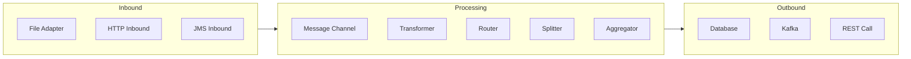

### DSL Configuration

```java
@Configuration
@EnableIntegration
public class IntegrationConfig {

    @Bean
    public IntegrationFlow fileProcessingFlow() {
        return IntegrationFlow
            // 1. Poll directory for new files
            .from(Files.inboundAdapter(new File("/input"))
                    .patternFilter("*.csv"),
                e -> e.poller(Pollers.fixedDelay(5000)))

            // 2. Read file content
            .transform(Files.toStringTransformer())

            // 3. Split into lines
            .split(s -> s.applySequence(true).delimiters("\n"))

            // 4. Transform each line
            .transform(String.class, this::parseCsvLine)

            // 5. Filter invalid records
            .filter(Record.class, record -> record.isValid())

            // 6. Route based on type
            .<Record, String>route(Record::getType, mapping -> mapping
                .subFlowMapping("ORDER", sf -> sf.handle(this::processOrder))
                .subFlowMapping("REFUND", sf -> sf.handle(this::processRefund))
                .defaultOutputToParentFlow())

            // 7. Log completion
            .log(LoggingHandler.Level.INFO, "Processed record")

            .get();
    }

    @Bean
    public IntegrationFlow httpToKafkaFlow() {
        return IntegrationFlow
            .from(Http.inboundGateway("/api/events")
                    .requestMapping(m -> m.methods(HttpMethod.POST))
                    .requestPayloadType(EventPayload.class))
            .enrichHeaders(h -> h.header("timestamp", Instant.now()))
            .transform(EventPayload.class, this::enrichEvent)
            .handle(Kafka.outboundChannelAdapter(kafkaTemplate)
                    .topic("events")
                    .messageKey(m -> m.getHeaders().get("eventId")))
            .get();
    }
}
```

---

## 🏗️ Real-World Architectures

### E-Commerce Platform

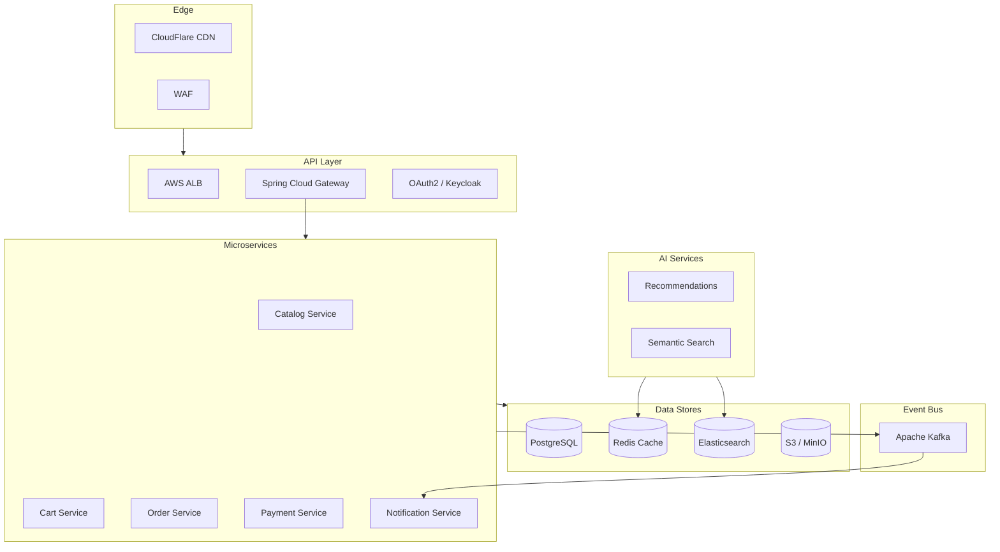

### Configuration for Production

```yaml
# application-prod.yml
spring:
  application:
    name: order-service

  # Config Server
  config:
    import: "configserver:http://config-server:8888"

  # Database with connection pool
  datasource:
    url: jdbc:postgresql://db-cluster:5432/orders
    hikari:
      maximum-pool-size: 20
      minimum-idle: 5
      idle-timeout: 300000

  # Redis Cache
  data:
    redis:
      cluster:
        nodes: redis-1:6379,redis-2:6379,redis-3:6379

  # Kafka
  kafka:
    bootstrap-servers: kafka-1:9092,kafka-2:9092,kafka-3:9092
    producer:
      acks: all
      retries: 3
    consumer:
      group-id: order-service
      auto-offset-reset: earliest

  # Security
  security:
    oauth2:
      resourceserver:
        jwt:
          issuer-uri: https://auth.company.com/realms/production

  # AI
  ai:
    openai:
      api-key: ${OPENAI_API_KEY}
      chat:
        model: gpt-4o

# Observability
management:
  endpoints:
    web:
      exposure:
        include: health,info,prometheus,metrics
  tracing:
    sampling:
      probability: 1.0
  metrics:
    tags:
      application: ${spring.application.name}
```

---

## 🎯 Interview Questions

### Spring Cloud

| Question | Key Points |
|----------|------------|
| What is service discovery? | Registry for services; Eureka/Consul; client-side vs server-side |
| How does Config Server work? | Centralized config; Git/Vault backend; refresh scope |
| Explain Circuit Breaker pattern | Prevent cascade failures; states: closed/open/half-open |
| Gateway vs Zuul? | Reactive vs servlet; Gateway is successor |

### Spring Security

| Question | Key Points |
|----------|------------|
| OAuth 2.0 grant types? | Auth code, client credentials, refresh token, PKCE |
| JWT vs Opaque tokens? | Self-contained vs lookup; JWT has claims |
| Method-level security? | @PreAuthorize, @PostAuthorize, SpEL expressions |
| Session vs Stateless? | Stateless for APIs; sessions for web apps |

### Spring AI

| Question | Key Points |
|----------|------------|
| What is RAG? | Retrieve context from vector DB, augment prompt |
| Function calling? | LLM invokes app functions; tool use pattern |
| Vector embeddings? | Numerical representation; similarity search |
| Temperature parameter? | Randomness; 0=deterministic, 1=creative |

### Spring Data

| Question | Key Points |
|----------|------------|
| N+1 problem? | JOIN FETCH, @EntityGraph, DTO projections |
| @Transactional propagation? | REQUIRED, REQUIRES_NEW, NESTED |
| Optimistic vs Pessimistic locking? | @Version vs @Lock(PESSIMISTIC_WRITE) |
| Caching strategies? | Cache-aside, write-through, write-behind |

### Spring Batch

| Question | Key Points |
|----------|------------|
| Chunk vs Tasklet? | Chunk for bulk (read-process-write); Tasklet for simple |
| Restart capability? | Job repository stores state; resume from failure |
| Parallel processing? | Multi-threaded step, partitioning, remote chunking |

---

## 📚 Quick Reference

### Annotations Cheat Sheet

| Annotation | Module | Purpose |
|------------|--------|---------|
| `@EnableConfigServer` | Config | Start config server |
| `@RefreshScope` | Config | Reload beans on refresh |
| `@EnableDiscoveryClient` | Discovery | Register with Eureka/Consul |
| `@FeignClient` | OpenFeign | Declarative REST client |
| `@CircuitBreaker` | Resilience4j | Apply circuit breaker |
| `@PreAuthorize` | Security | Method-level authorization |
| `@EnableBatchProcessing` | Batch | Enable batch infrastructure |
| `@EnableIntegration` | Integration | Enable EIP patterns |

### Dependency Quick Reference

```xml
<!-- BOM for Spring Cloud -->
<dependencyManagement>
    <dependencies>
        <dependency>
            <groupId>org.springframework.cloud</groupId>
            <artifactId>spring-cloud-dependencies</artifactId>
            <version>2024.0.0</version>
            <type>pom</type>
            <scope>import</scope>
        </dependency>
        <dependency>
            <groupId>org.springframework.ai</groupId>
            <artifactId>spring-ai-bom</artifactId>
            <version>1.0.0</version>
            <type>pom</type>
            <scope>import</scope>
        </dependency>
    </dependencies>
</dependencyManagement>
```

---

*Master the Spring ecosystem to build production-ready, cloud-native applications with AI capabilities!*
