[🏠 Home](../../../../README.md) | [⬅️ Spring Ecosystem](./spring-ecosystem-deep-dive.md) | [➡️ Spring AI](./spring-ai-deep-dive.md)

# ⚡ Spring WebFlux & Reactive Stack Deep Dive

> Building Non-Blocking, High-Performance Applications

---

## 📋 Table of Contents

1. [Reactive Programming Fundamentals](#-reactive-programming-fundamentals)
2. [Spring WebFlux Core](#-spring-webflux-core)
3. [Reactive Data Access](#-reactive-data-access)
4. [WebClient](#-webclient)
5. [Server-Sent Events & WebSockets](#-sse--websockets)
6. [Error Handling](#-error-handling)
7. [Testing](#-testing)
8. [Performance & Best Practices](#-performance--best-practices)
9. [Spring Cloud Kubernetes](#-spring-cloud-kubernetes)
10. [Spring Modulith](#-spring-modulith)
11. [Interview Questions](#-interview-questions)

---

## 🔄 Reactive Programming Fundamentals

### Reactive Streams Specification

```mermaid
sequenceDiagram
    participant Publisher
    participant Subscriber
    
    Subscriber->>Publisher: subscribe()
    Publisher->>Subscriber: onSubscribe(Subscription)
    Subscriber->>Publisher: request(n)
    Publisher->>Subscriber: onNext(item) × n
    Publisher->>Subscriber: onComplete() or onError()
```



### Core Interfaces

| Interface | Role | Method |
|-----------|------|--------|
| `Publisher<T>` | Produces data | `subscribe(Subscriber)` |
| `Subscriber<T>` | Consumes data | `onNext`, `onError`, `onComplete` |
| `Subscription` | Controls flow | `request(n)`, `cancel()` |
| `Processor<T,R>` | Both | Transforms data |

### Mono vs Flux

```java
// Mono: 0 or 1 element
Mono<User> user = userRepository.findById(123L);
Mono<Void> completed = service.process();

// Flux: 0 to N elements
Flux<Order> orders = orderRepository.findByCustomerId(456L);
Flux<Long> numbers = Flux.range(1, 100);

// Creating publishers
Mono<String> mono1 = Mono.just("Hello");
Mono<String> mono2 = Mono.empty();
Mono<String> mono3 = Mono.error(new RuntimeException("Oops"));
Mono<String> mono4 = Mono.fromCallable(() -> expensiveOperation());

Flux<Integer> flux1 = Flux.just(1, 2, 3);
Flux<Integer> flux2 = Flux.fromIterable(list);
Flux<Integer> flux3 = Flux.interval(Duration.ofSeconds(1));
```

### Key Operators

```java
// Transform
flux.map(String::toUpperCase)
    .flatMap(s -> externalService.call(s))  // Async transformation
    .filter(s -> s.length() > 5)
    .take(10)
    .distinct();

// Combine
Mono.zip(mono1, mono2, mono3)
    .map(tuple -> new Result(tuple.getT1(), tuple.getT2(), tuple.getT3()));

Flux.merge(flux1, flux2);  // Interleaved
Flux.concat(flux1, flux2); // Sequential

// Error handling
flux.onErrorReturn("default")
    .onErrorResume(e -> fallbackFlux)
    .retry(3)
    .retryWhen(Retry.backoff(3, Duration.ofSeconds(1)));

// Batching
flux.buffer(10)           // List<T> of 10 elements
    .window(Duration.ofSeconds(5))  // Flux<Flux<T>>
    .groupBy(Item::getCategory);
```

---

## 🌐 Spring WebFlux Core

### Annotated Controllers

```java
@RestController
@RequestMapping("/api/users")
public class UserController {

    private final UserService userService;

    @GetMapping
    public Flux<User> getAllUsers() {
        return userService.findAll();
    }

    @GetMapping("/{id}")
    public Mono<ResponseEntity<User>> getUser(@PathVariable Long id) {
        return userService.findById(id)
            .map(ResponseEntity::ok)
            .defaultIfEmpty(ResponseEntity.notFound().build());
    }

    @PostMapping
    @ResponseStatus(HttpStatus.CREATED)
    public Mono<User> createUser(@Valid @RequestBody Mono<CreateUserRequest> request) {
        return request.flatMap(userService::create);
    }

    @GetMapping(value = "/stream", produces = MediaType.TEXT_EVENT_STREAM_VALUE)
    public Flux<User> streamUsers() {
        return userService.findAll()
            .delayElements(Duration.ofMillis(100));  // Simulate streaming
    }

    @DeleteMapping("/{id}")
    public Mono<ResponseEntity<Void>> deleteUser(@PathVariable Long id) {
        return userService.deleteById(id)
            .then(Mono.just(ResponseEntity.noContent().<Void>build()))
            .onErrorResume(e -> Mono.just(ResponseEntity.notFound().build()));
    }
}
```

### Functional Endpoints (RouterFunction)

```java
@Configuration
public class RouterConfig {

    @Bean
    public RouterFunction<ServerResponse> userRoutes(UserHandler handler) {
        return RouterFunctions.route()
            .path("/api/users", builder -> builder
                .GET("", handler::getAllUsers)
                .GET("/{id}", handler::getUserById)
                .POST("", handler::createUser)
                .PUT("/{id}", handler::updateUser)
                .DELETE("/{id}", handler::deleteUser))
            .filter(this::loggingFilter)
            .build();
    }

    private Mono<ServerResponse> loggingFilter(
            ServerRequest request,
            HandlerFunction<ServerResponse> next) {
        log.info("Request: {} {}", request.method(), request.path());
        return next.handle(request)
            .doOnSuccess(response -> log.info("Response: {}", response.statusCode()));
    }
}

@Component
public class UserHandler {

    private final UserService userService;

    public Mono<ServerResponse> getAllUsers(ServerRequest request) {
        return ServerResponse.ok()
            .contentType(MediaType.APPLICATION_JSON)
            .body(userService.findAll(), User.class);
    }

    public Mono<ServerResponse> getUserById(ServerRequest request) {
        Long id = Long.parseLong(request.pathVariable("id"));
        return userService.findById(id)
            .flatMap(user -> ServerResponse.ok().bodyValue(user))
            .switchIfEmpty(ServerResponse.notFound().build());
    }

    public Mono<ServerResponse> createUser(ServerRequest request) {
        return request.bodyToMono(CreateUserRequest.class)
            .flatMap(userService::create)
            .flatMap(user -> ServerResponse
                .created(URI.create("/api/users/" + user.getId()))
                .bodyValue(user));
    }
}
```

### WebFilter (Cross-Cutting Concerns)

```java
@Component
@Order(1)
public class RequestIdFilter implements WebFilter {

    @Override
    public Mono<Void> filter(ServerWebExchange exchange, WebFilterChain chain) {
        String requestId = Optional.ofNullable(
                exchange.getRequest().getHeaders().getFirst("X-Request-ID"))
            .orElse(UUID.randomUUID().toString());

        return chain.filter(exchange)
            .contextWrite(Context.of("requestId", requestId))
            .doFirst(() -> exchange.getResponse().getHeaders()
                .add("X-Request-ID", requestId));
    }
}

@Component
@Order(2)
public class AuthenticationFilter implements WebFilter {

    private final JwtTokenProvider tokenProvider;

    @Override
    public Mono<Void> filter(ServerWebExchange exchange, WebFilterChain chain) {
        String token = extractToken(exchange.getRequest());
        
        if (token == null) {
            return chain.filter(exchange);
        }

        return tokenProvider.validateAndGetUser(token)
            .flatMap(user -> {
                exchange.getAttributes().put("user", user);
                return chain.filter(exchange);
            })
            .onErrorResume(e -> {
                exchange.getResponse().setStatusCode(HttpStatus.UNAUTHORIZED);
                return exchange.getResponse().setComplete();
            });
    }
}
```

---

## 💾 Reactive Data Access

### R2DBC (Reactive Relational Database)

```java
// Entity
@Table("users")
public class User {
    @Id
    private Long id;
    private String name;
    private String email;
    private Instant createdAt;
}

// Repository
public interface UserRepository extends ReactiveCrudRepository<User, Long> {

    Flux<User> findByNameContaining(String name);

    @Query("SELECT * FROM users WHERE email = :email")
    Mono<User> findByEmail(String email);

    @Query("SELECT * FROM users WHERE created_at > :since ORDER BY created_at DESC")
    Flux<User> findRecentUsers(Instant since);

    @Modifying
    @Query("UPDATE users SET name = :name WHERE id = :id")
    Mono<Integer> updateName(Long id, String name);
}

// Configuration
@Configuration
@EnableR2dbcRepositories
public class R2dbcConfig extends AbstractR2dbcConfiguration {

    @Bean
    @Override
    public ConnectionFactory connectionFactory() {
        return ConnectionFactories.get(ConnectionFactoryOptions.builder()
            .option(DRIVER, "postgresql")
            .option(HOST, "localhost")
            .option(PORT, 5432)
            .option(DATABASE, "mydb")
            .option(USER, "user")
            .option(PASSWORD, "pass")
            .build());
    }
}
```

### Reactive MongoDB

```java
@Document(collection = "orders")
public class Order {
    @Id
    private String id;
    private String customerId;
    private List<OrderItem> items;
    private OrderStatus status;
    private Instant createdAt;
}

public interface OrderRepository extends ReactiveMongoRepository<Order, String> {

    Flux<Order> findByCustomerId(String customerId);

    Flux<Order> findByStatus(OrderStatus status);

    @Aggregation(pipeline = {
        "{ $match: { customerId: ?0 } }",
        "{ $unwind: '$items' }",
        "{ $group: { _id: null, total: { $sum: '$items.price' } } }"
    })
    Mono<TotalAmount> calculateTotalSpent(String customerId);

    @Tailable  // For capped collections - infinite stream
    Flux<Order> findWithTailableCursorByStatus(OrderStatus status);
}
```

### Reactive Redis

```java
@Configuration
public class ReactiveRedisConfig {

    @Bean
    public ReactiveRedisTemplate<String, Object> reactiveRedisTemplate(
            ReactiveRedisConnectionFactory factory) {
        
        StringRedisSerializer keySerializer = new StringRedisSerializer();
        Jackson2JsonRedisSerializer<Object> valueSerializer = 
            new Jackson2JsonRedisSerializer<>(Object.class);

        RedisSerializationContext<String, Object> context = 
            RedisSerializationContext.<String, Object>newSerializationContext()
                .key(keySerializer)
                .value(valueSerializer)
                .hashKey(keySerializer)
                .hashValue(valueSerializer)
                .build();

        return new ReactiveRedisTemplate<>(factory, context);
    }
}

@Service
public class CacheService {

    private final ReactiveRedisTemplate<String, Object> redisTemplate;
    private final ReactiveValueOperations<String, Object> valueOps;

    public CacheService(ReactiveRedisTemplate<String, Object> redisTemplate) {
        this.redisTemplate = redisTemplate;
        this.valueOps = redisTemplate.opsForValue();
    }

    public Mono<User> getCachedUser(Long userId) {
        String key = "user:" + userId;
        return valueOps.get(key)
            .cast(User.class);
    }

    public Mono<Boolean> cacheUser(User user, Duration ttl) {
        String key = "user:" + user.getId();
        return valueOps.set(key, user, ttl);
    }

    public Mono<User> getOrCache(Long userId, Mono<User> loader) {
        return getCachedUser(userId)
            .switchIfEmpty(
                loader.flatMap(user -> 
                    cacheUser(user, Duration.ofHours(1))
                        .thenReturn(user)));
    }
}
```

---

## 🔗 WebClient

```java
@Configuration
public class WebClientConfig {

    @Bean
    public WebClient webClient(WebClient.Builder builder) {
        return builder
            .baseUrl("https://api.example.com")
            .defaultHeader(HttpHeaders.CONTENT_TYPE, MediaType.APPLICATION_JSON_VALUE)
            .filter(logRequest())
            .filter(retryFilter())
            .codecs(configurer -> configurer
                .defaultCodecs()
                .maxInMemorySize(16 * 1024 * 1024))  // 16MB
            .build();
    }

    private ExchangeFilterFunction logRequest() {
        return ExchangeFilterFunction.ofRequestProcessor(request -> {
            log.info("Request: {} {}", request.method(), request.url());
            return Mono.just(request);
        });
    }

    private ExchangeFilterFunction retryFilter() {
        return (request, next) -> next.exchange(request)
            .flatMap(response -> {
                if (response.statusCode().is5xxServerError()) {
                    return response.releaseBody()
                        .then(Mono.error(new ServerException("Server error")));
                }
                return Mono.just(response);
            })
            .retryWhen(Retry.backoff(3, Duration.ofSeconds(1))
                .filter(e -> e instanceof ServerException));
    }
}

@Service
public class ExternalApiClient {

    private final WebClient webClient;

    public Mono<Product> getProduct(String productId) {
        return webClient.get()
            .uri("/products/{id}", productId)
            .retrieve()
            .onStatus(HttpStatusCode::is4xxClientError, response ->
                response.bodyToMono(ErrorResponse.class)
                    .flatMap(error -> Mono.error(new ProductNotFoundException(error.message()))))
            .bodyToMono(Product.class)
            .timeout(Duration.ofSeconds(5));
    }

    public Flux<Product> searchProducts(String query) {
        return webClient.get()
            .uri(uriBuilder -> uriBuilder
                .path("/products/search")
                .queryParam("q", query)
                .build())
            .retrieve()
            .bodyToFlux(Product.class);
    }

    public Mono<Order> createOrder(OrderRequest request) {
        return webClient.post()
            .uri("/orders")
            .bodyValue(request)
            .retrieve()
            .bodyToMono(Order.class);
    }

    // Parallel calls
    public Mono<AggregatedData> aggregateData(String userId) {
        Mono<User> user = getUser(userId);
        Mono<List<Order>> orders = getOrders(userId).collectList();
        Mono<UserPreferences> prefs = getPreferences(userId);

        return Mono.zip(user, orders, prefs)
            .map(tuple -> new AggregatedData(tuple.getT1(), tuple.getT2(), tuple.getT3()));
    }
}
```

---

## 📡 SSE & WebSockets

### Server-Sent Events

```java
@RestController
@RequestMapping("/api/notifications")
public class NotificationController {

    private final Sinks.Many<Notification> sink = 
        Sinks.many().multicast().onBackpressureBuffer();

    @GetMapping(value = "/stream", produces = MediaType.TEXT_EVENT_STREAM_VALUE)
    public Flux<ServerSentEvent<Notification>> streamNotifications(
            @RequestParam String userId) {
        return sink.asFlux()
            .filter(n -> n.userId().equals(userId))
            .map(n -> ServerSentEvent.<Notification>builder()
                .id(n.id())
                .event(n.type())
                .data(n)
                .retry(Duration.ofSeconds(5))
                .build());
    }

    @PostMapping("/publish")
    public Mono<Void> publish(@RequestBody Notification notification) {
        sink.tryEmitNext(notification);
        return Mono.empty();
    }
}
```

### WebSockets

```java
@Configuration
@EnableWebFlux
public class WebSocketConfig {

    @Bean
    public HandlerMapping webSocketHandlerMapping(ChatWebSocketHandler handler) {
        Map<String, WebSocketHandler> map = new HashMap<>();
        map.put("/ws/chat", handler);

        SimpleUrlHandlerMapping mapping = new SimpleUrlHandlerMapping();
        mapping.setOrder(1);
        mapping.setUrlMap(map);
        return mapping;
    }

    @Bean
    public WebSocketHandlerAdapter handlerAdapter() {
        return new WebSocketHandlerAdapter();
    }
}

@Component
public class ChatWebSocketHandler implements WebSocketHandler {

    private final Sinks.Many<ChatMessage> sink = 
        Sinks.many().multicast().directBestEffort();

    @Override
    public Mono<Void> handle(WebSocketSession session) {
        // Parse query params for room/user
        String room = getQueryParam(session, "room");
        String userId = getQueryParam(session, "userId");

        // Incoming messages
        Mono<Void> input = session.receive()
            .map(msg -> parseMessage(msg.getPayloadAsText()))
            .doOnNext(message -> {
                message.setRoom(room);
                message.setUserId(userId);
                message.setTimestamp(Instant.now());
                sink.tryEmitNext(message);
            })
            .then();

        // Outgoing messages
        Flux<WebSocketMessage> output = sink.asFlux()
            .filter(msg -> msg.getRoom().equals(room))
            .map(msg -> session.textMessage(toJson(msg)));

        return session.send(output).and(input);
    }
}
```

---

## ⚠️ Error Handling

```java
@RestControllerAdvice
public class GlobalErrorHandler {

    @ExceptionHandler(WebExchangeBindException.class)
    public Mono<ResponseEntity<ProblemDetail>> handleValidation(WebExchangeBindException ex) {
        ProblemDetail problem = ProblemDetail.forStatusAndDetail(
            HttpStatus.BAD_REQUEST, "Validation failed");
        
        Map<String, String> errors = ex.getFieldErrors().stream()
            .collect(Collectors.toMap(
                FieldError::getField,
                FieldError::getDefaultMessage,
                (a, b) -> a));
        problem.setProperty("errors", errors);
        
        return Mono.just(ResponseEntity.badRequest().body(problem));
    }

    @ExceptionHandler(NotFoundException.class)
    public Mono<ResponseEntity<ProblemDetail>> handleNotFound(NotFoundException ex) {
        return Mono.just(ResponseEntity
            .status(HttpStatus.NOT_FOUND)
            .body(ProblemDetail.forStatusAndDetail(HttpStatus.NOT_FOUND, ex.getMessage())));
    }

    @ExceptionHandler(Exception.class)
    public Mono<ResponseEntity<ProblemDetail>> handleGeneric(Exception ex) {
        log.error("Unhandled exception", ex);
        return Mono.just(ResponseEntity
            .status(HttpStatus.INTERNAL_SERVER_ERROR)
            .body(ProblemDetail.forStatusAndDetail(
                HttpStatus.INTERNAL_SERVER_ERROR, "An unexpected error occurred")));
    }
}

// In service layer
@Service
public class OrderService {

    public Mono<Order> createOrder(OrderRequest request) {
        return validateRequest(request)
            .flatMap(this::checkInventory)
            .flatMap(this::processPayment)
            .flatMap(this::saveOrder)
            .onErrorResume(InventoryException.class, e ->
                Mono.error(new OrderException("Insufficient inventory: " + e.getMessage())))
            .onErrorResume(PaymentException.class, e ->
                rollbackInventory(request)
                    .then(Mono.error(new OrderException("Payment failed: " + e.getMessage()))));
    }
}
```

---

## 🧪 Testing

```java
@WebFluxTest(UserController.class)
class UserControllerTest {

    @Autowired
    private WebTestClient webClient;

    @MockBean
    private UserService userService;

    @Test
    void shouldGetAllUsers() {
        when(userService.findAll()).thenReturn(Flux.just(
            new User(1L, "Alice", "alice@test.com"),
            new User(2L, "Bob", "bob@test.com")));

        webClient.get()
            .uri("/api/users")
            .accept(MediaType.APPLICATION_JSON)
            .exchange()
            .expectStatus().isOk()
            .expectBodyList(User.class)
            .hasSize(2)
            .contains(new User(1L, "Alice", "alice@test.com"));
    }

    @Test
    void shouldReturnNotFoundForMissingUser() {
        when(userService.findById(999L)).thenReturn(Mono.empty());

        webClient.get()
            .uri("/api/users/999")
            .exchange()
            .expectStatus().isNotFound();
    }

    @Test
    void shouldValidateCreateRequest() {
        String invalidRequest = """
            { "name": "", "email": "invalid" }
            """;

        webClient.post()
            .uri("/api/users")
            .contentType(MediaType.APPLICATION_JSON)
            .bodyValue(invalidRequest)
            .exchange()
            .expectStatus().isBadRequest()
            .expectBody()
            .jsonPath("$.errors").exists();
    }
}

// StepVerifier for service testing
@ExtendWith(MockitoExtension.class)
class UserServiceTest {

    @Mock
    private UserRepository userRepository;

    @InjectMocks
    private UserService userService;

    @Test
    void shouldFindUserById() {
        User expected = new User(1L, "Test", "test@test.com");
        when(userRepository.findById(1L)).thenReturn(Mono.just(expected));

        StepVerifier.create(userService.findById(1L))
            .expectNextMatches(user -> user.getName().equals("Test"))
            .verifyComplete();
    }

    @Test
    void shouldHandleNotFound() {
        when(userRepository.findById(anyLong())).thenReturn(Mono.empty());

        StepVerifier.create(userService.findById(999L))
            .expectError(NotFoundException.class)
            .verify();
    }

    @Test
    void shouldEmitMultipleUsers() {
        when(userRepository.findAll()).thenReturn(Flux.just(
            new User(1L, "A", "a@test.com"),
            new User(2L, "B", "b@test.com"),
            new User(3L, "C", "c@test.com")));

        StepVerifier.create(userService.findAll())
            .expectNextCount(3)
            .verifyComplete();
    }
}
```

---

## ⚡ Performance & Best Practices

### Best Practices

```java
// ✅ DO: Keep the reactive chain unbroken
public Mono<Response> goodExample(Request request) {
    return validate(request)
        .flatMap(this::processAsync)
        .flatMap(this::saveAsync)
        .map(this::toResponse);
}

// ❌ DON'T: Block in reactive code
public Mono<Response> badExample(Request request) {
    User user = userService.findById(request.userId()).block();  // BLOCKING!
    return process(user);
}

// ✅ DO: Use subscribeOn for blocking calls (when necessary)
public Mono<LegacyData> wrapBlockingCall(String id) {
    return Mono.fromCallable(() -> legacyBlockingService.getData(id))
        .subscribeOn(Schedulers.boundedElastic());
}

// ✅ DO: Use appropriate schedulers
Schedulers.parallel();       // CPU-bound work
Schedulers.boundedElastic(); // I/O-bound, blocking calls
Schedulers.immediate();      // Current thread

// ✅ DO: Handle backpressure
flux.onBackpressureBuffer(100, BufferOverflowStrategy.DROP_OLDEST)
    .onBackpressureDrop(dropped -> log.warn("Dropped: {}", dropped));
```

### Context Propagation

```java
// Propagate context through reactive chain
public Mono<Order> processOrder(OrderRequest request) {
    return Mono.deferContextual(ctx -> {
        String traceId = ctx.get("traceId");
        String userId = ctx.get("userId");
        
        return orderService.create(request)
            .doOnNext(order -> log.info("[{}] Order created by {}", traceId, userId));
    });
}

// Setting context
webClient.get()
    .uri("/orders/{id}", orderId)
    .retrieve()
    .bodyToMono(Order.class)
    .contextWrite(Context.of("traceId", UUID.randomUUID().toString()));
```

---

## ☸️ Spring Cloud Kubernetes

Native Kubernetes integration for Spring applications.

### Service Discovery

```yaml
# application.yml
spring:
  cloud:
    kubernetes:
      discovery:
        enabled: true
        all-namespaces: false
      config:
        enabled: true
        sources:
          - name: ${spring.application.name}
          - name: shared-config
```

```java
@Configuration
public class KubernetesConfig {

    @Bean
    @LoadBalanced
    public WebClient.Builder webClientBuilder() {
        return WebClient.builder();
    }
}

@Service
public class ServiceClient {

    private final WebClient webClient;

    public ServiceClient(WebClient.Builder builder) {
        // Uses K8s service discovery
        this.webClient = builder.baseUrl("http://order-service").build();
    }

    public Mono<Order> getOrder(String orderId) {
        return webClient.get()
            .uri("/orders/{id}", orderId)
            .retrieve()
            .bodyToMono(Order.class);
    }
}
```

### ConfigMap & Secret Integration

```yaml
# ConfigMap
apiVersion: v1
kind: ConfigMap
metadata:
  name: my-app
data:
  application.yml: |
    my:
      config:
        value: from-kubernetes
---
# Secret
apiVersion: v1
kind: Secret
metadata:
  name: my-app-secrets
stringData:
  spring.datasource.password: super-secret
```

```java
@ConfigurationProperties(prefix = "my.config")
public record MyConfig(String value) {}
```

---

## 🧱 Spring Modulith

Modular monolith architecture with Spring.

### Module Structure

```
src/main/java/com/example/
├── order/                    # Order module
│   ├── Order.java
│   ├── OrderController.java
│   ├── OrderService.java
│   ├── OrderRepository.java
│   └── internal/             # Package-private
│       └── OrderValidator.java
├── inventory/                # Inventory module
│   ├── Inventory.java
│   ├── InventoryService.java
│   └── events/
│       └── InventoryReservedEvent.java
└── payment/                  # Payment module
    ├── PaymentService.java
    └── events/
        └── PaymentCompletedEvent.java
```

### Event-Driven Communication

```java
// Event definition
public record OrderPlacedEvent(
    String orderId,
    String customerId,
    List<OrderItem> items,
    Instant timestamp
) {}

// Publishing events
@Service
@Transactional
public class OrderService {

    private final ApplicationEventPublisher events;
    private final OrderRepository repository;

    public Order placeOrder(OrderRequest request) {
        Order order = createOrder(request);
        repository.save(order);

        // Publish event (transactional outbox pattern)
        events.publishEvent(new OrderPlacedEvent(
            order.getId(),
            order.getCustomerId(),
            order.getItems(),
            Instant.now()));

        return order;
    }
}

// Consuming events (in another module)
@Service
public class InventoryEventListener {

    private final InventoryService inventoryService;

    @ApplicationModuleListener
    public void on(OrderPlacedEvent event) {
        inventoryService.reserveItems(event.orderId(), event.items());
    }
}
```

### Module Testing

```java
@ApplicationModuleTest
class OrderModuleTests {

    @Autowired
    private OrderService orderService;

    @Autowired
    private Scenario scenario;

    @Test
    void shouldPublishEventWhenOrderPlaced() {
        scenario.stimulate(() -> orderService.placeOrder(testRequest()))
            .andWaitForEventOfType(OrderPlacedEvent.class)
            .matching(event -> event.customerId().equals("customer-123"))
            .toArrive();
    }
}

// Verify module structure
@Test
void verifyModularStructure() {
    ApplicationModules.of(Application.class).verify();
}
```

---

## 🎯 Interview Questions

### Reactive Programming

| Question | Key Points |
|----------|------------|
| Mono vs Flux? | Mono: 0-1 element; Flux: 0-N elements |
| What is backpressure? | Consumer controlling producer rate; request(n) |
| hot vs cold publishers? | Cold: starts on subscribe; Hot: emits regardless |
| Schedulers types? | parallel (CPU), boundedElastic (I/O), immediate |

### WebFlux

| Question | Key Points |
|----------|------------|
| MVC vs WebFlux? | Blocking vs non-blocking; Servlet vs Netty |
| RouterFunction vs @RestController? | Functional vs annotated; both supported |
| When NOT to use WebFlux? | JDBC (blocking), CPU-bound work, simple apps |
| WebClient vs RestTemplate? | Reactive vs blocking; WebClient preferred in 3.x |

### Data Access

| Question | Key Points |
|----------|------------|
| R2DBC vs JDBC? | Non-blocking vs blocking; R2DBC for reactive |
| Reactive MongoDB driver? | Built-in reactive support; tailable cursors |
| Transaction handling? | @Transactional works; R2DBC TransactionManager |

### Spring Cloud Kubernetes

| Question | Key Points |
|----------|------------|
| Service discovery in K8s? | Uses K8s DNS; lb:// prefix with LoadBalancer |
| ConfigMap integration? | Spring Cloud Kubernetes Config; live reload |
| Health probes? | Actuator endpoints; liveness and readiness |

---

## 📚 Quick Reference

### Key Operators

| Operator | Purpose |
|----------|---------|
| `map` | Synchronous transformation |
| `flatMap` | Async transformation (returns Mono/Flux) |
| `filter` | Filter elements |
| `switchIfEmpty` | Fallback for empty |
| `zip` | Combine multiple publishers |
| `retry` / `retryWhen` | Retry on error |
| `timeout` | Fail after duration |
| `cache` | Cache emissions |
| `subscribeOn` | Specify subscription scheduler |
| `publishOn` | Specify emission scheduler |

### Dependencies

```xml
<!-- WebFlux -->
<dependency>
    <groupId>org.springframework.boot</groupId>
    <artifactId>spring-boot-starter-webflux</artifactId>
</dependency>

<!-- R2DBC -->
<dependency>
    <groupId>org.springframework.boot</groupId>
    <artifactId>spring-boot-starter-data-r2dbc</artifactId>
</dependency>
<dependency>
    <groupId>org.postgresql</groupId>
    <artifactId>r2dbc-postgresql</artifactId>
</dependency>

<!-- Reactive MongoDB -->
<dependency>
    <groupId>org.springframework.boot</groupId>
    <artifactId>spring-boot-starter-data-mongodb-reactive</artifactId>
</dependency>

<!-- Spring Modulith -->
<dependency>
    <groupId>org.springframework.modulith</groupId>
    <artifactId>spring-modulith-starter-core</artifactId>
</dependency>
```

---

*Master reactive programming to build highly scalable, resilient Spring applications!*
