[🏠 Home](../../../README.md) | [🗄️ DBMS Roadmap](../../../cs-fundamentals/dbms/00-roadmap.md) | [➡️ CAP Theorem](./02-cap-theorem.md)

# 📐 System Design Fundamentals

> Core concepts every System Architect must master

---

## 📋 Quick Reference Card

| Concept | Key Question | Goal |
|---------|--------------|------|
| **Scalability** | Can it handle more users? | 10x growth without redesign |
| **Availability** | Is it always up? | 99.99% uptime |
| **Reliability** | Does it work correctly? | Zero data loss |
| **Latency** | How fast is it? | < 200ms response |
| **Throughput** | How much can it handle? | 10K+ requests/sec |

---

## 🎯 What is System Design?

System Design is the process of defining the **architecture, components, modules, interfaces, and data** for a system to satisfy specified requirements.

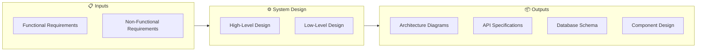

### 🆚 HLD vs LLD Comparison

| Aspect | High-Level Design (HLD) | Low-Level Design (LLD) |
|--------|------------------------|------------------------|
| **Focus** | What components exist | How components work internally |
| **Audience** | Architects, Managers | Developers |
| **Detail** | Box & arrow diagrams | Class diagrams, code structure |
| **Example** | "Use Redis for caching" | "Implement LRU with Redis ZSET" |

---

## 🔑 Key Concepts

### 1. Scalability

> The ability of a system to handle growing amounts of work

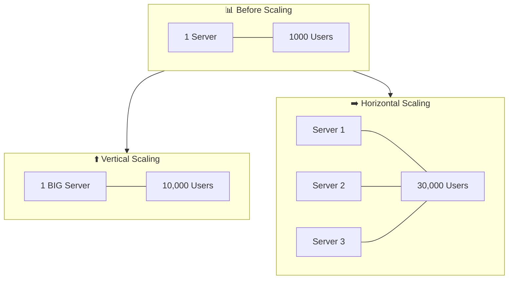

#### 📊 Scaling Comparison Table

| Factor | Vertical Scaling ⬆️ | Horizontal Scaling ➡️ |
|--------|---------------------|----------------------|
| **Cost** | 💰💰💰 Expensive (bigger hardware) | 💰 Cost-effective (commodity servers) |
| **Complexity** | ✅ Simple | ⚠️ Complex (distributed systems) |
| **Limit** | ❌ Hardware ceiling | ✅ Virtually unlimited |
| **Downtime** | ❌ Required for upgrade | ✅ No downtime (rolling) |
| **Failure** | ❌ Single point | ✅ Fault tolerant |

#### 💡 Real-World Example: Instagram Growth

```
2010: 1 server (vertical)
      ↓
2012: 3 servers + load balancer
      ↓
2015: 100+ servers + microservices
      ↓
2020: Thousands of servers across regions
```

---

### 2. Availability

> The percentage of time a system is operational

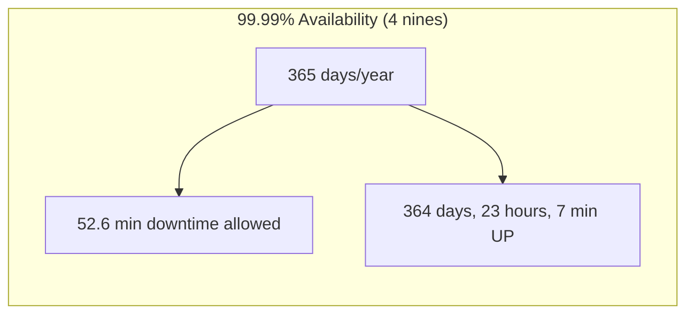

#### 📊 The "Nines" Table

| Availability | Downtime/Year | Downtime/Month | Downtime/Day | Used By |
|--------------|---------------|----------------|--------------|---------|
| 99% (2 nines) | 3.65 days | 7.3 hours | 14.4 min | Dev environments |
| 99.9% (3 nines) | 8.76 hours | 43.8 min | 1.4 min | Business apps |
| 99.99% (4 nines) | 52.6 min | 4.4 min | 8.6 sec | Cloud platforms |
| 99.999% (5 nines) | 5.26 min | 26.3 sec | 0.86 sec | Banking, Telecom |
| 99.9999% (6 nines) | 31.5 sec | 2.6 sec | 0.086 sec | NASA Mission Critical |

#### 🔢 Calculating Combined Availability

```
Two components in SERIES (both must work):
A = A1 × A2
Example: 99.9% × 99.9% = 99.8%

Two components in PARALLEL (either can work):
A = 1 - (1-A1) × (1-A2)  
Example: 1 - (0.001 × 0.001) = 99.9999%
```

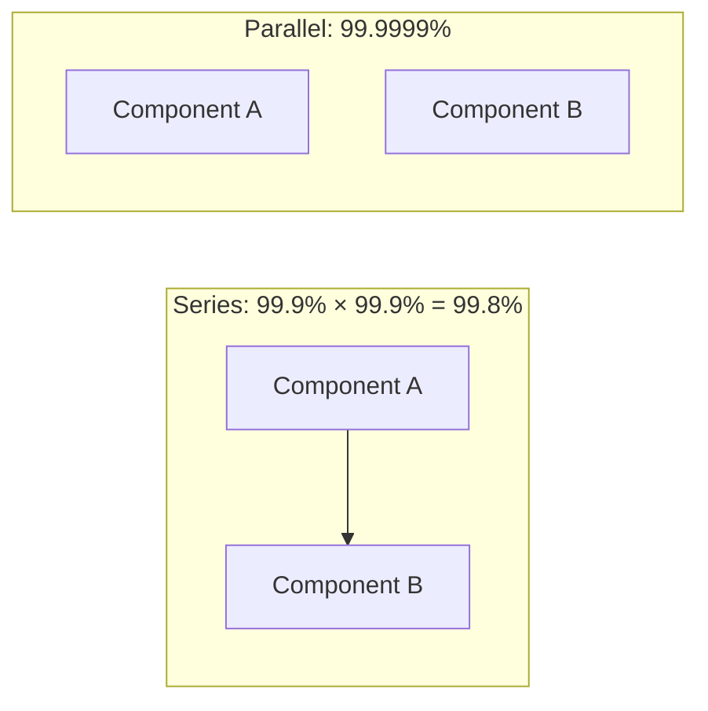

---

### 3. Reliability vs Availability

> Often confused but different!

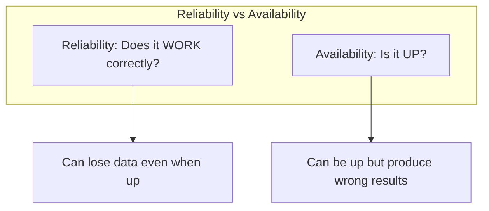

| Scenario | Available? | Reliable? |
|----------|------------|-----------|
| System is down | ❌ No | N/A |
| System is up, returns correct data | ✅ Yes | ✅ Yes |
| System is up, returns wrong data | ✅ Yes | ❌ No |
| System is up, loses some transactions | ✅ Yes | ❌ No |

---

### 4. Latency vs Throughput

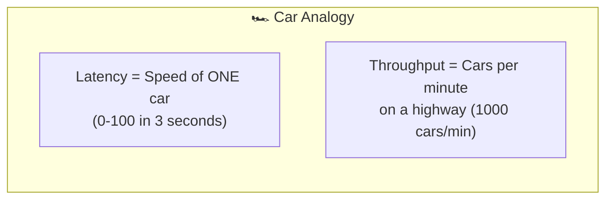

| Metric | Definition | Analogy | Example |
|--------|------------|---------|---------|
| **Latency** | Time for ONE request | How fast one car goes | 200ms response |
| **Throughput** | Requests per second | Cars per hour on highway | 10,000 RPS |
| **Bandwidth** | Maximum capacity | Highway lanes | 1 Gbps network |

#### 📊 Latency Numbers Every Developer Should Know

```
┌─────────────────────────────────────────────────────────────────┐
│ Operation                              │ Time          │ Visual │
├─────────────────────────────────────────────────────────────────┤
│ L1 cache reference                     │ 0.5 ns        │ .      │
│ L2 cache reference                     │ 7 ns          │ .      │
│ Main memory reference                  │ 100 ns        │ ..     │
│ SSD random read                        │ 150,000 ns    │ ████   │
│ HDD seek                               │ 10,000,000 ns │ ██████████████████ │
│ Send packet CA→Netherlands→CA          │ 150,000,000 ns│ ████████████████████████████ │
└─────────────────────────────────────────────────────────────────┘
```

---

## 📊 CAP Theorem

> In a distributed system, you can only guarantee **2 out of 3** properties

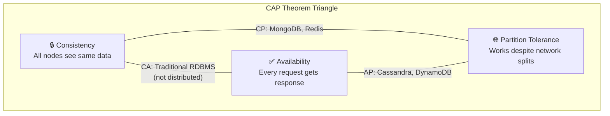

#### 🎯 Visual: CAP Trade-offs

```
                    Consistency
                        ▲
                       /|\
                      / | \
                     /  |  \
                    /   |   \
                   / CP | CA \
                  /     |     \
                 /______|______\
                /       |       \
               /________|________\
        Partition              Availability
        Tolerance       AP
```

#### 💡 Real-World CAP Decisions

| System | Choice | Why? |
|--------|--------|------|
| **Banking** | CP | Money must be consistent, even if temporarily unavailable |
| **Netflix** | AP | Video must play, slight delay in "continue watching" is OK |
| **Twitter Feed** | AP | See tweets (eventually consistent) is better than seeing nothing |
| **Inventory System** | CP | Can't oversell products |

---

## 🏗️ Architecture Patterns

### Pattern Comparison Matrix

| Pattern | Complexity | Scalability | Best For |
|---------|------------|-------------|----------|
| **Monolithic** | 🟢 Low | 🔴 Limited | Startups, MVPs |
| **Microservices** | 🔴 High | 🟢 Excellent | Large teams, Scale |
| **Serverless** | 🟡 Medium | 🟢 Auto-scale | Event-driven, Variable load |
| **Event-Driven** | 🔴 High | 🟢 Excellent | Real-time, Decoupled |

### 1. Monolithic Architecture

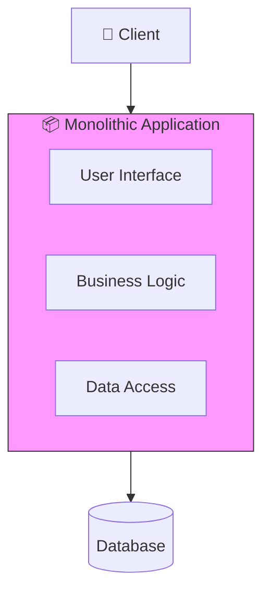

| Pros ✅ | Cons ❌ |
|---------|---------|
| Simple to develop | Hard to scale individual parts |
| Easy to deploy (one artifact) | One bug can crash everything |
| Easy to debug | Technology lock-in |
| Good for small teams | Deployment affects entire system |

### 2. Microservices Architecture

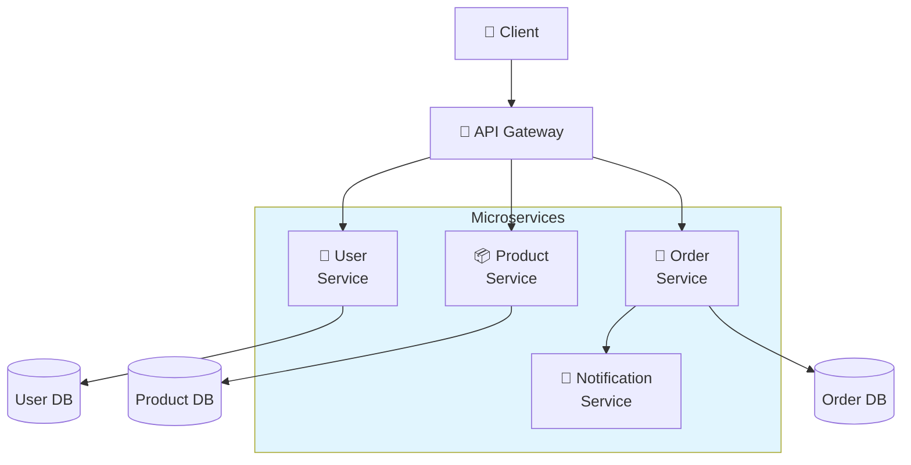

| Pros ✅ | Cons ❌ |
|---------|---------|
| Independent scaling | Distributed system complexity |
| Technology flexibility | Network latency |
| Fault isolation | Data consistency challenges |
| Faster deployments | Operational overhead |

### 3. Event-Driven Architecture

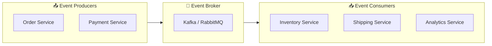

**Event Example:**
```json
{
  "event_type": "ORDER_PLACED",
  "timestamp": "2026-01-26T10:00:00Z",
  "data": {
    "order_id": "12345",
    "user_id": "user_789",
    "total": 99.99
  }
}
```

---

## 📝 System Design Interview Framework

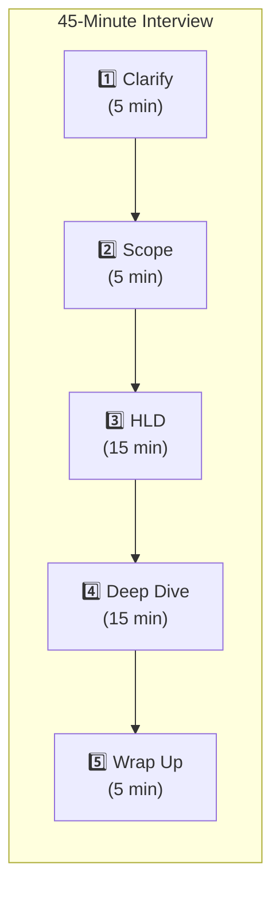

### 📋 Checklist for Each Step

#### Step 1: Clarify Requirements (5 min)
- [ ] What are the main features?
- [ ] Who are the users?
- [ ] How many users (DAU/MAU)?
- [ ] Read vs Write ratio?
- [ ] Any special constraints?

#### Step 2: Define Scope (5 min)
- [ ] In-scope features (focus on core)
- [ ] Out-of-scope (acknowledge but defer)
- [ ] Non-functional: Latency, Availability, Consistency

#### Step 3: High-Level Design (15 min)
- [ ] Draw architecture diagram
- [ ] Identify main components
- [ ] Show data flow
- [ ] Explain component interactions

#### Step 4: Deep Dive (15 min)
- [ ] Database schema
- [ ] API design
- [ ] One complex component in detail
- [ ] Handle edge cases

#### Step 5: Wrap Up (5 min)
- [ ] Discuss trade-offs made
- [ ] Bottlenecks & solutions
- [ ] Future improvements
- [ ] Monitoring approach

---

## 🔢 Back-of-Envelope Calculations

### 📊 Powers of 2 Reference

```
2^10 = 1 Thousand (KB)      = 1,024
2^20 = 1 Million (MB)       = 1,048,576
2^30 = 1 Billion (GB)       = 1,073,741,824
2^40 = 1 Trillion (TB)      = 1,099,511,627,776
```

### ⏱️ Time Conversions

| Period | Seconds |
|--------|---------|
| 1 minute | 60 |
| 1 hour | 3,600 |
| 1 day | 86,400 |
| 1 month | 2.5 million |
| 1 year | 31.5 million |

### 💾 Storage Estimation Example

**Question:** How much storage for Twitter for 1 year?

```
Given:
- 500M tweets/day
- Average tweet: 200 bytes (text)
- 10% have images: 200KB each
- 1% have videos: 5MB each

Calculation:
Text:   500M × 200B × 365 = 36.5 TB/year
Images: 50M × 200KB × 365 = 3.65 PB/year  
Videos: 5M × 5MB × 365 = 9.1 PB/year
                         ─────────────
Total:                   ~13 PB/year
```

### 🖥️ Server Estimation Example

**Question:** How many servers for 1M concurrent users?

```
Assumptions:
- Each server: 16 cores, 32GB RAM
- Each connection: 10KB memory
- Each server handles: 10,000 connections

Calculation:
Servers = 1,000,000 / 10,000 = 100 servers
With 50% buffer = 150 servers
With 2x for redundancy = 300 servers
```

---

## 🎓 Key Takeaways Summary

| Concept | Remember This |
|---------|---------------|
| **Scalability** | Horizontal > Vertical for modern systems |
| **Availability** | Each "nine" = 10x harder to achieve |
| **CAP Theorem** | You MUST choose, can't have all 3 |
| **Microservices** | Great for scale, complex to manage |
| **Estimation** | Order of magnitude matters, not exact numbers |

---

## 📚 Next Steps

1. [CAP Theorem Deep Dive](./02-cap-theorem.md) - Understand trade-offs
2. [Scalability Patterns](./03-scalability-patterns.md) - Practical techniques
3. [Components Overview](../../companies/australia/anz/01-company-overview.md) - Building blocks

---

*Master these fundamentals before diving into system designs!* 🚀
