[🏠 Home](../../../README.md) | [⬅️ CAP Theorem](./02-cap-theorem.md) | [➡️ PostgreSQL Guide](./04-postgresql-guide.md)

# 📈 Scalability Patterns

> How to design systems that handle millions of users

---

## 🎯 Quick Reference: When to Use What

| Pattern | Problem It Solves | Example |
|---------|-------------------|---------|
| **Replication** | Read bottleneck | MySQL read replicas |
| **Sharding** | Data too big for one DB | User ID-based sharding |
| **Caching** | Repeated expensive queries | Redis for sessions |
| **Async Processing** | Slow operations blocking users | Email via queue |
| **CDN** | Slow static content delivery | CloudFront for images |
| **Load Balancing** | Single server overload | Nginx round-robin |

---

## 📊 The Scaling Journey

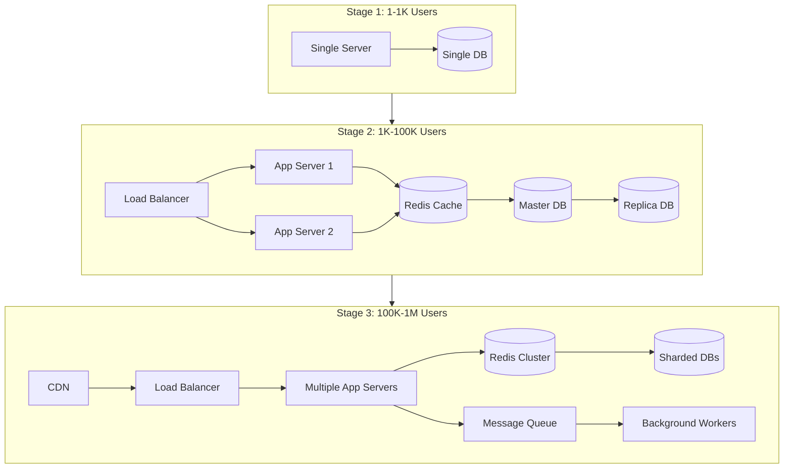

---

## ⬆️ Vertical vs ➡️ Horizontal Scaling

### Visual Comparison

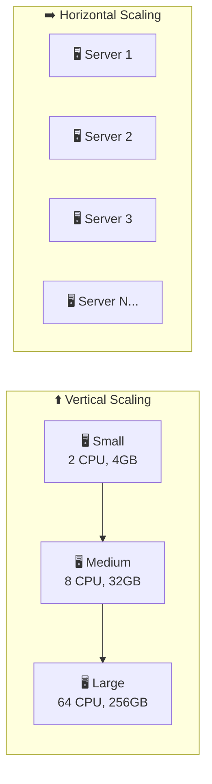

### 📊 Detailed Comparison

| Aspect | Vertical ⬆️ | Horizontal ➡️ |
|--------|-------------|---------------|
| **How** | Bigger machine | More machines |
| **Cost curve** | 📈 Exponential | 📉 Linear |
| **Limit** | Hardware max | ♾️ Unlimited |
| **Downtime** | Required | Zero (rolling) |
| **Complexity** | 🟢 Simple | 🔴 Complex |
| **Data** | Single location | Distributed |
| **Example** | AWS m5.24xlarge | 10x m5.xlarge |

### 💰 Cost Example

```
Vertical Scaling:
  m5.xlarge (4 CPU, 16GB)  = $0.19/hour
  m5.4xlarge (16 CPU, 64GB) = $0.77/hour (4x CPU, 4x cost)
  m5.12xlarge (48 CPU, 192GB) = $2.30/hour (12x CPU, 12x cost)
  
Horizontal Scaling:
  3x m5.xlarge = $0.57/hour for 12 CPU + fault tolerance ✅
```

---

## 🔑 Pattern 1: Database Replication

### How It Works

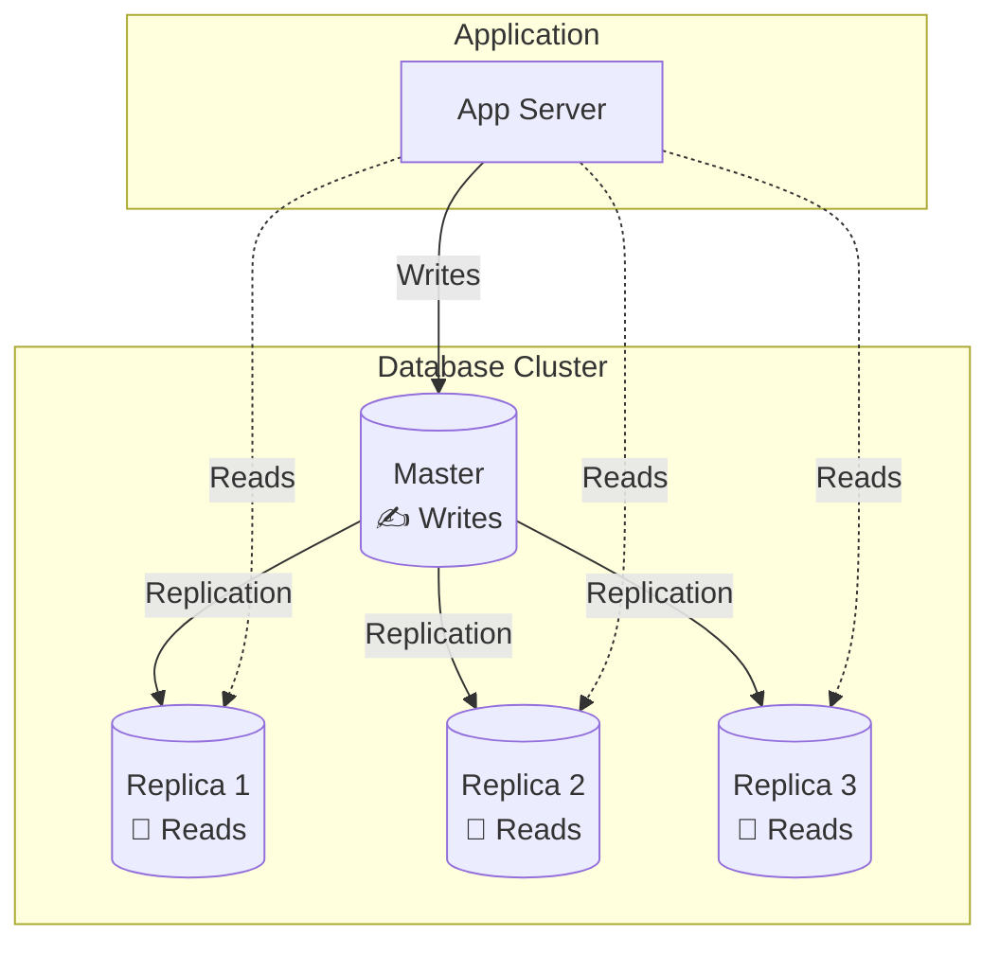

### Replication Patterns

| Pattern | Write | Read | Consistency | Use Case |
|---------|-------|------|-------------|----------|
| **Master-Slave** | Master only | Slaves | Strong | Most read-heavy apps |
| **Master-Master** | Any master | Any | Eventual | Multi-region |
| **Synchronous** | Wait for all | Any | Strong | Financial data |
| **Asynchronous** | Don't wait | Any | Eventual | Social media |

### ⚠️ Replication Lag Problem

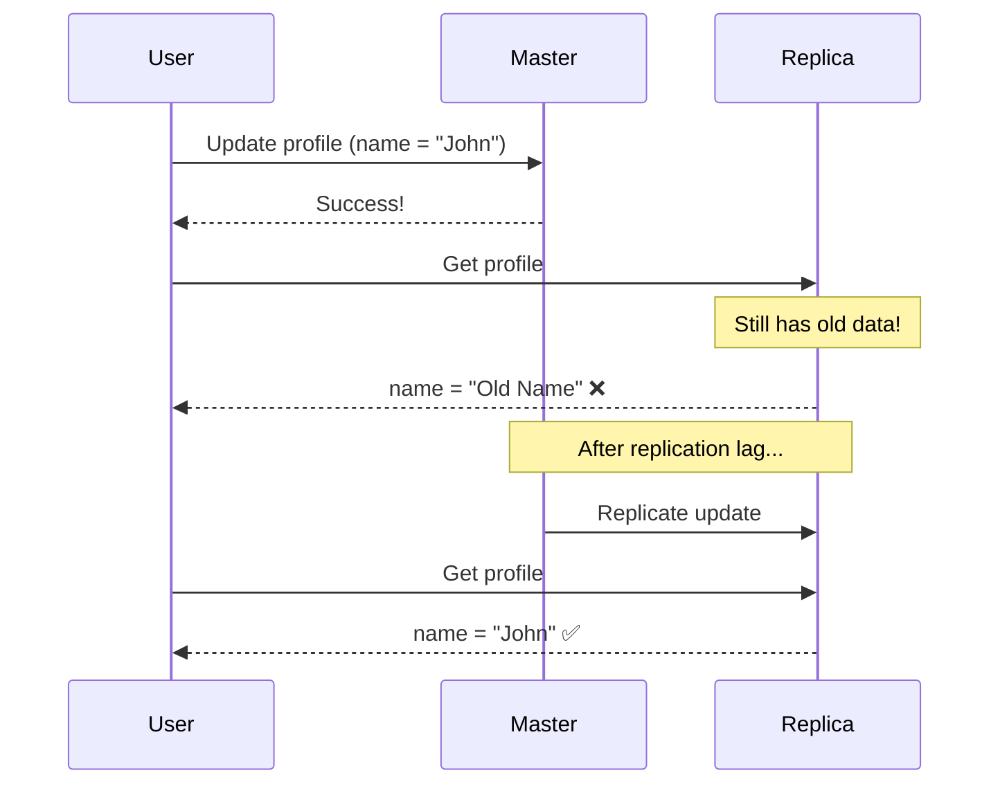

**Solutions:**
1. Read your own writes (sticky sessions)
2. Read from master for critical data
3. Show loading state during lag window

---

## 🔑 Pattern 2: Database Sharding

### What is Sharding?

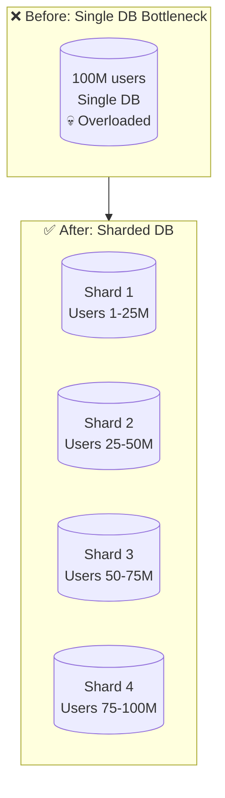

### Sharding Strategies Comparison

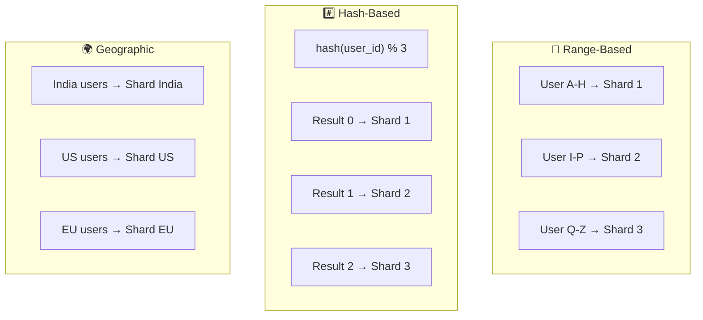

| Strategy | Pros | Cons | Best For |
|----------|------|------|----------|
| **Range** | Easy to implement, range queries work | Hot spots if uneven | Time-series, A-Z data |
| **Hash** | Even distribution | Range queries need all shards | User data |
| **Geographic** | Low latency per region | Cross-region queries slow | Global apps |
| **Directory** | Flexible assignment | Single point of failure | Complex routing |

### ⚠️ Sharding Challenges

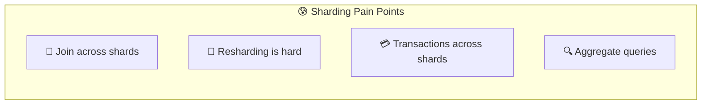

| Challenge | Mitigation |
|-----------|------------|
| Joins across shards | Denormalize data, application-level joins |
| Resharding | Use consistent hashing |
| Transactions | Saga pattern, avoid cross-shard |
| Aggregations | Pre-compute, use analytics DB |

### Consistent Hashing Visualization

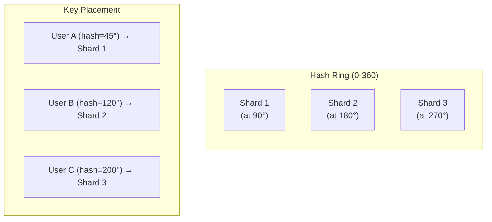

---

## 🔑 Pattern 3: Caching Layers

### Cache Hierarchy

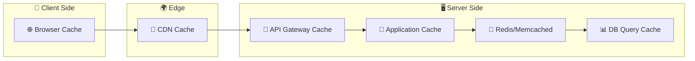

### Cache Strategies Visual

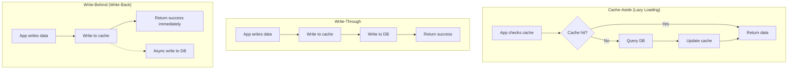

### 📊 Strategy Comparison

| Strategy | Read Perf | Write Perf | Consistency | Use Case |
|----------|-----------|------------|-------------|----------|
| **Cache-Aside** | ⭐⭐⭐ | ⭐⭐ | ⭐⭐ | Read-heavy, can tolerate stale |
| **Write-Through** | ⭐⭐⭐ | ⭐ | ⭐⭐⭐ | Need consistency |
| **Write-Behind** | ⭐⭐⭐ | ⭐⭐⭐ | ⭐ | Write-heavy, can lose data |
| **Read-Through** | ⭐⭐⭐ | ⭐⭐ | ⭐⭐ | Simplify app code |

### Cache Invalidation Patterns

```
"There are only two hard things in Computer Science: 
cache invalidation and naming things."
                                    - Phil Karlton
```

| Pattern | How | When to Use |
|---------|-----|-------------|
| **TTL (Time-to-Live)** | Auto-expire after X seconds | When staleness is acceptable |
| **Write-Invalidate** | Delete cache on write | Strong consistency needed |
| **Write-Update** | Update cache on write | Frequent reads after writes |
| **Event-Based** | Invalidate on event | Complex invalidation rules |

---

## 🔑 Pattern 4: Async Processing

### The Problem

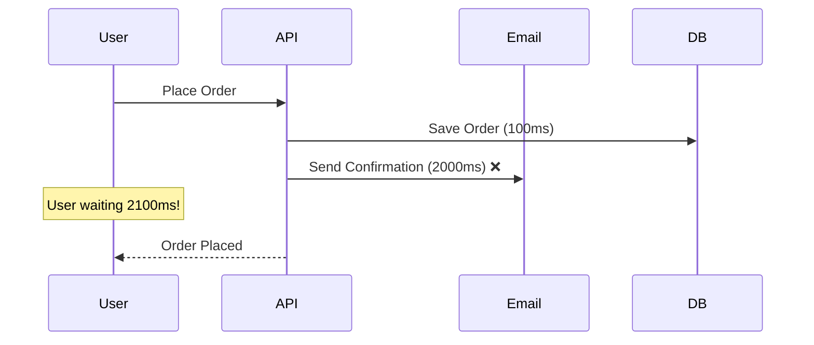

### The Solution

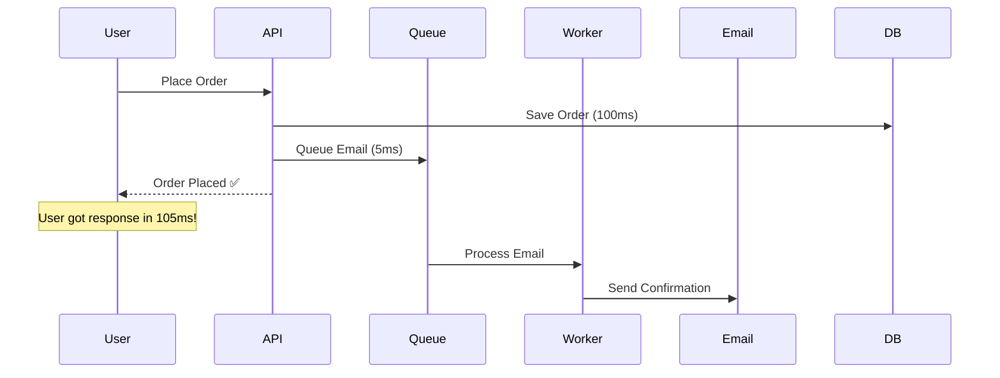

### Message Queue Visualization

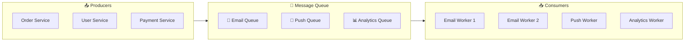

### 📊 Queue vs Pub/Sub

| Aspect | Queue | Pub/Sub |
|--------|-------|---------|
| **Delivery** | One consumer | All subscribers |
| **Use Case** | Task distribution | Event broadcasting |
| **Example** | Email sending | Order placed event |
| **Tools** | SQS, Celery | Kafka, SNS, Redis Pub/Sub |

---

## 🔑 Pattern 5: CQRS

### Command Query Responsibility Segregation

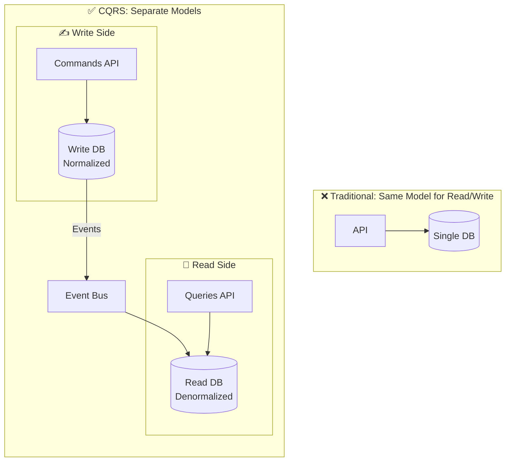

### When to Use CQRS

| ✅ Use CQRS When | ❌ Avoid CQRS When |
|------------------|-------------------|
| Read and write patterns differ greatly | Simple CRUD application |
| Complex queries need optimization | Read/write patterns similar |
| High scalability required | Small team |
| Event sourcing is used | Tight budget/timeline |

---

## 🌐 Multi-Region Architecture

### Global Distribution

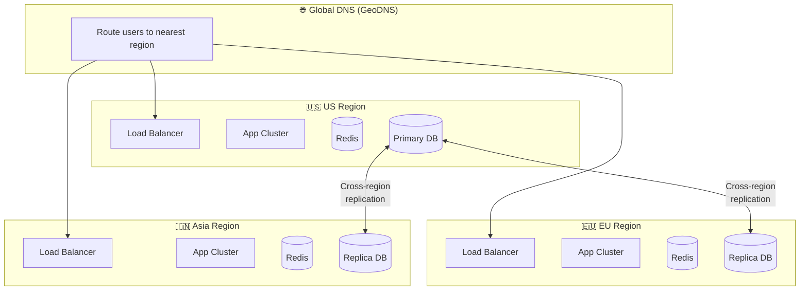

### Latency Impact

```
📍 Without Multi-Region (US-only):
  - US User: 50ms ✅
  - EU User: 150ms 😐
  - Asia User: 250ms ❌

📍 With Multi-Region:
  - US User: 50ms ✅
  - EU User: 50ms ✅
  - Asia User: 50ms ✅
```

---

## 📏 Capacity Planning

### Formula

```
Required Servers = (Peak RPS × Latency in sec) / Concurrent Connections per Server
```

### 📊 Example Calculation

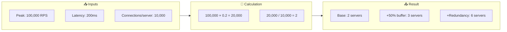

---

## 📚 Summary Cheat Sheet

```
┌────────────────────────────────────────────────────────────────┐
│                    SCALABILITY CHEAT SHEET                      │
├────────────────────────────────────────────────────────────────┤
│ Stage 1 (1-1K users):                                          │
│   → Single server, single DB                                   │
│                                                                 │
│ Stage 2 (1K-100K users):                                       │
│   → Load balancer + multiple app servers                       │
│   → Add caching (Redis)                                        │
│   → Add read replicas                                          │
│                                                                 │
│ Stage 3 (100K-1M users):                                       │
│   → CDN for static content                                     │
│   → Message queues for async                                   │
│   → Database sharding                                          │
│   → Microservices                                              │
│                                                                 │
│ Stage 4 (1M+ users):                                           │
│   → Multi-region deployment                                    │
│   → CQRS for complex queries                                   │
│   → Event-driven architecture                                  │
└────────────────────────────────────────────────────────────────┘
```

---

## 🎓 Key Takeaways

| Lesson | Remember |
|--------|----------|
| Start simple | Don't over-engineer from day 1 |
| Scale when needed | Measure first, then optimize |
| Cache everything | Redis is your friend |
| Go async | Don't block users |
| Replicate before sharding | Sharding is hard |

---

*Start simple, scale as needed!* 🚀
