[🏠 Home](../../../README.md) | [⬅️ DBMS Fundamentals](./03b-dbms-fundamentals.md) | [➡️ PostgreSQL Guide](./04-postgresql-guide.md)

# Database Modeling: Schema Design & Patterns

A comprehensive guide to database modeling, covering conceptual/logical/physical design, data modeling patterns, anti-patterns, and real-world schema examples for various use cases.

---

## Table of Contents

1. [Modeling Process](#1-modeling-process)
2. [Conceptual Modeling](#2-conceptual-modeling)
3. [Logical Modeling](#3-logical-modeling)
4. [Physical Modeling](#4-physical-modeling)
5. [Common Patterns](#5-common-patterns)
6. [Anti-Patterns](#6-anti-patterns)
7. [Use Case Examples](#7-use-case-examples)
8. [NoSQL Data Modeling](#8-nosql-data-modeling)

---

## 1. Modeling Process

### Three-Level Architecture


### Design Process

```
┌─────────────────────────────────────────────────────────────┐
│                  Database Design Workflow                    │
├─────────────────────────────────────────────────────────────┤
│                                                              │
│  1. REQUIREMENTS GATHERING                                   │
│     └─ Interview stakeholders                               │
│     └─ Document use cases                                   │
│     └─ Identify data entities                               │
│                                                              │
│  2. CONCEPTUAL DESIGN                                        │
│     └─ Create ER diagram                                    │
│     └─ Define entities and relationships                    │
│     └─ Validate with business users                         │
│                                                              │
│  3. LOGICAL DESIGN                                           │
│     └─ Map to relational tables                             │
│     └─ Normalize (typically to 3NF/BCNF)                    │
│     └─ Define keys and constraints                          │
│                                                              │
│  4. PHYSICAL DESIGN                                          │
│     └─ Choose data types                                    │
│     └─ Define indexes                                       │
│     └─ Plan partitioning                                    │
│     └─ Optimize for workload                                │
│                                                              │
│  5. IMPLEMENTATION & ITERATE                                 │
│     └─ Create database                                      │
│     └─ Monitor performance                                  │
│     └─ Refine based on actual usage                         │
│                                                              │
└─────────────────────────────────────────────────────────────┘
```

---

## 2. Conceptual Modeling

### Entity-Relationship Diagrams

**Core Components:**

| Component | Symbol | Description |
|-----------|--------|-------------|
| **Entity** | Rectangle | A thing of significance (Customer, Order) |
| **Attribute** | Oval | Property of an entity (name, email) |
| **Relationship** | Diamond | Association between entities (places, contains) |
| **Primary Key** | Underlined | Unique identifier attribute |

### Cardinality Notation

```mermaid
graph LR
    subgraph "Cardinality Symbols (Crow's Foot)"
        One["| (one)"]
        Many["< (many)"]
        Optional["○ (optional)"]
        Mandatory["| (mandatory)"]
    end
```



| Relationship | Notation | Example |
|--------------|----------|---------|
| One-to-One Mandatory | `||--||` | Person ↔ Passport |
| One-to-One Optional | `|o--o|` | Employee ↔ ParkingSpot |
| One-to-Many | `||--o{` | Department → Employees |
| Many-to-Many | `}o--o{` | Students ↔ Courses |

### ER Diagram Example


### Identifying Entity Types

| Entity Type | Characteristics | Example |
|-------------|-----------------|---------|
| **Strong Entity** | Has own primary key | Customer, Product |
| **Weak Entity** | Depends on parent for identity | OrderLine (depends on Order) |
| **Associative Entity** | Represents M:N relationship | Enrollment (Student-Course) |

---

## 3. Logical Modeling

### Mapping ER to Relational Schema

```
┌─────────────────────────────────────────────────────────────┐
│                   ER to Relational Mapping                   │
├─────────────────────────────────────────────────────────────┤
│                                                              │
│  ENTITY → TABLE                                              │
│    - Each entity becomes a table                            │
│    - Attributes become columns                              │
│    - PK becomes PRIMARY KEY constraint                      │
│                                                              │
│  1:1 RELATIONSHIP                                            │
│    - Add FK to either table (prefer mandatory side)         │
│    - Or merge into single table                             │
│                                                              │
│  1:N RELATIONSHIP                                            │
│    - Add FK to the "many" side table                        │
│                                                              │
│  M:N RELATIONSHIP                                            │
│    - Create junction/bridge table                           │
│    - Junction has FKs to both tables                        │
│    - Composite PK of both FKs (or surrogate key)           │
│                                                              │
│  MULTI-VALUED ATTRIBUTE                                      │
│    - Create separate table with FK to parent               │
│                                                              │
└─────────────────────────────────────────────────────────────┘
```

### Logical Schema Example

```sql
-- Customer (Strong Entity)
CREATE TABLE customers (
    customer_id SERIAL PRIMARY KEY,
    name VARCHAR(100) NOT NULL,
    email VARCHAR(255) UNIQUE NOT NULL,
    phone VARCHAR(20),
    created_at TIMESTAMP DEFAULT CURRENT_TIMESTAMP
);

-- Order (Strong Entity, 1:N with Customer)
CREATE TABLE orders (
    order_id SERIAL PRIMARY KEY,
    customer_id INT NOT NULL REFERENCES customers(customer_id),
    order_date DATE NOT NULL DEFAULT CURRENT_DATE,
    status VARCHAR(20) DEFAULT 'pending',
    total_amount DECIMAL(12,2),
    CONSTRAINT chk_status CHECK (status IN ('pending', 'confirmed', 'shipped', 'delivered', 'cancelled'))
);

-- Product (Strong Entity)
CREATE TABLE products (
    product_id SERIAL PRIMARY KEY,
    sku VARCHAR(50) UNIQUE NOT NULL,
    name VARCHAR(200) NOT NULL,
    price DECIMAL(10,2) NOT NULL CHECK (price >= 0),
    category_id INT REFERENCES categories(category_id),
    supplier_id INT REFERENCES suppliers(supplier_id)
);

-- OrderLine (Weak Entity / M:N between Order and Product)
CREATE TABLE order_lines (
    order_id INT REFERENCES orders(order_id) ON DELETE CASCADE,
    product_id INT REFERENCES products(product_id),
    quantity INT NOT NULL CHECK (quantity > 0),
    unit_price DECIMAL(10,2) NOT NULL,
    PRIMARY KEY (order_id, product_id)
);

-- Category (Self-referencing for hierarchy)
CREATE TABLE categories (
    category_id SERIAL PRIMARY KEY,
    name VARCHAR(100) NOT NULL,
    parent_id INT REFERENCES categories(category_id)
);
```

### Constraint Types

| Constraint | Purpose | Example |
|------------|---------|---------|
| `PRIMARY KEY` | Unique row identifier | `customer_id` |
| `FOREIGN KEY` | Referential integrity | `customer_id REFERENCES customers` |
| `UNIQUE` | No duplicates | `email UNIQUE` |
| `NOT NULL` | Required value | `name NOT NULL` |
| `CHECK` | Custom validation | `price >= 0` |
| `DEFAULT` | Auto-fill value | `created_at DEFAULT NOW()` |

---

## 4. Physical Modeling

### Data Type Selection

```
┌─────────────────────────────────────────────────────────────┐
│                   Data Type Guidelines                       │
├─────────────────────────────────────────────────────────────┤
│                                                              │
│  INTEGERS                                                    │
│  ┌───────────────┬──────────┬────────────────────────────┐ │
│  │ Type          │ Bytes    │ Range                      │ │
│  ├───────────────┼──────────┼────────────────────────────┤ │
│  │ SMALLINT      │ 2        │ -32,768 to 32,767         │ │
│  │ INT           │ 4        │ -2B to 2B                 │ │
│  │ BIGINT        │ 8        │ -9 quintillion            │ │
│  └───────────────┴──────────┴────────────────────────────┘ │
│                                                              │
│  Use smallest type that fits. IDs often need BIGINT.        │
│                                                              │
│  STRINGS                                                     │
│  ┌───────────────┬────────────────────────────────────────┐│
│  │ CHAR(n)       │ Fixed length, padded (use rarely)     ││
│  │ VARCHAR(n)    │ Variable length, most common          ││
│  │ TEXT          │ Unlimited (avoid in indexes)          ││
│  └───────────────┴────────────────────────────────────────┘│
│                                                              │
│  VARCHAR(255) is common default, but size appropriately.   │
│                                                              │
│  DECIMALS                                                    │
│  ┌───────────────┬────────────────────────────────────────┐│
│  │ DECIMAL(p,s)  │ Exact precision (money: DECIMAL(12,2))││
│  │ FLOAT/DOUBLE  │ Approximate (scientific data)         ││
│  └───────────────┴────────────────────────────────────────┘│
│                                                              │
│  NEVER use FLOAT for money! Use DECIMAL or store cents.    │
│                                                              │
└─────────────────────────────────────────────────────────────┘
```

### Index Strategy


**Index Types by Use Case:**

| Pattern | Index Type | Example |
|---------|------------|---------|
| Equality lookup | B-Tree | `WHERE email = ?` |
| Range query | B-Tree | `WHERE date BETWEEN ? AND ?` |
| Multiple columns | Composite B-Tree | `WHERE a = ? AND b > ?` |
| Full-text search | GIN/Full-text | Search product descriptions |
| JSON queries | GIN | `WHERE data @> '{"status": "active"}'` |
| Geospatial | R-Tree/GiST | Find nearby locations |

### Partitioning Strategy

```
┌─────────────────────────────────────────────────────────────┐
│              Partitioning Decision Matrix                    │
├─────────────────────────────────────────────────────────────┤
│                                                              │
│  Table Size > 50GB?                                          │
│    └─ YES → Consider partitioning                           │
│                                                              │
│  Time-series data with date-based queries?                  │
│    └─ YES → RANGE partition by date                         │
│                                                              │
│  Multi-tenant with tenant isolation needs?                  │
│    └─ YES → LIST partition by tenant_id                     │
│                                                              │
│  Need even distribution for parallel workload?              │
│    └─ YES → HASH partition by key                           │
│                                                              │
│  Old data archived/deleted regularly?                        │
│    └─ YES → RANGE partition (drop partitions)               │
│                                                              │
└─────────────────────────────────────────────────────────────┘
```

---

## 5. Common Patterns

### 5.1 Self-Referencing (Hierarchy)

For tree structures like categories, org charts, or comments.

```sql
-- Adjacency List (simple, slow for deep trees)
CREATE TABLE categories (
    id SERIAL PRIMARY KEY,
    name VARCHAR(100),
    parent_id INT REFERENCES categories(id)
);

-- Recursive query
WITH RECURSIVE category_tree AS (
    SELECT id, name, parent_id, 0 AS depth
    FROM categories WHERE parent_id IS NULL
    UNION ALL
    SELECT c.id, c.name, c.parent_id, ct.depth + 1
    FROM categories c
    JOIN category_tree ct ON c.parent_id = ct.id
)
SELECT * FROM category_tree;
```

```sql
-- Materialized Path (fast reads, tricky updates)
CREATE TABLE categories (
    id SERIAL PRIMARY KEY,
    name VARCHAR(100),
    path VARCHAR(500)  -- e.g., '1/5/23/142'
);

-- Find all descendants
SELECT * FROM categories WHERE path LIKE '1/5/%';

-- Find ancestors (application parses path)
```

```sql
-- Nested Sets (fast subtree queries, slow updates)
CREATE TABLE categories (
    id SERIAL PRIMARY KEY,
    name VARCHAR(100),
    lft INT NOT NULL,
    rgt INT NOT NULL
);

-- Find all descendants
SELECT * FROM categories WHERE lft > 5 AND rgt < 42;

-- Find ancestors
SELECT * FROM categories WHERE lft < 5 AND rgt > 42;
```

### 5.2 Polymorphic Associations

When multiple tables relate to one table.

```sql
-- Option 1: Separate Foreign Keys (recommended)
CREATE TABLE comments (
    id SERIAL PRIMARY KEY,
    body TEXT,
    post_id INT REFERENCES posts(id),
    product_id INT REFERENCES products(id),
    article_id INT REFERENCES articles(id),
    CHECK (
        (post_id IS NOT NULL)::int +
        (product_id IS NOT NULL)::int +
        (article_id IS NOT NULL)::int = 1
    )
);

-- Option 2: Polymorphic columns (flexible, no FK constraint)
CREATE TABLE comments (
    id SERIAL PRIMARY KEY,
    body TEXT,
    commentable_type VARCHAR(50),  -- 'Post', 'Product', 'Article'
    commentable_id INT
);
CREATE INDEX idx_comments_poly ON comments(commentable_type, commentable_id);
```

### 5.3 Audit Trail

```sql
-- Dedicated audit table
CREATE TABLE audit_log (
    id BIGSERIAL PRIMARY KEY,
    table_name VARCHAR(100) NOT NULL,
    record_id BIGINT NOT NULL,
    action VARCHAR(10) NOT NULL,  -- INSERT, UPDATE, DELETE
    old_values JSONB,
    new_values JSONB,
    changed_by INT REFERENCES users(id),
    changed_at TIMESTAMP DEFAULT CURRENT_TIMESTAMP
);

-- Trigger for automatic auditing
CREATE OR REPLACE FUNCTION audit_trigger()
RETURNS TRIGGER AS $$
BEGIN
    IF TG_OP = 'INSERT' THEN
        INSERT INTO audit_log (table_name, record_id, action, new_values, changed_by)
        VALUES (TG_TABLE_NAME, NEW.id, 'INSERT', to_jsonb(NEW), current_user_id());
    ELSIF TG_OP = 'UPDATE' THEN
        INSERT INTO audit_log (table_name, record_id, action, old_values, new_values, changed_by)
        VALUES (TG_TABLE_NAME, NEW.id, 'UPDATE', to_jsonb(OLD), to_jsonb(NEW), current_user_id());
    ELSIF TG_OP = 'DELETE' THEN
        INSERT INTO audit_log (table_name, record_id, action, old_values, changed_by)
        VALUES (TG_TABLE_NAME, OLD.id, 'DELETE', to_jsonb(OLD), current_user_id());
    END IF;
    RETURN NEW;
END;
$$ LANGUAGE plpgsql;

CREATE TRIGGER audit_orders
AFTER INSERT OR UPDATE OR DELETE ON orders
FOR EACH ROW EXECUTE FUNCTION audit_trigger();
```

### 5.4 Soft Delete

```sql
CREATE TABLE users (
    id SERIAL PRIMARY KEY,
    email VARCHAR(255) UNIQUE,
    name VARCHAR(100),
    deleted_at TIMESTAMP NULL,
    deleted_by INT REFERENCES users(id)
);

-- Partial unique index (email unique only among non-deleted)
CREATE UNIQUE INDEX idx_users_email_active 
ON users(email) WHERE deleted_at IS NULL;

-- View for "active" records
CREATE VIEW active_users AS
SELECT * FROM users WHERE deleted_at IS NULL;
```

### 5.5 Temporal Data (Slowly Changing Dimensions)

```sql
-- Type 2: Full history with date ranges
CREATE TABLE product_prices (
    id SERIAL PRIMARY KEY,
    product_id INT REFERENCES products(id),
    price DECIMAL(10,2),
    valid_from DATE NOT NULL,
    valid_to DATE,  -- NULL means current
    CONSTRAINT no_overlap EXCLUDE USING gist (
        product_id WITH =,
        daterange(valid_from, valid_to, '[)') WITH &&
    )
);

-- Get current price
SELECT * FROM product_prices 
WHERE product_id = 123 AND valid_to IS NULL;

-- Get price at specific date
SELECT * FROM product_prices 
WHERE product_id = 123 
  AND valid_from <= '2024-06-15' 
  AND (valid_to IS NULL OR valid_to > '2024-06-15');
```

### 5.6 Multi-Tenant

```sql
-- Schema-per-tenant (strong isolation)
CREATE SCHEMA tenant_acme;
CREATE TABLE tenant_acme.orders (...);

-- Shared table with tenant_id (efficient)
CREATE TABLE orders (
    id BIGSERIAL,
    tenant_id INT NOT NULL,
    -- ... other columns
    PRIMARY KEY (tenant_id, id)
) PARTITION BY LIST (tenant_id);

CREATE TABLE orders_tenant_1 PARTITION OF orders FOR VALUES IN (1);
CREATE TABLE orders_tenant_2 PARTITION OF orders FOR VALUES IN (2);

-- Row-Level Security
ALTER TABLE orders ENABLE ROW LEVEL SECURITY;

CREATE POLICY tenant_isolation ON orders
    USING (tenant_id = current_setting('app.current_tenant')::int);
```

### 5.7 Tagging / Labeling

```sql
-- Entity-Attribute-Value for flexible tagging
CREATE TABLE tags (
    id SERIAL PRIMARY KEY,
    name VARCHAR(100) UNIQUE
);

CREATE TABLE product_tags (
    product_id INT REFERENCES products(id),
    tag_id INT REFERENCES tags(id),
    PRIMARY KEY (product_id, tag_id)
);

-- With GIN index for array approach
CREATE TABLE products (
    id SERIAL PRIMARY KEY,
    name VARCHAR(200),
    tags TEXT[]
);

CREATE INDEX idx_products_tags ON products USING GIN (tags);

-- Query products with specific tag
SELECT * FROM products WHERE tags @> ARRAY['electronics'];
```

---

## 6. Anti-Patterns

### 6.1 Entity-Attribute-Value (EAV) Overuse

```sql
-- ❌ Anti-pattern: Everything is EAV
CREATE TABLE entity_attributes (
    entity_id INT,
    attribute_name VARCHAR(100),
    attribute_value TEXT,
    PRIMARY KEY (entity_id, attribute_name)
);

-- Problems:
-- - No type safety
-- - No constraints
-- - Complex queries
-- - Poor performance

-- ✅ Better: JSONB for flexible schema
CREATE TABLE products (
    id SERIAL PRIMARY KEY,
    name VARCHAR(200),
    attributes JSONB
);

-- ✅ Or: Known columns + JSONB for extras
CREATE TABLE products (
    id SERIAL PRIMARY KEY,
    name VARCHAR(200),
    price DECIMAL(10,2),
    category_id INT,
    extra_attributes JSONB  -- For truly dynamic stuff
);
```

### 6.2 One True Lookup Table (OTLT)

```sql
-- ❌ Anti-pattern: Single table for all codes
CREATE TABLE lookup_values (
    id SERIAL PRIMARY KEY,
    category VARCHAR(50),  -- 'status', 'country', 'color'
    code VARCHAR(50),
    description VARCHAR(200)
);

-- Problems:
-- - No FK referential integrity
-- - Queries need extra filter
-- - Mixing unrelated data

-- ✅ Better: Separate tables or enums
CREATE TABLE order_statuses (
    code VARCHAR(20) PRIMARY KEY,
    description VARCHAR(100)
);

-- Or use ENUMs (PostgreSQL)
CREATE TYPE order_status AS ENUM ('pending', 'confirmed', 'shipped', 'delivered');
```

### 6.3 Storing Lists as Comma-Separated Values

```sql
-- ❌ Anti-pattern
CREATE TABLE users (
    id SERIAL PRIMARY KEY,
    name VARCHAR(100),
    roles VARCHAR(500)  -- 'admin,editor,viewer'
);

-- Problems:
-- - Can't enforce valid roles
-- - Can't index for query
-- - Can't join
-- - Parsing in application

-- ✅ Better: Junction table
CREATE TABLE user_roles (
    user_id INT REFERENCES users(id),
    role_id INT REFERENCES roles(id),
    PRIMARY KEY (user_id, role_id)
);
```

### 6.4 Metadata as Column Names

```sql
-- ❌ Anti-pattern: Column per date
CREATE TABLE sales (
    product_id INT,
    sales_2024_01 DECIMAL,
    sales_2024_02 DECIMAL,
    sales_2024_03 DECIMAL
    -- ... forever expanding columns
);

-- ✅ Better: Row per date
CREATE TABLE sales (
    product_id INT,
    sales_date DATE,
    amount DECIMAL,
    PRIMARY KEY (product_id, sales_date)
);
```

### 6.5 Insufficient Normalization

```sql
-- ❌ Anti-pattern: Repeated data
CREATE TABLE orders (
    order_id SERIAL PRIMARY KEY,
    customer_name VARCHAR(100),    -- Duplicated!
    customer_email VARCHAR(255),   -- Duplicated!
    customer_phone VARCHAR(20),    -- Duplicated!
    product_name VARCHAR(200),     -- Duplicated!
    product_price DECIMAL(10,2),   -- May be stale!
    ...
);

-- ✅ Better: Normalized with FKs
CREATE TABLE orders (
    order_id SERIAL PRIMARY KEY,
    customer_id INT REFERENCES customers(id),
    -- Capture price at time of order
    FOREIGN KEY (product_id) REFERENCES products(id)
);

CREATE TABLE order_lines (
    order_id INT,
    product_id INT,
    quantity INT,
    unit_price DECIMAL(10,2),  -- Snapshot of price at order time
    PRIMARY KEY (order_id, product_id)
);
```

---

## 7. Use Case Examples

### 7.1 E-Commerce


### 7.2 Social Network


### 7.3 SaaS Multi-Tenant

```sql
-- Tenant table
CREATE TABLE tenants (
    id UUID PRIMARY KEY DEFAULT gen_random_uuid(),
    name VARCHAR(100) NOT NULL,
    subdomain VARCHAR(50) UNIQUE NOT NULL,
    plan VARCHAR(20) DEFAULT 'free',
    settings JSONB DEFAULT '{}',
    created_at TIMESTAMP DEFAULT NOW()
);

-- Users belong to tenants
CREATE TABLE users (
    id UUID PRIMARY KEY DEFAULT gen_random_uuid(),
    tenant_id UUID NOT NULL REFERENCES tenants(id),
    email VARCHAR(255) NOT NULL,
    role VARCHAR(20) DEFAULT 'member',
    UNIQUE (tenant_id, email)
);

-- All data tables include tenant_id
CREATE TABLE projects (
    id UUID PRIMARY KEY DEFAULT gen_random_uuid(),
    tenant_id UUID NOT NULL REFERENCES tenants(id),
    name VARCHAR(200) NOT NULL,
    owner_id UUID REFERENCES users(id),
    created_at TIMESTAMP DEFAULT NOW()
);

-- Indexes include tenant_id for partition pruning
CREATE INDEX idx_projects_tenant ON projects(tenant_id, created_at DESC);

-- Row-Level Security
ALTER TABLE projects ENABLE ROW LEVEL SECURITY;

CREATE POLICY tenant_policy ON projects
    FOR ALL
    USING (tenant_id = current_setting('app.tenant_id')::uuid)
    WITH CHECK (tenant_id = current_setting('app.tenant_id')::uuid);
```

### 7.4 IoT Time-Series

```sql
-- Time-series with partitioning
CREATE TABLE sensor_readings (
    sensor_id UUID NOT NULL,
    reading_time TIMESTAMPTZ NOT NULL,
    temperature REAL,
    humidity REAL,
    pressure REAL,
    metadata JSONB,
    PRIMARY KEY (sensor_id, reading_time)
) PARTITION BY RANGE (reading_time);

-- Create monthly partitions
CREATE TABLE sensor_readings_2024_01 PARTITION OF sensor_readings
    FOR VALUES FROM ('2024-01-01') TO ('2024-02-01');

-- BRIN index for time-ordered data
CREATE INDEX idx_readings_time ON sensor_readings USING BRIN (reading_time);

-- Continuous aggregate view (with pg_partman or TimescaleDB)
CREATE MATERIALIZED VIEW hourly_averages AS
SELECT 
    sensor_id,
    date_trunc('hour', reading_time) AS hour,
    AVG(temperature) AS avg_temp,
    AVG(humidity) AS avg_humidity,
    COUNT(*) AS reading_count
FROM sensor_readings
GROUP BY sensor_id, date_trunc('hour', reading_time);
```

---

## 8. NoSQL Data Modeling

### Document Model (MongoDB)

```javascript
// Embedded (for 1:1 or 1:few)
{
  _id: ObjectId("..."),
  name: "John Doe",
  email: "john@example.com",
  address: {           // Embedded document
    street: "123 Main St",
    city: "NYC",
    zip: "10001"
  },
  orders: [            // Embedded array (if small/bounded)
    { product: "Book", amount: 29.99, date: ISODate("...") }
  ]
}

// Referenced (for 1:many or many:many)
// User document
{
  _id: ObjectId("user123"),
  name: "John Doe"
}

// Order documents (reference user)
{
  _id: ObjectId("order456"),
  user_id: ObjectId("user123"),  // Reference
  products: [ObjectId("prod1"), ObjectId("prod2")]
}
```

**Embedding vs Referencing:**

| Factor | Embed | Reference |
|--------|-------|-----------|
| Relationship | 1:1, 1:few | 1:many, M:N |
| Read pattern | Always together | Separate queries |
| Update frequency | Rarely | Frequently |
| Size | < 16MB doc limit | Any size |
| Atomicity | Single doc atomic | Need transactions |

### Wide-Column (Cassandra)

```cql
-- Design for query, not normalization
-- Primary key = Partition key + Clustering columns

CREATE TABLE user_activity (
    user_id UUID,
    activity_date DATE,
    activity_time TIMESTAMP,
    activity_type TEXT,
    details MAP<TEXT, TEXT>,
    PRIMARY KEY ((user_id, activity_date), activity_time)
) WITH CLUSTERING ORDER BY (activity_time DESC);

-- Query: All activities for user on specific date (efficient)
SELECT * FROM user_activity 
WHERE user_id = ? AND activity_date = ?;

-- Anti-pattern: Query without partition key (full scan!)
-- SELECT * FROM user_activity WHERE activity_type = 'login';
```

### Key-Value (Redis)

```
# String: Simple values
SET user:1001:name "John Doe"
GET user:1001:name

# Hash: Object-like
HSET user:1001 name "John" email "john@example.com"
HGETALL user:1001

# List: Ordered collection
LPUSH user:1001:notifications "New message"
LRANGE user:1001:notifications 0 9

# Set: Unique values
SADD user:1001:roles admin editor
SISMEMBER user:1001:roles admin

# Sorted Set: Ranked data
ZADD leaderboard 1500 user:1001
ZADD leaderboard 2000 user:1002
ZREVRANGE leaderboard 0 9 WITHSCORES
```

---

## Quick Reference

### Modeling Checklist

```
□ Identify all entities and their attributes
□ Define primary keys (prefer surrogate keys for flexibility)
□ Establish relationships and cardinalities
□ Normalize to 3NF/BCNF minimum
□ Add appropriate constraints (NOT NULL, CHECK, UNIQUE)
□ Define indexes for query patterns
□ Consider partitioning for large tables
□ Plan for audit/history requirements
□ Document the schema
```

### Naming Conventions

| Element | Convention | Example |
|---------|------------|---------|
| Tables | Plural, snake_case | `order_lines` |
| Columns | Singular, snake_case | `customer_id` |
| Primary Keys | `id` or `table_id` | `order_id` |
| Foreign Keys | Referenced table singular + `_id` | `customer_id` |
| Indexes | `idx_table_columns` | `idx_orders_customer_date` |
| Constraints | `chk_table_description` | `chk_orders_positive_amount` |

### Quick Decisions

| Question | Recommendation |
|----------|----------------|
| Surrogate vs Natural key? | Surrogate (auto-increment/UUID) for flexibility |
| UUID vs Integer? | Integer for performance, UUID for distribution |
| Normalize or Denormalize? | Normalize first, denormalize for proven bottlenecks |
| NULL or Default? | Avoid NULL where possible, use meaningful defaults |
| Soft delete? | Yes for audit-critical data, No for performance-critical |

---

## Further Reading

- [Database Design for Mere Mortals](https://www.informit.com/store/database-design-for-mere-mortals-a-hands-on-guide-to-9780136788041)
- [The Art of PostgreSQL](https://theartofpostgresql.com/)
- [Designing Data Models for MongoDB](https://www.mongodb.com/docs/manual/data-modeling/)
- [Cassandra Data Modeling](https://cassandra.apache.org/doc/latest/cassandra/data_modeling/)

---

[🏠 Home](../../../README.md) | [⬅️ DBMS Fundamentals](./03b-dbms-fundamentals.md) | [➡️ PostgreSQL Guide](./04-postgresql-guide.md)
