[🏠 Home](../../../README.md) | [⬅️ Database Modeling](./03c-database-modeling.md) | [➡️ PostgreSQL Guide](./04-postgresql-guide.md)

# Spring Data JPA & Hibernate Deep Dive

A comprehensive guide to Java Persistence API (JPA) with Hibernate implementation and Spring Data JPA, covering entity mapping, relationships, transactions, caching, performance optimization, and best practices with practical examples.

---

## Table of Contents

1. [Architecture Overview](#1-architecture-overview)
2. [Entity Mapping](#2-entity-mapping)
3. [Relationships](#3-relationships)
4. [Inheritance Strategies](#4-inheritance-strategies)
5. [Transactions & Locking](#5-transactions--locking)
6. [Spring Data JPA](#6-spring-data-jpa)
7. [Performance Optimization](#7-performance-optimization)
8. [Best Practices](#8-best-practices)

---

## 1. Architecture Overview

### JPA vs Hibernate vs Spring Data JPA


| Layer | Description |
|-------|-------------|
| **JPA** | Specification/API (interfaces, annotations) |
| **Hibernate** | JPA implementation (actual ORM logic) |
| **Spring Data JPA** | Abstraction over JPA, auto-generates repositories |

### Hibernate Architecture

```
┌─────────────────────────────────────────────────────────────┐
│                   Hibernate Architecture                     │
├─────────────────────────────────────────────────────────────┤
│                                                              │
│  Application Layer                                           │
│       │                                                     │
│       ▼                                                     │
│  ┌─────────────────────────────────────────────────────┐   │
│  │              Session / EntityManager                 │   │
│  │  - First-level cache (always ON)                    │   │
│  │  - Unit of work (tracks entity states)              │   │
│  │  - Transaction boundary                             │   │
│  └─────────────────────────────────────────────────────┘   │
│       │                                                     │
│       ▼                                                     │
│  ┌─────────────────────────────────────────────────────┐   │
│  │           SessionFactory / EntityManagerFactory      │   │
│  │  - Second-level cache (optional)                    │   │
│  │  - Query cache                                      │   │
│  │  - Connection pool                                  │   │
│  └─────────────────────────────────────────────────────┘   │
│       │                                                     │
│       ▼                                                     │
│  ┌─────────────────────────────────────────────────────┐   │
│  │                    JDBC / Database                   │   │
│  └─────────────────────────────────────────────────────┘   │
│                                                              │
└─────────────────────────────────────────────────────────────┘
```

### Entity Lifecycle States


---

## 2. Entity Mapping

### Basic Entity

```java
import jakarta.persistence.*;
import java.time.LocalDateTime;

@Entity
@Table(name = "users", 
       indexes = @Index(name = "idx_email", columnList = "email"),
       uniqueConstraints = @UniqueConstraint(columnNames = {"email"}))
public class User {
    
    @Id
    @GeneratedValue(strategy = GenerationType.IDENTITY)
    private Long id;
    
    @Column(name = "email", nullable = false, length = 255)
    private String email;
    
    @Column(name = "name", nullable = false)
    private String name;
    
    @Column(name = "password_hash")
    private String passwordHash;
    
    @Enumerated(EnumType.STRING)
    @Column(name = "status")
    private UserStatus status = UserStatus.ACTIVE;
    
    @Column(name = "created_at", updatable = false)
    private LocalDateTime createdAt;
    
    @Column(name = "updated_at")
    private LocalDateTime updatedAt;
    
    @PrePersist
    protected void onCreate() {
        createdAt = LocalDateTime.now();
        updatedAt = createdAt;
    }
    
    @PreUpdate
    protected void onUpdate() {
        updatedAt = LocalDateTime.now();
    }
    
    // Getters and setters...
}

public enum UserStatus {
    ACTIVE, INACTIVE, SUSPENDED
}
```

### ID Generation Strategies

| Strategy | Description | Use Case |
|----------|-------------|----------|
| `IDENTITY` | DB auto-increment | MySQL, PostgreSQL SERIAL |
| `SEQUENCE` | DB sequence | PostgreSQL, Oracle |
| `TABLE` | Separate table for IDs | Portable, slower |
| `UUID` | UUID generation | Distributed systems |
| `AUTO` | Provider chooses | Default (avoid) |

```java
// Sequence with allocation
@Id
@GeneratedValue(strategy = GenerationType.SEQUENCE, generator = "user_seq")
@SequenceGenerator(name = "user_seq", sequenceName = "user_id_seq", allocationSize = 50)
private Long id;

// UUID
@Id
@GeneratedValue(strategy = GenerationType.UUID)
private UUID id;
```

### Embedded Objects

```java
@Embeddable
public class Address {
    private String street;
    private String city;
    private String state;
    
    @Column(name = "zip_code")
    private String zipCode;
}

@Entity
public class Customer {
    @Id
    @GeneratedValue(strategy = GenerationType.IDENTITY)
    private Long id;
    
    private String name;
    
    @Embedded
    @AttributeOverrides({
        @AttributeOverride(name = "street", column = @Column(name = "billing_street")),
        @AttributeOverride(name = "city", column = @Column(name = "billing_city"))
    })
    private Address billingAddress;
    
    @Embedded
    @AttributeOverrides({
        @AttributeOverride(name = "street", column = @Column(name = "shipping_street")),
        @AttributeOverride(name = "city", column = @Column(name = "shipping_city"))
    })
    private Address shippingAddress;
}
```

---

## 3. Relationships

### Relationship Types

```mermaid
graph LR
    subgraph "Relationship Cardinalities"
        O2O["@OneToOne<br/>User ↔ UserProfile"]
        O2M["@OneToMany<br/>User → Orders"]
        M2O["@ManyToOne<br/>Order → User"]
        M2M["@ManyToMany<br/>Students ↔ Courses"]
    end
```



### @OneToMany / @ManyToOne (Most Common)

```java
@Entity
public class User {
    @Id
    @GeneratedValue(strategy = GenerationType.IDENTITY)
    private Long id;
    
    private String name;
    
    // Bidirectional: User is the parent
    @OneToMany(mappedBy = "user", cascade = CascadeType.ALL, orphanRemoval = true)
    private List<Order> orders = new ArrayList<>();
    
    // Helper methods for bidirectional sync
    public void addOrder(Order order) {
        orders.add(order);
        order.setUser(this);
    }
    
    public void removeOrder(Order order) {
        orders.remove(order);
        order.setUser(null);
    }
}

@Entity
@Table(name = "orders")
public class Order {
    @Id
    @GeneratedValue(strategy = GenerationType.IDENTITY)
    private Long id;
    
    @Column(name = "order_number")
    private String orderNumber;
    
    @Column(name = "total_amount")
    private BigDecimal totalAmount;
    
    // Owning side (has the FK column)
    @ManyToOne(fetch = FetchType.LAZY)
    @JoinColumn(name = "user_id", nullable = false)
    private User user;
    
    @OneToMany(mappedBy = "order", cascade = CascadeType.ALL, orphanRemoval = true)
    private List<OrderItem> items = new ArrayList<>();
}

@Entity
public class OrderItem {
    @Id
    @GeneratedValue(strategy = GenerationType.IDENTITY)
    private Long id;
    
    @ManyToOne(fetch = FetchType.LAZY)
    @JoinColumn(name = "order_id", nullable = false)
    private Order order;
    
    @ManyToOne(fetch = FetchType.LAZY)
    @JoinColumn(name = "product_id", nullable = false)
    private Product product;
    
    private Integer quantity;
    
    @Column(name = "unit_price")
    private BigDecimal unitPrice;
}
```

### @OneToOne

```java
@Entity
public class User {
    @Id
    @GeneratedValue(strategy = GenerationType.IDENTITY)
    private Long id;
    
    // Bidirectional OneToOne
    @OneToOne(mappedBy = "user", cascade = CascadeType.ALL, fetch = FetchType.LAZY)
    private UserProfile profile;
}

@Entity
public class UserProfile {
    @Id
    private Long id;  // Shared primary key
    
    @OneToOne(fetch = FetchType.LAZY)
    @MapsId  // Uses User's ID as this entity's ID
    @JoinColumn(name = "user_id")
    private User user;
    
    private String bio;
    private String avatarUrl;
}
```

### @ManyToMany

```java
@Entity
public class Student {
    @Id
    @GeneratedValue(strategy = GenerationType.IDENTITY)
    private Long id;
    
    private String name;
    
    @ManyToMany(cascade = {CascadeType.PERSIST, CascadeType.MERGE})
    @JoinTable(
        name = "student_course",
        joinColumns = @JoinColumn(name = "student_id"),
        inverseJoinColumns = @JoinColumn(name = "course_id")
    )
    private Set<Course> courses = new HashSet<>();
    
    public void enrollInCourse(Course course) {
        courses.add(course);
        course.getStudents().add(this);
    }
}

@Entity
public class Course {
    @Id
    @GeneratedValue(strategy = GenerationType.IDENTITY)
    private Long id;
    
    private String title;
    
    @ManyToMany(mappedBy = "courses")
    private Set<Student> students = new HashSet<>();
}
```

### ManyToMany with Extra Columns (Association Entity)

```java
// When junction table needs extra data (grade, enrollment date)
@Entity
public class Enrollment {
    @EmbeddedId
    private EnrollmentId id;
    
    @ManyToOne(fetch = FetchType.LAZY)
    @MapsId("studentId")
    @JoinColumn(name = "student_id")
    private Student student;
    
    @ManyToOne(fetch = FetchType.LAZY)
    @MapsId("courseId")
    @JoinColumn(name = "course_id")
    private Course course;
    
    @Column(name = "enrolled_at")
    private LocalDateTime enrolledAt;
    
    private String grade;
}

@Embeddable
public class EnrollmentId implements Serializable {
    private Long studentId;
    private Long courseId;
    
    // equals() and hashCode() required!
}
```

### Fetch Types

| Type | Default For | Behavior |
|------|-------------|----------|
| `EAGER` | `@ManyToOne`, `@OneToOne` | Load immediately with parent |
| `LAZY` | `@OneToMany`, `@ManyToMany` | Load on access (proxy) |

> [!WARNING]
> **Always use LAZY for collections!** EAGER causes N+1 problems.

```java
// Explicitly set LAZY
@ManyToOne(fetch = FetchType.LAZY)
@JoinColumn(name = "user_id")
private User user;
```

---

## 4. Inheritance Strategies

### Strategy Comparison

| Strategy | Tables | Joins | Polymorphic | Use Case |
|----------|--------|-------|-------------|----------|
| `SINGLE_TABLE` | 1 | None | Yes | Few subclasses, nullable columns OK |
| `JOINED` | N | Yes | Yes | Normalized, complex hierarchies |
| `TABLE_PER_CLASS` | N | Union | Limited | Independent tables needed |

### SINGLE_TABLE (Default)

```java
@Entity
@Inheritance(strategy = InheritanceType.SINGLE_TABLE)
@DiscriminatorColumn(name = "payment_type", discriminatorType = DiscriminatorType.STRING)
public abstract class Payment {
    @Id
    @GeneratedValue(strategy = GenerationType.IDENTITY)
    private Long id;
    
    private BigDecimal amount;
    
    @Column(name = "payment_date")
    private LocalDateTime paymentDate;
}

@Entity
@DiscriminatorValue("CREDIT_CARD")
public class CreditCardPayment extends Payment {
    @Column(name = "card_number")
    private String cardNumber;  // Nullable for other payment types
    
    @Column(name = "expiry_date")
    private String expiryDate;
}

@Entity
@DiscriminatorValue("BANK_TRANSFER")
public class BankTransferPayment extends Payment {
    @Column(name = "bank_account")
    private String bankAccount;  // Nullable for card payments
    
    @Column(name = "routing_number")
    private String routingNumber;
}
```

**Resulting Table:**
```sql
CREATE TABLE payment (
    id BIGINT PRIMARY KEY,
    payment_type VARCHAR(31),  -- Discriminator
    amount DECIMAL,
    payment_date TIMESTAMP,
    card_number VARCHAR,       -- CreditCard specific
    expiry_date VARCHAR,       -- CreditCard specific
    bank_account VARCHAR,      -- BankTransfer specific
    routing_number VARCHAR     -- BankTransfer specific
);
```

### JOINED

```java
@Entity
@Inheritance(strategy = InheritanceType.JOINED)
public abstract class Vehicle {
    @Id
    @GeneratedValue(strategy = GenerationType.IDENTITY)
    private Long id;
    
    private String manufacturer;
    private String model;
}

@Entity
@Table(name = "cars")
public class Car extends Vehicle {
    @Column(name = "num_doors")
    private Integer numDoors;
    
    @Column(name = "trunk_capacity")
    private Double trunkCapacity;
}

@Entity
@Table(name = "motorcycles")
public class Motorcycle extends Vehicle {
    @Column(name = "engine_cc")
    private Integer engineCC;
    
    @Column(name = "has_sidecar")
    private Boolean hasSidecar;
}
```

**Resulting Tables:**
```sql
CREATE TABLE vehicle (id BIGINT PRIMARY KEY, manufacturer VARCHAR, model VARCHAR);
CREATE TABLE cars (id BIGINT PRIMARY KEY REFERENCES vehicle, num_doors INT, trunk_capacity DOUBLE);
CREATE TABLE motorcycles (id BIGINT PRIMARY KEY REFERENCES vehicle, engine_cc INT, has_sidecar BOOLEAN);
```

---

## 5. Transactions & Locking

### @Transactional

```java
@Service
public class OrderService {
    
    @Autowired
    private OrderRepository orderRepository;
    
    @Autowired
    private InventoryService inventoryService;
    
    // Basic transaction
    @Transactional
    public Order createOrder(OrderRequest request) {
        Order order = new Order();
        // ... build order
        
        // All operations in same transaction
        inventoryService.reserveStock(order.getItems());
        return orderRepository.save(order);
    }
    
    // Read-only optimization
    @Transactional(readOnly = true)
    public Order findById(Long id) {
        return orderRepository.findById(id)
            .orElseThrow(() -> new OrderNotFoundException(id));
    }
    
    // Specific isolation level
    @Transactional(isolation = Isolation.SERIALIZABLE)
    public void processPayment(Long orderId, PaymentDetails payment) {
        // Critical financial operation
    }
    
    // Rollback configuration
    @Transactional(rollbackFor = Exception.class, 
                   noRollbackFor = EmailException.class)
    public void completeOrder(Long orderId) {
        // ...
    }
}
```

### Propagation Types

```java
@Transactional(propagation = Propagation.REQUIRED)  // Default
public void methodA() {
    // Join existing or create new transaction
}

@Transactional(propagation = Propagation.REQUIRES_NEW)
public void methodB() {
    // Always create new transaction (suspends existing)
}

@Transactional(propagation = Propagation.MANDATORY)
public void methodC() {
    // Must run in existing transaction or throw exception
}

@Transactional(propagation = Propagation.NESTED)
public void methodD() {
    // Savepoint within existing transaction
}
```

### Optimistic Locking

```java
@Entity
public class Product {
    @Id
    @GeneratedValue(strategy = GenerationType.IDENTITY)
    private Long id;
    
    private String name;
    private Integer stockQuantity;
    
    @Version  // Optimistic lock version
    private Long version;
}

// Usage
@Transactional
public void updateStock(Long productId, int quantity) {
    Product product = productRepository.findById(productId).orElseThrow();
    product.setStockQuantity(product.getStockQuantity() - quantity);
    // On save, Hibernate checks version matches
    // Throws OptimisticLockException if concurrent modification
}
```

### Pessimistic Locking

```java
public interface ProductRepository extends JpaRepository<Product, Long> {
    
    // Pessimistic Read Lock (shared)
    @Lock(LockModeType.PESSIMISTIC_READ)
    @Query("SELECT p FROM Product p WHERE p.id = :id")
    Optional<Product> findByIdWithReadLock(@Param("id") Long id);
    
    // Pessimistic Write Lock (exclusive)
    @Lock(LockModeType.PESSIMISTIC_WRITE)
    @Query("SELECT p FROM Product p WHERE p.id = :id")
    Optional<Product> findByIdWithWriteLock(@Param("id") Long id);
}

@Transactional
public void decrementStock(Long productId) {
    // SELECT ... FOR UPDATE
    Product product = productRepository.findByIdWithWriteLock(productId)
        .orElseThrow();
    product.setStockQuantity(product.getStockQuantity() - 1);
}
```

---

## 6. Spring Data JPA

### Repository Hierarchy


### Basic Repository

```java
@Repository
public interface UserRepository extends JpaRepository<User, Long> {
    
    // Derived query methods
    Optional<User> findByEmail(String email);
    
    List<User> findByStatus(UserStatus status);
    
    List<User> findByNameContainingIgnoreCase(String name);
    
    List<User> findByCreatedAtAfter(LocalDateTime date);
    
    List<User> findByStatusAndCreatedAtBetween(
        UserStatus status, 
        LocalDateTime start, 
        LocalDateTime end
    );
    
    boolean existsByEmail(String email);
    
    long countByStatus(UserStatus status);
    
    // With sorting
    List<User> findByStatusOrderByCreatedAtDesc(UserStatus status);
}
```

### @Query Annotations

```java
public interface OrderRepository extends JpaRepository<Order, Long> {
    
    // JPQL query
    @Query("SELECT o FROM Order o WHERE o.user.id = :userId AND o.status = :status")
    List<Order> findUserOrdersByStatus(
        @Param("userId") Long userId, 
        @Param("status") OrderStatus status
    );
    
    // Native SQL query
    @Query(value = "SELECT * FROM orders WHERE total_amount > :amount", 
           nativeQuery = true)
    List<Order> findHighValueOrders(@Param("amount") BigDecimal amount);
    
    // Projection
    @Query("SELECT o.id as id, o.orderNumber as orderNumber, o.totalAmount as totalAmount " +
           "FROM Order o WHERE o.user.id = :userId")
    List<OrderSummary> findOrderSummariesByUserId(@Param("userId") Long userId);
    
    // Modifying query
    @Modifying
    @Query("UPDATE Order o SET o.status = :status WHERE o.id = :id")
    int updateStatus(@Param("id") Long id, @Param("status") OrderStatus status);
    
    // Delete
    @Modifying
    @Query("DELETE FROM Order o WHERE o.createdAt < :date")
    int deleteOldOrders(@Param("date") LocalDateTime date);
}

// Projection interface
public interface OrderSummary {
    Long getId();
    String getOrderNumber();
    BigDecimal getTotalAmount();
}
```

### Pagination & Sorting

```java
public interface ProductRepository extends JpaRepository<Product, Long> {
    
    Page<Product> findByCategory(String category, Pageable pageable);
    
    Slice<Product> findByPriceGreaterThan(BigDecimal price, Pageable pageable);
}

// Usage
@Service
public class ProductService {
    
    @Autowired
    private ProductRepository productRepository;
    
    public Page<Product> getProducts(int page, int size, String sortBy) {
        Pageable pageable = PageRequest.of(page, size, Sort.by(sortBy).descending());
        return productRepository.findAll(pageable);
    }
    
    public Page<Product> getByCategory(String category, int page, int size) {
        Pageable pageable = PageRequest.of(page, size, 
            Sort.by("price").ascending()
                .and(Sort.by("name").ascending())
        );
        return productRepository.findByCategory(category, pageable);
    }
}

// Controller
@GetMapping("/products")
public Page<Product> listProducts(
    @RequestParam(defaultValue = "0") int page,
    @RequestParam(defaultValue = "20") int size,
    @RequestParam(defaultValue = "id") String sortBy
) {
    return productService.getProducts(page, size, sortBy);
}
```

### Specifications (Dynamic Queries)

```java
@Entity
public class Product {
    // ...
}

// Specification class
public class ProductSpecifications {
    
    public static Specification<Product> hasCategory(String category) {
        return (root, query, cb) -> 
            category == null ? null : cb.equal(root.get("category"), category);
    }
    
    public static Specification<Product> priceBetween(BigDecimal min, BigDecimal max) {
        return (root, query, cb) -> {
            if (min == null && max == null) return null;
            if (min == null) return cb.lessThanOrEqualTo(root.get("price"), max);
            if (max == null) return cb.greaterThanOrEqualTo(root.get("price"), min);
            return cb.between(root.get("price"), min, max);
        };
    }
    
    public static Specification<Product> nameContains(String name) {
        return (root, query, cb) ->
            name == null ? null : cb.like(cb.lower(root.get("name")), 
                "%" + name.toLowerCase() + "%");
    }
}

// Repository
public interface ProductRepository extends JpaRepository<Product, Long>, 
                                           JpaSpecificationExecutor<Product> {
}

// Service
@Service
public class ProductService {
    
    public Page<Product> search(ProductSearchCriteria criteria, Pageable pageable) {
        Specification<Product> spec = Specification
            .where(ProductSpecifications.hasCategory(criteria.getCategory()))
            .and(ProductSpecifications.priceBetween(criteria.getMinPrice(), criteria.getMaxPrice()))
            .and(ProductSpecifications.nameContains(criteria.getName()));
        
        return productRepository.findAll(spec, pageable);
    }
}
```

---

## 7. Performance Optimization

### N+1 Problem

```java
// ❌ N+1 Problem
@Transactional(readOnly = true)
public void printOrders() {
    List<Order> orders = orderRepository.findAll();  // 1 query
    for (Order order : orders) {
        System.out.println(order.getUser().getName());  // N queries!
    }
}
```

**Solutions:**

#### 1. JOIN FETCH (JPQL)

```java
public interface OrderRepository extends JpaRepository<Order, Long> {
    
    @Query("SELECT o FROM Order o JOIN FETCH o.user")
    List<Order> findAllWithUser();
    
    @Query("SELECT o FROM Order o " +
           "JOIN FETCH o.user " +
           "JOIN FETCH o.items i " +
           "JOIN FETCH i.product")
    List<Order> findAllWithDetails();
}
```

#### 2. @EntityGraph

```java
@Entity
@NamedEntityGraph(
    name = "Order.withUserAndItems",
    attributeNodes = {
        @NamedAttributeNode("user"),
        @NamedAttributeNode(value = "items", subgraph = "items-product")
    },
    subgraphs = @NamedSubgraph(
        name = "items-product",
        attributeNodes = @NamedAttributeNode("product")
    )
)
public class Order {
    // ...
}

public interface OrderRepository extends JpaRepository<Order, Long> {
    
    @EntityGraph(attributePaths = {"user"})
    List<Order> findByStatus(OrderStatus status);
    
    @EntityGraph("Order.withUserAndItems")
    Optional<Order> findWithDetailsById(Long id);
}
```

#### 3. @BatchSize

```java
@Entity
public class User {
    @Id
    private Long id;
    
    @OneToMany(mappedBy = "user")
    @BatchSize(size = 25)  // Load 25 collections at a time
    private List<Order> orders;
}

// Or globally in application.properties:
// spring.jpa.properties.hibernate.default_batch_fetch_size=25
```

### Second-Level Cache

```properties
# application.properties
spring.jpa.properties.hibernate.cache.use_second_level_cache=true
spring.jpa.properties.hibernate.cache.region.factory_class=org.hibernate.cache.jcache.JCacheRegionFactory
spring.jpa.properties.hibernate.javax.cache.provider=org.ehcache.jsr107.EhcacheCachingProvider
```

```java
@Entity
@Cacheable
@Cache(usage = CacheConcurrencyStrategy.READ_WRITE)
public class Product {
    @Id
    private Long id;
    
    private String name;
    
    @Cache(usage = CacheConcurrencyStrategy.READ_WRITE)
    @OneToMany(mappedBy = "product")
    private List<Review> reviews;
}
```

**Cache Strategies:**

| Strategy | Use Case |
|----------|----------|
| `READ_ONLY` | Immutable data |
| `READ_WRITE` | Read-mostly, occasional updates |
| `NONSTRICT_READ_WRITE` | Tolerate stale reads |
| `TRANSACTIONAL` | Full transaction support (JTA) |

### Query Cache

```properties
spring.jpa.properties.hibernate.cache.use_query_cache=true
```

```java
public interface ProductRepository extends JpaRepository<Product, Long> {
    
    @QueryHints(@QueryHint(name = "org.hibernate.cacheable", value = "true"))
    List<Product> findByCategory(String category);
}
```

### Bulk Operations

```java
public interface OrderRepository extends JpaRepository<Order, Long> {
    
    // Bulk update (bypasses entity cache!)
    @Modifying(clearAutomatically = true)
    @Query("UPDATE Order o SET o.status = :status WHERE o.createdAt < :date")
    int bulkUpdateStatus(@Param("status") OrderStatus status, 
                         @Param("date") LocalDateTime date);
    
    // Bulk delete
    @Modifying
    @Query("DELETE FROM OrderItem oi WHERE oi.order.id IN :orderIds")
    void deleteItemsByOrderIds(@Param("orderIds") List<Long> orderIds);
}
```

### Projections (DTOs)

```java
// Fetch only needed columns
public interface OrderRepository extends JpaRepository<Order, Long> {
    
    // Interface projection
    @Query("SELECT o.id as id, o.orderNumber as orderNumber, o.totalAmount as total " +
           "FROM Order o WHERE o.user.id = :userId")
    List<OrderProjection> findProjectionsByUserId(@Param("userId") Long userId);
    
    // Class projection (DTO)
    @Query("SELECT new com.example.dto.OrderDTO(o.id, o.orderNumber, o.totalAmount) " +
           "FROM Order o WHERE o.status = :status")
    List<OrderDTO> findDTOsByStatus(@Param("status") OrderStatus status);
}

public interface OrderProjection {
    Long getId();
    String getOrderNumber();
    BigDecimal getTotal();
}

public record OrderDTO(Long id, String orderNumber, BigDecimal totalAmount) {}
```

---

## 8. Best Practices

### Entity Design

```java
// ✅ Good Entity
@Entity
@Table(name = "products")
public class Product {
    
    @Id
    @GeneratedValue(strategy = GenerationType.IDENTITY)
    private Long id;
    
    // Always use LAZY for relationships
    @ManyToOne(fetch = FetchType.LAZY)
    @JoinColumn(name = "category_id")
    private Category category;
    
    @OneToMany(mappedBy = "product", cascade = CascadeType.ALL, orphanRemoval = true)
    private List<Review> reviews = new ArrayList<>();
    
    // Use Set for ManyToMany to avoid duplicates
    @ManyToMany
    @JoinTable(name = "product_tags",
        joinColumns = @JoinColumn(name = "product_id"),
        inverseJoinColumns = @JoinColumn(name = "tag_id"))
    private Set<Tag> tags = new HashSet<>();
    
    // Proper equals/hashCode using business key or ID
    @Override
    public boolean equals(Object o) {
        if (this == o) return true;
        if (!(o instanceof Product)) return false;
        Product product = (Product) o;
        return id != null && id.equals(product.id);
    }
    
    @Override
    public int hashCode() {
        return getClass().hashCode();  // Consistent across states
    }
}
```

### Repository Pattern

```java
// ✅ Clean repository with custom queries
@Repository
public interface OrderRepository extends JpaRepository<Order, Long> {
    
    // Use Optional for single results
    Optional<Order> findByOrderNumber(String orderNumber);
    
    // Explicit fetch for associations
    @EntityGraph(attributePaths = {"user", "items"})
    Optional<Order> findWithDetailsByOrderNumber(String orderNumber);
    
    // Paginated queries
    Page<Order> findByUserIdAndStatus(Long userId, OrderStatus status, Pageable pageable);
}
```

### Service Layer

```java
@Service
@Transactional(readOnly = true)  // Default read-only
public class OrderService {
    
    private final OrderRepository orderRepository;
    private final UserRepository userRepository;
    
    public OrderService(OrderRepository orderRepository, UserRepository userRepository) {
        this.orderRepository = orderRepository;
        this.userRepository = userRepository;
    }
    
    public OrderDTO getOrder(Long id) {
        return orderRepository.findById(id)
            .map(this::toDTO)
            .orElseThrow(() -> new OrderNotFoundException(id));
    }
    
    @Transactional  // Write transaction
    public OrderDTO createOrder(CreateOrderRequest request) {
        User user = userRepository.findById(request.getUserId())
            .orElseThrow(() -> new UserNotFoundException(request.getUserId()));
        
        Order order = new Order();
        order.setUser(user);
        order.setOrderNumber(generateOrderNumber());
        // ... set other fields
        
        return toDTO(orderRepository.save(order));
    }
    
    private OrderDTO toDTO(Order order) {
        return new OrderDTO(order.getId(), order.getOrderNumber(), order.getTotalAmount());
    }
}
```

### Common Anti-Patterns

| Anti-Pattern | Problem | Solution |
|--------------|---------|----------|
| EAGER fetch on collections | N+1, memory issues | Use LAZY + JOIN FETCH |
| Open Session in View | Lazy loading in view, hidden queries | Use DTOs, fetch in service |
| Missing @Transactional | Detached entity errors | Annotate service methods |
| Updating detached entities | Stale data, lost updates | Use merge() or reload |
| saveAll() in loop | Individual inserts | Use batch inserts |
| No batch sizing | Slow bulk operations | Configure batch_size |

---

## Quick Reference

### Key Annotations

| Annotation | Purpose |
|------------|---------|
| `@Entity` | Marks class as JPA entity |
| `@Table` | Customize table name, indexes |
| `@Id` | Primary key |
| `@GeneratedValue` | Auto-generate ID |
| `@Column` | Column mapping |
| `@Transient` | Not persisted |
| `@OneToMany` / `@ManyToOne` | Relationships |
| `@JoinColumn` | FK column |
| `@Version` | Optimistic locking |
| `@Cacheable` | Enable 2nd level cache |

### Configuration

```properties
# application.properties
spring.jpa.hibernate.ddl-auto=validate
spring.jpa.show-sql=false
spring.jpa.properties.hibernate.format_sql=true

# Performance
spring.jpa.properties.hibernate.jdbc.batch_size=50
spring.jpa.properties.hibernate.order_inserts=true
spring.jpa.properties.hibernate.order_updates=true
spring.jpa.properties.hibernate.default_batch_fetch_size=25

# Statistics (dev only)
spring.jpa.properties.hibernate.generate_statistics=true
```

---

## Further Reading

- [Hibernate ORM Documentation](https://hibernate.org/orm/documentation/)
- [Spring Data JPA Reference](https://docs.spring.io/spring-data/jpa/docs/current/reference/html/)
- [Vlad Mihalcea's Blog](https://vladmihalcea.com/)
- [High-Performance Java Persistence](https://vladmihalcea.com/books/high-performance-java-persistence/)

---

[🏠 Home](../../../README.md) | [⬅️ Database Modeling](./03c-database-modeling.md) | [➡️ PostgreSQL Guide](./04-postgresql-guide.md)
