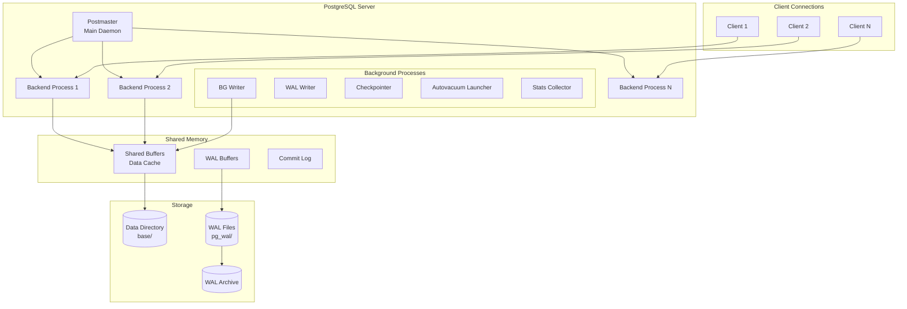
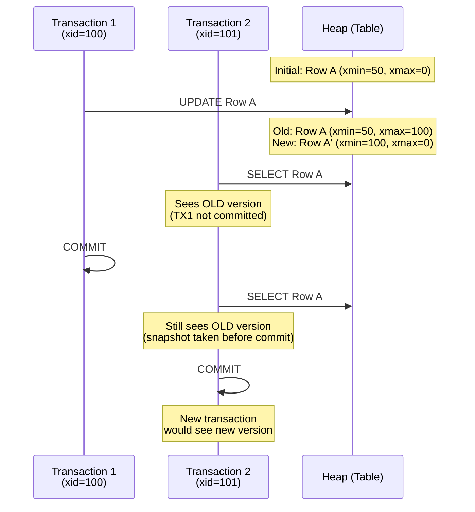
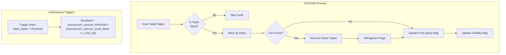
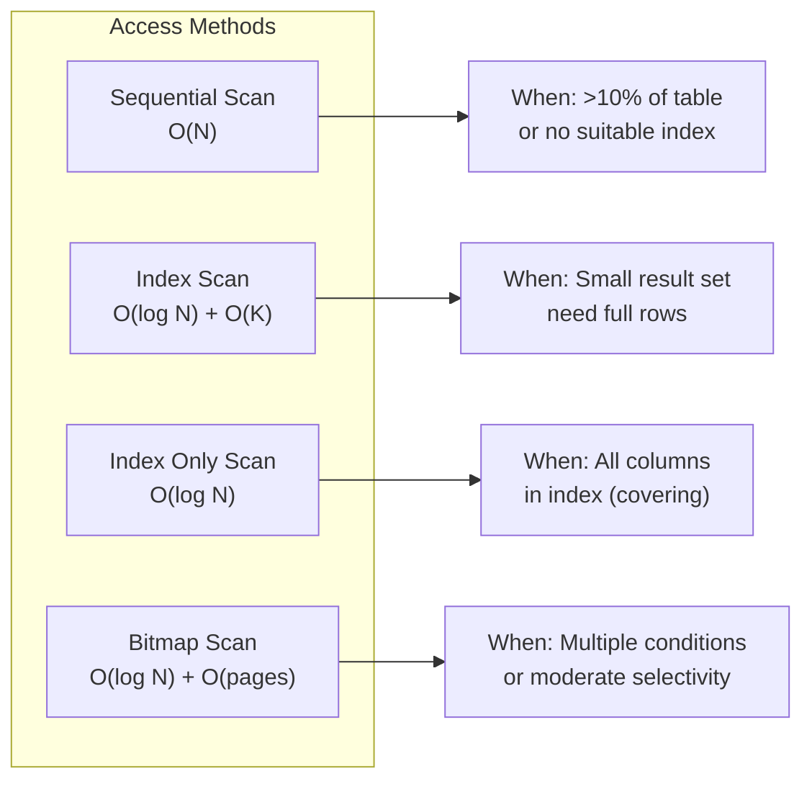
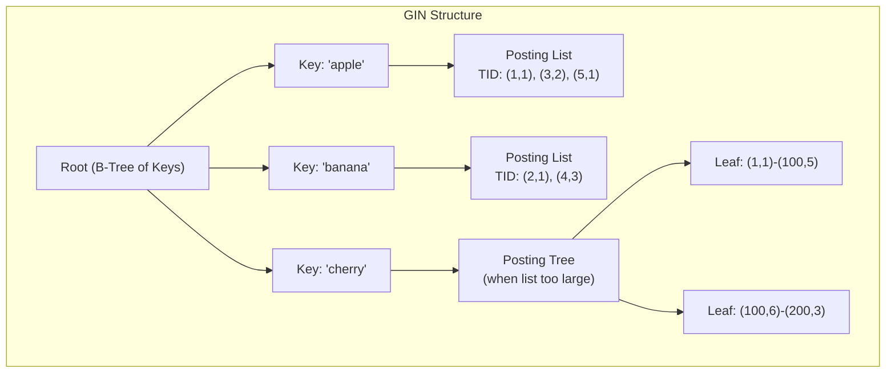
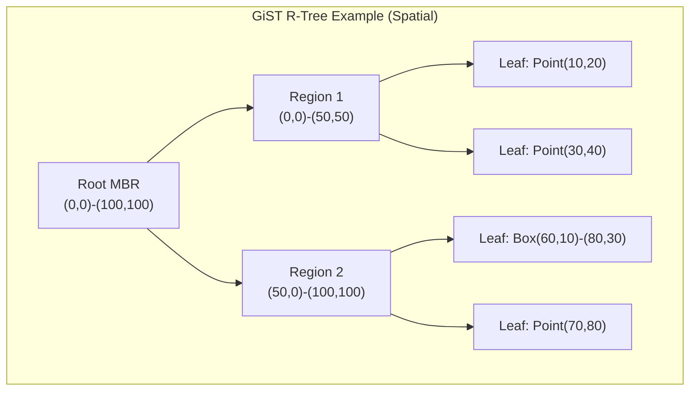
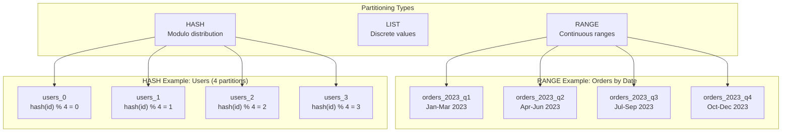
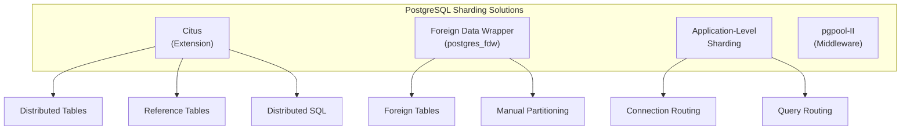
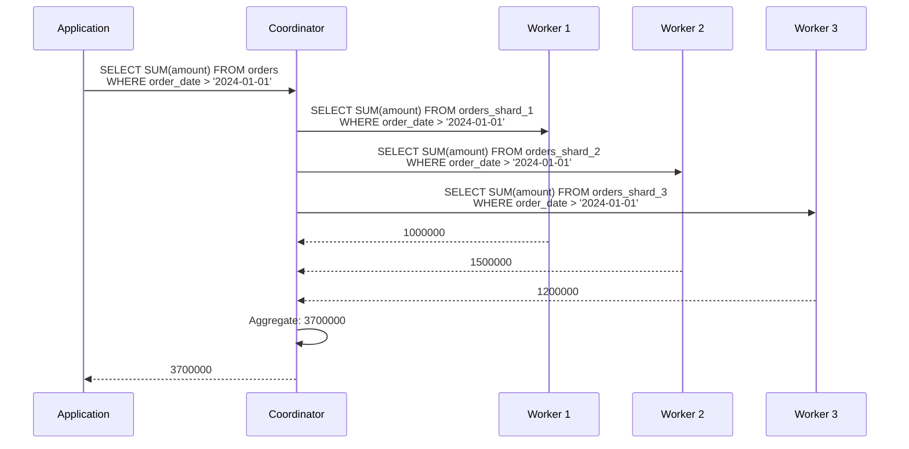

[🏠 Home](../../../README.md) | [⬅️ Scalability Patterns](./03-scalability-patterns.md) | [➡️ MySQL Guide](./05-mysql-indexing-sharding-partitioning.md)

# PostgreSQL Deep Dive: Indexing, Sharding & Partitioning

A comprehensive guide to PostgreSQL internals, indexing data structures, MVCC mechanics, partitioning strategies, and horizontal scaling—complete with mathematical foundations and performance optimization techniques.

---

## Table of Contents

1. [Architecture Overview](#1-architecture-overview)
2. [MVCC Deep Dive](#2-mvcc-deep-dive)
3. [Indexing Fundamentals](#3-indexing-fundamentals)
4. [Index Types Mathematics](#4-index-types-mathematics)
5. [Partitioning](#5-partitioning)
6. [Sharding](#6-sharding)
7. [Performance Optimization](#7-performance-optimization)
8. [Practical Examples](#8-practical-examples)

---

## 1. Architecture Overview

PostgreSQL uses a **process-based architecture** where each client connection spawns a dedicated backend process.

### Process Architecture



### Memory Architecture

```
┌─────────────────────────────────────────────────────────────┐
│                    PostgreSQL Memory                        │
├─────────────────────────────────────────────────────────────┤
│                                                             │
│  ┌─────────────────────────────────────────────────────┐   │
│  │              SHARED MEMORY                           │   │
│  │  ┌────────────────┐  ┌────────────────┐             │   │
│  │  │ Shared Buffers │  │  WAL Buffers   │             │   │
│  │  │ (Data Cache)   │  │ (Write Ahead)  │             │   │
│  │  │   ~25% RAM     │  │   ~64MB        │             │   │
│  │  └────────────────┘  └────────────────┘             │   │
│  │  ┌────────────────┐  ┌────────────────┐             │   │
│  │  │  Commit Log    │  │  Lock Tables   │             │   │
│  │  │    (CLOG)      │  │                │             │   │
│  │  └────────────────┘  └────────────────┘             │   │
│  └─────────────────────────────────────────────────────┘   │
│                                                             │
│  ┌─────────────────────────────────────────────────────┐   │
│  │            PER-PROCESS MEMORY                        │   │
│  │  ┌────────────────┐  ┌────────────────┐             │   │
│  │  │  work_mem      │  │ maintenance_   │             │   │
│  │  │ (Sort/Hash)    │  │ work_mem       │             │   │
│  │  │  ~4MB/op       │  │ ~256MB         │             │   │
│  │  └────────────────┘  └────────────────┘             │   │
│  │  ┌────────────────┐  ┌────────────────┐             │   │
│  │  │ temp_buffers   │  │ effective_     │             │   │
│  │  │ (Temp Tables)  │  │ cache_size     │             │   │
│  │  │  ~8MB          │  │ (Hint only)    │             │   │
│  │  └────────────────┘  └────────────────┘             │   │
│  └─────────────────────────────────────────────────────┘   │
│                                                             │
└─────────────────────────────────────────────────────────────┘
```

### Page Structure (8KB Default)

```
┌─────────────────────────────────────────────────────────┐
│                Page Header (24 bytes)                    │
│ - LSN, Checksum, Flags, Lower/Upper pointers            │
├─────────────────────────────────────────────────────────┤
│              Item Pointers (Line Pointers)              │
│  [Offset1, Len1] [Offset2, Len2] [Offset3, Len3] ...   │
├─────────────────────────────────────────────────────────┤
│                                                          │
│                  Free Space                              │
│                                                          │
├─────────────────────────────────────────────────────────┤
│                                                          │
│                 Tuple Data (Heap)                        │
│  ┌─────────────────────────────────────────────────┐   │
│  │ Tuple N (newest at bottom)                       │   │
│  │  - Header: xmin, xmax, ctid, infomask           │   │
│  │  - Null bitmap, Data                            │   │
│  └─────────────────────────────────────────────────┘   │
│  ┌─────────────────────────────────────────────────┐   │
│  │ Tuple 2                                          │   │
│  └─────────────────────────────────────────────────┘   │
│  ┌─────────────────────────────────────────────────┐   │
│  │ Tuple 1 (oldest at top of data area)            │   │
│  └─────────────────────────────────────────────────┘   │
│                                                          │
├─────────────────────────────────────────────────────────┤
│                Special Space (Index specific)            │
└─────────────────────────────────────────────────────────┘
```

---

## 2. MVCC Deep Dive

PostgreSQL's **Multi-Version Concurrency Control** allows readers to never block writers and vice versa.

### Transaction Visibility



### Tuple Header Fields

| Field | Size | Description |
|-------|------|-------------|
| `xmin` | 4 bytes | Transaction ID that created this tuple |
| `xmax` | 4 bytes | Transaction ID that deleted/updated this tuple (0 if live) |
| `cmin/cmax` | 4 bytes | Command ID within transaction |
| `ctid` | 6 bytes | Current tuple ID (page, offset) - points to newer version if updated |
| `infomask` | 2 bytes | Flags (committed, aborted, has null, etc.) |
| `infomask2` | 2 bytes | More flags + number of attributes |
| `t_hoff` | 1 byte | Offset to user data |

### Visibility Check Algorithm

```python
def is_tuple_visible(tuple, snapshot):
    """
    Simplified visibility check algorithm
    """
    xmin = tuple.xmin
    xmax = tuple.xmax
    
    # Check if creating transaction is visible
    if xmin_is_aborted(xmin):
        return False  # Creator aborted, tuple never existed
    
    if not xmin_is_committed(xmin):
        if xmin == current_transaction_id():
            # Our own uncommitted insert
            if xmax != 0:
                return False  # We deleted it
            return True
        return False  # Another uncommitted transaction created it
    
    # xmin is committed, check if deleted
    if xmax == 0:
        return True  # Not deleted
    
    if xmax_is_aborted(xmax):
        return True  # Deleter aborted, deletion rolled back
    
    if not xmax_is_committed(xmax):
        if xmax == current_transaction_id():
            return False  # We deleted it
        return True  # Deleter not committed yet
    
    # xmax is committed
    if xmax > snapshot.xmax:
        return True  # Deletion happened after our snapshot
    
    return False  # Tuple was validly deleted
```

### Visibility Formula

```
Tuple is VISIBLE if:
  (xmin committed AND xmin < snapshot.xmax AND xmin NOT IN snapshot.xip)
  AND
  (xmax = 0 OR xmax aborted OR xmax > snapshot.xmax OR xmax IN snapshot.xip)

Where:
  snapshot.xmax = First txid that was not yet assigned when snapshot taken
  snapshot.xip = List of in-progress transaction IDs when snapshot taken
```

### VACUUM Mechanics



**Autovacuum Formula:**

```
Vacuum Trigger Threshold = 
    autovacuum_vacuum_threshold + 
    (autovacuum_vacuum_scale_factor × estimated_row_count)

Default: 50 + (0.2 × row_count)

Example: 1,000,000 rows
Threshold = 50 + (0.2 × 1,000,000) = 200,050 dead tuples
```

> [!IMPORTANT]
> **Monitor Dead Tuples:**
> ```sql
> SELECT schemaname, relname, n_live_tup, n_dead_tup, 
>        ROUND(n_dead_tup::numeric / NULLIF(n_live_tup, 0) * 100, 2) AS dead_ratio
> FROM pg_stat_user_tables
> ORDER BY n_dead_tup DESC;
> ```

---

## 3. Indexing Fundamentals

### Why Indexes: The Mathematics

**Sequential Scan (No Index):**
```
Time = N × (page_read_time + tuple_process_time)
For 10M rows, 8KB pages, 100 rows/page:
  Pages = 10,000,000 / 100 = 100,000 pages
  Time ≈ 100,000 × 0.1ms = 10 seconds (cold cache)
```

**Index Scan (B-Tree):**
```
Time = h × page_read_time + matching_rows × tuple_fetch_time
Where h = tree height ≈ log(N) / log(fanout)

For 10M rows, fanout=200:
  h = log(10,000,000) / log(200) ≈ 3 levels
  Time ≈ 3 × 0.1ms + 1 × 0.1ms = 0.4ms
```

**Speedup Factor:**
```
Speedup = Sequential_Time / Index_Time
        = 10,000ms / 0.4ms
        = 25,000x faster!
```

### Index vs Table Access Methods



### Index Structure in PostgreSQL

```
┌─────────────────────────────────────────────────────────────┐
│                     Index Metapage                          │
│  - Points to root page                                      │
├─────────────────────────────────────────────────────────────┤
│                                                              │
│                    ┌─────────────┐                          │
│                    │ Root Page   │                          │
│                    │ [K1|P1|K2|P2]│                          │
│                    └──────┬──────┘                          │
│              ┌───────────┴───────────┐                      │
│              ▼                       ▼                      │
│      ┌─────────────┐         ┌─────────────┐               │
│      │Internal Page│         │Internal Page│               │
│      │[K|P|K|P|K|P]│         │[K|P|K|P|K|P]│               │
│      └──────┬──────┘         └──────┬──────┘               │
│        ┌────┴────┐             ┌────┴────┐                 │
│        ▼         ▼             ▼         ▼                 │
│   ┌────────┐ ┌────────┐   ┌────────┐ ┌────────┐           │
│   │ Leaf   │↔│ Leaf   │↔...│ Leaf   │↔│ Leaf   │           │
│   │(K,TID) │ │(K,TID) │   │(K,TID) │ │(K,TID) │           │
│   └────────┘ └────────┘   └────────┘ └────────┘           │
│                                                              │
│   TID = (block_number, offset) → points to heap tuple       │
│                                                              │
└─────────────────────────────────────────────────────────────┘
```

---

## 4. Index Types Mathematics

### 4.1 B-Tree Index

The default and most versatile index type.

**Branching Factor Calculation:**

```
Page Size = 8192 bytes (PostgreSQL default)
Page Header = 24 bytes
Item Pointer = 4 bytes per entry
Index Tuple = Key + TID + overhead

For a BIGINT key (8 bytes):
  Index Tuple ≈ 8 (key) + 6 (TID) + 8 (overhead) = 22 bytes
  
Entries per page = (8192 - 24) / (22 + 4) ≈ 314

Fanout ≈ 314 (internal nodes have slightly fewer due to high key)
```

**Height Calculation:**

```
h = ⌈log_f(N)⌉

Where:
  f = fanout (~314 for BIGINT)
  N = number of rows

Examples:
  N = 1,000,000:    h = ⌈log₃₁₄(1,000,000)⌉ = ⌈2.4⌉ = 3
  N = 100,000,000:  h = ⌈log₃₁₄(100,000,000)⌉ = ⌈3.2⌉ = 4
  N = 10,000,000,000: h = ⌈log₃₁₄(10,000,000,000)⌉ = ⌈4.0⌉ = 4
```

**Index Size Estimation:**

```sql
-- Estimate index size before creation
SELECT pg_size_pretty(
    (SELECT reltuples FROM pg_class WHERE relname = 'your_table') 
    * 30  -- avg bytes per index entry
    * 1.2 -- overhead factor
);
```

### 4.2 GIN (Generalized Inverted Index)

Optimized for composite values (arrays, JSONB, full-text).



**GIN Query Complexity:**

```
Range Query: O(log N + K)
  Where K = number of matching keys

Containment Query (@>): 
  GIN: O(log N + |intersection of posting lists|)
  Sequential: O(N × array_length)

Example: Find documents containing ['apple', 'banana']:
  1. Lookup 'apple' posting list: O(log N)
  2. Lookup 'banana' posting list: O(log N)
  3. Intersect posting lists: O(min(|list1|, |list2|))
```

```sql
-- GIN index for JSONB
CREATE INDEX idx_data_gin ON documents USING GIN (data);

-- Query using GIN
SELECT * FROM documents WHERE data @> '{"status": "active"}';

-- GIN for full-text search
CREATE INDEX idx_fts ON articles USING GIN (to_tsvector('english', body));
SELECT * FROM articles 
WHERE to_tsvector('english', body) @@ to_tsquery('database & optimization');
```

### 4.3 GiST (Generalized Search Tree)

Supports custom data types and complex queries (geometric, ranges).



**GiST Search Complexity:**

```
Nearest Neighbor: O(log N) average
                  O(N) worst case (bad data distribution)

Range/Overlap: O(log N + K)
  Where K = matching geometries

Key property: Nodes store "bounding boxes" that can overlap
(unlike B-Tree where ranges don't overlap)
```

```sql
-- GiST for geometric data
CREATE INDEX idx_location ON stores USING GiST (location);

-- Nearest neighbor query (uses GiST efficiently)
SELECT name, location <-> point(77.5946, 12.9716) AS distance
FROM stores
ORDER BY location <-> point(77.5946, 12.9716)
LIMIT 10;

-- GiST for range types
CREATE INDEX idx_reservation ON bookings USING GiST (during);
SELECT * FROM bookings WHERE during && '[2024-01-01, 2024-01-31]'::daterange;
```

### 4.4 BRIN (Block Range Index)

Tiny indexes for naturally ordered data (time-series).

```
┌─────────────────────────────────────────────────────────────┐
│                    BRIN Structure                           │
├─────────────────────────────────────────────────────────────┤
│                                                             │
│  Block Range 0 (pages 0-127):   min=2024-01-01, max=2024-01-15  │
│  Block Range 1 (pages 128-255): min=2024-01-15, max=2024-01-31  │
│  Block Range 2 (pages 256-383): min=2024-02-01, max=2024-02-14  │
│  ...                                                        │
│                                                             │
│  Index Size: ~128 bytes per 128 pages = 0.01% of table!    │
│                                                             │
└─────────────────────────────────────────────────────────────┘
```

**BRIN Size Calculation:**

```
BRIN Index Size = (Table_Pages / pages_per_range) × summary_size

For 1TB table (134,217,728 pages) with pages_per_range=128:
  Ranges = 134,217,728 / 128 = 1,048,576 ranges
  Index Size ≈ 1,048,576 × 32 bytes = 32MB

Compare to B-Tree: ~100GB for same table!
```

```sql
-- BRIN for time-series (data loaded in order)
CREATE INDEX idx_ts_brin ON logs USING BRIN (created_at) 
WITH (pages_per_range = 128);

-- Check selectivity
EXPLAIN ANALYZE SELECT * FROM logs 
WHERE created_at BETWEEN '2024-01-01' AND '2024-01-31';
-- Shows: "Bitmap Heap Scan... Recheck Cond... BRIN Index"
```

> [!TIP]
> **When to use BRIN:**
> - Data is physically sorted by indexed column
> - Table is very large (> 1GB)
> - Queries filter on ranges
> - Low index maintenance overhead needed

### 4.5 Hash Index

O(1) lookups for equality only.

```sql
-- Hash index (equality only, no range queries)
CREATE INDEX idx_session_hash ON sessions USING HASH (session_id);

-- Optimal for:
SELECT * FROM sessions WHERE session_id = 'abc123';

-- CANNOT use for:
SELECT * FROM sessions WHERE session_id > 'abc';  -- Falls back to seq scan
```

### Index Type Comparison

| Index Type | Best For | Operators | Size | Write Overhead |
|------------|----------|-----------|------|----------------|
| **B-Tree** | Equality, Range, Sorting | `=, <, >, <=, >=, BETWEEN` | Medium | Low |
| **Hash** | Equality only | `=` | Medium | Low |
| **GIN** | Arrays, JSONB, FTS | `@>, <@, &&, @@` | Large | High |
| **GiST** | Geometry, Ranges, FTS | `@>, <@, &&, <<, >>` | Medium | Medium |
| **BRIN** | Sorted large tables | `=, <, >, <=, >=` | Tiny | Very Low |

---

## 5. Partitioning

PostgreSQL 10+ supports native declarative partitioning.

### Partitioning Strategies



### 5.1 Range Partitioning

```sql
-- Create partitioned table
CREATE TABLE orders (
    order_id    BIGINT GENERATED ALWAYS AS IDENTITY,
    customer_id BIGINT NOT NULL,
    order_date  TIMESTAMPTZ NOT NULL,
    amount      DECIMAL(12, 2),
    status      TEXT
) PARTITION BY RANGE (order_date);

-- Create partitions
CREATE TABLE orders_2024_q1 PARTITION OF orders
    FOR VALUES FROM ('2024-01-01') TO ('2024-04-01');

CREATE TABLE orders_2024_q2 PARTITION OF orders
    FOR VALUES FROM ('2024-04-01') TO ('2024-07-01');

CREATE TABLE orders_2024_q3 PARTITION OF orders
    FOR VALUES FROM ('2024-07-01') TO ('2024-10-01');

CREATE TABLE orders_2024_q4 PARTITION OF orders
    FOR VALUES FROM ('2024-10-01') TO ('2025-01-01');

-- Default partition for unmapped values
CREATE TABLE orders_default PARTITION OF orders DEFAULT;
```

### 5.2 List Partitioning

```sql
CREATE TABLE customers (
    id          BIGINT GENERATED ALWAYS AS IDENTITY,
    name        TEXT NOT NULL,
    region      TEXT NOT NULL,
    created_at  TIMESTAMPTZ DEFAULT NOW()
) PARTITION BY LIST (region);

CREATE TABLE customers_apac PARTITION OF customers
    FOR VALUES IN ('India', 'Japan', 'Australia', 'Singapore');

CREATE TABLE customers_emea PARTITION OF customers
    FOR VALUES IN ('UK', 'Germany', 'France', 'UAE');

CREATE TABLE customers_americas PARTITION OF customers
    FOR VALUES IN ('USA', 'Canada', 'Brazil', 'Mexico');
```

### 5.3 Hash Partitioning

```sql
CREATE TABLE sessions (
    session_id  UUID PRIMARY KEY,
    user_id     BIGINT NOT NULL,
    data        JSONB,
    created_at  TIMESTAMPTZ DEFAULT NOW()
) PARTITION BY HASH (user_id);

-- Create 8 hash partitions
CREATE TABLE sessions_0 PARTITION OF sessions FOR VALUES WITH (MODULUS 8, REMAINDER 0);
CREATE TABLE sessions_1 PARTITION OF sessions FOR VALUES WITH (MODULUS 8, REMAINDER 1);
CREATE TABLE sessions_2 PARTITION OF sessions FOR VALUES WITH (MODULUS 8, REMAINDER 2);
CREATE TABLE sessions_3 PARTITION OF sessions FOR VALUES WITH (MODULUS 8, REMAINDER 3);
CREATE TABLE sessions_4 PARTITION OF sessions FOR VALUES WITH (MODULUS 8, REMAINDER 4);
CREATE TABLE sessions_5 PARTITION OF sessions FOR VALUES WITH (MODULUS 8, REMAINDER 5);
CREATE TABLE sessions_6 PARTITION OF sessions FOR VALUES WITH (MODULUS 8, REMAINDER 6);
CREATE TABLE sessions_7 PARTITION OF sessions FOR VALUES WITH (MODULUS 8, REMAINDER 7);
```

### 5.4 Multi-Level (Composite) Partitioning

```sql
CREATE TABLE logs (
    id          BIGINT GENERATED ALWAYS AS IDENTITY,
    log_date    DATE NOT NULL,
    severity    TEXT NOT NULL,
    message     TEXT
) PARTITION BY RANGE (log_date);

-- First level: by month
CREATE TABLE logs_2024_01 PARTITION OF logs
    FOR VALUES FROM ('2024-01-01') TO ('2024-02-01')
    PARTITION BY LIST (severity);

-- Second level: by severity within month
CREATE TABLE logs_2024_01_error PARTITION OF logs_2024_01
    FOR VALUES IN ('ERROR', 'FATAL');
    
CREATE TABLE logs_2024_01_warn PARTITION OF logs_2024_01
    FOR VALUES IN ('WARN');
    
CREATE TABLE logs_2024_01_info PARTITION OF logs_2024_01
    FOR VALUES IN ('INFO', 'DEBUG');
```

### Partition Pruning Mathematics

```
Without Partitioning:
  Query scans: All pages = O(N)
  
With K partitions, query matching 1 partition:
  Query scans: N/K pages = O(N/K)
  
Improvement = K times faster for single-partition queries

Example: 
  1 year data = 365 days
  Daily partitions = 365 partitions
  Query for 1 day = Scan 1/365 of data
  
Speedup = 365x for daily queries!
```

```sql
-- Verify partition pruning
EXPLAIN (ANALYZE, COSTS OFF) 
SELECT * FROM orders WHERE order_date = '2024-03-15';

-- Output shows: "->  Seq Scan on orders_2024_q1 orders"
-- Only 1 partition scanned!
```

### Partition Maintenance

```sql
-- Detach old partition (for archiving)
ALTER TABLE orders DETACH PARTITION orders_2023_q1;

-- Can now drop or archive separately
DROP TABLE orders_2023_q1;

-- Add new partition
CREATE TABLE orders_2025_q1 PARTITION OF orders
    FOR VALUES FROM ('2025-01-01') TO ('2025-04-01');

-- Indexes are inherited automatically (PostgreSQL 11+)
CREATE INDEX ON orders (customer_id);
-- Creates index on all partitions automatically
```

---

## 6. Sharding

PostgreSQL sharding requires external tools. Common approaches:

### 6.1 Sharding Options



### 6.2 Citus Sharding

Citus extends PostgreSQL with distributed table capabilities.

```sql
-- On coordinator node
CREATE EXTENSION citus;

-- Add worker nodes
SELECT citus_add_node('worker1.example.com', 5432);
SELECT citus_add_node('worker2.example.com', 5432);
SELECT citus_add_node('worker3.example.com', 5432);

-- Create distributed table
CREATE TABLE orders (
    order_id    BIGINT,
    customer_id BIGINT,
    order_date  DATE,
    amount      DECIMAL(12, 2)
);

-- Shard by customer_id (32 shards distributed across workers)
SELECT create_distributed_table('orders', 'customer_id');

-- Reference table (replicated to all nodes)
CREATE TABLE products (
    product_id  INT PRIMARY KEY,
    name        TEXT,
    price       DECIMAL(10, 2)
);
SELECT create_reference_table('products');
```

### Citus Query Execution



### 6.3 Application-Level Sharding

```python
# Python example with SQLAlchemy
import hashlib
from sqlalchemy import create_engine

class ShardRouter:
    def __init__(self, shard_config):
        self.shards = {
            shard_id: create_engine(url)
            for shard_id, url in shard_config.items()
        }
        self.num_shards = len(self.shards)
    
    def get_shard(self, customer_id: int):
        """Consistent hash-based shard selection"""
        hash_val = int(hashlib.md5(str(customer_id).encode()).hexdigest(), 16)
        shard_id = hash_val % self.num_shards
        return self.shards[shard_id]
    
    def execute_on_shard(self, customer_id: int, query: str, params: dict):
        engine = self.get_shard(customer_id)
        with engine.connect() as conn:
            return conn.execute(query, params)
    
    def scatter_gather(self, query: str, params: dict):
        """Execute on all shards and aggregate"""
        results = []
        for engine in self.shards.values():
            with engine.connect() as conn:
                results.extend(conn.execute(query, params).fetchall())
        return results

# Usage
router = ShardRouter({
    0: "postgresql://host1:5432/db",
    1: "postgresql://host2:5432/db",
    2: "postgresql://host3:5432/db",
    3: "postgresql://host4:5432/db",
})

# Single-shard query (efficient)
orders = router.execute_on_shard(
    customer_id=12345,
    query="SELECT * FROM orders WHERE customer_id = :cid",
    params={"cid": 12345}
)

# Cross-shard query (expensive)
totals = router.scatter_gather(
    query="SELECT COUNT(*) FROM orders WHERE status = :status",
    params={"status": "completed"}
)
```

### 6.4 postgres_fdw Sharding

```sql
-- On coordinator server
CREATE EXTENSION postgres_fdw;

-- Create foreign servers
CREATE SERVER shard1 FOREIGN DATA WRAPPER postgres_fdw
    OPTIONS (host 'shard1.example.com', dbname 'orders', port '5432');

CREATE SERVER shard2 FOREIGN DATA WRAPPER postgres_fdw
    OPTIONS (host 'shard2.example.com', dbname 'orders', port '5432');

-- Create user mapping
CREATE USER MAPPING FOR CURRENT_USER SERVER shard1
    OPTIONS (user 'app_user', password 'secret');

CREATE USER MAPPING FOR CURRENT_USER SERVER shard2
    OPTIONS (user 'app_user', password 'secret');

-- Create foreign tables
CREATE FOREIGN TABLE orders_shard1 (
    order_id BIGINT,
    customer_id BIGINT,
    order_date DATE,
    amount DECIMAL(12, 2)
) SERVER shard1 OPTIONS (table_name 'orders');

CREATE FOREIGN TABLE orders_shard2 (
    order_id BIGINT,
    customer_id BIGINT,
    order_date DATE,
    amount DECIMAL(12, 2)
) SERVER shard2 OPTIONS (table_name 'orders');

-- Create unified view with CHECK constraints for routing
CREATE TABLE orders (
    order_id BIGINT,
    customer_id BIGINT,
    order_date DATE,
    amount DECIMAL(12, 2)
) PARTITION BY HASH (customer_id);

-- Attach foreign tables as partitions (PG 14+)
-- Or use UNION ALL view for older versions
```

---

## 7. Performance Optimization

### 7.1 Query Analysis

```sql
-- Detailed query plan
EXPLAIN (ANALYZE, BUFFERS, FORMAT TEXT)
SELECT c.name, COUNT(o.order_id), SUM(o.amount)
FROM customers c
JOIN orders o ON c.id = o.customer_id
WHERE o.order_date >= '2024-01-01'
GROUP BY c.id;

-- Key metrics to watch:
-- 1. Actual vs Estimated rows (big difference = bad stats)
-- 2. Buffers: shared hit vs read (read = cache miss)
-- 3. Seq Scan on large tables (usually bad)
-- 4. Nested Loop with large outer table (often bad)
```

### 7.2 Index Optimization

```sql
-- Find missing indexes (queries with seq scans)
SELECT schemaname, relname, seq_scan, seq_tup_read,
       idx_scan, idx_tup_fetch,
       ROUND(seq_tup_read::numeric / NULLIF(seq_scan, 0), 0) AS avg_seq_rows
FROM pg_stat_user_tables
WHERE seq_scan > 0
ORDER BY seq_tup_read DESC
LIMIT 20;

-- Find unused indexes
SELECT schemaname, tablename, indexname, idx_scan,
       pg_size_pretty(pg_relation_size(indexrelid)) AS index_size
FROM pg_stat_user_indexes
WHERE idx_scan = 0
  AND indexrelname NOT LIKE '%_pkey'
ORDER BY pg_relation_size(indexrelid) DESC;

-- Find duplicate indexes
SELECT pg_size_pretty(SUM(pg_relation_size(idx))::BIGINT) AS size,
       (array_agg(idx))[1] AS idx1, (array_agg(idx))[2] AS idx2,
       (array_agg(idx))[3] AS idx3
FROM (
    SELECT indexrelid::regclass AS idx,
           indrelid, indkey, 
           COALESCE(indexprs::TEXT, ''), COALESCE(indpred::TEXT, '')
    FROM pg_index
) sub
GROUP BY indrelid, indkey, coalesce, coalesce
HAVING COUNT(*) > 1
ORDER BY SUM(pg_relation_size(idx)) DESC;
```

### 7.3 Configuration Tuning

```ini
# postgresql.conf for a 64GB RAM server

# Memory
shared_buffers = 16GB              # 25% of RAM
effective_cache_size = 48GB        # 75% of RAM (includes OS cache)
work_mem = 256MB                   # Per-operation sort/hash memory
maintenance_work_mem = 2GB         # For VACUUM, CREATE INDEX

# Write Performance
wal_buffers = 64MB
checkpoint_completion_target = 0.9
max_wal_size = 8GB
min_wal_size = 2GB

# Query Planning
random_page_cost = 1.1             # SSD (use 4.0 for HDD)
effective_io_concurrency = 200     # SSD (use 2 for HDD)
default_statistics_target = 100    # Increase for complex queries

# Parallelism
max_parallel_workers_per_gather = 4
max_parallel_workers = 8
max_worker_processes = 16
parallel_tuple_cost = 0.01
parallel_setup_cost = 100

# Autovacuum (for write-heavy workloads)
autovacuum_max_workers = 4
autovacuum_naptime = 30s
autovacuum_vacuum_scale_factor = 0.05
autovacuum_analyze_scale_factor = 0.025
```

### 7.4 Connection Management

```sql
-- Check connection usage
SELECT count(*), state, usename, application_name
FROM pg_stat_activity
GROUP BY state, usename, application_name
ORDER BY count DESC;

-- Kill long-running queries
SELECT pg_terminate_backend(pid)
FROM pg_stat_activity
WHERE state = 'active'
  AND query_start < NOW() - INTERVAL '5 minutes'
  AND pid <> pg_backend_pid();
```

### 7.5 Monitoring Queries

```sql
-- Enable pg_stat_statements
CREATE EXTENSION pg_stat_statements;

-- Top 10 queries by total time
SELECT 
    SUBSTRING(query, 1, 80) AS short_query,
    calls,
    ROUND(total_exec_time::numeric, 2) AS total_time_ms,
    ROUND(mean_exec_time::numeric, 2) AS mean_time_ms,
    ROUND((100 * total_exec_time / SUM(total_exec_time) OVER())::numeric, 2) AS pct
FROM pg_stat_statements
ORDER BY total_exec_time DESC
LIMIT 10;

-- Top queries by cache misses
SELECT 
    SUBSTRING(query, 1, 80) AS short_query,
    calls,
    shared_blks_read AS cache_misses,
    shared_blks_hit AS cache_hits,
    ROUND(100.0 * shared_blks_hit / NULLIF(shared_blks_hit + shared_blks_read, 0), 2) AS hit_ratio
FROM pg_stat_statements
WHERE shared_blks_read > 1000
ORDER BY shared_blks_read DESC
LIMIT 10;
```

---

## 8. Practical Examples

### 8.1 Time-Series IoT Data

```sql
-- Partitioned by time, optimized for writes and time-range queries
CREATE TABLE sensor_data (
    device_id   UUID NOT NULL,
    ts          TIMESTAMPTZ NOT NULL,
    temperature REAL,
    humidity    REAL,
    metadata    JSONB
) PARTITION BY RANGE (ts);

-- Create weekly partitions
CREATE TABLE sensor_data_2024_w01 PARTITION OF sensor_data
    FOR VALUES FROM ('2024-01-01') TO ('2024-01-08');

-- BRIN index for time-ordered data
CREATE INDEX idx_sensor_ts_brin ON sensor_data USING BRIN (ts);

-- GIN index for metadata queries
CREATE INDEX idx_sensor_meta_gin ON sensor_data USING GIN (metadata);

-- Covering index for common query pattern
CREATE INDEX idx_sensor_device_ts 
ON sensor_data (device_id, ts DESC) 
INCLUDE (temperature, humidity);

-- Optimal query
EXPLAIN ANALYZE
SELECT ts, temperature, humidity
FROM sensor_data
WHERE device_id = 'abc-123-def'
  AND ts >= NOW() - INTERVAL '7 days'
ORDER BY ts DESC
LIMIT 100;
```

### 8.2 E-Commerce with Full-Text Search

```sql
-- Products with full-text search
CREATE TABLE products (
    id          BIGINT GENERATED ALWAYS AS IDENTITY PRIMARY KEY,
    name        TEXT NOT NULL,
    description TEXT,
    category    TEXT[],
    attributes  JSONB,
    price       DECIMAL(10, 2),
    search_vector TSVECTOR GENERATED ALWAYS AS (
        setweight(to_tsvector('english', name), 'A') ||
        setweight(to_tsvector('english', COALESCE(description, '')), 'B')
    ) STORED
);

-- GIN index for full-text search
CREATE INDEX idx_products_search ON products USING GIN (search_vector);

-- GIN index for category array
CREATE INDEX idx_products_category ON products USING GIN (category);

-- GIN index for JSONB attributes
CREATE INDEX idx_products_attrs ON products USING GIN (attributes jsonb_path_ops);

-- Combined search query
SELECT id, name, ts_rank(search_vector, query) AS rank
FROM products, to_tsquery('english', 'wireless & headphones') query
WHERE search_vector @@ query
  AND category @> ARRAY['Electronics']
  AND attributes @> '{"brand": "Sony"}'
ORDER BY rank DESC
LIMIT 20;
```

### 8.3 Multi-Tenant SaaS with Sharding

```sql
-- With Citus for horizontal scaling
CREATE TABLE tenants (
    tenant_id   UUID PRIMARY KEY,
    name        TEXT NOT NULL,
    plan        TEXT DEFAULT 'free',
    created_at  TIMESTAMPTZ DEFAULT NOW()
);
SELECT create_reference_table('tenants');

CREATE TABLE tenant_data (
    id          BIGINT,
    tenant_id   UUID NOT NULL REFERENCES tenants(tenant_id),
    data        JSONB NOT NULL,
    created_at  TIMESTAMPTZ DEFAULT NOW(),
    PRIMARY KEY (tenant_id, id)
);
SELECT create_distributed_table('tenant_data', 'tenant_id');

-- Colocate related tables for efficient joins
CREATE TABLE tenant_settings (
    tenant_id   UUID PRIMARY KEY REFERENCES tenants(tenant_id),
    settings    JSONB DEFAULT '{}'
);
SELECT create_distributed_table('tenant_settings', 'tenant_id', colocate_with => 'tenant_data');

-- Efficient single-tenant query (hits one shard)
SELECT d.*, s.settings
FROM tenant_data d
JOIN tenant_settings s ON d.tenant_id = s.tenant_id
WHERE d.tenant_id = 'abc-123';
```

---

## Quick Reference Card

### Index Selection Guide

```
Data Type & Query Pattern → Recommended Index:

Primary Key / Unique       → B-Tree (automatic)
Equality (=)               → B-Tree or Hash
Range (<, >, BETWEEN)      → B-Tree
Sorted large table         → BRIN
Array containment (@>)     → GIN
JSONB queries              → GIN (jsonb_path_ops)
Full-text search           → GIN
Geometry/Spatial           → GiST
Range types overlap        → GiST
Nearest neighbor           → GiST
```

### Performance Formulas

| Metric | Formula |
|--------|---------|
| **B-Tree Height** | `h = ⌈log_f(N)⌉` where f≈300-500 |
| **BRIN Size** | `pages / pages_per_range × 32 bytes` |
| **Vacuum Threshold** | `50 + 0.2 × n_live_tup` (default) |
| **Cache Hit Ratio** | `shared_blks_hit / (hit + read) × 100` |
| **Partition Speedup** | `K times for K partitions (single-partition query)` |

### Essential Monitoring Queries

```sql
-- Cache hit ratio (should be > 99%)
SELECT ROUND(100.0 * SUM(blks_hit) / NULLIF(SUM(blks_hit + blks_read), 0), 2)
FROM pg_stat_database;

-- Table bloat
SELECT schemaname, relname, n_dead_tup, n_live_tup,
       ROUND(n_dead_tup::numeric / NULLIF(n_live_tup, 0) * 100, 2) AS dead_pct
FROM pg_stat_user_tables WHERE n_dead_tup > 10000 ORDER BY n_dead_tup DESC;

-- Index usage
SELECT indexrelname, idx_scan, idx_tup_fetch
FROM pg_stat_user_indexes ORDER BY idx_scan DESC LIMIT 10;
```

---

## Further Reading

- [PostgreSQL Official Documentation](https://www.postgresql.org/docs/current/)
- [The Internals of PostgreSQL](https://www.interdb.jp/pg/)
- [Citus Documentation](https://docs.citusdata.com/)
- [PostgreSQL High Performance](https://www.packtpub.com/product/postgresql-high-performance-cookbook/9781785284335)
- [Use The Index, Luke!](https://use-the-index-luke.com/)

---

[🏠 Home](../../../README.md) | [⬅️ Scalability Patterns](./03-scalability-patterns.md) | [➡️ MySQL Guide](./05-mysql-indexing-sharding-partitioning.md)
