[🏠 Home](../../../README.md) | [⬅️ PostgreSQL Guide](./04-postgresql-guide.md) | [➡️ Components](../components/00-components-overview.md)

# MySQL Deep Dive: Indexing, Sharding & Partitioning

A comprehensive guide to understanding MySQL's storage internals, indexing mechanisms, partitioning strategies, and horizontal scaling through sharding—complete with mathematical foundations and performance optimization techniques.

---

## Table of Contents

1. [Storage Engine Architecture](#1-storage-engine-architecture)
2. [Indexing Fundamentals](#2-indexing-fundamentals)
3. [B+Tree Mathematics](#3-btree-mathematics)
4. [Index Types Deep Dive](#4-index-types-deep-dive)
5. [Partitioning](#5-partitioning)
6. [Sharding](#6-sharding)
7. [Performance Optimization](#7-performance-optimization)
8. [Practical Examples](#8-practical-examples)

---

## 1. Storage Engine Architecture

MySQL supports multiple storage engines. Understanding InnoDB (the default) is crucial.

### InnoDB Architecture


### Key Components

| Component | Purpose | Size Recommendation |
|-----------|---------|---------------------|
| **Buffer Pool** | Caches data and index pages | 70-80% of available RAM |
| **Change Buffer** | Caches changes to secondary indexes | Up to 25% of Buffer Pool |
| **Log Buffer** | Buffers redo log entries before disk write | 16MB - 256MB |
| **Adaptive Hash Index** | Automatic hash index for B+Tree speedup | Automatic, can disable |

### Page Structure (16KB Default)

```
┌─────────────────────────────────────────────────────────┐
│                    Page Header (38 bytes)                │
│  - Page Number, LSN, Page Type, Space ID                │
├─────────────────────────────────────────────────────────┤
│                                                          │
│              User Records (Variable)                     │
│                                                          │
│  ┌──────────┐ ┌──────────┐ ┌──────────┐ ┌──────────┐   │
│  │ Record 1 │→│ Record 2 │→│ Record 3 │→│ Record N │   │
│  └──────────┘ └──────────┘ └──────────┘ └──────────┘   │
│                                                          │
├─────────────────────────────────────────────────────────┤
│                  Free Space                              │
├─────────────────────────────────────────────────────────┤
│               Page Directory (Variable)                  │
│          - Slots pointing to record groups              │
├─────────────────────────────────────────────────────────┤
│                   File Trailer (8 bytes)                 │
│               - Checksum for integrity                   │
└─────────────────────────────────────────────────────────┘
```

---

## 2. Indexing Fundamentals

### Why Indexes Matter: The Mathematics of Search

Without an index, MySQL must perform a **full table scan** with **O(n)** complexity.

#### Linear Search (No Index)
```
Time Complexity: O(n)
For 10 million rows → 10,000,000 comparisons (worst case)
```

#### Binary Search (With B+Tree Index)
```
Time Complexity: O(log n)
For 10 million rows → log₂(10,000,000) ≈ 24 comparisons
```

> [!IMPORTANT]
> **Speed Improvement Factor:**
> ```
> Improvement = n / log₂(n)
> For n = 10,000,000: 10,000,000 / 24 ≈ 416,667x faster!
> ```

### Clustered vs Secondary Indexes


| Feature | Clustered Index | Secondary Index |
|---------|-----------------|-----------------|
| **Definition** | Defines physical order of data | Logical index with pointer to PK |
| **Leaf Nodes Contain** | Full row data | Indexed columns + Primary Key |
| **Count per Table** | Only 1 | Multiple allowed |
| **Lookup Cost** | Single B+Tree traversal | B+Tree traversal + PK lookup |

---

## 3. B+Tree Mathematics

The B+Tree is the foundation of MySQL indexing. Understanding its math helps you design optimal schemas.

### B+Tree Structure


### B+Tree Formulas

#### Branching Factor (Fanout)

The **branching factor** `m` determines how many keys fit in a node:

```
m = ⌊(PageSize - PageOverhead) / (KeySize + PointerSize)⌋

For InnoDB with BIGINT primary key:
m = ⌊(16384 - 200) / (8 + 6)⌋ ≈ 1156 children per internal node
```

#### Tree Height Calculation

```
Height h = ⌈log_m(n)⌉

Where:
- m = branching factor
- n = number of records
```

**Example:** 100 million records with m = 1156

```
h = ⌈log₁₁₅₆(100,000,000)⌉
h = ⌈ln(100,000,000) / ln(1156)⌉
h = ⌈18.42 / 7.05⌉
h = ⌈2.61⌉
h = 3 levels
```

> [!TIP]
> **Rule of Thumb:**
> - 2 levels: ~1 million rows
> - 3 levels: ~1 billion rows
> - 4 levels: ~1 trillion rows

#### Disk I/O Cost Formula

Each level of the tree requires one disk I/O (unless cached):

```
I/O Operations = h + 1 (for clustered) 
I/O Operations = 2h + 1 (for secondary index lookup)
```

### Capacity Calculation Example

For a table with 1KB row size:

```
Leaf Node Capacity:
Records per Leaf = ⌊(16384 - 200) / 1000⌋ ≈ 16 records

With m = 1156 (internal nodes):
Level 0 (Root):     1 node
Level 1:            1156 nodes  
Level 2 (Leaves):   1156 × 1156 = 1,336,336 leaf nodes

Total Capacity = 1,336,336 × 16 ≈ 21.4 million records
```

---

## 4. Index Types Deep Dive

### 4.1 Primary Key Index (Clustered)

The clustered index **IS** the table data in InnoDB.

```sql
-- Implicit clustered index
CREATE TABLE users (
    id BIGINT PRIMARY KEY AUTO_INCREMENT,
    name VARCHAR(100),
    email VARCHAR(255)
) ENGINE=InnoDB;
```

> [!CAUTION]
> **Primary Key Size Matters!**
> Every secondary index stores a copy of the PK. A 16-byte UUID vs 8-byte BIGINT means:
> - 10 million rows × 8 extra bytes × number of secondary indexes
> - 1 secondary index = 80MB extra storage
> - 5 secondary indexes = 400MB extra storage

### 4.2 Secondary Indexes

```sql
-- Single column index
CREATE INDEX idx_email ON users(email);

-- Composite index (multi-column)
CREATE INDEX idx_name_email ON users(name, email);
```

#### The Leftmost Prefix Rule

A composite index `(a, b, c)` can be used for:

```
✅ WHERE a = ?
✅ WHERE a = ? AND b = ?
✅ WHERE a = ? AND b = ? AND c = ?
✅ WHERE a = ? ORDER BY b
✅ WHERE a = ? AND b > ? ORDER BY b

❌ WHERE b = ?
❌ WHERE c = ?
❌ WHERE b = ? AND c = ?
```


### 4.3 Covering Indexes

A **covering index** includes all columns needed by a query, eliminating PK lookups.

```sql
-- Query
SELECT name, email FROM users WHERE name = 'John';

-- Covering index for this query
CREATE INDEX idx_covering ON users(name, email);

-- EXPLAIN shows "Using index" (no row lookup needed)
```

### 4.4 Full-Text Indexes

For text search on large text columns:

```sql
CREATE FULLTEXT INDEX idx_content ON articles(title, body);

-- Usage
SELECT * FROM articles 
WHERE MATCH(title, body) AGAINST('database optimization' IN NATURAL LANGUAGE MODE);
```

### 4.5 Spatial Indexes (R-Tree)

For geographic data:

```sql
CREATE TABLE locations (
    id INT PRIMARY KEY,
    name VARCHAR(100),
    coords POINT NOT NULL SRID 4326,
    SPATIAL INDEX(coords)
);

-- Query nearby points
SELECT name FROM locations
WHERE ST_Distance_Sphere(coords, ST_GeomFromText('POINT(77.5946 12.9716)', 4326)) < 5000;
```

### 4.6 Hash Indexes (Memory Engine)

```sql
CREATE TABLE cache_data (
    cache_key VARCHAR(255) PRIMARY KEY,
    cache_value BLOB
) ENGINE=MEMORY;

-- MEMORY engine uses hash index by default for equality lookups
-- O(1) average case for = comparisons
-- Cannot use for range queries
```

---

## 5. Partitioning

Partitioning divides a table into smaller pieces stored separately but accessed as one logical table.

### Partitioning Types


### 5.1 RANGE Partitioning

Best for time-series data where you query and archive by date ranges.

```sql
CREATE TABLE orders (
    order_id BIGINT NOT NULL AUTO_INCREMENT,
    customer_id BIGINT NOT NULL,
    order_date DATE NOT NULL,
    amount DECIMAL(10,2),
    PRIMARY KEY (order_id, order_date)
) PARTITION BY RANGE (YEAR(order_date)) (
    PARTITION p2022 VALUES LESS THAN (2023),
    PARTITION p2023 VALUES LESS THAN (2024),
    PARTITION p2024 VALUES LESS THAN (2025),
    PARTITION p2025 VALUES LESS THAN (2026),
    PARTITION pmax VALUES LESS THAN MAXVALUE
);
```

**Partition Pruning Mathematics:**

```
Without Partitioning:
  Scan all 100M rows → O(100,000,000)

With 5 Yearly Partitions (20M rows each):
  Query for 2024 data → Scan only 20M rows → O(20,000,000)
  
Improvement: 5x fewer rows scanned
```

### 5.2 LIST Partitioning

For categorical data with discrete values:

```sql
CREATE TABLE customers (
    id BIGINT NOT NULL AUTO_INCREMENT,
    name VARCHAR(100),
    region VARCHAR(20),
    PRIMARY KEY (id, region)
) PARTITION BY LIST COLUMNS(region) (
    PARTITION p_north VALUES IN ('Delhi', 'Punjab', 'Haryana'),
    PARTITION p_south VALUES IN ('Karnataka', 'TamilNadu', 'Kerala'),
    PARTITION p_east VALUES IN ('WestBengal', 'Odisha', 'Bihar'),
    PARTITION p_west VALUES IN ('Maharashtra', 'Gujarat', 'Rajasthan')
);
```

### 5.3 HASH Partitioning

Distributes data evenly based on a hash function:

```sql
CREATE TABLE sessions (
    session_id VARCHAR(64) NOT NULL,
    user_id BIGINT NOT NULL,
    data JSON,
    created_at TIMESTAMP,
    PRIMARY KEY (session_id, user_id)
) PARTITION BY HASH(user_id)
PARTITIONS 16;
```

**Hash Distribution Formula:**

```
Partition Number = MOD(hash_function(column), num_partitions)

For user_id = 12345 with 16 partitions:
Partition = MOD(12345, 16) = 9
```

### 5.4 Subpartitioning (Composite)

Combine partitioning strategies:

```sql
CREATE TABLE logs (
    id BIGINT AUTO_INCREMENT,
    log_date DATE,
    server_id INT,
    message TEXT,
    PRIMARY KEY (id, log_date, server_id)
)
PARTITION BY RANGE (YEAR(log_date))
SUBPARTITION BY HASH(server_id)
SUBPARTITIONS 4 (
    PARTITION p2024 VALUES LESS THAN (2025),
    PARTITION p2025 VALUES LESS THAN (2026),
    PARTITION pmax VALUES LESS THAN MAXVALUE
);
-- Creates 3 × 4 = 12 physical partitions
```

### Partition Pruning Verification

```sql
EXPLAIN PARTITIONS
SELECT * FROM orders WHERE order_date BETWEEN '2024-01-01' AND '2024-12-31';

-- Output shows: partitions: p2024
-- Confirms only one partition is scanned
```

---

## 6. Sharding

Sharding distributes data across multiple database servers (horizontal scaling).

### Sharding vs Partitioning


| Aspect | Partitioning | Sharding |
|--------|--------------|----------|
| **Location** | Same server | Different servers |
| **Transparency** | Fully transparent | Application-aware |
| **Scalability** | Vertical (single server limits) | Horizontal (linear scaling) |
| **Complexity** | Low | High |
| **Cross-shard Queries** | N/A (all partitions accessible) | Complex, requires aggregation |

### 6.1 Sharding Strategies

#### Range-Based Sharding

```
┌─────────────────────────────────────────────────────────────┐
│                    Range-Based Sharding                     │
├─────────────────────────────────────────────────────────────┤
│                                                             │
│   user_id: 1 - 1,000,000        → Shard 1                  │
│   user_id: 1,000,001 - 2,000,000 → Shard 2                  │
│   user_id: 2,000,001 - 3,000,000 → Shard 3                  │
│                                                             │
│   Pros: Simple, efficient range queries                     │
│   Cons: Hotspots if recent data accessed more               │
└─────────────────────────────────────────────────────────────┘
```

#### Hash-Based Sharding

```
┌─────────────────────────────────────────────────────────────┐
│                    Hash-Based Sharding                      │
├─────────────────────────────────────────────────────────────┤
│                                                             │
│   shard_id = hash(user_id) % num_shards                    │
│                                                             │
│   hash(user_id=100) % 4 = 0 → Shard 0                      │
│   hash(user_id=101) % 4 = 2 → Shard 2                      │
│   hash(user_id=102) % 4 = 1 → Shard 1                      │
│                                                             │
│   Pros: Even distribution                                   │
│   Cons: Range queries require all shards                    │
└─────────────────────────────────────────────────────────────┘
```

#### Consistent Hashing

Minimizes redistribution when adding/removing shards:

```mermaid
graph TD
    subgraph "Consistent Hashing Ring"
        direction TB
        Ring["Hash Ring (0 - 2³²)"]
        
        Ring --> N1["Shard A<br/>Position: 1000"]
        Ring --> N2["Shard B<br/>Position: 4000"]
        Ring --> N3["Shard C<br/>Position: 7000"]
        
        K1["Key hash=500"] -.->|"Clockwise to"| N1
        K2["Key hash=3000"] -.->|"Clockwise to"| N2
        K3["Key hash=5000"] -.->|"Clockwise to"| N3
    end
```



**Mathematics of Consistent Hashing:**

```
When adding a new shard (e.g., Shard D at position 2500):
- Keys between 1000-2500 move from Shard B to Shard D
- Only ~1/n keys are redistributed (n = number of shards)

Standard Hash: Add 1 shard to 4 → 75% keys move
Consistent Hash: Add 1 shard to 4 → 25% keys move
```

### 6.2 Shard Key Selection

> [!IMPORTANT]
> **Critical Decision**: The shard key determines query efficiency and data distribution.

**Good Shard Key Properties:**
1. **High Cardinality**: Many unique values
2. **Even Distribution**: No hotspots
3. **Query Alignment**: Commonly used in WHERE clauses
4. **Immutability**: Rarely changes (resharding is expensive)

```sql
-- Example: E-commerce with user_id as shard key
-- Good: User-centric queries are efficient
SELECT * FROM orders WHERE user_id = 12345;  -- Single shard

-- Bad: Admin queries spanning all users
SELECT SUM(amount) FROM orders WHERE order_date = '2024-01-15';  -- All shards
```

### 6.3 Cross-Shard Operations

#### Scatter-Gather Pattern


#### Distributed Transactions (2PC)


> [!WARNING]
> **2PC Latency Impact:**
> - Minimum 4 network round trips
> - Locking during prepare phase
> - Avoid for high-throughput paths

### 6.4 Resharding

When you need to add more shards:

```
Original: 4 shards, 100M users (25M each)
Target: 8 shards, 100M users (12.5M each)

Strategy 1: Double & Migrate
  - Add 4 new shards
  - Migrate ~50% of data from each existing shard
  - Update routing logic
  
Strategy 2: Virtual Shards
  - Create 256 virtual shards mapped to 4 physical shards (64 each)
  - Remap 128 virtual shards to 4 new physical shards
  - Less data movement, more flexible
```

---

## 7. Performance Optimization

### 7.1 Query Optimization

#### EXPLAIN Analysis

```sql
EXPLAIN FORMAT=JSON
SELECT u.name, COUNT(o.id) as order_count
FROM users u
LEFT JOIN orders o ON u.id = o.user_id
WHERE u.status = 'active'
GROUP BY u.id
HAVING order_count > 10;
```

**Key Metrics to Watch:**

| Metric | Good | Bad | Action |
|--------|------|-----|--------|
| `type` | `ref`, `eq_ref`, `const` | `ALL`, `index` | Add/optimize index |
| `rows` | Low estimate | High estimate | Improve selectivity |
| `Extra` | `Using index` | `Using filesort`, `Using temporary` | Cover with index or redesign |

#### Index Usage Patterns

```sql
-- ❌ Bad: Function on indexed column
SELECT * FROM users WHERE YEAR(created_at) = 2024;

-- ✅ Good: Range on indexed column  
SELECT * FROM users WHERE created_at >= '2024-01-01' AND created_at < '2025-01-01';

-- ❌ Bad: Leading wildcard
SELECT * FROM users WHERE email LIKE '%@gmail.com';

-- ✅ Good: Suffix matching with reversed index
ALTER TABLE users ADD email_reversed VARCHAR(255) AS (REVERSE(email));
CREATE INDEX idx_email_rev ON users(email_reversed);
SELECT * FROM users WHERE email_reversed LIKE REVERSE('%@gmail.com');
```

### 7.2 Buffer Pool Optimization

```sql
-- Check buffer pool usage
SELECT 
    FORMAT(data_pages * 16 / 1024, 2) AS data_size_mb,
    FORMAT(index_pages * 16 / 1024, 2) AS index_size_mb,
    FORMAT((data_pages + index_pages) * 16 / 1024, 2) AS total_mb
FROM (
    SELECT 
        SUM(CASE WHEN page_type = 'INDEX' THEN 1 ELSE 0 END) as index_pages,
        SUM(CASE WHEN page_type != 'INDEX' THEN 1 ELSE 0 END) as data_pages
    FROM information_schema.INNODB_BUFFER_PAGE
) AS bp;

-- Buffer pool hit ratio (should be > 99%)
SHOW STATUS LIKE 'Innodb_buffer_pool_read%';

Hit_Ratio = (1 - Innodb_buffer_pool_reads / Innodb_buffer_pool_read_requests) × 100
```

### 7.3 Index Maintenance

```sql
-- Find unused indexes
SELECT 
    object_schema AS database_name,
    object_name AS table_name,
    index_name,
    count_read,
    count_write
FROM performance_schema.table_io_waits_summary_by_index_usage
WHERE index_name IS NOT NULL
    AND count_read = 0
    AND object_schema NOT IN ('mysql', 'performance_schema')
ORDER BY object_schema, object_name;

-- Find duplicate indexes
SELECT 
    t.table_schema,
    t.table_name,
    s.index_name AS redundant_index,
    s.column_name,
    s2.index_name AS dominant_index
FROM information_schema.statistics s
JOIN information_schema.statistics s2 
    ON s.table_schema = s2.table_schema
    AND s.table_name = s2.table_name
    AND s.column_name = s2.column_name
    AND s.seq_in_index = s2.seq_in_index
    AND s.index_name != s2.index_name
JOIN information_schema.tables t 
    ON t.table_schema = s.table_schema 
    AND t.table_name = s.table_name
WHERE s.seq_in_index = 1
    AND t.table_schema NOT IN ('mysql', 'information_schema', 'performance_schema');
```

### 7.4 Configuration Tuning

```ini
# my.cnf optimizations for a 64GB RAM server

[mysqld]
# Buffer Pool (70-80% of RAM for dedicated MySQL server)
innodb_buffer_pool_size = 48G
innodb_buffer_pool_instances = 16

# Log Settings
innodb_log_file_size = 4G
innodb_log_buffer_size = 64M
innodb_flush_log_at_trx_commit = 2  # Best performance (slight durability risk)

# I/O Settings
innodb_io_capacity = 2000
innodb_io_capacity_max = 4000
innodb_read_io_threads = 8
innodb_write_io_threads = 8

# Query Cache (often disabled in 8.0+)
query_cache_type = 0

# Thread Pool
thread_pool_size = 16
```

---

## 8. Practical Examples

### 8.1 E-Commerce Order System

**Requirements:**
- 100M orders per year
- Query by customer, date range, status
- Archive old orders

```sql
-- Schema with partitioning
CREATE TABLE orders (
    order_id BIGINT NOT NULL AUTO_INCREMENT,
    customer_id BIGINT NOT NULL,
    order_date DATETIME NOT NULL,
    status ENUM('pending', 'processing', 'shipped', 'delivered', 'cancelled'),
    total_amount DECIMAL(12, 2),
    items JSON,
    PRIMARY KEY (order_id, order_date),
    KEY idx_customer (customer_id, order_date),
    KEY idx_status_date (status, order_date)
) ENGINE=InnoDB
PARTITION BY RANGE (TO_DAYS(order_date)) (
    PARTITION p202401 VALUES LESS THAN (TO_DAYS('2024-02-01')),
    PARTITION p202402 VALUES LESS THAN (TO_DAYS('2024-03-01')),
    PARTITION p202403 VALUES LESS THAN (TO_DAYS('2024-04-01')),
    -- ... more monthly partitions
    PARTITION pmax VALUES LESS THAN MAXVALUE
);

-- Efficient query: uses partition pruning + index
EXPLAIN SELECT * FROM orders 
WHERE customer_id = 12345 
  AND order_date >= '2024-02-01' 
  AND order_date < '2024-03-01';

-- Archive old data
ALTER TABLE orders DROP PARTITION p202301;
```

### 8.2 User Sessions with Sharding

**Sharding Key Selection Analysis:**

```
Option 1: user_id (Chosen ✓)
  - Pros: All user sessions on same shard, no cross-shard for user queries
  - Cons: Power users create uneven load
  
Option 2: session_id  
  - Pros: Perfect distribution
  - Cons: "Show all sessions for user X" hits all shards

Option 3: Composite (user_id + session_id)
  - Hybrid approach if needed
```

**Application-Level Sharding Logic:**

```java
public class ShardRouter {
    private static final int NUM_SHARDS = 16;
    
    public DataSource getShardForUser(long userId) {
        int shardId = consistentHash(userId, NUM_SHARDS);
        return shardDataSources.get(shardId);
    }
    
    private int consistentHash(long key, int numShards) {
        // Murmur3 hash for good distribution
        long hash = Hashing.murmur3_128().hashLong(key).asLong();
        return Math.abs((int) (hash % numShards));
    }
    
    // Cross-shard query
    public long getTotalActiveSessionsm() {
        return shardDataSources.parallelStream()
            .mapToLong(ds -> queryCount(ds, "SELECT COUNT(*) FROM sessions WHERE active = 1"))
            .sum();
    }
}
```

### 8.3 Time-Series Metrics

**Optimal design for high-write, time-based queries:**

```sql
CREATE TABLE metrics (
    metric_id INT NOT NULL,
    ts TIMESTAMP NOT NULL,
    value DOUBLE,
    tags JSON,
    PRIMARY KEY (metric_id, ts)
) ENGINE=InnoDB
PARTITION BY RANGE (UNIX_TIMESTAMP(ts)) (
    PARTITION p1 VALUES LESS THAN (UNIX_TIMESTAMP('2024-01-01')),
    PARTITION p2 VALUES LESS THAN (UNIX_TIMESTAMP('2024-01-08')),
    PARTITION p3 VALUES LESS THAN (UNIX_TIMESTAMP('2024-01-15')),
    -- Weekly partitions for retention
    PARTITION pmax VALUES LESS THAN MAXVALUE
);

-- Compression for older partitions
ALTER TABLE metrics REORGANIZE PARTITION p1 INTO (
    PARTITION p1 VALUES LESS THAN (UNIX_TIMESTAMP('2024-01-01'))
    ROW_FORMAT=COMPRESSED KEY_BLOCK_SIZE=8
);
```

---

## Quick Reference Card

### Index Selection Decision Tree

```
Is it a PRIMARY KEY?
  └─ YES → Clustered index (automatic)
  └─ NO → Continue...

Is query for exact match equality?
  └─ YES → B-Tree or Hash (if MEMORY engine)
  └─ NO → Continue...

Is it a range query (>, <, BETWEEN)?
  └─ YES → B-Tree index
  └─ NO → Continue...

Is it full-text search?
  └─ YES → FULLTEXT index
  └─ NO → Continue...

Is it spatial/geographic data?
  └─ YES → SPATIAL index (R-Tree)
  └─ NO → B-Tree (default)
```

### Performance Formulas Summary

| Metric | Formula |
|--------|---------|
| **B+Tree Height** | `h = ⌈log_m(n)⌉` where m=fanout, n=rows |
| **Index Lookup Cost** | `O(log n)` disk I/Os |
| **Partition Improvement** | `1/p` rows scanned (p=partitions matching query) |
| **Buffer Pool Hit Ratio** | `(1 - reads/read_requests) × 100%` |
| **Shard Data Movement (Hash)** | `~100%` keys move when adding shard |
| **Shard Data Movement (Consistent Hash)** | `~1/n` keys move when adding shard |

---

## Further Reading

- [MySQL 8.0 Reference Manual](https://dev.mysql.com/doc/refman/8.0/en/)
- [High Performance MySQL, 4th Edition](https://www.oreilly.com/library/view/high-performance-mysql/9781492080503/)
- [Designing Data-Intensive Applications (Ch. 6: Partitioning)](https://dataintensive.net/)
- [ProxySQL Documentation](https://proxysql.com/documentation/)

---

[🏠 Home](../../../README.md) | [⬅️ PostgreSQL Guide](./04-postgresql-guide.md) | [➡️ Components](../components/00-components-overview.md)
