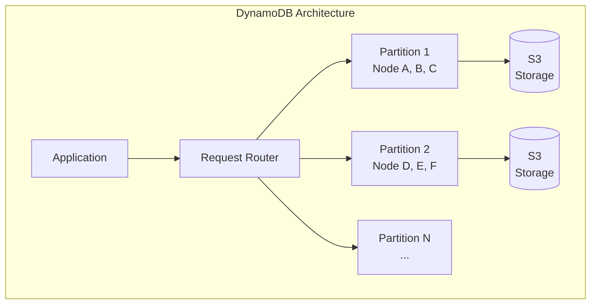
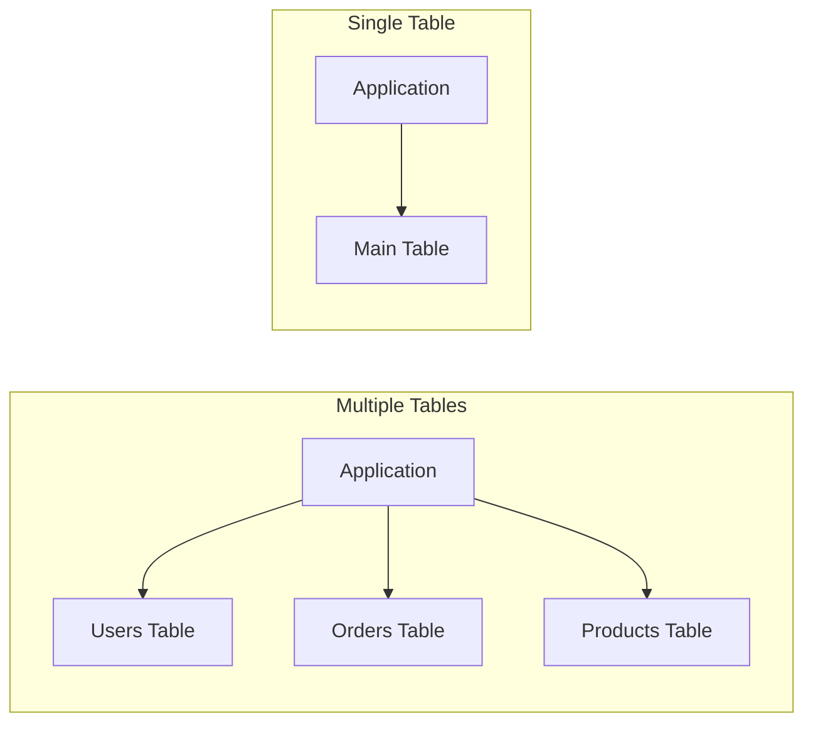
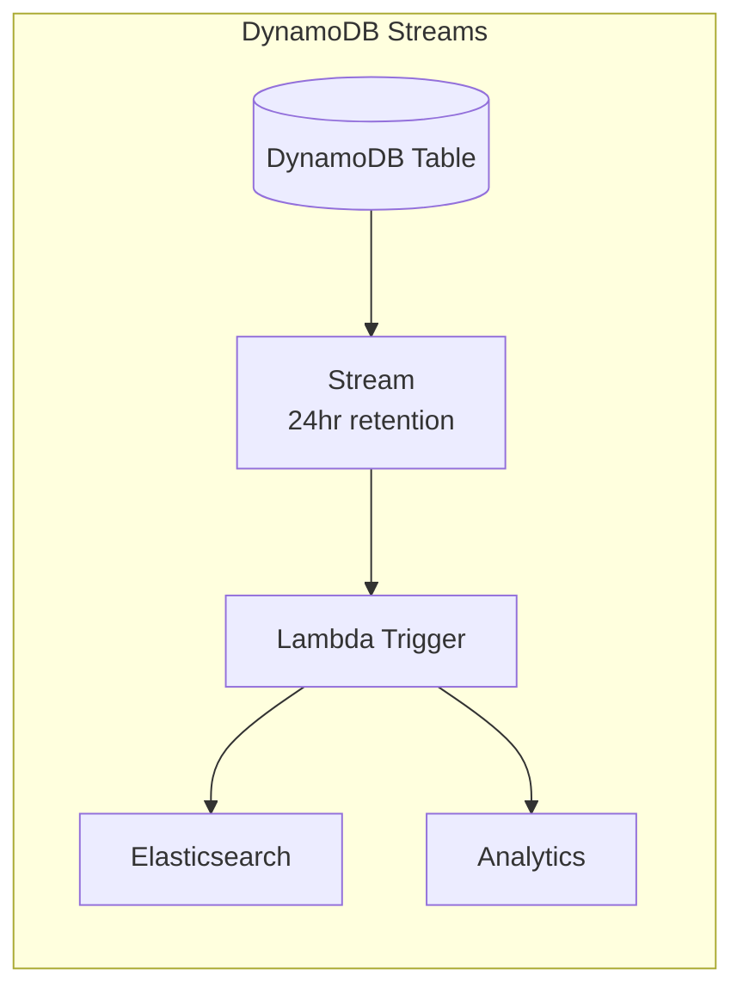

[🏠 Home](../../../README.md) | [⬅️ MongoDB Guide](./06-mongodb-deep-dive.md) | [➡️ Oracle Guide](./07-oracle-deep-dive.md)

# DynamoDB Deep Dive: Design, Optimization & Scalability

A comprehensive guide to Amazon DynamoDB covering data modeling, single-table design, indexing strategies, performance optimization, real-world patterns, and interview-focused concepts.

---

## Table of Contents

1. [Core Concepts](#1-core-concepts)
2. [Data Modeling](#2-data-modeling)
3. [Single-Table Design](#3-single-table-design)
4. [Indexing Strategies](#4-indexing-strategies)
5. [Capacity & Scaling](#5-capacity--scaling)
6. [Advanced Features](#6-advanced-features)
7. [Real-World Patterns](#7-real-world-patterns)
8. [Interview Questions](#8-interview-questions)

---

## 1. Core Concepts

### What is DynamoDB?

DynamoDB is a fully managed, serverless, key-value and document NoSQL database designed for single-digit millisecond performance at any scale.



### Key Terminology

| Term | Definition | Example |
|------|------------|---------|
| **Table** | Collection of items | `users`, `orders` |
| **Item** | Single record (row) | A user record |
| **Attribute** | Data element (column) | `email`, `name` |
| **Partition Key (PK)** | Primary hash key | `user_id` |
| **Sort Key (SK)** | Optional range key | `order_date` |
| **Primary Key** | PK alone, or PK + SK | `(user_id)` or `(user_id, order_date)` |

### Primary Key Types

```
┌─────────────────────────────────────────────────────────────┐
│                   Primary Key Options                        │
├─────────────────────────────────────────────────────────────┤
│                                                              │
│  1. SIMPLE PRIMARY KEY (Partition Key only)                 │
│     ┌────────────────┐                                      │
│     │ PK: user_id    │ → Uniquely identifies item           │
│     └────────────────┘                                      │
│     Example: Users table where user_id is unique            │
│                                                              │
│  2. COMPOSITE PRIMARY KEY (Partition Key + Sort Key)        │
│     ┌────────────────┬────────────────┐                     │
│     │ PK: user_id    │ SK: order_id   │                     │
│     └────────────────┴────────────────┘                     │
│     - PK determines partition                               │
│     - SK + PK must be unique                                │
│     - Enables range queries on SK                           │
│                                                              │
└─────────────────────────────────────────────────────────────┘
```

### Data Types

| Category | Types | Example |
|----------|-------|---------|
| **Scalar** | S (String), N (Number), B (Binary), BOOL, NULL | `"hello"`, `42`, `true` |
| **Document** | M (Map), L (List) | `{"name": "John"}`, `["a", "b"]` |
| **Set** | SS (String Set), NS (Number Set), BS (Binary Set) | `["tag1", "tag2"]` |

---

## 2. Data Modeling

### Think Access Patterns First

> **DynamoDB is Query-Driven, not Data-Driven!**

```
┌─────────────────────────────────────────────────────────────┐
│              DynamoDB Modeling Process                       │
├─────────────────────────────────────────────────────────────┤
│                                                              │
│  1. List ALL access patterns (queries you'll run)           │
│     - Get user by ID                                        │
│     - Get all orders for a user                             │
│     - Get orders by status                                  │
│     - Get recent orders (last 7 days)                       │
│                                                              │
│  2. Design keys to support those patterns                   │
│     - Choose PK for even distribution                       │
│     - Choose SK for range queries                           │
│                                                              │
│  3. Consider GSIs for additional access patterns            │
│                                                              │
│  4. Denormalize! Duplicate data to avoid joins              │
│                                                              │
└─────────────────────────────────────────────────────────────┘
```

### Partition Key Selection

**Goals:**
1. **High cardinality** - Many unique values
2. **Even distribution** - Requests spread across partitions
3. **Avoids hot partitions** - No single key gets majority of traffic

```
❌ BAD Partition Keys:
   - status (only 3-4 values: "active", "inactive")
   - country (uneven: 50% might be "USA")
   - date (all today's writes hit one partition)

✅ GOOD Partition Keys:
   - user_id (millions of unique users)
   - order_id (high cardinality)
   - device_id + timestamp combination
```

### Sort Key Patterns

| Pattern | Example SK | Use Case |
|---------|------------|----------|
| **Timestamp** | `2024-06-20T14:30:00Z` | Range queries by time |
| **Hierarchical** | `USA#CA#SanFrancisco` | Location hierarchy |
| **Composite** | `ORDER#12345` | Entity type prefix |
| **Version** | `v0`, `v1`, `v2` | Item versioning |

---

## 3. Single-Table Design

### Why Single-Table?



**Benefits:**
- Fetch related data in ONE query
- Fewer connections to manage
- Easier capacity planning
- Transaction support across entity types

### Entity Design Pattern

Use **PK** and **SK** prefixes to store multiple entity types:

```json
// User item
{
  "PK": "USER#user123",
  "SK": "PROFILE",
  "name": "John Doe",
  "email": "john@example.com"
}

// Order item
{
  "PK": "USER#user123",
  "SK": "ORDER#2024-06-20#order456",
  "total": 99.99,
  "status": "shipped"
}

// Product in order
{
  "PK": "ORDER#order456",
  "SK": "PRODUCT#prod789",
  "quantity": 2,
  "price": 49.99
}
```

### Access Pattern Examples

| Access Pattern | Query |
|----------------|-------|
| Get user profile | `PK = "USER#123" AND SK = "PROFILE"` |
| Get all orders for user | `PK = "USER#123" AND SK begins_with "ORDER#"` |
| Get orders in date range | `PK = "USER#123" AND SK BETWEEN "ORDER#2024-01-01" AND "ORDER#2024-12-31"` |
| Get products in order | `PK = "ORDER#456" AND SK begins_with "PRODUCT#"` |

### Overloaded GSI Pattern

Use generic attribute names (GSI1PK, GSI1SK) for flexibility:

```json
// User item with GSI for email lookup
{
  "PK": "USER#user123",
  "SK": "PROFILE",
  "GSI1PK": "EMAIL#john@example.com",
  "GSI1SK": "USER#user123",
  "name": "John Doe"
}

// Order item with GSI for status queries
{
  "PK": "USER#user123",
  "SK": "ORDER#2024-06-20#order456",
  "GSI1PK": "STATUS#pending",
  "GSI1SK": "2024-06-20#order456",
  "total": 99.99
}
```

---

## 4. Indexing Strategies

### Global Secondary Index (GSI)

- Different partition key than base table
- Eventually consistent reads only
- Has its own provisioned capacity
- Can project all, keys only, or specific attributes

```
┌─────────────────────────────────────────────────────────────┐
│                 GSI Architecture                             │
├─────────────────────────────────────────────────────────────┤
│                                                              │
│  Base Table:                 GSI:                           │
│  PK: user_id                 PK: email                      │
│  SK: order_id                SK: user_id                    │
│                                                              │
│  ┌───────────────────┐       ┌───────────────────┐         │
│  │ user_id │ order   │       │ email     │ user  │         │
│  ├─────────┼─────────┤       ├───────────┼───────┤         │
│  │ U001    │ O001    │  ──►  │ a@x.com   │ U001  │         │
│  │ U001    │ O002    │       │ b@x.com   │ U002  │         │
│  │ U002    │ O003    │       │ c@x.com   │ U003  │         │
│  └─────────┴─────────┘       └───────────┴───────┘         │
│                                                              │
│  Access Pattern: "Find user by email"                       │
│  Query GSI: PK = "EMAIL#a@example.com"                      │
│                                                              │
└─────────────────────────────────────────────────────────────┘
```

### Local Secondary Index (LSI)

- Same partition key as base table
- Different sort key
- Supports strongly consistent reads
- Must be created at table creation time
- Shares capacity with base table

```python
# LSI Example: Orders table with LSI on order_date
# Base Table: PK=customer_id, SK=order_id
# LSI: PK=customer_id, SK=order_date

# Query orders for customer sorted by date
response = table.query(
    IndexName='order-date-index',
    KeyConditionExpression=Key('customer_id').eq('C001')
)
```

### GSI vs LSI Comparison

| Feature | GSI | LSI |
|---------|-----|-----|
| Partition Key | Different from table | Same as table |
| Sort Key | Different from table | Different from table |
| Consistency | Eventually consistent | Strongly consistent option |
| Capacity | Separate | Shared with table |
| Creation | Anytime | Table creation only |
| Max per table | 20 | 5 |
| Size limit | None | 10 GB per partition |

### Sparse Index Pattern

GSI only includes items with the indexed attribute:

```json
// Only "premium" users have this attribute
{
  "PK": "USER#user123",
  "SK": "PROFILE",
  "GSI_PremiumPK": "PREMIUM",  // Only exists for premium users
  "tier": "gold"
}

// Query: Get all premium users
// GSI on GSI_PremiumPK - very efficient, only premium users in index
```

---

## 5. Capacity & Scaling

### Capacity Modes

```
┌─────────────────────────────────────────────────────────────┐
│                  Capacity Modes                              │
├─────────────────────────────────────────────────────────────┤
│                                                              │
│  PROVISIONED CAPACITY                                        │
│  ├─ You specify RCU and WCU                                 │
│  ├─ Predictable costs                                       │
│  ├─ Auto-scaling available                                  │
│  └─ Best for: Steady, predictable workloads                 │
│                                                              │
│  ON-DEMAND CAPACITY                                          │
│  ├─ Pay per request                                         │
│  ├─ No capacity planning                                    │
│  ├─ Instantly scales                                        │
│  └─ Best for: Unpredictable, spiky workloads               │
│                                                              │
└─────────────────────────────────────────────────────────────┘
```

### Capacity Units

**Read Capacity Units (RCU):**
```
1 RCU = 1 strongly consistent read/sec for item up to 4 KB
      = 2 eventually consistent reads/sec for item up to 4 KB

Example: 8 KB item, strongly consistent
         = ⌈8/4⌉ = 2 RCU per read
```

**Write Capacity Units (WCU):**
```
1 WCU = 1 write/sec for item up to 1 KB

Example: 3 KB item
         = ⌈3/1⌉ = 3 WCU per write
```

### Capacity Calculation

```python
# Read capacity needed
def calculate_rcu(item_size_kb, reads_per_sec, strongly_consistent=True):
    rcu_per_read = math.ceil(item_size_kb / 4)
    if not strongly_consistent:
        rcu_per_read = rcu_per_read / 2
    return rcu_per_read * reads_per_sec

# Write capacity needed
def calculate_wcu(item_size_kb, writes_per_sec):
    wcu_per_write = math.ceil(item_size_kb / 1)
    return wcu_per_write * writes_per_sec

# Example:
# 3 KB items, 100 reads/sec (eventually consistent), 50 writes/sec
# RCU = ceil(3/4) / 2 * 100 = 50 RCU
# WCU = ceil(3/1) * 50 = 150 WCU
```

### Hot Partition Problem

```
┌─────────────────────────────────────────────────────────────┐
│                Hot Partition Problem                         │
├─────────────────────────────────────────────────────────────┤
│                                                              │
│  Table: 10,000 WCU provisioned                              │
│  Partitions: 4 (2,500 WCU each)                             │
│                                                              │
│  Traffic Pattern:                                            │
│  ┌──────────────┐ ┌──────────────┐                          │
│  │ Partition 1  │ │ Partition 2  │                          │
│  │ 8,000 WCU ❌  │ │ 500 WCU     │                          │
│  └──────────────┘ └──────────────┘                          │
│  ┌──────────────┐ ┌──────────────┐                          │
│  │ Partition 3  │ │ Partition 4  │                          │
│  │ 500 WCU      │ │ 1,000 WCU   │                          │
│  └──────────────┘ └──────────────┘                          │
│                                                              │
│  Partition 1 throttled! Even though table has capacity.     │
│                                                              │
│  Solutions:                                                  │
│  1. Add randomness to PK: user_id#random(1-10)              │
│  2. Write sharding pattern                                  │
│  3. Use DAX for read-heavy hot keys                         │
│                                                              │
└─────────────────────────────────────────────────────────────┘
```

### Write Sharding

```python
# Problem: Celebrity user getting millions of followers
# PK: USER#celebrity123 → Hot partition!

# Solution: Add random suffix
import random

def get_sharded_pk(user_id, num_shards=10):
    shard = random.randint(0, num_shards - 1)
    return f"USER#{user_id}#SHARD#{shard}"

# Write: 
pk = get_sharded_pk("celebrity123")  # USER#celebrity123#SHARD#7

# Read: Query all shards in parallel
import asyncio

async def get_all_followers(user_id, num_shards=10):
    tasks = [
        query_followers(f"USER#{user_id}#SHARD#{i}")
        for i in range(num_shards)
    ]
    results = await asyncio.gather(*tasks)
    return merge_results(results)
```

---

## 6. Advanced Features

### Transactions

```python
# TransactWriteItems: All-or-nothing writes
response = client.transact_write_items(
    TransactItems=[
        {
            'Put': {
                'TableName': 'Main',
                'Item': {
                    'PK': {'S': 'ORDER#order123'},
                    'SK': {'S': 'METADATA'},
                    'status': {'S': 'confirmed'}
                },
                'ConditionExpression': 'attribute_not_exists(PK)'
            }
        },
        {
            'Update': {
                'TableName': 'Main',
                'Key': {
                    'PK': {'S': 'USER#user456'},
                    'SK': {'S': 'PROFILE'}
                },
                'UpdateExpression': 'SET order_count = order_count + :inc',
                'ExpressionAttributeValues': {':inc': {'N': '1'}}
            }
        }
    ]
)

# Transaction limits:
# - Up to 100 items
# - 4 MB total size
# - Double WCU cost (prepare + commit)
```

### DynamoDB Streams



**Stream Record Types:**
- `KEYS_ONLY` - Only key attributes
- `NEW_IMAGE` - New item after change
- `OLD_IMAGE` - Item before change
- `NEW_AND_OLD_IMAGES` - Both

```python
# Lambda processing stream
def handler(event, context):
    for record in event['Records']:
        if record['eventName'] == 'INSERT':
            new_item = record['dynamodb']['NewImage']
            # Sync to Elasticsearch, send notification, etc.
        elif record['eventName'] == 'MODIFY':
            old_item = record['dynamodb']['OldImage']
            new_item = record['dynamodb']['NewImage']
            # Detect changes
        elif record['eventName'] == 'REMOVE':
            old_item = record['dynamodb']['OldImage']
            # Cleanup related data
```

### DAX (DynamoDB Accelerator)

```
┌─────────────────────────────────────────────────────────────┐
│                    DAX Architecture                          │
├─────────────────────────────────────────────────────────────┤
│                                                              │
│  Application                                                 │
│       │                                                     │
│       ▼                                                     │
│  ┌─────────────────────────────────────────┐               │
│  │              DAX Cluster                 │               │
│  │  ┌───────────┐ ┌───────────┐ ┌────────┐│               │
│  │  │ Node 1    │ │ Node 2    │ │ Node 3 ││               │
│  │  │ (Primary) │ │ (Replica) │ │(Replica)││               │
│  │  └───────────┘ └───────────┘ └────────┘│               │
│  │  Item Cache + Query Cache               │               │
│  └─────────────────────────────────────────┘               │
│       │                                                     │
│       ▼                                                     │
│  ┌─────────────────────────────────────────┐               │
│  │           DynamoDB Table                 │               │
│  └─────────────────────────────────────────┘               │
│                                                              │
│  Latency: ~1ms (DAX) vs ~5ms (DynamoDB)                    │
│  Read-through cache, write-through                          │
│                                                              │
└─────────────────────────────────────────────────────────────┘
```

### Time-To-Live (TTL)

```python
# Enable TTL on 'expires_at' attribute
client.update_time_to_live(
    TableName='Sessions',
    TimeToLiveSpecification={
        'Enabled': True,
        'AttributeName': 'expires_at'
    }
)

# Item with TTL
{
    "PK": "SESSION#abc123",
    "SK": "DATA",
    "user_id": "user456",
    "expires_at": 1719878400  # Unix timestamp (epoch seconds)
}

# Items deleted within 48 hours of expiry (not instant!)
```

---

## 7. Real-World Patterns

### 7.1 E-Commerce (Single-Table)

```json
// Customer
{"PK": "CUSTOMER#C001", "SK": "PROFILE", "name": "John", "email": "john@x.com",
 "GSI1PK": "EMAIL#john@x.com", "GSI1SK": "CUSTOMER#C001"}

// Customer Address
{"PK": "CUSTOMER#C001", "SK": "ADDRESS#shipping", "street": "123 Main", "city": "NYC"}

// Order
{"PK": "CUSTOMER#C001", "SK": "ORDER#2024-06-20#O001", "total": 150.00, "status": "shipped",
 "GSI1PK": "ORDER#O001", "GSI1SK": "CUSTOMER#C001",
 "GSI2PK": "STATUS#shipped", "GSI2SK": "2024-06-20#O001"}

// Order Item
{"PK": "ORDER#O001", "SK": "ITEM#P001", "product_name": "Widget", "quantity": 2, "price": 75.00}

// Product
{"PK": "PRODUCT#P001", "SK": "DETAILS", "name": "Widget", "price": 75.00, "category": "Electronics",
 "GSI1PK": "CATEGORY#Electronics", "GSI1SK": "PRODUCT#P001"}
```

**Access Patterns:**

| Pattern | Query |
|---------|-------|
| Get customer by ID | `PK = CUSTOMER#C001, SK = PROFILE` |
| Get customer by email | `GSI1: PK = EMAIL#john@x.com` |
| Get customer orders | `PK = CUSTOMER#C001, SK begins_with ORDER#` |
| Get order items | `PK = ORDER#O001, SK begins_with ITEM#` |
| Get orders by status | `GSI2: PK = STATUS#shipped, SK > 2024-01-01` |
| Get products by category | `GSI1: PK = CATEGORY#Electronics` |

### 7.2 Gaming Leaderboard

```python
# Design for leaderboard
# PK: GAME#{game_id}
# SK: SCORE#{zero-padded-inverted-score}#USER#{user_id}

import datetime

def create_leaderboard_item(game_id, user_id, score, max_score=1000000):
    # Invert score so higher scores come first
    inverted = str(max_score - score).zfill(10)
    return {
        'PK': f'GAME#{game_id}',
        'SK': f'SCORE#{inverted}#USER#{user_id}',
        'score': score,
        'user_id': user_id,
        'timestamp': datetime.datetime.utcnow().isoformat()
    }

# Get top 10
response = table.query(
    KeyConditionExpression=Key('PK').eq('GAME#chess'),
    ScanIndexForward=True,  # Ascending (inverted scores)
    Limit=10
)
```

### 7.3 IoT Sensor Data

```python
# Time-series with bucketing
# PK: DEVICE#{device_id}#DATE#{yyyy-mm-dd}
# SK: TIME#{HH:MM:SS.mmm}

from datetime import datetime

def write_sensor_reading(device_id, reading):
    now = datetime.utcnow()
    item = {
        'PK': f"DEVICE#{device_id}#DATE#{now.strftime('%Y-%m-%d')}",
        'SK': f"TIME#{now.strftime('%H:%M:%S.%f')}",
        'temperature': reading['temp'],
        'humidity': reading['humidity'],
        'ttl': int((now + timedelta(days=30)).timestamp())  # 30-day retention
    }
    table.put_item(Item=item)

# Query last hour's data
def get_recent_readings(device_id, hours=1):
    now = datetime.utcnow()
    start_time = now - timedelta(hours=hours)
    
    # May need to query multiple date partitions
    results = []
    current = start_time
    while current.date() <= now.date():
        response = table.query(
            KeyConditionExpression=
                Key('PK').eq(f"DEVICE#{device_id}#DATE#{current.strftime('%Y-%m-%d')}") &
                Key('SK').gte(f"TIME#{start_time.strftime('%H:%M:%S')}")
        )
        results.extend(response['Items'])
        current += timedelta(days=1)
    return results
```

### 7.4 Social Feed (Adjacency List)

```json
// User
{"PK": "USER#alice", "SK": "PROFILE", "name": "Alice", "bio": "..."}

// User follows another
{"PK": "USER#alice", "SK": "FOLLOWS#bob", "followed_at": "2024-06-20"}

// User's follower (reverse index)
{"PK": "USER#bob", "SK": "FOLLOWER#alice", "followed_at": "2024-06-20"}

// Post 
{"PK": "USER#alice", "SK": "POST#2024-06-20T14:30:00#P001", 
 "content": "Hello world!", "likes": 42,
 "GSI1PK": "POST#P001", "GSI1SK": "USER#alice"}

// Comment on post
{"PK": "POST#P001", "SK": "COMMENT#2024-06-20T15:00:00#C001",
 "author": "USER#bob", "text": "Great post!"}
```

---

## 8. Interview Questions

### Q1: How does DynamoDB achieve scalability?

**Answer:**
1. **Partitioning**: Data distributed across partitions by partition key hash
2. **Replication**: Each partition replicated across 3 AZs
3. **Auto-scaling**: Capacity adjusts to traffic (on-demand or auto-scaling)
4. **Serverless**: AWS manages infrastructure, no capacity limits

### Q2: What is a hot partition and how do you fix it?

**Answer:**
A hot partition occurs when one partition receives disproportionate traffic.

**Solutions:**
1. **Better partition key**: High-cardinality, evenly distributed
2. **Write sharding**: Add random suffix to PK
3. **DAX**: Cache hot reads
4. **Composite key**: Add timestamp or random element

### Q3: GSI vs LSI - When to use which?

**Answer:**

| Use GSI when | Use LSI when |
|--------------|--------------|
| Need different partition key | Same partition, different sort |
| Adding after table creation | Know requirements upfront |
| Don't need strong consistency | Need strong consistency |
| Large items (>10GB per partition) | Small data per partition |

### Q4: How do you model many-to-many relationships?

**Answer:**
Use **adjacency list pattern** with inverted indexes:

```json
// User in Group
{"PK": "USER#U1", "SK": "GROUP#G1", "joined": "2024-01-01"}

// Group member (inverted)
{"PK": "GROUP#G1", "SK": "MEMBER#U1", "role": "admin"}
```

Query: `PK = USER#U1, SK begins_with GROUP#` → User's groups
Query: `PK = GROUP#G1, SK begins_with MEMBER#` → Group's members

### Q5: Explain DynamoDB consistency models

**Answer:**
- **Eventually Consistent**: Default for reads. May not reflect recent writes. Half the RCU cost.
- **Strongly Consistent**: Reflects all successful writes. Full RCU cost. Not available on GSIs.

### Q6: How would you implement pagination?

**Answer:**
Use `LastEvaluatedKey` for cursor-based pagination:

```python
def paginate_orders(user_id, page_size=20, last_key=None):
    params = {
        'KeyConditionExpression': Key('PK').eq(f'USER#{user_id}'),
        'Limit': page_size
    }
    if last_key:
        params['ExclusiveStartKey'] = last_key
    
    response = table.query(**params)
    return {
        'items': response['Items'],
        'next_key': response.get('LastEvaluatedKey')  # None if no more pages
    }
```

### Q7: What are DynamoDB transactions limitations?

**Answer:**
1. Max **100 items** per transaction
2. Max **4 MB** total size
3. **2x WCU cost** (prepare + commit phases)
4. Items must be in **same region**
5. Cannot use **batch operations** in transaction
6. **25 unique items** per request (can't operate on same item twice)

### Q8: Design a URL shortener with DynamoDB

**Answer:**
```json
// Main item (short code → long URL)
{
  "PK": "URL#abc123",
  "SK": "METADATA",
  "long_url": "https://example.com/very/long/path",
  "created_by": "user456",
  "created_at": "2024-06-20",
  "clicks": 0,
  "expires_at": 1735689600  // TTL
}

// Click analytics (time-series)
{
  "PK": "URL#abc123#DATE#2024-06-20",
  "SK": "CLICK#2024-06-20T14:30:00Z",
  "referrer": "twitter.com",
  "country": "US",
  "ttl": 1751328000
}

// GSI for user's URLs
// GSI1PK: USER#user456
// GSI1SK: 2024-06-20#abc123
```

---

## Quick Reference

### Capacity Formulas

| Operation | Formula |
|-----------|---------|
| RCU (strong) | `⌈item_size_KB / 4⌉ × reads_per_sec` |
| RCU (eventual) | `⌈item_size_KB / 4⌉ × reads_per_sec / 2` |
| WCU | `⌈item_size_KB / 1⌉ × writes_per_sec` |
| Transaction RCU | `2 × normal RCU` |
| Transaction WCU | `2 × normal WCU` |

### Limits

| Limit | Value |
|-------|-------|
| Item size | 400 KB |
| Partition throughput | 3,000 RCU, 1,000 WCU |
| GSI per table | 20 |
| LSI per table | 5 |
| Partition key length | 2,048 bytes |
| Sort key length | 1,024 bytes |
| Batch get items | 100 |
| Batch write items | 25 |
| Transaction items | 100 |
| Query/Scan result | 1 MB |

### Best Practices Checklist

```
□ Design for access patterns first
□ Use composite keys for relationships
□ Choose high-cardinality partition keys
□ Avoid hot partitions (sharding if needed)
□ Use sparse indexes for filtered queries
□ Enable TTL for automatic cleanup
□ Use DAX for read-heavy hot data
□ Monitor CloudWatch metrics
□ Use on-demand for unpredictable workloads
□ Prefer GSI over Scan operations
```

---

## Further Reading

- [AWS DynamoDB Developer Guide](https://docs.aws.amazon.com/amazondynamodb/latest/developerguide/)
- [DynamoDB Book by Alex DeBrie](https://www.dynamodbbook.com/)
- [AWS re:Invent DynamoDB Deep Dive](https://www.youtube.com/results?search_query=reinvent+dynamodb+deep+dive)
- [Single-Table Design Patterns](https://www.alexdebrie.com/posts/dynamodb-single-table/)

---

[🏠 Home](../../../README.md) | [⬅️ MongoDB Guide](./06-mongodb-deep-dive.md) | [➡️ Oracle Guide](./07-oracle-deep-dive.md)
