[🏠 Home](../../../README.md) | [⬅️ Roadmap](./00-interview-roadmap.md) | [➡️ 02 Twitter](./02-twitter.md)

# 🎬 OTT Platform System Design
## Netflix | Amazon Prime | Hotstar

> Design a video streaming platform serving 200+ million users globally

---

## 📊 Quick Reference Card

| Aspect | Decision |
|--------|----------|
| **Architecture** | Microservices |
| **Video Storage** | S3 + CDN |
| **Database** | MySQL + Elasticsearch |
| **Cache** | Redis |
| **Queue** | Kafka |
| **Streaming** | HLS/DASH with ABR |
| **CAP Priority** | Availability for streaming |

---

## 📋 Table of Contents
1. [Functional Requirements](#-functional-requirements)
2. [Non-Functional Requirements](#-non-functional-requirements)
3. [Core Entities](#-core-entities)
4. [API Design](#-api-design)
5. [High-Level Design](#-high-level-design-hld)
6. [Low-Level Design](#-low-level-design-lld)
7. [Video Streaming Deep Dive](#-video-streaming-deep-dive)

---

## ✅ Functional Requirements

| Feature | Description | Priority |
|---------|-------------|----------|
| **User Registration** | Create account and manage profile | P0 |
| **Subscription Management** | Subscribe to plans (Basic, Standard, Premium) | P0 |
| **Content Search** | Search by title, genre, actors | P0 |
| **Video Playback** | Stream videos in multiple resolutions | P0 |
| **Watch History** | Continue watching, progress tracking | P1 |
| **Recommendations** | *(Out of scope for basic design)* | P2 |

### User Journey Flow

```mermaid
flowchart LR
    A["👤 User"] --> B["🔐 Register/Login"]
    B --> C["🏠 Browse Home"]
    C --> D["🔍 Search"]
    C --> E["📚 Categories"]
    D --> F["📺 Play Video"]
    E --> F
    F --> G["⏸️ Pause/Resume"]
    F --> H["⏭️ Next Episode"]
    A --> I["💳 Manage Subscription"]
    
    style F fill:#4CAF50,color:#fff
```



---

## 📊 Non-Functional Requirements

### 📈 Scale Estimation

```mermaid
flowchart LR
    subgraph Scale["📊 Scale Numbers"]
        U["👥 200M Users"]
        V["🎬 10K Videos"]
        S["📺 5M Concurrent Streams"]
        D["💾 10 PB Storage"]
    end
```



| Metric | Value | Calculation |
|--------|-------|-------------|
| **Total Users** | 200 million | Given |
| **DAU** | 50 million (25%) | Typical OTT engagement |
| **Peak Concurrent** | 5 million | ~10% of DAU at peak |
| **Avg Video Size** | 5 GB (HD) | 2-hour movie |
| **Total Storage** | ~50 PB | 10K × 5GB × 4 resolutions × 2 |
| **Bandwidth/User** | 5 Mbps | 1080p streaming |
| **Peak Bandwidth** | 25 Tbps | 5M × 5 Mbps |

### ⚖️ CAP Theorem Application

```mermaid
flowchart TB
    subgraph CAP["CAP Choices for OTT"]
        direction LR
        VIDEO["📺 Video Streaming\n🟢 AP - Availability"]
        PAY["💳 Payment\n🔵 CP - Consistency"]
        SEARCH["🔍 Search\n🟢 AP - Availability"]
    end
```



| Module | Priority | Trade-off | Reason |
|--------|----------|-----------|--------|
| **Video Streaming** | 🟢 Availability | Eventual consistency OK | Users must be able to watch |
| **Payment** | 🔵 Consistency | Can wait briefly | Money must be accurate |
| **Search** | 🟢 Availability | Stale results OK | New content can wait |
| **User Profile** | 🟡 Both | Read from replica | Sync can have small delay |

### ⚡ Performance Requirements

```
┌─────────────────────────────────────────────────────────────┐
│ Metric                │ Target     │ Netflix Actual        │
├───────────────────────┼────────────┼───────────────────────┤
│ Video Start Time      │ < 2 sec    │ ~1.5 sec             │
│ Buffering Rate        │ < 0.1%     │ ~0.05%               │
│ Search Latency        │ < 200 ms   │ ~150 ms              │
│ API Response          │ < 100 ms   │ ~50 ms               │
│ Availability          │ 99.99%     │ 99.97%               │
└─────────────────────────────────────────────────────────────┘
```

---

## 🗃️ Core Entities


---

## 🔌 API Design

### User APIs

```http
# Register new user
POST /api/v1/register
Content-Type: application/json

{
  "email": "user@example.com",
  "password": "securePassword123",
  "name": "John Doe"
}

Response: 201 Created
{
  "user_id": "uuid",
  "token": "jwt_token"
}
```

### Subscription APIs

```http
# List available subscriptions
GET /api/v1/subscriptions

Response: 200 OK
{
  "plans": [
    { "id": "basic", "price": 199, "screens": 1, "quality": "720p" },
    { "id": "standard", "price": 499, "screens": 2, "quality": "1080p" },
    { "id": "premium", "price": 799, "screens": 4, "quality": "4K" }
  ]
}

# Subscribe to a plan
POST /api/v1/subscribe
{
  "plan_id": "premium",
  "payment_method": "card_xxxx"
}
```

### Content APIs

```http
# Search content (with pagination)
GET /api/v1/search?query=action&page=1&limit=20

Response: 200 OK
{
  "results": [...],
  "total": 150,
  "page": 1,
  "has_more": true
}

# Get video metadata
GET /api/v1/videos/{video_id}/metadata

# Play video
GET /api/v1/play/{video_id}
Response: 200 OK
{
  "manifest_url": "https://cdn.example.com/videos/{id}/master.m3u8"
}
```

---

## 🏛️ High-Level Design (HLD)


### Component Responsibilities

| Component | Responsibility |
|-----------|----------------|
| **CDN** | Cache and deliver video content globally |
| **Load Balancer** | Distribute traffic across servers |
| **API Gateway** | Authentication, rate limiting, routing |
| **User Service** | Registration, login, profile management |
| **Subscription Service** | Plan management, payments |
| **Search Service** | Content discovery |
| **Play Service** | Video playback coordination |
| **Uploader Service** | Internal video upload handling |

---

## 🔧 Low-Level Design (LLD)

### 1. User Service


**Database Schema:**
```sql
CREATE TABLE users (
    user_id UUID PRIMARY KEY,
    email VARCHAR(255) UNIQUE NOT NULL,
    password_hash VARCHAR(255) NOT NULL,
    name VARCHAR(100),
    subscription_status ENUM('active', 'expired', 'none'),
    subscription_expiry DATETIME,
    created_at TIMESTAMP DEFAULT CURRENT_TIMESTAMP
);
```

### 2. Subscription Service


**Payment Flow:**
1. User selects subscription plan
2. Payment Service creates payment request
3. Third-party gateway processes payment
4. Kafka receives payment event (success/failure)
5. Consumer updates user's subscription status
6. Notification service alerts user

### 3. Search Service


**Why Elasticsearch?**
- Full-text search capability
- Fast fuzzy matching
- Relevance scoring
- Scalable and distributed

---

## 🎥 Video Streaming Deep Dive

### The Most Critical Part of OTT!

```mermaid
flowchart TB
    subgraph Upload["📤 Upload Pipeline"]
        RAW[Raw Video File] --> UPLOAD[Uploader Service]
        UPLOAD --> S3_RAW[(S3 - Raw Videos)]
        S3_RAW --> CHUNKER[Chunker Service]
    end
    
    subgraph Processing["⚙️ Processing Pipeline"]
        CHUNKER --> |"2-10 sec segments"| KAFKA[Kafka Queue]
        KAFKA --> ENCODER1[Encoder Pod 1]
        KAFKA --> ENCODER2[Encoder Pod 2]
        KAFKA --> ENCODER3[Encoder Pod 3]
        
        ENCODER1 --> S3_PROC[(S3 - Processed)]
        ENCODER2 --> S3_PROC
        ENCODER3 --> S3_PROC
    end
    
    subgraph Delivery["📺 Delivery"]
        S3_PROC --> CDN[CDN Network]
        CDN --> CLIENT[Client Player]
    end
```



### Video Chunking

```
Original Video (2 hours)
          ↓
    Chunker Service
          ↓
┌─────┬─────┬─────┬─────┬─────┐
│ 0-5s│5-10s│10-15│15-20│ ... │  ← 5-second segments
└─────┴─────┴─────┴─────┴─────┘
```

**Why Chunking?**
- Parallel encoding across multiple servers
- Faster seek/skip functionality
- Better error recovery
- Adaptive bitrate streaming

### Adaptive Bitrate Streaming (ABR)


### Streaming Protocols

| Protocol | Full Name | Used By |
|----------|-----------|---------|
| **HLS** | HTTP Live Streaming | Apple, Netflix, most platforms |
| **DASH** | Dynamic Adaptive Streaming over HTTP | YouTube, Netflix |
| **HDS** | HTTP Dynamic Streaming | Adobe (deprecated) |

### HLS Manifest Example

```m3u8
#EXTM3U
#EXT-X-STREAM-INF:BANDWIDTH=800000,RESOLUTION=640x360
360p/playlist.m3u8
#EXT-X-STREAM-INF:BANDWIDTH=2500000,RESOLUTION=1280x720
720p/playlist.m3u8
#EXT-X-STREAM-INF:BANDWIDTH=5000000,RESOLUTION=1920x1080
1080p/playlist.m3u8
#EXT-X-STREAM-INF:BANDWIDTH=15000000,RESOLUTION=3840x2160
4k/playlist.m3u8
```

### How ABR Works During Playback

```
User's Bandwidth Changes:
                                    
    15mbps ─────┐      ┌──────────  → 4K quality
                │      │
    10mbps ─────┼──────┤            → Auto-adjusts
                │      │
    5mbps  ─────┴──────┴──────────  → Falls back to 1080p
                                    
     Time →  [Start]  [Network dip]  [Recovery]
```

---

## 🚀 Architecture Summary

```mermaid
flowchart TB
    subgraph Summary["🎬 OTT Architecture at a Glance"]
        direction TB
        
        subgraph Ingest["📤 Content Ingest"]
            UP[Upload] --> CHUNK[Chunk] --> ENCODE[Encode] --> STORE[Store S3]
        end
        
        subgraph Serve["📺 Content Delivery"]
            REQ[Request] --> CDN[CDN] --> PLAY[Stream to User]
        end
        
        subgraph Support["⚙️ Supporting Services"]
            AUTH[Auth]
            SEARCH[Search]
            PAY[Payment]
            NOTIF[Notifications]
        end
    end
```



## 📊 Technology Choices Summary

| Layer | Technology | Why? |
|-------|------------|------|
| **CDN** | CloudFront/Akamai | Global edge caching |
| **Load Balancer** | AWS ALB / Nginx | Auto-scaling, health checks |
| **API Gateway** | Kong / AWS API Gateway | Auth, rate limiting |
| **User DB** | MySQL | ACID for subscriptions |
| **Video Metadata** | MySQL + Redis | Fast reads with cache |
| **Search** | Elasticsearch | Full-text, fuzzy search |
| **Cache** | Redis Cluster | Session, hot content |
| **Queue** | Kafka | Event streaming, reliability |
| **Storage** | S3 | Unlimited, cheap video storage |
| **Encoding** | FFmpeg / MediaConvert | HLS/DASH multi-bitrate |

## 🎓 Key Takeaways

```
┌─────────────────────────────────────────────────────────────────┐
│                    OTT PLATFORM CHEAT SHEET                      │
├─────────────────────────────────────────────────────────────────┤
│ 1️⃣  MICROSERVICES: Separate user, subscription, playback        │
│ 2️⃣  CDN IS KING: 80%+ traffic served from edge                  │
│ 3️⃣  CHUNK + ENCODE: Enable ABR for smooth playback              │
│ 4️⃣  KAFKA FOR EVENTS: Decouple payment → notification           │
│ 5️⃣  ELASTICSEARCH: Fast content discovery                       │
│ 6️⃣  CAP TRADE-OFF: AP for streaming, CP for payments            │
└─────────────────────────────────────────────────────────────────┘
```

## 🔗 Component Interaction Summary

```mermaid
sequenceDiagram
    participant U as 👤 User
    participant C as 📡 CDN
    participant A as 🚪 API Gateway
    participant P as 📺 Play Service
    participant S as 💾 S3

    U->>C: Play Video Request
    C->>C: Check Cache
    alt Cache Hit
        C-->>U: Stream from Edge ⚡
    else Cache Miss
        C->>A: Forward Request
        A->>P: Get Video URL
        P->>S: Fetch Manifest
        S-->>P: master.m3u8
        P-->>A: Signed URL
        A-->>C: Cache & Stream
        C-->>U: Stream Video
    end
```



---

## 📚 Related Topics to Study

| Topic | Why It Matters |
|-------|----------------|
| **CDN Architecture** | 80% of OTT infrastructure |
| **Video Encoding** | FFmpeg, AWS MediaConvert |
| **DRM** | Protect premium content |
| **Recommendation Systems** | Increase user engagement |
| **Analytics & Monitoring** | Understand viewing patterns |

---

## 💡 Interview Tips

1. **Start with requirements** - Always clarify scale and features first
2. **Draw the HLD first** - Show the big picture before diving deep
3. **Focus on video streaming** - This is what differentiates OTT from other systems
4. **Discuss trade-offs** - Why CDN over direct storage? Why Kafka over SQS?
5. **Know the numbers** - Bandwidth, storage, concurrent users

---

*Last Updated: January 2026*
