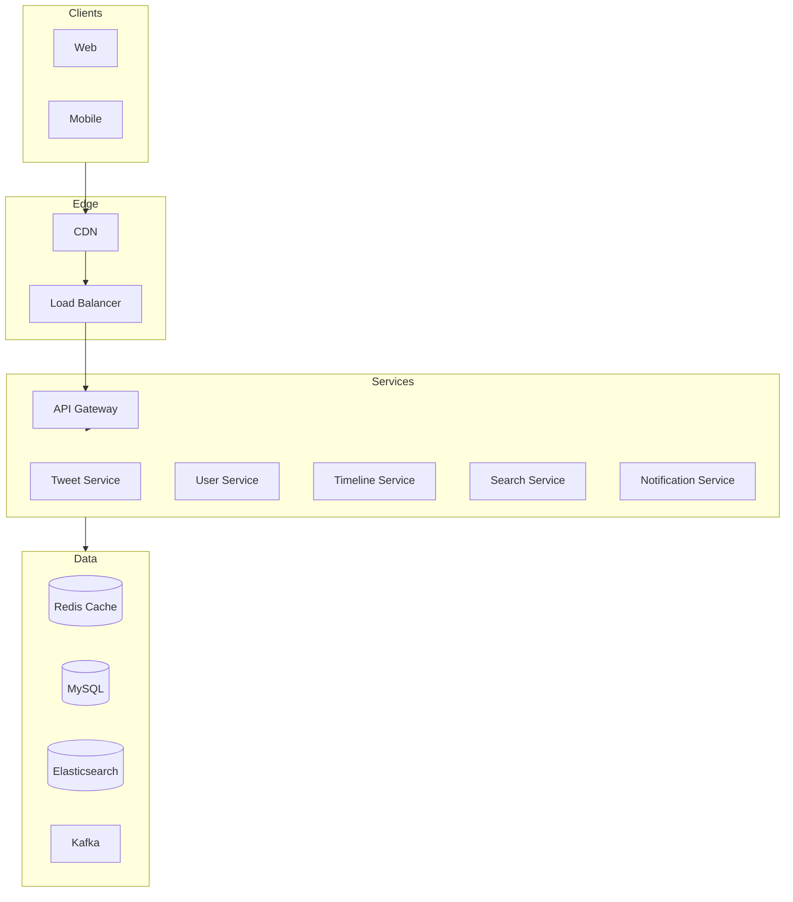
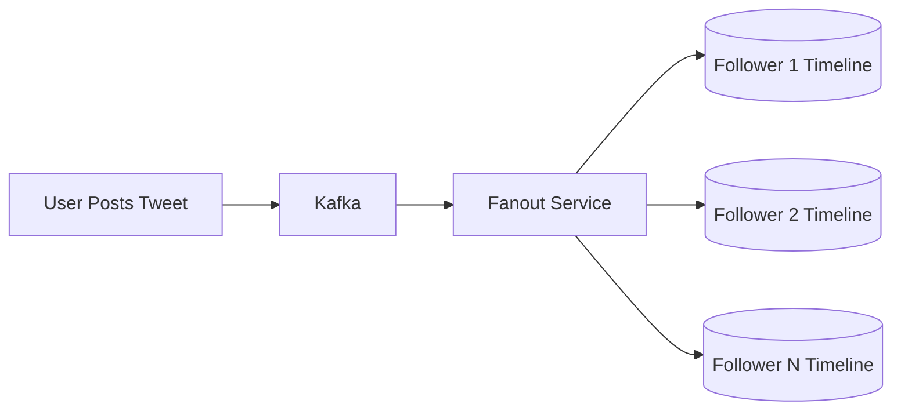
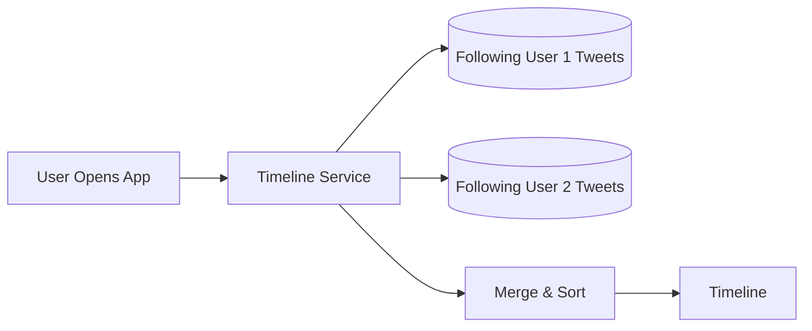
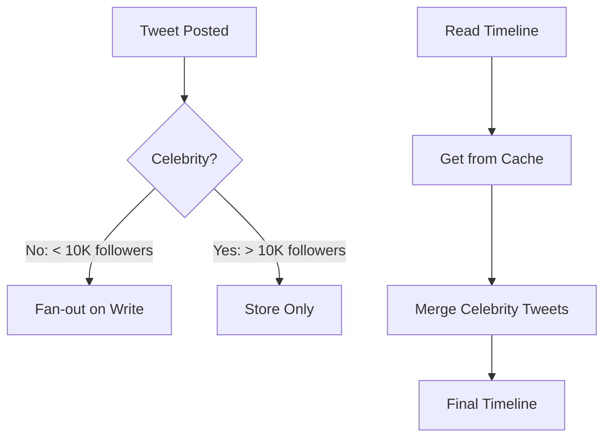
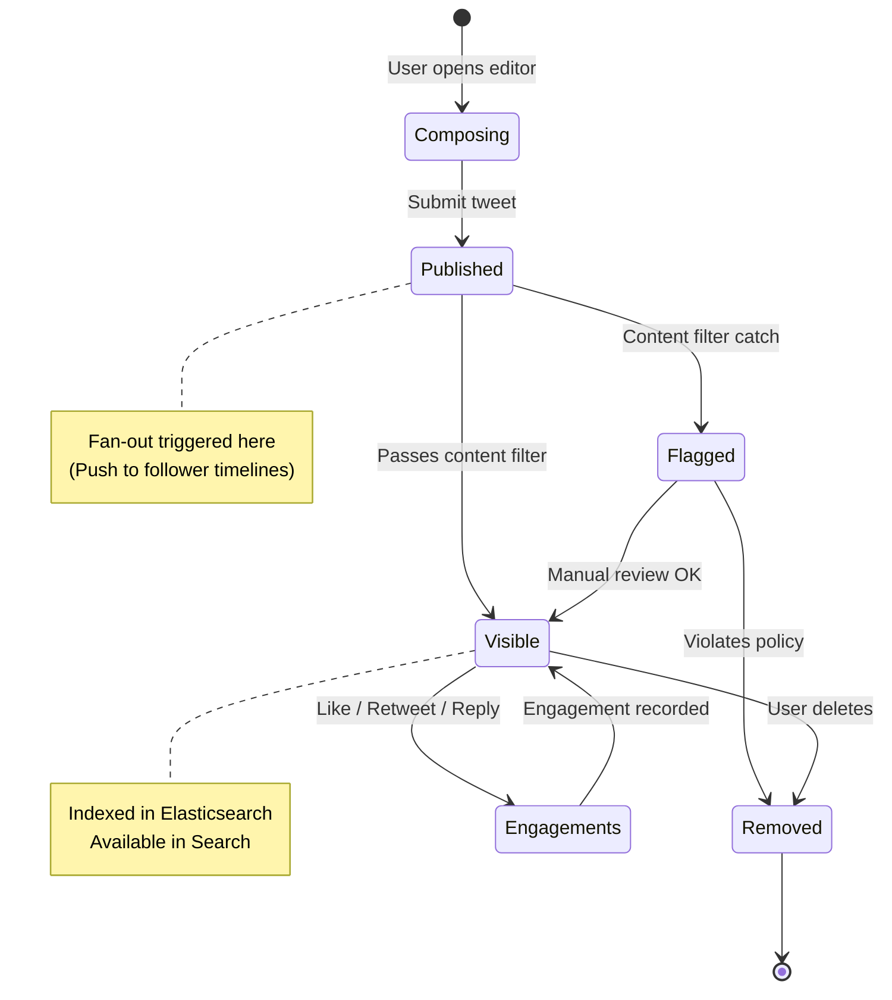

[🏠 Home](../../../README.md) | [⬅️ 01 OTT](./01-ott-platform.md) | [➡️ 03 Uber](./03-uber.md)

# 📱 Twitter System Design

> Design a social media platform with 500M+ users

---

## ✅ Functional Requirements

| Feature | Description |
|---------|-------------|
| **Post Tweet** | 280 character text + media |
| **Follow Users** | Follow/unfollow relationships |
| **Home Timeline** | Feed of followed users' tweets |
| **Search** | Find tweets and users |
| **Notifications** | Likes, retweets, mentions |

---

## 📊 Scale Estimation

- **Users**: 500 million
- **DAU**: 200 million
- **Tweets/day**: 500 million
- **Reads/Writes ratio**: 1000:1 (read-heavy)

---

## 🏗️ High-Level Architecture



---

## 🔥 The Timeline Problem

### Fan-out on Write (Push Model)

When user tweets, push to all followers' timelines.



**Pros:** Fast reads
**Cons:** Slow writes for celebrities (millions of followers)

### Fan-out on Read (Pull Model)

Fetch and merge tweets at read time.



**Pros:** Fast writes
**Cons:** Slow reads

### Hybrid Approach (Twitter's Solution)



---

## 💾 Database Design

### Users Table
```sql
CREATE TABLE users (
    user_id BIGINT PRIMARY KEY,
    username VARCHAR(50) UNIQUE,
    email VARCHAR(255),
    follower_count INT DEFAULT 0,
    following_count INT DEFAULT 0,
    created_at TIMESTAMP
);
```

### Tweets Table
```sql
CREATE TABLE tweets (
    tweet_id BIGINT PRIMARY KEY,
    user_id BIGINT,
    content VARCHAR(280),
    media_urls JSON,
    like_count INT DEFAULT 0,
    retweet_count INT DEFAULT 0,
    created_at TIMESTAMP,
    INDEX (user_id, created_at)
);
```

### Follows (Graph DB or Adjacency List)
```sql
CREATE TABLE follows (
    follower_id BIGINT,
    followee_id BIGINT,
    created_at TIMESTAMP,
    PRIMARY KEY (follower_id, followee_id)
);
```

### Timeline Cache (Redis)
```
user:{user_id}:timeline → [tweet_id1, tweet_id2, ...]
```

---

## ⚡ Key Optimizations

1. **Redis for Timeline Cache** - Pre-computed timelines
2. **Snowflake IDs** - Time-ordered, distributed ID generation
3. **Kafka for Async** - Fanout processing
4. **CDN for Media** - Image/video delivery
5. **Elasticsearch for Search** - Tweet and user search

---

## 🔄 Tweet Lifecycle State Machine



---

## 📚 Key Takeaways

- Hybrid fan-out approach for best performance
- Separate concerns into microservices
- Heavy caching for read-heavy workloads
- Async processing for fan-out operations

---

*Reference design for social media at scale.*
