[🏠 Home](../../../../README.md) | [⬅️ 04 WhatsApp](../04-whatsapp.md) | [➡️ 02 Architecture Deep Dive](./02-architecture-deep-dive.md)

# 🎬 Netflix System Design
## System Design Interview Guide

> Design a global video on-demand platform serving 260M+ users

---

## 📊 Quick Reference Card

| Aspect | Decision |
|--------|----------|
| **Architecture** | Microservices (1000+) |
| **Video Delivery** | Open Connect (Custom CDN) |
| **Backend Logic** | AWS (Control Plane) |
| **Database** | Cassandra (History) + MySQL (Billing) |
| **Discovery** | Eureka |
| **Gateway** | Zuul / Spring Cloud Gateway |
| **Resilience** | Hystrix (Circuit Breakers) |
| **CAP Priority** | AP (Availability for streaming) |

---

## 📋 Table of Contents
1. [Functional Requirements](#-functional-requirements)
2. [Non-Functional Requirements](#-non-functional-requirements)
3. [Core Entities](#-core-entities)
4. [API Design](#-api-design)
5. [High-Level Design](#-high-level-design-hld)
6. [Deep Dive: Open Connect](#-deep-dive-open-connect)
7. [Low-Level Design](#-low-level-design-lld)

---

## ✅ Functional Requirements

| Feature | Description | Priority |
|---------|-------------|----------|
| **Video Streaming** | Play content with no buffering | P0 |
| **Playback Controls** | Play, pause, seek, fast-forward | P0 |
| **Content Discovery** | Search and Home Page recommendations | P0 |
| **Device Support** | Smart TVs, Mobile, Web | P0 |
| **User Activity** | Save watch history and resume points | P1 |

### User Journey Flow

```mermaid
flowchart LR
    A["👤 User"] --> B["🔌 App Launch"]
    B --> C["🏠 Home Feed"]
    C --> D["🔍 Search"]
    C --> E["🎬 Play Title"]
    E --> F["📡 CDN Stream"]
    E --> G["⏸️ Pause/Resume"]
    
    style E fill:#E50914,color:#fff
```



---

## 📊 Non-Functional Requirements

### 📈 Scale Estimation

```mermaid
flowchart LR
    subgraph Scale["📊 Netflix Scale"]
        U["👥 260M Users"]
        V["🎬 15K Titles"]
        S["💾 300 TB Content"]
        B["⚡ 250 Tbps bandwidth"]
    end
```



| Metric | Value | Calculation |
|--------|-------|-------------|
| **Total Users** | 260 Million | Given |
| **Peak Concurrent** | 50 Million | ~20% of users at peak Global |
| **Catalog Size** | 15,000 Titles | Movies & TV Shows |
| **Storage (Master)** | ~750 TB | 15K titles * 50GB/master |
| **Storage (Renditions)** | ~300 TB | Transcoded versions (SD/HD/4K) |
| **Egress Bandwidth** | ~250 Tbps | 50M users * 5 Mbps (HD) |

### ⚖️ CAP Theorem Application

```mermaid
flowchart TB
    subgraph CAP["CAP Choices for Netflix"]
        direction LR
        VIDEO["📺 Playback\n🟢 AP - Available"]
        BILL["💳 Billing\n🔵 CP - Consistent"]
        HIST["📜 History\n🟢 AP - Available"]
    end
```



| Module | Priority | Reason |
|--------|----------|--------|
| **Streaming** | 🟢 AP | Never stop the stream. Older manifest is better than error. |
| **Billing** | 🔵 CP | Zero tolerance for payment errors. |
| **Recommendations** | 🟢 AP | Stale recommendations are better than empty screen. |

---

## 🗃️ Core Entities


---

## 🔌 API Design

### Playback API

```http
# Start Playback Session
POST /api/v1/playback/initialize
Content-Type: application/json

{
    "user_id": "u-12345",
    "video_id": "v-9876",
    "device_caps": ["4k", "hdr", "dolby_atmos"]
}

Response: 200 OK
{
    "session_id": "s-5555",
    "cdn_ranking": [
        "https://oca-isp-mumbai.nflxvideo.net/...",
        "https://oca-aws-singapore.nflxvideo.net/..."
    ],
    "drm_license_url": "..."
}
```

### Telemetry API

```http
# Report Watching Progress
POST /api/v1/tracking/progress
{
    "session_id": "s-5555",
    "video_id": "v-9876",
    "current_time": 1205,
    "event": "heartbeat"
}
```

---

## 🏛️ High-Level Design (HLD)

Netflix uses a **Split Architecture**: Control Plane on AWS, Data Plane on Open Connect.

```mermaid
flowchart TB
    subgraph Client["📱 Client Devices"]
        TV[Smart TV]
        Mobile[Mobile]
    end

    subgraph ControlPlane["☁️ Control Plane (AWS)"]
        LB[Load Balancer]
        ZUUL[Zuul Gateway]
        
        subgraph Services["Microservices"]
            PLAY[Playback Svc]
            USER[User Svc]
            REC[Recommendation]
        end
        
        subgraph Data["Databases"]
            SQL[(MySQL - Billing)]
            CASS[(Cassandra - History)]
            REDIS[(EVCache)]
        end
    end

    subgraph DataPlane["💿 Data Plane (Open Connect)"]
        OCA_ISP["OCA @ ISP (Jio/Verizon)"]
        OCA_IXW["OCA @ IX (Internet Exchange)"]
    end

    Client --> |"1. Login/Browse"| LB
    LB --> ZUUL
    ZUUL --> Services
    Services --> Data
    
    Client --> |"2. Get Stream URL"| ZUUL
    ZUUL --> PLAY
    PLAY --> |"Select Best OCA"| Client
    
    Client --> |"3. Stream Bytes"| OCA_ISP
    OCA_IXW -.-> |"Nightly Fill"| OCA_ISP
    
    style ControlPlane fill:#f9f9f9,stroke:#333
    style DataPlane fill:#e1f5fe,stroke:#333
    style OCA_ISP fill:#ffcccc,stroke:#E50914
```



---

## 🚀 Deep Dive: Open Connect

**Why build a custom CDN?**
*   **Cost**: Transmitting 15% of the world's internet traffic via Akamai/Cloudfront is too expensive.
*   **Performance**: Putting servers *inside* the ISP (Internet Service Provider) removes network hops.

### The Content Delivery Flow


---

## 🔧 Low-Level Design (LLD)

### Database Sharding (Cassandra)
Netflix uses Cassandra for the massive write volume of "Watch History" (millions of writes/sec).

**Schema Design:**
*   **Partition Key**: `user_id` -> Ensures all history for one user is on the same node (fast reads).
*   **Clustering Key**: `latest_watched` -> Keeps the specific row sorted by time (fast "Continue Watching" query).

### Handling Failures (Hystrix)
When a service fails (e.g., Recommendation Engine is down):
1.  **Circuit Breaker Opens**: Stops sending traffic to the failed service.
2.  **Fallback Logic**: Returns a static list of "Popular Movies" instead of personalized picks.
3.  **Result**: The user enters the app successfully and can watch videos, never knowing the recommendation engine is broken.

---

## 💡 Interview Tips for Netflix

1.  **Emphasize the Split**: AWS for logic, Open Connect for video. This is unique to Netflix.
2.  **Mention Per-Title Encoding**: Mention how Netflix optimizes video size based on complexity (Animation vs Action).
3.  **Chaos Engineering**: Mention Chaos Monkey and how Netflix kills servers in production to test resilience.
4.  **No "Hot" Shards**: Unlike Twitter (Celebrity problem), Netflix users don't "follow" millions of people, so sharding by User ID is evenly distributed.

---

*See also: [Architecture Deep Dive](./02-architecture-deep-dive.md)*
