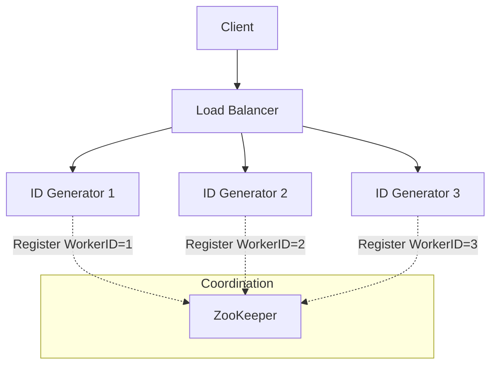

[🏠 Home](../../../README.md) | [⬅️ 07 Rate Limiter](./07-rate-limiter.md) | [➡️ 09 Web Crawler](./09-web-crawler.md)

# 🆔 System Design: Unique ID Generator

> Design a distributed system to generate unique, sortable, numerical IDs (like Twitter Snowflake).

---

## 📊 Quick Reference Card

| Aspect | Decision |
|--------|----------|
| **Format** | 64-bit Integer (Sortable) |
| **Algorithm** | Twitter Snowflake (Time + Node + Seq) |
| **Performance** | Ultra Low Latency, High Throughput (10k+ IDs/sec) |
| **Coordination** | ZooKeeper (for Worker ID assignment) |
| **Clock Sync** | NTP (Network Time Protocol) |
| **Requirement** | K-Sortable (Roughly ordered by time) |

---

## 📋 Table of Contents
1. [Functional Requirements](#-functional-requirements)
2. [Why not UUID or Auto-Increment?](#-why-not-uuid-or-auto-increment)
3. [The Core Algorithm (Snowflake)](#-the-core-algorithm-snowflake)
4. [High-Level Architecture](#-high-level-architecture)
5. [Deep Dives](#-deep-dives)

---

## ✅ Functional Requirements

| Feature | Description | Priority |
|---------|-------------|----------|
| **Uniqueness** | Every ID must be unique forever | P0 |
| **Sortable** | IDs should be sortable by time (Old < New) | P0 |
| **Numeric** | 64-bit integer (fits in `BIGINT`) | P0 |
| **High Availability** | Mission critical; zero downtime allowed | P0 |
| **Scale** | 10,000+ IDs per second | P1 |

---

## 🆚 Why not UUID or Auto-Increment?

### 1. MySQL Auto-Increment
*   **Method**: `AUTO_INCREMENT` in one database.
*   **Problem**: Single Point of Failure (SPOF). Hard to scale writes.
*   **Multi-Master Fix**: Server A generates 1, 3, 5... Server B generates 2, 4, 6...
    *   *Issue*: Adding a Server C requires changing the "step" config on all servers (downtime).

### 2. UUID (GUID)
*   **Method**: 128-bit hex string (e.g., `550e8400-e29b-41d4-a716-446655440000`).
*   **Pros**: Zero coordination needed. True uniqueness.
*   **Cons**:
    *   **Too Big**: 128-bit is 4x larger than a standard 32-bit int. Indexing is slow.
    *   **Not Sortable**: Random distribution. Cannot sort by creation time.
    *   **Bad for B-Trees**: Random inserts cause page fragmentation in MySQL/Postgres.

### 3. Database Ticket Server (Flickr)
*   **Method**: A centralized DB table `Tickets` that just runs `REPLACE INTO Tickets (stub) VALUES ('a'); SELECT LAST_INSERT_ID();`.
*   **Pros**: Simple, numeric.
*   **Cons**: Still a SPOF; network latency dominates.

---

## ❄️ The Core Algorithm (Twitter Snowflake)

We use a **64-bit integer** divided into segments.

```
┌─────────────────────────────────────────────────────────────────────────┐
│                           64-BIT ID STRUCTURE                           │
├─────────┬──────────────────────────────┬──────────────────┬─────────────┤
│ 1 Bit   │ 41 Bits                      │ 10 Bits          │ 12 Bits     │
├─────────┼──────────────────────────────┼──────────────────┼─────────────┤
│ Sign    │ Timestamp (Milliseconds)     │ Machine ID       │ Sequence #  │
│ (Unused)│ (Since Custom Epoch)         │ (Datacenter+Node)│ (Per ms)    │
└─────────┴──────────────────────────────┴──────────────────┴─────────────┘
```

### Breakdown
1.  **Sign Bit (1 bit)**: Always 0 (for positive numbers).
2.  **Timestamp (41 bits)**:
    *   Milliseconds since custom epoch (e.g., Nov 4, 2010 for Twitter).
    *   $2^{41} \text{ ms} \approx 69 \text{ years}$.
3.  **Machine ID (10 bits)**:
    *   Split into 5 bits (Datacenter) + 5 bits (Worker).
    *   Supports $2^{10} = 1024$ nodes.
4.  **Sequence Number (12 bits)**:
    *   Counter for IDs generated in the *same* millisecond.
    *   Supports $2^{12} = 4096$ IDs per millisecond per node.

---

## 🏛️ High-Level Architecture



### Pseudocode (Java-style)

```java
synchronized long nextId() {
    long currentTimestamp = timestamp();

    if (currentTimestamp < lastTimestamp) {
        throw new Exception("Clock moved backwards!");
    }

    if (currentTimestamp == lastTimestamp) {
        // Same millisecond: increment sequence
        sequence = (sequence + 1) & 4095;
        if (sequence == 0) {
            // Sequence exhausted, wait for next millisecond
            currentTimestamp = waitNextMillis(currentTimestamp);
        }
    } else {
        // New millisecond: reset sequence
        sequence = 0;
    }

    lastTimestamp = currentTimestamp;

    return ((currentTimestamp - EPOCH) << 22) |
           (workerId << 12) |
           sequence;
}
```

---

## 🔍 Deep Dives

### 1. Clock Synchronization (NTP)
*   **Problem**: Snowflake relies on wall-clock time. If the system clock drifts or NTP moves it backwards, we might generate duplicate IDs.
*   **Solution**:
    *   Check `if (currentTimestamp < lastTimestamp)`.
    *   If the difference is small (< 5ms), just **pause/sleep** the thread until it catches up.
    *   If large, throw an error and take the node out of rotation.

### 2. High Availability
*   Since ID generators are stateless (except for their assigned `WorkerID`), you can easily scale them.
*   **ZooKeeper** is used only at startup to assign a unique WorkerID (0-1023) to each server. If a server dies, the ID can be reused after a TTL.

### 3. K-Sortable "Roughly Sorted"
*   These IDs are not *strictly* increasing globally (Node B might be 1ms behind Node A).
*   However, they are **roughly** sorted. For most timeline feeds (Twitter, Instagram), roughly sorted is good enough for `ORDER BY id`.

---

## 🧠 Interview Questions

1.  **Q**: What if we run out of 69 years of timestamp?
    *   **A**: Requires migration. Can change epoch or migrate to 128-bit DB columns (like UUID). But 69 years is usually "problem for future me".
2.  **Q**: Why 12 bits for sequence?
    *   **A**: 4096 IDs/ms = ~4 Million IDs/sec *per node*. This is massive overkill for almost any application, ensuring high throughput.
3.  **Q**: Can we use this for Order Numbers visible to users?
    *   **A**: Yes, but they are long (18+ digits). For user-facing IDs (like `ORDER-8821`), we might prefer a smaller database ticket server or a HashID approach.

---
