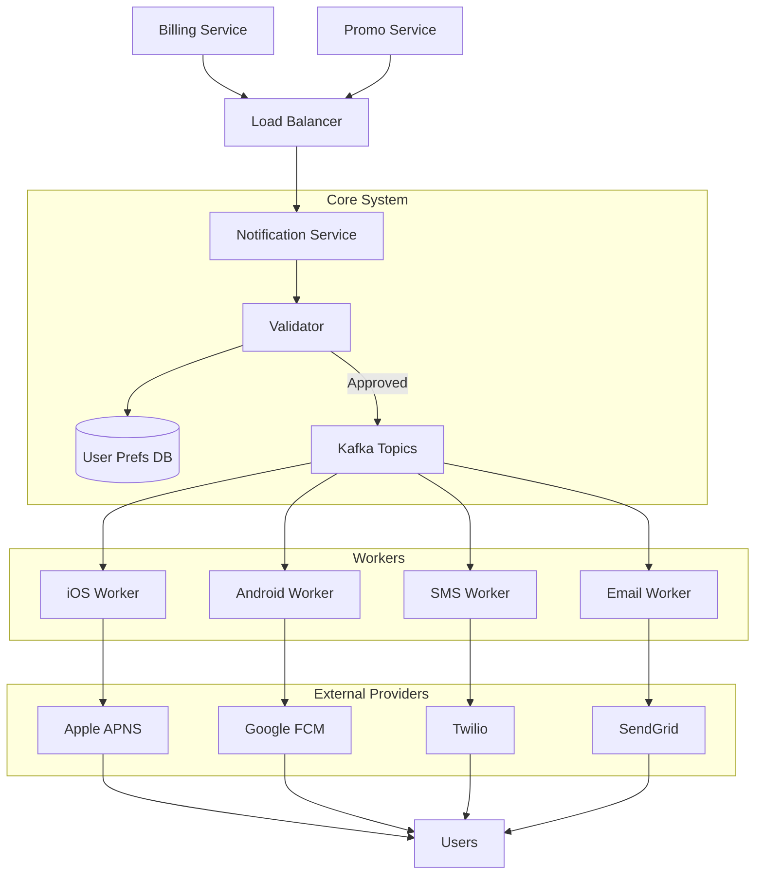

[🏠 Home](../../../README.md) | [⬅️ 09 Web Crawler](./09-web-crawler.md) | [➡️ 11 E-Commerce](./11-ecommerce.md)

# 🔔 System Design: Notification System

> Design a scalable system to send millions of notifications (Push, SMS, Email).

---

## 📊 Quick Reference Card

| Aspect | Decision |
|--------|----------|
| **Architecture** | Event-Driven (Async Queues) |
| **Queues** | RabbitMQ (Task routing) or Kafka (High retention) |
| **DB** | NoSQL (Cassandra/MongoDB) for logs/status |
| **Providers** | FCM/APNS (Mobile), Twilio (SMS), SendGrid (Email) |
| **Reliability** | Retry Queues + Dead Letter Queue (DLQ) |
| **Dedup** | Idempotency Keys (Redis) |

---

## 📋 Table of Contents
1. [Functional Requirements](#-functional-requirements)
2. [High-Level Architecture](#-high-level-architecture)
3. [Component Design](#-component-design)
4. [Reliability & Retries](#-reliability--retries)
5. [Deep Dives](#-deep-dives)

---

## ✅ Functional Requirements

| Feature | Description | Priority |
|---------|-------------|----------|
| **Multi-Channel** | Support iOS, Android, SMS, Email | P0 |
| **Bulk Sending** | "Notify all users" (Fan-out) | P0 |
| **Reliability** | Ensure delivery (At least once) | P0 |
| **Ordering** | Not strictly required, but nice to have | P2 |
| **Rate Limiting** | Do not overwhelm users or providers | P1 |

---

## 🏛️ High-Level Architecture

The system acts as a bridge between internal services (Billing, Social) and external providers (Apple, Google, Twilio).



---

## 🔧 Component Design

### 1. Service API
Internal services send a payload:
```json
{
  "user_id": "u-123",
  "type": "PAYMENT_SUCCESS",
  "channels": ["SMS", "EMAIL"],
  "content": { "amount": "$50" },
  "idempotency_key": "tx-8821"
}
```

### 2. Contact Info & Preferences DB
Before sending, check:
*   Does user exist?
*   Do we have their Token/Phone?
*   **Did they opt-out?** (Crucial Compliance)

### 3. Message Queues (Buffers)
We decouple the sender from the provider.
*   **Topic: `sms_notifications`**
*   **Topic: `email_notifications`**
*   **Why?**: If Twilio goes down, we just buffer messages in Kafka. We don't crash the Billing Service.

---

## 🛡️ Reliability & Retries

**Problem**: External providers fail accurately.
**Solution**: Retry Queues.

```mermaid
flowchart LR
    Worker --> |Fail| RetryQ[Retry Queue (Delay 30s)]
    RetryQ --> Worker
    Worker --> |Fail 3x| DLQ[Dead Letter Queue]
    DLQ --> Admin[Manual Review / Alert]
```

### Deduplication
*   **Risk**: If worker crashes after sending to Twilio but before updating DB, it might retry and send duplicate SMS (cost money!).
*   **Fix**: Check `idempotency_key` in Redis before sending.
    *   `SETNX key "sent" EX 300`
    *   If returns 0, skip.

---

## 🔍 Deep Dives

### 1. Rate Limiting (Throttling)
*   **User Side**: Don't send 100 promos to Alice in 1 minute.
    *   Check `Redis:User:Alice:Count`.
*   **Provider Side**: Twilio limits you to 100 SMS/sec.
    *   Worker threads must respect a local Rate Limiter (Token Bucket).

### 2. RabbitMQ vs Kafka
*   **RabbitMQ**: Better for complex routing (e.g., Priority Queues). If you need individual message acknowledgment and removal.
*   **Kafka**: Better for massive throughput (Log-based). If you have 10M notifications/hour.
*   **Verdict**: Use RabbitMQ for complex logic, Kafka for raw scale.

### 3. Notification Templates
*   Don't hardcode strings like "Hello Samarpit".
*   Store templates: "Hello {{name}}, you spent {{amount}}".
*   Workers fetch template and render logic.

---

## 🧠 Interview Questions

1.  **Q**: How to send a notification to 10 Million users (Bulk)?
    *   **A**: Do not loop in the API.
    *   1. API accepts "Bulk Request".
    *   2. Pushes 1 message to a "Fan-out Exchange".
    *   3. A worker reads "All Users", queries DB for 10M IDs, and pushes 10M individual events to the Kafka queue (Async).
2.  **Q**: How to handle users changing timezones?
    *   **A**: Store user timezone. For specific time delivery (e.g., 9 AM), use a Scheduler that queries "Users where Timezone = Now - 9h".
3.  **Q**: Tracking "Read Status"?
    *   **A**: Embed a 1x1 invisible pixel in emails. For Push, App calls back API `POST /read {id}` when opened.

---
