[🏠 Home](../../../../README.md) | [⬅️ 01 System Design Interview](./01-system-design-interview.md) | [➡️ 12 Location Based Service](../12-location-based-service.md)

# 🏛️ Amazon Architecture Deep Dive
## From Monolith to Microservices: A Case Study

> "Everything fails, all the time." — Werner Vogels, Amazon CTO

---

## 📋 Table of Contents
1. [The Transformation: 2001-2006](#-the-transformation-2001-2006)
2. [Service-Oriented Architecture](#-service-oriented-architecture-soa)
3. [Prime Day Architecture](#-prime-day-architecture)
4. [DynamoDB Deep Dive](#-dynamodb-deep-dive-the-2007-paper)
5. [Resilience Patterns](#-resilience-patterns)
6. [Observability & Chaos Engineering](#-observability--chaos-engineering)
7. [Architectural Decision Records](#-architectural-decision-records-adrs)

---

## 🎯 Design Considerations (The "Why" Behind Every Choice)

### Database Selection Framework

| Use Case | Database | Why This Choice? | How It's Used |
|----------|----------|------------------|---------------|
| **Product Catalog** | DynamoDB | Schema-less (products have varying attributes); infinite horizontal scale; single-digit ms | Partition by `product_id`, store metadata + reviews in single-table design |
| **Shopping Cart** | Redis + DynamoDB | Redis for speed (~0.5ms), DynamoDB for durability | Redis primary, async write-through to DynamoDB |
| **Orders** | Aurora PostgreSQL | ACID transactions for financial integrity; complex reporting queries | Sharded by `customer_id`, read replicas for analytics |
| **Search Index** | OpenSearch | Full-text search; faceted filtering; fuzzy matching | Index products on catalog changes via DynamoDB Streams |
| **Sessions** | ElastiCache (Redis) | Sub-ms latency; automatic TTL expiry | Store JWT + user preferences; 24-hour TTL |
| **Analytics** | Redshift | Columnar storage for aggregations; PB-scale | ETL from Aurora nightly for business intelligence |

### Messaging Pattern Selection

| Scenario | Pattern | Service | Why? |
|----------|---------|---------|------|
| **Order → Inventory** | Async Queue | SQS | Decoupling; retry on failure; guaranteed delivery |
| **Price Change → All Subscribers** | Fan-out | SNS | One publish, many consumers (search, cache, analytics) |
| **Complex Workflow (Order Saga)** | Event-Driven | EventBridge | Schema registry; filtering rules; audit trail |
| **Real-time Notifications** | Push | WebSocket via API Gateway | Low latency for delivery tracking |

### Data Consistency Strategy

```mermaid
flowchart LR
    subgraph Consistency["Consistency Choices"]
        direction TB
        E["🟢 Eventual Consistency\nCatalog, Reviews, Search"]
        S["🔵 Strong Consistency\nInventory, Orders, Payments"]
    end
    
    subgraph Reason["Why?"]
        R1["Browsing: Stale data OK\n(price updated in 5 sec)"]
        R2["Checkout: Zero tolerance\n(no overselling)"]
    end
    
    E --> R1
    S --> R2
```



---

## 🔄 The Transformation: 2001-2006

### The Monolith Problem

In the early 2000s, Amazon.com was a **massive Perl/C++ monolith** called "Obidos". As the company scaled:

```mermaid
flowchart TB
    subgraph Problem["❌ The Monolith Pain"]
        A["🐌 Slow Deployments\n(weeks to ship)"]
        B["💥 Cascading Failures\n(one bug kills everything)"]
        C["👥 Team Bottlenecks\n(everyone changes same code)"]
        D["📈 Scaling Limits\n(can't scale parts independently)"]
    end
```



### The Mandate (2002)

Jeff Bezos issued the famous "API Mandate":

> 1. All teams will henceforth expose their data and functionality through service interfaces.
> 2. Teams must communicate with each other through these interfaces.
> 3. There will be no other form of interprocess communication allowed.
> 4. Anyone who doesn't do this will be fired.

This mandate birthed Amazon's **Service-Oriented Architecture (SOA)**.

---

## 🧩 Service-Oriented Architecture (SOA)

### Design Principles

```mermaid
flowchart LR
    subgraph Principles["Amazon SOA Principles"]
        P1["🎯 Single Purpose\nOne service = One job"]
        P2["📦 Own Your Data\nNo shared databases"]
        P3["🔌 APIs Only\nNo backdoor access"]
        P4["🍕 Two-Pizza Teams\n6-10 engineers max"]
    end
```



### Service Decomposition Example


### Communication Patterns

| Pattern | Use Case | AWS Service |
|---------|----------|-------------|
| **Synchronous (HTTP/REST)** | Real-time queries (e.g., get product details) | API Gateway + Lambda |
| **Async (Event-Driven)** | Decoupled workflows (e.g., order → shipment) | EventBridge + SQS |
| **Pub/Sub** | Fan-out notifications (e.g., price change alerts) | SNS |

---

## ⚡ Prime Day Architecture

Prime Day generates traffic **10x normal load**. Here's how Amazon prepares:

### Traffic Scale

```mermaid
flowchart LR
    subgraph Traffic["Prime Day 2023 Stats"]
        T1["📈 375M items sold"]
        T2["⚡ 66K TPS peak"]
        T3["💰 $12.7B in 48 hours"]
        T4["🌍 20+ countries"]
    end
```



### Scaling Strategy

```mermaid
flowchart TB
    subgraph Prepare["📋 Pre-Event (Weeks Before)"]
        P1["Load Testing\n(GameDay simulations)"]
        P2["Capacity Planning\n(Pre-provision EC2)"]
        P3["Feature Flags\n(Disable non-critical features)"]
    end
    
    subgraph Scale["⚙️ During Event"]
        S1["EC2 Auto Scaling\n(Predictive + Reactive)"]
        S2["DynamoDB On-Demand\n(Scales to trillions of requests)"]
        S3["CloudFront CDN\n(Edge caching)"]
        S4["ElastiCache\n(Hot data in Redis)"]
    end
    
    subgraph Protect["🛡️ Protection"]
        R1["WAF\n(Block malicious traffic)"]
        R2["Circuit Breakers\n(Fail fast)"]
        R3["Bulkheads\n(Isolate failures)"]
        R4["Priority Queues\n(Checkout > Browse)"]
    end
    
    Prepare --> Scale --> Protect
```



### AWS Services at Prime Day Scale

| Service | Prime Day Usage |
|---------|-----------------|
| **DynamoDB** | 89.2 trillion requests handled |
| **Lambda** | 1 trillion invocations |
| **SQS** | 160M messages/second peak |
| **ECS on Fargate** | 32M tasks launched |
| **Kinesis** | 100M+ records/second |

---

## 💾 DynamoDB Deep Dive: The 2007 Paper

The **Dynamo Paper** (2007) is one of the most influential papers in distributed systems. It describes the original Dynamo system (predecessor to DynamoDB as a service).

### Core Innovations

```mermaid
flowchart TB
    subgraph Innovations["Dynamo Paper Innovations"]
        I1["🔄 Consistent Hashing\nData distribution"]
        I2["📝 Vector Clocks\nConflict resolution"]
        I3["🗳️ Quorum Reads/Writes\nTunable consistency"]
        I4["🤝 Sloppy Quorum\nHigh availability"]
        I5["☠️ Merkle Trees\nAnti-entropy sync"]
    end
```



### Consistent Hashing

Instead of modulo-based sharding (which requires reshuffling when nodes change), Dynamo uses a **hash ring**:

```mermaid
flowchart TB
    subgraph Ring["Hash Ring"]
        direction TB
        N1["Node A\n(0-100)"]
        N2["Node B\n(101-200)"]
        N3["Node C\n(201-300)"]
        
        D1["Data key 'product-123'\nhash = 150\n→ Node B"]
    end
```



**Benefits:**
- Adding/removing nodes only affects adjacent data
- Virtual nodes enable load balancing

### Quorum-Based Replication

| Parameter | Meaning |
|-----------|---------|
| **N** | Total replicas (typically 3) |
| **W** | Write quorum (replicas that must ACK) |
| **R** | Read quorum (replicas to query) |

**Rule:** `R + W > N` ensures strong consistency.

**Amazon's Default:** `N=3, W=2, R=2` (strong consistency)
**For high availability:** `N=3, W=1, R=1` (eventual consistency)

### Modern DynamoDB (2012+)

DynamoDB as a managed service adds:

```mermaid
flowchart LR
    subgraph Modern["DynamoDB Service Additions"]
        M1["🔧 Fully Managed\nNo server ops"]
        M2["📊 Auto Scaling\nOn-demand capacity"]
        M3["🌍 Global Tables\nMulti-region replication"]
        M4["🔐 IAM Integration\nFine-grained access"]
        M5["🔄 DynamoDB Streams\nChange Data Capture"]
    end
```



---

## 🛡️ Resilience Patterns

Amazon's systems are designed to **fail gracefully**. Key patterns:

### 1. Circuit Breaker


**Implementation:** When the Payment Service fails 5 times in 10 seconds, stop calling it for 30 seconds.

### 2. Bulkhead Pattern


If Search is overwhelmed, it cannot steal threads from Checkout.

### 3. Timeout + Retry with Backoff

```java
// Pseudocode
int retries = 3;
int backoff = 100; // ms

for (int i = 0; i < retries; i++) {
    try {
        return callService(timeout: 500ms);
    } catch (TimeoutException e) {
        sleep(backoff * (2^i) + jitter);
    }
}
throw new ServiceUnavailableException();
```

### 4. Graceful Degradation

During Prime Day overload:

| Feature | Degradation Strategy |
|---------|---------------------|
| **Recommendations** | Show cached "Top Sellers" instead of personalized picks |
| **Reviews** | Disable new review submissions, show cached reviews |
| **Search Suggestions** | Disable autocomplete, keep basic search |
| **Checkout** | **NEVER degrade** — this is revenue-critical |

---

## 🔍 Observability & Chaos Engineering

### The Three Pillars

```mermaid
flowchart LR
    subgraph Observability["Observability Pillars"]
        L["📝 Logs\n(CloudWatch Logs)"]
        M["📊 Metrics\n(CloudWatch Metrics)"]
        T["🔗 Traces\n(X-Ray)"]
    end
```



### Chaos Engineering

Amazon runs **GameDay** exercises before major events:

| Experiment | Purpose |
|------------|---------|
| **Kill random EC2 instances** | Test auto-recovery |
| **Throttle DynamoDB** | Test graceful degradation |
| **Inject latency** | Test timeout handling |
| **Fail entire AZ** | Test multi-AZ failover |

---

## 📋 Architectural Decision Records (ADRs)

### ADR-001: DynamoDB over MySQL for Catalog

**Context:** Product catalog needs to handle millions of products with varying attributes.

**Decision:** Use DynamoDB with single-table design.

**Rationale:**
- Schema flexibility (each product can have different attributes)
- Horizontal scaling without sharding complexity
- Single-digit millisecond latency at any scale

**Tradeoffs:**
- No ad-hoc queries (plan access patterns upfront)
- Higher learning curve for developers

---

### ADR-002: Event-Driven Checkout

**Context:** Checkout process touches 5+ services.

**Decision:** Use choreography-based Saga with EventBridge.

**Rationale:**
- Loose coupling between services
- No single orchestrator as SPOF
- Each service evolves independently

**Tradeoffs:**
- Harder to debug distributed flows
- Requires robust event tracking

---

### ADR-003: ElastiCache for Shopping Cart

**Context:** Cart operations must be extremely fast.

**Decision:** Use Redis (ElastiCache) as primary cart store, DynamoDB as backup.

**Rationale:**
- Sub-millisecond reads/writes
- TTL for abandoned cart cleanup
- Atomic operations for quantity updates

**Tradeoffs:**
- RAM is expensive at scale
- Need backup strategy for durability

---

## 🧠 Key Takeaways for Interviews

```mermaid
flowchart TB
    subgraph Takeaways["Interview Gold"]
        T1["🏗️ Decentralization\nTwo-pizza teams own services"]
        T2["💾 DynamoDB\nKnow the Dynamo paper"]
        T3["🔄 Saga Pattern\nDistributed transactions"]
        T4["🛡️ Resilience\nCircuit breakers, bulkheads"]
        T5["⚡ Scale\nPrime Day = 10x normal"]
    end
```



---

## 📚 Further Reading

- [Amazon Dynamo Paper (2007)](https://www.allthingsdistributed.com/2007/10/amazons_dynamo.html)
- [Werner Vogels' Blog](https://www.allthingsdistributed.com/)
- [AWS re:Invent Prime Day Deep Dive](https://www.youtube.com/watch?v=example)
- [AWS Architecture Blog](https://aws.amazon.com/blogs/architecture/)

---

*See also: [System Design Interview Guide](./01-system-design-interview.md)*
