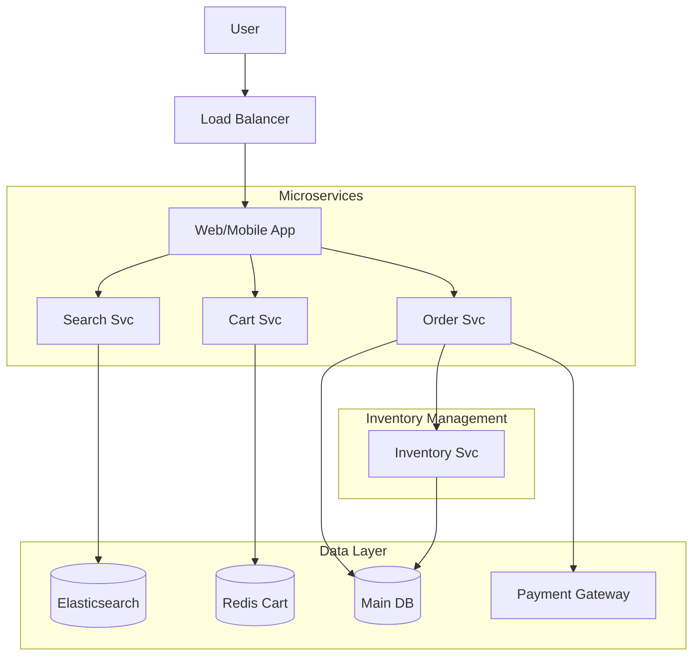
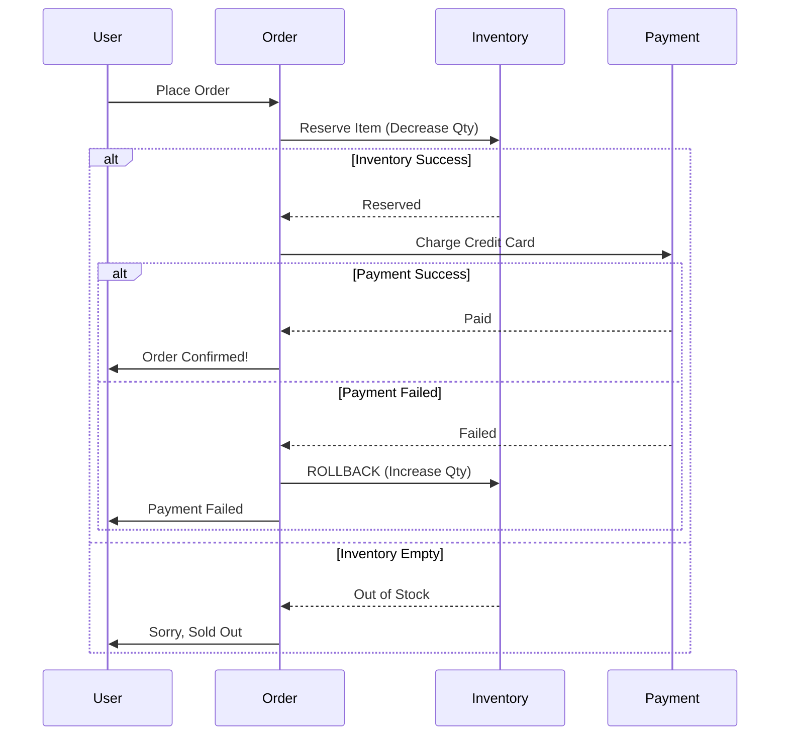

[🏠 Home](../../../README.md) | [⬅️ 10 Notification System](./10-notification-system.md) | [➡️ 12 Location Based Service](./12-location-based-service.md)

# 🛒 System Design: E-Commerce (Amazon/Flipkart)

> Design a scalable e-commerce platform handling millions of orders (Inventory, Cart, Checkout).

---

## 📊 Quick Reference Card

| Aspect | Decision |
|--------|----------|
| **Search** | Elasticsearch (Fuzzy search, filters) |
| **Inventory Lock** | Redis (TTL Lock) or DB Optimistic Locking |
| **Cart Storage** | Redis (Fast read/write) + Persistent DB backup |
| **Consistency** | ACID for Orders/Inventory (MySQL/Postgres) |
| **Checkout** | Distributed Transaction (Saga Pattern) |
| **Images** | CDN (CloudFront) + S3 |

---

## 📋 Table of Contents
1. [Functional Requirements](#-functional-requirements)
2. [Database Schema](#-database-schema)
3. [High-Level Architecture](#-high-level-architecture)
4. [The Checkout Flow (The Hard Part)](#-the-checkout-flow-the-hard-part)
5. [Deep Dives](#-deep-dives)

---

## ✅ Functional Requirements

| Feature | Description | Priority |
|---------|-------------|----------|
| **Product Search** | Fast search by name, category, price | P0 |
| **Add to Cart** | Persist items in cart across sessions | P0 |
| **Checkout** | Validate inventory, process payment, create order | P0 |
| **Inventory Mgmt** | Handle "Out of Stock" race conditions | P0 |
| **Order History** | View past orders | P1 |

---

## 💾 Database Schema

We need **ACID** compliance for money and inventory.

**SQL is preferred** (Postgres/MySQL).

### Tables

1.  **Products**
    *   `id` (PK), `name`, `price`, `description`, `seller_id`
2.  **Inventory**
    *   `product_id` (PK), `quantity`
3.  **Cart**
    *   `user_id` (PK), `items_json` (or separate line items)
4.  **Orders**
    *   `id` (PK), `user_id`, `total_amount`, `status` (PENDING, PAID, SHIPPED)

---

## 🏛️ High-Level Architecture

---

## 🛍️ The Checkout Flow (The Hard Part)

The critical challenge is **Concurrency**: What if only 1 iPhone is left, and 10 users click "Buy" at the exact same millisecond?

### Strategy 1: Pessimistic Locking (Bad for scale)
*   `SELECT * FROM inventory WHERE product_id=1 FOR UPDATE;`
*   Locks the row. No one else can read/write until transaction ends.
*   **Result**: Slow checkout experience.

### Strategy 2: Optimistic Locking (Better)
*   Add a `version` column to Inventory.
*   `UPDATE inventory SET quantity = quantity - 1, version = version + 1 WHERE product_id=1 AND quantity > 0 AND version = 5;`
*   **Check**: If rows affected = 0, it means someone else bought it. Retry or fail.

### The Saga Pattern (Distributed)
Checkout touches multiple services: `Order`, `Payment`, `Inventory`, `Shipping`.

---

## 🔍 Deep Dives

### 1. Shopping Cart Management
*   **Anonymous Users**: Store cart in Browser LocalStorage or Session Cookie.
*   **Logged In Users**: Store in Redis for speed. Persist to DB asynchronously (write-behind) so we don't lose carts if Redis crashes.
*   **Merge**: When anonymous user logs in, merge LocalStorage cart with Redis cart.

### 2. Search Indexing
*   Product database (MySQL) is the "Source of Truth".
*   Search Engine (Elasticsearch) is a "View".
*   **Sync**:
    *   Use Change Data Capture (CDC) like **Debezium**.
    *   MySQL BinLog $\rightarrow$ Kafka $\rightarrow$ Elasticsearch Consumer.
    *   Ensures near real-time search updates.

### 3. Handling Flash Sales (Black Friday)
*   **Problem**: 1 Million requests/sec for 100 items. Database will die.
*   **Solution**:
    *   **Redis Geofencing**: Only allow traffic from relevant regions.
    *   **Queue-based Access**: Users enter a "Waiting Room" queue (check Ticketmaster design).
    *   **Cache Inventory**: Track inventory in Redis (atomic `DECR`). Only hit DB for the final winner.

---

## 🧠 Interview Questions

1.  **Q**: Users complain that items disappear from cart. Why?
    *   **A**: Carts usually have a TTL (7-30 days). Or, we don't reserve inventory for items in cart (inventory is checked only at checkout). If we reserved items in cart, malicious users could block all inventory.
2.  **Q**: How to handle duplicate payment requests?
    *   **A**: Idempotency Keys. Client generates a unique UUID for the checkout attempt. Payment Service checks if that UUID was already processed.
3.  **Q**: How to calculate "Frequently Bought Together"?
    *   **A**: Offline batch processing (Spark/Hadoop). Mine order history for association rules (Apriori algorithm). Store results in a NoSQL DB for fast lookup during product page load.

---
