[🏠 Home](../../../README.md) | [⬅️ 12 Location Based Service](./12-location-based-service.md) | [➡️ 14 Key-Value Store](./14-key-value-store.md)

# 📝 System Design: Google Docs (Collaborative Editing)

> Design a real-time collaborative code/text editor (like Google Docs or Notion).

---

## 📊 Quick Reference Card

| Aspect | Decision |
|--------|----------|
| **Protocol** | WebSockets (Real-time duplex) |
| **Algorithm** | Operational Transformation (OT) or CRDT |
| **Database** | NoSQL (MongoDB) for document storage |
| **Load Balancer** | Layer 7 (Sticky Sessions required) |
| **Conflict Resolution** | Server is Source of Truth (OT Approach) |

---

## 📋 Table of Contents
1. [Functional Requirements](#-functional-requirements)
2. [The Concurrency Problem](#-the-concurrency-problem)
3. [Algorithms: OT vs CRDT](#-algorithms-ot-vs-crdt)
4. [High-Level Architecture](#-high-level-architecture)
5. [Deep Dives](#-deep-dives)

---

## ✅ Functional Requirements

| Feature | Description | Priority |
|---------|-------------|----------|
| **Real-time Editing** | See characters appear as others type | P0 |
| **Concurrency** | Multiple users edit same line simultaneously | P0 |
| **Offline Support** | Edits sync when back online | P1 |
| **History** | Undo/Redo and specific version restore | P1 |
| **Presence** | See user cursors and avatars | P2 |

---

## 💥 The Concurrency Problem

**Scenario**:
*   Text: `"CAT"`
*   User A: Inserts "H" at index 1 -> `"CHAT"`
*   User B: Inserts "R" at index 3 -> `"CART"`

If server applies blindly:
1.  Apply A: `"CHAT"`
2.  Apply B (at index 3): `"CHART"` (Correct)

**BUT** if B's operation arrives *before* A's operation is known to B?
*   User B intended "CART" (index 3 of "CAT").
*   If we apply "R" at index 3 of "CHAT", we get `"CHAR T"`. The "R" is in the wrong place because "H" shifted the indices.

We need **Transformation**.

---

## 🧮 Algorithms: OT vs CRDT

### 1. Operational Transformation (OT)
*   **Concept**: Transform operation $B$ based on $A$.
*   **Logic**: `Transform(Insert_R_at_3, Insert_H_at_1)` $\rightarrow$ `Insert_R_at_4` (Index shifted by +1).
*   **Pros**: Centralized authority (Server), historically standard (Google Docs uses this).
*   **Cons**: Extremely complex mathematics. Hard to implement P2P.

### 2. CRDT (Conflict-free Replicated Data Type)
*   **Concept**: Give every character a unique, immutable ID (e.g., fractional indices `0.1`, `0.2`).
*   **Logic**:
    *   "C"=`0.1`, "A"=`0.2`, "T"=`0.3`.
    *   User A inserts "H" between "C" and "A" $\rightarrow$ ID `0.15`.
    *   User B inserts "R" between "A" and "T" $\rightarrow$ ID `0.25`.
    *   **Merge**: Sort by ID: `0.1`("C"), `0.15`("H"), `0.2`("A"), `0.25`("R"), `0.3`("T") -> `"CHART"`.
*   **Pros**: Mathematical guarantee of convergence. Good for P2P / Offline.
*   **Cons**: Metadata overhead (every char needs an ID).

### Verdict
Use **OT** for centralized web apps (Google Docs). Use **CRDT** for decentralized/local-first apps (Figma, Notion).

### OT Transformation — Step by Step

```mermaid
sequenceDiagram
    participant A as User A
    participant S as Server
    participant B as User B

    Note over A,B: Document: "CAT" (v0)
    A->>S: Insert "H" at index 1 (v0)
    B->>S: Insert "R" at index 3 (v0)
    Note over S: Receives A first: "CAT" → "CHAT" (v1)
    S->>S: Transform B's op against A's op
    Note over S: B intended index 3 on "CAT"
    Note over S: A inserted before index 3 → shift +1
    Note over S: B's op becomes: Insert "R" at index 4
    S->>S: Apply transformed B: "CHAT" → "CHART" (v2)
    S-->>A: Send B's transformed op
    S-->>B: Send A's op + acknowledgment
    Note over A,B: Both converge: "CHART" ✅
```



---

## 🏛️ High-Level Architecture

```mermaid
flowchart TB
    ClientA[User A] <--> |WebSocket| LB
    ClientB[User B] <--> |WebSocket| LB
    
    LB[Load Balancer (Sticky)] --> Server[Collab Server]
    
    subgraph "Server Logic"
        Server --> OT[OT Engine]
        Server --> Redis[(Redis PubSub)]
        Server --> DB[(Doc Database)]
    end

    Redis --> |"Broadcast Ops"| Server
```

### Why Sticky Sessions?
For OT to work efficiently, all users editing "Doc-123" should ideally connect to the **same server instance** to keep operations in memory order.
*   Load Balancer hashes `doc_id` to route traffic.

---

## 💾 Data Model

We don't just store "text". We store a **Log of Operations**.

**Table: `Operations_Log`**
| doc_id | version | op_type | position | char | user_id |
|:---|:---|:---|:---|:---|:---|
| 101 | 1 | INSERT | 0 | "H" | UserA |
| 101 | 2 | INSERT | 1 | "i" | UserB |

**Snapshotting**:
Replaying 50,000 operations to open a doc is slow.
*   Save a **Snapshot** every 100 operations.
*   Load Snapshot + Replay last 99 ops.

---

## 🔍 Deep Dives

### 1. Presence (Cursors)
*   Do not save cursor positions to the Database. It's too write-heavy.
*   Use **Ephemeral Storage** (Redis) or just in-memory WebSocket broadcasting.
*   If User A moves cursor, send volatile message to channel `doc-123`.

### 2. Offline Editing
1.  User goes offline. Edits "Hello" -> "Hello World".
2.  Store "World" operations in **Pending Queue** (LocalStorage).
3.  User comes online.
4.  **Differential Synchonization**:
    *   Client sends Version 5 + Pending Ops.
    *   Server is at Version 10.
    *   Server transforms Client Ops against Ops 6-10.
    *   Server confirms "Saved as Version 11".

---

## 🧠 Interview Questions

1.  **Q**: Why WebSockets instead of HTTP?
    *   **A**: Latency. HTTP Overhead (Headers, TCP handshake) makes typing feel laggy. WebSockets keep a persistent pipe open.
2.  **Q**: Handling massive documents (1M lines)?
    *   **A**: Laziness. Don't load the whole doc. "Windowing": only load the visible segment/chunk into the browser.
3.  **Q**: What if the "Sticky" server crashes?
    *   **A**: Users reconnect to a new server. The new server loads the state/snapshot from DB/Redis. Users might see a standard "Reconnecting..." spinner for 2 seconds.

---
