[🏠 Home](../../../README.md) | [⬅️ 14 Key-Value Store](./14-key-value-store.md) | [➡️ 16 Cloud Storage](./16-cloud-storage.md)

# ⚡ System Design: Distributed Cache (Redis/Memcached)

> Design a distributed caching system to minimize database load and latency.

---

## 📊 Quick Reference Card

| Aspect | Decision |
|--------|----------|
| **Placement** | Close to Service (Sidecar) or Remote (Redis Cluster) |
| **Eviction** | LRU (Least Recently Used) |
| **Pattern** | Cache-Aside (Lazy Loading) |
| **Availability** | Replication (Master-Slave) |
| **Scalability** | Sharding (Cluster Mode) |

---

## 📋 Table of Contents
1. [Functional Requirements](#-functional-requirements)
2. [Caching Strategies (Patterns)](#-caching-strategies-patterns)
3. [Eviction Policies](#-eviction-policies)
4. [High-Level Architecture](#-high-level-architecture)
5. [The "Three Cache Demons"](#-the-three-cache-demons)

---

## ✅ Functional Requirements

| Feature | Description | Priority |
|---------|-------------|----------|
| **Get(key)** | Return value if exists (Hit) or null (Miss) | P0 |
| **Put(key, value)** | Store value with TTL (Time To Live) | P0 |
| **Performance** | Sub-millisecond latency | P0 |
| **Scalability** | Horizontal scaling (Sharding) | P1 |

---

## 📐 Caching Strategies (Patterns)

### 1. Cache-Aside (Lazy Loading) - *Most Common*
*   **Read**: App checks Cache. If Miss, read DB, write to Cache, return.
*   **Write**: App writes to DB, **Deletes** key from Cache. (Next read will re-populate).
*   **Pros**: Resilient directly to cache failure.
*   **Cons**: First read is slow.

### 2. Write-Through
*   **Write**: App writes to Cache, Cache writes to DB synchronously.
*   **Pros**: Data consistency.
*   **Cons**: High write latency (2 writes).

### 3. Write-Back (Write-Behind)
*   **Write**: App writes to Cache (returns immediately). Cache async writes to DB.
*   **Pros**: Maximum write speed.
*   **Cons**: **Data Loss risk** if cache crashes before sync.

### Strategy Comparison Flowchart

---

## 🗑️ Eviction Policies

When memory is full, what do we delete?

1.  **LRU (Least Recently Used)**: Remove the item accessed longest ago. (Good for Recency bias).
    *   *Implementation*: Doubly Linked List + HashMap.
2.  **LFU (Least Frequently Used)**: Remove item with fewest hits. (Good for Frequency bias).
3.  **FIFO**: First In, First Out. (Simple queue).

---

## 🏛️ High-Level Architecture

### Redis Cluster
*   No central proxy.
*   Client knows topology (Smart Client).
*   Uses **Hash Slots** (16384 partitions). Key $\rightarrow$ CRC16(key) % 16384.

---

## 👹 The "Three Cache Demons"

### 1. Cache Avalanche ❄️
*   **Problem**: Massive amount of keys expire at the exact same time. DB gets hit by all requests at once.
*   **Fix**: Add random **Jitter** to TTL. (e.g., TTL = 60s + random(0-10s)).

### 2. Cache Breakdown (Hot Key Expiry) 🔥
*   **Problem**: A heavily accessed key (e.g., "Justin Bieber Profile") expires. 1000 threads simultaneously miss cache and hit DB.
*   **Fix**: **Mutex Lock**. Only 1 thread is allowed to query DB. Others wait.

### 3. Cache Penetration 🕳️
*   **Problem**: Malicious user requests non-existent keys (`id=-1`). Hits execution of DB query every time.
*   **Fix**: **Bloom Filter**. Check if key *might* exist before ensuring DB call. Or cache `key: null`.

### The Three Demons — Visual Summary

```mermaid
flowchart TD
    subgraph "❄️ Avalanche"
        A1["1000 keys expire<br/>at same time"] --> A2["DB overwhelmed"]
        A2 --> A3["Fix: Jitter TTL<br/>60s + rand(0-10s)"]
    end

    subgraph "🔥 Breakdown"
        B1["1 hot key expires"] --> B2["1000 threads<br/>hit DB"]
        B2 --> B3["Fix: Mutex Lock<br/>1 thread rebuilds"]
    end

    subgraph "🕳️ Penetration"
        C1["Non-existent key<br/>requested"] --> C2["Every request<br/>hits DB"]
        C2 --> C3["Fix: Bloom Filter<br/>or cache null"]
    end
```

---

## 🧠 Interview Questions

1.  **Q**: Redis vs Memcached?
    *   **A**:
        *   **Memcached**: Simple, Multithreaded, just Key-Value.
        *   **Redis**: Single-threaded (mostly), Rich data types (Lists, Sets, Sorted Sets), Persistence (RDB/AOF), Pub/Sub.
        *   *Verdict*: Choose Redis unless you need massive multithreaded raw throughput.
2.  **Q**: How to ensure Consistency between Cache and DB?
    *   **A**: You can't guarantee strong consistency easily. Use **Cache-Aside** + **TTL**. If strict consistency is needed, don't use a cache (or use Distributed Locking, which kills performance).
3.  **Q**: What is a "Thundering Herd"?
    *   **A**: Similar to Breakdown. Many clients waking up to process the same event/miss.

---
