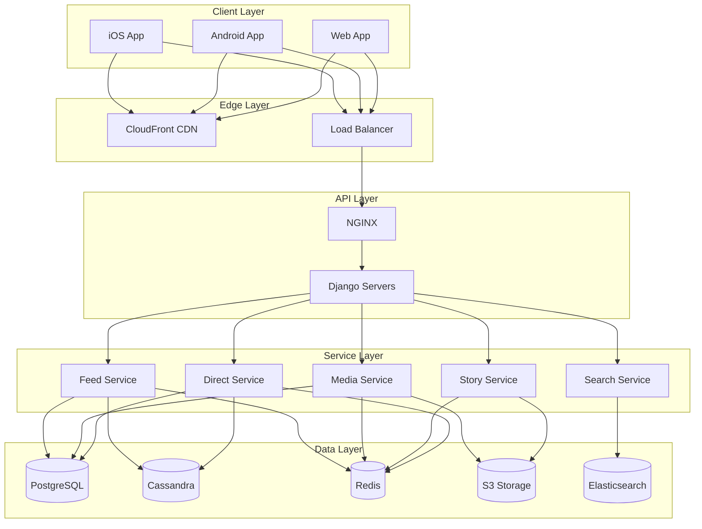
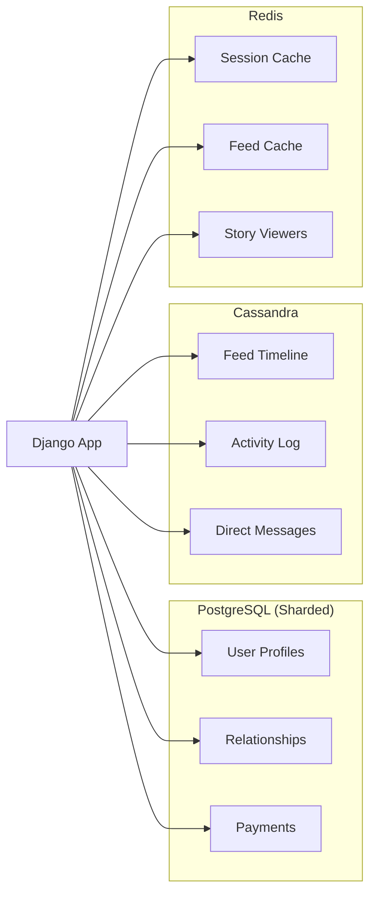
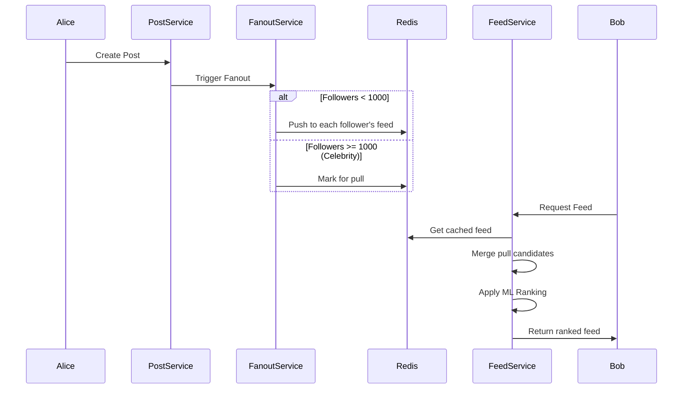
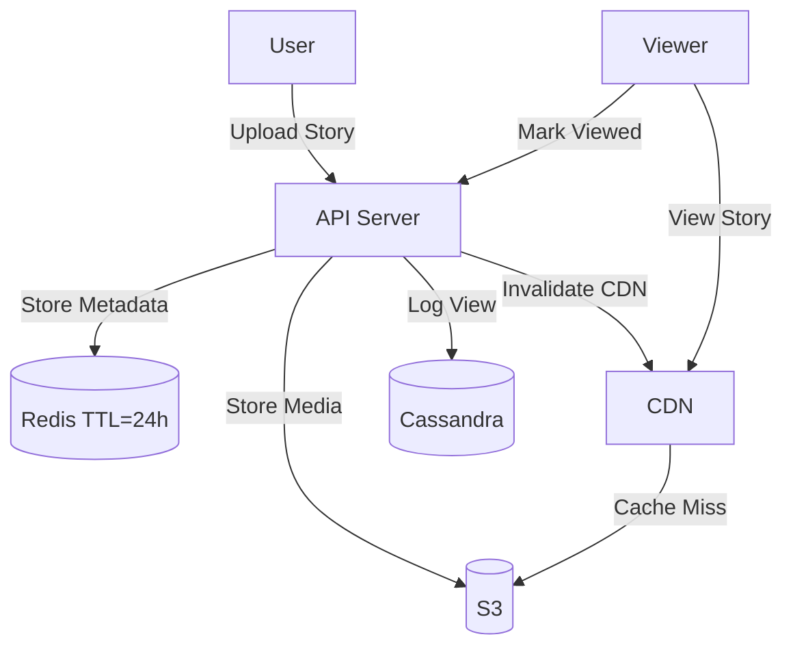

[🏠 Home](../../../../README.md) | [⬅️ 20 Facebook](../20-facebook/01-system-design-interview.md) | [➡️ Architecture Deep Dive](./02-architecture-deep-dive.md)

# 📸 System Design: Instagram

> Design a photo/video sharing platform serving 2+ billion users with Feed, Stories, Reels, and Direct Messaging.

---

## 📊 Quick Reference Card

| Aspect | Decision | Why |
|--------|----------|-----|
| **Backend** | Django (Python) | Rapid development, maintained since launch |
| **Primary DB** | PostgreSQL (sharded) | Strong consistency for user data, relationships |
| **Feed/Activity** | Cassandra (Rocksandra) | High write throughput, eventual consistency |
| **Cache** | Redis + Memcache | Sorted sets for timelines, key-value for sessions |
| **Storage** | S3 + CDN | Cost-effective blob storage, global delivery |
| **ML** | PyTorch | Feed ranking, Explore, content moderation |

---

## 🎯 Technology Decision Matrix

| Component | Choice | Why This | Why Not Alternatives |
|-----------|--------|----------|----------------------|
| **Framework** | Django | Team expertise, proven scalable, excellent ORM | Go/Rust faster but rewrite cost prohibitive |
| **User DB** | PostgreSQL | ACID for profiles, payments, auth | Cassandra lacks transactions for critical data |
| **Activity Log** | Cassandra | 100K+ writes/sec, time-series optimized | PostgreSQL write bottleneck at scale |
| **Feed Cache** | Redis | Sorted sets perfect for timeline ordering | Memcache lacks data structures |
| **Media** | S3 + CloudFront | Cost-effective, infinite scale, global CDN | Self-hosted storage has ops overhead |
| **Search** | Elasticsearch | Full-text search for usernames, hashtags | PostgreSQL LIKE queries don't scale |

---

## 📋 Table of Contents

1. [Functional Requirements](#-functional-requirements)
2. [Scale Estimation](#-scale-estimation)
3. [High-Level Architecture](#-high-level-architecture)
4. [Component Deep Dives](#-component-deep-dives)
5. [Data Modeling](#-data-modeling)
6. [Interview Questions](#-interview-questions)

---

## ✅ Functional Requirements

| Feature | Description | Priority |
|---------|-------------|----------|
| **Feed** | Personalized stream of posts from followed accounts | P0 |
| **Stories** | Ephemeral 24h content with viewers list | P0 |
| **Post** | Upload photos/videos with captions, hashtags, tags | P0 |
| **Direct** | Real-time 1:1 and group messaging | P0 |
| **Explore** | Discover new content based on interests | P1 |
| **Reels** | Short-form video with audio | P1 |
| **Search** | Find users, hashtags, locations | P1 |

---

## 📐 Scale Estimation

```
┌─────────────────────────────────────────────────────────┐
│                 INSTAGRAM SCALE (2024)                  │
├─────────────────────────────────────────────────────────┤
│  Monthly Active Users:     2.0 Billion                  │
│  Daily Active Users:       500 Million                  │
│  Photos Uploaded/Day:      ~100 Million                 │
│  Stories/Day:              500+ Million                 │
│  Peak Requests/Sec:        1+ Million                   │
├─────────────────────────────────────────────────────────┤
│  STORAGE ESTIMATES                                      │
│  ─────────────────                                      │
│  Photos (lifetime):        100M × 365 × 10 × 2MB = 700PB│
│  Videos (Reels):           Exabytes                     │
│  User Profiles:            2B × 1KB = 2TB               │
│  Activity Logs:            Petabytes/year               │
└─────────────────────────────────────────────────────────┘
```

---

## 🏛️ High-Level Architecture



---

## 🔍 Component Deep Dives

### 1. Django at Scale

Instagram is the largest Django deployment in the world.

**Optimizations Made:**
- Replaced default ORM with custom solution for batching
- Use Cython for hot paths
- Long-running Django processes (avoid restart overhead)
- Moved CPU-intensive work to async workers (Celery)

**Architecture Pattern:**
```
Request → NGINX → uWSGI → Django → Services → DB
                    ↓
              Async Tasks → Celery → Redis Queue
```

---

### 2. Database Strategy



**PostgreSQL Sharding:**
- **Shard Key**: `user_id`
- **Shards**: 10,000+ logical shards
- **Strategy**: Consistent hashing to physical servers
- **Replication**: 1 leader + 2 followers per shard

**Rocksandra (Custom Cassandra):**
Instagram replaced Cassandra's storage engine with RocksDB for better read performance.

| Before (Default) | After (Rocksandra) |
|------------------|-------------------|
| Slow reads | 3-5x faster reads |
| High GC pauses | Reduced GC |
| Large disk usage | Better compression |

---

### 3. Feed Generation

**Hybrid Push-Pull Model:**



**Feed Cache (Redis Sorted Set):**
```redis
# Feed for user:123
ZADD feed:123 1699999999 post:456
ZADD feed:123 1699999998 post:789

# Get latest 20 posts
ZREVRANGE feed:123 0 19 WITHSCORES
```

---

### 4. Stories Architecture

**Key Design Decisions:**
- **TTL**: 24 hours (stored in Redis with expiry)
- **Viewers List**: Append-only log in Cassandra
- **Media**: S3 with pre-signed URLs for upload



---

### 5. Media Pipeline

**Upload Flow:**
1. Client requests pre-signed S3 URL
2. Client uploads directly to S3
3. S3 triggers Lambda for processing
4. Lambda transcodes to multiple resolutions
5. Lambda updates metadata in PostgreSQL
6. CDN edge caches media

**Resolutions Generated:**
| Size | Use Case |
|------|----------|
| 150x150 | Thumbnail |
| 320x320 | Feed preview |
| 640x640 | Feed full |
| 1080x1080 | Detail view |

---

## 📝 Data Modeling

### PostgreSQL Schema (Core)

```sql
-- Users (sharded by user_id)
CREATE TABLE users (
    user_id     BIGSERIAL PRIMARY KEY,
    username    VARCHAR(30) UNIQUE,
    email       VARCHAR(255) UNIQUE,
    bio         TEXT,
    created_at  TIMESTAMP DEFAULT NOW()
);

-- Relationships (sharded by follower_id)
CREATE TABLE relationships (
    follower_id   BIGINT,
    following_id  BIGINT,
    created_at    TIMESTAMP DEFAULT NOW(),
    PRIMARY KEY (follower_id, following_id)
);

-- Posts (sharded by author_id)
CREATE TABLE posts (
    post_id     BIGSERIAL PRIMARY KEY,
    author_id   BIGINT NOT NULL,
    media_url   VARCHAR(500),
    caption     TEXT,
    created_at  TIMESTAMP DEFAULT NOW()
);
```

### Cassandra Schema (Activity)

```cql
-- Feed timeline (partition per user, ordered by time)
CREATE TABLE feed_timeline (
    user_id    BIGINT,
    post_id    BIGINT,
    author_id  BIGINT,
    created_at TIMESTAMP,
    PRIMARY KEY (user_id, created_at, post_id)
) WITH CLUSTERING ORDER BY (created_at DESC);

-- Story viewers (partition per story)
CREATE TABLE story_viewers (
    story_id   UUID,
    viewer_id  BIGINT,
    viewed_at  TIMESTAMP,
    PRIMARY KEY (story_id, viewed_at, viewer_id)
) WITH CLUSTERING ORDER BY (viewed_at DESC);
```

---

## 🧠 Interview Questions

### 1. How would you design Instagram Stories?

**Answer:**
```
Storage Strategy:
├── Media → S3 with 24h lifecycle policy
├── Metadata → Redis with TTL=24h
├── Viewers → Cassandra (append-only log)
└── Sequence → Redis Sorted Set per user

Key Decisions:
1. Direct S3 upload (pre-signed URLs) to offload API
2. CDN with TTL matching story expiry
3. Separate viewers storage for fast appends
4. Redis TTL handles auto-deletion
```

### 2. Pull vs Push: Which for Instagram Feed?

**Answer:**
- **Small accounts (< 1000 followers)**: Push (fanout on write)
  - Fast read, bounded write amplification
- **Large accounts (celebrities)**: Pull (fanout on read)
  - Avoid 100M push operations per post
- **Hybrid**: Push to active users, pull includes pull candidates

### 3. Why PostgreSQL + Cassandra (not just one)?

**Answer:**
| Requirement | PostgreSQL | Cassandra |
|-------------|------------|-----------|
| User profiles | ✅ ACID transactions | ❌ No transactions |
| Payments | ✅ Strong consistency | ❌ Eventual |
| Feed writes | ❌ Single-leader bottleneck | ✅ Multi-leader |
| Activity logs | ❌ Expensive at scale | ✅ High write throughput |

---

## 📚 Further Reading

- [Architecture Deep Dive](./02-architecture-deep-dive.md)
- [Instagram Engineering Blog](https://instagram-engineering.com/)
- [Scaling Django at Instagram](https://www.youtube.com/watch?v=lx5WQjXLlq8)

---
