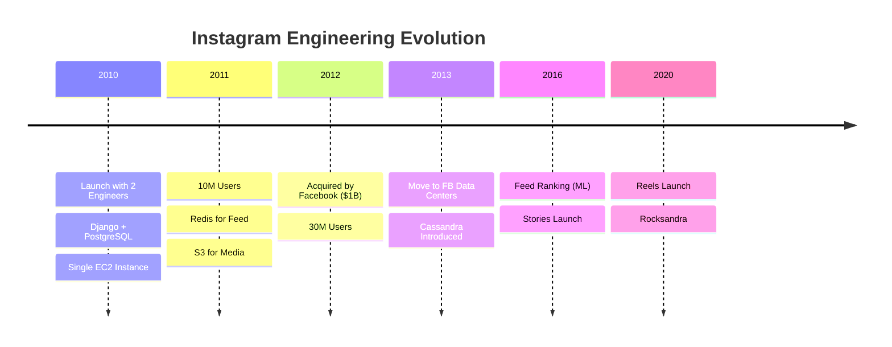
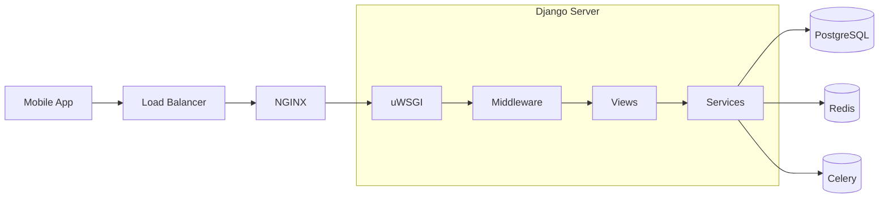
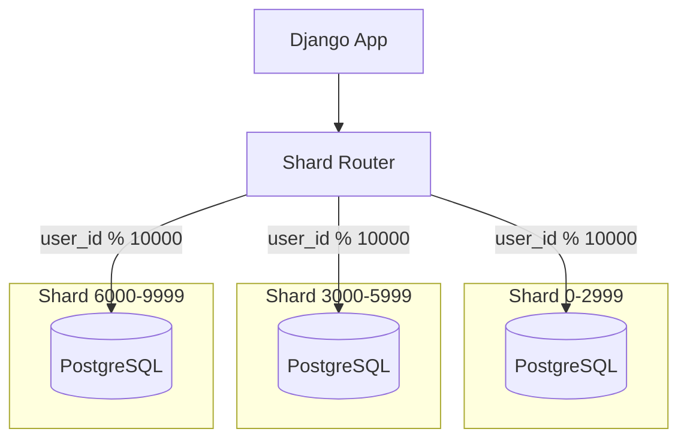
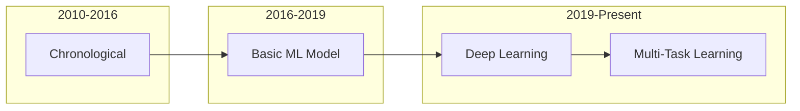
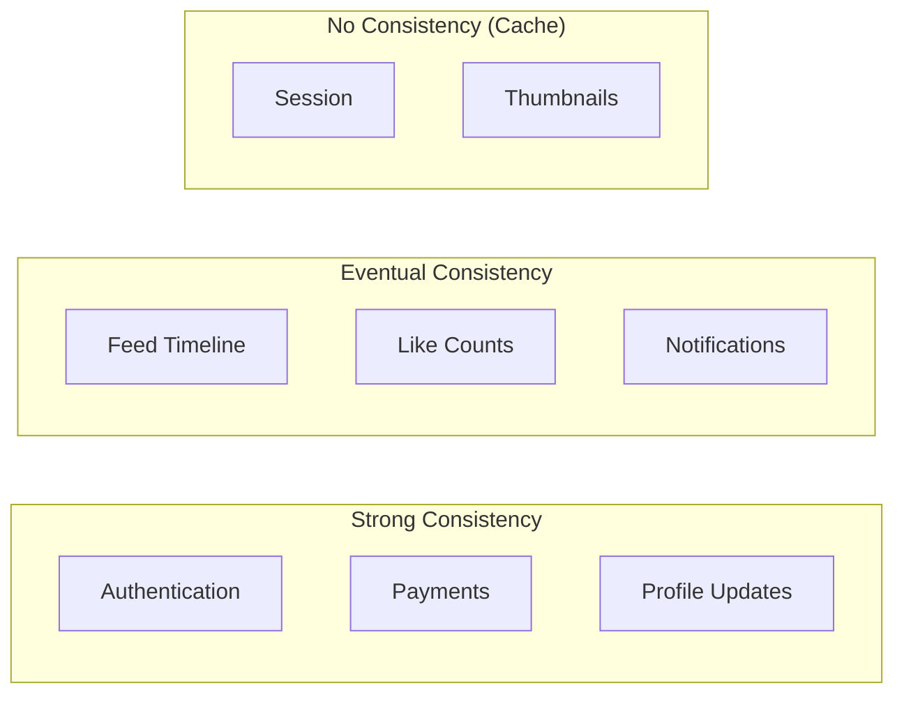

[🏠 Home](../../../../README.md) | [⬅️ Interview Guide](./01-system-design-interview.md)

# 🏗️ Instagram Architecture Deep Dive

> From 2-person startup to Meta's most profitable product.

---

## 📋 Table of Contents

1. [The Origin Story](#-the-origin-story)
2. [Django at Scale](#-django-at-scale)
3. [Database Evolution](#-database-evolution)
4. [Feed Ranking ML](#-feed-ranking-ml)
5. [Migration to Meta Infrastructure](#-migration-to-meta-infrastructure)
6. [Design Considerations](#-design-considerations)

---

## 🚀 The Origin Story

### Timeline



### Key Architectural Decisions

| Year | Decision | Why |
|------|----------|-----|
| 2010 | Django | Team knew Python, fast to build |
| 2010 | PostgreSQL | Reliable, ACID, good Python support |
| 2011 | Redis for Feed | Sorted sets perfect for timeline |
| 2012 | S3 for Media | Infinite scale, no ops |
| 2013 | FB Migration | Scale, reliability, shared infra |
| 2016 | ML Ranking | Chronological couldn't scale |

---

## 🐍 Django at Scale

### Why Django Still Works

```
"We have the largest Django deployment in the world."
                    — Instagram Engineering (2017)
```

**Challenges Solved:**
| Problem | Solution |
|---------|----------|
| Default ORM too slow | Custom batching, no lazy loading |
| GIL limits concurrency | Multiple uWSGI workers per server |
| Memory bloat | Long-running processes, careful caching |
| CPU-intensive work | Offload to Celery workers |

### Request Flow



### Cython Hot Paths

```python
# Before (Pure Python)
def heavy_computation(data):
    result = []
    for item in data:
        result.append(process(item))
    return result

# After (Cython) - 10x faster
cpdef list heavy_computation(list data):
    cdef list result = []
    cdef object item
    for item in data:
        result.append(process(item))
    return result
```

---

## 🗄️ Database Evolution

### PostgreSQL: The Foundation

**Sharding Strategy:**



**Schema Evolution Challenges:**
| Challenge | Solution |
|-----------|----------|
| Adding columns | Online DDL with pt-online-schema-change |
| Index creation | CREATE INDEX CONCURRENTLY |
| Data migrations | Background jobs, not transactions |
| Cross-shard queries | Avoid! Use application-level joins |

### Cassandra: High-Write Workloads

**Use Cases:**
- Feed timelines (millions of writes/sec)
- Activity notifications
- Direct messages
- Story viewers list

**Rocksandra Innovation:**

```
Default Cassandra:
├── Memtable (Memory)
├── SSTable (Disk)
└── Compaction → Read Amplification

Rocksandra:
├── RocksDB Engine
├── Better Compression
├── LSM Tree Optimized
└── 3-5x Faster Reads
```

### Redis: The Speed Layer

| Use Case | Data Structure | TTL |
|----------|----------------|-----|
| Session | String | 30 days |
| Feed Cache | Sorted Set | 7 days |
| Story Metadata | Hash | 24 hours |
| Rate Limiting | String (INCR) | 1 hour |
| Followers Count | String | No expiry |

---

## 🤖 Feed Ranking ML

### Evolution from Chronological



### Ranking Features

| Category | Features | Impact |
|----------|----------|--------|
| **User-Author** | Past likes, comments, DM history | High |
| **Content** | Photo vs Video, hashtags, caption | Medium |
| **Engagement** | Like count, velocity, comment ratio | High |
| **Recency** | Post age, time decay | Medium |
| **Context** | Time of day, device, session length | Low |

### Model Architecture

```
Input Features (1000+)
       ↓
Embedding Layers
       ↓
Deep Neural Network
       ↓
Multi-Task Heads
├── P(Like)
├── P(Comment)
├── P(Save)
├── P(Share)
└── P(Session Time)
       ↓
Weighted Score
       ↓
Ranked Feed
```

### A/B Testing Infrastructure

| Metric | Target |
|--------|--------|
| Session Time | +2% |
| Content Produced | +1% |
| DAU | Neutral or + |
| Integrity | No regression |

---

## 🔄 Migration to Meta Infrastructure

### Before (AWS)

```
EC2 Instances → PostgreSQL RDS → S3 Storage
     ↓
Redis ElastiCache
     ↓
CloudFront CDN
```

### After (Meta Data Centers)

```
Meta Servers → PostgreSQL (sharded) + Cassandra
     ↓
Memcache + Redis
     ↓
Meta CDN + fb.com Shared Services
```

### Benefits of Migration

| Aspect | AWS | Meta Infra |
|--------|-----|------------|
| Cost | High (on-demand) | Lower (owned) |
| Scale | Limited by AWS | Nearly unlimited |
| Reliability | AWS SLA | Meta SRE team |
| Shared Services | None | Auth, Spam, ML |
| Latency | Variable | Optimized |

### Shared Meta Services Used

| Service | Purpose |
|---------|---------|
| **TAO** | Graph queries (followers, following) |
| **Memcache** | Caching layer |
| **Async** | Background job processing |
| **Integrity** | Spam/abuse detection |
| **ML Platform** | Model training and serving |

---

## ⚖️ Design Considerations

### Database Selection Matrix

| Data Type | Database | Consistency | Why |
|-----------|----------|-------------|-----|
| User Profiles | PostgreSQL | Strong | ACID for critical data |
| Relationships | PostgreSQL | Strong | Transactional follows |
| Posts Metadata | PostgreSQL | Strong | Canonical source |
| Feed Timeline | Cassandra | Eventual | High write throughput |
| Activity Log | Cassandra | Eventual | Append-only |
| Session Cache | Redis | N/A | Ephemeral |
| Media Files | S3 | Strong | Infinite scale |

### Consistency Tradeoffs



### CAP Theorem by Feature

| Feature | Choice | Rationale |
|---------|--------|-----------|
| Auth | CP | Security critical |
| Feed | AP | Must be available |
| Stories | AP | 24h TTL, availability > consistency |
| DMs | AP + Ordering | Must be available, ordering critical |
| Explore | AP | Recommendations can be stale |

---

## 📊 Key Metrics

| Metric | Value (2024) |
|--------|--------------|
| Daily Storage Growth | ~1 PB |
| API Requests/sec | 1M+ |
| ML Model Inference/sec | 100K+ |
| Feed Latency p99 | < 200ms |
| Upload Success Rate | 99.9%+ |

---

## 📚 References

- [Instagram Engineering Blog](https://instagram-engineering.com/)
- [Scaling Django at Instagram (PyCon 2017)](https://www.youtube.com/watch?v=lx5WQjXLlq8)
- [Under the Hood: Instagram (Meta Engineering)](https://engineering.fb.com/)
- [Rocksandra: RocksDB + Cassandra](https://instagram-engineering.com/open-sourcing-a-10x-reduction-in-apache-cassandra-tail-latency-d64f86b43589)

---
