# Swiggy/Zomato System Design - Complete Architecture Guide

> A comprehensive deep-dive into Food Delivery Platform architecture (Swiggy/Zomato/DoorDash/UberEats), covering order management, real-time tracking, restaurant matching, delivery assignment, and scalability patterns.

---

## Table of Contents

1. [Overview](#overview)
2. [Core Features & Requirements](#core-features--requirements)
3. [High-Level Architecture](#high-level-architecture)
4. [Core System Components](#core-system-components)
5. [Order Management System](#order-management-system)
6. [Restaurant Discovery & Search](#restaurant-discovery--search)
7. [Delivery Partner Assignment](#delivery-partner-assignment)
8. [Real-Time Tracking System](#real-time-tracking-system)
9. [ETA Estimation Engine](#eta-estimation-engine)
10. [Payment & Wallet System](#payment--wallet-system)
11. [Notification System](#notification-system)
12. [Rating & Review System](#rating--review-system)
13. [Data Infrastructure](#data-infrastructure)
14. [Caching Strategy](#caching-strategy)
15. [Technology Stack](#technology-stack)
16. [Key Design Patterns](#key-design-patterns)
17. [Interview Talking Points](#interview-talking-points)
18. [References](#references)

---

## Overview

Food delivery platforms like Swiggy/Zomato operate at massive scale in India, processing millions of orders daily across hundreds of cities.

### Scale Numbers (Approximate)

| Metric | Swiggy | Zomato |
|--------|--------|--------|
| Cities | 500+ | 1000+ |
| Restaurant Partners | 100K+ | 150K+ |
| Delivery Partners | 200K+ | 300K+ |
| Monthly Orders | 50M+ | 60M+ |
| Peak Orders/Second | 10K+ | 15K+ |
| Average Delivery Time | 30-35 mins | 30-35 mins |

### Key Challenges

| Challenge | Description |
|-----------|-------------|
| **Real-time Matching** | Match orders to optimal delivery partners instantly |
| **Geo-distribution** | Handle varying demand across cities and localities |
| **Latency** | Sub-second response for search, order placement |
| **Reliability** | 99.9%+ uptime during peak hours (lunch/dinner) |
| **Personalization** | Restaurant recommendations based on user preferences |
| **Dynamic Pricing** | Surge pricing during high demand periods |

---

## Core Features & Requirements

### Functional Requirements

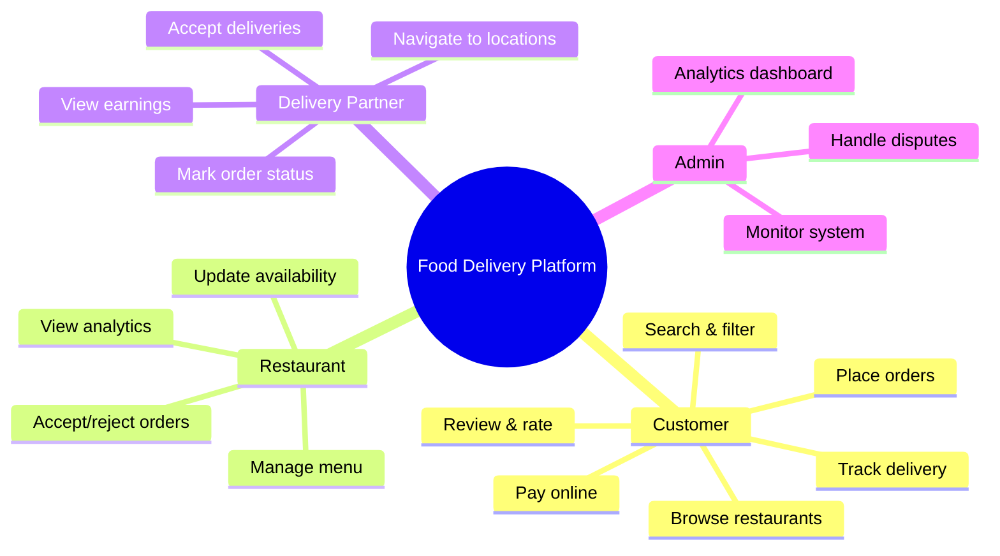

### Non-Functional Requirements

| Requirement | Target |
|------------|--------|
| **Availability** | 99.9% uptime |
| **Latency** | < 200ms for API responses |
| **Scalability** | Handle 10x traffic during peak |
| **Consistency** | Strong for orders/payments, eventual for reviews |
| **Durability** | Zero order data loss |

---

## High-Level Architecture

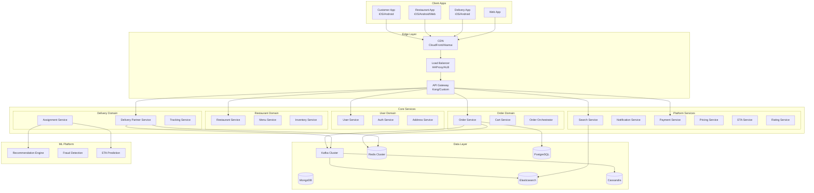

---

## Core System Components

### Service Breakdown

| Service | Responsibility | Database |
|---------|---------------|----------|
| **User Service** | User profiles, preferences, authentication | PostgreSQL |
| **Restaurant Service** | Restaurant details, operating hours, cuisines | PostgreSQL + Redis |
| **Menu Service** | Menu items, prices, availability, customizations | PostgreSQL + Redis |
| **Cart Service** | Active shopping carts, item management | Redis |
| **Order Service** | Order lifecycle management | PostgreSQL + Kafka |
| **Order Orchestrator** | Saga pattern coordinator | PostgreSQL |
| **Delivery Partner Service** | Partner profiles, availability, ratings | PostgreSQL + Redis |
| **Assignment Service** | Order-to-partner matching algorithm | Redis + ML |
| **Tracking Service** | Real-time location updates | Redis + Cassandra |
| **Search Service** | Restaurant/dish search | Elasticsearch |
| **Payment Service** | Payment processing, wallet, refunds | PostgreSQL |
| **Notification Service** | Push, SMS, Email notifications | Kafka + SNS |
| **ETA Service** | Delivery time prediction | ML Models + Redis |
| **Rating Service** | Reviews and ratings | PostgreSQL + Cassandra |

---

## Order Management System

### Order State Machine

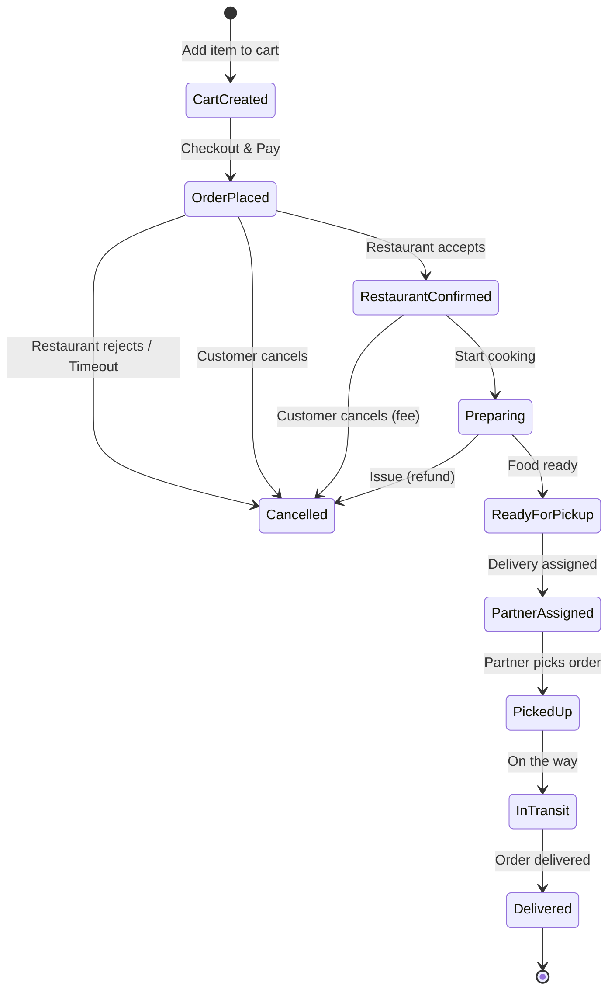

### Order Flow Sequence

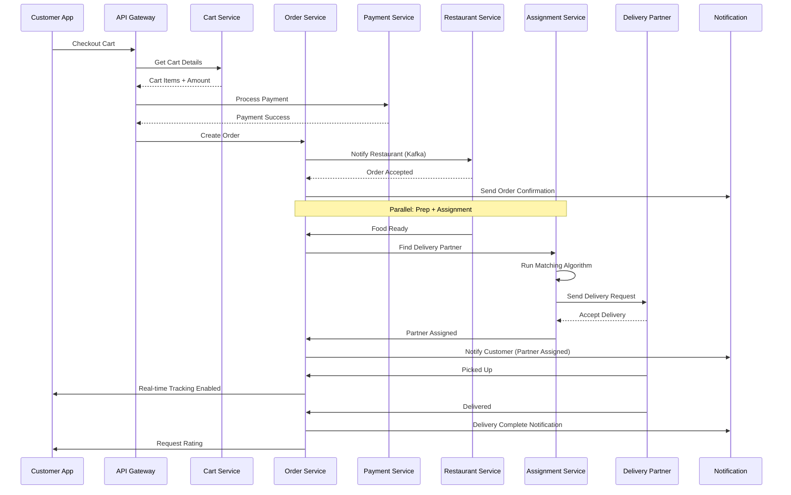

### Order Data Model

```sql
-- Orders Table (PostgreSQL)
CREATE TABLE orders (
    id UUID PRIMARY KEY,
    customer_id UUID NOT NULL,
    restaurant_id UUID NOT NULL,
    delivery_partner_id UUID,
    status VARCHAR(50) NOT NULL,
    
    -- Addresses (snapshot at order time)
    delivery_address JSONB NOT NULL,
    restaurant_address JSONB NOT NULL,
    
    -- Pricing
    item_total DECIMAL(10,2),
    delivery_fee DECIMAL(10,2),
    taxes DECIMAL(10,2),
    discount DECIMAL(10,2),
    total_amount DECIMAL(10,2),
    
    -- Timestamps
    placed_at TIMESTAMP,
    confirmed_at TIMESTAMP,
    prepared_at TIMESTAMP,
    picked_up_at TIMESTAMP,
    delivered_at TIMESTAMP,
    
    -- ETA tracking
    estimated_prep_time INTEGER, -- minutes
    estimated_delivery_time INTEGER,
    actual_delivery_time INTEGER,
    
    created_at TIMESTAMP DEFAULT NOW(),
    updated_at TIMESTAMP DEFAULT NOW()
);

-- Order Items Table
CREATE TABLE order_items (
    id UUID PRIMARY KEY,
    order_id UUID REFERENCES orders(id),
    menu_item_id UUID NOT NULL,
    name VARCHAR(200),
    quantity INTEGER,
    unit_price DECIMAL(10,2),
    customizations JSONB,
    special_instructions TEXT
);
```

### Order Saga Pattern

For distributed transactions across services:

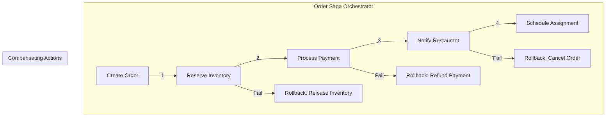

---

## Restaurant Discovery & Search

### Search Architecture

```mermaid
graph TD
    subgraph "User Request"
        Q[Search: "biryani near me"]
    end
    
    subgraph "Search Pipeline"
        QP[Query Parser]
        GEO[Geo Filter]
        ES[Elasticsearch]
        RANK[Ranking Service]
        PERS[Personalization]
    end
    
    subgraph "Data Sources"
        REST[(Restaurant Index)]
        MENU[(Menu Index)]
        USER[(User Preferences)]
        REAL[(Real-time Signals)]
    end
    
    Q --> QP
    QP --> GEO
    GEO --> ES
    ES --> REST & MENU
    ES --> RANK
    USER --> PERS
    REAL --> RANK
    RANK --> PERS
    PERS --> |Results| Q
```

### Elasticsearch Index Design

```json
// Restaurant Index
{
  "settings": {
    "number_of_shards": 5,
    "number_of_replicas": 2
  },
  "mappings": {
    "properties": {
      "id": { "type": "keyword" },
      "name": { 
        "type": "text",
        "analyzer": "autocomplete",
        "fields": {
          "keyword": { "type": "keyword" }
        }
      },
      "cuisines": { "type": "keyword" },
      "location": { "type": "geo_point" },
      "city": { "type": "keyword" },
      "locality": { "type": "keyword" },
      "rating": { "type": "float" },
      "price_range": { "type": "integer" },
      "delivery_time": { "type": "integer" },
      "is_open": { "type": "boolean" },
      "is_promoted": { "type": "boolean" },
      "avg_order_value": { "type": "float" },
      "tags": { "type": "keyword" },
      "menu_items": {
        "type": "nested",
        "properties": {
          "name": { "type": "text" },
          "category": { "type": "keyword" },
          "is_veg": { "type": "boolean" },
          "price": { "type": "float" }
        }
      }
    }
  }
}
```

### Search Ranking Factors

| Factor | Weight | Description |
|--------|--------|-------------|
| **Relevance** | 30% | Text match with query |
| **Distance** | 25% | Proximity to user location |
| **Rating** | 15% | Customer ratings (weighted recency) |
| **Delivery Time** | 15% | Expected delivery duration |
| **Personalization** | 10% | User's past orders, preferences |
| **Promotions** | 5% | Featured/promoted restaurants |

### Location-Based Search

```python
# Elasticsearch Geo Query
search_query = {
    "bool": {
        "must": [
            {"match": {"name": "biryani"}},
            {"term": {"is_open": True}}
        ],
        "filter": [
            {
                "geo_distance": {
                    "distance": "5km",
                    "location": {
                        "lat": 12.9716,
                        "lon": 77.5946
                    }
                }
            }
        ]
    }
}

# With scoring based on distance
function_score_query = {
    "function_score": {
        "query": search_query,
        "functions": [
            {
                "gauss": {
                    "location": {
                        "origin": {"lat": 12.9716, "lon": 77.5946},
                        "scale": "3km",
                        "decay": 0.5
                    }
                }
            },
            {
                "field_value_factor": {
                    "field": "rating",
                    "modifier": "sqrt",
                    "factor": 1.2
                }
            }
        ],
        "score_mode": "multiply"
    }
}
```

---

## Delivery Partner Assignment

### Assignment System Architecture

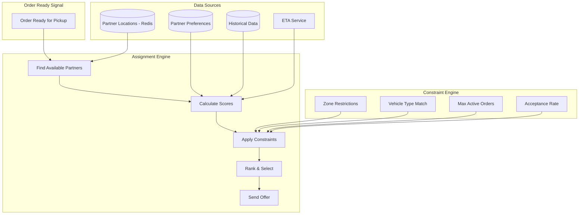

### Assignment Algorithm

```python
def find_best_delivery_partner(order):
    """
    Multi-factor delivery partner scoring algorithm
    """
    # 1. Get nearby available partners (Redis GeoSearch)
    nearby_partners = redis.geosearch(
        key="active_partners",
        longitude=order.restaurant_location.lng,
        latitude=order.restaurant_location.lat,
        radius=5,  # km
        unit="km"
    )
    
    # 2. Filter by constraints
    eligible_partners = []
    for partner in nearby_partners:
        if (partner.active_orders < MAX_CONCURRENT_ORDERS and
            partner.vehicle_type in order.allowed_vehicles and
            partner.zone_allowed(order.delivery_zone)):
            eligible_partners.append(partner)
    
    # 3. Score each partner
    scored_partners = []
    for partner in eligible_partners:
        score = calculate_partner_score(partner, order)
        scored_partners.append((partner, score))
    
    # 4. Sort by score (higher is better)
    scored_partners.sort(key=lambda x: x[1], reverse=True)
    
    # 5. Return top partner (or batch broadcast)
    return scored_partners[0] if scored_partners else None

def calculate_partner_score(partner, order):
    """
    Multi-factor scoring for partner selection
    """
    # Distance to restaurant (closer = better)
    pickup_distance = calculate_distance(
        partner.current_location, 
        order.restaurant_location
    )
    distance_score = max(0, 100 - pickup_distance * 10)  # 0-100
    
    # ETA to restaurant
    eta_score = max(0, 100 - partner.eta_to_restaurant * 5)
    
    # Partner rating
    rating_score = partner.rating * 20  # 0-100
    
    # Acceptance rate (historical)
    acceptance_score = partner.acceptance_rate * 100
    
    # Heading direction (bonus if moving towards restaurant)
    heading_bonus = 10 if is_heading_towards(partner, order) else 0
    
    # Recent rejections penalty
    rejection_penalty = partner.recent_rejections * 5
    
    # Weighted final score
    final_score = (
        distance_score * 0.35 +
        eta_score * 0.25 +
        rating_score * 0.20 +
        acceptance_score * 0.15 +
        heading_bonus -
        rejection_penalty
    )
    
    return final_score
```

### Partner Location Tracking (Redis)

```python
# Store partner location with GeoAdd
redis.geoadd(
    "active_partners",
    longitude=77.5946,
    latitude=12.9716,
    member=f"partner:{partner_id}"
)

# Store partner metadata
redis.hset(f"partner:{partner_id}", mapping={
    "status": "available",
    "active_orders": 1,
    "vehicle_type": "bike",
    "zone": "koramangala",
    "last_updated": timestamp,
    "heading": 45  # degrees
})

# Find partners in radius
partners = redis.geosearch(
    "active_partners",
    longitude=77.5946,
    latitude=12.9716,
    radius=3,
    unit="km",
    withcoord=True,
    withdist=True
)
```

### Assignment Strategies

| Strategy | Description | Use Case |
|----------|-------------|----------|
| **Single Offer** | Send to best-matched partner | Normal conditions |
| **Broadcast** | Offer to multiple partners (first accept wins) | High demand, urgent |
| **Batching** | Combine multiple orders for same area | Multi-pickup optimization |
| **Pre-assignment** | Assign before food is ready | Long prep time restaurants |

---

## Real-Time Tracking System

### Tracking Architecture

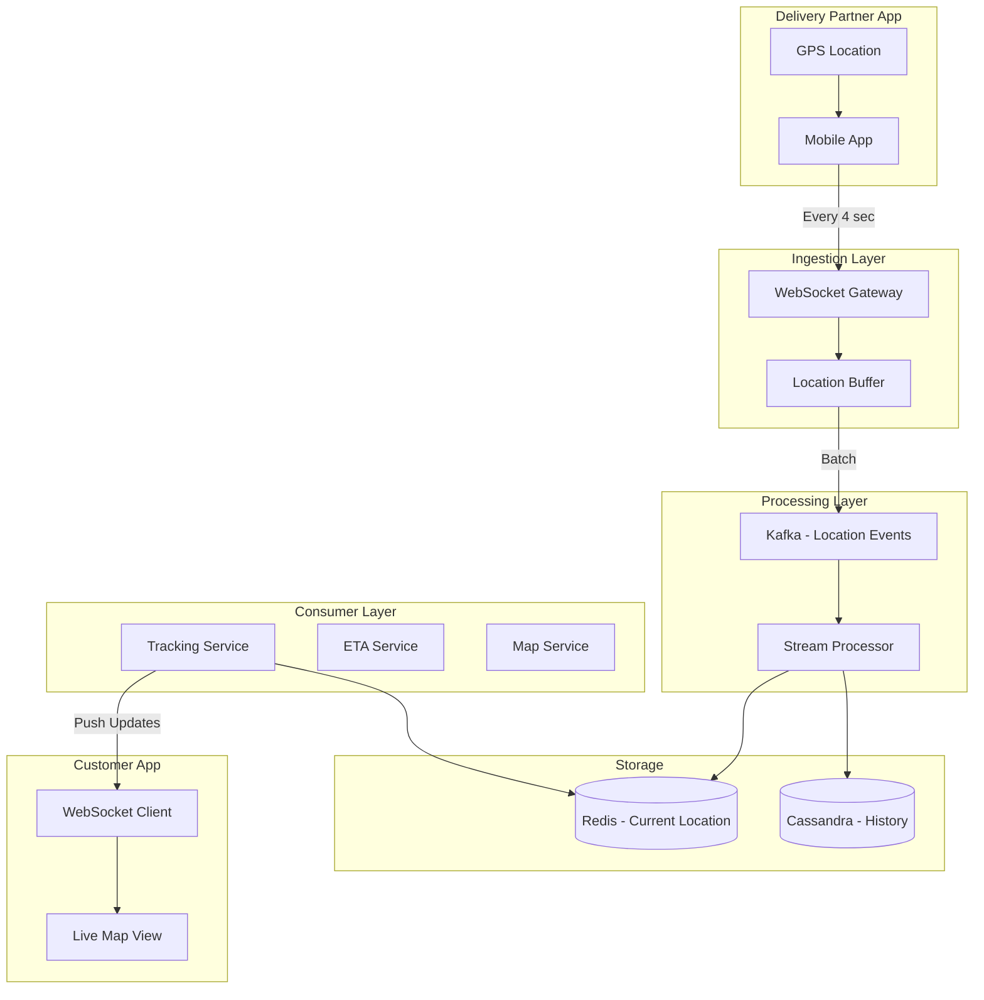

### Location Update Flow

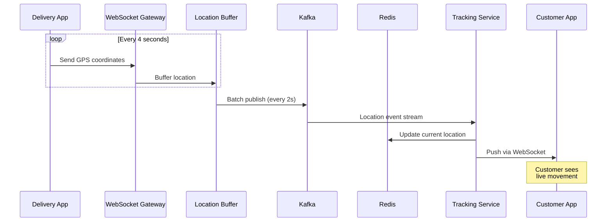

### Location Storage

```python
# Redis: Current location (frequently updated)
redis.geoadd("partner_locations", lng, lat, f"partner:{id}")
redis.hset(f"partner:{id}:tracking", {
    "lat": lat,
    "lng": lng,
    "heading": heading,
    "speed": speed,
    "timestamp": timestamp,
    "order_id": order_id
})
redis.expire(f"partner:{id}:tracking", 3600)  # 1 hour TTL

# Cassandra: Location history (write-optimized)
INSERT INTO location_history (
    partner_id, order_id, timestamp, lat, lng, heading, speed
) VALUES (?, ?, ?, ?, ?, ?, ?)
USING TTL 604800;  -- 7 days retention
```

### Customer Tracking Experience

| Stage | Update Frequency | Information Shown |
|-------|-----------------|-------------------|
| Order Placed | Event-based | Order confirmation, restaurant prep |
| Preparing | Every 30s | Kitchen status updates |
| Partner Assigned | Event-based | Partner name, photo, vehicle |
| Picked Up | Every 3-5s | Live map, ETA countdown |
| Near Delivery | Every 1-2s | Close-up map, arrival notification |

---

## ETA Estimation Engine

### ETA Components

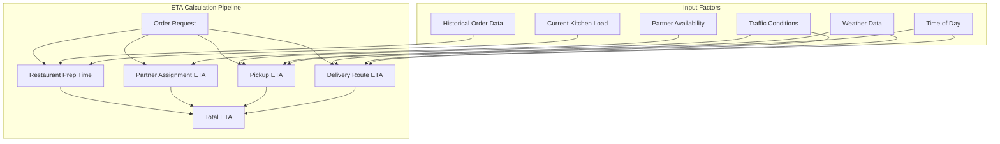

### ETA Types

| ETA Type | Description | Calculated When |
|----------|-------------|-----------------|
| **Display ETA** | Shown on restaurant listing | Pre-order (estimation) |
| **Checkout ETA** | Committed ETA before payment | Checkout screen |
| **Live ETA** | Real-time updated ETA | During delivery |
| **Arrival ETA** | Final countdown | Partner nearby |

### ETA Prediction Model

```python
def calculate_total_eta(order):
    """
    Multi-component ETA calculation
    """
    # 1. Restaurant preparation time
    prep_time = predict_prep_time(
        restaurant_id=order.restaurant_id,
        items=order.items,
        current_queue=get_restaurant_queue(order.restaurant_id),
        time_of_day=current_time(),
        day_of_week=current_day()
    )
    
    # 2. Partner assignment time (if not yet assigned)
    assignment_time = predict_assignment_time(
        restaurant_location=order.restaurant_location,
        partner_density=get_nearby_partner_count(),
        current_demand=get_area_demand()
    )
    
    # 3. Pickup ETA (partner to restaurant)
    pickup_eta = predict_pickup_eta(
        partner_location=assigned_partner.location,
        restaurant_location=order.restaurant_location,
        traffic_factor=get_traffic_factor(),
        vehicle_type=assigned_partner.vehicle_type
    )
    
    # 4. Delivery ETA (restaurant to customer)
    delivery_eta = predict_delivery_eta(
        restaurant_location=order.restaurant_location,
        customer_location=order.delivery_address,
        traffic_factor=get_traffic_factor(),
        distance=calculate_route_distance()
    )
    
    # 5. Add buffer for uncertainty
    buffer = calculate_uncertainty_buffer(
        prep_confidence=prep_time.confidence,
        delivery_confidence=delivery_eta.confidence
    )
    
    total_eta = prep_time + max(assignment_time, 0) + pickup_eta + delivery_eta + buffer
    
    return {
        "total_minutes": total_eta,
        "prep_time": prep_time,
        "pickup_time": pickup_eta,
        "delivery_time": delivery_eta,
        "confidence": calculate_overall_confidence()
    }
```

### ML Features for ETA Prediction

| Feature Category | Features |
|------------------|----------|
| **Restaurant** | Cuisine type, avg prep time, current orders, kitchen capacity |
| **Time** | Hour, day of week, holiday, festival |
| **Location** | Distance, traffic zone, elevation changes |
| **Weather** | Rain, temperature, visibility |
| **Partner** | Vehicle type, rating, avg delivery time |
| **Order** | Item count, complexity, special instructions |

---

## Payment & Wallet System

### Payment Architecture

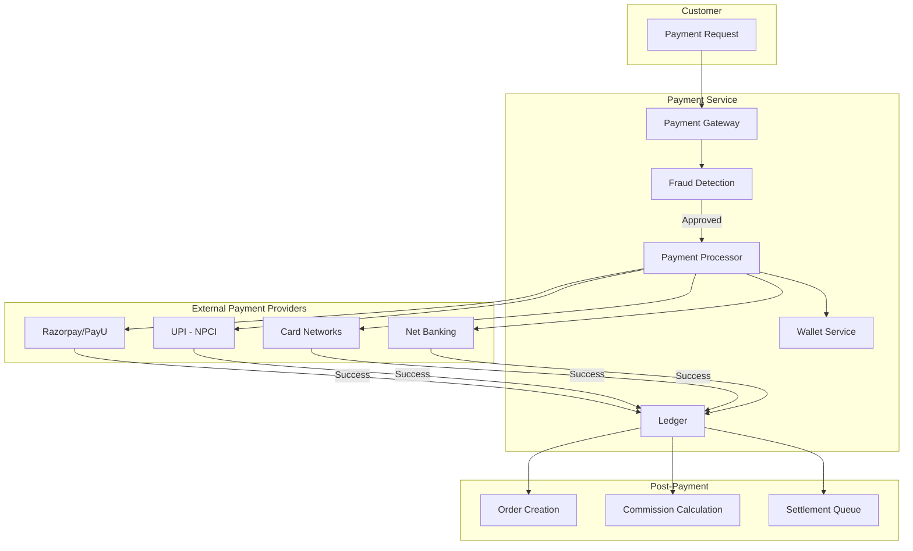

### Payment Methods

| Method | Flow | Settlement Time |
|--------|------|-----------------|
| **UPI** | Direct bank debit via VPA | Instant |
| **Cards** | PG → Card Network → Bank | T+2 days |
| **Net Banking** | PG → Bank redirect | T+1 day |
| **Wallet** | In-app wallet balance | Instant |
| **COD** | Cash collection by partner | Partner settlement |

### Wallet System

```sql
-- Wallet Balance Table
CREATE TABLE wallets (
    user_id UUID PRIMARY KEY,
    balance DECIMAL(10,2) DEFAULT 0,
    locked_balance DECIMAL(10,2) DEFAULT 0,
    updated_at TIMESTAMP
);

-- Wallet Transactions (Append-only ledger)
CREATE TABLE wallet_transactions (
    id UUID PRIMARY KEY,
    user_id UUID,
    type VARCHAR(50), -- CREDIT, DEBIT, LOCK, UNLOCK
    amount DECIMAL(10,2),
    reference_id UUID, -- order_id, refund_id
    reference_type VARCHAR(50),
    balance_after DECIMAL(10,2),
    created_at TIMESTAMP
);

-- Indexes
CREATE INDEX idx_wallet_txn_user ON wallet_transactions(user_id, created_at DESC);
```

### Commission & Settlement

```mermaid
graph LR
    subgraph "Order Total: ₹500"
        A[Item Value: ₹400]
        B[Delivery Fee: ₹40]
        C[Platform Fee: ₹10]
        D[Taxes: ₹50]
    end
    
    subgraph "Distribution"
        A -->|90%| E[Restaurant: ₹360]
        A -->|10%| F[Platform Commission: ₹40]
        B -->|75%| G[Delivery Partner: ₹30]
        B -->|25%| H[Platform: ₹10]
        C --> I[Platform: ₹10]
    end
```

---

## Notification System

### Notification Architecture

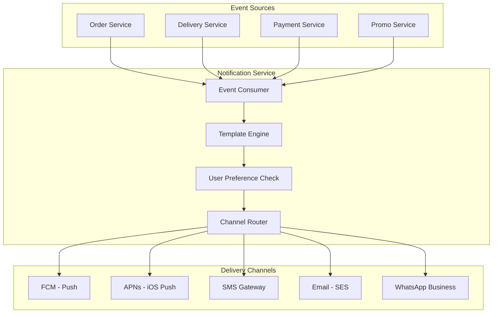

### Notification Types

| Event | Customer | Restaurant | Partner |
|-------|----------|------------|---------|
| Order Placed | ✅ Push + SMS | ✅ Push + Sound | - |
| Order Confirmed | ✅ Push | - | - |
| Partner Assigned | ✅ Push | - | ✅ Push + Sound |
| Picked Up | ✅ Push | - | - |
| Near Location | ✅ Push | - | - |
| Delivered | ✅ Push + Email | - | ✅ Push |
| Rating Request | ✅ Push (delayed) | - | - |

### Push Notification Payload

```json
{
  "notification": {
    "title": "Your order is on the way! 🛵",
    "body": "Raj is 5 mins away with your Biryani"
  },
  "data": {
    "type": "ORDER_UPDATE",
    "order_id": "ORD123456",
    "status": "IN_TRANSIT",
    "eta_minutes": 5,
    "partner_name": "Raj",
    "partner_phone": "+91XXXXXXXXXX",
    "action": "TRACK_ORDER"
  },
  "android": {
    "priority": "high",
    "notification": {
      "channel_id": "order_updates"
    }
  },
  "apns": {
    "headers": {
      "apns-priority": "10"
    }
  }
}
```

---

## Rating & Review System

### Rating Collection Flow

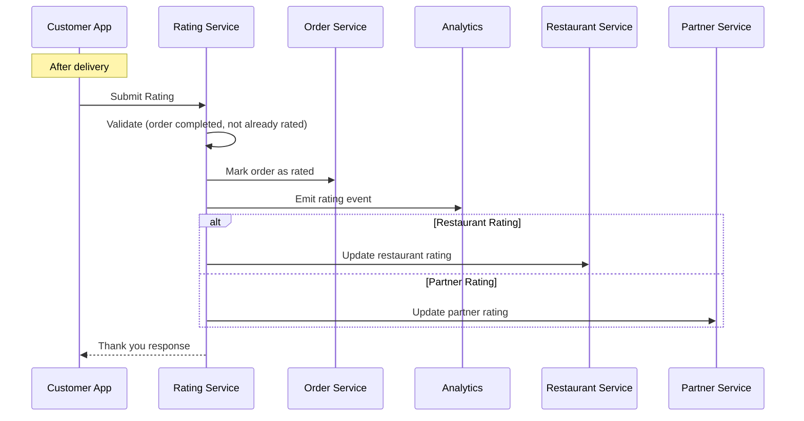

### Rating Data Model

```sql
CREATE TABLE ratings (
    id UUID PRIMARY KEY,
    order_id UUID UNIQUE NOT NULL,
    customer_id UUID NOT NULL,
    
    -- Restaurant rating
    restaurant_id UUID,
    restaurant_rating SMALLINT CHECK (restaurant_rating BETWEEN 1 AND 5),
    food_rating SMALLINT CHECK (food_rating BETWEEN 1 AND 5),
    packaging_rating SMALLINT CHECK (packaging_rating BETWEEN 1 AND 5),
    restaurant_review TEXT,
    
    -- Delivery rating
    partner_id UUID,
    delivery_rating SMALLINT CHECK (delivery_rating BETWEEN 1 AND 5),
    partner_review TEXT,
    
    -- Metadata
    tags TEXT[], -- ["friendly", "fast", "hygienic"]
    photo_urls TEXT[],
    is_published BOOLEAN DEFAULT true,
    
    created_at TIMESTAMP DEFAULT NOW()
);

-- Aggregated ratings (materialized/cached)
CREATE TABLE restaurant_rating_summary (
    restaurant_id UUID PRIMARY KEY,
    total_ratings INTEGER,
    avg_rating DECIMAL(3,2),
    rating_distribution JSONB, -- {1: 10, 2: 20, 3: 100, ...}
    avg_food_rating DECIMAL(3,2),
    avg_packaging_rating DECIMAL(3,2),
    top_tags JSONB,
    last_updated TIMESTAMP
);
```

### Rating Considerations

| Aspect | Implementation |
|--------|----------------|
| **Weighting** | Recent ratings weighted higher |
| **Minimum Reviews** | Show rating only after N reviews |
| **Fraud Prevention** | One rating per order, validated delivery |
| **Moderation** | Filter profanity, flag suspicious patterns |
| **Response Time** | Allow restaurant to respond to reviews |

---

## Data Infrastructure

### Database Selection

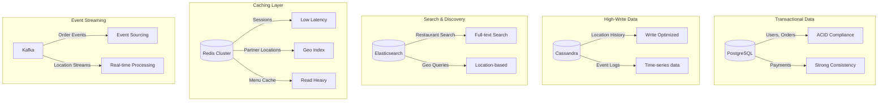

### Database by Use Case

| Data Type | Database | Reason |
|-----------|----------|--------|
| User profiles | PostgreSQL | ACID, relationships |
| Orders | PostgreSQL + Kafka | Transactions + events |
| Restaurant menus | PostgreSQL + Redis | Structure + fast reads |
| Partner locations | Redis (Geo) | Real-time, geospatial |
| Location history | Cassandra | High write throughput |
| Search index | Elasticsearch | Full-text, geo queries |
| Analytics | ClickHouse/Pinot | OLAP, aggregations |
| Session data | Redis | Low latency, TTL |

---

## Caching Strategy

### Multi-Layer Caching

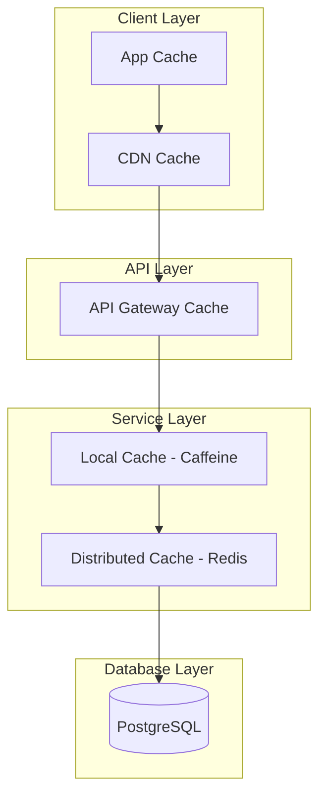

### Cache Configuration

| Data | Cache Location | TTL | Invalidation |
|------|---------------|-----|--------------|
| Restaurant list | CDN + Redis | 5 min | On update |
| Menu items | Redis | 15 min | On update |
| Restaurant details | Redis | 10 min | On update |
| User session | Redis | 24 hours | On logout |
| Partner location | Redis | 10 sec | On update |
| Search results | App + Redis | 1 min | Time-based |
| Static assets | CDN | 7 days | On deploy |

### Cache Patterns

```python
# Read-through cache pattern
async def get_restaurant(restaurant_id: str):
    # Try cache first
    cached = await redis.get(f"restaurant:{restaurant_id}")
    if cached:
        return json.loads(cached)
    
    # Cache miss - fetch from DB
    restaurant = await db.query(Restaurant).get(restaurant_id)
    
    # Store in cache
    await redis.setex(
        f"restaurant:{restaurant_id}",
        ttl=600,  # 10 minutes
        value=json.dumps(restaurant.dict())
    )
    
    return restaurant

# Write-through cache pattern
async def update_restaurant(restaurant_id: str, data: dict):
    # Update database
    await db.query(Restaurant).filter(id=restaurant_id).update(data)
    
    # Invalidate cache
    await redis.delete(f"restaurant:{restaurant_id}")
    
    # Optionally, update cache immediately
    updated = await db.query(Restaurant).get(restaurant_id)
    await redis.setex(
        f"restaurant:{restaurant_id}",
        ttl=600,
        value=json.dumps(updated.dict())
    )
```

---

## Technology Stack

### Backend Services

| Component | Technology |
|-----------|------------|
| **Primary Language** | Java (Spring Boot), Go, Python |
| **API Framework** | Spring Boot, FastAPI |
| **API Protocol** | REST, gRPC (internal) |
| **Message Queue** | Apache Kafka |
| **Service Discovery** | Consul / Kubernetes |
| **Load Balancer** | HAProxy, AWS ALB |
| **API Gateway** | Kong, Custom |

### Data Layer

| Component | Technology |
|-----------|------------|
| **Primary Database** | PostgreSQL |
| **NoSQL** | MongoDB, Cassandra |
| **Cache** | Redis Cluster |
| **Search** | Elasticsearch |
| **Analytics** | ClickHouse, Apache Pinot |
| **Data Warehouse** | Snowflake, BigQuery |

### Infrastructure

| Component | Technology |
|-----------|------------|
| **Cloud** | AWS, GCP |
| **Container** | Docker, Kubernetes |
| **CI/CD** | Jenkins, GitLab CI |
| **Monitoring** | Prometheus, Grafana |
| **Logging** | ELK Stack (Elasticsearch, Logstash, Kibana) |
| **Tracing** | Jaeger, Zipkin |
| **CDN** | CloudFront, Akamai |

### Mobile & Web

| Platform | Technology |
|----------|------------|
| **iOS** | Swift, SwiftUI |
| **Android** | Kotlin, Jetpack Compose |
| **Web** | React, Next.js |
| **Maps** | Google Maps, MapmyIndia |

---

## Key Design Patterns

### 1. Event-Driven Architecture

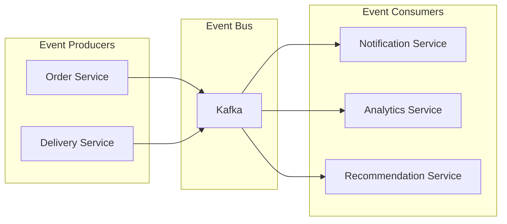

**Benefits:**
- Decoupled services
- Async processing
- Event replay for debugging
- Easy to add new consumers

### 2. Saga Pattern for Distributed Transactions

Used for order placement across multiple services:
1. Reserve inventory
2. Process payment
3. Confirm with restaurant
4. Assign delivery partner

Each step has a compensating action for rollback.

### 3. Circuit Breaker Pattern

```python
from circuitbreaker import circuit

@circuit(failure_threshold=5, recovery_timeout=30)
def call_payment_service(payment_request):
    return payment_client.process(payment_request)
```

**States:**
- **Closed**: Normal operation
- **Open**: Failing, reject calls immediately
- **Half-Open**: Testing if service recovered

### 4. CQRS (Command Query Responsibility Segregation)

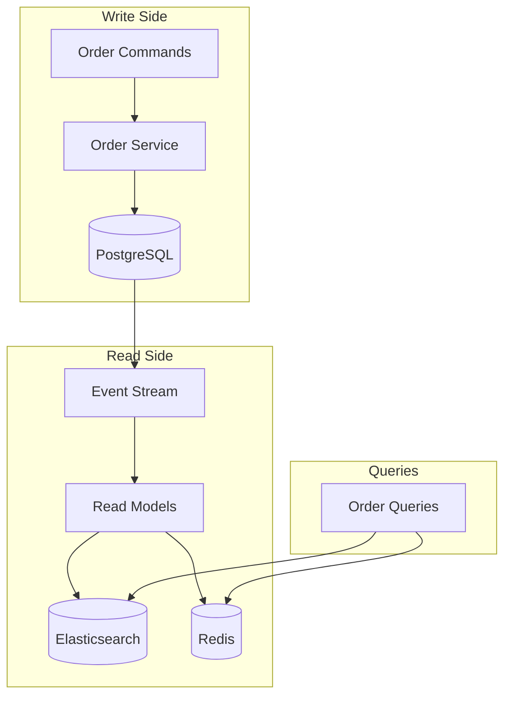

### 5. Rate Limiting

```python
# Token Bucket Algorithm
class RateLimiter:
    def __init__(self, capacity, refill_rate):
        self.capacity = capacity
        self.tokens = capacity
        self.refill_rate = refill_rate
        self.last_refill = time.time()
    
    def allow_request(self):
        self._refill()
        if self.tokens >= 1:
            self.tokens -= 1
            return True
        return False
    
    def _refill(self):
        now = time.time()
        elapsed = now - self.last_refill
        self.tokens = min(self.capacity, self.tokens + elapsed * self.refill_rate)
        self.last_refill = now
```

### 6. Consistent Hashing for Sharding

Used for:
- Distributing orders across partitions
- Session affinity
- Cache distribution

---

## Interview Talking Points

### Q: How would you handle peak traffic (lunch/dinner rush)?

1. **Auto-scaling**: Kubernetes HPA scales pods based on CPU/memory/custom metrics
2. **Load shedding**: Graceful degradation of non-critical features
3. **Rate limiting**: Protect backend from overwhelming traffic
4. **Circuit breakers**: Prevent cascading failures
5. **Pre-warming caches**: Anticipate demand patterns
6. **Queue-based buffering**: Kafka absorbs traffic spikes

### Q: How do you ensure order reliability?

1. **Saga pattern**: Distributed transaction with compensating actions
2. **Idempotency keys**: Prevent duplicate order creation
3. **Event sourcing**: Full audit trail of order lifecycle
4. **Retry with exponential backoff**: Handle transient failures
5. **Dead letter queues**: Capture failed events for investigation
6. **Multi-region deployment**: Disaster recovery

### Q: How do you handle real-time location tracking for millions of partners?

1. **Batched updates**: Aggregate GPS points (every 4 sec → batch every 2 sec)
2. **Redis GeoSpatial**: O(log N) for geo queries
3. **Kafka streaming**: Handle high-volume location events
4. **WebSocket connections**: Persistent connections for real-time push
5. **Location sampling**: Reduce update frequency when stationary
6. **Connection pooling**: Efficient resource utilization

### Q: How do you match orders to delivery partners efficiently?

1. **Geospatial indexing**: Redis GEOSEARCH for nearby partners
2. **Multi-factor scoring**: Distance, rating, heading, acceptance rate
3. **Constraint satisfaction**: Vehicle type, zone restrictions, max orders
4. **Machine learning**: Optimize for acceptance probability
5. **Broadcast vs single offer**: Based on urgency and demand
6. **Pre-assignment**: Assign before food is ready for long-prep orders

### Q: How do you handle restaurant search for millions of queries?

1. **Elasticsearch**: Full-text search with geo filtering
2. **Result caching**: Redis cache with short TTL
3. **Personalization**: User preferences and history
4. **Ranking algorithm**: Relevance + distance + rating + ETA
5. **Typeahead**: Elasticsearch autocomplete suggester
6. **Search analytics**: A/B test ranking algorithms

### Q: How do you prevent fraud in the platform?

| Fraud Type | Detection Method |
|------------|------------------|
| Fake orders | Device fingerprinting, behavioral analysis |
| GPS spoofing | Mock location detection, route validation |
| Payment fraud | ML models, velocity checks, CVV verification |
| Promo abuse | Account linking, device tracking |
| Partner collusion | Unusual pickup patterns, short trips |

---

## Comparison: Swiggy vs Zomato Architecture

| Aspect | Swiggy | Zomato |
|--------|--------|--------|
| **Primary Stack** | Java, Golang | Python, Java |
| **Database** | PostgreSQL, Cassandra | MySQL, MongoDB |
| **Search** | Elasticsearch | Elasticsearch |
| **Cloud** | AWS | AWS |
| **Maps** | Google Maps | Google Maps, MapmyIndia |
| **Unique Features** | Instamart (groceries), Swiggy One | Zomato Pro, Intercity (food travel) |
| **Delivery Model** | Own fleet + gig | Own fleet + gig |

---

## System Design Diagram (Complete)

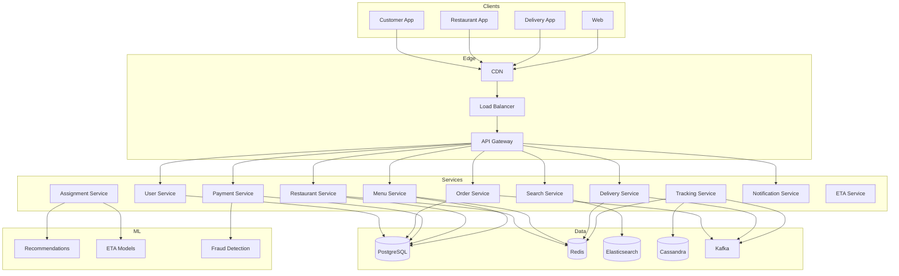

---

## References

### Official Engineering Blogs
- [Swiggy Engineering Blog](https://bytes.swiggy.com/)
- [Zomato Engineering Blog](https://www.zomato.com/blog/category/technology)
- [DoorDash Engineering Blog](https://doordash.engineering/)
- [Uber Eats Engineering](https://www.uber.com/blog/engineering/)

### Architecture Resources
- [Designing Data-Intensive Applications](https://dataintensive.net/)
- [System Design Interview - Alex Xu](https://www.amazon.com/System-Design-Interview-insiders-guide/dp/B08CMF2CQF)
- [Building Microservices - Sam Newman](https://www.oreilly.com/library/view/building-microservices-2nd/9781492034018/)

### Open Source Tools
- [Elasticsearch](https://github.com/elastic/elasticsearch) - Search engine
- [Apache Kafka](https://github.com/apache/kafka) - Event streaming
- [Redis](https://github.com/redis/redis) - In-memory data store

---

## Quick Revision Checklist

- [ ] **Scale**: 50M+ orders/month, 10K+ orders/second peak
- [ ] **Key Services**: Order, Restaurant, Delivery, Search, Payment, Notification
- [ ] **Order States**: Placed → Confirmed → Preparing → Ready → Picked → Delivered
- [ ] **Assignment Algo**: Geo-search + multi-factor scoring (distance, rating, heading)
- [ ] **Tracking**: GPS → WebSocket → Redis → Kafka → Customer
- [ ] **Search**: Elasticsearch with geo + text + ranking
- [ ] **Databases**: PostgreSQL (orders), Redis (cache/geo), Elasticsearch (search), Cassandra (history)
- [ ] **Patterns**: Event-driven, Saga, CQRS, Circuit Breaker
- [ ] **ETA**: Prep time + Assignment time + Pickup ETA + Delivery ETA
