[🏠 Home](../../README.md) | [➡️ JVM Architecture](./01-jvm-architecture.md)

# ☕ Java Internals Roadmap

> Master the JVM, Memory, GC, Collections, and Concurrency

---

## 🧠 Memory Hooks Summary

| Topic | Hook | Meaning |
|-------|------|---------|
| JDK/JRE/JVM | **"Kitchen → Plate → Food"** | JDK (tools) → JRE (runtime) → JVM (executor) |
| Heap Generations | **"ESO"** | Eden → Survivor → Old |
| GC Algorithms | **"SPCGZ"** | Serial, Parallel, CMS, G1, ZGC |
| Thread States | **"NRBWT"** | New, Runnable, Blocked, Waiting, Terminated |
| Collections | **"LSMQ"** | List, Set, Map, Queue |
| Concurrency | **"SVA"** | Synchronized, Volatile, Atomic |

---

## 📚 Learning Path

```mermaid
flowchart LR
    A[1️⃣ JVM] --> B[2️⃣ Memory]
    B --> C[3️⃣ GC]
    C --> D[4️⃣ JIT]
    D --> E[5️⃣ Collections]
    E --> F[6️⃣ Threads]
    F --> G[7️⃣ Concurrency]
```



---

## 📖 Study Plan

| Day | Topic | File | Time |
|-----|-------|------|------|
| 1 | JVM Architecture | [01-jvm-architecture.md](./01-jvm-architecture.md) | 1h |
| 2 | Memory Model | [02-memory-model.md](./02-memory-model.md) | 1.5h |
| 3 | Garbage Collection | [03-garbage-collection.md](./03-garbage-collection.md) | 1.5h |
| 4 | JIT Compilation | [04-jit-compilation.md](./04-jit-compilation.md) | 45m |
| 5 | Collections Framework | [05-collections-framework.md](./05-collections-framework.md) | 1h |
| 6 | Collections Internals | [06-collections-internals.md](./06-collections-internals.md) | 1.5h |
| 7 | Multithreading Basics | [07-multithreading-basics.md](./07-multithreading-basics.md) | 1.5h |
| 8 | Concurrency Advanced | [08-concurrency-advanced.md](./08-concurrency-advanced.md) | 2h |
| 9 | Concurrency Utilities | [09-concurrency-utilities.md](./09-concurrency-utilities.md) | 1h |
| 10 | Interview Q&A | [10-interview-qa.md](./10-interview-qa.md) | 1h |

---

## 🎯 Priority Tags

| Tag | Meaning |
|-----|---------|
| ⭐ | Must know for any Java interview |
| 🔥 | Frequently asked |
| 💡 | Good to know |

---

## 📊 Quick Reference Cards

### JVM Memory Areas
```
┌─────────────────────────────────────┐
│           METHOD AREA               │ ← Class metadata, static vars
├─────────────────────────────────────┤
│              HEAP                   │ ← Objects, arrays
│  ┌─────────────┬─────────────────┐  │
│  │ Young Gen   │    Old Gen      │  │
│  │ Eden+S0+S1  │                 │  │
│  └─────────────┴─────────────────┘  │
├─────────────────────────────────────┤
│   STACK (per thread)                │ ← Local vars, method calls
├─────────────────────────────────────┤
│   PC Register (per thread)          │ ← Current instruction
├─────────────────────────────────────┤
│   Native Method Stack (per thread)  │ ← Native calls
└─────────────────────────────────────┘
```

### Collections At-a-Glance
```
                  Collection
                      │
        ┌─────────────┼─────────────┐
        │             │             │
      List           Set           Map
        │             │             │
   ArrayList      HashSet       HashMap
   LinkedList    LinkedHashSet LinkedHashMap
                   TreeSet       TreeMap
```

---

*Start here: [JVM Architecture →](./01-jvm-architecture.md)*
