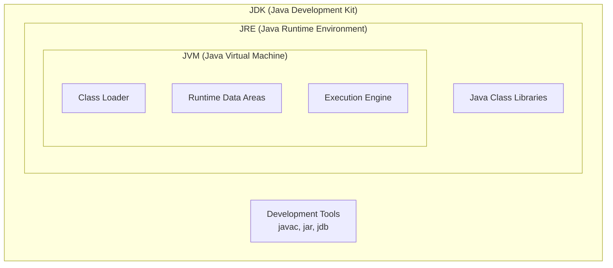
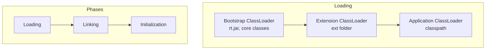
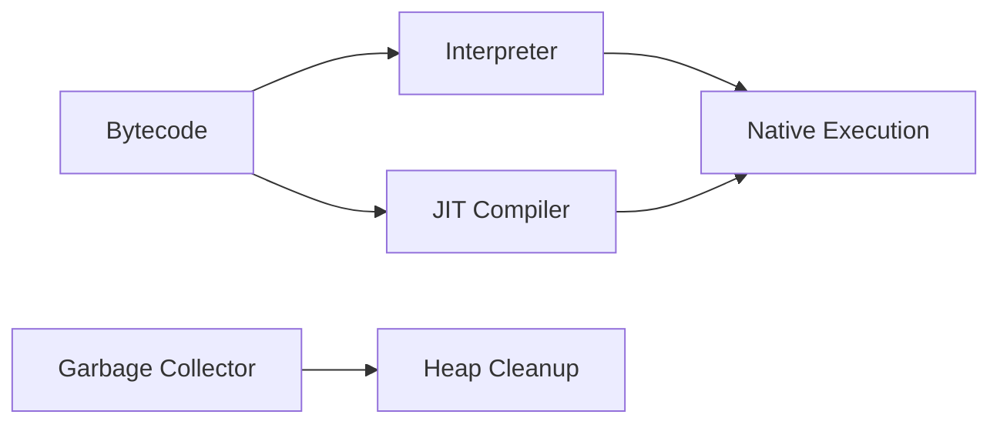

[🏠 Home](../../README.md) | [⬅️ Roadmap](./00-java-internals-roadmap.md) | [➡️ Memory Model](./02-memory-model.md)

# 🏗️ JVM Architecture

> Understanding how Java code runs

---

## 🧠 Memory Hook

> **"Kitchen → Plate → Food"**
> - **JDK** = Kitchen (has all the tools to cook)
> - **JRE** = Plate (just serves the food)
> - **JVM** = Food (the actual thing being consumed)

---

## 📊 JDK vs JRE vs JVM



| Component | Purpose | Contains |
|-----------|---------|----------|
| **JDK** | Development + Running | JRE + Compiler + Tools |
| **JRE** | Running only | JVM + Libraries |
| **JVM** | Bytecode execution | ClassLoader + Memory + Engine |

---

## 🔧 JVM Components

### 1. Class Loader Subsystem



**Loading Order** (Parent Delegation Model):
1. **Bootstrap** → Core Java classes (`java.lang.*`)
2. **Extension** → Extension libraries
3. **Application** → Your classes

**Linking Phases**:
- **Verify**: Check bytecode validity
- **Prepare**: Allocate memory for static vars (default values)
- **Resolve**: Replace symbolic references with direct references

---

### 2. Runtime Data Areas

```
┌─────────────────────────────────────────────────────┐
│                    JVM MEMORY                        │
├─────────────────────────────────────────────────────┤
│  SHARED (All Threads)                               │
│  ┌─────────────────────────────────────────────┐    │
│  │ Method Area (Metaspace in Java 8+)          │    │
│  │ • Class metadata, static variables          │    │
│  │ • Constant pool, method bytecode            │    │
│  ├─────────────────────────────────────────────┤    │
│  │ Heap                                        │    │
│  │ • All objects and arrays                    │    │
│  │ • Garbage collected                         │    │
│  └─────────────────────────────────────────────┘    │
├─────────────────────────────────────────────────────┤
│  PER-THREAD                                         │
│  ┌─────────┐ ┌─────────┐ ┌─────────┐               │
│  │ Stack   │ │ Stack   │ │ Stack   │  ...          │
│  │ PC Reg  │ │ PC Reg  │ │ PC Reg  │               │
│  │ Native  │ │ Native  │ │ Native  │               │
│  └─────────┘ └─────────┘ └─────────┘               │
└─────────────────────────────────────────────────────┘
```

| Area | Shared? | Contains | Error |
|------|---------|----------|-------|
| Method Area | ✅ | Class info, static vars | OutOfMemoryError |
| Heap | ✅ | Objects, arrays | OutOfMemoryError |
| Stack | ❌ | Frames, local vars | StackOverflowError |
| PC Register | ❌ | Current instruction | - |
| Native Stack | ❌ | Native method info | StackOverflowError |

---

### 3. Execution Engine



- **Interpreter**: Executes bytecode line by line (slow but starts fast)
- **JIT Compiler**: Compiles hot methods to native code (fast execution)
- **Garbage Collector**: Reclaims unused memory

---

## 💡 Interview Flash Cards

| Question | Answer |
|----------|--------|
| What is JVM? | Virtual machine that executes Java bytecode |
| JDK vs JRE? | JDK = JRE + Dev tools. JRE = JVM + Libraries |
| What is bytecode? | Platform-independent intermediate code (.class) |
| Why is Java platform independent? | Bytecode runs on any JVM implementation |
| What does ClassLoader do? | Loads .class files into memory |
| What is Parent Delegation? | Child asks parent first before loading class |
| Where are objects stored? | Heap (shared across threads) |
| Where are local variables? | Stack (per-thread) |

---

## ⚡ Key Points

- ⭐ JVM makes Java **"Write Once, Run Anywhere"**
- ⭐ **Heap** = Objects (shared), **Stack** = Local vars (per-thread)
- 🔥 ClassLoader uses **Parent Delegation** (security)
- 💡 Method Area is called **Metaspace** in Java 8+ (no PermGen limit)

---

*Next: [Memory Model →](./02-memory-model.md)*
